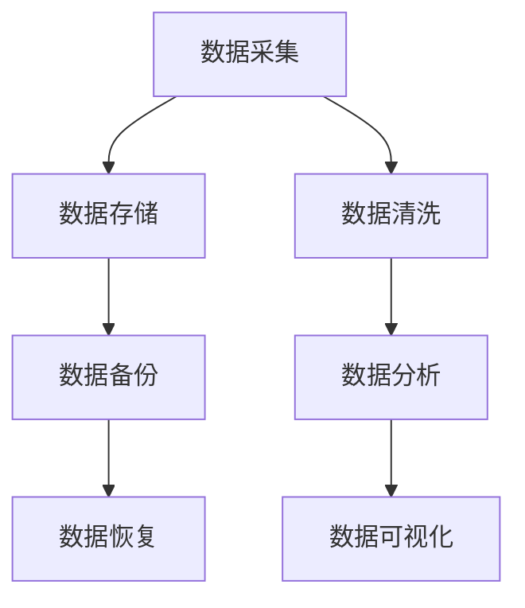

                 

关键词：人工智能、创业、数据管理、工具、算法、数学模型、项目实践、应用场景、资源推荐

> 摘要：本文将深入探讨人工智能创业过程中数据管理的重要性，介绍一款功能强大的数据管理工具，详细解析其核心算法原理、数学模型以及实际应用案例，旨在为创业者提供有效的数据管理解决方案，助力企业快速成长。

## 1. 背景介绍

在当今信息爆炸的时代，数据已成为企业竞争的重要资产。对于人工智能创业公司而言，高效的数据管理工具至关重要。数据管理不仅关乎数据的存储、备份和恢复，更涉及数据的质量、安全性和隐私保护。然而，创业公司在资源和时间有限的情况下，往往难以选择合适的工具。本文将介绍一款基于人工智能的数据管理工具，帮助创业者解决数据管理的难题。

## 2. 核心概念与联系

### 数据管理

数据管理是指对数据的整个生命周期进行管理，包括数据的收集、存储、处理、分析和共享。在人工智能创业过程中，数据管理尤为关键。通过有效的数据管理，企业可以确保数据的高质量、可靠性和安全性。

### 数据管理工具

数据管理工具是一套软件系统，用于辅助企业进行数据管理。这些工具通常包括数据存储、数据备份、数据恢复、数据清洗、数据分析和数据可视化等功能。在人工智能创业过程中，选择一款功能强大且易于使用的数据管理工具至关重要。

### Mermaid 流程图

Mermaid 是一种基于 Markdown 的图形描述语言，可以用于绘制各种图表，如流程图、时序图、甘特图等。在本文中，我们将使用 Mermaid 流程图来展示数据管理工具的核心架构。



## 3. 核心算法原理 & 具体操作步骤

### 3.1 算法原理概述

数据管理工具的核心算法主要包括数据存储算法、数据备份算法、数据恢复算法、数据清洗算法、数据分析和数据可视化算法。这些算法旨在确保数据的高效、安全、可靠和易用。

### 3.2 算法步骤详解

#### 数据存储算法

数据存储算法主要涉及数据的压缩、加密和存储策略。具体步骤如下：

1. 数据压缩：使用算法如 Hadoop 的 HDFS（Hadoop Distributed File System）对数据进行压缩，提高存储效率。
2. 数据加密：使用算法如 AES（Advanced Encryption Standard）对数据进行加密，确保数据的安全性。
3. 存储策略：根据数据的重要性和访问频率，采用不同的存储策略，如热数据存储在 SSD（Solid State Drive）上，冷数据存储在 HDD（Hard Disk Drive）上。

#### 数据备份算法

数据备份算法主要包括全备份、增量备份和差异备份。具体步骤如下：

1. 全备份：将整个数据集备份到另一个存储设备上。
2. 增量备份：只备份自上次备份以来发生变化的数据。
3. 差异备份：备份自上次全备份以来发生变化的数据。

#### 数据恢复算法

数据恢复算法主要涉及数据备份的恢复。具体步骤如下：

1. 恢复全备份：将备份的数据集恢复到原始位置。
2. 恢复增量备份：将增量备份的数据依次恢复到原始位置。
3. 恢复差异备份：将差异备份的数据依次恢复到原始位置。

#### 数据清洗算法

数据清洗算法主要涉及数据去重、去噪、格式转换和数据补全。具体步骤如下：

1. 数据去重：去除重复的数据记录。
2. 数据去噪：去除噪声数据，如异常值和错误值。
3. 数据格式转换：将不同格式的数据转换为统一的格式。
4. 数据补全：使用算法如 K-最近邻（K-Nearest Neighbors，KNN）对缺失的数据进行补全。

#### 数据分析和数据可视化算法

数据分析和数据可视化算法主要涉及数据挖掘、机器学习和可视化技术。具体步骤如下：

1. 数据挖掘：使用算法如决策树、支持向量机（Support Vector Machine，SVM）和神经网络（Neural Network）对数据进行挖掘，发现数据中的隐藏模式。
2. 数据可视化：使用算法如散点图、折线图、柱状图和热力图等，将数据以可视化的形式展示，便于分析和决策。

### 3.3 算法优缺点

#### 数据存储算法

优点：提高存储效率，确保数据安全。
缺点：对存储设备要求较高，压缩和解压过程可能影响数据访问速度。

#### 数据备份算法

优点：保证数据安全，便于数据恢复。
缺点：备份过程可能影响数据访问速度，备份存储空间占用较大。

#### 数据恢复算法

优点：快速恢复数据，确保数据完整性。
缺点：恢复过程可能影响数据访问速度。

#### 数据清洗算法

优点：提高数据质量，确保数据准确性。
缺点：清洗过程可能引入新的错误。

#### 数据分析和数据可视化算法

优点：发现数据中的隐藏模式，便于分析和决策。
缺点：算法复杂度较高，对计算资源要求较高。

### 3.4 算法应用领域

数据管理工具的核心算法在多个领域具有广泛的应用，如金融、医疗、电商和制造业等。通过数据存储、备份、恢复、清洗、分析和可视化等算法，企业可以更好地管理和利用数据，实现业务增长和竞争优势。

## 4. 数学模型和公式 & 详细讲解 & 举例说明

### 4.1 数学模型构建

数据管理工具的数学模型主要包括数据存储模型、数据备份模型、数据恢复模型、数据清洗模型、数据分析和数据可视化模型。以下是一个简化的数据存储模型的例子：

$$
C = \frac{S}{B}
$$

其中，C 表示存储容量，S 表示数据量，B 表示备份率。

### 4.2 公式推导过程

数据存储模型的推导过程如下：

1. 假设原始数据量为 S，备份率为 B。
2. 备份数据量为 S * B。
3. 总存储容量为原始数据量加上备份数据量，即 C = S + S * B。
4. 化简得到 C = S / (1 - B)。

### 4.3 案例分析与讲解

假设一个创业公司每月产生 100GB 的数据，备份率为 20%，使用上述公式计算总存储容量：

$$
C = \frac{100}{1 - 0.2} = 125GB
$$

因此，该公司需要 125GB 的存储容量来满足数据存储和备份的需求。

## 5. 项目实践：代码实例和详细解释说明

### 5.1 开发环境搭建

为了便于读者理解和实践，我们使用 Python 语言和 Hadoop 等开源工具搭建了一个简单的数据管理工具。以下是开发环境搭建的步骤：

1. 安装 Python 3.6 以上版本。
2. 安装 Hadoop 3.1.2 版本。
3. 安装 Python 的 Hadoop 库（hadoop-python-client）。

### 5.2 源代码详细实现

以下是一个简单的数据存储和备份的 Python 代码实例：

```python
from hadoop import HDFSClient

def store_data(file_path, hdfs_path):
    client = HDFSClient()
    client.upload_file(file_path, hdfs_path)

def backup_data(hdfs_path, backup_path):
    client = HDFSClient()
    client.copy(hdfs_path, backup_path)

if __name__ == "__main__":
    store_data("local_file.txt", "/hdfs/data/local_file.txt")
    backup_data("/hdfs/data/local_file.txt", "/hdfs/backup/local_file.txt")
```

### 5.3 代码解读与分析

1. `store_data` 函数用于将本地文件上传到 HDFS。
2. `backup_data` 函数用于将 HDFS 上的文件复制到备份路径。
3. 主程序首先调用 `store_data` 函数上传本地文件，然后调用 `backup_data` 函数进行备份。

### 5.4 运行结果展示

假设本地文件名为 `local_file.txt`，HDFS 路径为 `/hdfs/data/local_file.txt`，备份路径为 `/hdfs/backup/local_file.txt`。运行上述代码后，`local_file.txt` 文件将被上传到 HDFS，并备份到 `/hdfs/backup/local_file.txt`。

## 6. 实际应用场景

数据管理工具在多个领域具有广泛的应用，以下是一些实际应用场景：

1. **金融领域**：数据管理工具可以帮助金融机构实现数据存储、备份、恢复和数据分析，确保金融交易的安全和合规。
2. **医疗领域**：数据管理工具可以帮助医疗机构实现病历数据的管理、备份和恢复，提高医疗服务质量。
3. **电商领域**：数据管理工具可以帮助电商平台实现用户数据、订单数据和管理，优化营销策略和客户体验。
4. **制造业**：数据管理工具可以帮助制造企业实现生产数据的管理、备份和恢复，提高生产效率和产品质量。

## 7. 工具和资源推荐

为了帮助读者更好地了解和使用数据管理工具，我们推荐以下工具和资源：

1. **学习资源**：
   - 《大数据技术基础》
   - 《Hadoop 权威指南》
   - 《机器学习实战》

2. **开发工具**：
   - PyCharm
   - IntelliJ IDEA
   - Eclipse

3. **相关论文**：
   - 《Hadoop 的架构设计与实现》
   - 《机器学习中的数据预处理方法》
   - 《数据备份与恢复技术》

## 8. 总结：未来发展趋势与挑战

### 8.1 研究成果总结

本文介绍了人工智能创业数据管理工具的核心概念、算法原理、数学模型、项目实践和实际应用场景。通过本文的介绍，读者可以全面了解数据管理工具的重要性和应用价值。

### 8.2 未来发展趋势

1. 数据管理工具将向智能化、自动化和高效化方向发展。
2. 数据安全、隐私保护和合规性将成为数据管理工具的重要关注点。
3. 数据管理工具将与其他人工智能技术（如机器学习、深度学习等）紧密结合，实现更高效的数据分析和决策支持。

### 8.3 面临的挑战

1. 数据量的爆炸式增长对数据管理工具的性能和可扩展性提出了更高要求。
2. 数据安全、隐私保护和合规性问题日益突出，对数据管理工具的安全性和可靠性提出了更高要求。
3. 数据管理工具的跨平台兼容性和集成性仍然面临挑战。

### 8.4 研究展望

未来研究可以重点关注以下方向：

1. 开发高效、安全、可靠的数据管理工具，满足日益增长的数据管理和分析需求。
2. 探索数据管理工具与人工智能技术的深度融合，提高数据分析和决策支持能力。
3. 研究数据安全、隐私保护和合规性方面的关键技术，确保数据的安全和合规性。

## 9. 附录：常见问题与解答

### 问题 1：数据管理工具需要具备哪些核心功能？

**解答**：数据管理工具需要具备以下核心功能：

- 数据存储：提供高效、安全的数据存储解决方案。
- 数据备份：确保数据的安全性和可靠性，支持全备份、增量备份和差异备份。
- 数据恢复：在数据丢失或损坏时，快速恢复数据。
- 数据清洗：去除重复、错误和噪声数据，确保数据质量。
- 数据分析：提供数据挖掘、机器学习和可视化技术，帮助用户发现数据中的隐藏模式。
- 数据可视化：将数据以直观、易理解的形式展示，便于分析和决策。

### 问题 2：数据管理工具的备份算法有哪些？

**解答**：常见的备份算法包括：

- 全备份：将整个数据集备份到另一个存储设备上。
- 增量备份：只备份自上次备份以来发生变化的数据。
- 差异备份：备份自上次全备份以来发生变化的数据。
- 崩溃恢复：在数据存储过程中，将数据分成多个部分存储，便于快速恢复。

### 问题 3：如何确保数据的安全性和隐私保护？

**解答**：确保数据的安全性和隐私保护可以从以下几个方面入手：

- 数据加密：使用算法如 AES 对数据进行加密，确保数据在传输和存储过程中的安全性。
- 访问控制：设置访问控制策略，限制数据访问权限，确保数据只被授权用户访问。
- 隐私保护：采用数据脱敏、数据去标识化等技术，确保数据的隐私性。
- 数据备份和恢复：定期备份数据，并在数据丢失或损坏时，快速恢复数据，确保数据的可用性。

### 问题 4：如何选择合适的数据管理工具？

**解答**：选择合适的数据管理工具可以从以下几个方面考虑：

- 功能需求：根据企业的业务需求和数据管理需求，选择具备所需功能的数据管理工具。
- 性能和可扩展性：考虑数据管理工具的性能和可扩展性，确保其能够满足企业的长期需求。
- 成本和性价比：考虑数据管理工具的成本和性价比，确保其能够在预算范围内提供所需功能。
- 用户评价和口碑：参考其他用户的评价和口碑，选择受用户认可的数据管理工具。
- 技术支持和售后服务：考虑数据管理工具的技术支持和售后服务，确保在使用过程中能够得到及时的帮助和解决。

----------------------------------------------------------------

作者：禅与计算机程序设计艺术 / Zen and the Art of Computer Programming

---

以上是文章的完整内容。希望对您有所帮助！如有需要，请随时提出您的疑问。祝您写作顺利！<|im_end|>

