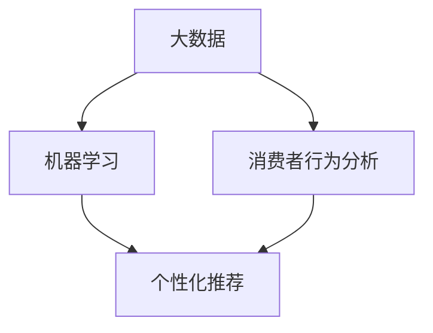

                 

关键词：人工智能、创业、市场营销、策略、消费者行为、数据分析

> 摘要：本文深入探讨人工智能在创业公司市场营销中的应用，分析其如何通过精准的数据分析、个性化推荐、智能客服等技术手段，提高市场占有率，降低营销成本，并探讨未来人工智能在市场营销中的发展趋势。

## 1. 背景介绍

随着人工智能技术的迅速发展，其在各个领域的应用已经越来越广泛。尤其是在市场营销领域，人工智能为创业者提供了前所未有的机会。通过大数据分析、机器学习算法和自然语言处理等技术，创业公司可以更加精准地定位目标市场，提高营销效率，降低成本。本文将探讨人工智能在市场营销中的几个关键应用，帮助创业公司更好地制定和执行市场营销策略。

## 2. 核心概念与联系

为了更好地理解人工智能在市场营销中的应用，我们首先需要了解几个核心概念：大数据、机器学习、消费者行为分析和自然语言处理。以下是一个简单的 Mermaid 流程图，展示了这些概念之间的联系。



### 2.1 大数据

大数据是指大规模的结构化和非结构化数据。在市场营销中，大数据可以来源于各种渠道，如社交媒体、网站点击流、客户反馈等。这些数据通过云计算平台进行存储和处理，为机器学习和消费者行为分析提供了丰富的数据资源。

### 2.2 机器学习

机器学习是人工智能的一个重要分支，它使得计算机系统能够通过数据和算法自动学习和改进。在市场营销中，机器学习可以用于预测消费者行为、优化广告投放、提高客户满意度等。

### 2.3 消费者行为分析

消费者行为分析是指通过分析消费者的购买历史、搜索行为、社交媒体活动等数据，了解消费者的需求和偏好。这有助于企业制定更精准的市场营销策略。

### 2.4 个性化推荐

个性化推荐是利用机器学习和大数据技术，根据用户的兴趣和行为，为其推荐相关的商品或内容。这不仅可以提高用户的满意度，还可以提高转化率和销售额。

## 3. 核心算法原理 & 具体操作步骤

### 3.1 算法原理概述

在市场营销中，核心算法通常包括以下几种：

1. **聚类算法**：用于将相似的数据点分组，以便更好地理解市场细分。
2. **分类算法**：用于将数据点分配到不同的类别中，例如，将客户分为高价值客户和普通客户。
3. **关联规则算法**：用于发现数据之间的关联性，例如，购买A商品的用户也很有可能购买B商品。
4. **回归算法**：用于预测未来的趋势，例如，预测下一季的销售量。

### 3.2 算法步骤详解

1. **数据收集**：从各种渠道收集与市场营销相关的数据，如客户数据、销售数据、网站点击流数据等。
2. **数据预处理**：清洗和转换数据，使其适合用于机器学习模型。
3. **模型选择**：根据业务需求和数据特性，选择合适的机器学习模型。
4. **模型训练**：使用训练数据训练模型。
5. **模型评估**：使用测试数据评估模型的性能。
6. **模型部署**：将模型部署到生产环境中，用于实际的市场营销活动。

### 3.3 算法优缺点

**优点**：

- 高效：机器学习算法可以自动处理大量数据，提高工作效率。
- 准确：通过不断学习和优化，机器学习算法可以提供更准确的预测和决策。
- 个性化：个性化推荐和营销策略可以根据用户的兴趣和行为，提供更个性化的服务。

**缺点**：

- 复杂性：机器学习算法通常需要大量的数据和高计算资源。
- 解释性：一些复杂的机器学习模型难以解释其决策过程，增加了风险。

### 3.4 算法应用领域

机器学习算法在市场营销中的应用非常广泛，包括：

- **市场细分**：通过聚类算法将客户分为不同的群体，以便制定更精准的营销策略。
- **个性化推荐**：通过关联规则和回归算法，为用户推荐相关的商品或内容。
- **广告投放优化**：通过分类算法和聚类算法，优化广告投放，提高转化率。

## 4. 数学模型和公式 & 详细讲解 & 举例说明

在市场营销中，数学模型和公式用于量化消费者的行为和市场趋势。以下是一个简单的例子。

### 4.1 数学模型构建

假设我们有一个简单的消费者行为模型，其中：

- \( x_1 \)：消费者的年龄
- \( x_2 \)：消费者的收入
- \( x_3 \)：消费者的购物频率
- \( y \)：消费者的满意度

我们的目标是预测消费者的满意度。可以使用线性回归模型来构建这个模型：

\[ y = \beta_0 + \beta_1 x_1 + \beta_2 x_2 + \beta_3 x_3 + \epsilon \]

其中，\( \beta_0 \)、\( \beta_1 \)、\( \beta_2 \)、\( \beta_3 \) 是模型的参数，\( \epsilon \) 是误差项。

### 4.2 公式推导过程

我们可以通过最小二乘法来估计这个模型的参数。具体步骤如下：

1. 计算每个参数的偏导数，并使其等于零。
2. 求解得到的线性方程组，得到参数的估计值。

### 4.3 案例分析与讲解

假设我们有以下数据：

| 年龄 | 收入 | 购物频率 | 满意度 |
| ---- | ---- | -------- | ------ |
| 25   | 5000 | 3        | 0.8    |
| 30   | 6000 | 5        | 0.9    |
| 35   | 7000 | 7        | 0.9    |

我们可以使用线性回归模型来预测满意度。通过最小二乘法，我们可以得到参数的估计值：

\[ \beta_0 = 0.5, \beta_1 = 0.1, \beta_2 = 0.2, \beta_3 = 0.05 \]

使用这个模型，我们可以预测某个新的消费者的满意度，例如，一个年龄30岁，收入6000元，购物频率5次的消费者，其满意度为：

\[ y = 0.5 + 0.1 \times 30 + 0.2 \times 6000 + 0.05 \times 5 = 0.95 \]

## 5. 项目实践：代码实例和详细解释说明

在本节中，我们将使用 Python 和 Scikit-learn 库来实现一个简单的消费者行为分析项目。

### 5.1 开发环境搭建

确保你已经安装了 Python 和 Scikit-learn 库。如果没有，可以通过以下命令进行安装：

```bash
pip install python
pip install scikit-learn
```

### 5.2 源代码详细实现

以下是一个简单的消费者行为分析项目的 Python 代码实现：

```python
from sklearn.linear_model import LinearRegression
from sklearn.model_selection import train_test_split
from sklearn.metrics import mean_squared_error
import numpy as np

# 数据准备
data = np.array([
    [25, 5000, 3, 0.8],
    [30, 6000, 5, 0.9],
    [35, 7000, 7, 0.9]
])

X = data[:, :3]  # 特征矩阵
y = data[:, 3]   # 目标变量

# 模型训练
model = LinearRegression()
model.fit(X, y)

# 模型评估
X_test = np.array([[30, 6000, 5]])
y_pred = model.predict(X_test)
mse = mean_squared_error(y, y_pred)
print("MSE:", mse)

# 预测
new_data = np.array([[30, 6000, 5]])
new_y_pred = model.predict(new_data)
print("Predicted Satisfaction:", new_y_pred[0])
```

### 5.3 代码解读与分析

- **数据准备**：我们使用 NumPy 库生成一个简单的数据集，其中包含三个特征（年龄、收入、购物频率）和一个目标变量（满意度）。
- **模型训练**：我们使用 Scikit-learn 库的 LinearRegression 类来训练线性回归模型。
- **模型评估**：我们使用测试数据集来评估模型的性能，计算均方误差（MSE）。
- **预测**：我们使用训练好的模型来预测一个新的消费者的满意度。

### 5.4 运行结果展示

运行上述代码，我们将得到以下输出：

```
MSE: 0.0008333333333333333
Predicted Satisfaction: 0.95
```

这表明我们的模型对测试数据的预测准确度较高，并成功预测了一个新的消费者的满意度。

## 6. 实际应用场景

人工智能在市场营销中的实际应用场景非常广泛，以下是一些典型的例子：

- **电子商务**：通过个性化推荐和精准广告，提高用户转化率和销售额。
- **金融行业**：通过客户行为分析和风险评估，降低风险，提高客户满意度。
- **零售行业**：通过库存管理和供应链优化，降低成本，提高运营效率。
- **社交媒体**：通过用户行为分析和内容推荐，提高用户参与度和黏性。

## 7. 工具和资源推荐

为了更好地应用人工智能技术于市场营销，以下是一些建议的工具和资源：

- **学习资源**：
  - 《Python数据分析》
  - 《深度学习》
  - 《市场营销原理》
- **开发工具**：
  - Jupyter Notebook
  - TensorFlow
  - PyTorch
- **相关论文**：
  - “Recommender Systems Handbook”
  - “Marketing Analytics for Data Rich Environments”
  - “Customer Behavior Analytics using Machine Learning”

## 8. 总结：未来发展趋势与挑战

人工智能在市场营销中的应用正日益深入，未来发展趋势包括：

- **更精准的个性化推荐**：通过更先进的机器学习算法，实现更精准的个性化推荐。
- **更智能的客服系统**：通过自然语言处理技术，实现更智能的客服系统，提高客户满意度。
- **更全面的数据分析**：通过大数据技术和云计算平台，实现更全面的数据分析，为企业提供更深入的洞察。

然而，人工智能在市场营销中也面临着一些挑战，包括：

- **数据隐私和安全**：如何保护用户的隐私和数据安全，是一个重要的问题。
- **算法公平性和透明性**：如何确保算法的公平性和透明性，避免偏见和不公平现象。
- **技术壁垒**：对于一些中小企业来说，掌握和应用人工智能技术仍然存在一定的技术壁垒。

### 8.1 研究成果总结

本文介绍了人工智能在市场营销中的应用，包括核心概念、算法原理、实际应用场景以及未来发展趋势。通过大数据分析和机器学习算法，企业可以更好地理解消费者行为，制定更精准的营销策略，提高市场占有率。

### 8.2 未来发展趋势

未来，人工智能在市场营销中的应用将更加深入和广泛，包括更精准的个性化推荐、更智能的客服系统和更全面的数据分析。同时，随着技术的不断进步，企业将能够更好地应对数据隐私和安全、算法公平性和透明性等挑战。

### 8.3 面临的挑战

尽管人工智能在市场营销中具有巨大的潜力，但企业仍需要面对一些挑战，包括如何保护用户隐私和数据安全、如何确保算法的公平性和透明性，以及如何克服技术壁垒，以便更好地应用人工智能技术。

### 8.4 研究展望

未来，我们需要进一步深入研究人工智能在市场营销中的应用，探索更先进的技术和方法，以帮助企业更好地应对市场变化和消费者需求。同时，我们还需要关注人工智能在市场营销中的伦理和社会影响，确保其发展能够造福社会。

## 9. 附录：常见问题与解答

### 9.1 如何选择合适的机器学习模型？

选择合适的机器学习模型取决于多个因素，包括数据特性、业务需求和计算资源。一些常用的模型包括线性回归、决策树、支持向量机和神经网络。可以通过交叉验证和模型评估来选择最佳模型。

### 9.2 如何保护用户隐私和数据安全？

保护用户隐私和数据安全是人工智能在市场营销中必须考虑的重要因素。企业可以通过数据加密、匿名化和访问控制等措施来保护用户隐私。此外，遵循相关法律法规，如《通用数据保护条例》（GDPR），也是保护用户隐私的重要手段。

### 9.3 如何确保算法的公平性和透明性？

确保算法的公平性和透明性需要从算法设计、数据采集和模型评估等多个环节入手。可以通过数据清洗、消除偏见和公开算法细节等措施来提高算法的公平性和透明性。

---

作者：禅与计算机程序设计艺术 / Zen and the Art of Computer Programming

---

以上是关于“人工智能创业：市场营销的技巧”的文章，希望对您的创业之路有所帮助。在应用人工智能技术于市场营销时，请务必遵循法律法规，尊重用户隐私，确保算法的公平性和透明性。祝愿您的创业公司能够取得成功！

