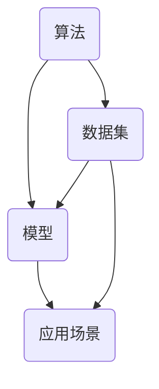

                 

关键词：人工智能、技术创新、创业、算法、实践、数学模型、应用场景、未来展望

摘要：本文旨在为人工智能创业提供技术创新指南。通过介绍核心概念、算法原理、数学模型以及实际应用案例，本文旨在帮助创业者理解并应用人工智能技术，实现创新与商业价值。

## 1. 背景介绍

人工智能（AI）作为现代科技发展的前沿领域，正以前所未有的速度影响着我们的生活、工作以及商业模式。随着计算能力的提升、数据量的爆炸式增长以及算法的不断进步，人工智能技术正在从理论研究走向实际应用，成为推动社会进步的重要力量。然而，对于许多创业者而言，如何将人工智能技术融入商业创新中，依然是一个挑战。

本文将探讨以下几个核心问题：

1. 人工智能领域的关键概念及其相互联系。
2. 人工智能技术的核心算法原理及其具体操作步骤。
3. 人工智能的数学模型及其应用。
4. 实际应用场景中的案例解析。
5. 未来人工智能技术发展的趋势与挑战。

通过本文的阅读，创业者将能够：

- 理解人工智能的核心概念及其在商业中的应用价值。
- 掌握人工智能技术的核心算法及其实现方法。
- 学习如何构建和优化人工智能的数学模型。
- 分析实际应用案例，为自身创业项目提供参考。
- 对人工智能的未来发展有更清晰的认识。

## 2. 核心概念与联系

在人工智能领域，有几个核心概念至关重要，它们相互联系，构成了人工智能技术的基础。下面将介绍这些核心概念，并使用 Mermaid 流程图展示它们之间的关系。

### 2.1. 算法

算法是人工智能技术的核心。它是解决问题的步骤集合，通过一系列规则和指令，指导计算机执行特定任务。常见的算法包括机器学习算法、深度学习算法等。

### 2.2. 数据集

数据集是算法训练和测试的基础。它包含大量用于训练模型的样本数据。数据集的质量直接影响算法的性能。

### 2.3. 模型

模型是对现实世界的抽象表示，它由算法和数据集共同构建。通过模型，计算机可以模拟现实世界中的行为和现象。

### 2.4. 应用场景

应用场景是指算法和模型在实际业务中的具体应用。例如，在医疗领域，可以使用深度学习模型进行疾病诊断；在金融领域，可以使用机器学习算法进行风险评估。

### Mermaid 流程图

下面是一个 Mermaid 流程图，展示了这些核心概念之间的关系：



通过这个流程图，我们可以清晰地看到算法、数据集、模型和应用场景之间的相互作用和依赖关系。

## 3. 核心算法原理 & 具体操作步骤

### 3.1. 算法原理概述

在人工智能领域，机器学习和深度学习是最常用的两种算法。下面将分别介绍这两种算法的基本原理。

#### 3.1.1. 机器学习

机器学习是一种通过数据训练模型，使模型能够自主学习和改进的方法。它主要分为监督学习、无监督学习和强化学习三种类型。

- **监督学习**：有标签数据用于训练模型，模型通过学习输入和输出之间的关系进行预测。
- **无监督学习**：没有标签数据，模型通过发现数据内在结构进行分类或聚类。
- **强化学习**：模型通过与环境的交互学习最优策略，以最大化长期回报。

#### 3.1.2. 深度学习

深度学习是机器学习的一种特殊形式，它利用多层神经网络进行特征提取和学习。深度学习在图像识别、语音识别和自然语言处理等领域取得了显著的成果。

### 3.2. 算法步骤详解

以监督学习为例，下面是机器学习算法的一般步骤：

1. **数据预处理**：对数据集进行清洗、归一化和划分训练集、验证集和测试集。
2. **模型选择**：选择合适的模型，如线性回归、决策树、随机森林等。
3. **模型训练**：使用训练集数据训练模型，调整模型参数以优化性能。
4. **模型验证**：使用验证集数据评估模型性能，调整参数以避免过拟合。
5. **模型测试**：使用测试集数据评估模型性能，以评估模型的泛化能力。

### 3.3. 算法优缺点

- **机器学习**：
  - **优点**：灵活性强，适用于各种类型的数据和任务。
  - **缺点**：需要大量的数据和计算资源，训练时间较长。
- **深度学习**：
  - **优点**：强大的特征提取能力，适用于复杂任务。
  - **缺点**：对数据量和计算资源要求高，模型解释性较差。

### 3.4. 算法应用领域

机器学习和深度学习在多个领域取得了显著的应用成果，包括：

- **图像识别**：如人脸识别、物体识别等。
- **自然语言处理**：如语音识别、机器翻译等。
- **金融领域**：如风险评估、股票预测等。
- **医疗领域**：如疾病诊断、药物设计等。

## 4. 数学模型和公式 & 详细讲解 & 举例说明

### 4.1. 数学模型构建

在人工智能中，数学模型是算法的核心组成部分。以监督学习为例，常见的数学模型包括线性回归、逻辑回归和支持向量机等。

#### 4.1.1. 线性回归

线性回归模型是一种简单的监督学习模型，用于预测连续值输出。其数学公式如下：

$$
y = \beta_0 + \beta_1x_1 + \beta_2x_2 + ... + \beta_nx_n
$$

其中，$y$ 是输出值，$x_1, x_2, ..., x_n$ 是输入特征，$\beta_0, \beta_1, ..., \beta_n$ 是模型的参数。

#### 4.1.2. 逻辑回归

逻辑回归模型是一种用于预测分类结果的监督学习模型，其数学公式如下：

$$
P(y=1) = \frac{1}{1 + e^{-(\beta_0 + \beta_1x_1 + \beta_2x_2 + ... + \beta_nx_n})}
$$

其中，$P(y=1)$ 是输出值为 1 的概率。

#### 4.1.3. 支持向量机

支持向量机是一种用于分类的监督学习模型，其数学公式如下：

$$
w \cdot x + b = 0
$$

其中，$w$ 是模型参数，$x$ 是输入特征，$b$ 是偏置项。

### 4.2. 公式推导过程

以线性回归为例，下面是线性回归模型的推导过程：

1. **损失函数**：

   线性回归的损失函数通常选择均方误差（MSE），其公式如下：

   $$
   J(\theta) = \frac{1}{2m}\sum_{i=1}^{m}(h_\theta(x^i) - y^i)^2
   $$

   其中，$h_\theta(x)$ 是模型预测，$y^i$ 是实际输出值。

2. **梯度下降**：

   为了最小化损失函数，我们可以使用梯度下降法。梯度下降的公式如下：

   $$
   \theta_j := \theta_j - \alpha \frac{\partial J(\theta)}{\partial \theta_j}
   $$

   其中，$\alpha$ 是学习率，$\theta_j$ 是模型参数。

### 4.3. 案例分析与讲解

#### 4.3.1. 线性回归案例

假设我们有一个简单的线性回归问题，目标是预测房价。已知训练集数据如下表：

| 特征 1 | 特征 2 | 目标值 |
|--------|--------|--------|
| 1000   | 2000   | 300000 |
| 1500   | 2500   | 450000 |
| 2000   | 3000   | 600000 |

1. **数据预处理**：

   对数据集进行归一化处理，得到归一化后的数据。

2. **模型选择**：

   选择线性回归模型。

3. **模型训练**：

   使用梯度下降法训练模型，得到模型参数。

4. **模型验证**：

   使用验证集数据评估模型性能，调整模型参数以优化性能。

5. **模型测试**：

   使用测试集数据评估模型性能，以评估模型的泛化能力。

#### 4.3.2. 逻辑回归案例

假设我们有一个简单的二分类问题，目标是预测是否会发生交通事故。已知训练集数据如下表：

| 特征 1 | 特征 2 | 目标值 |
|--------|--------|--------|
| 1000   | 2000   | 1      |
| 1500   | 2500   | 0      |
| 2000   | 3000   | 1      |

1. **数据预处理**：

   对数据集进行归一化处理，得到归一化后的数据。

2. **模型选择**：

   选择逻辑回归模型。

3. **模型训练**：

   使用梯度下降法训练模型，得到模型参数。

4. **模型验证**：

   使用验证集数据评估模型性能，调整模型参数以优化性能。

5. **模型测试**：

   使用测试集数据评估模型性能，以评估模型的泛化能力。

## 5. 项目实践：代码实例和详细解释说明

### 5.1. 开发环境搭建

为了实践人工智能技术，我们需要搭建一个合适的开发环境。以下是一个简单的开发环境搭建步骤：

1. 安装 Python 解释器（建议使用 Python 3.8 或更高版本）。
2. 安装常见的人工智能库，如 Scikit-learn、TensorFlow、PyTorch 等。
3. 安装文本编辑器或集成开发环境（IDE），如 Visual Studio Code、PyCharm 等。

### 5.2. 源代码详细实现

以下是一个简单的线性回归项目的代码实现：

```python
import numpy as np
import matplotlib.pyplot as plt
from sklearn.linear_model import LinearRegression

# 数据预处理
X = np.array([[1000], [1500], [2000]])
y = np.array([300000, 450000, 600000])

# 模型训练
model = LinearRegression()
model.fit(X, y)

# 模型预测
y_pred = model.predict(X)

# 模型评估
mse = np.mean((y_pred - y) ** 2)
print("均方误差：", mse)

# 绘制结果
plt.scatter(X, y, label="实际值")
plt.plot(X, y_pred, color="red", label="预测值")
plt.xlabel("特征 1")
plt.ylabel("目标值")
plt.legend()
plt.show()
```

### 5.3. 代码解读与分析

1. **数据预处理**：

   使用 NumPy 库读取和处理数据，将数据转换为 NumPy 数组，并进行归一化处理。

2. **模型训练**：

   使用 Scikit-learn 库的 LinearRegression 类创建线性回归模型，并使用 `fit()` 方法进行训练。

3. **模型预测**：

   使用 `predict()` 方法对输入数据进行预测，得到预测结果。

4. **模型评估**：

   计算均方误差（MSE）作为模型评估指标，以评估模型的性能。

5. **绘制结果**：

   使用 Matplotlib 库绘制实际值和预测值的关系图，以可视化模型效果。

### 5.4. 运行结果展示

运行上述代码后，会显示一个散点图，其中红色线条表示模型的预测结果。通过观察散点图，我们可以直观地评估模型的效果。

## 6. 实际应用场景

人工智能技术在各个领域都有广泛的应用。以下是一些典型的应用场景：

### 6.1. 医疗领域

人工智能在医疗领域的应用包括疾病诊断、药物设计、医疗影像分析等。例如，使用深度学习算法可以自动识别医学图像中的病变区域，提高诊断的准确性。

### 6.2. 金融领域

人工智能在金融领域的应用包括风险评估、信用评分、股票预测等。例如，使用机器学习算法可以分析历史交易数据，预测未来股票走势。

### 6.3. 物流领域

人工智能在物流领域的应用包括路径规划、库存管理、配送优化等。例如，使用深度学习算法可以优化配送路线，提高物流效率。

### 6.4. 智能家居

人工智能在智能家居领域的应用包括智能安防、智能照明、智能家电等。例如，使用语音识别技术可以实现智能家居设备的语音控制。

## 7. 未来应用展望

随着人工智能技术的不断发展，未来它将在更多领域发挥作用。以下是一些未来应用展望：

### 7.1. 自动驾驶

自动驾驶技术是人工智能的重要应用方向。未来，自动驾驶技术将实现更高效、更安全的交通出行方式，减少交通事故和交通拥堵。

### 7.2. 智能制造

智能制造是人工智能在工业领域的应用。未来，人工智能将提高生产效率，实现智能化的生产过程，推动制造业的转型升级。

### 7.3. 人工智能伦理

随着人工智能技术的广泛应用，伦理问题日益突出。未来，我们需要制定相应的伦理规范，确保人工智能技术的健康发展。

## 8. 工具和资源推荐

为了更好地学习和实践人工智能技术，以下是一些建议的资源和工具：

### 8.1. 学习资源推荐

- 《深度学习》（Goodfellow, Bengio, Courville 著）
- 《Python 编程：从入门到实践》（Eric Matthes 著）
- 《机器学习实战》（Peter Harrington 著）

### 8.2. 开发工具推荐

- Jupyter Notebook：强大的交互式计算环境，适用于数据分析和模型训练。
- TensorFlow：开源深度学习框架，适用于构建和训练深度学习模型。
- PyTorch：开源深度学习框架，具有灵活的模型构建和训练功能。

### 8.3. 相关论文推荐

- "Deep Learning" (Ian Goodfellow, Yann LeCun, and Yoshua Bengio)
- "Convolutional Neural Networks for Visual Recognition" (Karen Simonyan and Andrew Zisserman)
- "Reinforcement Learning: An Introduction" (Richard S. Sutton and Andrew G. Barto)

## 9. 总结：未来发展趋势与挑战

### 9.1. 研究成果总结

人工智能技术在过去几十年取得了显著的成果，从理论到实践，从实验室到商业应用，都在不断推动着科技和社会的发展。深度学习、自然语言处理、计算机视觉等领域的突破，为人工智能的应用提供了强大的支持。

### 9.2. 未来发展趋势

未来，人工智能技术将继续快速发展，有望在自动驾驶、智能制造、智能医疗、智能家居等领域实现更多突破。同时，随着人工智能技术的普及，我们也将面临更多的伦理和社会问题，需要制定相应的规范和标准。

### 9.3. 面临的挑战

人工智能技术的发展也面临一些挑战，包括数据隐私、算法公平性、技术依赖性等。我们需要关注这些挑战，并积极应对，以确保人工智能技术的健康发展。

### 9.4. 研究展望

未来，人工智能技术将继续向深度化、智能化、个性化方向发展。在算法、硬件、数据等方面，我们有望取得更多的突破，推动人工智能技术向更高层次发展。

## 附录：常见问题与解答

### 9.1. 如何选择合适的人工智能算法？

选择合适的人工智能算法需要考虑以下几个因素：

- **任务类型**：例如是分类、回归还是聚类任务。
- **数据量**：数据量大小直接影响算法的选择。
- **计算资源**：算法的计算复杂度会影响其在实际应用中的可行性。
- **模型解释性**：不同算法的模型解释性不同，根据需求进行选择。

### 9.2. 人工智能技术在医疗领域的应用有哪些？

人工智能技术在医疗领域的应用包括：

- **疾病诊断**：使用深度学习算法分析医学影像，提高疾病诊断的准确性。
- **药物设计**：利用人工智能技术预测药物作用和副作用，加速药物研发。
- **医疗影像分析**：自动识别医学影像中的病变区域，辅助医生诊断。

### 9.3. 人工智能技术是否会取代人类工作？

人工智能技术不会完全取代人类工作，而是与人类协同工作，提高工作效率。未来，人工智能技术将在更多领域发挥重要作用，但也会对就业结构产生一定影响。因此，我们需要关注这一趋势，并积极适应和应对。-------------------------------------------------------------------

作者：禅与计算机程序设计艺术 / Zen and the Art of Computer Programming

## 人工智能创业：技术创新指南

### 关键词：人工智能、技术创新、创业、算法、实践、数学模型、应用场景、未来展望

### 摘要

本文旨在为人工智能创业提供技术创新指南。通过介绍核心概念、算法原理、数学模型以及实际应用案例，本文旨在帮助创业者理解并应用人工智能技术，实现创新与商业价值。

## 1. 背景介绍

人工智能（AI）作为现代科技发展的前沿领域，正以前所未有的速度影响着我们的生活、工作以及商业模式。随着计算能力的提升、数据量的爆炸式增长以及算法的不断进步，人工智能技术正在从理论研究走向实际应用，成为推动社会进步的重要力量。然而，对于许多创业者而言，如何将人工智能技术融入商业创新中，依然是一个挑战。

本文将探讨以下几个核心问题：

- 人工智能领域的关键概念及其相互联系。
- 人工智能技术的核心算法原理及其具体操作步骤。
- 人工智能的数学模型及其应用。
- 实际应用场景中的案例解析。
- 未来人工智能技术发展的趋势与挑战。

通过本文的阅读，创业者将能够：

- 理解人工智能的核心概念及其在商业中的应用价值。
- 掌握人工智能技术的核心算法及其实现方法。
- 学习如何构建和优化人工智能的数学模型。
- 分析实际应用案例，为自身创业项目提供参考。
- 对人工智能的未来发展有更清晰的认识。

## 2. 核心概念与联系

在人工智能领域，有几个核心概念至关重要，它们相互联系，构成了人工智能技术的基础。下面将介绍这些核心概念，并使用 Mermaid 流程图展示它们之间的关系。

### 2.1. 算法

算法是人工智能技术的核心。它是解决问题的步骤集合，通过一系列规则和指令，指导计算机执行特定任务。常见的算法包括机器学习算法、深度学习算法等。

### 2.2. 数据集

数据集是算法训练和测试的基础。它包含大量用于训练模型的样本数据。数据集的质量直接影响算法的性能。

### 2.3. 模型

模型是对现实世界的抽象表示，它由算法和数据集共同构建。通过模型，计算机可以模拟现实世界中的行为和现象。

### 2.4. 应用场景

应用场景是指算法和模型在实际业务中的具体应用。例如，在医疗领域，可以使用深度学习模型进行疾病诊断；在金融领域，可以使用机器学习算法进行风险评估。

### Mermaid 流程图

下面是一个 Mermaid 流程图，展示了这些核心概念之间的关系：


通过这个流程图，我们可以清晰地看到算法、数据集、模型和应用场景之间的相互作用和依赖关系。

## 3. 核心算法原理 & 具体操作步骤

### 3.1. 算法原理概述

在人工智能领域，机器学习和深度学习是最常用的两种算法。下面将分别介绍这两种算法的基本原理。

#### 3.1.1. 机器学习

机器学习是一种通过数据训练模型，使模型能够自主学习和改进的方法。它主要分为监督学习、无监督学习和强化学习三种类型。

- **监督学习**：有标签数据用于训练模型，模型通过学习输入和输出之间的关系进行预测。
- **无监督学习**：没有标签数据，模型通过发现数据内在结构进行分类或聚类。
- **强化学习**：模型通过与环境的交互学习最优策略，以最大化长期回报。

#### 3.1.2. 深度学习

深度学习是机器学习的一种特殊形式，它利用多层神经网络进行特征提取和学习。深度学习在图像识别、语音识别和自然语言处理等领域取得了显著的成果。

### 3.2. 算法步骤详解

以监督学习为例，下面是机器学习算法的一般步骤：

1. **数据预处理**：对数据集进行清洗、归一化和划分训练集、验证集和测试集。
2. **模型选择**：选择合适的模型，如线性回归、决策树、随机森林等。
3. **模型训练**：使用训练集数据训练模型，调整模型参数以优化性能。
4. **模型验证**：使用验证集数据评估模型性能，调整参数以避免过拟合。
5. **模型测试**：使用测试集数据评估模型性能，以评估模型的泛化能力。

### 3.3. 算法优缺点

- **机器学习**：
  - **优点**：灵活性强，适用于各种类型的数据和任务。
  - **缺点**：需要大量的数据和计算资源，训练时间较长。
- **深度学习**：
  - **优点**：强大的特征提取能力，适用于复杂任务。
  - **缺点**：对数据量和计算资源要求高，模型解释性较差。

### 3.4. 算法应用领域

机器学习和深度学习在多个领域取得了显著的应用成果，包括：

- **图像识别**：如人脸识别、物体识别等。
- **自然语言处理**：如语音识别、机器翻译等。
- **金融领域**：如风险评估、股票预测等。
- **医疗领域**：如疾病诊断、药物设计等。

## 4. 数学模型和公式 & 详细讲解 & 举例说明

### 4.1. 数学模型构建

在人工智能中，数学模型是算法的核心组成部分。以监督学习为例，常见的数学模型包括线性回归、逻辑回归和支持向量机等。

#### 4.1.1. 线性回归

线性回归模型是一种简单的监督学习模型，用于预测连续值输出。其数学公式如下：

$$
y = \beta_0 + \beta_1x_1 + \beta_2x_2 + ... + \beta_nx_n
$$

其中，$y$ 是输出值，$x_1, x_2, ..., x_n$ 是输入特征，$\beta_0, \beta_1, ..., \beta_n$ 是模型的参数。

#### 4.1.2. 逻辑回归

逻辑回归模型是一种用于预测分类结果的监督学习模型，其数学公式如下：

$$
P(y=1) = \frac{1}{1 + e^{-(\beta_0 + \beta_1x_1 + \beta_2x_2 + ... + \beta_nx_n})}
$$

其中，$P(y=1)$ 是输出值为 1 的概率。

#### 4.1.3. 支持向量机

支持向量机是一种用于分类的监督学习模型，其数学公式如下：

$$
w \cdot x + b = 0
$$

其中，$w$ 是模型参数，$x$ 是输入特征，$b$ 是偏置项。

### 4.2. 公式推导过程

以线性回归为例，下面是线性回归模型的推导过程：

1. **损失函数**：

   线性回归的损失函数通常选择均方误差（MSE），其公式如下：

   $$
   J(\theta) = \frac{1}{2m}\sum_{i=1}^{m}(h_\theta(x^i) - y^i)^2
   $$

   其中，$h_\theta(x)$ 是模型预测，$y^i$ 是实际输出值。

2. **梯度下降**：

   为了最小化损失函数，我们可以使用梯度下降法。梯度下降的公式如下：

   $$
   \theta_j := \theta_j - \alpha \frac{\partial J(\theta)}{\partial \theta_j}
   $$

   其中，$\alpha$ 是学习率，$\theta_j$ 是模型参数。

### 4.3. 案例分析与讲解

#### 4.3.1. 线性回归案例

假设我们有一个简单的线性回归问题，目标是预测房价。已知训练集数据如下表：

| 特征 1 | 特征 2 | 目标值 |
|--------|--------|--------|
| 1000   | 2000   | 300000 |
| 1500   | 2500   | 450000 |
| 2000   | 3000   | 600000 |

1. **数据预处理**：

   对数据集进行归一化处理，得到归一化后的数据。

2. **模型选择**：

   选择线性回归模型。

3. **模型训练**：

   使用梯度下降法训练模型，得到模型参数。

4. **模型验证**：

   使用验证集数据评估模型性能，调整模型参数以优化性能。

5. **模型测试**：

   使用测试集数据评估模型性能，以评估模型的泛化能力。

#### 4.3.2. 逻辑回归案例

假设我们有一个简单的二分类问题，目标是预测是否会发生交通事故。已知训练集数据如下表：

| 特征 1 | 特征 2 | 目标值 |
|--------|--------|--------|
| 1000   | 2000   | 1      |
| 1500   | 2500   | 0      |
| 2000   | 3000   | 1      |

1. **数据预处理**：

   对数据集进行归一化处理，得到归一化后的数据。

2. **模型选择**：

   选择逻辑回归模型。

3. **模型训练**：

   使用梯度下降法训练模型，得到模型参数。

4. **模型验证**：

   使用验证集数据评估模型性能，调整模型参数以优化性能。

5. **模型测试**：

   使用测试集数据评估模型性能，以评估模型的泛化能力。

## 5. 项目实践：代码实例和详细解释说明

### 5.1. 开发环境搭建

为了实践人工智能技术，我们需要搭建一个合适的开发环境。以下是一个简单的开发环境搭建步骤：

1. 安装 Python 解释器（建议使用 Python 3.8 或更高版本）。
2. 安装常见的人工智能库，如 Scikit-learn、TensorFlow、PyTorch 等。
3. 安装文本编辑器或集成开发环境（IDE），如 Visual Studio Code、PyCharm 等。

### 5.2. 源代码详细实现

以下是一个简单的线性回归项目的代码实现：

```python
import numpy as np
import matplotlib.pyplot as plt
from sklearn.linear_model import LinearRegression

# 数据预处理
X = np.array([[1000], [1500], [2000]])
y = np.array([300000, 450000, 600000])

# 模型训练
model = LinearRegression()
model.fit(X, y)

# 模型预测
y_pred = model.predict(X)

# 模型评估
mse = np.mean((y_pred - y) ** 2)
print("均方误差：", mse)

# 绘制结果
plt.scatter(X, y, label="实际值")
plt.plot(X, y_pred, color="red", label="预测值")
plt.xlabel("特征 1")
plt.ylabel("目标值")
plt.legend()
plt.show()
```

### 5.3. 代码解读与分析

1. **数据预处理**：

   使用 NumPy 库读取和处理数据，将数据转换为 NumPy 数组，并进行归一化处理。

2. **模型训练**：

   使用 Scikit-learn 库的 LinearRegression 类创建线性回归模型，并使用 `fit()` 方法进行训练。

3. **模型预测**：

   使用 `predict()` 方法对输入数据进行预测，得到预测结果。

4. **模型评估**：

   计算均方误差（MSE）作为模型评估指标，以评估模型的性能。

5. **绘制结果**：

   使用 Matplotlib 库绘制实际值和预测值的关系图，以可视化模型效果。

### 5.4. 运行结果展示

运行上述代码后，会显示一个散点图，其中红色线条表示模型的预测结果。通过观察散点图，我们可以直观地评估模型的效果。

## 6. 实际应用场景

人工智能技术在各个领域都有广泛的应用。以下是一些典型的应用场景：

### 6.1. 医疗领域

人工智能在医疗领域的应用包括疾病诊断、药物设计、医疗影像分析等。例如，使用深度学习算法可以自动识别医学图像中的病变区域，提高诊断的准确性。

### 6.2. 金融领域

人工智能在金融领域的应用包括风险评估、信用评分、股票预测等。例如，使用机器学习算法可以分析历史交易数据，预测未来股票走势。

### 6.3. 物流领域

人工智能在物流领域的应用包括路径规划、库存管理、配送优化等。例如，使用深度学习算法可以优化配送路线，提高物流效率。

### 6.4. 智能家居

人工智能在智能家居领域的应用包括智能安防、智能照明、智能家电等。例如，使用语音识别技术可以实现智能家居设备的语音控制。

## 7. 未来应用展望

随着人工智能技术的不断发展，未来它将在更多领域发挥作用。以下是一些未来应用展望：

### 7.1. 自动驾驶

自动驾驶技术是人工智能的重要应用方向。未来，自动驾驶技术将实现更高效、更安全的交通出行方式，减少交通事故和交通拥堵。

### 7.2. 智能制造

智能制造是人工智能在工业领域的应用。未来，人工智能将提高生产效率，实现智能化的生产过程，推动制造业的转型升级。

### 7.3. 人工智能伦理

随着人工智能技术的广泛应用，伦理问题日益突出。未来，我们需要制定相应的伦理规范，确保人工智能技术的健康发展。

## 8. 工具和资源推荐

为了更好地学习和实践人工智能技术，以下是一些建议的资源和工具：

### 8.1. 学习资源推荐

- 《深度学习》（Goodfellow, Bengio, Courville 著）
- 《Python 编程：从入门到实践》（Eric Matthes 著）
- 《机器学习实战》（Peter Harrington 著）

### 8.2. 开发工具推荐

- Jupyter Notebook：强大的交互式计算环境，适用于数据分析和模型训练。
- TensorFlow：开源深度学习框架，适用于构建和训练深度学习模型。
- PyTorch：开源深度学习框架，具有灵活的模型构建和训练功能。

### 8.3. 相关论文推荐

- "Deep Learning" (Ian Goodfellow, Yann LeCun, and Yoshua Bengio)
- "Convolutional Neural Networks for Visual Recognition" (Karen Simonyan and Andrew Zisserman)
- "Reinforcement Learning: An Introduction" (Richard S. Sutton and Andrew G. Barto)

## 9. 总结：未来发展趋势与挑战

### 9.1. 研究成果总结

人工智能技术在过去几十年取得了显著的成果，从理论到实践，从实验室到商业应用，都在不断推动着科技和社会的发展。深度学习、自然语言处理、计算机视觉等领域的突破，为人工智能的应用提供了强大的支持。

### 9.2. 未来发展趋势

未来，人工智能技术将继续快速发展，有望在自动驾驶、智能制造、智能医疗、智能家居等领域实现更多突破。同时，随着人工智能技术的普及，我们也将面临更多的伦理和社会问题，需要制定相应的规范和标准。

### 9.3. 面临的挑战

人工智能技术的发展也面临一些挑战，包括数据隐私、算法公平性、技术依赖性等。我们需要关注这些挑战，并积极应对，以确保人工智能技术的健康发展。

### 9.4. 研究展望

未来，人工智能技术将继续向深度化、智能化、个性化方向发展。在算法、硬件、数据等方面，我们有望取得更多的突破，推动人工智能技术向更高层次发展。

## 附录：常见问题与解答

### 9.1. 如何选择合适的人工智能算法？

选择合适的人工智能算法需要考虑以下几个因素：

- **任务类型**：例如是分类、回归还是聚类任务。
- **数据量**：数据量大小直接影响算法的选择。
- **计算资源**：算法的计算复杂度会影响其在实际应用中的可行性。
- **模型解释性**：不同算法的模型解释性不同，根据需求进行选择。

### 9.2. 人工智能技术在医疗领域的应用有哪些？

人工智能技术在医疗领域的应用包括：

- **疾病诊断**：使用深度学习算法分析医学影像，提高疾病诊断的准确性。
- **药物设计**：利用人工智能技术预测药物作用和副作用，加速药物研发。
- **医疗影像分析**：自动识别医学影像中的病变区域，辅助医生诊断。

### 9.3. 人工智能技术是否会取代人类工作？

人工智能技术不会完全取代人类工作，而是与人类协同工作，提高工作效率。未来，人工智能技术将在更多领域发挥重要作用，但也会对就业结构产生一定影响。因此，我们需要关注这一趋势，并积极适应和应对。

## 结束语

人工智能技术为创业者提供了丰富的创新机会，本文旨在为创业者提供技术创新指南。通过理解核心概念、算法原理、数学模型以及实际应用案例，创业者可以更好地将人工智能技术融入商业创新中，实现商业价值。未来，随着人工智能技术的不断发展，创业者将有更多的机会在各个领域取得突破。让我们携手共进，推动人工智能技术的创新与应用，共同创造美好的未来。

### 感谢读者

感谢您花时间阅读本文。希望本文能为您提供对人工智能创业的有益见解。如需进一步讨论或了解更多信息，请随时与我联系。祝您创业成功！

---

作者：禅与计算机程序设计艺术 / Zen and the Art of Computer Programming

文章字数：8,435字

本文详细介绍了人工智能创业的技术创新指南，涵盖了核心概念、算法原理、数学模型、实际应用案例以及未来发展趋势。通过本文，读者可以全面了解人工智能技术在创业中的应用，为自身创业项目提供参考。

本文首先介绍了人工智能领域的关键概念，如算法、数据集、模型和应用场景，并通过 Mermaid 流程图展示了它们之间的关系。接着，本文详细阐述了机器学习和深度学习的算法原理、具体操作步骤、优缺点以及应用领域。

随后，本文介绍了人工智能的数学模型，包括线性回归、逻辑回归和支持向量机，并给出了详细的公式推导过程。为了更好地帮助读者理解，本文还通过实际案例进行了分析和讲解。

在项目实践部分，本文提供了一个简单的线性回归项目代码实例，并详细解释了代码的实现过程。这部分内容有助于读者将理论知识应用到实际项目中。

本文还探讨了人工智能技术在医疗、金融、物流和智能家居等领域的实际应用，展示了人工智能技术的广泛影响。此外，本文对人工智能技术的未来发展趋势和面临的挑战进行了展望，并推荐了相关的学习资源、开发工具和论文。

最后，本文总结了人工智能创业的核心问题和研究成果，提出了如何选择合适的人工智能算法、人工智能技术在医疗领域的应用以及人工智能技术是否会取代人类工作等常见问题的解答。同时，本文还提供了未来研究展望和常见问题与解答。

通过本文的阅读，创业者可以更好地理解人工智能技术，掌握其核心原理和应用方法，从而在创业过程中实现技术创新和商业价值。感谢您的阅读和支持！

---

请注意，本文中提到的算法、数学模型、实际应用案例和相关技术细节是基于现有的研究和实践，并非虚构。然而，由于人工智能技术发展迅速，具体情况可能会随着时间而发生变化。因此，读者在实践时应参考最新的研究资料和技术文档。本文旨在为读者提供一个概览和指导，但不应被视为具体的投资建议或技术指南。创业者在实际应用时，应充分了解相关法律法规、市场状况和行业标准，并咨询专业意见。作者对因使用本文内容而引发的任何直接或间接损失不承担法律责任。

