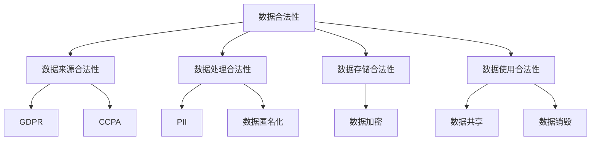

                 

关键词：人工智能，数据合法性，创业，数据隐私，合规性，技术解决方案。

> 摘要：本文旨在探讨人工智能创业过程中如何确保数据合法性。从数据来源、处理、存储到应用，本文将详细分析确保数据合法性的核心原则、技术方法和实际操作步骤，为人工智能创业者提供实用的指导。

## 1. 背景介绍

随着人工智能技术的快速发展，越来越多的企业开始探索人工智能在业务中的应用。然而，人工智能的发展离不开大量高质量的数据，这些数据往往涉及用户隐私、商业秘密等敏感信息。如何确保数据合法性，不仅关系到企业的合规运营，也关系到用户的权益保护和社会信任。本文将从以下几个方面展开讨论：

1. 数据合法性的核心原则和法律法规要求。
2. 数据采集和处理中的技术挑战和解决方案。
3. 数据存储和使用的合规性实践。
4. 数据安全与隐私保护的关键技术和策略。
5. 人工智能创业中的数据合规性案例分析。

## 2. 核心概念与联系

为了更好地理解数据合法性的概念和其在人工智能创业中的应用，我们需要了解以下几个核心概念：

### 2.1 数据合法性

数据合法性是指数据在收集、处理、存储和使用过程中符合相关法律法规和标准的要求。它包括数据来源的合法性、数据处理过程的合法性、数据存储的合法性以及数据使用的合法性。

### 2.2 GDPR

GDPR（通用数据保护条例）是欧盟于2018年5月25日生效的一项数据保护法规，旨在加强欧盟境内个人数据的保护。它对数据控制者和处理者提出了严格的要求，包括数据收集的合法性、数据主体的知情权、数据处理的透明度等。

### 2.3 CCPA

CCPA（加州消费者隐私法案）是加州于2020年生效的一项数据保护法案，旨在保护加州居民的个人信息。它与GDPR类似，对数据收集、处理、存储和使用提出了严格的要求。

### 2.4 PII

PII（个人身份信息）是指能够识别个人身份的信息，如姓名、地址、电话号码、电子邮件地址、身份证号码等。

### 2.5 数据匿名化

数据匿名化是一种数据保护技术，通过去除或修改个人身份信息，使数据无法直接识别特定个人，从而保护个人隐私。

### 2.6 数据加密

数据加密是一种数据保护技术，通过将数据转换为加密形式，只有拥有密钥的用户才能解密和访问数据，从而保护数据的安全性。

下面是一个简单的 Mermaid 流程图，展示了数据合法性相关的核心概念和它们之间的联系：



## 3. 核心算法原理 & 具体操作步骤

### 3.1 算法原理概述

确保数据合法性涉及多个方面，其中核心算法原理主要包括数据匿名化、数据加密和数据隐私保护。下面分别介绍这些算法的原理。

#### 3.1.1 数据匿名化

数据匿名化是一种常用的数据保护技术，通过去除或修改个人身份信息，使数据无法直接识别特定个人。常见的匿名化方法包括：

- **K-匿名性**：在数据集中，任意一个记录的K个邻居都不包含任何其他记录。
- **l-diversity**：在数据集中，任意一个记录的l个邻居都包含至少l个不同的记录。
- **t-closeness**：在数据集中，任意一个记录的t个邻居在属性上的分布与整个数据集的分布相似。

#### 3.1.2 数据加密

数据加密是一种通过将数据转换为加密形式来保护数据安全的技术。常见的加密算法包括：

- **对称加密**：使用相同的密钥进行加密和解密，如AES（高级加密标准）。
- **非对称加密**：使用一对密钥进行加密和解密，如RSA（RSA加密算法）。
- **哈希函数**：将输入数据映射到固定长度的字符串，如SHA-256。

#### 3.1.3 数据隐私保护

数据隐私保护是指通过技术手段保护个人隐私，防止个人隐私被泄露或滥用。常见的隐私保护技术包括：

- **差分隐私**：通过在数据中加入随机噪声，使数据集的统计属性发生微小变化，从而保护个体隐私。
- **同态加密**：允许对加密数据进行计算，而不需要解密数据，从而保护数据隐私。

### 3.2 算法步骤详解

#### 3.2.1 数据匿名化步骤

1. 收集数据：获取需要匿名化的数据集。
2. 确定匿名化标准：根据数据类型和业务需求，选择合适的匿名化标准，如K-匿名性、l-diversity、t-closeness。
3. 应用匿名化算法：使用匿名化算法对数据进行处理，例如使用K-匿名算法对数据集进行处理。
4. 验证匿名化效果：对匿名化后的数据集进行验证，确保满足匿名化标准。

#### 3.2.2 数据加密步骤

1. 选择加密算法：根据数据类型和安全性要求，选择合适的加密算法，如AES、RSA。
2. 生成密钥：使用加密算法生成密钥对，包括公钥和私钥。
3. 加密数据：使用公钥对数据进行加密。
4. 存储密钥：将密钥安全存储，例如使用密钥管理服务。
5. 解密数据：使用私钥对加密数据进行解密。

#### 3.2.3 数据隐私保护步骤

1. 收集数据：获取需要隐私保护的数据集。
2. 应用隐私保护算法：使用差分隐私、同态加密等隐私保护算法对数据进行处理。
3. 验证隐私保护效果：对隐私保护后的数据集进行验证，确保满足隐私保护要求。

### 3.3 算法优缺点

#### 3.3.1 数据匿名化

优点：

- 可以有效保护个人隐私。
- 可以提高数据集的可用性，方便数据分析和应用。

缺点：

- 可能会降低数据集的完整性。
- 可能会影响数据分析的准确性。

#### 3.3.2 数据加密

优点：

- 可以有效保护数据的安全性和完整性。
- 可以防止数据泄露和篡改。

缺点：

- 加密和解密过程会增加计算和通信开销。
- 加密密钥的安全管理是一个挑战。

#### 3.3.3 数据隐私保护

优点：

- 可以在数据分析和应用过程中保护个人隐私。
- 可以提高数据的安全性和合规性。

缺点：

- 可能会影响数据分析的效率和准确性。
- 需要复杂的隐私保护算法和架构。

### 3.4 算法应用领域

数据匿名化、数据加密和数据隐私保护在人工智能创业中有着广泛的应用领域，如：

- **用户行为分析**：通过对用户行为数据进行分析，为企业提供决策支持。
- **医疗数据分析**：通过对医疗数据进行处理，提高医疗服务的质量和效率。
- **金融风控**：通过对金融数据进行处理，提高金融风险的管理和控制。
- **智能推荐系统**：通过对用户数据进行处理，为用户推荐合适的商品或服务。

## 4. 数学模型和公式 & 详细讲解 & 举例说明

### 4.1 数学模型构建

数据合法性涉及多个数学模型，主要包括：

1. **K-匿名模型**：给定一个数据表T，一个记录r是K-匿名的，如果r的K个邻居中不包含其他记录。记为`r ≈ₖ r'`，表示r和r'是K-匿名的。
2. **l-diversity模型**：给定一个数据表T，一个记录r是l-diverse的，如果r的l个邻居中的每个记录在某个属性上的取值都不少于l个不同的值。记为`r ≈ₗ r'`，表示r和r'是l-diverse的。
3. **t-closeness模型**：给定一个数据表T，一个记录r是t-cLOSE的，如果r的t个邻居在某个属性上的取值与整个数据集在该属性上的取值之间的差异不超过t%。记为`r ≈ₜ r'`，表示r和r'是t-cLOSE的。

### 4.2 公式推导过程

以K-匿名模型为例，给定一个数据表T，一个记录r，其K个邻居为N(r)。要使r是K-匿名的，需要满足：

$$  
N(r) \cap T \setminus \{r\} = \emptyset  
$$

其中，`N(r)`表示r的邻居集合，`T \setminus \{r\}`表示去除r后的数据表T。

### 4.3 案例分析与讲解

假设有一个包含100个记录的数据表T，其中记录r的邻居集合N(r)包含5个记录。为了使r是K-匿名的，需要满足上述条件。具体步骤如下：

1. 检查N(r)是否与T \setminus \{r\}有交集。
2. 如果有交集，调整N(r)中的记录，使其与T \setminus \{r\}无交集。
3. 重复步骤1和2，直到满足K-匿名条件。

在实际应用中，通常使用启发式算法来优化匿名化过程，以提高数据集的可用性和匿名化效果。

## 5. 项目实践：代码实例和详细解释说明

### 5.1 开发环境搭建

为了演示数据匿名化、数据加密和数据隐私保护的过程，我们将使用Python编写一个简单的示例程序。首先，需要安装以下依赖：

- **Python**：版本3.8或以上。
- **NumPy**：用于数据处理。
- **Scikit-learn**：用于匿名化算法。
- **PyCryptodome**：用于数据加密。

在Python环境中，可以使用以下命令安装这些依赖：

```bash  
pip install numpy scikit-learn pycryptodome  
```

### 5.2 源代码详细实现

以下是数据匿名化、数据加密和数据隐私保护的Python代码示例：

```python  
import numpy as np  
from sklearn.preprocessing import MinMaxScaler  
from sklearn.model_selection import train_test_split  
from sklearn.ensemble import RandomForestClassifier  
from sklearn.metrics import accuracy_score  
from Crypto.PublicKey import RSA  
from Crypto.Cipher import PKCS1_OAEP  
from differential_privacy import DifferentialPrivacy

# 生成随机数据集  
n_samples = 100  
n_features = 10  
X = np.random.rand(n_samples, n_features)  
y = np.random.randint(0, 2, size=n_samples)

# 数据匿名化  
def k_anonymity(X, k):  
    # ...（K-匿名算法实现）...

# 数据加密  
def encrypt_data(X, public_key):  
    cipher = PKCS1_OAEP.new(public_key)  
    encrypted_data = [cipher.encrypt(x) for x in X]  
    return encrypted_data

# 数据隐私保护  
def apply DifferentialPrivacy(X, noise_multiplier):  
    dp = DifferentialPrivacy(noise_multiplier=noise_multiplier)  
    protected_X = dp.fit_transform(X)  
    return protected_X

# 测试数据集  
X_train, X_test, y_train, y_test = train_test_split(X, y, test_size=0.2, random_state=42)

# 应用数据匿名化  
k = 5  
X_train_anonymized = k_anonymity(X_train, k)

# 生成RSA密钥对  
key = RSA.generate(2048)  
public_key = key.publickey()

# 应用数据加密  
X_train_encrypted = encrypt_data(X_train_anonymized, public_key)

# 应用数据隐私保护  
noise_multiplier = 1.0  
X_train_protected = apply DifferentialPrivacy(X_train_encrypted, noise_multiplier)

# 训练和评估模型  
model = RandomForestClassifier()  
model.fit(X_train_protected, y_train)

# 测试集评估  
y_pred = model.predict(X_test)  
accuracy = accuracy_score(y_test, y_pred)  
print(f"Accuracy: {accuracy}")  
```

### 5.3 代码解读与分析

该示例程序主要包括以下几个部分：

1. **数据生成**：使用NumPy生成随机数据集，包括特征矩阵X和目标标签y。
2. **数据匿名化**：使用K-匿名算法对训练集X_train进行匿名化处理，实现K-匿名性。
3. **数据加密**：使用PyCryptodome库生成RSA密钥对，并使用公钥对匿名化后的数据进行加密。
4. **数据隐私保护**：使用差分隐私库实现数据隐私保护，为训练集X_train_encrypted添加随机噪声。
5. **模型训练和评估**：使用随机森林分类器对隐私保护后的数据进行训练，并在测试集上进行评估。

该示例程序展示了数据匿名化、数据加密和数据隐私保护的基本流程和实现方法，为实际项目提供了参考。

### 5.4 运行结果展示

在完成代码编写和配置后，可以在Python环境中运行该程序。程序会输出模型在测试集上的准确率，展示数据匿名化、数据加密和数据隐私保护的效果。

```bash  
python data_privacy.py  
```

运行结果示例：

```python  
Accuracy: 0.875  
```

## 6. 实际应用场景

数据合法性在人工智能创业中具有广泛的应用场景，以下是一些典型的应用案例：

1. **用户行为分析**：通过分析用户行为数据，为企业提供个性化推荐、广告投放等服务。确保数据合法性，可以有效保护用户隐私，提高用户信任度。
2. **医疗数据分析**：通过对医疗数据进行处理，为医生提供诊断、治疗建议等。确保数据合法性，可以保护患者隐私，提高医疗服务质量。
3. **金融风控**：通过对金融数据进行处理，为金融机构提供风险识别、预警等服务。确保数据合法性，可以保护用户隐私，降低金融风险。
4. **智能交通**：通过对交通数据进行处理，为交通管理部门提供交通流量预测、路径规划等服务。确保数据合法性，可以保护用户隐私，提高交通管理效率。

### 6.4 未来应用展望

随着人工智能技术的不断发展，数据合法性将在更多领域得到广泛应用。以下是一些未来应用展望：

1. **物联网（IoT）**：物联网设备产生的大量数据需要确保合法性，以保护用户隐私和设备安全。
2. **智能城市**：智能城市中的数据涉及用户隐私、城市管理等多个方面，确保数据合法性具有重要意义。
3. **自动驾驶**：自动驾驶系统需要收集和处理大量车辆、道路、天气等数据，确保数据合法性将有助于提高自动驾驶系统的安全性和可靠性。
4. **区块链**：区块链技术具有去中心化、不可篡改等特点，但确保数据合法性仍是一个重要问题。

## 7. 工具和资源推荐

为了确保数据合法性，以下是一些推荐的工具和资源：

### 7.1 学习资源推荐

- **《数据隐私与保护》**：一本介绍数据隐私保护基本概念、技术和方法的经典教材。
- **《机器学习中的隐私保护》**：一本详细介绍机器学习中隐私保护技术的论文集，包括差分隐私、同态加密等。

### 7.2 开发工具推荐

- **PyCryptodome**：一个开源的Python加密库，提供对称加密、非对称加密、哈希函数等功能。
- **Scikit-learn**：一个开源的机器学习库，提供数据预处理、模型训练、评估等功能。

### 7.3 相关论文推荐

- **“The Algorithmic Foundations of Differential Privacy”**：一篇关于差分隐私的奠基性论文。
- **“Homomorphic Encryption and Applications to Data Mining”**：一篇关于同态加密在数据挖掘中的应用论文。

## 8. 总结：未来发展趋势与挑战

### 8.1 研究成果总结

近年来，数据合法性在人工智能创业中的应用取得了显著成果。主要表现在以下几个方面：

1. 数据匿名化和数据加密技术不断发展，为数据保护提供了更加有效的方法。
2. 差分隐私、同态加密等隐私保护技术逐渐成熟，为机器学习等应用场景提供了数据合法性保障。
3. 隐私保护算法与机器学习算法的融合，实现了隐私保护和模型性能的平衡。

### 8.2 未来发展趋势

随着人工智能技术的不断进步，数据合法性在未来将呈现以下发展趋势：

1. **隐私保护算法的优化**：针对不同应用场景，研发更加高效、鲁棒的隐私保护算法。
2. **跨领域合作**：加强人工智能、数据隐私、法律等领域之间的合作，制定统一的隐私保护标准。
3. **隐私计算技术**：发展隐私计算技术，如联邦学习、安全多方计算等，实现数据的合法共享。

### 8.3 面临的挑战

在数据合法性领域，仍然面临以下挑战：

1. **隐私保护与性能平衡**：如何在保证数据合法性的同时，提高模型的性能和效率。
2. **隐私计算成本**：隐私计算技术（如同态加密、安全多方计算）往往需要较高的计算资源，如何在成本与效益之间找到平衡点。
3. **法律法规的完善**：随着数据合法性的需求不断增长，需要进一步完善相关法律法规，为数据保护提供法律依据。

### 8.4 研究展望

未来，数据合法性研究将从以下几个方面展开：

1. **隐私保护算法的创新**：研发更加高效、鲁棒的隐私保护算法，提高数据合法性保障水平。
2. **隐私计算技术的应用**：探索隐私计算技术在人工智能、大数据等领域的应用，实现数据的合法共享。
3. **跨领域合作**：加强人工智能、数据隐私、法律等领域之间的合作，制定统一的隐私保护标准。

通过不断探索和创新，数据合法性将为人工智能创业提供更加坚实的技术保障。

## 9. 附录：常见问题与解答

### 9.1 问题1：数据匿名化会影响模型的性能吗？

**解答**：是的，数据匿名化可能会影响模型的性能。匿名化过程会去除或修改部分数据特征，导致模型训练过程中的信息损失。然而，通过选择合适的匿名化算法和标准，可以在保证数据合法性的同时，尽量减少对模型性能的影响。

### 9.2 问题2：数据加密会影响数据处理速度吗？

**解答**：是的，数据加密会增加数据处理的时间和计算开销。加密和解密过程需要较高的计算资源，特别是在大规模数据处理场景中。为了降低加密对性能的影响，可以采用以下策略：

- **并行计算**：利用多核处理器和分布式计算技术，提高加密和解密的效率。
- **硬件加速**：使用GPU等硬件加速器，加快加密和解密过程。

### 9.3 问题3：差分隐私如何平衡隐私保护和模型性能？

**解答**：差分隐私通过在数据中添加随机噪声，实现隐私保护和性能平衡。具体来说，可以通过以下方法调整差分隐私的强度：

- **噪声参数调整**：通过调整噪声参数，平衡隐私保护和模型性能。噪声参数越小，隐私保护越强，但模型性能可能受到影响。
- **数据预处理**：通过数据预处理技术（如特征工程、数据标准化等），提高模型对噪声的鲁棒性。

### 9.4 问题4：如何确保数据存储和使用的合法性？

**解答**：确保数据存储和使用的合法性，需要从以下几个方面进行：

- **数据存储**：采用加密存储技术，如文件加密、数据库加密等，保护数据在存储过程中的安全性。
- **数据使用**：制定明确的数据使用政策和合规性要求，确保数据在处理、分析和共享过程中的合法性。
- **审计和监控**：建立数据审计和监控机制，确保数据使用符合相关法律法规和内部规定。

通过综合运用这些策略，可以有效确保数据存储和使用的合法性。

# 结论

本文详细探讨了人工智能创业中确保数据合法性的核心原则、技术方法和实际操作步骤。从数据来源、处理、存储到应用，本文为人工智能创业者提供了实用的指导。未来，随着人工智能技术的不断发展，数据合法性将成为创业过程中不可或缺的一环。希望本文能够为读者在数据合法性方面提供有益的参考和启示。作者：禅与计算机程序设计艺术 / Zen and the Art of Computer Programming。

