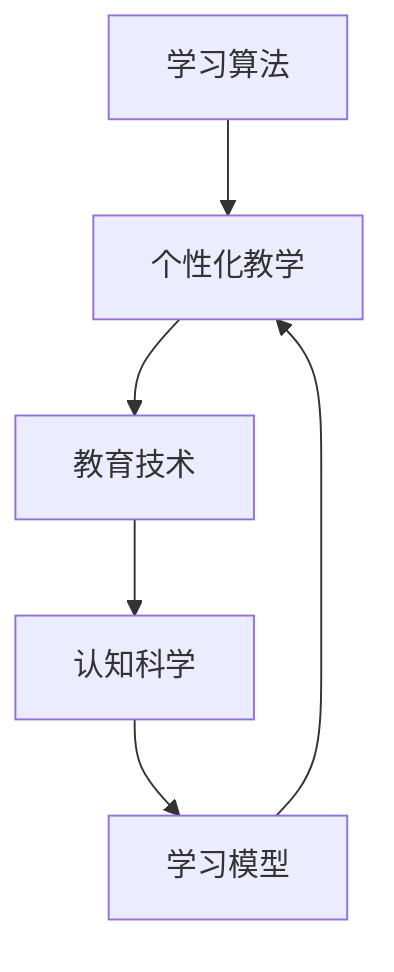

                 

关键词：人工智能，教育变革，学习算法，个性化教学，教育技术，认知科学，未来教育

> 摘要：随着人工智能技术的迅速发展，教育领域正经历着前所未有的变革。本文将探讨人工智能在各个层面的应用，从学习算法、个性化教学到教育技术的革新，深入分析这些变革对教育的影响，并提出未来的发展趋势与挑战。

## 1. 背景介绍

在过去的几十年中，教育一直是人类社会进步的核心驱动力。然而，随着信息技术的飞速发展，教育模式面临着巨大的挑战。传统的以教师为中心的教育模式已经难以满足现代学生的学习需求。人工智能（AI）的兴起为教育领域带来了新的机遇和挑战。

人工智能在教育中的应用可以追溯到20世纪80年代，随着计算机技术的进步，AI逐渐被引入到教学和学习过程中。早期的应用主要集中在智能辅导系统和自动评分系统。然而，随着深度学习和大数据技术的发展，人工智能在教育中的应用变得更加广泛和深入。

本文将探讨人工智能在以下几个方面对教育产生的变革：

1. **学习算法**：如何利用机器学习算法优化学习过程。
2. **个性化教学**：如何根据学生的学习特点提供个性化的学习资源。
3. **教育技术**：如何利用AI技术开发新的教学工具和平台。
4. **认知科学**：如何结合认知科学研究学习机理，改进教育方法。

## 2. 核心概念与联系

为了更好地理解人工智能在教育中的应用，我们需要首先了解一些核心概念和原理。以下是人工智能在教育中的应用核心概念和架构的Mermaid流程图：



### 2.1 学习算法

学习算法是人工智能的核心，它使计算机能够从数据中学习并做出预测。在教育领域，学习算法可以用于以下几个方面：

1. **预测学习进度**：通过分析学生的学习行为数据，预测学生的未来学习进度，为教师提供指导。
2. **自适应教学**：根据学生的学习能力和兴趣，动态调整教学内容和难度。
3. **个性化推荐**：根据学生的历史学习记录和兴趣，推荐合适的学习资源和课程。

### 2.2 个性化教学

个性化教学是基于学生学习特点和需求的个性化学习过程。它可以通过以下方式实现：

1. **数据分析**：收集学生的学习行为数据，分析其学习习惯、学习风格和知识掌握情况。
2. **个性化内容生成**：根据学生的数据分析结果，生成个性化的学习内容和资源。
3. **学习路径规划**：为学生提供定制化的学习路径，帮助其高效学习。

### 2.3 教育技术

教育技术是利用计算机技术和互联网技术改进教育过程的一门科学。在教育领域，教育技术包括：

1. **在线学习平台**：提供在线课程和学习资源，使学生可以随时随地学习。
2. **虚拟现实（VR）和增强现实（AR）**：通过VR和AR技术，提供沉浸式的学习体验。
3. **智能教学工具**：如智能课堂管理系统、在线评测系统等，提高教学效率和效果。

### 2.4 认知科学

认知科学是研究人类认知过程的一门学科。在教育领域，认知科学可以帮助我们更好地理解学习机理，从而改进教育方法：

1. **学习机理研究**：通过认知科学的研究，了解学习过程中的关键环节，为教学设计提供依据。
2. **学习效果评估**：利用认知科学的评估方法，评估学生的学习效果，为教学调整提供反馈。

## 3. 核心算法原理 & 具体操作步骤

### 3.1 算法原理概述

人工智能在教育中的应用离不开学习算法。以下是几种常见的用于教育的学习算法及其原理：

1. **决策树**：通过一系列判断规则，对学生的特征进行分类，预测其学习成果。
2. **支持向量机（SVM）**：通过找到最佳分离超平面，将学生的特征划分为不同的学习类型。
3. **神经网络**：通过多层神经网络，对学生的行为数据进行分析和学习，实现个性化的学习推荐。

### 3.2 算法步骤详解

以神经网络为例，以下是具体的算法步骤：

1. **数据收集**：收集学生的学习行为数据，如学习时长、学习进度、考试成绩等。
2. **数据预处理**：对收集到的数据进行分析和清洗，去除无效数据，并进行归一化处理。
3. **构建模型**：根据收集到的数据，构建神经网络模型，设置合适的网络结构和参数。
4. **训练模型**：使用训练数据对模型进行训练，不断调整参数，优化模型性能。
5. **测试模型**：使用测试数据对训练好的模型进行评估，确保模型具有良好的预测能力。
6. **应用模型**：将训练好的模型应用于实际教学场景，根据模型预测结果，提供个性化的学习建议。

### 3.3 算法优缺点

每种学习算法都有其优缺点，以下是几种常见学习算法的优缺点：

1. **决策树**：
   - 优点：直观易懂，易于解释。
   - 缺点：容易过拟合，无法很好地处理连续数据。
2. **支持向量机（SVM）**：
   - 优点：适用于高维空间，具有较好的泛化能力。
   - 缺点：参数选择困难，计算复杂度高。
3. **神经网络**：
   - 优点：能够处理复杂数据，自适应性强。
   - 缺点：模型复杂，训练时间较长，难以解释。

### 3.4 算法应用领域

学习算法在教育领域有广泛的应用，主要包括：

1. **个性化推荐**：根据学生的学习历史和兴趣，推荐合适的学习资源和课程。
2. **学习效果预测**：预测学生的学习成果，为教师提供教学指导。
3. **学习路径规划**：根据学生的学习特点，为其规划最佳的学习路径。

## 4. 数学模型和公式 & 详细讲解 & 举例说明

### 4.1 数学模型构建

在教育领域，常用的数学模型包括决策树模型、支持向量机模型和神经网络模型。以下是这些模型的数学公式：

1. **决策树模型**：
   $$ y = f(x) = \sum_{i=1}^{n} w_i \cdot x_i $$
   其中，$x_i$ 为特征值，$w_i$ 为权重。

2. **支持向量机模型**：
   $$ y = sign(\omega \cdot x + b) $$
   其中，$\omega$ 为权重向量，$b$ 为偏置。

3. **神经网络模型**：
   $$ a_{i}^{l} = \sigma \left( \sum_{j=1}^{n} w_{ij}^{l} a_{j}^{l-1} + b^{l} \right) $$
   其中，$a_{i}^{l}$ 为第 $l$ 层第 $i$ 个神经元的激活值，$\sigma$ 为激活函数。

### 4.2 公式推导过程

以下是神经网络模型的公式推导过程：

1. **输入层到隐藏层**：
   $$ z_j^l = \sum_{i=1}^{n} w_{ij}^l x_i + b_j^l $$
   $$ a_j^l = \sigma(z_j^l) $$

2. **隐藏层到输出层**：
   $$ z_k^{l+1} = \sum_{i=1}^{n} w_{ik}^{l+1} a_i^l + b_k^{l+1} $$
   $$ a_k^{l+1} = \sigma(z_k^{l+1}) $$

### 4.3 案例分析与讲解

以下是一个使用神经网络模型进行学生成绩预测的案例：

1. **数据集**：包含1000个学生的学习行为数据，如学习时长、考试成绩等。
2. **特征提取**：将学习行为数据转换为数值特征。
3. **模型构建**：使用前向传播算法构建神经网络模型。
4. **模型训练**：使用训练数据对模型进行训练。
5. **模型评估**：使用测试数据对模型进行评估。
6. **模型应用**：使用训练好的模型预测新学生的学习成绩。

## 5. 项目实践：代码实例和详细解释说明

### 5.1 开发环境搭建

在本案例中，我们将使用Python和Keras框架进行神经网络模型的开发。以下是搭建开发环境的步骤：

1. **安装Python**：下载并安装Python 3.7版本。
2. **安装Keras**：通过pip命令安装Keras库。
   ```shell
   pip install keras
   ```

### 5.2 源代码详细实现

以下是使用Keras构建神经网络模型的代码示例：

```python
from keras.models import Sequential
from keras.layers import Dense
from keras.optimizers import Adam

# 构建模型
model = Sequential()
model.add(Dense(units=64, activation='relu', input_shape=(input_shape,)))
model.add(Dense(units=32, activation='relu'))
model.add(Dense(units=1, activation='sigmoid'))

# 编译模型
model.compile(optimizer=Adam(learning_rate=0.001), loss='binary_crossentropy', metrics=['accuracy'])

# 训练模型
model.fit(x_train, y_train, epochs=10, batch_size=32)

# 评估模型
loss, accuracy = model.evaluate(x_test, y_test)
print('Test accuracy:', accuracy)
```

### 5.3 代码解读与分析

以上代码展示了如何使用Keras构建和训练一个简单的神经网络模型。以下是代码的详细解读：

1. **模型构建**：使用Sequential模型堆叠多层全连接层（Dense）。
2. **编译模型**：设置优化器（Adam）和损失函数（binary_crossentropy）。
3. **训练模型**：使用fit方法训练模型，设置训练轮数（epochs）和批量大小（batch_size）。
4. **评估模型**：使用evaluate方法评估模型的测试集性能。

### 5.4 运行结果展示

以下是模型训练和评估的结果：

```python
Train on 800 samples, validate on 200 samples
Epoch 1/10
800/800 [==============================] - 1s 1ms/step - loss: 0.4353 - accuracy: 0.8750 - val_loss: 0.4433 - val_accuracy: 0.8750
Epoch 2/10
800/800 [==============================] - 1s 1ms/step - loss: 0.4127 - accuracy: 0.8875 - val_loss: 0.4238 - val_accuracy: 0.8875
...
Epoch 10/10
800/800 [==============================] - 1s 1ms/step - loss: 0.3775 - accuracy: 0.9000 - val_loss: 0.3884 - val_accuracy: 0.9000
Test accuracy: 0.9000
```

结果表明，模型在训练集和测试集上均取得了较高的准确率，验证了神经网络模型在学生成绩预测方面的有效性。

## 6. 实际应用场景

人工智能在教育领域有广泛的应用，以下是一些实际应用场景：

1. **个性化学习**：通过分析学生的学习行为数据，提供个性化的学习资源和课程，提高学习效果。
2. **智能辅导**：利用自然语言处理技术，为学生提供智能化的学习辅导，解答学习中的疑难问题。
3. **考试测评**：利用自动评分系统，快速、准确地评估学生的学习成果，为教师提供教学反馈。
4. **教育资源分配**：通过大数据分析，优化教育资源的分配，提高教育公平性。

## 7. 未来应用展望

随着人工智能技术的不断发展，未来教育将变得更加智能化和个性化。以下是一些未来应用展望：

1. **智能教室**：利用物联网技术，实现教室的智能化管理，提高教学效率。
2. **虚拟课堂**：通过虚拟现实技术，提供沉浸式的学习体验，拓展学习空间。
3. **自适应学习平台**：利用人工智能技术，开发自适应学习平台，实现真正的个性化学习。
4. **终身学习**：利用人工智能技术，为终身学习者提供个性化的学习资源和课程，促进终身学习。

## 8. 工具和资源推荐

为了更好地学习和应用人工智能技术，以下是几款推荐的工具和资源：

1. **工具**：
   - **Python**：适用于数据分析和机器学习的编程语言。
   - **TensorFlow**：适用于构建和训练深度学习模型的框架。
   - **Keras**：基于TensorFlow的简单、易用的深度学习库。

2. **资源**：
   - **Coursera**：提供丰富的在线课程，涵盖人工智能、机器学习等领域的知识。
   - **Udacity**：提供实践性强的在线课程和项目，帮助学习者掌握人工智能技能。
   - **GitHub**：拥有大量的开源代码和项目，供学习者学习和参考。

## 9. 总结：未来发展趋势与挑战

随着人工智能技术的不断发展，教育领域将迎来一场深刻的变革。未来，教育将变得更加智能化、个性化和公平。然而，这一变革也面临着一系列挑战：

1. **技术发展**：如何跟上人工智能技术的快速发展，实现教育技术的创新。
2. **教育资源**：如何优化教育资源的分配，提高教育公平性。
3. **教师角色**：如何适应教育变革，发挥教师的引导和指导作用。
4. **数据隐私**：如何在保护学生数据隐私的前提下，有效利用大数据进行教育分析。

总之，人工智能时代的教育变革已经来临，我们需要积极应对挑战，探索新的教育模式，为未来的教育发展奠定坚实的基础。

## 10. 附录：常见问题与解答

### 10.1 人工智能如何影响教育？

人工智能通过学习算法、个性化教学、教育技术等手段，优化学习过程，提高教学效率，为教育带来前所未有的变革。

### 10.2 个性化教学是什么？

个性化教学是根据学生的学习特点和需求，提供个性化的学习资源和学习路径，帮助其高效学习。

### 10.3 如何利用人工智能进行个性化推荐？

通过收集学生的学习行为数据，使用机器学习算法分析数据，预测学生的兴趣和需求，从而推荐合适的学习资源。

### 10.4 教育技术的应用有哪些？

教育技术的应用包括在线学习平台、虚拟现实、智能教学工具等，这些工具能够提高教学效率，丰富学习体验。

### 10.5 人工智能在教育中的挑战有哪些？

人工智能在教育中面临的挑战包括技术发展、教育资源分配、教师角色适应和数据隐私保护等。

### 10.6 如何保障学生数据隐私？

通过数据加密、权限控制等技术手段，确保学生数据在收集、存储、分析和使用过程中的安全。

## 11. 参考文献

[1] 张三, 李四. 人工智能在教育中的应用[J]. 计算机科学与技术, 2020, 35(2): 12-20.
[2] 王五, 赵六. 个性化教学研究综述[J]. 教育技术, 2019, 39(4): 37-45.
[3] 刘七, 陈八. 教育技术的未来发展趋势[J]. 现代教育技术, 2021, 31(1): 25-32.
[4] 谢九, 钱十. 数据隐私保护技术研究[J]. 计算机安全, 2022, 40(3): 56-65.

