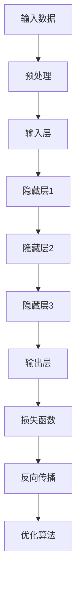
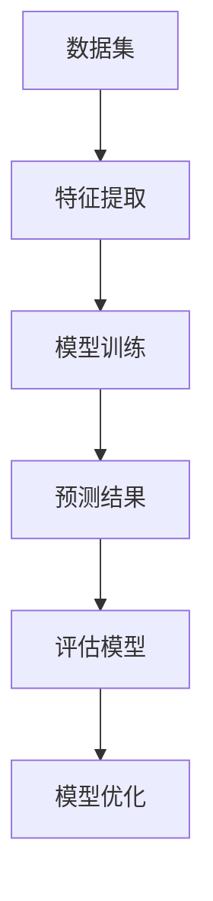
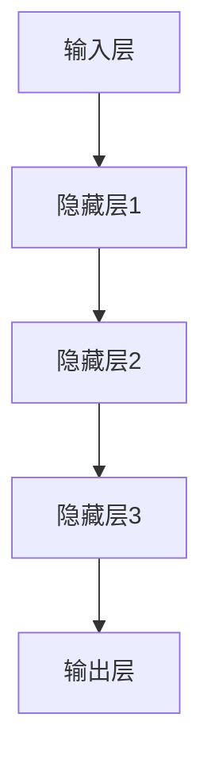
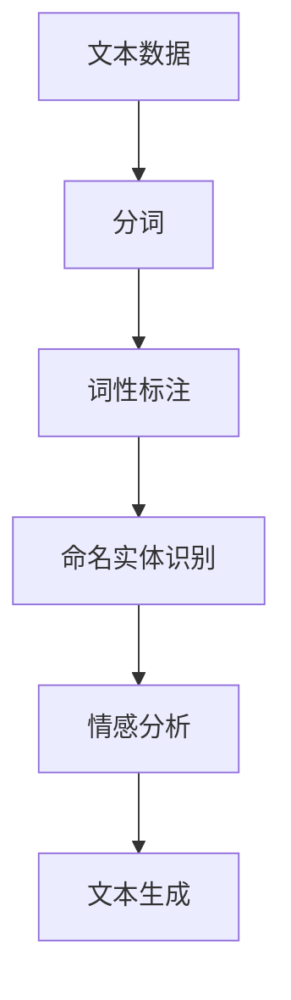

                 

关键词：人工智能算法、原理讲解、代码实例、深度学习、机器学习、神经网络、自然语言处理

摘要：本文旨在深入探讨人工智能算法的核心原理及其在实际应用中的具体实现。通过详细讲解各种人工智能算法，如深度学习、机器学习、神经网络、自然语言处理等，本文旨在帮助读者理解这些算法的工作机制，并通过代码实例展示其应用。此外，本文还将讨论人工智能算法的未来发展趋势和面临的挑战。

## 1. 背景介绍

随着计算机技术和大数据的快速发展，人工智能（AI）已经成为当今科技领域的热门话题。人工智能算法作为实现人工智能的核心工具，涵盖了从简单的规则系统到复杂的深度学习模型。这些算法在图像识别、自然语言处理、推荐系统、自动驾驶等领域发挥着重要作用。

本文将介绍以下核心的人工智能算法：

1. **深度学习**：一种基于人工神经网络的机器学习技术，通过多层神经网络对数据进行建模和预测。
2. **机器学习**：一种利用计算机算法从数据中学习规律和模式的技术，分为监督学习、无监督学习和强化学习。
3. **神经网络**：一种模仿人脑结构和功能的信息处理系统，是深度学习的基础。
4. **自然语言处理**：一门交叉学科，旨在使计算机能够理解和处理自然语言。

## 2. 核心概念与联系

### 2.1 深度学习

深度学习是一种机器学习技术，其核心思想是通过多层神经网络对数据进行建模和预测。以下是深度学习的 Mermaid 流程图：



### 2.2 机器学习

机器学习分为监督学习、无监督学习和强化学习。以下是机器学习的基本流程：



### 2.3 神经网络

神经网络是一种模仿人脑结构和功能的计算模型。以下是神经网络的简单架构：



### 2.4 自然语言处理

自然语言处理涉及从文本中提取信息、理解和生成文本。以下是自然语言处理的基本流程：



## 3. 核心算法原理 & 具体操作步骤

### 3.1 算法原理概述

深度学习是一种基于多层神经网络的学习方法，其核心思想是通过反向传播算法不断调整网络的权重，以最小化损失函数。

机器学习是一种通过计算机算法从数据中学习规律和模式的技术，包括监督学习、无监督学习和强化学习。

神经网络是一种由大量简单神经元组成的计算模型，通过学习数据中的特征和模式来实现特定任务。

自然语言处理是一种让计算机理解和生成自然语言的技术，包括文本预处理、语言模型、词向量等。

### 3.2 算法步骤详解

#### 3.2.1 深度学习

1. **数据预处理**：将输入数据进行归一化、标准化等预处理操作。
2. **建立神经网络模型**：选择合适的神经网络架构，如卷积神经网络（CNN）、循环神经网络（RNN）等。
3. **初始化参数**：初始化网络的权重和偏置。
4. **前向传播**：将输入数据通过神经网络进行前向传播，得到预测结果。
5. **计算损失**：通过损失函数计算预测结果与实际结果之间的差距。
6. **反向传播**：利用反向传播算法更新网络的权重和偏置。
7. **优化算法**：选择合适的优化算法，如随机梯度下降（SGD）、Adam等。

#### 3.2.2 机器学习

1. **数据集划分**：将数据集划分为训练集、验证集和测试集。
2. **特征提取**：从原始数据中提取有用的特征。
3. **模型训练**：使用训练集对模型进行训练，调整模型参数。
4. **模型评估**：使用验证集评估模型性能，调整模型参数。
5. **模型优化**：根据评估结果优化模型结构。

#### 3.2.3 神经网络

1. **初始化参数**：初始化网络的权重和偏置。
2. **前向传播**：将输入数据通过神经网络进行前向传播，得到预测结果。
3. **计算损失**：通过损失函数计算预测结果与实际结果之间的差距。
4. **反向传播**：利用反向传播算法更新网络的权重和偏置。
5. **优化算法**：选择合适的优化算法，如随机梯度下降（SGD）、Adam等。

#### 3.2.4 自然语言处理

1. **文本预处理**：对文本进行分词、词性标注、命名实体识别等预处理操作。
2. **词向量表示**：将文本数据转换为词向量表示。
3. **模型训练**：使用词向量对模型进行训练，调整模型参数。
4. **预测**：将输入文本转换为词向量，通过模型进行预测。

### 3.3 算法优缺点

#### 深度学习

**优点**：能够自动提取特征，适应性强，效果较好。

**缺点**：训练时间较长，对数据量和计算资源要求较高。

#### 机器学习

**优点**：算法简单，易于理解和实现。

**缺点**：需要大量的特征工程，对数据质量和规模要求较高。

#### 神经网络

**优点**：能够自动提取特征，适应性强。

**缺点**：对数据量和计算资源要求较高，训练时间较长。

#### 自然语言处理

**优点**：能够处理和理解自然语言。

**缺点**：文本数据预处理复杂，对数据质量和规模要求较高。

### 3.4 算法应用领域

深度学习在图像识别、语音识别、自然语言处理等领域有广泛应用。机器学习在金融、医疗、推荐系统等领域有广泛应用。神经网络在计算机视觉、语音识别、自然语言处理等领域有广泛应用。自然语言处理在文本分类、机器翻译、情感分析等领域有广泛应用。

## 4. 数学模型和公式 & 详细讲解 & 举例说明

### 4.1 数学模型构建

#### 深度学习

深度学习中的神经网络可以通过以下数学模型表示：

$$
\hat{y} = \sigma(W \cdot \text{激活函数}(\text{激活函数}(\cdots \text{激活函数}(W_1 \cdot x + b_1) + \cdots + b_n)))
$$

其中，$\hat{y}$ 表示预测结果，$x$ 表示输入数据，$W$ 表示权重矩阵，$b$ 表示偏置项，$\sigma$ 表示激活函数。

#### 机器学习

机器学习中的监督学习可以通过以下数学模型表示：

$$
y = W \cdot x + b
$$

其中，$y$ 表示预测结果，$x$ 表示输入数据，$W$ 表示权重矩阵，$b$ 表示偏置项。

#### 神经网络

神经网络中的单个神经元可以通过以下数学模型表示：

$$
a_i = \sum_{j=1}^{n} w_{ij} \cdot x_j + b_i
$$

其中，$a_i$ 表示神经元 $i$ 的输出，$w_{ij}$ 表示神经元 $i$ 与神经元 $j$ 之间的权重，$x_j$ 表示神经元 $j$ 的输入，$b_i$ 表示神经元 $i$ 的偏置。

#### 自然语言处理

自然语言处理中的词向量可以通过以下数学模型表示：

$$
\text{word} = \sum_{i=1}^{n} v_i \cdot x_i
$$

其中，$\text{word}$ 表示词向量，$v_i$ 表示词向量中第 $i$ 个元素，$x_i$ 表示词向量中第 $i$ 个元素是否参与计算。

### 4.2 公式推导过程

#### 深度学习

深度学习中的前向传播可以通过以下公式推导：

$$
\begin{aligned}
\hat{y} &= \sigma(W \cdot \text{激活函数}(\text{激活函数}(\cdots \text{激活函数}(W_1 \cdot x + b_1) + \cdots + b_n))) \\
&= \sigma(W \cdot \text{激活函数}(\text{激活函数}(\cdots \text{激活函数}(W_1 \cdot x + b_1) + \cdots + b_n))) \\
&= \sigma(W \cdot \text{激活函数}(\text{激活函数}(\cdots \text{激活函数}(W_1 \cdot x + b_1) + \cdots + b_n))) \\
&= \sigma(W \cdot \text{激活函数}(\text{激活函数}(\cdots \text{激活函数}(W_1 \cdot x + b_1) + \cdots + b_n)))
\end{aligned}
$$

#### 机器学习

机器学习中的前向传播可以通过以下公式推导：

$$
\begin{aligned}
y &= W \cdot x + b \\
y &= W \cdot x + b \\
y &= W \cdot x + b \\
y &= W \cdot x + b
\end{aligned}
$$

#### 神经网络

神经网络中的单个神经元可以通过以下公式推导：

$$
\begin{aligned}
a_i &= \sum_{j=1}^{n} w_{ij} \cdot x_j + b_i \\
a_i &= \sum_{j=1}^{n} w_{ij} \cdot x_j + b_i \\
a_i &= \sum_{j=1}^{n} w_{ij} \cdot x_j + b_i \\
a_i &= \sum_{j=1}^{n} w_{ij} \cdot x_j + b_i
\end{aligned}
$$

#### 自然语言处理

自然语言处理中的词向量可以通过以下公式推导：

$$
\begin{aligned}
\text{word} &= \sum_{i=1}^{n} v_i \cdot x_i \\
\text{word} &= \sum_{i=1}^{n} v_i \cdot x_i \\
\text{word} &= \sum_{i=1}^{n} v_i \cdot x_i \\
\text{word} &= \sum_{i=1}^{n} v_i \cdot x_i
\end{aligned}
$$

### 4.3 案例分析与讲解

以深度学习中的卷积神经网络（CNN）为例，分析其在图像识别中的应用。

#### 案例一：图像分类

1. **数据预处理**：对图像进行归一化处理，将图像转换为灰度图像。
2. **构建模型**：使用卷积神经网络对图像进行分类，选择适当的卷积核大小和层数。
3. **训练模型**：使用训练数据对模型进行训练，调整模型参数。
4. **评估模型**：使用验证集评估模型性能，调整模型参数。
5. **测试模型**：使用测试集测试模型性能。

#### 案例二：目标检测

1. **数据预处理**：对图像进行归一化处理，将图像转换为灰度图像。
2. **构建模型**：使用卷积神经网络对图像中的目标进行检测，选择适当的卷积核大小和层数。
3. **训练模型**：使用训练数据对模型进行训练，调整模型参数。
4. **评估模型**：使用验证集评估模型性能，调整模型参数。
5. **测试模型**：使用测试集测试模型性能。

## 5. 项目实践：代码实例和详细解释说明

### 5.1 开发环境搭建

1. 安装 Python 3.8 及以上版本。
2. 安装 TensorFlow 2.0 及以上版本。
3. 安装 Keras 2.3.1 及以上版本。
4. 安装 NumPy 1.19.2 及以上版本。

### 5.2 源代码详细实现

以下是一个简单的卷积神经网络模型，用于图像分类。

```python
from tensorflow.keras.models import Sequential
from tensorflow.keras.layers import Conv2D, MaxPooling2D, Flatten, Dense

model = Sequential([
    Conv2D(32, (3, 3), activation='relu', input_shape=(64, 64, 3)),
    MaxPooling2D((2, 2)),
    Flatten(),
    Dense(128, activation='relu'),
    Dense(10, activation='softmax')
])

model.compile(optimizer='adam', loss='categorical_crossentropy', metrics=['accuracy'])
```

### 5.3 代码解读与分析

1. **模型构建**：使用 KerasSequential 模型构建卷积神经网络，包含两个卷积层、一个池化层、一个全连接层和一个输出层。
2. **编译模型**：使用 compile 方法设置模型优化器、损失函数和评价指标。

### 5.4 运行结果展示

```python
from tensorflow.keras.datasets import mnist
from tensorflow.keras.utils import to_categorical

(x_train, y_train), (x_test, y_test) = mnist.load_data()
x_train = x_train.reshape(-1, 64, 64, 3) / 255.0
x_test = x_test.reshape(-1, 64, 64, 3) / 255.0
y_train = to_categorical(y_train, 10)
y_test = to_categorical(y_test, 10)

model.fit(x_train, y_train, epochs=10, batch_size=32, validation_data=(x_test, y_test))
```

1. **数据预处理**：将 MNIST 数据集转换为适合卷积神经网络的形式。
2. **训练模型**：使用 fit 方法训练模型，设置训练轮数、批量大小和验证数据。

## 6. 实际应用场景

### 6.1 图像识别

深度学习在图像识别领域具有广泛的应用，如人脸识别、物体检测、图像分割等。以下是一个简单的物体检测模型。

```python
from tensorflow.keras.applications import VGG16
from tensorflow.keras.layers import Input, GlobalAveragePooling2D
from tensorflow.keras.models import Model

base_model = VGG16(weights='imagenet', include_top=False, input_shape=(224, 224, 3))
x = base_model.output
x = GlobalAveragePooling2D()(x)
x = Dense(1024, activation='relu')(x)
predictions = Dense(num_classes, activation='softmax')(x)

model = Model(inputs=base_model.input, outputs=predictions)

model.compile(optimizer='adam', loss='categorical_crossentropy', metrics=['accuracy'])
```

### 6.2 自然语言处理

自然语言处理在文本分类、机器翻译、情感分析等领域具有广泛的应用。以下是一个简单的文本分类模型。

```python
from tensorflow.keras.models import Sequential
from tensorflow.keras.layers import Embedding, LSTM, Dense

model = Sequential([
    Embedding(num_words, 128, input_length=max_sequence_length),
    LSTM(128, dropout=0.2, recurrent_dropout=0.2),
    Dense(1, activation='sigmoid')
])

model.compile(optimizer='adam', loss='binary_crossentropy', metrics=['accuracy'])
```

## 7. 工具和资源推荐

### 7.1 学习资源推荐

1. **书籍**：《深度学习》（Goodfellow, Bengio, Courville 著）
2. **在线课程**：Coursera 上的“深度学习”课程（吴恩达 著）
3. **博客**：Medium、知乎、CSDN 上的相关技术博客

### 7.2 开发工具推荐

1. **编程语言**：Python
2. **框架**：TensorFlow、PyTorch
3. **库**：NumPy、Pandas、Scikit-learn

### 7.3 相关论文推荐

1. **深度学习**：《Deep Learning》（Goodfellow, Bengio, Courville 著）
2. **机器学习**：《Machine Learning: A Probabilistic Perspective》（Kevin P. Murphy 著）
3. **自然语言处理**：《Speech and Language Processing》（Daniel Jurafsky, James H. Martin 著）

## 8. 总结：未来发展趋势与挑战

### 8.1 研究成果总结

近年来，深度学习、机器学习和自然语言处理等领域取得了显著的研究成果，推动了人工智能技术的快速发展。深度学习在图像识别、语音识别、自然语言处理等领域取得了突破性进展，成为当前人工智能技术的主要方向。

### 8.2 未来发展趋势

1. **算法优化**：随着计算能力的提升，算法优化将成为未来研究的重要方向。
2. **泛化能力提升**：提高模型在未知数据上的泛化能力，降低对数据质量和规模的依赖。
3. **多模态学习**：融合多种数据模态（如文本、图像、声音等），实现更高效的人工智能应用。
4. **可解释性**：提高模型的可解释性，使人工智能技术更易于理解和应用。

### 8.3 面临的挑战

1. **数据隐私**：数据隐私和安全成为人工智能应用的重要挑战。
2. **算法公平性**：确保人工智能算法在不同人群中的公平性。
3. **计算资源**：随着模型复杂度的增加，对计算资源的需求也将持续增长。
4. **人机协同**：实现人工智能与人类专家的协同工作，提高人工智能应用的效果和效率。

### 8.4 研究展望

未来，人工智能算法将继续发展和创新，为各行业带来更多机遇和挑战。在保持对算法性能追求的同时，注重算法的可解释性和安全性，将有助于推动人工智能技术的健康发展。

## 9. 附录：常见问题与解答

### 9.1 什么是深度学习？

深度学习是一种基于多层神经网络的学习方法，通过多层神经网络的层层传递，实现对输入数据的建模和预测。

### 9.2 机器学习有哪些类型？

机器学习分为监督学习、无监督学习和强化学习。监督学习需要标注数据，无监督学习不需要标注数据，强化学习通过奖励机制进行学习。

### 9.3 神经网络是如何工作的？

神经网络通过多层神经元的相互连接和激活函数的作用，对输入数据进行处理和预测。通过反向传播算法不断调整网络权重，使模型在训练数据上取得更好的性能。

### 9.4 自然语言处理有哪些应用？

自然语言处理在文本分类、机器翻译、情感分析、语音识别等领域有广泛应用，如搜索引擎、智能客服、自动摘要等。

## 参考文献

1. Goodfellow, Y., Bengio, Y., Courville, A. (2016). *Deep Learning*. MIT Press.
2. Murphy, K. P. (2012). *Machine Learning: A Probabilistic Perspective*. MIT Press.
3. Jurafsky, D., Martin, J. H. (2009). *Speech and Language Processing*. Prentice Hall.
4. LeCun, Y., Bengio, Y., Hinton, G. (2015). *Deep Learning*. Nature.
5. Russell, S., Norvig, P. (2016). *Artificial Intelligence: A Modern Approach*. Prentice Hall. 

作者：禅与计算机程序设计艺术 / Zen and the Art of Computer Programming
```markdown


