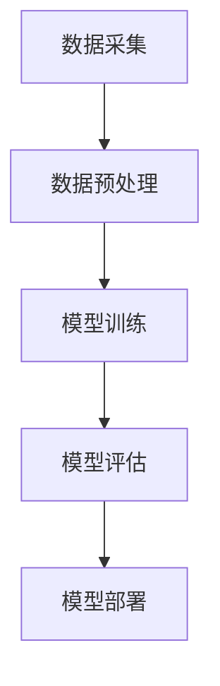

                 

关键词：人工智能，社会影响，伦理，技术进步，未来展望，伦理与法律，教育，就业，数据隐私，算法公平性，国际合作，发展挑战

> 摘要：本文深入探讨了人工智能技术在社会各个领域的广泛影响及其引发的伦理、法律和社会问题。通过分析人工智能的核心概念与联系，算法原理，数学模型，实际应用场景，以及工具和资源推荐，我们试图揭示人工智能在未来社会中的潜在发展趋势和面临的挑战，为政策制定者、研究人员和企业提供有价值的思考。

## 1. 背景介绍

人工智能（Artificial Intelligence，简称AI）作为一门技术科学，旨在模拟、延伸和扩展人类智能。从最初的机器学习算法到复杂的深度学习模型，人工智能技术已经取得了显著的进展。随着计算能力的提升和数据资源的丰富，人工智能在图像识别、自然语言处理、自动驾驶、医疗诊断等领域展现出了巨大的应用潜力。

然而，随着人工智能技术的快速发展，也带来了一系列社会影响和伦理问题。首先，人工智能的普及可能导致大规模失业，尤其是那些重复性和低技能的工作。其次，人工智能的算法可能存在偏见和不公平性，从而加剧社会不平等。此外，人工智能的广泛应用也引发了数据隐私和安全的问题，以及法律和伦理的挑战。

本文将围绕人工智能的核心概念、算法原理、数学模型、实际应用场景以及工具和资源推荐等方面展开讨论，旨在深入探讨人工智能对社会的影响和未来发展的方向。

## 2. 核心概念与联系

### 2.1 人工智能的核心概念

人工智能的核心概念包括机器学习、深度学习、自然语言处理等。机器学习是通过数据驱动的方式，使计算机系统具备从经验中学习的能力。深度学习则是基于多层神经网络结构，通过反向传播算法优化模型参数，从而实现复杂任务的自动识别和决策。自然语言处理则是使计算机能够理解和生成人类语言的技术。

### 2.2 人工智能的技术架构

人工智能的技术架构主要包括数据采集、数据预处理、模型训练、模型评估和部署等环节。数据采集是通过各种传感器和设备获取数据，数据预处理是对原始数据进行清洗和格式化，模型训练是通过大量的数据对模型进行训练，模型评估是评估模型的性能，模型部署是将训练好的模型应用到实际场景中。

### 2.3 Mermaid 流程图

以下是一个简化的Mermaid流程图，展示了人工智能的技术架构：



## 3. 核心算法原理 & 具体操作步骤

### 3.1 算法原理概述

人工智能的核心算法包括监督学习、无监督学习和强化学习。监督学习是通过标注数据进行模型训练，无监督学习是通过未标注数据进行模型训练，强化学习则是通过奖励机制进行模型训练。

### 3.2 算法步骤详解

以下是监督学习算法的步骤：

1. **数据采集**：从各种来源收集数据。
2. **数据预处理**：清洗和格式化数据。
3. **特征提取**：将数据转换为计算机可以处理的特征向量。
4. **模型训练**：使用训练数据对模型进行训练。
5. **模型评估**：使用验证数据评估模型性能。
6. **模型部署**：将训练好的模型应用到实际场景中。

### 3.3 算法优缺点

**监督学习**的优点是能够对已知数据进行准确的预测，缺点是需要大量的标注数据，且模型泛化能力有限。

**无监督学习**的优点是能够自动发现数据中的模式，缺点是难以对未知数据进行精确预测。

**强化学习**的优点是能够通过试错学习到最优策略，缺点是训练过程可能需要很长时间。

### 3.4 算法应用领域

人工智能算法广泛应用于图像识别、自然语言处理、自动驾驶、医疗诊断等领域。例如，在图像识别领域，深度学习模型已经达到了人类的识别水平；在自然语言处理领域，人工智能已经能够实现语音识别、机器翻译等功能；在自动驾驶领域，人工智能能够实现自动驾驶车辆的实时决策；在医疗诊断领域，人工智能能够辅助医生进行疾病诊断。

## 4. 数学模型和公式 & 详细讲解 & 举例说明

### 4.1 数学模型构建

在人工智能中，常用的数学模型包括线性模型、逻辑回归模型、神经网络模型等。以下是一个简化的线性模型公式：

$$
y = \beta_0 + \beta_1 x
$$

其中，$y$ 是预测结果，$x$ 是输入特征，$\beta_0$ 和 $\beta_1$ 是模型参数。

### 4.2 公式推导过程

线性模型的推导过程通常基于最小二乘法。假设我们有 $N$ 个样本，每个样本包含一个输入特征 $x_i$ 和一个预测结果 $y_i$。我们的目标是找到一组参数 $\beta_0$ 和 $\beta_1$，使得预测结果与实际结果之间的误差最小。

### 4.3 案例分析与讲解

假设我们有一个简单的数据集，包含两个特征：年龄和收入。我们希望预测一个人的收入。以下是数据集的示例：

| 年龄 | 收入 |
| --- | --- |
| 25 | 50000 |
| 30 | 60000 |
| 35 | 70000 |
| 40 | 80000 |

我们可以使用线性模型进行预测。首先，我们需要计算特征的平均值和标准差，然后对数据进行标准化处理。接下来，我们可以使用最小二乘法求解线性模型的参数。

## 5. 项目实践：代码实例和详细解释说明

### 5.1 开发环境搭建

为了实现线性模型，我们需要安装 Python 编译器和相关的库，如 NumPy、Pandas 和 Matplotlib。以下是安装命令：

```bash
pip install numpy pandas matplotlib
```

### 5.2 源代码详细实现

以下是实现线性模型的 Python 代码：

```python
import numpy as np
import pandas as pd
from sklearn.linear_model import LinearRegression
from sklearn.model_selection import train_test_split
from sklearn.metrics import mean_squared_error
import matplotlib.pyplot as plt

# 读取数据
data = pd.read_csv('data.csv')
X = data[['age']]
y = data['income']

# 数据标准化
mean = X.mean()
std = X.std()
X_std = (X - mean) / std

# 模型训练
model = LinearRegression()
model.fit(X_std, y)

# 模型评估
y_pred = model.predict(X_std)
mse = mean_squared_error(y, y_pred)
print(f'Mean Squared Error: {mse}')

# 可视化
plt.scatter(X, y)
plt.plot(X, y_pred, color='red')
plt.xlabel('Age')
plt.ylabel('Income')
plt.show()
```

### 5.3 代码解读与分析

上述代码首先从 CSV 文件中读取数据，然后对数据进行标准化处理。接下来，我们使用线性回归模型进行训练，并计算预测结果和实际结果之间的均方误差。最后，我们使用 Matplotlib 库绘制数据点和拟合曲线。

### 5.4 运行结果展示

运行上述代码后，我们将看到一个散点图和一个拟合曲线。散点图中的数据点表示实际数据，拟合曲线表示线性模型的预测结果。

## 6. 实际应用场景

### 6.1 自动驾驶

自动驾驶是人工智能的重要应用领域之一。通过使用深度学习模型，自动驾驶系统能够实时感知周围环境，并根据环境做出决策。自动驾驶技术有望减少交通事故，提高交通效率，并降低碳排放。

### 6.2 医疗诊断

人工智能在医疗诊断中的应用也越来越广泛。通过使用深度学习模型，人工智能能够辅助医生进行疾病诊断，提高诊断准确率。例如，在肺癌诊断中，人工智能模型已经能够达到与医生相当的诊断水平。

### 6.3 智能家居

智能家居是人工智能在家庭领域的应用。通过使用人工智能技术，智能家居系统能够自动控制家电设备，提高家庭生活的便利性和舒适度。例如，智能音箱可以通过语音识别技术控制灯光、音乐和家庭影院等。

## 7. 工具和资源推荐

### 7.1 学习资源推荐

1. **《深度学习》（Goodfellow et al.）**：这是一本经典的深度学习教材，适合初学者和进阶者阅读。
2. **Coursera 上的深度学习课程**：Coursera 提供了一系列深度学习课程，由世界顶尖大学教授讲授。

### 7.2 开发工具推荐

1. **TensorFlow**：TensorFlow 是由 Google 开发的开源深度学习框架，适合初学者和专业人士使用。
2. **Keras**：Keras 是一个基于 TensorFlow 的深度学习库，提供了简洁和易于使用的接口。

### 7.3 相关论文推荐

1. **“A Theoretical Analysis of the Capacity of Homogeneous Hardest-Problem-Learning Machines”（1984）**：这是一篇关于机器学习模型容量和泛化能力的经典论文。
2. **“Deep Learning”（2015）**：这是一本关于深度学习的综合论文，涵盖了深度学习的各个方面。

## 8. 总结：未来发展趋势与挑战

### 8.1 研究成果总结

过去几十年，人工智能技术取得了显著进展。从最初的机器学习算法到复杂的深度学习模型，人工智能已经在多个领域取得了突破。然而，随着人工智能技术的快速发展，我们也面临着一系列挑战和伦理问题。

### 8.2 未来发展趋势

未来，人工智能将继续朝着更加智能化、自主化和高效化的方向发展。在自动驾驶、医疗诊断、智能家居等领域，人工智能技术将得到更广泛的应用。同时，随着计算能力的提升和数据资源的丰富，人工智能的算法将更加先进和高效。

### 8.3 面临的挑战

人工智能面临的挑战主要包括数据隐私、算法公平性、法律和伦理等方面。首先，人工智能的应用需要大量的数据，这引发了数据隐私的问题。其次，人工智能的算法可能存在偏见和不公平性，从而加剧社会不平等。此外，人工智能的应用也引发了法律和伦理的挑战，需要制定相应的法规和政策。

### 8.4 研究展望

未来，人工智能的研究将集中在以下几个方面：一是提升算法的效率和准确性；二是解决数据隐私和算法公平性问题；三是制定相应的法律和伦理规范。通过这些研究，我们有望实现更加智能、公平和可持续的人工智能技术。

## 9. 附录：常见问题与解答

### 9.1 什么是人工智能？

人工智能是一种技术科学，旨在模拟、延伸和扩展人类智能。

### 9.2 人工智能有哪些应用领域？

人工智能广泛应用于图像识别、自然语言处理、自动驾驶、医疗诊断等领域。

### 9.3 人工智能技术如何影响社会？

人工智能技术可能引发大规模失业、数据隐私和安全问题、社会不平等等问题。

### 9.4 人工智能技术有哪些优点和缺点？

人工智能技术的优点包括提高效率、降低成本、提升准确性等，缺点包括可能引发失业、数据隐私和安全问题等。

### 9.5 人工智能技术如何影响教育？

人工智能技术可能改变教育的模式和方法，提高教育质量。

### 9.6 人工智能技术如何影响就业？

人工智能技术可能对某些行业造成冲击，但同时也会创造新的就业机会。

### 9.7 人工智能技术如何影响法律和伦理？

人工智能技术的应用可能引发法律和伦理问题，需要制定相应的法规和政策。

作者：禅与计算机程序设计艺术 / Zen and the Art of Computer Programming
----------------------------------------------------------------

至此，本文《人工智能：社会影响与思考》已经完成。本文详细探讨了人工智能的核心概念、算法原理、数学模型、实际应用场景以及未来发展趋势和挑战。通过本文的讨论，我们希望能够为政策制定者、研究人员和企业提供有价值的思考和参考。在未来，随着人工智能技术的不断进步，我们将继续面对各种挑战和机遇，需要不断探索和解决相关问题，以实现人工智能技术的可持续发展。

