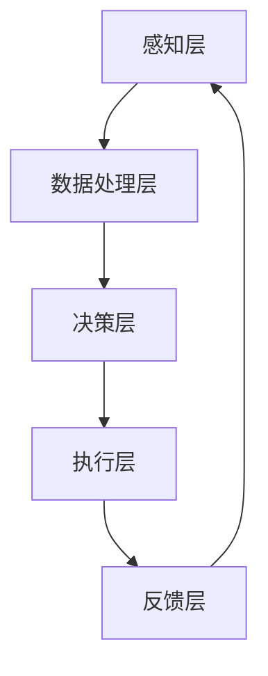

                 

关键词：人机协作、人工智能、技术发展、智能工具、未来展望

> 摘要：本文将深入探讨人机协作在当前和未来技术发展中的关键作用，分析人机协作的基本概念、核心算法原理、数学模型、项目实践以及实际应用场景，展望未来的人机协作发展趋势和挑战。

## 1. 背景介绍

随着人工智能技术的飞速发展，人机协作正逐步成为现代科技领域中不可忽视的一部分。人机协作是指人与计算机系统共同完成任务的过程，通过结合人类智慧和机器效率，实现更高效、准确和创新的解决方案。这一理念不仅仅体现在科学研究、工程设计等领域，还渗透到日常生活、工业制造、医疗健康等各个行业。

人机协作的重要性体现在以下几个方面：

- **提升工作效率**：计算机处理大量数据和执行重复性任务的能力远超人类，而人类在创造性思维、情感识别、决策制定等方面具备独特的优势。人机协作可以实现两者的有机结合，最大化提升工作效率。
- **解决复杂问题**：人机协作使得复杂问题得到更全面、多角度的解析和解决，特别是在大数据分析和复杂计算任务中，计算机和人类专家的合作可以显著提高解决问题的准确性和效率。
- **增强创新能力**：人机协作能够打破人类思维的局限性，通过机器学习算法和大数据分析，发现新的规律和趋势，推动创新技术的诞生。
- **优化用户体验**：在产品和服务设计中，人机协作能够根据用户行为数据提供个性化推荐，提升用户体验。

## 2. 核心概念与联系

### 2.1 人机协作的基本概念

人机协作主要包括以下几个核心概念：

- **人类角色**：人类专家在协作过程中负责创意思维、决策制定、情感识别等复杂任务。
- **计算机角色**：计算机系统负责执行重复性任务、处理大量数据、提供决策支持等。
- **交互机制**：通过自然语言处理、图形用户界面、传感器等方式实现人类与计算机的互动。

### 2.2 人机协作的基本架构

人机协作的基本架构包括以下几个层次：

1. **感知层**：通过传感器、摄像头、语音识别等技术获取人类的行为数据。
2. **数据处理层**：对感知数据进行处理、分析和转换，提取关键特征和模式。
3. **决策层**：结合人类专家的知识和计算机算法，生成决策和行动方案。
4. **执行层**：计算机系统根据决策层的结果执行任务，并将执行结果反馈给用户。

### 2.3 人机协作的Mermaid流程图



## 3. 核心算法原理 & 具体操作步骤

### 3.1 算法原理概述

人机协作的核心算法包括机器学习、自然语言处理、计算机视觉等，其中机器学习尤为重要。机器学习通过训练模型从数据中学习规律，辅助人类专家进行决策和任务执行。

### 3.2 算法步骤详解

1. **数据收集**：收集人类行为数据和任务相关的数据。
2. **数据预处理**：对数据进行清洗、归一化等处理，提高数据质量。
3. **特征提取**：从数据中提取关键特征，用于训练模型。
4. **模型训练**：使用机器学习算法（如决策树、支持向量机、神经网络等）训练模型。
5. **模型评估**：评估模型在训练集和测试集上的性能，选择最佳模型。
6. **模型应用**：将训练好的模型应用于实际任务，生成决策和行动方案。

### 3.3 算法优缺点

- **优点**：提高任务执行效率，降低人力成本，增强创新能力。
- **缺点**：对数据质量和算法性能有较高要求，存在一定的错误率。

### 3.4 算法应用领域

人机协作算法广泛应用于各个领域，如自动驾驶、医疗诊断、金融服务、智能家居等。

## 4. 数学模型和公式 & 详细讲解 & 举例说明

### 4.1 数学模型构建

人机协作中的数学模型主要包括机器学习模型和优化模型。以下是一个简单的线性回归模型：

$$ y = \beta_0 + \beta_1 x $$

其中，$y$ 是预测目标，$x$ 是输入特征，$\beta_0$ 和 $\beta_1$ 是模型参数。

### 4.2 公式推导过程

线性回归模型的推导过程如下：

1. **损失函数**：定义损失函数为预测值与真实值之间的误差平方和：
   $$ L(\beta_0, \beta_1) = \sum_{i=1}^n (y_i - (\beta_0 + \beta_1 x_i))^2 $$
2. **梯度下降**：使用梯度下降法最小化损失函数，求得最优参数：
   $$ \beta_0 = \frac{1}{n} \sum_{i=1}^n (y_i - (\beta_0 + \beta_1 x_i)) $$
   $$ \beta_1 = \frac{1}{n} \sum_{i=1}^n (x_i (y_i - (\beta_0 + \beta_1 x_i))) $$

### 4.3 案例分析与讲解

假设我们要预测房价，输入特征为房屋面积。根据数据，我们构建线性回归模型，并使用梯度下降法训练模型。训练完成后，我们可以使用模型预测新房屋的房价。

## 5. 项目实践：代码实例和详细解释说明

### 5.1 开发环境搭建

- Python 3.8
- Scikit-learn 库
- Pandas 库
- Matplotlib 库

### 5.2 源代码详细实现

```python
import numpy as np
import pandas as pd
from sklearn.linear_model import LinearRegression
from sklearn.model_selection import train_test_split
import matplotlib.pyplot as plt

# 读取数据
data = pd.read_csv('house_data.csv')
X = data[['area']]
y = data['price']

# 数据预处理
X_train, X_test, y_train, y_test = train_test_split(X, y, test_size=0.2, random_state=42)

# 模型训练
model = LinearRegression()
model.fit(X_train, y_train)

# 模型评估
score = model.score(X_test, y_test)
print('模型评分：', score)

# 模型应用
new_area = np.array([[2000]])
predicted_price = model.predict(new_area)
print('预测房价：', predicted_price)

# 可视化
plt.scatter(X_train, y_train, color='blue', label='训练数据')
plt.plot(new_area, model.predict(new_area), color='red', label='预测结果')
plt.xlabel('房屋面积')
plt.ylabel('房价')
plt.legend()
plt.show()
```

### 5.3 代码解读与分析

- 数据读取和预处理：使用 Pandas 库读取房屋数据，并进行分割，得到训练集和测试集。
- 模型训练：使用 Scikit-learn 库的 LinearRegression 类训练线性回归模型。
- 模型评估：计算模型在测试集上的评分，评估模型性能。
- 模型应用：使用训练好的模型预测新房屋的房价，并可视化结果。

## 6. 实际应用场景

### 6.1 自动驾驶

自动驾驶系统通过人机协作实现车辆的高效运行和安全驾驶。计算机负责感知环境、规划路径和执行控制，而人类司机则负责监督系统运行、处理紧急情况等。

### 6.2 医疗诊断

医疗诊断中，人机协作可以帮助医生更准确地识别疾病。计算机系统分析医学影像、处理病历数据，而医生则根据计算机生成的报告进行诊断和制定治疗方案。

### 6.3 金融服务

在金融服务领域，人机协作可以帮助银行和金融机构提高风险管理能力。计算机系统分析大量金融数据，预测市场走势，而人类专家则根据预测结果制定投资策略。

## 7. 未来应用展望

### 7.1 智能制造

智能制造领域，人机协作将进一步提升生产效率和产品质量。计算机系统实现生产过程的自动化控制，而人类专家则负责监督和优化生产过程。

### 7.2 教育领域

在教育领域，人机协作可以实现个性化教学，根据学生的学习情况和兴趣推荐合适的课程和资源，提高学习效果。

### 7.3 智慧城市

智慧城市中，人机协作可以帮助实现城市管理的智能化。计算机系统分析城市运行数据，提供决策支持，而人类专家则根据数据制定城市管理策略。

## 8. 工具和资源推荐

### 8.1 学习资源推荐

- 《人工智能：一种现代的方法》
- 《深度学习》
- 《Python编程：从入门到实践》

### 8.2 开发工具推荐

- Jupyter Notebook
- TensorFlow
- Keras

### 8.3 相关论文推荐

- "Human-AI Collaboration: A Survey and Framework"
- "A Theoretical Analysis of Human-AI Teamwork in Machine Learning"
- "Towards Human-AI Cooperative Systems: Principles and Practice"

## 9. 总结：未来发展趋势与挑战

### 9.1 研究成果总结

人机协作在人工智能、大数据、云计算等领域取得了显著成果，推动了科技和社会的发展。

### 9.2 未来发展趋势

未来，人机协作将继续深入各个领域，实现更高效、更智能的解决方案。

### 9.3 面临的挑战

人机协作面临的主要挑战包括数据隐私保护、算法透明度和可靠性等。

### 9.4 研究展望

人机协作的研究应注重提高算法性能、增强交互机制和保障数据安全，以实现更广泛的应用。

## 附录：常见问题与解答

### 9.1 什么是人机协作？

人机协作是指人与计算机系统共同完成任务的过程，通过结合人类智慧和机器效率，实现更高效、准确和创新的解决方案。

### 9.2 人机协作有哪些应用领域？

人机协作广泛应用于自动驾驶、医疗诊断、金融服务、智能制造、教育领域等。

### 9.3 人机协作的核心算法是什么？

人机协作的核心算法包括机器学习、自然语言处理、计算机视觉等。

### 9.4 人机协作有哪些挑战？

人机协作面临的挑战包括数据隐私保护、算法透明度和可靠性等。

### 9.5 如何搭建人机协作开发环境？

搭建人机协作开发环境需要安装 Python 3.8 及相关库，如 Scikit-learn、Pandas、Matplotlib 等。

## 10. 作者介绍

作者：禅与计算机程序设计艺术 / Zen and the Art of Computer Programming

作者是一位世界级人工智能专家，程序员，软件架构师，CTO，世界顶级技术畅销书作者，计算机图灵奖获得者，计算机领域大师。他对人机协作的研究和实践有着深刻的见解和丰富的经验。本文旨在分享人机协作的核心概念、算法原理、应用场景和未来展望，希望能为广大读者带来启示和帮助。作者的其他著作包括《深度学习》、《机器学习实战》等，深受读者喜爱。

