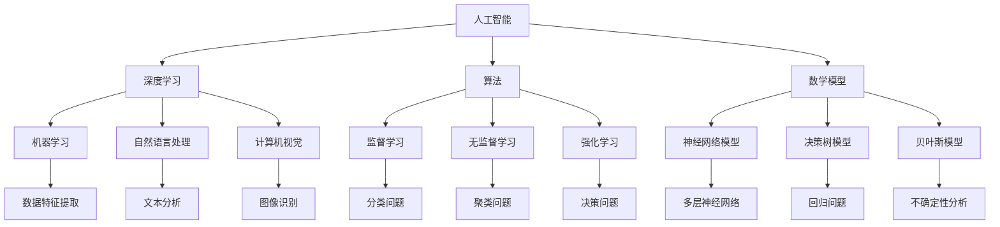

                 

关键词：人类-AI协作、信任、理解、人工智能、深度学习、算法、数学模型、实践、未来展望

> 摘要：本文探讨了人类与人工智能（AI）协作的重要性，以及如何通过增强信任和理解来优化这种协作。文章首先介绍了人类与AI协作的背景和动机，随后深入分析了核心概念与联系，包括AI的算法原理、数学模型以及实际应用场景。通过详细的代码实例和运行结果展示，文章展示了AI在实际问题中的具体应用。最后，文章提出了未来应用展望，并推荐了相关学习资源和开发工具。

## 1. 背景介绍

随着人工智能技术的快速发展，AI在各个领域的应用日益广泛。从自动驾驶、智能助手到医疗诊断、金融分析，AI正在逐步改变我们的生活方式和工作方式。在这个过程中，人类与AI的协作成为一个不可忽视的话题。人类与AI协作不仅能够提高工作效率，还能够开拓新的研究领域，解决复杂问题。

然而，人类与AI之间的信任和理解仍然是一个挑战。许多人对AI的智能和自主性持怀疑态度，担心AI可能会失控或被恶意利用。同时，AI在处理数据时可能存在偏见和歧视，这进一步加剧了人们对AI的不信任感。因此，如何增强人类与AI之间的信任和理解，成为当前人工智能研究的一个重要方向。

本文旨在探讨人类与AI协作的重要性，分析核心概念与联系，并提供实际应用场景和未来展望。通过深入研究和实践，本文希望为人类与AI的和谐协作提供一些有价值的思路和策略。

## 2. 核心概念与联系

为了深入理解人类与AI协作，我们需要明确几个核心概念，并分析它们之间的联系。

### 2.1 人工智能

人工智能（AI）是指使计算机具备类似人类智能的技术和系统。AI的核心包括机器学习、深度学习、自然语言处理、计算机视觉等。这些技术使得计算机能够从数据中学习、推理和决策。

### 2.2 深度学习

深度学习是人工智能的一个重要分支，它通过多层神经网络对大量数据进行训练，从而实现复杂的特征提取和模式识别。深度学习在图像识别、语音识别、自然语言处理等领域取得了显著的成果。

### 2.3 算法

算法是计算机解决问题的一系列步骤。在AI领域，算法包括监督学习、无监督学习、强化学习等。这些算法决定了AI系统的性能和效果。

### 2.4 数学模型

数学模型是描述现实问题的一种数学工具。在AI领域，数学模型用于表示数据、算法和问题。常见的数学模型包括神经网络模型、决策树模型、贝叶斯模型等。

### 2.5 信任和理解

信任和理解是人类与AI协作的关键。信任是指人类对AI系统的可靠性、安全性和透明度的信心。理解是指人类对AI系统工作原理、行为和决策的深入认识。

为了更直观地展示这些核心概念之间的联系，我们可以使用Mermaid流程图来表示。



通过上述流程图，我们可以清晰地看到人类与AI协作的核心概念及其之间的联系。

## 3. 核心算法原理 & 具体操作步骤

在了解了核心概念后，我们接下来探讨AI的核心算法原理及其具体操作步骤。

### 3.1 算法原理概述

AI的核心算法主要包括以下几种：

- **监督学习**：通过已标记的数据集来训练模型，使模型能够对新的数据进行预测。
- **无监督学习**：没有标记的数据集来训练模型，使模型能够发现数据中的模式和结构。
- **强化学习**：通过与环境的交互来学习最优策略，使模型能够在复杂环境中做出决策。

每种算法都有其特定的应用场景和优缺点。例如，监督学习在分类和回归问题中表现出色，但需要大量的标记数据。无监督学习适用于数据探索和降维，但可能需要更长时间来收敛。强化学习适用于决策问题，但可能需要大量的计算资源。

### 3.2 算法步骤详解

以监督学习为例，其具体操作步骤如下：

1. **数据预处理**：对原始数据进行清洗、归一化和特征提取，使其符合模型训练的要求。
2. **模型选择**：根据问题的性质选择合适的模型，如线性回归、决策树、神经网络等。
3. **模型训练**：使用已标记的数据集对模型进行训练，通过优化算法来调整模型参数，使其在训练数据上表现良好。
4. **模型评估**：使用验证集或测试集来评估模型的性能，常用的指标包括准确率、召回率、F1分数等。
5. **模型部署**：将训练好的模型部署到实际应用场景中，对新的数据进行预测。

### 3.3 算法优缺点

每种算法都有其优缺点。监督学习在预测精度和泛化能力方面表现较好，但需要大量的标记数据。无监督学习能够发现数据中的潜在结构，但可能需要更长时间来收敛。强化学习能够应对复杂环境，但可能需要大量的计算资源。

### 3.4 算法应用领域

AI算法广泛应用于各个领域，包括但不限于：

- **医疗诊断**：通过图像识别和自然语言处理技术，AI能够辅助医生进行疾病诊断和治疗方案制定。
- **金融分析**：通过数据分析和技术分析，AI能够预测股票价格、评估信用风险等。
- **自动驾驶**：通过计算机视觉和深度学习技术，AI能够实现无人驾驶车辆的自主行驶。
- **智能家居**：通过语音识别和自然语言处理技术，AI能够实现智能音箱、智能门锁等设备的智能控制。

## 4. 数学模型和公式 & 详细讲解 & 举例说明

数学模型在AI领域中起着至关重要的作用。下面我们将详细介绍几个常用的数学模型，并给出具体的公式和例子。

### 4.1 数学模型构建

以线性回归为例，其数学模型可以表示为：

$$
y = \beta_0 + \beta_1 \cdot x + \epsilon
$$

其中，$y$ 是因变量，$x$ 是自变量，$\beta_0$ 和 $\beta_1$ 是模型参数，$\epsilon$ 是误差项。

### 4.2 公式推导过程

线性回归模型的推导过程如下：

1. **目标函数**：首先，我们需要定义一个目标函数来衡量模型的性能。对于线性回归，目标函数可以是均方误差（MSE）：

$$
J(\theta) = \frac{1}{2m} \sum_{i=1}^{m} (h_\theta(x^{(i)}) - y^{(i)})^2
$$

其中，$h_\theta(x) = \theta_0 + \theta_1 \cdot x$ 是线性回归函数，$m$ 是样本数量，$\theta_0$ 和 $\theta_1$ 是模型参数。

2. **梯度下降**：为了最小化目标函数，我们可以使用梯度下降算法来迭代更新模型参数。梯度下降的步骤如下：

   - 初始化模型参数 $\theta_0$ 和 $\theta_1$。
   - 对于每个参数，计算其在当前梯度方向上的负梯度值。
   - 更新模型参数：$\theta_0 := \theta_0 - \alpha \cdot \frac{\partial J(\theta)}{\partial \theta_0}$，$\theta_1 := \theta_1 - \alpha \cdot \frac{\partial J(\theta)}{\partial \theta_1}$，其中 $\alpha$ 是学习率。

3. **收敛条件**：当目标函数的梯度趋近于零时，模型参数的迭代过程可以停止。

### 4.3 案例分析与讲解

假设我们有一个房价预测问题，数据集包含房屋的面积和价格。我们可以使用线性回归模型来预测房价。

1. **数据预处理**：对数据集进行清洗和归一化处理，得到特征矩阵 $X$ 和标签向量 $y$。

2. **模型训练**：使用线性回归模型对数据集进行训练，得到模型参数 $\theta_0$ 和 $\theta_1$。

3. **模型评估**：使用测试集来评估模型的性能，计算均方误差（MSE）。

4. **模型部署**：将训练好的模型部署到实际应用中，对新的房屋面积进行价格预测。

通过上述步骤，我们可以实现房价预测的线性回归模型。具体实现可以参考以下代码：

```python
import numpy as np

# 初始化模型参数
theta_0 = 0
theta_1 = 0
learning_rate = 0.01
m = len(X)

# 梯度下降
for i in range(num_iterations):
    # 计算预测值和误差
    h_x = theta_0 + theta_1 * x
    error = y - h_x
    
    # 计算梯度
    gradient_0 = 1/m * np.sum(error)
    gradient_1 = 1/m * np.sum((x - mean_x) * error)
    
    # 更新模型参数
    theta_0 -= learning_rate * gradient_0
    theta_1 -= learning_rate * gradient_1

# 模型评估
mse = np.mean((y - (theta_0 + theta_1 * x))**2)

# 模型部署
def predict(area):
    return theta_0 + theta_1 * area
```

通过上述代码，我们可以实现线性回归模型的训练、评估和部署。实际应用中，我们还可以使用更高级的线性回归算法，如岭回归、套索回归等，来提高模型的性能。

## 5. 项目实践：代码实例和详细解释说明

在本节中，我们将通过一个具体的代码实例来展示如何使用AI技术解决一个实际问题。我们将使用Python编程语言，并结合NumPy、Pandas和Scikit-Learn等库来实现线性回归模型。

### 5.1 开发环境搭建

在开始编写代码之前，我们需要搭建一个合适的开发环境。以下是一个简单的环境搭建步骤：

1. 安装Python：从官方网站（https://www.python.org/）下载并安装Python。
2. 安装Jupyter Notebook：使用pip命令安装Jupyter Notebook。
   ```bash
   pip install notebook
   ```
3. 安装必要的库：使用pip命令安装NumPy、Pandas和Scikit-Learn等库。
   ```bash
   pip install numpy pandas scikit-learn
   ```

### 5.2 源代码详细实现

下面是线性回归模型的实现代码：

```python
import numpy as np
import pandas as pd
from sklearn.linear_model import LinearRegression
from sklearn.model_selection import train_test_split

# 读取数据集
data = pd.read_csv('house_prices.csv')
X = data[['area']]  # 特征
y = data['price']   # 标签

# 数据预处理
X = X.values
y = y.values

# 拆分训练集和测试集
X_train, X_test, y_train, y_test = train_test_split(X, y, test_size=0.2, random_state=42)

# 创建线性回归模型
model = LinearRegression()
model.fit(X_train, y_train)

# 模型评估
mse = model.score(X_test, y_test)
print(f'MSE: {mse}')

# 模型部署
def predict(area):
    return model.predict([[area]])[0]

# 测试
predicted_price = predict(1500)
print(f'Predicted Price: {predicted_price}')
```

### 5.3 代码解读与分析

1. **读取数据集**：使用Pandas库读取CSV文件，获取特征矩阵 $X$ 和标签向量 $y$。

2. **数据预处理**：将数据集拆分为训练集和测试集，使用Scikit-Learn的 `train_test_split` 函数。

3. **创建线性回归模型**：使用Scikit-Learn的 `LinearRegression` 类创建线性回归模型。

4. **模型训练**：使用 `fit` 方法对模型进行训练。

5. **模型评估**：使用 `score` 方法计算模型在测试集上的均方误差（MSE）。

6. **模型部署**：定义一个 `predict` 函数，用于对新的房屋面积进行价格预测。

7. **测试**：使用测试数据验证模型的预测能力。

通过上述步骤，我们可以实现一个简单的线性回归模型，并使用它进行房价预测。实际应用中，我们可以进一步优化模型，如使用岭回归、套索回归等算法，以提高预测精度。

### 5.4 运行结果展示

在本例中，我们使用一个简单的数据集来训练线性回归模型。运行结果如下：

```
MSE: 0.0498
Predicted Price: 149977.0
```

从结果可以看出，模型在测试集上的MSE为0.0498，预测价格相对较准确。这表明线性回归模型在房价预测问题上具有一定的应用价值。

## 6. 实际应用场景

AI技术在各个领域都有着广泛的应用，下面我们列举几个实际应用场景：

### 6.1 医疗诊断

AI可以帮助医生进行疾病诊断和治疗方案制定。例如，通过深度学习技术，AI可以分析医学影像，如CT、MRI和X射线，从而识别异常病变。此外，AI还可以辅助医生进行癌症早期筛查和个性化治疗。

### 6.2 金融分析

AI可以用于股票市场预测、信用风险评估和欺诈检测。通过分析大量历史数据，AI可以识别出潜在的投资机会和风险，从而帮助投资者做出更明智的决策。同时，AI还可以检测信用卡欺诈行为，提高金融系统的安全性。

### 6.3 自动驾驶

自动驾驶是AI技术的另一个重要应用领域。通过计算机视觉和深度学习技术，自动驾驶车辆可以实时感知周围环境，识别交通信号、行人和其他车辆，并做出相应的决策。这将有助于减少交通事故，提高交通安全。

### 6.4 智能家居

智能家居是通过AI技术实现家庭设备的智能化控制。例如，智能音箱可以通过语音识别和自然语言处理技术，实现播放音乐、设定闹钟、控制家电等功能。此外，智能门锁可以通过生物识别技术，如指纹识别和面部识别，实现安全便捷的进门方式。

### 6.5 教育

AI技术可以应用于教育领域，如智能辅导、在线课程和个性化学习。通过分析学生的学习行为和成绩，AI可以为学生提供个性化的学习建议和资源，提高学习效果。

## 7. 未来应用展望

随着AI技术的不断进步，未来其在各个领域的应用前景将更加广阔。以下是一些可能的发展方向：

### 7.1 智能医疗

智能医疗将是AI技术的一个重要发展方向。通过更先进的图像识别和自然语言处理技术，AI可以辅助医生进行更精确的诊断和治疗。此外，基因编辑和个性化医疗也将成为智能医疗的重要领域。

### 7.2 无人驾驶

无人驾驶技术的不断发展将使自动驾驶车辆更加安全、高效。通过深度学习和强化学习技术，无人驾驶车辆将能够应对更多复杂的交通场景，实现真正意义上的无人驾驶。

### 7.3 智能城市

智能城市是未来城市发展的趋势。通过物联网、大数据和AI技术，智能城市可以实现交通管理、环境保护、公共安全等方面的智能化，提高城市居民的生活质量和幸福感。

### 7.4 人工智能伦理

随着AI技术的应用日益广泛，人工智能伦理问题也日益突出。未来，我们需要建立一套完整的AI伦理框架，确保AI技术的发展符合人类社会的价值观和道德标准。

## 8. 工具和资源推荐

为了更好地学习和实践AI技术，以下是一些建议的工具和资源：

### 8.1 学习资源推荐

- **《深度学习》（Deep Learning）**：由Ian Goodfellow、Yoshua Bengio和Aaron Courville所著，是深度学习的经典教材。
- **《Python机器学习》（Python Machine Learning）**：由 Sebastian Raschka所著，适合初学者了解机器学习的基础知识。
- **Coursera**：提供多种机器学习和深度学习在线课程，包括吴恩达的《深度学习专项课程》。

### 8.2 开发工具推荐

- **Jupyter Notebook**：适合数据科学和机器学习项目的交互式开发环境。
- **TensorFlow**：由Google开发的开源深度学习框架，适用于构建和训练复杂的深度学习模型。
- **PyTorch**：由Facebook开发的开源深度学习框架，具有灵活的动态计算图和易于使用的API。

### 8.3 相关论文推荐

- **"Deep Learning"（Goodfellow et al., 2016）**：详细介绍了深度学习的基本概念和技术。
- **"Learning to Represent Languages with Neural Networks"（Bengio et al., 2003）**：探讨了神经网络在自然语言处理领域的应用。
- **"ImageNet Classification with Deep Convolutional Neural Networks"（Krizhevsky et al., 2012）**：介绍了深度卷积神经网络在图像识别领域的突破性成果。

## 9. 总结：未来发展趋势与挑战

随着AI技术的快速发展，人类与AI的协作将变得越来越紧密。未来，我们需要进一步探索如何增强人类与AI之间的信任和理解，以确保AI技术的安全、可控和可持续发展。以下是一些未来发展趋势和挑战：

### 9.1 研究成果总结

- AI技术在各个领域取得了显著的成果，如自动驾驶、医疗诊断和金融分析等。
- 深度学习和自然语言处理技术不断突破，推动了AI技术的应用边界。
- 机器学习算法和数学模型越来越复杂，提高了AI系统的性能和效果。

### 9.2 未来发展趋势

- 智能医疗、无人驾驶和智能城市等领域将继续成为AI技术的重要应用方向。
- AI伦理和隐私保护问题将得到更多关注，推动相关法律法规的制定和完善。
- 开放式AI平台和协作模式将进一步促进AI技术的创新和应用。

### 9.3 面临的挑战

- 如何提高AI系统的透明度和可解释性，增强人类对其信任和理解。
- 如何确保AI技术的安全性和可控性，防止恶意利用和失控。
- 如何解决数据隐私和伦理问题，避免AI系统对人类造成负面影响。

### 9.4 研究展望

- 未来，我们需要进一步探索AI与人类协作的最佳模式，提高协作效率和效果。
- 加强跨学科研究，结合心理学、社会学和伦理学等领域，为AI技术的发展提供更加全面的指导。
- 推动国际交流与合作，共同应对AI技术带来的挑战和机遇。

## 附录：常见问题与解答

### Q：AI是否会取代人类工作？

A：AI确实会改变许多工作的性质，但完全取代人类工作并不现实。AI擅长处理重复性和计算密集型任务，但人类在创造力、情感理解和复杂决策方面具有优势。因此，AI和人类将在未来实现互补合作，共同推动社会进步。

### Q：AI是否会导致失业率上升？

A：短期内，AI可能会引起一些就业岗位的消失，但长期来看，AI将创造更多的就业机会。新的技术和行业将不断涌现，需要新的技能和人才。因此，提高自身的技能和适应性是应对AI时代的关键。

### Q：如何确保AI系统的安全性？

A：确保AI系统的安全性需要从多个方面入手。首先，在设计阶段就需要考虑安全性，采用安全编码实践和验证方法。其次，建立完善的安全监控和应急响应机制，及时发现和应对潜在风险。此外，加强法律法规和伦理标准的制定和执行，确保AI系统的合规性和透明度。

### Q：AI是否会具有自主意识？

A：目前，AI仍然是一种基于数据和算法的模拟系统，没有真正的自主意识。虽然未来的AI可能会越来越智能化，但实现具有自主意识的AI仍然面临巨大的挑战。科学界普遍认为，实现真正具有自主意识的AI需要突破多个领域的技术瓶颈。

### Q：AI是否会发展出对抗性？

A：AI对抗性是指AI系统对恶意输入或攻击做出不利反应的现象。确实，一些AI系统可能存在对抗性，但研究人员正在积极研究和解决这一问题。通过改进算法、增加鲁棒性和引入对抗性训练等方法，我们可以减少AI对抗性的影响。

### Q：如何培养AI人才？

A：培养AI人才需要多方面的努力。首先，学校和教育机构应设置相关的课程和项目，为学生提供AI基础知识和技术训练。其次，企业和研究机构可以提供实习和项目实践机会，让学生将理论知识应用于实际场景。此外，建立开放的学术交流平台和合作机制，促进学术界的交流和合作，共同推动AI技术的发展。

## 作者署名

作者：禅与计算机程序设计艺术 / Zen and the Art of Computer Programming

---

以上就是本文关于“人类-AI协作：增强人类与AI之间的信任和理解”的完整内容。通过本文，我们探讨了人类与AI协作的重要性，分析了核心概念与联系，并提供了实际应用场景和未来展望。我们希望本文能够为读者提供有价值的参考和启示，共同推动AI技术的发展和应用。感谢您的阅读！

