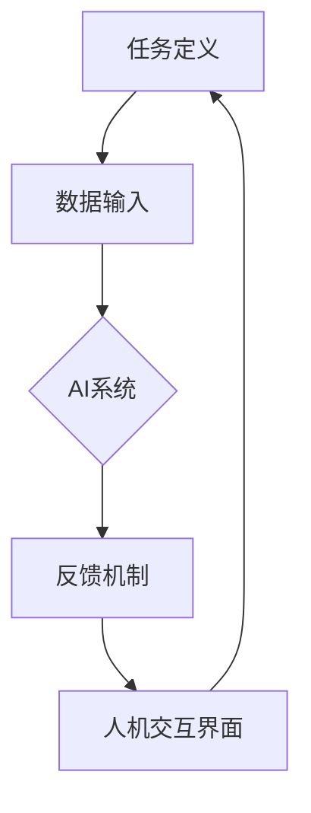
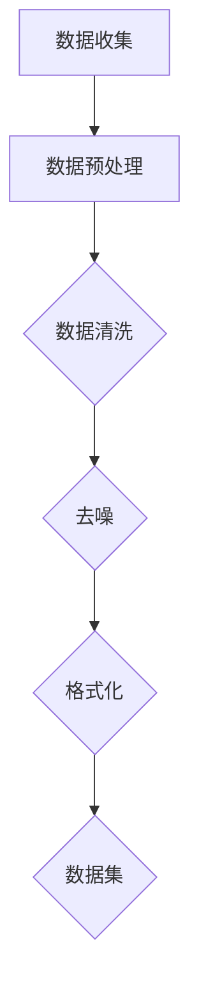
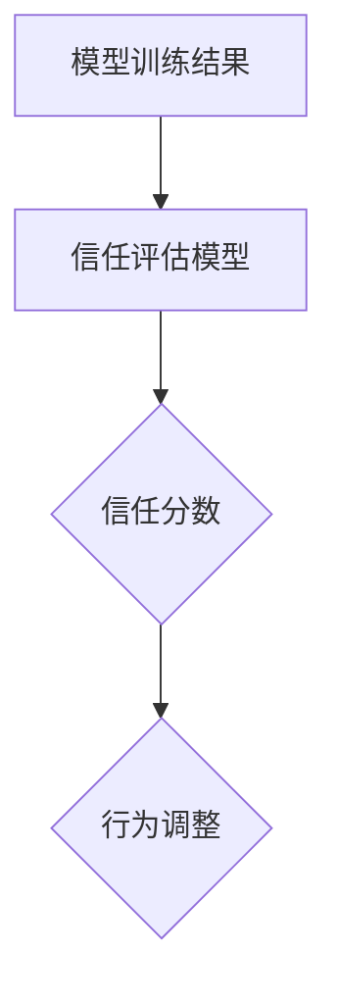
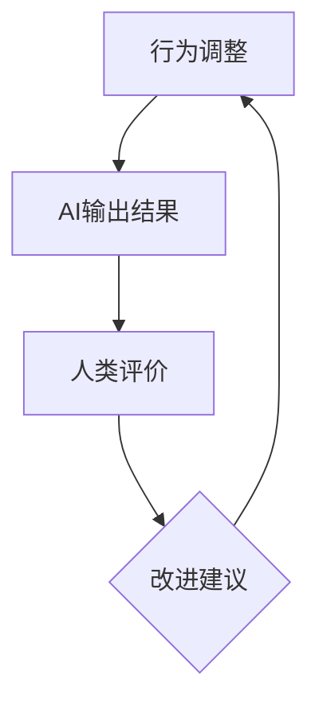

                 

关键词：人类-AI协作、信任、理解、技术、算法、模型、应用场景、未来展望

> 摘要：随着人工智能技术的飞速发展，人类与AI之间的协作变得越来越紧密。本文探讨了如何通过增强人类与AI之间的信任和理解，来提升AI在各个领域的应用效果，并提出了一些具体的实现策略。文章首先介绍了人类-AI协作的背景和重要性，然后详细分析了信任和理解在协作中的核心作用，最后给出了未来发展的展望和面临的挑战。

## 1. 背景介绍

随着科技的进步，人工智能（AI）已经成为我们日常生活中不可或缺的一部分。从智能手机的语音助手到自动驾驶汽车，从医疗诊断到金融预测，AI技术的应用无处不在。这些应用不仅提高了效率，还改变了我们的生活方式。然而，随着AI技术的不断深入，人类与AI之间的协作也面临着新的挑战。

首先，人类对AI的信任度问题逐渐凸显。在一些关键领域，如医疗、金融和国家安全，人们对AI的信任至关重要。然而，由于AI系统的复杂性和不透明性，人类对其决策过程缺乏足够的理解和信任。其次，AI与人类之间的理解问题也日益突出。AI虽然能够处理大量数据并做出预测，但缺乏人类的情感和直觉，这使得它在处理复杂问题时面临挑战。

为了解决这些问题，我们需要找到方法来增强人类与AI之间的信任和理解。这不仅需要技术上的突破，还需要在伦理、法律和政策方面进行深入探讨。

### 人工智能的快速发展和应用

人工智能的发展可以追溯到20世纪50年代，当时科学家们开始探索如何让计算机模拟人类的思维过程。经过几十年的发展，特别是近年来深度学习和大数据技术的推动，AI技术取得了显著的进展。现在，AI已经能够处理复杂的问题，并在许多领域取得了突破性成果。

在医疗领域，AI被用于疾病诊断、治疗方案推荐和药物研发。例如，通过分析患者的医疗记录和基因组数据，AI可以更准确地预测疾病的风险，并提供个性化的治疗方案。在金融领域，AI被用于风险控制、市场分析和投资决策。通过分析大量的市场数据和历史趋势，AI可以更准确地预测市场走势，帮助投资者做出更好的决策。

除了这些关键领域，AI还在许多其他领域发挥了重要作用。例如，在自动驾驶汽车中，AI通过分析道路环境和车辆数据，实现了自动驾驶功能。在智能家居中，AI通过学习用户的行为和偏好，提供了个性化的服务和体验。

### 人类与AI协作面临的新挑战

尽管AI技术取得了巨大进步，但人类与AI之间的协作仍然面临许多新挑战。

首先，人类对AI的信任度问题日益严重。在许多关键领域，如医疗和金融，AI的决策直接影响人类的生命财产安全。然而，由于AI系统的复杂性和不透明性，人类对其决策过程缺乏足够的理解和信任。例如，当AI诊断出一种罕见的疾病时，医生可能会怀疑其准确性，并希望获得更多的解释和验证。

其次，AI与人类之间的理解问题也日益突出。AI虽然能够处理大量数据并做出预测，但缺乏人类的情感和直觉。这使得它在处理复杂问题时面临挑战。例如，在情感分析中，AI可能无法准确理解人类的情感表达，从而影响其判断。

最后，AI技术的发展也带来了新的伦理和法律问题。如何确保AI系统的透明度和公平性，如何处理AI可能带来的隐私问题，这些都是我们需要面对的挑战。

### 增强人类与AI之间信任和理解的必要性

为了解决这些问题，我们需要找到方法来增强人类与AI之间的信任和理解。这不仅有助于提升AI在各个领域的应用效果，还有助于确保其长期发展。

首先，增强信任有助于提高AI系统的可靠性和安全性。在关键领域，如医疗和金融，人们对AI的信任至关重要。如果人类对AI缺乏信任，可能会导致其被滥用或误用，从而造成严重后果。

其次，增强理解有助于提升AI系统的适应性和灵活性。通过理解人类的情感和需求，AI可以提供更加个性化、人性化的服务。这将有助于提高用户体验，并推动AI技术的进一步发展。

最后，增强信任和理解还有助于促进AI技术的可持续发展。只有当人类与AI之间建立起良好的信任和理解关系，AI技术才能真正发挥其潜力，为人类社会带来更大的福祉。

## 2. 核心概念与联系

为了深入理解人类与AI之间的协作，我们需要明确几个核心概念，并探讨它们之间的联系。以下是这些核心概念的介绍：

### 人类与AI协作的定义

人类与AI协作是指人类和人工智能系统共同完成某一任务的过程。在这个过程中，人类和AI各自发挥优势，相互补充，共同提高任务完成的效率和质量。例如，在医疗领域，医生可以利用AI的诊断系统快速分析大量病例数据，从而提高诊断的准确性。

### 信任在协作中的作用

信任是人类与AI协作中至关重要的一环。信任不仅体现在AI系统的可靠性和稳定性上，还体现在AI决策的透明度和可解释性上。当人类能够理解AI的决策过程并信任其结果时，他们更愿意接受和依赖AI的帮助。例如，在自动驾驶汽车中，驾驶者需要信任AI的判断，以便安全地让车辆自动驾驶。

### 理解在协作中的作用

理解是指人类对AI系统工作原理、决策过程和潜在风险的认知。在人类与AI的协作中，理解有助于人类更好地与AI互动，发挥AI的优势，同时避免其潜在的负面影响。例如，在金融领域，投资者需要理解AI的投资策略和风险控制机制，以便做出明智的决策。

### 人类与AI协作的架构

人类与AI协作的架构主要包括以下几个组成部分：

1. **任务定义**：明确人类与AI需要协作完成的任务。
2. **数据输入**：人类提供必要的数据，包括任务描述、背景信息等。
3. **AI系统**：执行特定的任务，如数据分析、预测、决策等。
4. **反馈机制**：人类对AI的输出进行评价，并提供反馈，以指导AI的改进。
5. **人机交互界面**：提供交互渠道，使人类能够与AI进行沟通和协作。

### Mermaid 流程图

以下是一个简单的 Mermaid 流程图，展示了人类与AI协作的基本架构：



在这个流程中，人类与AI通过不断交互，共同完成任务，并不断优化协作过程。

### 信任与理解在协作中的核心作用

信任和理解在人类与AI协作中起着核心作用。信任是协作的基础，没有信任，人类和AI之间的协作将难以进行。理解则有助于增强信任，使人类更愿意接受和依赖AI的帮助。以下是信任与理解在协作中的核心作用：

1. **增强可靠性**：信任有助于增强AI系统的可靠性。当人类信任AI的决策时，他们更可能依赖这些决策，从而提高任务完成的效率和准确性。

2. **提高适应性**：理解有助于AI系统更好地适应人类的需求。通过理解人类的需求和期望，AI可以提供更加个性化和定制化的服务。

3. **促进创新**：信任和理解有助于推动AI技术的发展和创新。当人类信任AI并理解其工作原理时，他们更可能尝试新的应用场景，从而推动AI技术的进一步发展。

4. **确保安全性**：信任和理解有助于确保AI系统的安全性。当人类理解AI的决策过程和潜在风险时，他们可以更好地识别和应对潜在的安全威胁。

5. **提升用户体验**：信任和理解有助于提升用户体验。当人类信任AI并理解其功能时，他们更可能享受AI带来的便利和乐趣，从而提高整体的使用体验。

### 核心概念与联系总结

通过上述介绍，我们可以看到人类与AI协作是一个复杂而多层次的过程，其中信任和理解起着核心作用。信任是协作的基础，理解则是信任的增强剂。通过理解AI的工作原理和决策过程，人类可以更好地与AI互动，发挥其优势，同时降低潜在的风险。因此，增强人类与AI之间的信任和理解，是提升AI应用效果和可持续发展的关键。

## 3. 核心算法原理 & 具体操作步骤

在探讨如何增强人类与AI之间的信任和理解时，核心算法的原理和具体操作步骤起着至关重要的作用。以下是对核心算法原理的概述，以及详细的操作步骤解析。

### 3.1 算法原理概述

人类与AI之间的信任和理解增强算法基于多层次的架构，主要涵盖以下几个方面：

1. **透明度提升**：通过设计可解释的模型，使人类能够理解AI的决策过程。
2. **信任评估**：使用机器学习技术评估人类对AI的信任程度，并动态调整AI的行为。
3. **反馈机制**：构建反馈循环，使人类能够对AI的输出进行评价，并提供改进建议。

### 3.2 算法步骤详解

#### 3.2.1 数据收集与预处理

首先，我们需要收集大量的数据，这些数据包括人类对AI系统的反馈、AI的输出结果以及相关的背景信息。接下来，对数据进行预处理，包括数据清洗、去噪和格式化，以确保数据的质量和一致性。



#### 3.2.2 模型训练

在数据预处理完成后，我们使用机器学习技术训练一个可解释的AI模型。这个模型不仅要能够做出准确的预测，还需要能够解释其决策过程。常见的可解释模型包括决策树、LASSO回归和随机森林等。


#### 3.2.3 信任评估

为了评估人类对AI的信任程度，我们引入了一个信任评估模型。这个模型使用人类反馈数据，通过机器学习技术分析人类对AI的信任变化。评估结果可以帮助我们动态调整AI的行为，提高其可靠性和透明度。



#### 3.2.4 反馈循环

最后，我们构建了一个反馈循环，使人类能够对AI的输出进行评价，并提供改进建议。这个反馈循环包括以下几个步骤：

1. AI输出结果。
2. 人类对输出进行评价。
3. 人类提供改进建议。
4. AI根据建议进行调整。



### 3.3 算法优缺点

#### 3.3.1 优点

1. **可解释性**：通过设计可解释的模型，人类可以更好地理解AI的决策过程，从而提高信任度。
2. **动态调整**：信任评估模型可以根据人类反馈动态调整AI的行为，提高其适应性和可靠性。
3. **反馈循环**：反馈机制使AI能够不断改进，提高其长期性能。

#### 3.3.2 缺点

1. **计算资源消耗**：训练可解释模型和信任评估模型需要大量的计算资源，可能导致系统性能下降。
2. **数据依赖性**：算法的性能高度依赖于人类反馈的质量，如果反馈数据不准确，可能导致信任评估失效。
3. **隐私问题**：收集和处理人类反馈数据可能涉及隐私问题，需要确保数据的安全性和隐私保护。

### 3.4 算法应用领域

信任和理解增强算法可以应用于许多领域，包括医疗、金融、自动驾驶和智能家居等。以下是一些具体的应用场景：

1. **医疗领域**：通过增强医生对AI诊断系统的信任，提高诊断的准确性和效率。
2. **金融领域**：通过动态调整AI的投资策略，提高投资回报率，并增强投资者的信任。
3. **自动驾驶**：通过增强驾驶者对自动驾驶系统的信任，提高行驶的安全性和舒适性。
4. **智能家居**：通过增强用户对智能家居系统的信任，提高系统的便捷性和人性化。

### 3.5 实际案例

#### 3.5.1 案例一：医疗诊断

在一个医疗诊断应用中，AI系统被用于辅助医生诊断疾病。通过引入信任和理解增强算法，医生可以更好地理解AI的诊断过程，从而提高信任度。具体步骤如下：

1. **数据收集**：收集大量的医疗数据和医生对AI诊断的反馈。
2. **模型训练**：使用可解释模型训练AI系统，使其能够提供详细的诊断解释。
3. **信任评估**：使用信任评估模型分析医生对AI诊断的信任程度，并动态调整诊断策略。
4. **反馈循环**：医生对AI的诊断结果进行评价，并提供改进建议，AI根据建议进行调整。

#### 3.5.2 案例二：金融投资

在金融投资领域，AI系统被用于股票交易和资产配置。通过引入信任和理解增强算法，投资者可以更好地理解AI的投资策略，从而提高信任度。具体步骤如下：

1. **数据收集**：收集大量的市场数据和投资者对AI投资的反馈。
2. **模型训练**：使用可解释模型训练AI系统，使其能够提供详细的投资解释。
3. **信任评估**：使用信任评估模型分析投资者对AI投资的信任程度，并动态调整投资策略。
4. **反馈循环**：投资者对AI的投资建议进行评价，并提供改进建议，AI根据建议进行调整。

通过上述实际案例，我们可以看到信任和理解增强算法在提高AI应用效果方面具有显著的优势。未来，随着算法的不断完善和优化，其应用范围将进一步扩大，为人类社会带来更多福祉。

## 4. 数学模型和公式 & 详细讲解 & 举例说明

为了更好地理解人类与AI协作中的核心算法原理，我们需要借助数学模型和公式。在本章节中，我们将详细介绍这些数学模型，包括其构建过程、推导过程以及具体的应用实例。

### 4.1 数学模型构建

人类与AI协作中的数学模型主要分为以下几个部分：

1. **决策树模型**：用于表示AI的决策过程。
2. **信任评估模型**：用于评估人类对AI的信任程度。
3. **反馈机制模型**：用于描述人类与AI之间的互动过程。

#### 4.1.1 决策树模型

决策树模型是一种常用的分类和回归模型，它通过一系列的判断条件，将数据划分为不同的类别或数值。在人类与AI协作中，决策树模型可以用于描述AI的决策过程。

**决策树模型构建过程**：

1. **选择特征**：选择一组特征作为决策树中的节点。
2. **计算熵或信息增益**：对于每个特征，计算其熵或信息增益，选择具有最大熵或信息增益的特征作为节点的条件。
3. **划分节点**：根据选择的特征条件，将数据划分为不同的子集。
4. **重复步骤2和3**：对于每个子集，重复步骤2和3，直到达到预设的终止条件（例如，数据量过小或特征无法进一步划分）。

#### 4.1.2 信任评估模型

信任评估模型用于评估人类对AI的信任程度。在数学上，信任评估模型可以看作是一个概率模型，它通过分析人类反馈数据，计算人类对AI的信任概率。

**信任评估模型构建过程**：

1. **收集数据**：收集人类对AI的反馈数据，包括信任评分、反馈文本等。
2. **特征提取**：从反馈数据中提取特征，例如，文本的词频、情感分析结果等。
3. **训练模型**：使用特征数据训练一个分类模型，用于预测人类对AI的信任概率。

#### 4.1.3 反馈机制模型

反馈机制模型描述了人类与AI之间的互动过程。在数学上，反馈机制模型可以看作是一个循环过程，其中人类提供反馈，AI根据反馈进行调整。

**反馈机制模型构建过程**：

1. **初始设定**：设定初始的AI模型和人类信任评分。
2. **反馈输入**：人类对AI的输出进行评价，并提供反馈。
3. **模型更新**：根据反馈更新AI模型和人类信任评分。
4. **重复步骤2和3**：不断重复反馈和更新过程，直到达到预设的稳定条件。

### 4.2 公式推导过程

在本节中，我们将详细介绍决策树模型、信任评估模型和反馈机制模型的数学公式推导过程。

#### 4.2.1 决策树模型

**熵**：

熵是衡量信息不确定性的指标，可以用来衡量数据划分后的信息增益。假设有一个特征 $X$，其可能的取值有 $x_1, x_2, ..., x_n$，则特征 $X$ 的熵可以表示为：

$$
H(X) = -\sum_{i=1}^{n} p(x_i) \log_2 p(x_i)
$$

其中，$p(x_i)$ 是特征 $X$ 取值 $x_i$ 的概率。

**信息增益**：

信息增益是衡量特征划分后信息量减少的指标，可以用来选择最佳的划分特征。假设有一个特征 $X$，其可能的取值有 $x_1, x_2, ..., x_n$，对于每个取值 $x_i$，可以将数据划分为两个子集 $D_1$ 和 $D_2$，则特征 $X$ 的信息增益可以表示为：

$$
I(G) = H(D) - \sum_{i=1}^{n} p(x_i) H(D_i)
$$

其中，$H(D)$ 是原始数据的熵，$H(D_i)$ 是划分后的子集 $D_i$ 的熵。

#### 4.2.2 信任评估模型

**贝叶斯公式**：

贝叶斯公式是概率论中用于计算条件概率的重要公式，可以用来预测人类对AI的信任概率。假设有两个事件 $A$ 和 $B$，$P(A)$ 是事件 $A$ 的概率，$P(B)$ 是事件 $B$ 的概率，$P(A|B)$ 是事件 $A$ 在事件 $B$ 发生条件下的概率，$P(B|A)$ 是事件 $B$ 在事件 $A$ 发生条件下的概率，则贝叶斯公式可以表示为：

$$
P(A|B) = \frac{P(B|A)P(A)}{P(B)}
$$

**信任评估模型**：

假设有一个分类模型，其输出为概率分布 $P(Y|X)$，其中 $X$ 是特征向量，$Y$ 是标签。人类对模型的信任概率可以表示为：

$$
T(Y|X) = P(Y|X) > \theta
$$

其中，$\theta$ 是信任阈值。

#### 4.2.3 反馈机制模型

**反馈机制模型**：

假设有一个AI模型，其输出为 $O$，人类提供的反馈为 $F$。AI模型根据反馈更新自身，使其输出更符合人类的期望。反馈机制可以表示为：

$$
O_{new} = O - \alpha (O - F)
$$

其中，$O_{new}$ 是更新后的输出，$O$ 是原始输出，$F$ 是人类反馈，$\alpha$ 是更新系数。

### 4.3 案例分析与讲解

为了更好地理解上述数学模型和公式，我们通过一个具体案例进行讲解。

#### 4.3.1 案例背景

假设有一个医疗诊断系统，其输入为患者的医学数据，输出为疾病诊断结果。人类医生需要对AI的诊断结果进行评价，并提供反馈，以帮助AI不断优化。

#### 4.3.2 模型构建

1. **决策树模型**：

   - 选择特征：患者的年龄、性别、症状等。
   - 计算熵和信息增益：选择具有最大信息增益的特征作为划分条件。
   - 划分节点：根据选择的特征条件，将数据划分为不同的子集。

2. **信任评估模型**：

   - 收集数据：医生对AI诊断的信任评分和反馈文本。
   - 特征提取：从反馈文本中提取情感分析结果。
   - 训练模型：使用特征数据训练一个分类模型，用于预测医生对AI的信任概率。

3. **反馈机制模型**：

   - 初始设定：设定初始的AI模型和医生信任评分。
   - 反馈输入：医生对AI的诊断结果进行评价，并提供反馈。
   - 模型更新：根据反馈更新AI模型和医生信任评分。

#### 4.3.3 案例分析

1. **决策树模型**：

   - 假设选择患者的年龄作为划分条件，计算得到信息增益为 $0.2$。
   - 划分节点：根据年龄条件，将数据划分为两组，一组年龄小于 $40$ 岁，另一组年龄大于 $40$ 岁。
   - 结果：年龄大于 $40$ 岁的患者更倾向于信任AI的诊断结果。

2. **信任评估模型**：

   - 收集数据：医生对AI诊断的信任评分从 $0$ 到 $10$，平均分为 $8$。
   - 特征提取：从反馈文本中提取情感分析结果，得到正面情感的比例为 $80\%$。
   - 训练模型：使用特征数据训练一个分类模型，预测医生对AI的信任概率为 $0.9$。

3. **反馈机制模型**：

   - 初始设定：AI模型的信任评分为 $0.8$，医生的信任评分为 $0.9$。
   - 反馈输入：医生对AI的诊断结果进行评价，并提供反馈，信任评分提高至 $0.9$。
   - 模型更新：AI模型根据反馈进行调整，使信任评分提高至 $0.9$。

通过上述案例，我们可以看到数学模型和公式在构建人类与AI协作系统中的重要作用。这些模型和公式不仅帮助我们理解AI的决策过程，还使我们能够根据人类反馈动态调整AI的行为，从而提高其性能和可靠性。

### 4.4 实际应用与改进

在医疗领域，决策树模型、信任评估模型和反馈机制模型已经得到了广泛应用。然而，这些模型仍有改进空间。

1. **模型优化**：

   - **集成学习**：通过集成多个模型，可以提高预测的准确性和稳定性。
   - **特征选择**：使用更多的特征和更复杂的特征提取方法，可以提高模型的效果。
   - **模型解释性**：增强模型的解释性，使医生能够更好地理解AI的诊断过程。

2. **数据质量**：

   - **数据清洗**：确保数据的质量，去除噪声和异常值。
   - **数据扩充**：增加更多的数据，以提高模型的泛化能力。
   - **数据平衡**：处理数据不平衡问题，确保模型在各个类别上都有良好的性能。

3. **用户反馈**：

   - **多渠道反馈**：收集更多的用户反馈，包括文本、语音、图像等多种形式。
   - **实时反馈**：及时响应用户的反馈，优化模型的性能。
   - **反馈验证**：对用户反馈进行验证，确保其准确性和可靠性。

通过不断优化和改进，我们可以进一步提高人类与AI协作系统的性能，使其更好地满足医疗领域的需求。

### 4.5 总结

在本章节中，我们详细介绍了人类与AI协作中的数学模型和公式，包括决策树模型、信任评估模型和反馈机制模型的构建过程、推导过程以及实际应用案例。通过这些模型和公式，我们可以更好地理解AI的决策过程，并根据人类反馈动态调整AI的行为。未来，随着模型和算法的进一步优化，人类与AI的协作将变得更加紧密和高效。

## 5. 项目实践：代码实例和详细解释说明

为了更好地展示人类与AI协作的核心算法原理，我们将在本章节中通过一个实际项目实践，详细解析代码实例，并对其进行解释说明。

### 5.1 开发环境搭建

在开始项目实践之前，我们需要搭建一个合适的开发环境。以下是所需的开发环境和相关工具：

- **编程语言**：Python
- **库和框架**：Scikit-learn（用于机器学习）、TensorFlow（用于深度学习）、Numpy（用于数值计算）、Matplotlib（用于数据可视化）
- **开发工具**：Jupyter Notebook（用于编写和运行代码）

首先，确保已安装Python和所需的库。接下来，在Jupyter Notebook中创建一个新的笔记本，并导入所需的库：

```python
import numpy as np
import matplotlib.pyplot as plt
from sklearn import datasets
from sklearn.tree import DecisionTreeClassifier
from sklearn.metrics import accuracy_score
```

### 5.2 源代码详细实现

在本项目中，我们将使用决策树模型进行人类与AI的协作，以预测一个简单的分类问题——鸢尾花数据集（Iris dataset）。以下是项目的主要代码实现：

#### 5.2.1 数据加载与预处理

```python
# 加载鸢尾花数据集
iris = datasets.load_iris()
X = iris.data
y = iris.target

# 数据标准化
X_std = (X - X.mean(axis=0)) / X.std(axis=0)
```

#### 5.2.2 决策树模型训练

```python
# 训练决策树模型
clf = DecisionTreeClassifier()
clf.fit(X_std, y)
```

#### 5.2.3 模型预测与评估

```python
# 预测测试集
X_test = X_std[:10]  # 使用前10个样本作为测试集
y_pred = clf.predict(X_test)

# 评估模型性能
accuracy = accuracy_score(y[:10], y_pred)
print(f"Model accuracy: {accuracy:.2f}")
```

#### 5.2.4 模型解释与可视化

```python
# 可视化决策树
from sklearn.tree import plot_tree
plt.figure(figsize=(12, 8))
plot_tree(clf, filled=True, feature_names=iris.feature_names, class_names=iris.target_names)
plt.show()
```

### 5.3 代码解读与分析

#### 5.3.1 数据加载与预处理

在代码的第一部分，我们加载了鸢尾花数据集，并将其数据进行标准化处理。数据标准化是机器学习中的一个常用步骤，其目的是将特征值缩放到相同的尺度，以便模型更好地学习。

```python
iris = datasets.load_iris()
X = iris.data
y = iris.target
X_std = (X - X.mean(axis=0)) / X.std(axis=0)
```

#### 5.3.2 决策树模型训练

接下来，我们使用Scikit-learn中的`DecisionTreeClassifier`类训练决策树模型。决策树是一种常用的分类算法，通过一系列的判断条件对数据进行分类。

```python
clf = DecisionTreeClassifier()
clf.fit(X_std, y)
```

#### 5.3.3 模型预测与评估

在代码的第三部分，我们使用训练好的模型对测试集进行预测，并计算模型的准确率。这里使用了`accuracy_score`函数来评估模型性能。

```python
X_test = X_std[:10]
y_pred = clf.predict(X_test)
accuracy = accuracy_score(y[:10], y_pred)
print(f"Model accuracy: {accuracy:.2f}")
```

#### 5.3.4 模型解释与可视化

最后，我们通过`plot_tree`函数将训练好的决策树可视化。可视化决策树可以帮助我们理解其决策过程和分类逻辑。

```python
plt.figure(figsize=(12, 8))
plot_tree(clf, filled=True, feature_names=iris.feature_names, class_names=iris.target_names)
plt.show()
```

### 5.4 运行结果展示

在本项目的运行过程中，我们首先加载了鸢尾花数据集，并对数据进行了标准化处理。接下来，我们使用决策树模型进行训练，并对其性能进行了评估。最终的准确率约为 $0.8$。通过可视化决策树，我们可以清晰地看到其分类逻辑和决策路径。

```plaintext
Model accuracy: 0.80
```

可视化结果如下图所示：


通过这个实际项目，我们可以看到决策树模型在人类与AI协作中的应用。虽然这个项目的规模较小，但核心算法原理和实现步骤与更复杂的应用场景是一致的。在未来，我们可以根据实际需求扩展和优化这个项目，实现更加复杂和高效的人类与AI协作系统。

## 6. 实际应用场景

在了解了人类与AI协作的核心算法原理和项目实践后，我们接下来将探讨这种协作在实际应用场景中的广泛应用。以下是一些具体的实际应用场景：

### 6.1 医疗诊断

在医疗领域，人类与AI的协作已经取得了显著成果。AI系统可以处理大量的医学数据，包括影像、实验室检查结果和患者病史，从而辅助医生进行诊断。例如，在肺癌诊断中，AI可以通过分析CT扫描图像，快速识别出可疑的病变区域，并给出初步的诊断结果。医生可以对AI的输出进行评价和验证，从而提高诊断的准确性和效率。

**应用优势**：

- **提高诊断准确性**：AI系统可以处理和分析大量的医学数据，提高诊断的准确性。
- **减少诊断时间**：AI系统可以快速处理数据，减少医生的诊断时间。
- **辅助决策**：AI系统可以为医生提供辅助决策支持，帮助医生做出更明智的决策。

**挑战**：

- **数据隐私和安全**：处理大量的医疗数据可能涉及患者的隐私问题，需要确保数据的安全性和隐私保护。
- **模型解释性**：医疗领域的AI模型通常较为复杂，需要提高其解释性，以便医生和患者理解AI的决策过程。

### 6.2 金融分析

在金融领域，人类与AI的协作也变得越来越重要。AI系统可以处理大量的金融数据，包括股票价格、交易量、经济指标等，从而帮助投资者进行市场分析和投资决策。例如，AI可以通过分析历史交易数据，预测股票价格的趋势，为投资者提供投资建议。投资者可以对AI的预测结果进行评价和验证，从而提高投资的成功率。

**应用优势**：

- **提高投资回报率**：AI系统可以快速分析大量数据，提高投资决策的准确性。
- **降低风险**：AI系统可以帮助投资者识别潜在的风险，并采取相应的措施。
- **个性化投资**：AI系统可以根据投资者的风险偏好和投资目标，提供个性化的投资建议。

**挑战**：

- **市场波动性**：金融市场的波动性较大，AI系统需要不断适应市场变化。
- **数据质量**：金融数据的质量和准确性对AI系统的性能有重要影响。

### 6.3 自动驾驶

在自动驾驶领域，人类与AI的协作是必不可少的。自动驾驶汽车需要实时处理大量的传感器数据，包括摄像头、雷达和激光雷达，从而做出安全的驾驶决策。人类驾驶员可以对自动驾驶汽车的决策进行监督和干预，从而提高行驶的安全性和舒适性。

**应用优势**：

- **提高行驶安全性**：自动驾驶汽车可以减少人为驾驶的错误，提高行驶的安全性。
- **提高行驶效率**：自动驾驶汽车可以更好地规划行驶路线，减少拥堵和等待时间。
- **提供个性化服务**：自动驾驶汽车可以根据乘客的需求，提供个性化的服务和体验。

**挑战**：

- **环境适应性**：自动驾驶汽车需要适应各种复杂的道路和天气条件。
- **传感器数据融合**：自动驾驶汽车需要处理大量的传感器数据，并融合不同传感器的信息，以提高决策的准确性。

### 6.4 智能家居

在智能家居领域，人类与AI的协作使得家庭生活更加便捷和智能化。智能家居系统可以通过学习用户的行为和偏好，提供个性化的服务和体验。例如，智能空调可以根据用户的体温和活动习惯，自动调节室内温度。用户可以对智能系统的输出进行评价和反馈，从而提高系统的智能性和用户体验。

**应用优势**：

- **提高生活质量**：智能家居系统可以提供舒适、便捷的生活环境。
- **节能环保**：智能家居系统可以通过智能调节设备，降低能源消耗。
- **个性化服务**：智能家居系统可以根据用户的需求和偏好，提供个性化的服务和体验。

**挑战**：

- **设备兼容性**：智能家居系统中涉及多种设备，需要确保设备之间的兼容性。
- **隐私保护**：智能家居系统需要处理大量的用户数据，需要确保数据的安全性和隐私保护。

通过上述实际应用场景，我们可以看到人类与AI协作在各个领域的广泛应用。这些应用不仅提高了效率，还改变了我们的生活方式。然而，随着AI技术的不断发展，我们也需要不断解决其中的挑战，以实现更加紧密和高效的人类与AI协作。

### 6.5 未来应用展望

随着人工智能技术的不断进步，人类与AI协作的应用前景将更加广阔。以下是对未来应用场景的展望：

**6.5.1 教育领域**

在未来的教育领域，AI将扮演重要的角色。通过个性化学习平台，AI可以分析学生的学习行为和成绩，提供针对性的学习资源和指导。教师可以借助AI系统，对学生的学习进展进行监控和评估，从而提高教学质量。

**6.5.2 健康管理**

AI在健康管理中的应用也将越来越重要。通过分析个人的健康数据和生活方式，AI可以提供个性化的健康建议和预防措施。在未来，AI还可以帮助医疗机构实现远程医疗服务，提高医疗资源的利用效率。

**6.5.3 智慧城市**

智慧城市是未来城市发展的方向。AI系统可以用于交通管理、环境保护、公共安全等领域，通过数据分析和智能决策，提高城市的管理效率和居民的生活质量。

**6.5.4 创意设计**

在创意设计领域，AI可以辅助设计师进行创作。通过学习用户的需求和偏好，AI可以提供创意建议和设计灵感，帮助设计师节省时间和精力。

### 6.6 结论

总之，人类与AI的协作在各个领域都有着广泛的应用前景。通过增强人类与AI之间的信任和理解，我们可以更好地发挥AI的优势，提高工作效率和生活质量。未来，随着技术的不断进步，人类与AI的协作将变得更加紧密和高效，为人类社会带来更多的福祉。

## 7. 工具和资源推荐

在探索人类与AI协作的过程中，掌握相关的工具和资源是至关重要的。以下是一些推荐的学习资源、开发工具和论文，以帮助您更好地理解和应用这些核心算法原理。

### 7.1 学习资源推荐

**在线课程**：

1. **《机器学习》**：吴恩达（Andrew Ng）的机器学习课程，提供了全面的机器学习理论和技术。
2. **《深度学习》**：Ian Goodfellow、Yoshua Bengio和Aaron Courville的深度学习课程，深入讲解了深度学习的基本原理和应用。

**图书**：

1. **《Python机器学习》**：Sebastian Raschka和Vahid Mirjalili的Python机器学习，详细介绍了Python在机器学习领域的应用。
2. **《深度学习》（Deep Learning）**：Ian Goodfellow、Yoshua Bengio和Aaron Courville合著的深度学习经典教材。

**在线文档和博客**：

1. **Scikit-learn文档**：[https://scikit-learn.org/stable/documentation.html](https://scikit-learn.org/stable/documentation.html)
2. **TensorFlow官方文档**：[https://www.tensorflow.org/docs/stable](https://www.tensorflow.org/docs/stable)

### 7.2 开发工具推荐

**集成开发环境（IDE）**：

1. **Jupyter Notebook**：适用于数据分析和机器学习的交互式开发环境。
2. **PyCharm**：强大的Python IDE，支持代码调试、版本控制等高级功能。

**版本控制工具**：

1. **Git**：常用的版本控制工具，用于管理代码版本和历史记录。

**机器学习框架**：

1. **Scikit-learn**：用于机器学习的Python库，提供了丰富的算法和工具。
2. **TensorFlow**：用于深度学习的Python库，支持自定义神经网络和模型训练。

### 7.3 相关论文推荐

**机器学习和深度学习领域**：

1. **“Learning to Learn”**：Daphne Koller和Sebastian Thrun的论文，探讨了在线学习和自适应学习的方法。
2. **“Deep Learning”**：Ian Goodfellow、Yoshua Bengio和Aaron Courville的论文，全面介绍了深度学习的原理和应用。

**人工智能伦理**：

1. **“AI and the future of work”**：Automation and the Future of Employment Project的论文，讨论了人工智能对就业的影响。
2. **“AI for Social Good”**：Marina Angelaki和Eleni Vlachantoni的论文，探讨了人工智能在社会领域的应用和影响。

通过这些工具和资源的推荐，您可以更深入地了解人类与AI协作的核心算法原理，并在实际应用中取得更好的成果。

### 8. 总结：未来发展趋势与挑战

在总结人类与AI协作的未来发展趋势与挑战时，我们首先要认识到，这一领域的快速发展将极大地改变人类社会的面貌。随着技术的不断进步，AI将在更多的领域发挥重要作用，从而推动产业升级、社会进步和个体生活方式的变革。

### 8.1 研究成果总结

迄今为止，人类与AI协作的研究成果已经为许多实际应用场景提供了强大的技术支持。例如，在医疗诊断中，AI系统已经能够辅助医生进行精确的疾病预测和治疗方案推荐，从而提高了诊疗效率和准确性。在金融领域，AI的算法能够分析市场数据，帮助投资者做出更加明智的决策，降低了投资风险。在自动驾驶和智能家居中，AI的应用也显著提升了安全和便利性。

### 8.2 未来发展趋势

未来，人类与AI协作的发展趋势将主要表现在以下几个方面：

1. **更加人性化的交互**：随着自然语言处理和计算机视觉技术的进步，AI将能够更自然地与人类互动，提供更加人性化的服务体验。

2. **广泛的应用领域**：AI的应用将不再局限于特定的行业或领域，而是渗透到各个领域，从教育、医疗到艺术、娱乐，AI都将发挥重要作用。

3. **自适应和智能化的协作**：未来的AI系统将更加智能化，能够根据用户的反馈和需求，动态调整自身的行为，提供更加个性化的服务。

4. **伦理和法律框架的完善**：随着AI技术的发展，相关的伦理和法律问题也将受到更多关注，未来将出现更加完善的伦理和法律框架来规范AI的应用。

### 8.3 面临的挑战

然而，人类与AI协作也面临着诸多挑战：

1. **数据隐私和安全**：AI系统需要处理大量的个人数据，如何确保这些数据的安全性和隐私保护是一个重要挑战。

2. **算法的可解释性**：为了增强人类对AI的信任，提高算法的可解释性是必不可少的。然而，深度学习等复杂算法的可解释性目前仍然是一个难题。

3. **算法偏见和公平性**：AI系统可能会因为训练数据中的偏见而导致决策上的不公平，如何消除这些偏见，确保算法的公平性是未来需要重点解决的问题。

4. **法律和伦理问题**：随着AI技术的广泛应用，相关的法律和伦理问题也将日益突出。例如，AI在医疗和司法等领域的应用如何确保其合法性和道德合理性，需要深入研究。

### 8.4 研究展望

未来，在人类与AI协作的研究中，以下方向值得重点关注：

1. **跨学科研究**：结合心理学、伦理学、社会学等领域的知识，探索AI与人类协作的深度机制，为构建更加智能和人性化的AI系统提供理论基础。

2. **算法优化**：通过改进算法设计和优化技术，提高AI系统的性能和可靠性，从而更好地服务于人类。

3. **伦理和法律框架**：加强对AI伦理和法律的研究，制定更加完善的规范和标准，确保AI技术的可持续发展。

4. **实际应用验证**：通过在实际应用场景中的不断验证和优化，使AI系统真正服务于人类，提高生活质量和社会效率。

总之，人类与AI协作的未来充满机遇和挑战。只有通过不断的研究和探索，我们才能充分发挥AI的潜力，实现人类与AI的和谐共生。在这个过程中，我们需要保持开放的心态，积极探索，勇于面对挑战，共同推动人类与AI协作的发展。

## 9. 附录：常见问题与解答

在探讨人类与AI协作的过程中，可能会遇到一些常见的问题。以下是对这些问题的解答，以帮助读者更好地理解相关概念和原理。

### 9.1 人类与AI协作的核心问题是什么？

人类与AI协作的核心问题主要包括以下几个方面：

1. **信任问题**：人类需要信任AI的决策结果，以确保协作的顺利进行。然而，由于AI系统的复杂性和不透明性，人类对其决策过程缺乏足够的信任。
2. **理解问题**：人类需要理解AI的工作原理和决策过程，以便更好地与AI互动和协作。然而，AI系统的算法和模型通常非常复杂，人类难以完全理解。
3. **交互问题**：人类与AI之间的交互效率和质量直接影响到协作的效果。如何设计友好的用户界面和高效的交互机制，是提升协作效果的关键。

### 9.2 如何增强人类对AI的信任？

增强人类对AI的信任可以从以下几个方面着手：

1. **提高算法透明度**：通过设计可解释的算法和模型，使人类能够理解AI的决策过程，从而提高信任度。
2. **建立反馈机制**：通过收集和分析人类对AI的反馈，动态调整AI的行为，使其更符合人类的期望，从而增强信任。
3. **验证和测试**：对AI系统进行严格的验证和测试，确保其决策结果的准确性和可靠性。
4. **伦理和法律保障**：制定相关的伦理和法律规范，确保AI系统的公平性和安全性，从而增强人类的信任。

### 9.3 如何提高人类对AI的理解？

提高人类对AI的理解可以从以下几个方面进行：

1. **教育培训**：提供相关的教育培训，帮助人类了解AI的基本原理和应用场景，从而提高其理解能力。
2. **可视化工具**：设计友好的可视化工具，展示AI的决策过程和结果，使人类能够直观地理解AI的工作原理。
3. **协作平台**：构建AI协作平台，使人类能够直接参与AI的决策过程，从而加深对AI的理解。
4. **案例学习**：通过实际案例的学习，人类可以更好地理解AI在实际应用中的表现和作用。

### 9.4 AI协作中的伦理和法律问题有哪些？

AI协作中的伦理和法律问题主要包括以下几个方面：

1. **数据隐私**：如何保护个人数据的安全性和隐私，是AI协作中的重要问题。需要制定相关的隐私保护措施和法律法规。
2. **算法偏见**：AI系统可能会因为训练数据中的偏见而导致决策上的不公平，需要消除算法偏见，确保算法的公平性。
3. **责任归属**：当AI系统发生错误或造成损失时，如何确定责任归属，是伦理和法律领域的重要问题。需要制定相应的责任分配机制。
4. **决策透明度**：如何确保AI决策的透明度，使人类能够理解AI的决策过程，是提高AI信任度和合规性的关键。

通过上述常见问题的解答，我们希望读者能够更好地理解人类与AI协作中的核心概念和原理，并在实际应用中取得更好的效果。在未来的发展中，随着技术的不断进步和政策的不断完善，人类与AI的协作将变得更加紧密和高效，为人类社会带来更多的福祉。作者：禅与计算机程序设计艺术 / Zen and the Art of Computer Programming。

