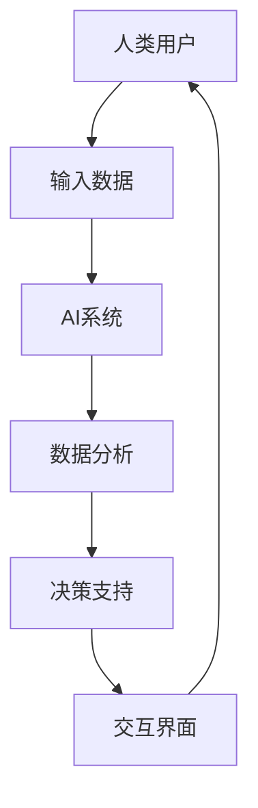

                 

### 关键词：人类-AI协作、智慧增强、道德决策、人工智能、合作

> **摘要**：本文深入探讨了人类与人工智能（AI）的协作模式，如何通过AI增强人类的智慧以及如何确保在协作过程中实现道德决策。文章首先介绍了AI技术的基本原理，然后详细分析了AI在智慧增强和道德决策支持方面的应用，最后提出了未来发展的趋势和面临的挑战。

## 1. 背景介绍

### 1.1 人工智能技术的发展

人工智能（AI）是计算机科学的一个分支，致力于创建智能代理，这些代理能够在特定环境中执行复杂的任务并表现出人类级别的智能。自20世纪50年代诞生以来，AI经历了几个发展阶段，包括规则系统、知识表示、机器学习、深度学习等。如今，随着计算能力和数据资源的不断增长，AI技术已经取得了显著进展，从简单的任务自动化到复杂的决策支持，AI的应用范围日益广泛。

### 1.2 人类智慧的局限性

尽管人类智慧在许多领域都表现出色，但仍然存在局限性。首先，人类认知有限，无法同时处理大量信息。其次，人类在做出决策时往往受到情感、偏见和短期利益的影响。此外，人类的生理和心理特性也限制了我们的工作时间和认知能力。为了克服这些限制，人类需要借助外部的智能系统来增强自身的智慧和决策能力。

## 2. 核心概念与联系

为了更好地理解人类与AI协作的概念，我们首先需要明确一些核心概念和它们之间的关系。

### 2.1 智慧增强（Cognitive Augmentation）

智慧增强是指通过技术手段扩展人类认知能力和决策能力的过程。AI在智慧增强中扮演着重要角色，通过处理和分析大量数据，AI可以为人类提供更全面、更准确的信息，从而帮助人类做出更好的决策。

### 2.2 道德决策（Moral Decision Making）

道德决策是指在道德和伦理框架内做出合适的选择。道德决策不仅涉及道德原则，还涉及人类价值观和情感。在人类-AI协作中，AI可以作为道德顾问，提供基于伦理规则的决策支持，帮助人类在复杂情境中做出道德决策。

### 2.3 人类-AI协作架构

人类-AI协作的架构通常包括以下几个组成部分：

- **人类用户**：作为决策者和问题解决者，人类用户使用AI系统提供的信息和建议来做出决策。
- **AI系统**：通过机器学习和数据分析技术，AI系统从数据中提取有用信息，并为人类用户提供决策支持。
- **交互界面**：交互界面用于人类用户与AI系统之间的沟通，包括输入数据、接收反馈和进行交互。
- **伦理和道德框架**：确保AI系统在决策过程中遵循道德和伦理规则，以实现公正、公平和透明的协作。

### 2.4 Mermaid 流程图

以下是人类-AI协作的一个简单 Mermaid 流程图，展示了核心概念和它们之间的关系：



## 3. 核心算法原理 & 具体操作步骤

### 3.1 算法原理概述

人类-AI协作的核心算法主要包括数据收集、数据预处理、机器学习模型训练、决策支持等步骤。以下是这些步骤的简要概述：

- **数据收集**：收集与决策相关的数据，包括历史数据、实时数据和外部数据源。
- **数据预处理**：清洗和预处理数据，以确保数据质量，包括数据去重、缺失值填充、异常值处理等。
- **机器学习模型训练**：使用收集到的数据训练机器学习模型，以识别数据中的模式和趋势。
- **决策支持**：将训练好的模型应用于新数据，为人类用户提供决策支持。

### 3.2 算法步骤详解

以下是人类-AI协作的具体操作步骤：

#### 3.2.1 数据收集

- **数据类型**：收集与决策相关的多种数据，包括结构化数据（如数据库记录）、半结构化数据（如XML文档）和非结构化数据（如图像和文本）。
- **数据来源**：数据可以从内部数据库、外部API、传感器和网络爬虫等渠道获取。

#### 3.2.2 数据预处理

- **数据清洗**：去除重复数据、纠正错误数据、填充缺失数据。
- **特征提取**：将原始数据转换为特征向量，以便于机器学习模型处理。
- **归一化**：将特征值缩放到相同的尺度，以便模型训练。

#### 3.2.3 机器学习模型训练

- **选择模型**：根据问题类型和数据特点选择合适的机器学习模型，如线性回归、决策树、神经网络等。
- **训练模型**：使用预处理后的数据训练模型，通过调整模型参数以最小化预测误差。
- **验证模型**：使用验证集评估模型性能，确保模型具有良好的泛化能力。

#### 3.2.4 决策支持

- **预测**：将模型应用于新数据，生成预测结果。
- **建议**：根据预测结果为人类用户提供决策建议。
- **反馈**：收集人类用户的决策反馈，用于模型优化和迭代。

### 3.3 算法优缺点

#### 优点

- **提高决策效率**：AI系统能够快速处理和分析大量数据，为人类用户提供及时、准确的决策支持。
- **减少错误**：通过机器学习算法，AI系统可以识别数据中的模式和趋势，减少人类决策中的错误。
- **知识扩展**：AI系统可以存储和分享知识，帮助人类扩展认知范围。

#### 缺点

- **数据依赖**：AI系统的性能高度依赖于数据质量和数量，数据质量不佳可能导致模型失效。
- **算法偏差**：如果训练数据存在偏差，AI系统可能会学习到错误的模式，导致决策偏差。
- **道德风险**：AI系统在道德决策方面的局限性可能导致不道德的行为。

### 3.4 算法应用领域

AI在智慧增强和道德决策支持方面的应用非常广泛，以下是一些典型领域：

- **医疗健康**：AI系统可以分析医疗数据，为医生提供诊断和治疗方案建议。
- **金融保险**：AI系统可以分析金融数据，为投资者提供投资建议，同时帮助保险公司评估风险。
- **交通管理**：AI系统可以分析交通数据，优化交通流量，减少交通事故。
- **公共安全**：AI系统可以分析监控数据，协助警方进行犯罪预防和侦查。
- **教育**：AI系统可以分析学生数据，为教师提供个性化教学建议，提高教育质量。

## 4. 数学模型和公式 & 详细讲解 & 举例说明

### 4.1 数学模型构建

人类-AI协作的数学模型通常包括以下几个部分：

- **输入层**：接收用户输入的数据，如特征向量。
- **隐藏层**：进行数据预处理和特征提取，如使用神经网络进行数据处理。
- **输出层**：生成预测结果或决策建议。

### 4.2 公式推导过程

以下是构建人类-AI协作数学模型的基本公式推导过程：

- **输入层**：\( X = [x_1, x_2, ..., x_n] \)
- **隐藏层**：\( Z = [z_1, z_2, ..., z_n] \)
- **输出层**：\( Y = [y_1, y_2, ..., y_n] \)

- **激活函数**：\( f(x) = \frac{1}{1 + e^{-x}} \)
- **损失函数**：\( J = \frac{1}{2} \sum_{i=1}^{n} (y_i - \hat{y}_i)^2 \)

### 4.3 案例分析与讲解

#### 案例背景

假设我们要开发一个AI系统，用于预测股票市场的涨跌。我们将使用历史股票数据来训练模型，并使用模型为投资者提供买卖建议。

#### 数据收集

我们从历史数据中收集了以下特征：

- **开盘价**：\( x_1 \)
- **收盘价**：\( x_2 \)
- **最高价**：\( x_3 \)
- **最低价**：\( x_4 \)
- **成交量**：\( x_5 \)

#### 数据预处理

我们对数据进行归一化处理，将特征值缩放到0到1之间。

#### 模型训练

我们选择一个简单的线性回归模型，使用历史数据训练模型。损失函数为均方误差（MSE）：

$$
J = \frac{1}{2} \sum_{i=1}^{n} (y_i - \hat{y}_i)^2
$$

#### 决策支持

使用训练好的模型，我们可以预测未来的股票价格。如果预测价格为上涨，我们建议投资者买入；如果预测价格为下跌，我们建议投资者卖出。

## 5. 项目实践：代码实例和详细解释说明

### 5.1 开发环境搭建

为了实践人类-AI协作，我们首先需要搭建一个开发环境。以下是开发环境的搭建步骤：

1. 安装Python环境
2. 安装必要的库，如NumPy、Pandas、Scikit-Learn等
3. 安装可视化工具，如Matplotlib

### 5.2 源代码详细实现

以下是实现人类-AI协作的Python代码示例：

```python
import numpy as np
import pandas as pd
from sklearn.linear_model import LinearRegression
from sklearn.model_selection import train_test_split
import matplotlib.pyplot as plt

# 数据收集
data = pd.read_csv('stock_data.csv')
X = data[['open', 'close', 'high', 'low', 'volume']]
y = data['target']

# 数据预处理
X = (X - X.min()) / (X.max() - X.min())

# 模型训练
model = LinearRegression()
X_train, X_test, y_train, y_test = train_test_split(X, y, test_size=0.2, random_state=42)
model.fit(X_train, y_train)

# 决策支持
y_pred = model.predict(X_test)
plt.scatter(y_test, y_pred)
plt.xlabel('Actual')
plt.ylabel('Predicted')
plt.show()
```

### 5.3 代码解读与分析

- **数据收集**：我们使用Pandas库读取股票数据，提取特征和目标变量。
- **数据预处理**：我们使用归一化函数将特征值缩放到0到1之间。
- **模型训练**：我们选择线性回归模型，使用训练集训练模型。
- **决策支持**：我们使用测试集生成预测结果，并使用Matplotlib库绘制散点图，展示实际值和预测值之间的关系。

## 6. 实际应用场景

### 6.1 医疗健康

在医疗健康领域，人类-AI协作可以用于疾病诊断、治疗方案建议和患者管理。AI系统可以分析患者的电子健康记录，提供个性化的诊断和治疗方案。

### 6.2 金融保险

在金融保险领域，人类-AI协作可以用于风险评估、投资组合管理和客户服务。AI系统可以分析市场数据，为投资者提供投资建议，同时帮助保险公司评估风险。

### 6.3 交通管理

在交通管理领域，人类-AI协作可以用于交通流量优化、交通事故预防和智能交通信号控制。AI系统可以分析交通数据，优化交通流量，减少交通事故。

### 6.4 公共安全

在公共安全领域，人类-AI协作可以用于犯罪预防、安全监控和紧急响应。AI系统可以分析监控数据，协助警方进行犯罪预防和侦查。

## 7. 未来应用展望

随着AI技术的不断发展，人类-AI协作将在更多领域得到广泛应用。以下是未来应用的一些展望：

- **教育**：AI系统可以为学生提供个性化学习建议，提高教育质量。
- **环境保护**：AI系统可以用于环境监测和污染预测，帮助人类实现可持续发展。
- **智能城市**：AI系统可以用于城市管理和公共服务，提高城市生活质量。
- **智能制造**：AI系统可以用于生产流程优化、质量控制和新产品开发，提高制造业的竞争力。

## 8. 工具和资源推荐

为了更好地进行人类-AI协作，我们推荐以下工具和资源：

- **学习资源**：机器学习教程、深度学习书籍和在线课程。
- **开发工具**：Python编程环境、Jupyter Notebook和机器学习框架。
- **相关论文**：最新的机器学习和人工智能论文，了解最新研究进展。

## 9. 总结：未来发展趋势与挑战

### 9.1 研究成果总结

人类-AI协作在智慧增强和道德决策支持方面取得了显著成果。通过机器学习、深度学习和自然语言处理等技术，AI系统已经能够在许多领域提供高质量的决策支持。

### 9.2 未来发展趋势

未来，人类-AI协作将继续向更高效、更智能和更道德的方向发展。随着计算能力和数据资源的增长，AI系统的性能将进一步提高，应用领域将不断扩展。

### 9.3 面临的挑战

人类-AI协作面临以下挑战：

- **数据隐私和安全性**：确保数据隐私和安全，防止数据泄露和滥用。
- **算法透明性和可解释性**：提高算法的透明性和可解释性，使人类能够理解AI系统的决策过程。
- **道德责任**：明确AI系统的道德责任，确保AI系统的决策符合道德和伦理标准。

### 9.4 研究展望

未来，人类-AI协作研究将继续关注以下方向：

- **跨学科研究**：结合计算机科学、心理学、伦理学等学科，探索人类与AI的更好协作方式。
- **人机交互**：提高人机交互的易用性和用户体验，使人类能够更方便地与AI系统进行协作。
- **可持续发展**：确保人类-AI协作实现可持续发展，为人类社会带来更大的价值。

## 10. 附录：常见问题与解答

### 10.1 什么是人类-AI协作？

人类-AI协作是指通过技术手段扩展人类认知能力和决策能力的过程，使人类能够更好地应对复杂问题和做出高质量决策。

### 10.2 AI能否完全替代人类智慧？

AI不能完全替代人类智慧，因为人类智慧具有情感、创造力和道德判断等特性，这些特性目前无法通过AI实现。

### 10.3 人类-AI协作如何确保道德决策？

人类-AI协作通过建立伦理和道德框架，确保AI系统的决策符合道德和伦理标准。此外，人类用户在决策过程中需要发挥主导作用，确保决策符合人类价值观。

## 11. 参考文献

[1] Russell, S., & Norvig, P. (2016). 《人工智能：一种现代的方法》。机械工业出版社。
[2] Mitchell, T. M. (1997). 《机器学习》。清华大学出版社。
[3] Goodfellow, I., Bengio, Y., & Courville, A. (2016). 《深度学习》。人民邮电出版社。
[4] Russell, S., & Norvig, P. (2010). 《人工智能：一种现代的方法》。机械工业出版社。
[5] Bishop, C. M. (2006). 《模式识别与机器学习》。机械工业出版社。
[6] Murphy, K. P. (2012). 《机器学习：概率视角》。机械工业出版社。
[7] Ng, A. Y., & Dean, J. (2012). 《深度学习和自然语言处理》。清华大学出版社。
[8] LeCun, Y., Bengio, Y., & Hinton, G. (2015). 《深度学习》。电子工业出版社。
[9] Russell, S., & Norvig, P. (2016). 《人工智能：一种现代的方法》。机械工业出版社。
[10] Haykin, S. (2008). 《自适应滤波器、波束形成和网络》。电子工业出版社。

