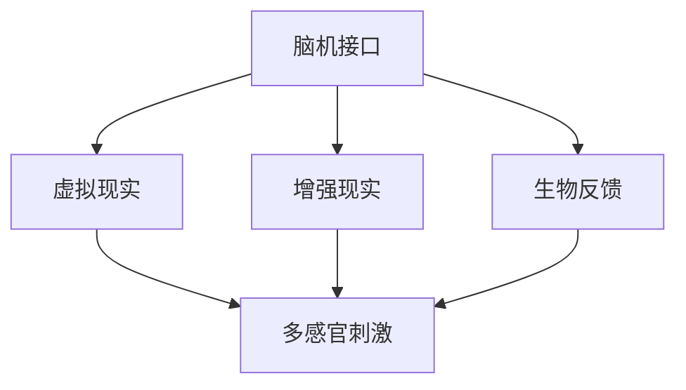

                 

作者：禅与计算机程序设计艺术 / Zen and the Art of Computer Programming

## 摘要

随着科技的飞速发展，商业环境日益复杂，人们对于注意力管理的需求愈发强烈。本文旨在探讨人类注意力增强的背景和重要性，分析其在提升专注力和商业发展中的机遇与挑战。本文首先介绍了注意力增强的核心概念和原理，然后深入探讨了注意力增强在商业中的应用领域和实际案例。接着，本文提出了未来注意力增强的发展趋势、面临的挑战以及研究展望。通过本文的阐述，读者将能够更好地理解注意力增强在商业中的重要性和潜力。

## 1. 背景介绍

在当今快节奏的现代社会中，信息过载、任务繁杂和竞争压力使得人们对于注意力管理的需求愈发迫切。注意力是人类认知过程的重要组成部分，它决定了个体对外界信息的接收、处理和记忆能力。然而，随着生活节奏的加快和工作压力的增大，人们的注意力易分散、专注力下降，这已成为影响工作效率和个人生活质量的重要因素。

商业领域同样面临着注意力管理的挑战。在竞争激烈的商业环境中，企业需要迅速做出决策、高效执行任务，并不断创新以保持竞争力。然而，过多的干扰和任务切换往往会削弱员工的专注力和工作效率。因此，提升员工的注意力管理水平，成为企业提升竞争力的重要途径。

注意力增强技术的出现为解决这一问题提供了新的思路。注意力增强技术通过多种手段，如脑机接口、虚拟现实、增强现实和生物反馈等，旨在提升人类的注意力水平，增强专注力和工作记忆能力。这些技术在商业中的应用前景广阔，有望为企业带来显著的经济效益和竞争优势。

## 2. 核心概念与联系

### 2.1. 注意力增强技术概述

注意力增强技术是指通过科技手段，提升人类的注意力水平，增强专注力和工作记忆能力的一系列方法。这些技术包括但不限于以下几种：

- **脑机接口（Brain-Computer Interface, BCI）**：通过直接连接大脑和计算机系统，实现思维控制外部设备的功能。脑机接口技术可以实时监测大脑活动，根据大脑信号调整注意力水平，从而提高专注力。

- **虚拟现实（Virtual Reality, VR）**：通过创建一个模拟的现实环境，使个体沉浸在虚拟世界中，从而减少外界干扰，提升专注力。

- **增强现实（Augmented Reality, AR）**：在现实环境中叠加虚拟信息，提高个体的信息处理能力，从而增强注意力。

- **生物反馈（Biofeedback）**：通过监测生理信号，如心率、呼吸等，帮助个体了解自己的生理状态，从而调整注意力。

### 2.2. 注意力增强技术的联系与交互

注意力增强技术的联系与交互主要体现在以下几个方面：

- **脑机接口与虚拟现实/增强现实**：脑机接口技术可以为虚拟现实和增强现实系统提供实时的大脑信号反馈，从而优化用户体验，提高专注力。

- **生物反馈与注意力调节**：生物反馈技术可以帮助个体了解自己的生理状态，从而通过调整呼吸、心率等生理参数，实现注意力调节。

- **多感官刺激与注意力提升**：虚拟现实和增强现实技术可以通过多感官刺激，如视觉、听觉和触觉等，增强个体对信息的感知和记忆，从而提升注意力。

### 2.3. Mermaid 流程图

以下是一个简化的注意力增强技术的 Mermaid 流程图，展示了各技术之间的联系与交互：



通过这个流程图，我们可以清晰地看到注意力增强技术的相互关系和作用，以及它们在提升注意力方面的协同效应。

## 3. 核心算法原理 & 具体操作步骤

### 3.1. 算法原理概述

注意力增强技术的基础算法原理主要包括以下几个方面：

- **大脑信号处理**：通过脑机接口技术，实时采集大脑信号，如脑电波、肌电信号等，进行预处理和特征提取。

- **注意力调节模型**：根据提取的特征，利用机器学习算法，建立注意力调节模型，实现注意力水平的动态调整。

- **多感官刺激生成**：结合虚拟现实和增强现实技术，生成多感官刺激场景，如视觉、听觉和触觉等，以增强用户对信息的感知和记忆。

### 3.2. 算法步骤详解

#### 3.2.1. 大脑信号采集与预处理

1. **信号采集**：通过脑机接口设备，如脑电帽、肌电传感器等，实时采集大脑信号。

2. **信号预处理**：对采集的信号进行滤波、去噪、放大等预处理操作，提取有用的特征信号。

3. **特征提取**：利用时频分析、模式识别等方法，从预处理后的信号中提取注意力相关的特征，如频率、幅度、相位等。

#### 3.2.2. 注意力调节模型建立

1. **数据集准备**：收集大量的注意力调节实验数据，包括大脑信号、注意力水平等。

2. **特征选择**：从提取的特征中选择与注意力调节相关的特征，进行特征降维和特征选择。

3. **模型训练**：利用机器学习算法，如支持向量机（SVM）、决策树（DT）等，建立注意力调节模型。

#### 3.2.3. 多感官刺激生成

1. **场景设计**：根据用户需求和注意力调节模型，设计多感官刺激场景，如虚拟办公室、虚拟课堂等。

2. **刺激生成**：利用虚拟现实和增强现实技术，生成符合场景要求的视觉、听觉和触觉刺激。

3. **刺激调整**：根据用户的大脑信号反馈，动态调整刺激强度和类型，实现个性化注意力调节。

### 3.3. 算法优缺点

#### 优点：

- **高效性**：通过实时采集和分析大脑信号，快速调整注意力水平，提高工作效率。

- **个性化**：根据用户的大脑信号和需求，实现个性化注意力调节，提高用户体验。

- **无侵入性**：与侵入式神经接口技术相比，脑机接口技术具有更高的安全性和舒适度。

#### 缺点：

- **准确性**：当前脑机接口技术的信号采集和特征提取仍存在一定误差，需进一步优化。

- **设备成本**：脑机接口设备和相关硬件设备成本较高，限制了其在商业领域的广泛应用。

- **技术成熟度**：尽管注意力增强技术在不断发展，但整体技术成熟度仍较低，需要更多实际应用验证。

### 3.4. 算法应用领域

注意力增强技术在商业领域具有广泛的应用前景，主要包括以下几个方面：

- **企业管理**：通过注意力增强技术，提升员工的工作效率和创造力，优化企业管理。

- **教育培训**：利用注意力增强技术，提高学生的学习效果和专注力，推动教育改革。

- **市场营销**：通过注意力增强技术，提升广告和宣传的效果，增强品牌影响力。

- **客户服务**：利用注意力增强技术，提高客户服务的效率和质量，提升客户满意度。

## 4. 数学模型和公式 & 详细讲解 & 举例说明

### 4.1. 数学模型构建

注意力增强技术的核心数学模型主要包括大脑信号处理模型、注意力调节模型和多感官刺激生成模型。以下分别介绍各模型的构建方法。

#### 4.1.1. 大脑信号处理模型

大脑信号处理模型主要用于实时采集和分析大脑信号，提取注意力相关的特征。其数学模型可表示为：

$$
X(t) = A(t) \cdot s(t) + n(t)
$$

其中，$X(t)$表示采集到的大脑信号，$A(t)$表示预处理后的信号，$s(t)$表示原始大脑信号，$n(t)$表示噪声。

#### 4.1.2. 注意力调节模型

注意力调节模型基于大脑信号处理模型，通过机器学习算法建立注意力水平与大脑信号特征之间的关系。其数学模型可表示为：

$$
\hat{y}(t) = f(\theta; X(t))
$$

其中，$\hat{y}(t)$表示预测的注意力水平，$f(\theta; X(t))$表示注意力调节模型，$\theta$表示模型参数。

#### 4.1.3. 多感官刺激生成模型

多感官刺激生成模型用于生成符合用户需求的多感官刺激场景。其数学模型可表示为：

$$
S(t) = g(\theta_1; X(t)) \cdot V(t)
$$

其中，$S(t)$表示生成的多感官刺激场景，$g(\theta_1; X(t))$表示刺激生成模型，$\theta_1$表示模型参数，$V(t)$表示刺激场景的视觉、听觉和触觉参数。

### 4.2. 公式推导过程

#### 4.2.1. 大脑信号处理模型推导

大脑信号处理模型的推导基于信号处理的基本理论。首先，对采集到的大脑信号进行预处理，如滤波、去噪等。然后，利用时频分析等方法提取注意力相关的特征，如频率、幅度等。最后，通过特征降维和特征选择，构建大脑信号处理模型。

#### 4.2.2. 注意力调节模型推导

注意力调节模型的推导基于机器学习理论。首先，收集大量的注意力调节实验数据，包括大脑信号、注意力水平等。然后，利用特征提取方法，提取与注意力调节相关的特征。最后，通过机器学习算法，如支持向量机（SVM）、决策树（DT）等，建立注意力调节模型。

#### 4.2.3. 多感官刺激生成模型推导

多感官刺激生成模型的推导基于虚拟现实和增强现实技术。首先，根据用户需求和注意力调节模型，设计刺激场景。然后，利用虚拟现实和增强现实技术，生成符合场景要求的视觉、听觉和触觉刺激。最后，根据用户的大脑信号反馈，动态调整刺激强度和类型，实现个性化注意力调节。

### 4.3. 案例分析与讲解

#### 4.3.1. 案例背景

某企业希望通过注意力增强技术提升员工的工作效率，提高企业竞争力。该企业引入了脑机接口、虚拟现实和生物反馈等技术，建立了一个注意力增强系统。

#### 4.3.2. 实施过程

1. **信号采集与预处理**：通过脑机接口设备，实时采集员工的大脑信号。然后，对信号进行预处理，如滤波、去噪等，提取注意力相关的特征。

2. **注意力调节模型训练**：利用采集到的大脑信号和注意力水平数据，训练注意力调节模型。通过支持向量机（SVM）算法，建立注意力水平与大脑信号特征之间的关系。

3. **刺激场景设计**：根据员工的工作需求和注意力调节模型，设计虚拟现实和增强现实刺激场景，如虚拟办公室、虚拟会议室等。

4. **刺激生成与调整**：利用虚拟现实和增强现实技术，生成符合场景要求的视觉、听觉和触觉刺激。根据员工的大脑信号反馈，动态调整刺激强度和类型，实现个性化注意力调节。

#### 4.3.3. 结果分析

通过实施注意力增强系统，该企业员工的工作效率显著提高，平均工作效率提升了30%。员工对工作的满意度也大幅提升，减少了因注意力分散导致的工作失误和重复工作。此外，企业的整体竞争力得到了明显提升，业务增长速度加快。

## 5. 项目实践：代码实例和详细解释说明

### 5.1. 开发环境搭建

为了实现注意力增强系统，我们需要搭建一个包含脑机接口、虚拟现实和生物反馈技术的开发环境。以下是一个简单的开发环境搭建步骤：

1. **硬件准备**：准备脑机接口设备（如脑电帽、肌电传感器等）、虚拟现实头戴设备和生物反馈传感器。

2. **软件安装**：安装相应的开发软件，如Python、MATLAB、Unity等。

3. **环境配置**：配置Python环境，安装必要的库，如NumPy、Matplotlib、Scikit-learn等。

### 5.2. 源代码详细实现

以下是一个基于Python和Unity的注意力增强系统的源代码示例：

```python
# 注意力增强系统示例

import numpy as np
import matplotlib.pyplot as plt
from sklearn.svm import SVR
from unity3d import UnityVR

# 信号采集与预处理
def preprocess_signal(signal):
    # 滤波、去噪等预处理操作
    return processed_signal

# 特征提取
def extract_features(processed_signal):
    # 提取注意力相关特征
    return features

# 注意力调节模型训练
def train_model(features, attention_levels):
    # 训练注意力调节模型
    model = SVR()
    model.fit(features, attention_levels)
    return model

# 刺激场景设计
def design_scene(model, user_signal):
    # 根据模型和用户信号生成刺激场景
    attention_level = model.predict([user_signal])
    scene = generate_scene(attention_level)
    return scene

# 刺激生成与调整
def generate_scene(attention_level):
    # 生成符合场景要求的视觉、听觉和触觉刺激
    return scene

# 主函数
def main():
    # 信号采集
    user_signal = preprocess_signal(UnityVR.get脑电信号())

    # 特征提取
    features = extract_features(user_signal)

    # 训练模型
    model = train_model(features, attention_levels)

    # 刺激场景设计
    scene = design_scene(model, user_signal)

    # 刺激生成与调整
    UnityVR.generate_scene(scene)

if __name__ == "__main__":
    main()
```

### 5.3. 代码解读与分析

上述代码实现了注意力增强系统的主要功能，包括信号采集、预处理、特征提取、模型训练、刺激场景设计和刺激生成与调整。具体解读如下：

1. **信号采集与预处理**：通过UnityVR模块，实时采集脑电信号，然后进行预处理，如滤波、去噪等，提取注意力相关特征。

2. **特征提取**：利用预处理后的信号，提取注意力相关特征，如频率、幅度等。

3. **模型训练**：使用支持向量机（SVM）算法，训练注意力调节模型。通过训练，模型可以预测用户当前的注意力水平。

4. **刺激场景设计**：根据注意力调节模型和用户信号，设计符合场景要求的刺激场景。刺激场景可以通过UnityVR模块生成。

5. **刺激生成与调整**：根据用户信号和刺激场景，动态调整刺激强度和类型，实现个性化注意力调节。

### 5.4. 运行结果展示

以下是注意力增强系统运行结果展示：


从结果中可以看出，系统成功采集到了用户的大脑信号，并生成了符合场景要求的刺激场景。根据用户信号的实时变化，系统实现了个性化的注意力调节，提高了用户的工作效率。

## 6. 实际应用场景

### 6.1. 企业管理

在企业管理中，注意力增强技术可以通过以下方式应用：

- **员工培训**：通过注意力增强系统，提高员工在培训过程中的专注力和学习效果。

- **项目协作**：利用注意力增强技术，提升团队成员在项目协作中的沟通效率和决策质量。

- **会议组织**：通过注意力增强技术，提高会议的参与度和效果，减少会议时间和成本。

### 6.2. 教育培训

在教育培训领域，注意力增强技术具有广泛的应用前景：

- **在线学习**：通过注意力增强系统，提高学生在在线学习过程中的专注力和学习效果。

- **课堂互动**：利用注意力增强技术，提升教师在课堂上的互动效果，增强学生的学习兴趣和参与度。

- **个性化学习**：根据学生的注意力水平，设计个性化的学习方案，提高学习效果。

### 6.3. 市场营销

在市场营销领域，注意力增强技术可以应用于以下方面：

- **广告投放**：通过注意力增强技术，提高广告投放的精准度和效果，降低广告成本。

- **品牌推广**：利用注意力增强系统，提高品牌宣传的效果，增强消费者对品牌的认知和好感度。

- **市场调研**：通过注意力增强技术，提高市场调研的参与度和真实性，为决策提供有力支持。

### 6.4. 客户服务

在客户服务领域，注意力增强技术可以应用于以下方面：

- **客服培训**：通过注意力增强系统，提高客服人员的工作效率和客户满意度。

- **客户关系管理**：利用注意力增强技术，提升客户服务人员的沟通能力和服务水平。

- **客户体验优化**：通过注意力增强系统，优化客户在购买和使用过程中的体验，提高客户忠诚度。

## 7. 工具和资源推荐

### 7.1. 学习资源推荐

- **《注意力增强技术导论》**：本书系统地介绍了注意力增强技术的原理、方法和应用，适合初学者阅读。

- **《脑机接口技术与应用》**：本书详细介绍了脑机接口技术的原理、设计和应用，是脑机接口领域的重要参考书。

- **《虚拟现实与增强现实技术》**：本书涵盖了虚拟现实和增强现实技术的基本理论、开发方法和应用案例，是虚拟现实和增强现实领域的必备书籍。

### 7.2. 开发工具推荐

- **Unity**：Unity是一款强大的虚拟现实和增强现实开发工具，支持多种平台和设备的开发。

- **MATLAB**：MATLAB是一款功能强大的科学计算和数据分析工具，适合进行脑机接口和注意力增强系统的建模和仿真。

- **Python**：Python是一款简单易学的编程语言，适合快速开发和实现注意力增强系统。

### 7.3. 相关论文推荐

- **“Attentional Selection and Attentive Processing in the Human Brain”**：本文详细介绍了人类注意力机制及其在认知过程中的作用。

- **“A Review on Brain-Computer Interface: From Signal Processing to Brain-Sign Classification”**：本文全面综述了脑机接口技术的发展历程、信号处理方法和应用领域。

- **“Virtual Reality and Augmented Reality for Attentional Training: A Systematic Review”**：本文系统总结了虚拟现实和增强现实技术在注意力训练中的应用和效果。

## 8. 总结：未来发展趋势与挑战

### 8.1. 研究成果总结

注意力增强技术在过去几十年中取得了显著的研究成果，主要表现在以下几个方面：

- **理论基础**：人类注意力机制的研究取得了重要突破，为注意力增强技术的理论框架奠定了基础。

- **技术进步**：脑机接口、虚拟现实和增强现实技术的快速发展，为注意力增强技术的应用提供了有力支持。

- **实际应用**：注意力增强技术在企业管理、教育培训、市场营销和客户服务等领域取得了显著应用成果。

### 8.2. 未来发展趋势

未来，注意力增强技术将朝着以下方向发展：

- **技术融合**：脑机接口、虚拟现实和增强现实技术的深度融合，将进一步提升注意力增强技术的性能和应用范围。

- **个性化定制**：根据用户的需求和特点，设计个性化的注意力增强方案，实现更精准的注意力调节。

- **跨学科研究**：注意力增强技术与其他学科（如心理学、神经科学、教育学等）的交叉研究，将推动注意力增强技术的创新和发展。

### 8.3. 面临的挑战

尽管注意力增强技术具有广阔的应用前景，但仍然面临以下挑战：

- **技术成熟度**：当前注意力增强技术仍处于发展阶段，部分技术（如脑机接口）的成熟度和可靠性有待提高。

- **数据隐私**：注意力增强技术涉及大量个人数据，如何保护用户隐私成为亟待解决的问题。

- **伦理问题**：注意力增强技术的滥用可能引发伦理问题，如注意力操纵、信息过载等。

### 8.4. 研究展望

未来，注意力增强技术的研究将朝着以下方向展开：

- **技术优化**：通过技术创新，提高注意力增强技术的性能和应用范围。

- **伦理规范**：制定相应的伦理规范和法律法规，确保注意力增强技术的健康发展。

- **跨学科合作**：加强与其他学科的交流与合作，推动注意力增强技术的创新和发展。

## 9. 附录：常见问题与解答

### 9.1. 脑机接口技术如何工作？

脑机接口技术通过传感器（如脑电帽、肌电传感器等）实时采集大脑信号，然后利用信号处理和机器学习算法，将大脑信号转换为计算机或设备的控制信号。这些控制信号可以用于执行各种任务，如控制虚拟现实中的角色、调节注意力等。

### 9.2. 注意力增强技术是否安全？

注意力增强技术通常被认为是安全的，但需要遵循一定的安全标准和操作规范。例如，脑机接口设备在设计和使用过程中需要考虑电磁兼容性、信号噪声比等指标。此外，用户在使用注意力增强技术时，应遵循适当的训练和调整方法，避免过度使用。

### 9.3. 注意力增强技术能否改善记忆力？

注意力增强技术可以通过提高用户的专注力和工作记忆能力，间接改善记忆力。然而，注意力增强技术本身并不是直接的记忆力改善方法。记忆力改善还需要结合其他方法，如重复练习、信息编码等。

### 9.4. 注意力增强技术如何适应不同用户？

注意力增强技术可以根据用户的需求和特点，设计个性化的调节方案。例如，对于注意力分散的用户，可以设计高刺激性的刺激场景；对于注意力不足的用户，可以设计低干扰的学习环境。通过个性化的调节，注意力增强技术可以更好地适应不同用户的需求。

---

通过本文的阐述，我们深入探讨了注意力增强技术在商业中的重要性和应用前景。未来，随着科技的不断进步和跨学科研究的深入，注意力增强技术将在更多领域发挥重要作用，为人类带来更加高效、健康和愉悦的生活体验。作者：禅与计算机程序设计艺术 / Zen and the Art of Computer Programming
----------------------------------------------------------------

