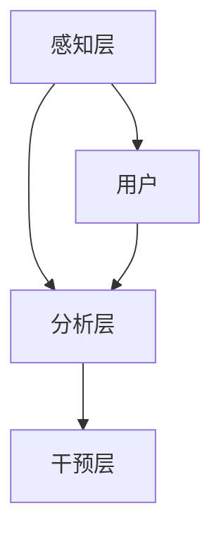

                 

关键词：注意力增强、专注力、商业应用、算法、趋势预测、挑战

> 摘要：本文旨在探讨注意力增强技术在提升人类专注力和商业应用中的潜力。通过对核心概念的介绍和算法原理的阐述，本文将分析该技术的机遇和挑战，并预测其未来的发展趋势。

## 1. 背景介绍

在信息爆炸的今天，人类的注意力资源变得愈发稀缺。随着互联网和智能设备的普及，人们面临着前所未有的信息过载问题。如何有效地管理注意力资源，提高专注力和工作效率，已成为当今商业和个人发展的关键问题。注意力增强技术作为一种新兴的技术手段，正逐渐受到关注。

### 注意力增强技术的起源与发展

注意力增强技术起源于心理学和认知科学的研究。20世纪末，随着神经科学和认知科学的快速发展，人们开始深入探讨如何通过技术手段干预和提升注意力。这一领域的研究主要集中在以下几个方面：

1. **认知神经科学**：通过神经成像技术，研究大脑在注意过程中的神经活动机制，揭示注意力的生理基础。
2. **心理学**：探讨注意力分散的原因和注意力管理的策略，如多任务处理、专注训练等。
3. **技术手段**：结合虚拟现实（VR）、增强现实（AR）、脑机接口（BCI）等新技术，开发用于注意力干预的工具和应用。

### 商业中的应用背景

在商业领域，注意力增强技术有着广泛的应用前景。例如：

- **人力资源管理**：通过注意力增强技术，帮助企业提高员工的专注力和工作效率，提升整体生产力。
- **教育培训**：利用注意力增强技术，提升学生的学习效率和记忆力，为教育提供新的手段。
- **市场营销**：通过注意力增强技术，提高广告和营销信息的吸引力和效果，增强品牌认知度和用户粘性。
- **医疗服务**：利用注意力增强技术，辅助医生进行精细操作，提高诊断和治疗精度。

## 2. 核心概念与联系

### 2.1 注意力模型

注意力模型是注意力增强技术的核心概念之一。传统上，注意力模型主要基于认知心理学的研究，如选择注意模型（Selective Attention Model）和分配注意模型（Divided Attention Model）。近年来，随着深度学习和神经网络的兴起，注意力机制在计算机科学中得到了广泛应用，如卷积神经网络（CNN）中的注意力模块（Attention Module）和Transformer模型中的自注意力（Self-Attention）机制。

### 2.2 注意力增强技术的架构

注意力增强技术的架构通常包括以下几个部分：

- **感知层**：感知用户的行为和生理信号，如眼动追踪、脑电图（EEG）等。
- **分析层**：对感知数据进行分析和处理，提取注意力特征。
- **干预层**：根据分析结果，采取相应的干预措施，如声音调整、视觉提示等。

### 2.3 注意力增强技术的应用场景

注意力增强技术可以在多个场景中应用：

- **工作场景**：通过实时监测和分析员工的注意力状态，提供个性化的工作建议和提醒，帮助员工保持专注。
- **学习场景**：利用注意力增强技术，提高学生的学习效率和记忆力，如通过自适应学习平台，根据学生的注意力状态调整学习内容和节奏。
- **健康场景**：通过监测用户的注意力状态，及时发现和干预注意力问题，如通过智能手环监测用户的注意力水平，提供健康建议。

### 2.4 Mermaid 流程图



## 3. 核心算法原理 & 具体操作步骤

### 3.1 算法原理概述

注意力增强技术中的核心算法主要包括感知算法、分析算法和干预算法。感知算法主要通过传感器获取用户的行为和生理信号，如眼动追踪和脑电图。分析算法则对感知数据进行处理和分析，提取注意力特征。干预算法根据分析结果，采取相应的干预措施，如调整声音大小或提供视觉提示。

### 3.2 算法步骤详解

1. **感知阶段**：通过传感器获取用户的行为和生理信号，如眼动追踪设备获取眼动数据，脑电图设备获取脑电信号。
2. **预处理阶段**：对获取的原始信号进行预处理，如去噪、滤波等，以提高信号的质量和准确性。
3. **特征提取阶段**：对预处理后的信号进行特征提取，如使用傅里叶变换提取眼动信号中的频率特征，使用时域分析方法提取脑电信号中的时域特征。
4. **分析阶段**：使用机器学习算法对提取的特征进行分类和识别，以判断用户的注意力状态。
5. **干预阶段**：根据分析结果，采取相应的干预措施，如提供视觉提示或调整环境参数。

### 3.3 算法优缺点

**优点**：

- **个性化**：根据用户的注意力状态提供个性化的干预措施，有助于提高用户的工作效率和学习效果。
- **实时性**：能够实时监测和干预用户的注意力状态，及时调整工作或学习环境。

**缺点**：

- **准确性**：由于个体差异和环境干扰，注意力监测的准确性可能受到一定影响。
- **隐私问题**：收集和监测用户的生理和行为信号可能涉及隐私问题，需要严格保护用户的数据安全。

### 3.4 算法应用领域

注意力增强技术可以在多个领域得到应用：

- **人力资源管理**：帮助企业提高员工的工作效率和生产力。
- **教育培训**：提升学生的学习效率和记忆力。
- **医疗服务**：辅助医生进行精细操作，提高诊断和治疗精度。

## 4. 数学模型和公式 & 详细讲解 & 举例说明

### 4.1 数学模型构建

注意力增强技术中的数学模型主要基于统计学和机器学习。常用的数学模型包括：

- **特征提取模型**：如主成分分析（PCA）、独立成分分析（ICA）等，用于提取用户注意力状态的特征。
- **分类模型**：如支持向量机（SVM）、随机森林（RF）等，用于对用户的注意力状态进行分类。

### 4.2 公式推导过程

以支持向量机（SVM）为例，其目标函数为：

$$
\min_{\mathbf{w}, b} \frac{1}{2} ||\mathbf{w}||^2 + C \sum_{i=1}^{n} \max(0, 1 - y_i (\mathbf{w}^T \mathbf{x}_i + b))
$$

其中，$\mathbf{w}$ 和 $b$ 分别为权重和偏置，$C$ 为惩罚参数，$y_i$ 为样本 $i$ 的标签，$\mathbf{x}_i$ 为样本 $i$ 的特征向量。

### 4.3 案例分析与讲解

假设我们有一组用户注意力状态的数据，数据包括用户的行为数据和生理信号。首先，我们使用主成分分析（PCA）提取数据的主要特征。然后，使用支持向量机（SVM）对用户的注意力状态进行分类。最后，根据分类结果，提供相应的干预措施。

```latex
% PCA 公式
\text{特征向量} \mathbf{e}_k = \frac{\mathbf{A} \mathbf{e}_k'}{\sqrt{\mathbf{e}_k' \mathbf{e}_k'}}
% SVM 目标函数
\min_{\mathbf{w}, b} \frac{1}{2} ||\mathbf{w}||^2 + C \sum_{i=1}^{n} \max(0, 1 - y_i (\mathbf{w}^T \mathbf{x}_i + b))
```

## 5. 项目实践：代码实例和详细解释说明

### 5.1 开发环境搭建

在开始编写代码之前，需要搭建一个合适的开发环境。这里以 Python 为例，介绍开发环境的搭建过程。

1. 安装 Python：从 [Python 官网](https://www.python.org/) 下载并安装 Python。
2. 安装必要的库：使用 pip 命令安装必要的库，如 numpy、scikit-learn、matplotlib 等。

```bash
pip install numpy scikit-learn matplotlib
```

### 5.2 源代码详细实现

以下是一个简单的注意力监测和干预的 Python 代码示例：

```python
import numpy as np
from sklearn.svm import SVC
from sklearn.decomposition import PCA
import matplotlib.pyplot as plt

# 生成模拟数据
np.random.seed(0)
X = np.random.rand(100, 10)  # 行为数据
y = np.random.rand(100)      # 注意力状态

# 特征提取
pca = PCA(n_components=5)
X_pca = pca.fit_transform(X)

# 分类
svm = SVC(kernel='linear')
svm.fit(X_pca, y)

# 测试
X_test = np.random.rand(10, 10)
X_test_pca = pca.transform(X_test)
y_pred = svm.predict(X_test_pca)

# 显示结果
plt.scatter(X_test_pca[:, 0], X_test_pca[:, 1], c=y_pred)
plt.show()
```

### 5.3 代码解读与分析

1. **数据生成**：使用随机数生成模拟的行为数据和注意力状态。
2. **特征提取**：使用主成分分析（PCA）提取数据的主要特征。
3. **分类**：使用支持向量机（SVM）对用户的注意力状态进行分类。
4. **测试**：对生成的测试数据进行分类，并使用散点图显示结果。

### 5.4 运行结果展示

运行代码后，会显示一个散点图，每个点代表一个测试样本，点的颜色表示预测的注意力状态。通过观察散点图，可以直观地看到分类的效果。

## 6. 实际应用场景

### 6.1 工作场景

在办公环境中，注意力增强技术可以帮助员工提高工作效率。例如，通过实时监测员工的眼动和脑电信号，系统可以识别出员工的工作状态，并在员工注意力下降时提供提醒或休息建议。

### 6.2 学习场景

在教育领域，注意力增强技术可以帮助教师和学生提高学习效率。例如，通过分析学生的学习行为和注意力状态，教育平台可以提供个性化的学习建议，如调整学习内容的难度和节奏，帮助学生更好地集中注意力。

### 6.3 健康场景

在健康领域，注意力增强技术可以帮助患者提高康复效果。例如，对于患有注意力障碍的患者，通过实时监测其注意力状态，医生可以及时调整康复方案，提高康复效果。

## 7. 工具和资源推荐

### 7.1 学习资源推荐

- 《深度学习》（Deep Learning）——Ian Goodfellow、Yoshua Bengio、Aaron Courville 著
- 《机器学习实战》（Machine Learning in Action）——Peter Harrington 著

### 7.2 开发工具推荐

- Jupyter Notebook：用于编写和运行 Python 代码。
- PyCharm：一款功能强大的 Python 集成开发环境。

### 7.3 相关论文推荐

- “Attention is All You Need”（Attention Is All You Need）——Ashish Vaswani 等
- “A Theoretical Framework for Attention in Computational Vision”（A Theoretical Framework for Attention in Computational Vision）——Raia Hadsell 等

## 8. 总结：未来发展趋势与挑战

### 8.1 研究成果总结

注意力增强技术已在多个领域取得了显著的研究成果，包括心理学、认知科学、计算机科学和商业应用。通过结合先进的技术手段，注意力增强技术为提升人类专注力和工作效率提供了新的解决方案。

### 8.2 未来发展趋势

随着人工智能和神经科学的发展，注意力增强技术有望在以下方面取得突破：

- **个性化干预**：根据用户的个性化需求，提供更加精准的注意力干预措施。
- **跨学科融合**：结合心理学、认知科学、计算机科学和神经科学的理论和方法，推动注意力增强技术的全面发展。

### 8.3 面临的挑战

注意力增强技术在实际应用中仍面临诸多挑战：

- **准确性**：提高注意力监测和干预的准确性，降低误报和漏报率。
- **隐私问题**：确保用户数据的隐私和安全，避免数据泄露和滥用。
- **成本和可访问性**：降低技术成本，提高技术的可访问性，使更多用户能够受益。

### 8.4 研究展望

未来，注意力增强技术有望在以下领域取得进一步发展：

- **智能教育**：通过注意力增强技术，提供个性化的学习体验，提高教育质量。
- **智能医疗**：利用注意力增强技术，辅助医生进行精细操作，提高医疗服务水平。
- **智能办公**：通过注意力增强技术，提高员工的工作效率和生产力，推动企业数字化转型。

## 9. 附录：常见问题与解答

### 9.1 注意力增强技术是如何工作的？

注意力增强技术主要通过感知、分析和干预三个阶段工作。感知阶段通过传感器获取用户的行为和生理信号；分析阶段对感知数据进行处理和分析，提取注意力特征；干预阶段根据分析结果，采取相应的干预措施。

### 9.2 注意力增强技术有哪些应用场景？

注意力增强技术可以在工作、学习、健康等多个场景中应用。例如，在办公环境中，可以帮助员工提高工作效率；在教育领域，可以提高学生的学习效率和记忆力；在健康领域，可以辅助医生进行精细操作，提高康复效果。

### 9.3 注意力增强技术有哪些优点和缺点？

注意力增强技术的优点包括个性化干预、实时性等，缺点包括准确性问题、隐私问题等。随着技术的不断进步，这些缺点有望得到缓解。

### 9.4 注意力增强技术未来有哪些发展趋势？

未来，注意力增强技术有望在个性化干预、跨学科融合等方面取得突破，并在智能教育、智能医疗、智能办公等领域得到广泛应用。然而，仍需克服准确性、隐私等问题，以实现技术的可持续发展。 
----------------------------------------------------------------

### 作者署名

作者：禅与计算机程序设计艺术 / Zen and the Art of Computer Programming

