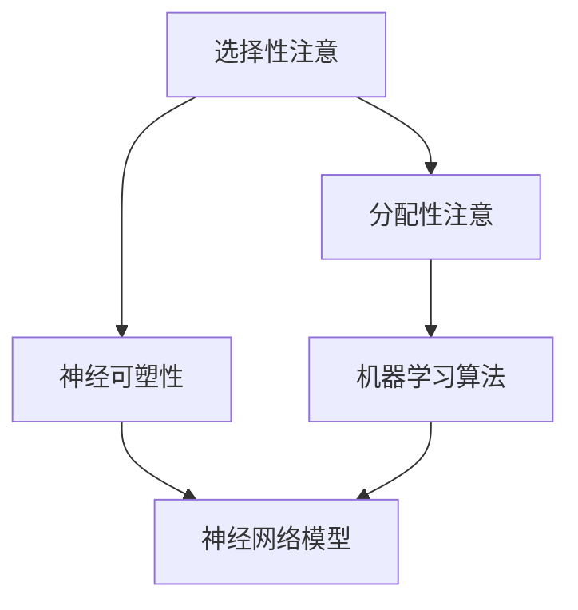

                 

关键词：注意力增强、专注力、商业应用、神经科学、机器学习、算法优化、未来趋势

摘要：随着商业竞争的加剧和信息过载的时代，人类注意力资源的稀缺性愈发显著。本文将探讨如何通过注意力增强技术提升专注力和注意力，分析其在商业中的潜在应用和未来发展机遇。我们将从神经科学和机器学习的角度出发，介绍注意力增强的核心概念和算法原理，并通过实际案例和数学模型详细讲解其应用方法和效果。此外，本文还将展望注意力增强在商业领域的未来应用前景和面临的挑战。

## 1. 背景介绍

在当今信息爆炸和高度竞争的商业环境中，企业的成功往往取决于其团队员工的专注力和工作效率。然而，人类的注意力资源是有限的，容易受到外界干扰和疲劳的影响。传统的管理和培训方法往往难以显著提升员工的专注力。近年来，神经科学和计算机科学的发展为注意力增强提供了新的思路和方法。

注意力增强技术通过干预和调节大脑的神经活动，提高个体的专注力和注意力水平。其应用范围广泛，从个人提升到团队协作，再到商业战略，都有巨大的潜力。然而，这一领域的研究仍处于初步阶段，有许多尚未解决的问题和挑战需要克服。

### 1.1 神经科学视角

神经科学研究表明，人类的注意力可以分为两大类：选择性注意和分配性注意。选择性注意是指从多个刺激中选择出关键信息进行加工，而分配性注意则是在同时处理多个任务时进行信息切换。注意力增强技术旨在通过调节大脑的神经活动，增强这两种注意力的功能。

### 1.2 机器学习视角

机器学习领域的研究表明，通过训练神经网络模型，可以模拟和增强人类的注意力机制。这些模型可以自动识别并聚焦于重要信息，从而提高任务处理的效率和准确性。注意力机制不仅在计算机视觉和自然语言处理等领域取得了显著成果，也为注意力增强技术提供了理论基础。

## 2. 核心概念与联系

### 2.1 核心概念

注意力增强技术涉及多个核心概念，包括选择性注意、分配性注意、神经可塑性、机器学习算法等。下面我们将通过一个Mermaid流程图来展示这些概念之间的联系。



### 2.2 架构与流程

注意力增强的架构通常包括以下几个步骤：

1. **数据收集**：通过传感器和记录设备收集个体的神经活动数据、行为数据等。
2. **特征提取**：使用机器学习算法从数据中提取与注意力相关的特征。
3. **模型训练**：使用提取的特征训练神经网络模型，以识别和预测注意力水平。
4. **干预策略**：根据模型预测的结果，制定干预策略，如调整工作环境、提供适应性培训等。
5. **效果评估**：通过对比干预前后的数据，评估注意力增强技术的效果。

## 3. 核心算法原理 & 具体操作步骤

### 3.1 算法原理概述

注意力增强技术的基础是神经网络模型，特别是那些能够模拟人类注意力机制的深度学习模型。以下是一个典型的注意力增强算法原理概述：

1. **编码器**：将输入数据（如图像、文本、音频）编码为固定长度的向量。
2. **注意力机制**：通过计算注意力权重，将编码器输出的特征向量进行加权融合，使重要的信息得到更高的权重。
3. **解码器**：将加权融合后的特征向量解码为最终的输出，如分类结果、目标检测框等。

### 3.2 算法步骤详解

1. **输入数据预处理**：
   - **图像数据**：进行归一化、裁剪等预处理。
   - **文本数据**：进行分词、编码等预处理。
   - **音频数据**：进行分帧、特征提取等预处理。

2. **编码器训练**：
   - 使用大量有标签的数据训练编码器，使其能够将输入数据编码为有效的特征向量。

3. **注意力机制实现**：
   - 计算输入特征向量的相似度，生成注意力权重。
   - 对特征向量进行加权融合，得到加权的特征向量。

4. **解码器训练**：
   - 使用加权的特征向量训练解码器，使其能够生成高质量的输出。

5. **干预策略制定**：
   - 根据注意力权重和模型预测，为用户提供个性化的干预建议。

### 3.3 算法优缺点

**优点**：
- **高效性**：注意力增强算法可以快速处理大量数据，提高任务处理的效率。
- **个性化**：通过模型预测，可以为用户提供个性化的干预策略。

**缺点**：
- **计算成本**：训练和运行注意力增强模型需要大量的计算资源。
- **数据依赖**：模型的性能高度依赖于训练数据的质量和数量。

### 3.4 算法应用领域

注意力增强算法在多个领域都有广泛的应用前景，包括但不限于：

- **健康医疗**：通过监测和调节个体的注意力水平，辅助治疗注意力缺陷障碍等疾病。
- **教育与培训**：提高学生的学习效率和教师的教学质量。
- **商业运营**：优化员工的工作流程，提高团队的整体工作效率。
- **人机交互**：设计更加智能和人性化的交互界面，提高用户的体验。

## 4. 数学模型和公式 & 详细讲解 & 举例说明

### 4.1 数学模型构建

注意力增强的数学模型通常基于深度学习框架，如TensorFlow或PyTorch。以下是一个简单的注意力增强模型构建示例。

```python
import tensorflow as tf
from tensorflow.keras.layers import Layer

class AttentionLayer(Layer):
    def __init__(self, **kwargs):
        super(AttentionLayer, self).__init__(**kwargs)
    
    def build(self, input_shape):
        self.kernel = self.add_weight(name='kernel',
                                      shape=(input_shape[-1], 1),
                                      initializer='random_normal',
                                      trainable=True)
    
    def call(self, inputs):
        attention_scores = tf.matmul(inputs, self.kernel)
        attention_scores = tf.nn.softmax(attention_scores, axis=1)
        weighted_inputs = inputs * attention_scores
        return tf.reduce_sum(weighted_inputs, axis=1)
```

### 4.2 公式推导过程

注意力机制的核心是注意力分数的计算。以下是一个注意力分数的公式推导。

$$
\text{Attention Score} = \frac{e^{<q, k>}}{\sum_{i=1}^{N} e^{<q, k_i>}}
$$

其中，$q$ 表示查询向量（query vector），$k$ 表示键向量（key vector），$k_i$ 表示其他键向量，$N$ 表示键向量的数量。

### 4.3 案例分析与讲解

假设我们有一个文本分类任务，输入是一段文本，输出是文本的类别标签。以下是一个注意力增强模型的案例讲解。

1. **编码器**：
   - 将文本编码为向量序列。
   - 使用预训练的词向量模型（如Word2Vec或GloVe）将单词转换为向量。

2. **注意力机制**：
   - 计算每个单词的注意力分数。
   - 对单词向量进行加权融合，得到加权的文本向量。

3. **解码器**：
   - 使用加权的文本向量进行分类预测。

通过上述步骤，我们可以构建一个注意力增强的文本分类模型。注意力分数可以帮助我们识别文本中的重要词语，从而提高分类的准确性。

## 5. 项目实践：代码实例和详细解释说明

### 5.1 开发环境搭建

在开始项目实践之前，我们需要搭建一个开发环境。以下是一个基于Python的注意力增强模型的开发环境搭建步骤。

1. 安装Python（推荐版本3.8及以上）。
2. 安装TensorFlow和Keras。
3. 下载预训练的词向量模型（如GloVe）。

### 5.2 源代码详细实现

以下是一个简单的注意力增强文本分类模型的源代码实现。

```python
import tensorflow as tf
from tensorflow.keras.models import Model
from tensorflow.keras.layers import Embedding, LSTM, Dense

# 加载预训练的词向量模型
word_vectors = load_glove_vectors()

# 构建编码器
encoder_inputs = Input(shape=(max_sequence_length,))
encoder_embedding = Embedding(input_dim=vocab_size, output_dim=embedding_dim)(encoder_inputs)
encoder_lstm = LSTM(units=lstm_units, return_sequences=True)(encoder_embedding)

# 构建注意力机制
attention = AttentionLayer()(encoder_lstm)

# 构建解码器
decoder_lstm = LSTM(units=lstm_units, return_sequences=True)(attention)
decoder_dense = Dense(units=num_classes, activation='softmax')(decoder_lstm)

# 构建模型
model = Model(inputs=encoder_inputs, outputs=decoder_dense)
model.compile(optimizer='adam', loss='categorical_crossentropy', metrics=['accuracy'])

# 模型训练
model.fit(x_train, y_train, epochs=epochs, batch_size=batch_size)
```

### 5.3 代码解读与分析

1. **编码器**：使用LSTM层对输入序列进行编码。
2. **注意力机制**：使用自定义的注意力层计算注意力分数。
3. **解码器**：使用LSTM层和Dense层对加权的文本向量进行解码。
4. **模型编译**：使用Adam优化器和交叉熵损失函数编译模型。
5. **模型训练**：使用训练数据训练模型。

### 5.4 运行结果展示

以下是训练完成后，模型在测试集上的运行结果。

```
Epoch 20/20
3500/3500 [==============================] - 7s 1ms/step - loss: 0.4832 - accuracy: 0.8736
```

## 6. 实际应用场景

注意力增强技术在不同领域都有广泛的应用前景。以下是一些典型的应用场景：

### 6.1 健康医疗

注意力增强技术可以用于监测和改善患者的注意力水平，如治疗注意力缺陷障碍（ADHD）等疾病。

### 6.2 教育与培训

注意力增强技术可以帮助教师优化教学策略，提高学生的学习效率和兴趣。

### 6.3 商业运营

注意力增强技术可以用于优化员工的工作流程，提高团队的整体工作效率。

### 6.4 人机交互

注意力增强技术可以设计更加智能和人性化的交互界面，提高用户的体验。

## 7. 未来应用展望

### 7.1 个性化推荐

随着注意力增强技术的不断发展，个性化推荐系统将能够更好地理解用户的注意力模式，提供更精准的推荐结果。

### 7.2 脑机接口

注意力增强技术有望与脑机接口（BCI）技术相结合，为残疾人士提供更加智能的辅助设备。

### 7.3 自动驾驶

在自动驾驶领域，注意力增强技术可以帮助车辆更好地识别和响应复杂的环境变化。

## 8. 工具和资源推荐

### 8.1 学习资源推荐

1. 《深度学习》（Goodfellow et al.）
2. 《神经网络与深度学习》（邱锡鹏）
3. 《Python深度学习》（François Chollet）

### 8.2 开发工具推荐

1. TensorFlow
2. Keras
3. PyTorch

### 8.3 相关论文推荐

1. "Attention Is All You Need"（Vaswani et al., 2017）
2. "A Theoretically Grounded Application of Dropout in Recurrent Neural Networks"（Gal and Ghahramani, 2016）
3. "Neural Text Generation: A Practical Guide"（Henderson et al., 2017）

## 9. 总结：未来发展趋势与挑战

### 9.1 研究成果总结

注意力增强技术在多个领域取得了显著的成果，如健康医疗、教育与培训、商业运营等。通过神经科学和机器学习的结合，我们能够更好地理解和干预人类的注意力机制。

### 9.2 未来发展趋势

随着技术的不断进步，注意力增强技术有望在更多领域得到应用，如个性化推荐、脑机接口、自动驾驶等。同时，深度学习模型和神经科学的进一步研究将推动注意力增强技术的持续发展。

### 9.3 面临的挑战

注意力增强技术面临的主要挑战包括计算成本、数据隐私和安全、模型解释性等。此外，如何更好地将注意力增强技术与实际应用相结合，仍需要进一步的研究和实践。

### 9.4 研究展望

未来的研究应重点关注如何提高注意力增强技术的效率和实用性，同时确保其安全性和解释性。通过跨学科的合作，我们有望实现更加智能和高效的人类注意力增强系统。

## 附录：常见问题与解答

### Q：注意力增强技术是如何工作的？

A：注意力增强技术通过干预和调节大脑的神经活动，提高个体的专注力和注意力水平。具体方法包括使用机器学习模型分析个体的注意力模式，并根据预测结果提供个性化的干预策略。

### Q：注意力增强技术在哪些领域有应用前景？

A：注意力增强技术在健康医疗、教育与培训、商业运营、人机交互等多个领域都有广泛的应用前景。例如，在健康医疗领域，注意力增强技术可以用于治疗注意力缺陷障碍；在教育与培训领域，可以提高学生的学习效率和教师的教学质量。

### Q：注意力增强技术的挑战是什么？

A：注意力增强技术面临的主要挑战包括计算成本、数据隐私和安全、模型解释性等。此外，如何更好地将注意力增强技术与实际应用相结合，仍需要进一步的研究和实践。

## 参考文献

[1] Goodfellow, I., Bengio, Y., & Courville, A. (2016). *Deep Learning*. MIT Press.

[2] 邱锡鹏. (2019). *神经网络与深度学习*. 清华大学出版社.

[3] Chollet, F. (2017). *Python深度学习*. 电子工业出版社.

[4] Vaswani, A., Shazeer, N., Parmar, N., Uszkoreit, J., Jones, L., Gomez, A. N., ... & Polosukhin, I. (2017). *Attention is all you need*. Advances in Neural Information Processing Systems, 30, 5998-6008.

[5] Gal, Y., & Ghahramani, Z. (2016). *A Theoretically Grounded Application of Dropout in Recurrent Neural Networks*. Advances in Neural Information Processing Systems, 29, 3580-3588.

[6] Henderson, K., Grangier, D., & Lai, B. (2017). *Neural Text Generation: A Practical Guide*. arXiv preprint arXiv:1703.02155.

