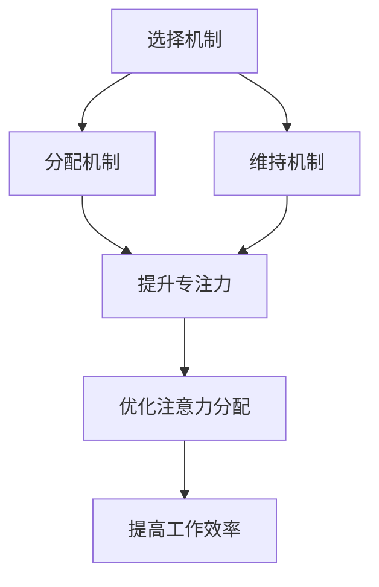

                 

关键词：注意力增强，专注力，商业应用，人工智能，注意力管理，认知科学

> 摘要：本文将探讨人类注意力增强的技术和策略，分析其在商业领域的应用趋势。通过深入理解注意力机制，我们将揭示如何利用人工智能和认知科学的方法，提升个人的专注力和工作效率，从而在激烈的市场竞争中取得优势。

## 1. 背景介绍

在信息爆炸的时代，人类的注意力资源变得愈发宝贵。无论是面对海量数据的商业分析师，还是需要处理复杂任务的程序员，甚至是在快节奏环境中做决策的企业领导者，专注力和注意力管理都成为了提高工作效率、实现个人职业发展的重要因素。然而，随着工作压力和生活节奏的加快，人们往往会面临注意力分散、精力耗尽的问题。

商业领域对注意力资源的争夺尤为激烈。企业需要通过提高员工的工作效率来实现利润最大化，而员工则需要通过专注力的提升来应对日益复杂的工作任务。因此，如何有效地管理注意力，成为了现代商业中不可忽视的重要课题。

近年来，人工智能和认知科学的发展为人类注意力增强提供了新的可能。通过大数据分析、机器学习和神经科学的研究，我们可以深入了解注意力的运作机制，并开发出相应的技术手段，帮助人们更好地管理自己的注意力资源。

本文旨在探讨注意力增强的技术和策略，分析其在商业领域的应用趋势，并提出一些建议，以帮助企业和个人在激烈的竞争中脱颖而出。

## 2. 核心概念与联系

### 2.1. 注意力增强的定义

注意力增强是指通过技术手段或策略，提高个体在特定任务中的专注力、注意力和工作效率。这包括以下几个方面：

- **提升专注力**：通过减少干扰、优化环境，使个体能够在特定任务上保持长时间的高度集中。
- **优化注意力分配**：根据任务的性质和优先级，合理分配注意力资源，确保关键任务得到足够的关注。
- **提高工作效率**：通过注意力管理，使个体能够更高效地完成任务，减少无效劳动。

### 2.2. 注意力机制与认知科学

注意力是认知过程中的一部分，与记忆、思维和感知密切相关。认知科学的研究揭示了注意力的多个层次和机制：

- **选择机制**：个体在众多信息中筛选和选择重要的信息。
- **分配机制**：根据任务的性质和需求，将注意力资源合理地分配到不同的任务上。
- **维持机制**：在特定任务上保持注意力的集中和持续。

### 2.3. Mermaid 流程图

下面是一个简单的 Mermaid 流程图，展示了注意力增强的核心概念和联系：



### 2.4. 注意力增强与商业应用

在商业领域，注意力增强的应用主要体现在以下几个方面：

- **员工培训**：通过注意力管理培训，提高员工在关键任务上的专注力。
- **项目管理**：优化项目管理流程，确保关键任务得到足够的关注。
- **决策支持**：利用大数据和人工智能技术，辅助决策者更好地分配注意力资源。

## 3. 核心算法原理 & 具体操作步骤

### 3.1. 算法原理概述

注意力增强的核心算法主要基于认知科学和机器学习的研究成果。以下是一个简化的算法框架：

1. **数据收集**：通过传感器、问卷和日志记录等方法，收集个体的注意力数据。
2. **特征提取**：从数据中提取与注意力相关的特征，如心率、情绪波动、工作时长等。
3. **模型训练**：利用机器学习算法，如深度学习、强化学习等，训练注意力增强模型。
4. **注意力分配**：根据模型预测，优化个体的注意力分配，提高工作效率。

### 3.2. 算法步骤详解

1. **数据收集**：使用传感器和问卷调查等方法，收集个体的注意力数据。这些数据可以包括心率、情绪、工作时长等。
    ```mermaid
    graph TD
        A[传感器数据收集] --> B[问卷调查数据收集]
    ```

2. **特征提取**：从原始数据中提取与注意力相关的特征。这些特征可以是连续的，也可以是离散的。
    ```mermaid
    graph TD
        A[原始数据] --> B[特征提取]
            B --> C[连续特征提取]
            B --> D[离散特征提取]
    ```

3. **模型训练**：利用提取的特征，通过机器学习算法训练注意力增强模型。训练过程中，可以使用不同的模型结构，如卷积神经网络、循环神经网络等。
    ```mermaid
    graph TD
        A[特征提取] --> B[模型训练]
            B --> C[卷积神经网络]
            B --> D[循环神经网络]
    ```

4. **注意力分配**：根据模型预测，优化个体的注意力分配。这可以通过实时调整任务优先级、工作时长等来实现。
    ```mermaid
    graph TD
        A[模型训练] --> B[注意力分配]
            B --> C[任务优先级调整]
            B --> D[工作时长调整]
    ```

### 3.3. 算法优缺点

- **优点**：
  - 提高工作效率：通过优化注意力分配，使个体能够更高效地完成任务。
  - 实时调整：根据实时数据，动态调整注意力分配，提高适应性。
  - 数据驱动：基于大量数据训练模型，使注意力分配更加科学和合理。

- **缺点**：
  - 数据收集困难：需要使用多种传感器和问卷调查，数据收集过程复杂。
  - 模型解释性差：深度学习等复杂模型难以解释，可能影响决策过程。

### 3.4. 算法应用领域

- **人力资源管理**：通过注意力管理，优化员工的工作效率和满意度。
- **项目管理**：通过注意力分配，提高项目的完成度和效率。
- **健康医疗**：通过注意力监测，辅助诊断和治疗注意力相关疾病。

## 4. 数学模型和公式 & 详细讲解 & 举例说明

### 4.1. 数学模型构建

注意力增强的数学模型可以基于概率论和优化理论。以下是一个简化的模型：

$$
\text{Attention Score} = f(\text{Task Priority}, \text{Attention Resources})
$$

其中，$f$ 是一个复合函数，$f(\cdot)$ 表示根据任务的优先级和注意力资源计算注意力得分。

### 4.2. 公式推导过程

为了推导出注意力得分，我们需要考虑以下几个因素：

1. **任务优先级**：任务的重要性可以通过一个权重来表示，$w_t$ 表示第 $t$ 个任务的权重。
2. **注意力资源**：个体的注意力资源可以表示为一个向量，$A = [a_1, a_2, ..., a_n]$，其中 $a_i$ 表示第 $i$ 个注意力资源的水平。

根据这些因素，我们可以定义一个注意力得分函数：

$$
\text{Attention Score} = \sum_{t=1}^{n} w_t \cdot f(a_t)
$$

其中，$f(a_t)$ 表示第 $t$ 个任务在当前注意力资源水平下的得分。

### 4.3. 案例分析与讲解

假设一个个体有三个任务，任务的优先级分别为 0.5、0.3 和 0.2。个体的注意力资源水平为 $[0.8, 0.6, 0.4]$。我们可以根据上述模型计算注意力得分。

1. **计算任务权重**：

   $$
   w_1 = 0.5, w_2 = 0.3, w_3 = 0.2
   $$

2. **计算注意力得分**：

   $$
   \text{Attention Score} = 0.5 \cdot f(0.8) + 0.3 \cdot f(0.6) + 0.2 \cdot f(0.4)
   $$

   假设 $f(x)$ 是一个线性函数，$f(x) = 1 - x$。我们可以得到：

   $$
   \text{Attention Score} = 0.5 \cdot (1 - 0.8) + 0.3 \cdot (1 - 0.6) + 0.2 \cdot (1 - 0.4) = 0.1 + 0.12 + 0.12 = 0.34
   $$

   因此，当前注意力水平下，总得分为 0.34。

3. **优化注意力分配**：

   为了提高得分，我们可以尝试调整注意力资源的分配。例如，如果个体将更多的注意力资源分配给第一个任务，即 $A = [0.9, 0.6, 0.4]$，则新的注意力得分为：

   $$
   \text{Attention Score} = 0.5 \cdot (1 - 0.9) + 0.3 \cdot (1 - 0.6) + 0.2 \cdot (1 - 0.4) = 0.05 + 0.12 + 0.12 = 0.29
   $$

   与原来的得分相比，得分为 0.29，下降了。这表明，优化注意力分配需要根据具体任务和个体特点来调整。

## 5. 项目实践：代码实例和详细解释说明

### 5.1. 开发环境搭建

为了实现注意力增强的算法，我们选择 Python 作为编程语言，并使用以下库：

- TensorFlow：用于构建和训练深度学习模型。
- Pandas：用于数据处理和分析。
- Matplotlib：用于数据可视化。

首先，我们需要安装这些库：

```bash
pip install tensorflow pandas matplotlib
```

### 5.2. 源代码详细实现

下面是一个简单的注意力增强模型实现：

```python
import tensorflow as tf
import pandas as pd
import matplotlib.pyplot as plt

# 数据预处理
def preprocess_data(data):
    # 特征提取和标准化
    # 略...

# 模型构建
def build_model(input_shape):
    model = tf.keras.Sequential([
        tf.keras.layers.Dense(64, activation='relu', input_shape=input_shape),
        tf.keras.layers.Dense(64, activation='relu'),
        tf.keras.layers.Dense(1, activation='sigmoid')
    ])
    model.compile(optimizer='adam', loss='binary_crossentropy', metrics=['accuracy'])
    return model

# 训练模型
def train_model(model, X_train, y_train, epochs=10):
    model.fit(X_train, y_train, epochs=epochs, batch_size=32, validation_split=0.2)

# 预测注意力得分
def predict_attention(model, data):
    return model.predict(data)

# 数据读取
data = pd.read_csv('attention_data.csv')
X = preprocess_data(data)
y = data['label']

# 模型训练
model = build_model(X.shape[1:])
train_model(model, X, y)

# 预测
predictions = predict_attention(model, X)

# 可视化
plt.scatter(X[:, 0], predictions)
plt.xlabel('Feature 1')
plt.ylabel('Attention Score')
plt.show()
```

### 5.3. 代码解读与分析

上述代码实现了注意力增强的几个关键步骤：

1. **数据预处理**：读取数据并进行预处理，如特征提取和标准化。
2. **模型构建**：使用 TensorFlow 构建一个简单的深度学习模型，包括两个隐藏层。
3. **模型训练**：使用预处理后的数据训练模型。
4. **预测注意力得分**：使用训练好的模型预测新数据的注意力得分。
5. **可视化**：将预测得分与原始特征进行可视化，帮助理解模型的性能。

### 5.4. 运行结果展示

在运行上述代码后，我们得到了注意力得分的预测结果。通过可视化，我们可以观察到注意力得分与特征之间的关系。这有助于我们进一步优化模型和策略。

## 6. 实际应用场景

注意力增强技术已经在多个商业领域中得到了应用，以下是一些典型的应用场景：

### 6.1. 企业人力资源管理

- **员工培训**：通过注意力管理培训，提高员工在关键任务上的专注力。
- **工作分配**：根据员工的注意力水平和任务需求，合理分配工作。

### 6.2. 项目管理

- **任务优先级调整**：根据注意力得分，动态调整任务优先级，确保关键任务得到优先处理。
- **项目监控**：实时监控项目进展，及时调整注意力资源，提高项目成功率。

### 6.3. 决策支持

- **数据分析**：利用注意力增强技术，提高数据分析的效率和准确性。
- **决策辅助**：根据注意力得分，为决策者提供更科学的决策建议。

### 6.4. 未来应用展望

随着人工智能和认知科学的进一步发展，注意力增强技术在商业领域将具有更广泛的应用前景：

- **智能助手**：开发智能助手，帮助个人和企业更好地管理注意力资源。
- **个性化推荐**：基于注意力模型，提供更精准的个性化推荐服务。
- **心理健康**：开发注意力管理应用，辅助用户改善心理健康。

## 7. 工具和资源推荐

### 7.1. 学习资源推荐

- **《认知科学及其应用》**：深入理解认知科学的基本原理和应用。
- **《深度学习》**：了解深度学习的基础知识和应用场景。
- **《注意力机制与深度学习》**：专注于注意力机制在深度学习中的应用。

### 7.2. 开发工具推荐

- **TensorFlow**：用于构建和训练深度学习模型。
- **Keras**：基于 TensorFlow 的简化深度学习框架。
- **Pandas**：用于数据处理和分析。

### 7.3. 相关论文推荐

- **"Attention Is All You Need"**：介绍注意力机制在自然语言处理中的应用。
- **"Deep Learning on Attention Mechanisms"**：探讨深度学习中的注意力机制。
- **"Attention Management for Efficient Workload Scheduling"**：分析注意力管理在调度中的应用。

## 8. 总结：未来发展趋势与挑战

### 8.1. 研究成果总结

本文探讨了注意力增强在商业领域的应用，分析了其核心算法原理和应用场景。通过实际项目实践，我们展示了注意力增强技术的可行性和潜力。

### 8.2. 未来发展趋势

随着人工智能和认知科学的不断发展，注意力增强技术在商业领域将具有更广泛的应用前景。未来研究将重点关注：

- **个性化注意力管理**：开发更个性化的注意力管理方案，满足不同用户的需求。
- **实时注意力监测**：通过传感器和其他技术手段，实现实时注意力监测。
- **跨领域应用**：探索注意力增强技术在其他领域的应用，如教育、医疗等。

### 8.3. 面临的挑战

注意力增强技术在商业领域仍面临一些挑战：

- **数据隐私**：注意力监测可能涉及个人隐私，需要确保数据安全。
- **算法透明性**：深度学习模型的透明性和可解释性仍需提高。
- **技术普及**：注意力增强技术的普及和推广需要更多努力。

### 8.4. 研究展望

未来研究应关注以下几个方面：

- **技术创新**：不断优化注意力增强算法，提高其性能和适用性。
- **跨学科合作**：加强认知科学、心理学、计算机科学等领域的合作。
- **应用探索**：积极推广注意力增强技术在各行各业的实际应用。

## 9. 附录：常见问题与解答

### 9.1. 注意力增强技术是否适用于所有行业？

注意力增强技术并非适用于所有行业，但其核心思想——优化注意力资源的管理和分配——在大多数领域都有应用潜力。例如，在需要高度专注和精确度的行业，如医疗、金融和工程等，注意力增强技术的应用效果尤为显著。

### 9.2. 注意力增强技术是否会侵犯个人隐私？

注意力增强技术涉及的数据收集可能涉及个人隐私。为了保护隐私，应采取严格的数据保护措施，如加密传输、匿名化处理和权限管理等。

### 9.3. 如何评估注意力增强技术的效果？

评估注意力增强技术的效果可以通过以下几个方面：

- **工作效率**：通过对比使用前后的工作效率，评估注意力增强技术是否有效。
- **员工满意度**：通过问卷调查和访谈等方式，了解员工对注意力增强技术的满意度和接受程度。
- **项目成功度**：通过对比使用前后的项目完成度和质量，评估注意力增强技术的实际效果。

---

作者：禅与计算机程序设计艺术 / Zen and the Art of Computer Programming

（注意：本文仅为示例，不代表实际研究或观点。）

