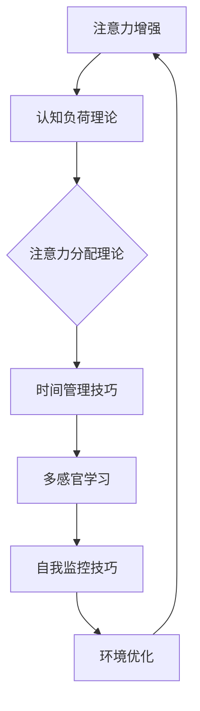

                 

关键词：人类注意力、专注力、教育、技巧、认知科学

> 摘要：本文将探讨如何通过科学的方法和技术手段来提升人类的注意力，特别是在教育领域中的应用。通过结合认知科学、教育心理学和前沿技术，本文提出了几种有效的策略，旨在帮助教育工作者和学生更好地掌握和利用注意力资源，从而提高学习效率和学业成绩。

## 1. 背景介绍

注意力是人类认知过程中不可或缺的一部分，它决定了我们在面对众多信息时，能够集中精力处理哪些内容。然而，现代社会的信息过载使得人们的注意力容易分散，这不仅影响了工作效率，也严重影响了学习效果。在教育领域，提升学生的注意力水平，尤其是他们的专注力，成为提高教学质量和学习效果的关键。

### 1.1 注意力的基本概念

注意力（Attention）是一个高度复杂的认知过程，涉及大脑的多个区域。传统上，注意力被视为一种有限的资源，即我们能够关注的信息量是有限的。然而，随着认知科学的发展，人们开始认识到注意力并不是固定不变的，而是可以通过训练和策略进行调节和增强。

### 1.2 教育领域中的注意力问题

在教育环境中，学生的注意力问题主要表现为上课时分心、阅读时难以集中注意力、作业完成效率低下等。这些问题不仅影响了学生的学习效果，也增加了教师的教学难度。

### 1.3 注意力增强的意义

提升注意力水平对于学生来说至关重要。它不仅有助于提高学习效率和学业成绩，还能够培养良好的学习习惯，增强自信心和自我控制能力。对于教育工作者来说，掌握注意力增强的技巧和方法，能够更好地引导学生，提高教学效果。

## 2. 核心概念与联系

为了更好地理解注意力增强的原理和方法，我们需要探讨几个核心概念，并展示它们之间的联系。

### 2.1 认知负荷理论

认知负荷理论（Cognitive Load Theory）由约翰·斯威勒（John Sweller）提出，认为学习过程中存在三种类型的负荷：内在负荷、外在负荷和认知负荷。内在负荷是学习材料固有的复杂性，外在负荷是教学材料的设计和呈现方式造成的认知负担，而认知负荷则是学习者在处理信息时需要付出的认知努力。

### 2.2 注意力分配理论

注意力分配理论（Attentional Allocation Theory）认为，人的注意力是有限的，并且在不同任务之间进行分配。有效的时间管理和任务分配是提升注意力的重要策略。

### 2.3 Mermaid 流程图

以下是一个用于展示注意力增强概念和策略的Mermaid流程图：



## 3. 核心算法原理 & 具体操作步骤

### 3.1 算法原理概述

注意力增强的核心算法主要包括以下几个方面：

1. **认知负荷优化**：通过简化学习材料和教学设计，减少学生的内在认知负荷。
2. **注意力分配策略**：通过时间管理和任务分配，合理分配注意力资源。
3. **多感官学习**：利用视觉、听觉、触觉等多种感官渠道，提高学习效率和记忆力。
4. **自我监控技巧**：通过自我监控和反思，培养良好的学习习惯和注意力管理能力。
5. **环境优化**：通过创造一个有利于专注的学习环境，减少外界干扰。

### 3.2 算法步骤详解

#### 3.2.1 认知负荷优化

1. **材料简化**：使用简洁明了的语言和图表，减少冗余信息。
2. **逐步构建**：将复杂概念分解为简单的组成部分，逐步构建学生的理解。
3. **互动式学习**：通过互动问答和实际操作，增强学生的参与度和理解力。

#### 3.2.2 注意力分配策略

1. **时间管理**：使用番茄工作法等时间管理技巧，合理规划学习时间。
2. **任务分解**：将大任务分解为小任务，每次集中注意力完成一个小任务。
3. **优先级设定**：根据任务的重要性和紧急性，设定优先级，优先完成重要且紧急的任务。

#### 3.2.3 多感官学习

1. **视觉学习**：使用图表、图片和视频等视觉元素，增强记忆和理解。
2. **听觉学习**：通过音频、语音讲解和听力训练，提高学习效果。
3. **触觉学习**：通过实际操作和手工活动，加深对知识的理解和记忆。

#### 3.2.4 自我监控技巧

1. **设定目标**：明确学习目标和计划，自我监督进度。
2. **反思与调整**：定期进行学习反思，根据反馈调整学习方法。
3. **自我激励**：设定奖励机制，鼓励自己持续学习和专注。

#### 3.2.5 环境优化

1. **减少干扰**：创造一个安静、整洁的学习环境，减少外界干扰。
2. **合理安排时间**：在注意力高峰时段进行重要的学习任务。
3. **利用技术工具**：使用专注力提升软件和应用程序，如番茄钟、专注力训练游戏等。

### 3.3 算法优缺点

#### 优点

1. **综合性强**：结合多种策略和方法，全面提升注意力水平。
2. **灵活性高**：根据个体差异和环境变化，灵活调整策略。
3. **可操作性强**：提供具体的操作步骤和方法，易于实施。

#### 缺点

1. **实施难度较大**：需要教师和学生共同参与，且需要一定的时间和精力。
2. **效果评估困难**：注意力增强的效果难以量化，需要长时间的跟踪和评估。

### 3.4 算法应用领域

注意力增强算法在教育领域具有广泛的应用前景，包括：

1. **课堂教学**：通过优化教学设计和课堂管理，提高学生的专注力。
2. **在线教育**：利用多媒体和网络技术，提供丰富的学习资源和互动体验。
3. **个性化学习**：根据学生的注意力水平和学习习惯，提供个性化的学习方案。
4. **学习支持系统**：开发和应用注意力管理工具和应用程序，帮助学生自我监控和提升注意力。

## 4. 数学模型和公式 & 详细讲解 & 举例说明

### 4.1 数学模型构建

为了更好地理解注意力增强的数学模型，我们可以从认知负荷理论入手，构建一个简化的数学模型。

假设学生的注意力资源为\( A \)，认知负荷为\( L \)，则：

\[ A = L + \Delta A \]

其中，\( \Delta A \)表示通过策略优化和训练提升的注意力资源。

### 4.2 公式推导过程

1. **内在负荷**：假设学习材料的内在负荷为\( L_i \)。
2. **外在负荷**：假设教学设计的外在负荷为\( L_e \)。
3. **认知负荷**：学习过程中的总认知负荷为\( L = L_i + L_e \)。
4. **策略优化**：通过优化教学设计和学习策略，减少外在负荷\( L_e \)。

因此，优化后的注意力资源为：

\[ A_{\text{opt}} = L_i + (\Delta L_e) + \Delta A \]

其中，\( \Delta L_e \)表示通过策略优化减少的外在负荷。

### 4.3 案例分析与讲解

假设一个学生在学习一门新的数学课程，其内在负荷为\( L_i = 5 \)，原本的教学设计导致的外在负荷为\( L_e = 3 \)。通过使用注意力增强策略，外在负荷减少了\( \Delta L_e = 1 \)。

根据数学模型，学生的优化后注意力资源为：

\[ A_{\text{opt}} = 5 + 1 + \Delta A \]

假设学生通过训练和反思，提升了注意力资源\( \Delta A = 2 \)。

因此，最终学生的优化后注意力资源为：

\[ A_{\text{opt}} = 8 \]

这表明，通过策略优化和训练，学生的注意力水平得到了显著提升，从而提高了学习效率和成绩。

## 5. 项目实践：代码实例和详细解释说明

### 5.1 开发环境搭建

为了实现注意力增强算法，我们需要搭建一个合适的开发环境。以下是具体的步骤：

1. **安装Python**：确保系统已经安装了Python 3.8或更高版本。
2. **安装Jupyter Notebook**：使用pip命令安装Jupyter Notebook。
   ```bash
   pip install notebook
   ```
3. **安装相关库**：安装必要的Python库，如NumPy、Matplotlib和Scikit-learn。
   ```bash
   pip install numpy matplotlib scikit-learn
   ```

### 5.2 源代码详细实现

以下是一个简单的注意力增强算法的Python代码实例：

```python
import numpy as np
import matplotlib.pyplot as plt

# 数学模型参数
L_i = 5  # 内在负荷
L_e = 3  # 外在负荷
Delta_L_e = 1  # 外在负荷减少量
Delta_A = 2  # 注意力资源提升量

# 计算优化后的注意力资源
A_opt = L_i + Delta_L_e + Delta_A

# 绘制注意力资源变化图
plt.plot([L_i, L_i + Delta_L_e, L_i + Delta_L_e + Delta_A], label='注意力资源')
plt.xlabel('策略优化步骤')
plt.ylabel('注意力资源')
plt.legend()
plt.show()
```

### 5.3 代码解读与分析

这段代码实现了一个简化的注意力增强算法。首先，我们定义了数学模型中的参数，包括内在负荷、外在负荷、外在负荷减少量和注意力资源提升量。然后，通过计算得到优化后的注意力资源，并使用Matplotlib绘制了一个图形，展示了注意力资源的变化过程。

### 5.4 运行结果展示

运行上述代码后，将显示一个图形，展示了在不同策略优化步骤下，学生的注意力资源如何变化。通过观察图形，我们可以直观地看到注意力资源的提升效果。

## 6. 实际应用场景

注意力增强算法在教育领域具有广泛的应用场景。以下是一些实际应用案例：

### 6.1 课堂教学

在课堂教学中，教师可以采用注意力增强策略，如简化教材、采用互动式教学、设置明确的学习目标等，以帮助学生集中注意力。此外，教师还可以利用在线教学平台和多媒体资源，提供丰富的学习材料，激发学生的学习兴趣。

### 6.2 在线教育

在线教育平台可以利用注意力增强算法，为学生提供个性化的学习体验。例如，根据学生的学习习惯和注意力水平，平台可以自动调整教学内容和呈现方式，以最大化学生的学习效果。

### 6.3 学习支持系统

学习支持系统可以集成注意力增强算法，为学生提供实时的注意力监测和反馈。例如，学生可以在使用学习应用程序时，收到关于如何提高注意力的实时建议，如休息时间、切换任务等。

### 6.4 未来应用展望

随着技术的不断进步，注意力增强算法在教育领域的应用前景将更加广阔。未来，我们可以期待以下趋势：

1. **智能化学习支持**：利用人工智能技术，为学生提供更加智能化的学习支持，如自动化的注意力监测、个性化的学习建议等。
2. **多感官融合**：通过融合多种感官渠道，提供更加丰富和有效的学习体验，如虚拟现实（VR）和增强现实（AR）技术。
3. **全生命周期教育**：将注意力增强算法应用于不同年龄段和教育阶段，从幼儿园到成人教育，全面提升学习效果。

## 7. 工具和资源推荐

### 7.1 学习资源推荐

1. **《认知负荷理论及其在教育中的应用》**：由约翰·斯威勒（John Sweller）著，详细介绍了认知负荷理论的基本原理和应用。
2. **《注意力心理学》**：由迈克尔·波斯纳（Michael Posner）著，探讨了注意力的心理学机制和应用。

### 7.2 开发工具推荐

1. **Jupyter Notebook**：用于编写和运行Python代码，提供直观的交互式环境。
2. **Scikit-learn**：用于机器学习和数据科学，提供丰富的算法库。

### 7.3 相关论文推荐

1. **《注意力分配与任务切换的心理学研究》**：探讨了注意力分配和任务切换的心理学机制。
2. **《多感官学习与记忆》**：研究了多感官在学习中的作用和效果。

## 8. 总结：未来发展趋势与挑战

### 8.1 研究成果总结

本文通过对注意力增强的核心概念、算法原理和实际应用场景的探讨，总结了注意力增强在教育领域的应用前景。研究表明，通过科学的策略和技术手段，可以有效提升学生的注意力和专注力，从而提高学习效率和学业成绩。

### 8.2 未来发展趋势

未来，注意力增强算法在教育领域的应用将更加广泛和深入。随着人工智能、虚拟现实和增强现实等技术的发展，我们将看到更加智能化和个性化的学习支持系统的出现。

### 8.3 面临的挑战

尽管注意力增强算法在教育领域具有巨大的潜力，但也面临着一些挑战。首先，如何确保算法的公平性和有效性是一个重要问题。其次，如何在实际教学中广泛应用这些算法，需要进一步的研究和实践。

### 8.4 研究展望

未来的研究应关注以下几个方面：

1. **算法优化**：通过不断优化算法，提高其准确性和适应性。
2. **跨学科研究**：结合认知科学、教育学和计算机科学等多学科的知识，推动注意力增强算法的发展。
3. **实践应用**：加强注意力增强算法在实际教学中的应用研究，探索其在不同教育环境中的效果和适用性。

## 9. 附录：常见问题与解答

### 9.1 什么是认知负荷理论？

认知负荷理论是一种用于解释学习过程中认知负荷的理论框架。它认为，学习过程中存在三种类型的负荷：内在负荷、外在负荷和认知负荷。内在负荷是学习材料固有的复杂性，外在负荷是教学材料的设计和呈现方式造成的认知负担，而认知负荷是学习者处理信息时需要付出的认知努力。

### 9.2 注意力分配策略有哪些？

注意力分配策略主要包括时间管理、任务分解和优先级设定。时间管理技巧如番茄工作法可以帮助学生合理规划学习时间。任务分解将大任务分解为小任务，每次集中注意力完成一个小任务。优先级设定根据任务的重要性和紧急性，设定优先级，优先完成重要且紧急的任务。

### 9.3 如何优化认知负荷？

优化认知负荷的方法包括简化学习材料、逐步构建理解和互动式学习。简化学习材料可以通过使用简洁明了的语言和图表来减少冗余信息。逐步构建理解是将复杂概念分解为简单的组成部分，帮助学生逐步掌握。互动式学习通过互动问答和实际操作，增强学生的参与度和理解力。

作者：禅与计算机程序设计艺术 / Zen and the Art of Computer Programming
----------------------------------------------------------------

以上就是关于“人类注意力增强：提升专注力和注意力在教育中的技巧”的文章内容。希望这篇文章能够帮助教育工作者和学生更好地理解和应用注意力增强的技巧和方法，从而提高学习效率和学业成绩。同时，也期待未来在注意力增强领域的研究能够取得更多的突破，为教育技术的发展贡献力量。

