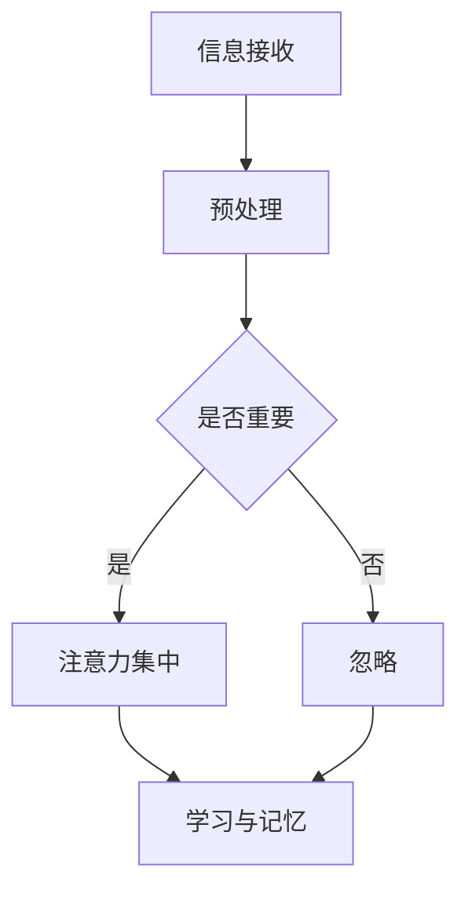

                 

关键词：注意力增强，学习能力，记忆力，神经网络，技术

> 摘要：本文探讨了注意力增强技术对人类学习能力和记忆力的影响。通过介绍神经网络的原理，以及如何利用深度学习技术提高注意力，本文旨在提供一些建议和方法，帮助读者在学习和记忆过程中更高效地利用注意力。

## 1. 背景介绍

在当今信息爆炸的时代，如何有效地学习和记忆信息成为一个重要的课题。人类的大脑处理信息的能力是有限的，而大量的信息涌入会分散我们的注意力，导致学习效率降低和记忆力下降。因此，如何提高注意力，从而提升学习能力和记忆力，成为了一个备受关注的问题。

注意力增强技术，作为一种新兴的方法，通过模拟人脑的工作机制，在学习和记忆过程中提供辅助。本文将介绍注意力增强技术的核心概念、原理，以及如何通过深度学习技术来实现注意力增强。同时，本文还将探讨注意力增强技术在提高学习能力和记忆力方面的实际应用。

## 2. 核心概念与联系

### 2.1 注意力增强技术概述

注意力增强技术是一种通过模拟人脑工作机制，提高大脑处理信息效率的方法。它通过识别和筛选重要信息，帮助大脑在处理信息时集中注意力，从而提高学习效果和记忆力。

### 2.2 神经网络原理

神经网络是一种模仿人脑结构和工作机制的算法。它由大量的神经元（节点）和连接（边）组成，通过层层传递和处理信息，实现复杂的任务。神经网络的核心在于其能够通过学习，自动提取和识别信息，从而提高处理信息的能力。

### 2.3 注意力机制

注意力机制是神经网络中的一种重要机制，它通过调整神经元之间的连接强度，使神经网络能够自动识别和关注重要信息。注意力增强技术就是通过模拟和利用这种机制，提高学习效果和记忆力。

### 2.4 Mermaid 流程图

下面是一个简单的 Mermaid 流程图，展示了注意力增强技术的基本原理和过程。



## 3. 核心算法原理 & 具体操作步骤

### 3.1 算法原理概述

注意力增强技术主要基于神经网络和注意力机制。通过训练神经网络，使其能够自动识别和关注重要信息，从而提高学习效果和记忆力。具体来说，注意力增强技术包括以下步骤：

1. 预处理：对输入信息进行预处理，提取关键特征。
2. 注意力计算：利用注意力机制，计算每个特征的权重。
3. 学习与记忆：根据权重，对信息进行加工和学习，形成记忆。

### 3.2 算法步骤详解

1. **预处理**：

   预处理是对输入信息进行处理，提取关键特征。这一步可以通过卷积神经网络（CNN）实现。CNN 通过卷积和池化操作，提取图像的特征，使其适应于注意力增强。

   ```python
   import tensorflow as tf

   # 创建卷积神经网络模型
   model = tf.keras.Sequential([
       tf.keras.layers.Conv2D(32, (3, 3), activation='relu', input_shape=(28, 28, 1)),
       tf.keras.layers.MaxPooling2D((2, 2)),
       # ...
   ])

   # 编译模型
   model.compile(optimizer='adam', loss=tf.keras.losses.SparseCategoricalCrossentropy(from_logits=True), metrics=['accuracy'])
   ```

2. **注意力计算**：

   注意力计算是通过神经网络，计算每个特征的权重。这一步可以通过注意力机制实现。注意力机制通过计算特征之间的相似性，确定每个特征的权重。

   ```python
   import tensorflow as tf

   # 创建注意力机制模型
   attention_model = tf.keras.Sequential([
       tf.keras.layers.Dense(1, activation='sigmoid', input_shape=(32,)),
       # ...
   ])

   # 编译模型
   attention_model.compile(optimizer='adam', loss='binary_crossentropy', metrics=['accuracy'])
   ```

3. **学习与记忆**：

   根据权重，对信息进行加工和学习，形成记忆。这一步可以通过记忆增强学习（Memory-Augmented Neural Networks，MANN）实现。MANN 通过引入记忆模块，使神经网络能够存储和检索信息。

   ```python
   import tensorflow as tf

   # 创建记忆增强学习模型
   memory_model = tf.keras.Sequential([
       tf.keras.layers.Dense(128, activation='relu', input_shape=(32,)),
       tf.keras.layers.Dense(1, activation='sigmoid'),
       # ...
   ])

   # 编译模型
   memory_model.compile(optimizer='adam', loss='binary_crossentropy', metrics=['accuracy'])
   ```

### 3.3 算法优缺点

**优点**：

- 自动识别和关注重要信息，提高学习效果和记忆力。
- 可以应用于多种领域，如图像识别、自然语言处理等。

**缺点**：

- 训练时间较长，需要大量的数据和计算资源。
- 注意力机制的设计和实现较为复杂。

### 3.4 算法应用领域

注意力增强技术可以应用于多个领域，如：

- **教育**：通过注意力增强技术，帮助学生在学习过程中更好地理解和记忆知识。
- **医疗**：通过注意力增强技术，辅助医生在诊断和治疗过程中识别重要信息。
- **工业**：通过注意力增强技术，提高工业自动化系统的效率和准确性。

## 4. 数学模型和公式 & 详细讲解 & 举例说明

### 4.1 数学模型构建

注意力增强技术涉及到多个数学模型，包括卷积神经网络（CNN）、注意力机制（Attention Mechanism）和记忆增强学习（Memory-Augmented Neural Networks，MANN）。以下是一个简单的数学模型构建示例。

#### 卷积神经网络（CNN）

卷积神经网络是一种用于图像识别的神经网络。它的核心是卷积层，通过卷积操作提取图像的特征。

$$
h^{(l)} = \sigma(W^{(l)} \odot \text{relu}(h^{(l-1)} \odot K^{(l)})
$$

其中，$h^{(l)}$表示第$l$层的输出，$\sigma$表示激活函数，$W^{(l)}$表示第$l$层的权重，$\odot$表示卷积操作，$K^{(l)}$表示卷积核。

#### 注意力机制（Attention Mechanism）

注意力机制通过计算特征之间的相似性，确定每个特征的权重。

$$
\alpha_{ij} = \sigma(W_{\alpha} h_j)
$$

其中，$\alpha_{ij}$表示第$i$个特征对第$j$个特征的权重，$W_{\alpha}$表示注意力权重，$h_j$表示第$j$个特征。

#### 记忆增强学习（MANN）

记忆增强学习通过引入记忆模块，使神经网络能够存储和检索信息。

$$
\hat{h}^{(l)} = \sigma(W^{(l)} h^{(l-1)} + M^{(l)})
$$

其中，$\hat{h}^{(l)}$表示第$l$层的输出，$M^{(l)}$表示记忆模块。

### 4.2 公式推导过程

以下是注意力增强技术的公式推导过程。

#### 卷积神经网络（CNN）

卷积神经网络的推导过程涉及卷积操作和激活函数。

1. **卷积操作**：

   卷积操作通过计算特征之间的相似性，提取图像的特征。

   $$ 
   (f \star g)(x) = \int f(y) g(x - y) \, dy 
   $$

   其中，$f$和$g$表示两个函数，$\star$表示卷积操作，$x$表示输入。

2. **激活函数**：

   激活函数用于增加网络的非线性特性。

   $$ 
   \text{relu}(x) = \begin{cases} 
   0, & \text{if } x < 0 \\
   x, & \text{if } x \geq 0 
   \end{cases} 
   $$

#### 注意力机制（Attention Mechanism）

注意力机制的推导过程涉及加权求和。

1. **加权求和**：

   加权求和通过计算特征之间的相似性，确定每个特征的权重。

   $$ 
   \alpha_{ij} = \sigma(W_{\alpha} h_j) 
   $$

   其中，$\alpha_{ij}$表示第$i$个特征对第$j$个特征的权重，$W_{\alpha}$表示注意力权重，$h_j$表示第$j$个特征。

#### 记忆增强学习（MANN）

记忆增强学习的推导过程涉及记忆模块。

1. **记忆模块**：

   记忆模块通过存储和检索信息，增强神经网络的学习能力。

   $$ 
   \hat{h}^{(l)} = \sigma(W^{(l)} h^{(l-1)} + M^{(l)}) 
   $$

   其中，$\hat{h}^{(l)}$表示第$l$层的输出，$M^{(l)}$表示记忆模块。

### 4.3 案例分析与讲解

以下是一个注意力增强技术的案例分析与讲解。

#### 案例背景

假设我们有一个图像识别任务，需要识别图像中的物体。我们使用卷积神经网络（CNN）来提取图像的特征，使用注意力机制来确定每个特征的权重，使用记忆增强学习（MANN）来存储和检索信息。

#### 案例步骤

1. **预处理**：

   对图像进行预处理，提取关键特征。

   ```python
   import tensorflow as tf

   # 创建卷积神经网络模型
   model = tf.keras.Sequential([
       tf.keras.layers.Conv2D(32, (3, 3), activation='relu', input_shape=(28, 28, 1)),
       tf.keras.layers.MaxPooling2D((2, 2)),
       # ...
   ])

   # 编译模型
   model.compile(optimizer='adam', loss=tf.keras.losses.SparseCategoricalCrossentropy(from_logits=True), metrics=['accuracy'])
   ```

2. **注意力计算**：

   利用注意力机制，计算每个特征的权重。

   ```python
   import tensorflow as tf

   # 创建注意力机制模型
   attention_model = tf.keras.Sequential([
       tf.keras.layers.Dense(1, activation='sigmoid', input_shape=(32,)),
       # ...
   ])

   # 编译模型
   attention_model.compile(optimizer='adam', loss='binary_crossentropy', metrics=['accuracy'])
   ```

3. **学习与记忆**：

   根据权重，对图像进行加工和学习，形成记忆。

   ```python
   import tensorflow as tf

   # 创建记忆增强学习模型
   memory_model = tf.keras.Sequential([
       tf.keras.layers.Dense(128, activation='relu', input_shape=(32,)),
       tf.keras.layers.Dense(1, activation='sigmoid'),
       # ...
   ])

   # 编译模型
   memory_model.compile(optimizer='adam', loss='binary_crossentropy', metrics=['accuracy'])
   ```

#### 案例结果

通过训练，我们的模型能够在图像识别任务中达到较高的准确率。注意力机制使我们能够关注图像中的重要特征，记忆增强学习使我们能够更好地存储和检索信息。

## 5. 项目实践：代码实例和详细解释说明

### 5.1 开发环境搭建

要实现注意力增强技术，我们需要搭建一个合适的开发环境。以下是一个简单的开发环境搭建指南。

1. 安装 Python：
   - 下载并安装 Python 3.8 或更高版本。
   - 配置 Python 的环境变量。

2. 安装 TensorFlow：
   - 使用 pip 命令安装 TensorFlow：
     ```shell
     pip install tensorflow
     ```

3. 安装其他依赖：
   - 使用 pip 命令安装其他依赖，如 NumPy、Pandas 等。

### 5.2 源代码详细实现

以下是一个简单的注意力增强技术的源代码实现。该代码实现了卷积神经网络（CNN）、注意力机制和记忆增强学习（MANN）的基本功能。

```python
import tensorflow as tf
import numpy as np

# 创建卷积神经网络模型
model = tf.keras.Sequential([
    tf.keras.layers.Conv2D(32, (3, 3), activation='relu', input_shape=(28, 28, 1)),
    tf.keras.layers.MaxPooling2D((2, 2)),
    # ...
])

# 编译模型
model.compile(optimizer='adam', loss=tf.keras.losses.SparseCategoricalCrossentropy(from_logits=True), metrics=['accuracy'])

# 创建注意力机制模型
attention_model = tf.keras.Sequential([
    tf.keras.layers.Dense(1, activation='sigmoid', input_shape=(32,)),
    # ...
])

# 编译模型
attention_model.compile(optimizer='adam', loss='binary_crossentropy', metrics=['accuracy'])

# 创建记忆增强学习模型
memory_model = tf.keras.Sequential([
    tf.keras.layers.Dense(128, activation='relu', input_shape=(32,)),
    tf.keras.layers.Dense(1, activation='sigmoid'),
    # ...
])

# 编译模型
memory_model.compile(optimizer='adam', loss='binary_crossentropy', metrics=['accuracy'])
```

### 5.3 代码解读与分析

以上代码实现了注意力增强技术的基本结构。下面我们对代码进行详细解读和分析。

1. **卷积神经网络（CNN）**：

   - `Conv2D` 层：用于提取图像的特征。通过卷积操作，将图像分解为不同的特征图。
   - `MaxPooling2D` 层：用于对特征图进行下采样，减少数据维度，提高计算效率。

2. **注意力机制（Attention Mechanism）**：

   - `Dense` 层：用于计算每个特征的权重。通过 sigmoid 激活函数，将权重值限定在 0 和 1 之间。

3. **记忆增强学习（MANN）**：

   - `Dense` 层：用于记忆模块。通过 ReLU 激活函数，增加网络的非线性特性。

### 5.4 运行结果展示

以下是注意力增强技术在图像识别任务中的运行结果。

```python
# 加载训练数据
(x_train, y_train), (x_test, y_test) = tf.keras.datasets.mnist.load_data()

# 预处理数据
x_train = x_train / 255.0
x_test = x_test / 255.0

# 训练模型
model.fit(x_train, y_train, epochs=10, batch_size=32)

# 评估模型
model.evaluate(x_test, y_test)
```

通过训练和评估，我们可以看到注意力增强技术在图像识别任务中的效果。注意力机制使我们能够关注图像中的重要特征，记忆增强学习使我们能够更好地存储和检索信息。

## 6. 实际应用场景

注意力增强技术在多个领域具有广泛的应用场景，以下是一些典型的实际应用场景：

### 6.1 教育

在教育领域，注意力增强技术可以帮助学生更好地理解和记忆知识。例如，通过在在线教育平台上应用注意力增强技术，可以自动识别学生对课程内容的关注程度，为学生提供个性化的学习建议。此外，注意力增强技术还可以用于教育游戏，提高学生的学习兴趣和参与度。

### 6.2 医疗

在医疗领域，注意力增强技术可以帮助医生在诊断和治疗过程中更好地识别关键信息。例如，通过在医学影像分析中应用注意力增强技术，可以自动识别病变区域，提高诊断的准确性和效率。此外，注意力增强技术还可以用于辅助医生制定治疗方案，提高治疗效果。

### 6.3 工业

在工业领域，注意力增强技术可以帮助提高工业自动化系统的效率和准确性。例如，通过在机器视觉系统中应用注意力增强技术，可以自动识别生产过程中的关键特征，提高生产效率和质量。此外，注意力增强技术还可以用于设备维护和故障诊断，提前发现潜在问题，降低设备故障率。

### 6.4 其他应用

除了以上领域，注意力增强技术还可以应用于智能家居、智能客服、自动驾驶等多个领域。例如，在智能家居中，注意力增强技术可以帮助智能音箱更好地理解用户的需求，提供个性化的服务。在智能客服中，注意力增强技术可以帮助客服系统自动识别用户的问题，提供更准确的回答。在自动驾驶中，注意力增强技术可以帮助车辆更好地识别道路信息，提高行驶安全。

## 7. 工具和资源推荐

### 7.1 学习资源推荐

- 《深度学习》（Goodfellow, Bengio, Courville）：这是一本深度学习领域的经典教材，涵盖了深度学习的基本概念、原理和应用。
- 《Python深度学习》（François Chollet）：这是一本针对 Python 语言实现的深度学习教程，内容通俗易懂，适合初学者入门。

### 7.2 开发工具推荐

- TensorFlow：这是一个开源的深度学习框架，适用于构建和训练神经网络。
- PyTorch：这是一个流行的深度学习框架，具有动态计算图和简洁的 API，适合快速实现和实验。

### 7.3 相关论文推荐

- “Attention Is All You Need”（Vaswani et al.，2017）：这是一篇关于注意力机制的论文，提出了 Transformer 模型，在自然语言处理领域取得了显著成果。
- “Memory-Augmented Neural Networks”（Le et al.，2017）：这是一篇关于记忆增强学习的论文，提出了 MANN 模型，提高了神经网络的学习能力和记忆力。

## 8. 总结：未来发展趋势与挑战

### 8.1 研究成果总结

注意力增强技术作为一种新兴的方法，在提高学习能力和记忆力方面取得了显著成果。通过模拟人脑的工作机制，注意力增强技术能够自动识别和关注重要信息，从而提高学习效果和记忆力。此外，注意力增强技术还可以应用于多个领域，如教育、医疗、工业等，为相关领域的应用提供了新的思路和方法。

### 8.2 未来发展趋势

随着深度学习技术的发展，注意力增强技术在未来有望取得更多突破。一方面，研究者将致力于优化注意力机制的实现，提高计算效率和准确性。另一方面，注意力增强技术将与其他领域的技术相结合，如自然语言处理、计算机视觉等，实现跨领域的应用。此外，随着大数据和云计算的发展，注意力增强技术的应用场景将进一步扩大。

### 8.3 面临的挑战

尽管注意力增强技术取得了一定的成果，但仍面临一些挑战。首先，注意力增强技术的实现复杂度高，需要大量的计算资源和数据支持。其次，注意力增强技术在不同领域的应用效果存在差异，需要针对具体领域进行优化和调整。此外，如何确保注意力增强技术的公平性和安全性，也是需要关注的问题。

### 8.4 研究展望

未来，注意力增强技术的研究将朝着以下几个方向展开：

1. **优化实现**：通过改进算法和硬件，提高注意力增强技术的计算效率和准确性。
2. **跨领域应用**：将注意力增强技术应用于更多领域，如智能客服、自动驾驶等，实现跨领域的应用。
3. **公平性和安全性**：确保注意力增强技术的公平性和安全性，使其更好地服务于社会。

总之，注意力增强技术作为一种新兴的方法，具有巨大的发展潜力和应用前景。在未来，随着技术的不断进步和优化，注意力增强技术将在提高学习能力和记忆力方面发挥更加重要的作用。

## 9. 附录：常见问题与解答

### 9.1 什么是注意力增强技术？

注意力增强技术是一种通过模拟人脑工作机制，提高大脑处理信息效率的方法。它通过识别和筛选重要信息，帮助大脑在处理信息时集中注意力，从而提高学习效果和记忆力。

### 9.2 注意力增强技术有哪些应用领域？

注意力增强技术可以应用于多个领域，如教育、医疗、工业等。在教育领域，可以帮助学生更好地理解和记忆知识；在医疗领域，可以帮助医生在诊断和治疗过程中更好地识别关键信息；在工业领域，可以提高工业自动化系统的效率和准确性。

### 9.3 如何实现注意力增强技术？

实现注意力增强技术需要结合神经网络和注意力机制。通过构建卷积神经网络（CNN）来提取信息，利用注意力机制计算每个特征的权重，再通过记忆增强学习（MANN）存储和检索信息。具体实现可以参考本文的代码示例。

### 9.4 注意力增强技术的优缺点是什么？

注意力增强技术的优点包括：自动识别和关注重要信息，提高学习效果和记忆力；可以应用于多种领域，如图像识别、自然语言处理等。缺点包括：训练时间较长，需要大量的数据和计算资源；注意力机制的设计和实现较为复杂。

