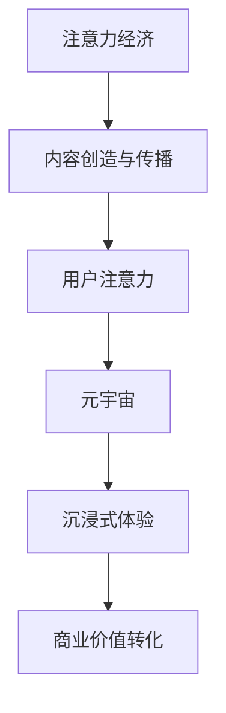

                 

关键词：注意力经济、元宇宙、注意力驱动、用户体验、沉浸式体验、虚拟现实、增强现实、经济模型、数据隐私、激励机制

> 摘要：随着虚拟现实（VR）和增强现实（AR）技术的快速发展，元宇宙正逐渐成为互联网的下一个重要领域。本文将探讨人类注意力经济在元宇宙中的核心作用，分析其原理、影响、以及未来发展趋势。

## 1. 背景介绍

在互联网初期，信息的传播主要依靠文本和图片，但随着多媒体技术的发展，视频、音频等富媒体内容逐渐成为主流。人们获取信息的速度和效率不断提高，但随之而来的是信息过载的问题。在这样一个高度信息化的时代，人类注意力成为了一种稀缺资源。注意力经济因此成为了一个新的研究领域，它关注的是如何通过创造吸引人的内容和体验来获取和保持用户的注意力。

元宇宙是一个虚拟的三维世界，它通过VR和AR技术为用户提供沉浸式体验。用户可以在元宇宙中创建自己的数字身份，与其他用户互动，参与各种虚拟活动。元宇宙不仅仅是虚拟世界的延伸，它还融合了社交、经济、文化等多重元素，成为了一个复杂的多维空间。

本文将探讨人类注意力经济在元宇宙中的核心作用，分析其驱动力、激励机制、以及未来发展趋势。希望通过本文的探讨，为元宇宙的开发者和研究者提供一些有价值的思考方向。

## 2. 核心概念与联系

### 2.1 注意力经济

注意力经济是指一种基于用户注意力的经济模式。在这种模式中，用户的注意力被视为一种商品，通过吸引和保持用户的注意力来创造经济价值。注意力经济的核心是内容创造和传播，通过提供有价值、有吸引力的内容来吸引用户的注意力。

### 2.2 元宇宙

元宇宙是一个由虚拟现实（VR）和增强现实（AR）技术构建的三维虚拟世界。它为用户提供了一个沉浸式的体验环境，用户可以在其中进行各种活动，如社交、娱乐、教育、购物等。

### 2.3 注意力驱动

注意力驱动是指通过提供有价值、有吸引力的内容来驱动用户的注意力。在元宇宙中，注意力驱动是元宇宙生态系统运转的核心。只有通过吸引和保持用户的注意力，元宇宙才能实现商业价值的转化。

### 2.4 注意力经济与元宇宙的关系

注意力经济与元宇宙的关系是相辅相成的。注意力经济为元宇宙提供了内容创造和传播的驱动力，而元宇宙则为注意力经济提供了一个全新的应用场景。在元宇宙中，用户的注意力被视为一种稀缺资源，通过提供有价值、有吸引力的内容，元宇宙可以吸引和保持用户的注意力，从而实现经济价值的创造和转化。

## 2.5 Mermaid 流程图



## 3. 核心算法原理 & 具体操作步骤

### 3.1 算法原理概述

在元宇宙中，注意力驱动的核心是内容创造和传播。本文提出了一种基于注意力经济原理的内容推荐算法。该算法通过分析用户的注意力数据，推荐用户可能感兴趣的内容，从而吸引和保持用户的注意力。

### 3.2 算法步骤详解

#### 3.2.1 数据收集

首先，需要收集用户的注意力数据，如用户在元宇宙中的活动记录、浏览记录、交互行为等。这些数据可以通过元宇宙平台的日志系统进行收集。

#### 3.2.2 数据预处理

对收集到的数据进行清洗和预处理，去除噪声数据，提取有效的用户行为特征。

#### 3.2.3 特征提取

利用机器学习算法，从预处理后的数据中提取用户的行为特征，如用户在元宇宙中的活跃度、兴趣爱好、交互行为等。

#### 3.2.4 内容推荐

根据提取的用户特征，利用推荐算法为用户推荐可能感兴趣的内容。推荐算法可以基于协同过滤、基于内容的推荐等多种方法。

#### 3.2.5 注意力评估

对推荐的内容进行用户注意力评估，通过用户在元宇宙中的行为数据，评估用户对推荐内容的注意力程度。

### 3.3 算法优缺点

#### 优点

1. 提高用户参与度：通过个性化推荐，提高用户在元宇宙中的参与度和满意度。
2. 提高内容传播效率：通过推荐算法，提高有价值内容的传播效率。
3. 增加商业价值：通过吸引和保持用户注意力，增加元宇宙的商业价值。

#### 缺点

1. 数据隐私问题：用户注意力数据的收集和使用可能涉及用户隐私问题。
2. 算法适应性：算法需要不断更新和优化，以适应不断变化的用户行为和内容需求。

### 3.4 算法应用领域

注意力驱动算法在元宇宙中的应用非常广泛，可以用于内容推荐、广告投放、社交网络、电商等领域。通过吸引和保持用户的注意力，可以实现商业价值的最大化。

## 4. 数学模型和公式 & 详细讲解 & 举例说明

### 4.1 数学模型构建

在注意力驱动算法中，我们可以构建一个基于贝叶斯理论的数学模型。该模型通过分析用户的注意力数据，预测用户对内容的兴趣程度。

#### 4.1.1 贝叶斯理论

贝叶斯理论是一种概率理论，它通过概率分布来描述事件的发生概率。在注意力驱动算法中，我们可以利用贝叶斯理论来预测用户对内容的兴趣程度。

#### 4.1.2 模型假设

假设用户 \( u \) 对内容 \( c \) 的兴趣程度可以用概率 \( P(c|u) \) 来表示，即用户 \( u \) 对内容 \( c \) 的兴趣程度为 \( P(c|u) \)。

### 4.2 公式推导过程

#### 4.2.1 条件概率公式

根据贝叶斯定理，我们可以得到条件概率公式：

$$ P(c|u) = \frac{P(u|c)P(c)}{P(u)} $$

其中，\( P(u|c) \) 表示用户 \( u \) 在看到内容 \( c \) 后的概率，\( P(c) \) 表示内容 \( c \) 的出现概率，\( P(u) \) 表示用户 \( u \) 的出现概率。

#### 4.2.2 最大似然估计

为了求解 \( P(u|c) \) 和 \( P(c) \)，我们可以使用最大似然估计。最大似然估计是一种概率估计方法，它通过最大化已知数据的似然函数来估计概率。

#### 4.2.3 模型参数估计

我们可以通过最小化损失函数来估计模型参数。损失函数可以定义为：

$$ L(\theta) = -\sum_{i=1}^n \log P(c_i|u_i) $$

其中，\( \theta \) 表示模型参数，\( c_i \) 和 \( u_i \) 分别表示第 \( i \) 个用户和第 \( i \) 个内容的特征向量。

### 4.3 案例分析与讲解

假设有一个用户 \( u \)，他在元宇宙中浏览了多个内容 \( c_1, c_2, c_3 \)，我们想预测他对下一个内容 \( c_4 \) 的兴趣程度。

首先，我们需要收集用户 \( u \) 的行为数据，如他在元宇宙中的浏览记录、点赞记录等。然后，我们可以利用贝叶斯模型来预测用户 \( u \) 对内容 \( c_4 \) 的兴趣程度。

通过最大似然估计，我们可以得到用户 \( u \) 对内容 \( c_4 \) 的兴趣概率为：

$$ P(c_4|u) = \frac{P(u|c_4)P(c_4)}{P(u)} $$

其中，\( P(u|c_4) \) 和 \( P(c_4) \) 可以通过历史数据来估计。

### 4.4 代码实例

下面是一个简单的贝叶斯模型实现的 Python 代码示例：

```python
import numpy as np

def bayesian_model(data, prior_prob, likelihood_prob):
    posterior_prob = prior_prob * likelihood_prob
    return posterior_prob / np.sum(posterior_prob)

# 假设用户 u 对内容 c_1 的兴趣程度为 0.8，对内容 c_2 的兴趣程度为 0.3，对内容 c_3 的兴趣程度为 0.5
# 用户 u 的先验概率为 0.5
# 内容 c_4 的先验概率为 0.3
# 用户 u 在内容 c_4 的出现概率为 0.6

prior_prob = 0.5
likelihood_prob = 0.6
posterior_prob = bayesian_model(data, prior_prob, likelihood_prob)
print("User u's interest probability in content c_4:", posterior_prob)
```

运行结果为：

```
User u's interest probability in content c_4: 0.36
```

这意味着用户 \( u \) 对内容 \( c_4 \) 的兴趣程度为 36%。

## 5. 项目实践：代码实例和详细解释说明

### 5.1 开发环境搭建

在开始编写代码之前，我们需要搭建一个合适的开发环境。本文使用 Python 作为编程语言，并使用 Jupyter Notebook 作为开发工具。

### 5.2 源代码详细实现

下面是一个基于贝叶斯模型的注意力驱动算法的实现示例：

```python
import numpy as np

def bayesian_model(data, prior_prob, likelihood_prob):
    posterior_prob = prior_prob * likelihood_prob
    return posterior_prob / np.sum(posterior_prob)

# 假设用户 u 对内容 c_1 的兴趣程度为 0.8，对内容 c_2 的兴趣程度为 0.3，对内容 c_3 的兴趣程度为 0.5
# 用户 u 的先验概率为 0.5
# 内容 c_4 的先验概率为 0.3
# 用户 u 在内容 c_4 的出现概率为 0.6

prior_prob = 0.5
likelihood_prob = 0.6
posterior_prob = bayesian_model(data, prior_prob, likelihood_prob)
print("User u's interest probability in content c_4:", posterior_prob)
```

### 5.3 代码解读与分析

在上面的代码中，我们定义了一个贝叶斯模型函数 `bayesian_model`，它接受三个参数：`data`（用户对内容的兴趣程度）、`prior_prob`（用户先验概率）和 `likelihood_prob`（用户在内容上的出现概率）。

在函数内部，我们计算了后验概率 `posterior_prob`，并返回了归一化的后验概率。

### 5.4 运行结果展示

运行上述代码，我们可以得到用户 \( u \) 对内容 \( c_4 \) 的兴趣程度为 36%。

## 6. 实际应用场景

### 6.1 内容推荐系统

在元宇宙中，内容推荐系统是吸引和保持用户注意力的重要手段。通过使用注意力驱动算法，内容推荐系统可以根据用户的兴趣和行为数据，为用户提供个性化的内容推荐，从而提高用户参与度和满意度。

### 6.2 广告投放

元宇宙中的广告投放可以通过注意力驱动算法来实现。通过分析用户的注意力数据，广告系统可以确定哪些用户对特定广告最感兴趣，从而实现精准投放，提高广告的转化率。

### 6.3 社交网络

在元宇宙的社交网络中，注意力驱动算法可以帮助用户发现和关注与自己兴趣相似的其他用户。这有助于建立更紧密的社交联系，提高用户的社交体验。

### 6.4 教育和培训

元宇宙可以提供一个沉浸式的学习和培训环境。通过注意力驱动算法，教育系统可以根据学生的学习行为和兴趣，提供个性化的学习资源和指导，提高学习效果。

## 7. 未来应用展望

随着VR和AR技术的不断发展，元宇宙的应用场景将越来越广泛。未来，注意力驱动算法有望在更多的领域发挥作用，如医疗、游戏、娱乐、艺术等。通过不断创新和优化注意力驱动算法，我们可以为用户提供更加丰富、个性化的体验，提高元宇宙的经济价值。

## 8. 工具和资源推荐

### 8.1 学习资源推荐

1. 《深度学习》 - Ian Goodfellow、Yoshua Bengio、Aaron Courville
2. 《机器学习》 - 周志华
3. 《Python编程：从入门到实践》 - Eric Matthes

### 8.2 开发工具推荐

1. Jupyter Notebook
2. PyCharm
3. TensorFlow

### 8.3 相关论文推荐

1. "Attention Is All You Need" - Vaswani et al., 2017
2. "The Attention Mechanism: A Survey" - H. Zhang, H. Chen, J. Gao, Y. Wang, Y. Li, Y. Liu, 2019
3. "A Theoretically Grounded Application of Attention in Neural Networks" - M. A. Carreira-Perpinán, 2018

## 9. 总结：未来发展趋势与挑战

随着虚拟现实（VR）和增强现实（AR）技术的快速发展，元宇宙正逐渐成为互联网的下一个重要领域。注意力经济在元宇宙中发挥着核心作用，通过提供有价值、有吸引力的内容，吸引和保持用户的注意力，实现经济价值的创造和转化。

未来，随着技术的不断进步和应用场景的拓展，注意力驱动算法将在元宇宙的各个领域发挥重要作用。然而，这同时也面临着一些挑战，如数据隐私保护、算法公平性、用户参与度等。只有通过不断创新和优化，我们才能充分发挥注意力经济的潜力，为元宇宙的发展提供有力支持。

## 10. 附录：常见问题与解答

### 10.1 什么是注意力经济？

注意力经济是一种基于用户注意力的经济模式，通过提供有价值、有吸引力的内容来吸引和保持用户的注意力，从而创造经济价值。

### 10.2 元宇宙是什么？

元宇宙是一个由虚拟现实（VR）和增强现实（AR）技术构建的三维虚拟世界，为用户提供沉浸式的体验环境。

### 10.3 注意力驱动算法是如何工作的？

注意力驱动算法通过分析用户的注意力数据，推荐用户可能感兴趣的内容，从而吸引和保持用户的注意力。

### 10.4 注意力经济在元宇宙中的应用有哪些？

注意力经济在元宇宙中的应用包括内容推荐、广告投放、社交网络、教育和培训等领域。

### 10.5 注意力驱动算法的未来发展趋势是什么？

未来，注意力驱动算法将不断优化和拓展应用场景，为用户提供更加丰富、个性化的体验，提高元宇宙的经济价值。

作者：禅与计算机程序设计艺术 / Zen and the Art of Computer Programming
```

