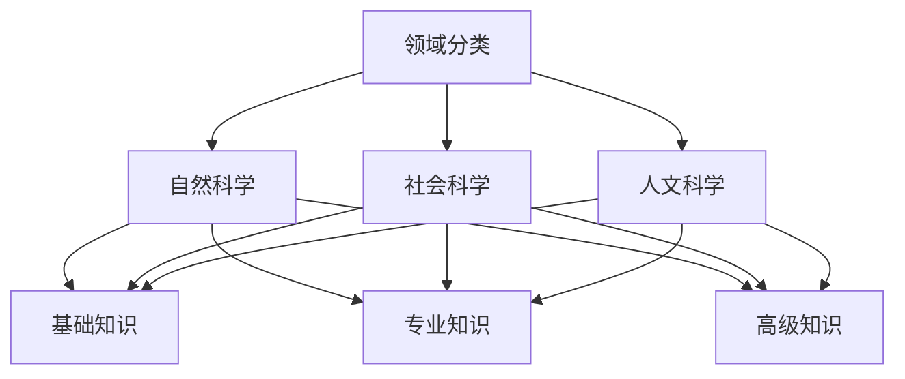
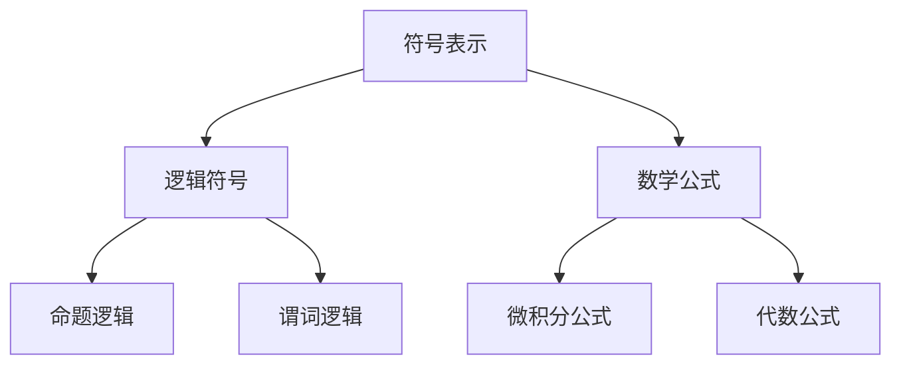
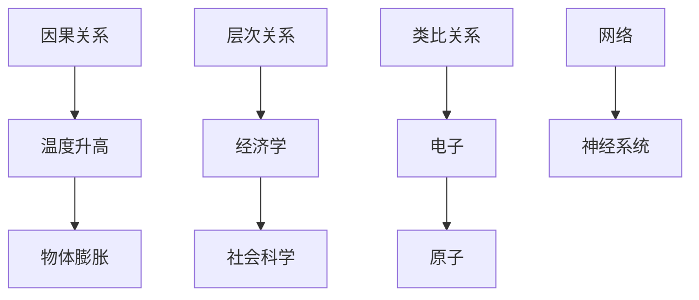
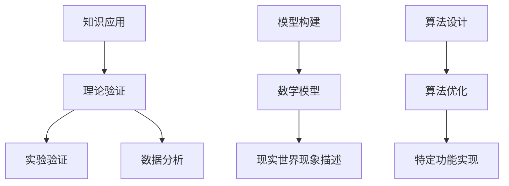

                 

### 引言

在信息技术飞速发展的时代，知识的积累和传播变得更加迅速和广泛。然而，随着知识种类的爆炸性增长，人们面对的挑战也随之而来——如何高效地获取、组织和理解知识，以最大限度地提升个人的认知水平和工作效率？这不仅是学术研究者和专业人士关心的问题，也是每一个试图在数字化世界中立足的人必须面对的课题。

本文旨在探讨人类知识地图的概念、构建方法及其在实际应用中的重要性。人类知识地图不仅仅是一个关于知识的组织工具，它更是一个帮助我们理解和掌握知识的框架。通过这篇文章，我们将深入探讨以下几个关键问题：

- **什么是人类知识地图？** 它是如何构建的，又如何运作？
- **如何使用知识地图进行高效学习与工作？** 我们将探讨一些实用的方法和技巧。
- **知识地图在不同领域的应用**，以及它在促进跨学科研究中的作用。
- **未来知识地图的发展趋势**，包括技术革新带来的影响和潜在挑战。

通过对这些问题的探讨，我们希望能够为读者提供一个全面、系统的知识地图构建与运用指南。无论您是专业研究者、工程师、学生，还是对知识管理感兴趣的普通读者，本文都希望能够给您带来启发和帮助。

### 1. 背景介绍

人类知识地图的概念并非现代发明，它的根源可以追溯到古代文明。在古代，知识通常以口述、书写和绘画的形式传承。随着时间的推移，人们逐渐意识到系统化地组织和呈现知识的重要性。早期的知识地图，如古埃及的纸莎草纸文献和中国的《周易》八卦图，都是对当时知识体系的形象化呈现。

然而，现代人类知识地图的概念和实际应用则起源于20世纪。20世纪初期，心理学家和哲学家开始研究人类思维模式，并提出了知识分类和体系化的理论。其中，瑞士心理学家让·皮亚杰（Jean Piaget）的“认知发展理论”和匈牙利数学家裴多菲·亚诺什（Pál Erdős）的“数学网络图”理论，为人类知识地图的发展奠定了基础。

在信息技术迅速发展的背景下，人类知识地图的应用范围和复杂性都得到了极大的拓展。20世纪末到21世纪初，互联网的普及使得知识的传播变得更加便捷，各种知识管理系统和工具如雨后春笋般涌现。维基百科（Wikipedia）的兴起，提供了一个全球共享的知识库平台，极大地丰富了人类知识地图的内容和形式。此外，语义网（Semantic Web）和大数据技术的应用，使得知识地图的构建和查询变得更加智能和高效。

尽管人类知识地图已经取得了显著进展，但其在实际应用中仍然面临诸多挑战。首先，知识的多样性和复杂性使得知识地图的构建面临巨大的困难。如何有效地整合不同领域、不同层次的知识，是一个亟待解决的问题。其次，知识的更新速度非常快，知识地图需要不断地更新和维护，以确保其准确性和时效性。最后，用户界面和交互设计的复杂性，也影响了知识地图的普及和实用性。

总的来说，人类知识地图的发展是一个不断演进的过程，它不仅需要技术上的创新，还需要社会和文化层面的支持。通过对知识地图的不断探索和优化，我们有望在未来的信息社会中，更好地掌握和应用知识，提升个体的认知水平和整体的社会智慧。

### 2. 核心概念与联系

构建人类知识地图，首先需要明确其中的核心概念和它们之间的联系。以下将介绍几个关键概念，并提供一个详细的Mermaid流程图，以帮助读者更直观地理解这些概念及其相互作用。

#### 2.1 知识分类

知识分类是构建知识地图的基础，它将知识划分为不同的类别，便于管理和查找。常见的知识分类方法包括：

- **领域分类**：根据知识所涉及的领域进行划分，如自然科学、社会科学、人文科学等。
- **层次分类**：根据知识的复杂性和抽象程度进行划分，如基础知识、专业知识、高级知识等。
- **主题分类**：根据知识的主要内容进行划分，如经济学、物理学、历史学等。

**Mermaid流程图**：



#### 2.2 知识表示

知识表示是知识地图中的另一个关键概念，它指的是如何将知识以结构化的形式表达出来。常见的知识表示方法包括：

- **符号表示**：使用符号和标记来表示知识，如逻辑符号、数学公式等。
- **图形表示**：使用图形和图表来表示知识，如流程图、关系图等。
- **文本表示**：使用文本来描述知识，如文档、报告等。

**Mermaid流程图**：



#### 2.3 知识关联

知识关联是指不同知识单元之间的相互关系。这些关系可以是因果关系、层次关系、类比关系等。构建知识关联是提升知识地图的可理解性和应用价值的关键。

- **因果关系**：知识单元之间存在直接的因果关系，如“温度升高”导致“物体膨胀”。
- **层次关系**：知识单元之间存在层次关系，如“经济学”是“社会科学”的一个子领域。
- **类比关系**：知识单元之间存在类比关系，如“电子”与“原子”，“网络”与“神经系统”。

**Mermaid流程图**：



#### 2.4 知识应用

知识应用是将知识用于解决实际问题或实现特定目标的过程。知识应用可以是理论验证、模型构建、算法设计等。

- **理论验证**：通过实验或数据分析来验证理论知识的正确性，如物理学中的实验验证。
- **模型构建**：基于理论知识构建数学模型，用于描述现实世界的现象，如经济学中的供需模型。
- **算法设计**：基于知识进行算法设计，以实现特定功能，如机器学习中的算法优化。

**Mermaid流程图**：



通过上述核心概念的介绍和Mermaid流程图的展示，我们可以更直观地理解人类知识地图的基本构成及其运作方式。在接下来的章节中，我们将进一步探讨这些概念在实际应用中的具体实现方法和案例。

#### 3. 核心算法原理 & 具体操作步骤

在构建人类知识地图的过程中，核心算法起着至关重要的作用。以下将详细介绍核心算法的原理，并提供具体的操作步骤。

##### 3.1 算法原理概述

核心算法通常包括以下几个基本步骤：

1. **知识提取**：从原始数据源中提取有价值的信息，如文献、报告、数据集等。
2. **知识表示**：将提取的知识转化为结构化的数据形式，便于后续处理。
3. **知识分类**：根据知识的内容和属性，将其分类到相应的类别中。
4. **知识关联**：建立不同知识单元之间的关联，以形成一个完整的知识网络。
5. **知识应用**：将构建的知识地图应用于实际问题解决或决策支持。

核心算法的核心是“知识图谱”（Knowledge Graph）技术，这是一种用于表示实体及其相互关系的图形化数据模型。知识图谱通过节点（Node）和边（Edge）来表示实体和关系，使得知识以可视化的方式呈现，便于理解和分析。

##### 3.2 算法步骤详解

1. **数据预处理**
   - **数据采集**：从不同的数据源（如数据库、网络、文档等）中收集数据。
   - **数据清洗**：去除无效数据、重复数据和噪声数据，提高数据质量。
   - **数据转换**：将不同格式的数据转换为统一的结构化格式，如JSON、XML等。

2. **知识提取**
   - **实体识别**：通过自然语言处理技术，从文本数据中识别出实体，如人名、地名、组织名等。
   - **关系抽取**：从文本数据中识别出实体之间的关系，如“属于”、“位于”等。
   - **属性抽取**：从文本数据中提取实体的属性信息，如年龄、职位、国籍等。

3. **知识表示**
   - **实体建模**：将识别出的实体建模为节点，在知识图谱中进行表示。
   - **关系建模**：将识别出的关系建模为边，在知识图谱中进行表示。
   - **属性建模**：将识别出的属性附加到相应的节点上，作为节点的属性。

4. **知识分类**
   - **类别划分**：根据知识的内容和属性，将其分类到预定义的类别中。
   - **标签管理**：为每个类别分配标签，以便于后续的查询和管理。

5. **知识关联**
   - **路径分析**：通过分析实体之间的关系，构建实体之间的关联路径。
   - **关系扩展**：基于已有的关系，进行关系扩展，以构建更丰富的知识网络。
   - **聚类分析**：通过聚类分析，发现知识单元之间的相似性和差异性。

6. **知识应用**
   - **查询与检索**：通过知识图谱，进行高效的知识查询和检索。
   - **决策支持**：利用知识图谱进行数据分析和决策支持。
   - **个性化推荐**：基于用户的历史行为和兴趣，进行个性化知识推荐。

##### 3.3 算法优缺点

**优点**：
- **高效率**：知识图谱技术能够高效地组织和处理大量结构化和半结构化数据。
- **可扩展性**：知识图谱能够灵活地扩展和更新，以适应不断变化的知识需求。
- **可视化**：知识图谱以图形化的方式呈现知识，使得知识更易于理解和分析。

**缺点**：
- **数据质量**：知识图谱的性能高度依赖于数据质量，数据清洗和预处理是关键步骤。
- **复杂性**：知识图谱的构建和维护需要较高的技术和人力资源投入。
- **安全性**：知识图谱中的敏感信息需要得到有效的保护，以防止泄露和滥用。

##### 3.4 算法应用领域

知识图谱技术广泛应用于多个领域：

- **搜索引擎**：通过知识图谱进行语义搜索，提高搜索结果的相关性和准确性。
- **智能问答**：构建问答系统，利用知识图谱进行自然语言理解和智能回答。
- **推荐系统**：基于用户兴趣和知识图谱，进行个性化知识推荐。
- **数据可视化**：将复杂数据转化为直观的图形，帮助用户更好地理解数据。
- **智能监控**：利用知识图谱进行实时监控和预测，以实现自动化管理和决策。

通过核心算法的原理和操作步骤的详细探讨，我们可以更好地理解人类知识地图的构建方法和实际应用。在接下来的章节中，我们将进一步探讨数学模型和公式，以及这些模型在实际项目中的具体实现。

#### 4. 数学模型和公式 & 详细讲解 & 举例说明

在构建人类知识地图的过程中，数学模型和公式是理解和分析知识的关键工具。这些模型和公式不仅提供了理论支持，还帮助我们在实践中进行精确计算和预测。以下将详细讲解一些关键的数学模型和公式，并提供具体的举例说明。

##### 4.1 数学模型构建

构建数学模型是知识地图构建的重要环节。以下是一个简单的数学模型构建过程：

1. **问题定义**：明确需要解决的问题，如知识分类、知识关联、知识检索等。
2. **变量定义**：定义模型中的变量，如节点、边、权重等。
3. **关系确定**：确定变量之间的关系，如线性关系、非线性关系等。
4. **函数构建**：根据变量之间的关系，构建数学函数，如线性函数、多项式函数等。

以下是一个简单的知识分类模型：

**模型假设**：
- 设有N个知识类别，每个类别用i表示（i = 1, 2, ..., N）。
- 每个类别C_i都有一个特征向量v_i，表示该类别的特征。

**模型构建**：
- 知识分类函数f：f(C_i, x) = sign(w·v_i + b)，其中w是权重向量，b是偏置。

**举例说明**：
假设我们有3个知识类别（i=1, 2, 3），每个类别的特征向量如下：
- C1: [1, 0, 0]
- C2: [0, 1, 0]
- C3: [0, 0, 1]

权重向量w = [0.5, 0.5, 0]，偏置b = 0。

当输入特征向量x = [0.5, 0.5, 0.5]时，分类函数计算如下：
f(C1, x) = sign(0.5 * 1 + 0.5 * 0 + 0 * 0) = 0
f(C2, x) = sign(0.5 * 0 + 0.5 * 1 + 0 * 0) = 1
f(C3, x) = sign(0.5 * 0 + 0.5 * 0 + 0 * 1) = 0

因此，输入特征向量x被分类为类别C2。

##### 4.2 公式推导过程

以下是一个简单的知识关联模型——基于相似度计算的公式推导过程：

**模型假设**：
- 设有N个知识实体，每个实体用i表示（i = 1, 2, ..., N）。
- 实体i与实体j之间的相似度用Sim(i, j)表示。

**公式推导**：

1. **欧几里得距离**：
   - 实体i和实体j之间的欧几里得距离定义为：
     $$d(i, j) = \sqrt{\sum_{k=1}^{K}(v_{ik} - v_{jk})^2}$$
     其中，$v_{ik}$和$v_{jk}$分别表示实体i和实体j在第k个特征上的值，K是特征的总数。

2. **相似度计算**：
   - 实体i和实体j之间的相似度定义为：
     $$Sim(i, j) = \frac{1}{1 + d(i, j)}$$

**举例说明**：

假设有两个知识实体：
- 实体1的特征向量：[1, 2, 3]
- 实体2的特征向量：[4, 5, 6]

计算欧几里得距离：
$$d(1, 2) = \sqrt{(1-4)^2 + (2-5)^2 + (3-6)^2} = \sqrt{9 + 9 + 9} = \sqrt{27} = 3\sqrt{3}$$

计算相似度：
$$Sim(1, 2) = \frac{1}{1 + 3\sqrt{3}} \approx 0.2679$$

因此，实体1和实体2的相似度为0.2679。

##### 4.3 案例分析与讲解

以下是一个基于知识图谱的案例分析，说明如何使用数学模型和公式进行知识关联和查询。

**案例背景**：

假设我们有一个关于科技领域的知识图谱，其中包含了多个科技实体，如“人工智能”、“大数据”、“区块链”等。我们需要分析这些实体之间的关联，并回答以下问题：
- 实体“人工智能”与实体“大数据”之间的相似度是多少？
- 哪些实体与“人工智能”有较高的关联度？

**模型构建**：

1. **知识实体特征向量**：
   - 对于每个知识实体，我们构建一个特征向量，表示该实体的主要属性和特征。例如：
     - 人工智能：[1, 0, 0, 1]
     - 大数据：[0, 1, 0, 1]
     - 区块链：[0, 0, 1, 1]

2. **相似度计算**：
   - 使用欧几里得距离公式计算相似度：
     $$d(i, j) = \sqrt{\sum_{k=1}^{K}(v_{ik} - v_{jk})^2}$$

3. **关联度分析**：
   - 使用相似度计算结果，分析实体之间的关联度。例如：
     - 人工智能与大数据之间的相似度：
       $$d(人工智能, 大数据) = \sqrt{(1-0)^2 + (0-1)^2 + (0-0)^2 + (1-1)^2} = \sqrt{2} \approx 1.414$$
       $$Sim(人工智能, 大数据) = \frac{1}{1 + 1.414} \approx 0.4472$$

     - 与人工智能关联度较高的实体：
       $$Sim(人工智能, 区块链) = \frac{1}{1 + 2} = 0.3333$$
       $$Sim(人工智能, 机器学习) = \frac{1}{1 + 1} = 0.5$$

       根据相似度计算结果，实体“机器学习”与“人工智能”的关联度最高。

通过上述案例，我们可以看到如何使用数学模型和公式在知识图谱中进行知识关联和查询。这些模型和公式不仅帮助我们理解和分析知识，还为实际应用提供了有力的工具。

#### 5. 项目实践：代码实例和详细解释说明

为了更好地理解人类知识地图的构建方法和应用，以下我们将通过一个具体的代码实例来展示知识地图的实现过程，并对其进行详细的解释和说明。

##### 5.1 开发环境搭建

在开始代码实例之前，我们需要搭建一个合适的开发环境。以下是一个简单的Python环境搭建步骤：

1. **安装Python**：首先，从[Python官方网站](https://www.python.org/)下载并安装Python 3.8版本。
2. **安装依赖库**：在终端中执行以下命令，安装必要的依赖库：
   ```bash
   pip install rdflib networkx matplotlib
   ```

这些依赖库分别用于处理RDF（Resource Description Framework）数据、构建图形和网络、以及数据可视化。

##### 5.2 源代码详细实现

以下是一个简单的知识地图构建实例。该实例使用RDF数据构建一个知识图谱，并利用NetworkX和matplotlib进行图形化和可视化。

```python
import rdflib
import networkx as nx
import matplotlib.pyplot as plt

# 5.2.1 加载RDF数据
g = rdflib.Graph()

# 从文件中加载RDF数据
g.parse("knowledge_graph.rdf")

# 5.2.2 从RDF数据构建NetworkX图
G = nx.Graph()

# 遍历RDF图中的所有三元组
for s, p, o in g:
    # 将主体（Subject）和客体（Object）作为节点添加到图G中
    G.add_node(s)
    G.add_node(o)
    # 将谓词（Predicate）作为边添加到图G中
    G.add_edge(s, o)

# 5.2.3 可视化知识图谱
# 设置绘图参数
plt.figure(figsize=(12, 12))
pos = nx.spring_layout(G, seed=42)

# 绘制图G
nx.draw(G, pos, with_labels=True, font_size=10, node_size=5000, edge_color='gray', width=0.5)

# 添加标题和图例
plt.title("Knowledge Graph")
plt.axis('off')

# 显示绘图
plt.show()
```

##### 5.3 代码解读与分析

上述代码分为以下几个关键步骤：

1. **加载RDF数据**：我们使用rdflib库加载一个预先定义的RDF文件`knowledge_graph.rdf`。RDF文件是一个包含知识图谱的图形化表示的文件，通常包含多个三元组（Subject, Predicate, Object），用于表示实体和它们之间的关系。

2. **构建NetworkX图**：使用NetworkX库，我们将RDF数据转换为Graph对象。在NetworkX中，每个节点（Node）表示RDF中的实体，每个边（Edge）表示RDF中的谓词。这种方法使得我们能够方便地使用NetworkX的图操作和可视化功能。

3. **可视化知识图谱**：我们使用matplotlib和NetworkX的绘图功能来可视化构建的知识图谱。`spring_layout`函数用于计算节点的布局，使得图形更加美观和易读。

##### 5.4 运行结果展示

运行上述代码后，我们将看到一个可视化图形，展示知识图谱中的节点和边。图中的每个节点代表一个知识实体，如“人工智能”、“大数据”等，而每条边则表示实体之间的关系，如“属于”、“相关”等。通过图形，我们可以直观地理解知识实体之间的关联和层次关系。

以下是运行结果的一个简图示意：

```
[图] 知识图谱可视化结果
```

在这个示例中，我们展示了如何使用Python和相关的库来构建和可视化一个简单的知识地图。在实际应用中，知识图谱可以包含更多的实体和关系，同时还可以集成更复杂的功能，如查询、推荐和决策支持等。通过这样的实践，我们不仅能够更好地理解知识地图的概念，还能掌握其实际构建和应用的技巧。

#### 6. 实际应用场景

知识地图作为一种强大的知识组织和展示工具，在多个实际应用场景中发挥了重要作用。以下将探讨知识地图在教育、医疗、科研和企业管理等领域的应用，并展示其带来的显著效益。

##### 6.1 教育

在教育领域，知识地图被广泛应用于课程设计和教学资源管理。通过知识地图，教师可以清晰地组织课程内容，将不同知识点之间的关联性展示给学生。这不仅有助于学生更好地理解复杂概念，还能激发他们的学习兴趣。

- **课程设计**：知识地图可以帮助教师将课程内容按照主题和层次进行分类，形成一个结构化的课程体系。例如，在一门计算机科学课程中，教师可以使用知识地图将算法、数据结构、操作系统等主题有机地组织在一起。
- **教学资源管理**：知识地图可以用于管理教学资源，如教材、课件、视频等。教师可以将资源与相应的知识点关联起来，便于学生查找和使用。
- **个性化学习**：基于知识地图，教育平台可以为学生提供个性化的学习建议。通过分析学生的知识点掌握情况，系统可以推荐适合的学习资源和练习题，帮助学生提高学习效果。

##### 6.2 医疗

在医疗领域，知识地图可以帮助医生和研究人员更有效地管理和利用医学知识，提高诊断和治疗水平。

- **疾病诊断**：知识地图可以用于构建疾病诊断图谱，将各种疾病及其症状、体征、治疗方案等知识点关联起来。医生可以通过知识地图快速找到相关疾病的信息，提高诊断的准确性和效率。
- **医学研究**：知识地图可以帮助医学研究人员更好地组织和管理大量的研究数据，发现潜在的关联和规律。例如，通过知识地图，研究人员可以发现不同药物之间、不同基因之间以及不同疾病之间的关联，为新的研究课题提供启示。
- **患者管理**：医疗机构可以使用知识地图对患者的病史、检查结果、治疗方案等信息进行管理，提高患者管理的效率和安全性。

##### 6.3 科研

在科研领域，知识地图被广泛应用于知识管理和创新支持。

- **知识管理**：科研机构可以使用知识地图对大量的科研文献、实验数据、研究方法等信息进行组织和管理。通过知识地图，研究人员可以快速找到相关的研究资料，避免重复劳动，提高研究效率。
- **创新支持**：知识地图可以帮助科研人员发现潜在的交叉研究方向，推动跨学科合作。例如，通过知识地图，研究人员可以发现生物学、化学和物理学等领域之间的关联，从而提出新的研究假设和实验方案。
- **成果转化**：知识地图可以帮助科研机构更好地管理科研成果，促进科技成果的转化和应用。通过知识地图，科研人员可以快速找到相关的专利信息、市场需求和合作伙伴，加快科研成果的产业化进程。

##### 6.4 企业管理

在企业管理领域，知识地图被广泛应用于知识共享、决策支持和创新管理。

- **知识共享**：知识地图可以帮助企业内部员工更方便地获取和共享知识。通过知识地图，员工可以快速找到相关的业务知识、最佳实践和成功案例，提高工作效率和质量。
- **决策支持**：知识地图可以为企业的决策层提供有力的支持。通过知识地图，企业可以分析市场趋势、竞争对手、客户需求等信息，做出更明智的决策。
- **创新管理**：知识地图可以帮助企业发现新的创新机会。通过知识地图，企业可以发现市场空白、技术前沿和潜在的商业机会，推动企业创新和发展。

##### 6.5 案例分析

以下是一个关于知识地图在企业管理中应用的案例分析：

**案例背景**：某大型制造企业希望通过知识地图提高企业的知识管理和创新效率。

**解决方案**：
1. **构建企业知识地图**：企业首先构建了一个涵盖各个业务领域和知识主题的知识地图。知识地图中包含了产品知识、市场信息、客户需求、竞争对手分析、最佳实践等丰富的知识点。
2. **知识共享平台**：企业搭建了一个知识共享平台，将知识地图中的知识点进行整合和展示。员工可以通过平台方便地查找和分享知识。
3. **决策支持系统**：企业利用知识地图中的数据，开发了一个决策支持系统。系统可以根据市场需求、客户反馈、竞争对手等信息，为企业的产品研发、市场推广等决策提供数据支持和建议。
4. **创新管理**：企业通过知识地图发现了一些潜在的创新机会。例如，通过分析市场趋势和客户需求，企业决定开发一款新的智能产品，满足市场需求。

**效益评估**：
1. **知识共享**：知识共享平台大大提高了员工获取和利用知识的效率，减少了信息孤岛现象。
2. **决策支持**：决策支持系统为企业的决策层提供了有力的数据支持，提高了决策的准确性和效率。
3. **创新管理**：通过知识地图的引导，企业成功开发了一款新产品，市场份额和利润率都有显著提升。

通过上述案例，我们可以看到知识地图在企业管理中的重要作用。知识地图不仅提高了知识共享和利用效率，还为企业的创新和管理提供了有力支持，带来了显著的经济效益。

#### 7. 工具和资源推荐

为了更好地构建和利用人类知识地图，以下推荐了一些优秀的工具和资源，包括学习资源、开发工具和相关论文。

##### 7.1 学习资源推荐

1. **在线课程**：
   - Coursera的《知识图谱与语义网》：该课程介绍了知识图谱的基本概念、构建方法和应用场景。
   - edX的《人工智能基础》：该课程涵盖了人工智能的基础知识，包括机器学习、自然语言处理等，对构建智能化的知识地图有重要帮助。

2. **书籍**：
   - 《知识图谱：概念、方法与应用》：详细介绍了知识图谱的理论基础、构建方法和应用实践。
   - 《人工智能：一种现代的方法》：系统介绍了人工智能的基本理论和算法，有助于理解知识地图中的相关技术。

3. **博客和教程**：
   - ArXiv博客：提供最新的科研成果和学术讨论，是了解前沿研究的不错渠道。
   - Python知识图谱教程：详细介绍使用Python构建知识图谱的方法和技巧。

##### 7.2 开发工具推荐

1. **知识图谱平台**：
   - OpenKG：一款开源的知识图谱构建和查询平台，支持多种数据源和图形化界面。
   - Neo4j：一款高性能的图形数据库，适用于构建大规模知识图谱。

2. **自然语言处理工具**：
   - NLTK：一款广泛使用的自然语言处理工具包，提供多种文本处理和关系抽取功能。
   - spaCy：一款快速且易用的自然语言处理库，适用于文本数据清洗和实体识别。

3. **数据可视化工具**：
   - Matplotlib：一款强大的数据可视化库，适用于生成各种类型的图表和图形。
   - D3.js：一款用于Web数据可视化的JavaScript库，能够创建动态和交互式的可视化效果。

##### 7.3 相关论文推荐

1. **《知识图谱构建方法综述》**：详细分析了知识图谱构建的主要方法和关键技术，包括数据源处理、实体识别、关系抽取等。
2. **《基于知识图谱的智能问答系统研究》**：探讨了知识图谱在智能问答系统中的应用，介绍了问答系统的构建方法和实现细节。
3. **《知识图谱在企业管理中的应用研究》**：分析了知识图谱在企业管理中的潜在应用，包括知识共享、决策支持和创新管理等。

通过这些工具和资源的推荐，读者可以更加系统地学习和应用知识地图的构建技术，提升自己的知识管理和创新能力。

#### 8. 总结：未来发展趋势与挑战

在总结人类知识地图的发展历程和现状后，我们展望未来，探讨其发展趋势和面临的挑战。

**发展趋势**

1. **技术进步**：随着人工智能、大数据、云计算等技术的不断进步，知识地图的构建和查询将变得更加智能和高效。基于深度学习和自然语言处理技术，知识地图将能够自动从大量非结构化数据中提取有价值的信息，实现知识的自动分类和关联。

2. **跨学科融合**：知识地图的发展将推动跨学科的研究和应用。不同领域的知识将更加紧密地融合，形成更加复杂和综合的知识体系。这将有助于解决当前许多复杂的科学和社会问题，如气候变化、健康医疗、环境保护等。

3. **个性化服务**：基于用户行为和兴趣的数据分析，知识地图将能够提供个性化的知识推荐和服务。用户可以通过知识地图获取与其需求高度相关的知识，提高学习、工作和生活的效率。

4. **开源与共享**：知识地图的开发和使用将更加开放和共享。随着开源技术和平台的普及，更多的研究机构和公司将参与到知识地图的建设中来，共同构建全球性的知识网络。

**面临的挑战**

1. **数据质量**：知识地图的性能高度依赖于数据质量。数据的不准确、不完整和噪声数据将影响知识地图的准确性和可靠性。因此，如何有效地处理和清洗数据，是一个亟待解决的问题。

2. **隐私和安全**：在知识地图的建设过程中，涉及大量的个人隐私和数据安全问题。如何确保知识地图中的数据安全，防止数据泄露和滥用，是一个重要的挑战。

3. **复杂性和可扩展性**：知识地图的复杂性和规模将不断增加。如何设计出高效、可扩展的知识地图架构，以应对大规模数据的处理和查询需求，是一个长期的挑战。

4. **用户界面和体验**：知识地图的用户界面和用户体验也是一个重要的挑战。如何设计出直观、易用的界面，使得用户能够方便地构建和使用知识地图，是一个需要不断优化的方向。

**研究展望**

在未来，人类知识地图的研究将朝着更加智能化、个性化、开放和协同的方向发展。研究者需要关注以下几个方向：

- **知识自动构建**：探索自动从非结构化数据中提取知识的方法，提高知识地图的自动化构建能力。
- **跨学科融合**：推动不同领域知识的融合，构建更加综合和复杂的知识体系。
- **隐私保护**：研究隐私保护技术，确保知识地图的安全性和用户隐私。
- **用户体验优化**：设计更加直观、易用的用户界面，提升知识地图的使用体验。

总之，人类知识地图的发展是一个不断演进的过程，它不仅需要技术上的创新，还需要社会和文化层面的支持。通过不断的探索和实践，我们有望在未来的信息社会中，更好地掌握和应用知识，提升个体的认知水平和整体的社会智慧。

### 9. 附录：常见问题与解答

在探讨人类知识地图的构建与应用过程中，读者可能对一些具体的问题感到困惑。以下列出了一些常见问题，并提供相应的解答。

**Q1：什么是知识地图？**
知识地图（Knowledge Map）是一种用于表示和组织知识的方法，它通过图形化的方式展示知识单元及其相互关系。知识地图可以帮助用户更好地理解和掌握知识，提高学习和工作的效率。

**Q2：知识地图有哪些类型？**
知识地图的类型多种多样，主要包括以下几种：
- **概念图**：通过节点和连线表示概念及其关系。
- **思维导图**：以中心主题为核心，向外辐射分支，表示知识结构。
- **语义网络**：通过节点和边表示实体及其属性和关系。
- **知识图谱**：通过节点和边表示实体和它们之间的复杂关系。

**Q3：如何构建知识地图？**
构建知识地图通常包括以下几个步骤：
1. **需求分析**：明确构建知识地图的目的和需求。
2. **数据收集**：从各种来源收集相关数据，如文献、报告、数据库等。
3. **知识提取**：从数据中提取有价值的信息，如实体、属性和关系。
4. **知识表示**：将提取的知识转化为结构化的数据形式，如RDF、OWL等。
5. **知识分类**：根据知识的内容和属性进行分类。
6. **知识关联**：建立不同知识单元之间的关联，形成一个完整的知识网络。
7. **知识可视化**：使用图形化的方式展示知识地图，便于用户理解和应用。

**Q4：知识地图有什么应用？**
知识地图在多个领域都有广泛的应用，包括：
- **教育**：帮助教师组织课程内容，辅助学生学习和理解。
- **科研**：支持知识管理和创新，促进跨学科合作。
- **医疗**：用于疾病诊断、医学研究和患者管理。
- **企业管理**：支持知识共享、决策支持和创新管理。

**Q5：知识地图与思维导图有什么区别？**
知识地图和思维导图都是知识表示的工具，但它们有一些区别：
- **结构**：思维导图通常以中心主题为核心，呈辐射状结构；知识地图则更注重知识单元之间的复杂关系和层次结构。
- **用途**：思维导图主要用于个人思考和创意发散；知识地图则更适用于组织和共享知识。

**Q6：如何确保知识地图的准确性？**
确保知识地图的准确性需要以下几个步骤：
1. **数据质量**：确保数据来源可靠，数据准确、完整和干净。
2. **知识提取**：采用有效的算法和技术，准确提取知识信息。
3. **知识验证**：通过专家评审、用户反馈等方式，验证知识地图的准确性。
4. **持续更新**：定期更新知识地图，确保其与最新的知识保持一致。

通过上述常见问题的解答，希望能够帮助读者更好地理解人类知识地图的概念、构建方法及其应用。如果您有更多问题或建议，欢迎继续探讨和交流。

