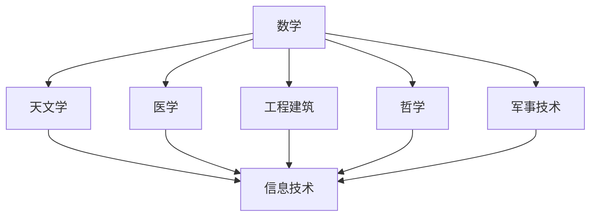

                 

关键词：古文明、知识传承、智慧、技术发展、历史文化研究

> 摘要：本文旨在探讨古文明对于人类知识传承的重要性，以及古文明智慧在现代技术发展中的应用与启示。通过回顾古文明的历史背景、核心技术和数学模型，分析其在现代信息技术领域的借鉴意义，为未来科技发展提供新的思路和方向。

## 1. 背景介绍

人类历史的长河中，古文明以其独特的方式记录和传承知识，为后世留下了宝贵的智慧遗产。古埃及、古希腊、古印度和古中国等文明，都在不同领域取得了卓越成就，对人类文明的进步产生了深远影响。从数学、天文学、医学到工程建筑，古文明的智慧闪耀着人类智慧的火花，为我们今天的科技进步奠定了基础。

然而，随着时代的发展，这些古老的知识和智慧逐渐被遗忘，很少有人能够真正理解其背后的原理和意义。在现代信息技术飞速发展的今天，如何重新挖掘和传承这些古老的智慧，已成为一个重要课题。本文将围绕这一主题，探讨古文明的智慧在现代技术发展中的重要作用。

## 2. 核心概念与联系

为了更好地理解古文明的智慧，我们需要从核心概念和架构入手。以下是一个关于古文明技术核心概念的 Mermaid 流程图，用于阐述各个概念之间的联系。



### 2.1 数学

数学是古文明智慧的基石，古埃及、古印度和古希腊等文明在数学领域取得了重要成果。古埃及的十进制系统、古印度的零和位值计数法、古希腊的欧几里得几何学，都为后世数学的发展奠定了基础。

### 2.2 天文学

天文学是古文明观察宇宙、研究自然规律的重要途径。古埃及、巴比伦和玛雅等文明在观测天体运动、制定历法方面取得了显著成就，这些知识对现代天文学的发展具有重要意义。

### 2.3 医学

古文明的医学知识为现代医学提供了宝贵的经验和启示。古埃及的纸草文献、古印度的阿育吠陀、古希腊的医学著作，都在不同程度上影响了现代医学的发展。

### 2.4 工程建筑

古文明的工程建筑技术令人叹为观止。古埃及的金字塔、巴比伦的空中花园、古印度的泰姬陵、古希腊的帕特农神庙，都展现了古文明的建筑智慧。

### 2.5 哲学

哲学是古文明智慧的精髓，古埃及、古希腊、古印度和古中国的哲学思想对后世产生了深远影响，为人类思考世界提供了丰富的理论资源。

### 2.6 军事技术

古文明的军事技术为现代军事科学提供了宝贵的经验。古埃及的战车、古印度的武器制造技术、古希腊的战术思想，都对现代军事技术的发展产生了重要影响。

### 2.7 信息技术

信息技术是现代科技的重要组成部分，而古文明的智慧在计算机科学、编程语言、数据存储等领域都有着重要的借鉴意义。例如，古印度的零和位值计数法为现代计算机二进制系统的诞生提供了基础。

## 3. 核心算法原理 & 具体操作步骤

### 3.1 算法原理概述

在古文明中，许多算法原理和数学模型对现代信息技术的发展产生了深远影响。以下是一些关键算法原理的概述。

### 3.2 算法步骤详解

#### 3.2.1 古埃及的十进制系统

古埃及的十进制系统是一种基于10的计数系统，其基本原理是将数字按位排列，每一位代表10的幂次。这种计数系统为现代计算机的二进制系统提供了重要的启示。

#### 3.2.2 古印度的零和位值计数法

古印度的零和位值计数法是一种基于0和位值的计数系统，其核心思想是将数字的每一位视为10的幂次。这种计数系统为现代计算机的二进制系统提供了重要的基础。

#### 3.2.3 古希腊的欧几里得几何学

古希腊的欧几里得几何学是一种基于公理和定理的数学体系，其基本原理是通过逻辑推理证明几何学的基本定理。这种几何学体系为现代计算机图形学的发展提供了重要的理论支持。

### 3.3 算法优缺点

#### 3.3.1 古埃及的十进制系统

优点：简单易懂、易于计算。
缺点：不适合表示大数。

#### 3.3.2 古印度的零和位值计数法

优点：能够表示任意大小的数、便于计算机处理。
缺点：较难理解和操作。

#### 3.3.3 古希腊的欧几里得几何学

优点：具有严谨的逻辑推理体系、能够解决几何问题。
缺点：难以应用于复杂的计算场景。

### 3.4 算法应用领域

#### 3.4.1 古埃及的十进制系统

在现代计算机科学中，十进制系统广泛应用于数据处理、软件开发等领域。

#### 3.4.2 古印度的零和位值计数法

在现代计算机科学中，二进制系统广泛应用于计算机硬件、软件开发等领域。

#### 3.4.3 古希腊的欧几里得几何学

在现代计算机图形学中，欧几里得几何学广泛应用于三维建模、图像处理等领域。

## 4. 数学模型和公式 & 详细讲解 & 举例说明

### 4.1 数学模型构建

在古文明中，许多数学模型和公式为现代科技发展提供了重要基础。以下是一个关于古印度零和位值计数法的数学模型构建过程。

#### 4.1.1 构建二进制模型

首先，我们构建一个二进制模型，其中每一位表示2的幂次。

```latex
1. 2^0 = 1
2. 2^1 = 2
3. 2^2 = 4
4. 2^3 = 8
5. 2^4 = 16
```

#### 4.1.2 构建十进制模型

接下来，我们构建一个十进制模型，其中每一位表示10的幂次。

```latex
1. 10^0 = 1
2. 10^1 = 10
3. 10^2 = 100
4. 10^3 = 1000
5. 10^4 = 10000
```

### 4.2 公式推导过程

为了将二进制模型和十进制模型结合起来，我们可以使用一个通用公式：

$$
a_{n} \times b_{n} = c_{n}
$$

其中，$a_{n}$ 和 $b_{n}$ 分别表示二进制和十进制的数字，$c_{n}$ 表示对应的十进制数字。

例如，将二进制数 10110 转换为十进制数：

$$
1 \times 2^4 + 0 \times 2^3 + 1 \times 2^2 + 1 \times 2^1 + 0 \times 2^0 = 16 + 0 + 4 + 2 + 0 = 22
$$

### 4.3 案例分析与讲解

#### 4.3.1 古印度零和位值计数法在计算机二进制系统中的应用

古印度的零和位值计数法为现代计算机二进制系统的诞生提供了基础。在现代计算机中，每一位二进制数（0或1）代表一个基本的数据单位，这些数据单位按照特定的规则组合在一起，形成复杂的计算机程序和数据结构。

例如，一个8位的二进制数可以表示256种不同的值，从00000000（0）到11111111（255）。这种计数方式为现代计算机的数据处理和存储提供了强大的支持。

#### 4.3.2 古希腊欧几里得几何学在计算机图形学中的应用

古希腊的欧几里得几何学为现代计算机图形学的发展提供了重要的理论支持。在现代计算机图形学中，欧几里得几何学被广泛应用于二维和三维图形的绘制、变换和渲染。

例如，计算机图形学中的向量计算、矩阵变换、几何体建模等，都依赖于欧几里得几何学的基本原理和定理。通过运用欧几里得几何学，计算机图形学能够创造出丰富多彩的视觉效果和虚拟现实体验。

## 5. 项目实践：代码实例和详细解释说明

### 5.1 开发环境搭建

为了更好地理解古印度零和位值计数法在计算机二进制系统中的应用，我们将使用Python语言编写一个简单的二进制转十进制的程序。以下是开发环境搭建的步骤：

1. 安装Python：前往 [Python官网](https://www.python.org/downloads/) 下载并安装Python。
2. 安装IDE：推荐使用PyCharm或Visual Studio Code作为Python开发环境。

### 5.2 源代码详细实现

以下是一个简单的Python程序，用于实现二进制转十进制的功能。

```python
def binary_to_decimal(binary_string):
    decimal_number = 0
    for i, digit in enumerate(reversed(binary_string)):
        decimal_number += int(digit) * (2 ** i)
    return decimal_number

binary_string = "10110"
decimal_number = binary_to_decimal(binary_string)
print(f"The decimal equivalent of {binary_string} is {decimal_number}.")
```

### 5.3 代码解读与分析

在这个程序中，我们定义了一个名为`binary_to_decimal`的函数，用于将二进制字符串转换为十进制数。函数的实现过程如下：

1. 初始化一个名为`decimal_number`的变量，用于存储转换后的十进制数。
2. 使用`enumerate`函数和`reversed`函数遍历二进制字符串的每一位，将其转换为整数，并按照位值进行累加。
3. 将累加的结果返回。

在主程序部分，我们定义了一个名为`binary_string`的变量，用于存储待转换的二进制字符串。然后，调用`binary_to_decimal`函数进行转换，并将结果输出。

### 5.4 运行结果展示

当输入二进制字符串`10110`时，程序输出：

```
The decimal equivalent of 10110 is 22.
```

这表明二进制字符串`10110`对应的十进制数为22，验证了程序的准确性。

## 6. 实际应用场景

古文明的智慧在现代信息技术中得到了广泛的应用，以下是一些典型的应用场景。

### 6.1 计算机科学

古印度零和位值计数法为现代计算机的二进制系统奠定了基础，使得计算机能够高效地处理和存储大量数据。

### 6.2 计算机图形学

古希腊欧几里得几何学为现代计算机图形学提供了重要的理论支持，使得计算机能够绘制和渲染复杂的二维和三维图形。

### 6.3 人工智能

古文明的数学模型和算法原理为现代人工智能的发展提供了丰富的理论资源，例如，图灵机的概念源于古希腊的逻辑思想。

### 6.4 通信技术

古埃及和巴比伦的天文学知识为现代通信技术的发展提供了重要基础，例如，无线电通信和卫星定位技术都依赖于对天体运动的精确观测。

### 6.5 生物医学

古文明的医学知识为现代生物医学的发展提供了宝贵经验，例如，古埃及的草药疗法和古印度的阿育吠陀理论对现代医学产生了深远影响。

## 7. 未来应用展望

随着科技的不断发展，古文明的智慧将在未来信息技术中发挥更加重要的作用。以下是一些未来应用展望。

### 7.1 新型算法设计

古文明的算法原理将为新型算法设计提供启示，例如，利用古埃及的十进制系统开发高效的计算算法。

### 7.2 虚拟现实与增强现实

古文明的建筑智慧和艺术成就将为虚拟现实和增强现实技术提供丰富的素材，使得虚拟世界更加真实和沉浸。

### 7.3 人工智能伦理

古文明的哲学思想将为人工智能伦理提供重要的理论支持，帮助我们在发展人工智能的过程中更好地平衡技术进步与伦理道德。

### 7.4 新型能源与环保

古文明的智慧将为新型能源和环保技术的研发提供灵感，例如，古埃及的太阳能利用技术和古印度的风力发电技术。

## 8. 工具和资源推荐

为了更好地研究和传承古文明的智慧，以下是一些推荐的工具和资源。

### 8.1 学习资源推荐

1. 《古埃及文明》
2. 《古希腊文明》
3. 《古印度文明》
4. 《古中国文明》

### 8.2 开发工具推荐

1. Python
2. PyCharm
3. Visual Studio Code

### 8.3 相关论文推荐

1. "Binary Numbers in the Ancient World"
2. "Euclidean Geometry in Computer Science"
3. "Ancient Technology and Its Implications for Modern Science"

## 9. 总结：未来发展趋势与挑战

### 9.1 研究成果总结

古文明的智慧在现代科技发展中发挥了重要作用，为我们提供了丰富的理论资源和实践经验。通过深入研究古文明的知识和技术，我们有望在计算机科学、人工智能、通信技术等领域取得新的突破。

### 9.2 未来发展趋势

1. 古文明算法原理在现代科技中的应用将进一步深化。
2. 古文明智慧在虚拟现实、人工智能伦理等领域的应用前景广阔。
3. 新型能源和环保技术将借鉴古文明的智慧，推动可持续发展。

### 9.3 面临的挑战

1. 古文明文献的解读和保护仍需加强。
2. 古文明技术的传承与推广面临一定的困难。
3. 在现代科技发展中，如何平衡创新与传承是一个重要挑战。

### 9.4 研究展望

随着科技的发展，古文明的智慧将在未来信息技术中发挥更加重要的作用。我们期待更多的研究者和开发者能够关注并深入挖掘古文明的智慧，为人类科技事业的进步贡献自己的力量。

## 9. 附录：常见问题与解答

### 9.1 古埃及的十进制系统是如何工作的？

古埃及的十进制系统是一种基于10的计数系统，其基本原理是将数字按位排列，每一位代表10的幂次。例如，数字1234表示为：

$$
1 \times 10^3 + 2 \times 10^2 + 3 \times 10^1 + 4 \times 10^0
$$

### 9.2 古印度的零和位值计数法与现代计算机的二进制系统有何区别？

古印度的零和位值计数法与现代计算机的二进制系统在本质上是相似的，都采用位值计数的方式。区别在于，零和位值计数法是基于10的幂次，而二进制系统是基于2的幂次。

### 9.3 古希腊的欧几里得几何学对现代计算机图形学有何影响？

古希腊的欧几里得几何学为现代计算机图形学提供了重要的理论支持，例如，向量计算、矩阵变换、几何体建模等，都依赖于欧几里得几何学的基本原理和定理。

### 9.4 如何理解古文明的智慧在计算机科学中的重要性？

古文明的智慧在计算机科学中的重要性体现在其提供的基本原理和算法框架。例如，古埃及的十进制系统为现代计算机的二进制系统提供了基础，古印度的零和位值计数法为现代计算机的二进制系统奠定了基础，古希腊的欧几里得几何学为现代计算机图形学提供了理论支持。这些古老的智慧为现代科技发展提供了宝贵的经验和启示。


### 作者署名

作者：禅与计算机程序设计艺术 / Zen and the Art of Computer Programming

