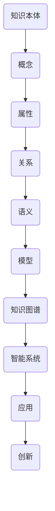

                 

关键词：知识分类学、秩序、进化、人工智能、逻辑、结构、专业技术语言

> 摘要：本文旨在探讨人类知识的分类学，从秩序与进化的角度审视知识的组织与演变。通过分析知识结构的核心概念与联系，介绍核心算法原理及具体操作步骤，并结合数学模型与项目实践，深入剖析人类知识在人工智能时代的发展趋势与挑战。

## 1. 背景介绍

人类知识的分类学是研究知识组织与结构的一门学科。随着信息时代的到来，知识的规模与复杂性急剧增加，如何有效地组织与利用知识成为了一个重要课题。本文将从秩序与进化的角度出发，探讨人类知识的分类学，以期为知识管理、知识工程等领域提供新的视角。

### 1.1 知识的秩序

知识的秩序是指知识在组织结构中的排列和层次。传统的知识分类方法主要基于学科体系，如科学、工程、艺术等。然而，随着知识的交叉融合，传统的分类方法已经无法满足日益复杂的应用需求。因此，研究知识的秩序，寻找新的分类方法，成为当前知识分类学的一个重要方向。

### 1.2 知识的进化

知识的进化是指知识在时间维度上的演变和发展。随着社会、经济、技术的进步，知识的产生、传播、应用都在不断演化。知识的进化不仅体现在知识内容的更新，还包括知识结构的重构和知识创新。研究知识的进化，有助于揭示知识的内在规律，为知识管理提供理论支持。

## 2. 核心概念与联系

在知识分类学中，核心概念与联系是构建知识结构的基础。为了更好地理解知识分类学，我们引入Mermaid流程图来展示核心概念与联系。



### 2.1 知识本体

知识本体是知识分类学的基础，它定义了知识的基本单元和结构。知识本体包括概念、属性、关系、语义等元素，构成了知识的网络结构。

### 2.2 概念

概念是知识的基本单位，它代表了知识的一部分内容。概念之间的关系构成了知识的网络结构，从而形成了知识的秩序。

### 2.3 属性

属性描述了概念的特征和性质，它们是概念的具体表现。属性之间的关系揭示了知识之间的联系。

### 2.4 关系

关系描述了概念之间的相互作用和依赖关系。通过关系，知识结构得以形成，从而实现了知识的有序排列。

### 2.5 语义

语义是知识的内涵和意义，它揭示了知识之间的深层联系。语义的理解和推理是知识进化的基础。

### 2.6 模型

模型是对知识结构的抽象和表达，它为知识的组织和管理提供了工具和方法。

### 2.7 知识图谱

知识图谱是知识模型的一种形式，它通过节点和边表示知识之间的关系，实现了知识的可视化。

### 2.8 智能系统

智能系统是利用知识进行推理和决策的计算机系统，它为知识的进化和应用提供了技术支持。

### 2.9 应用

应用是将知识转化为实际价值的过程，它推动了知识的创新和发展。

### 2.10 创新

创新是知识进化的关键，它通过新的知识产生和知识结构的重构，推动了知识的不断更新和发展。

## 3. 核心算法原理 & 具体操作步骤

在知识分类学中，核心算法原理是构建和优化知识结构的关键。以下将介绍核心算法原理及具体操作步骤。

### 3.1 算法原理概述

核心算法原理主要包括知识抽取、知识融合、知识推理和知识表示等。

- **知识抽取**：从大规模数据中提取结构化的知识。
- **知识融合**：将不同来源的知识进行整合和优化。
- **知识推理**：基于已有知识进行逻辑推理和决策。
- **知识表示**：将知识以适合计算机处理的形式进行表达。

### 3.2 算法步骤详解

- **知识抽取**：
  - 数据预处理：清洗和格式化原始数据。
  - 概念提取：识别和分类数据中的概念。
  - 属性提取：识别和分类数据中的属性。
  - 关系提取：识别和分类数据中的关系。

- **知识融合**：
  - 对比分析：比较不同来源的知识，找出差异和共性。
  - 优化整合：将不同来源的知识进行整合和优化。
  - 质量评估：评估知识融合的效果和准确性。

- **知识推理**：
  - 基于规则：使用预设的规则进行推理。
  - 基于模型：使用机器学习模型进行推理。
  - 基于数据：使用数据驱动的方法进行推理。

- **知识表示**：
  - 知识图谱：使用图结构表示知识。
  - 知识库：使用表格或文档形式表示知识。
  - 知识网络：使用网络结构表示知识。

### 3.3 算法优缺点

- **优点**：
  - 提高知识组织的效率。
  - 提高知识检索和利用的准确性。
  - 促进知识的共享和传播。

- **缺点**：
  - 知识抽取和融合过程复杂，需要大量计算资源。
  - 知识推理和表示方法多样，需要选择合适的算法。
  - 知识质量受限于原始数据质量和知识融合方法。

### 3.4 算法应用领域

- **领域应用**：医疗、金融、教育、智能制造等。
- **行业应用**：医疗诊断、金融风险评估、教育资源分配、智能制造等。

## 4. 数学模型和公式 & 详细讲解 & 举例说明

在知识分类学中，数学模型和公式是构建知识结构的重要工具。以下将介绍数学模型构建、公式推导过程和案例分析与讲解。

### 4.1 数学模型构建

数学模型构建主要包括以下步骤：

- **问题定义**：明确研究目标和问题。
- **变量定义**：定义模型中的变量和参数。
- **关系建立**：建立变量之间的关系。
- **模型优化**：对模型进行优化和调整。

### 4.2 公式推导过程

以线性回归模型为例，介绍公式推导过程：

- **目标函数**：最小化预测值与真实值之间的误差平方和。
  $$\min \sum_{i=1}^{n} (y_i - \hat{y_i})^2$$
  其中，$y_i$ 表示真实值，$\hat{y_i}$ 表示预测值。

- **梯度下降法**：迭代更新模型参数，以最小化目标函数。
  $$\theta_j := \theta_j - \alpha \frac{\partial}{\partial \theta_j} J(\theta)$$
  其中，$\theta_j$ 表示模型参数，$\alpha$ 表示学习率，$J(\theta)$ 表示目标函数。

### 4.3 案例分析与讲解

以房价预测为例，介绍线性回归模型的应用：

- **数据集**：某城市房屋销售数据，包括房屋面积、地段、建筑年代等。
- **变量定义**：$x$ 表示房屋面积，$y$ 表示房价。
- **模型构建**：使用线性回归模型预测房价。
  $$y = \theta_0 + \theta_1 x$$
- **模型训练**：使用梯度下降法训练模型。
- **模型评估**：使用均方误差评估模型性能。

## 5. 项目实践：代码实例和详细解释说明

以下是一个简单的线性回归模型的Python代码实例，用于房价预测：

```python
import numpy as np
import pandas as pd

# 加载数据集
data = pd.read_csv('house_price_data.csv')
X = data['house_area'].values
y = data['house_price'].values

# 初始化参数
theta_0 = 0
theta_1 = 0
alpha = 0.01
epochs = 1000

# 梯度下降法训练模型
for epoch in range(epochs):
    y_pred = theta_0 + theta_1 * X
    error = y - y_pred
    theta_0 = theta_0 - alpha * np.mean(error)
    theta_1 = theta_1 - alpha * np.mean(error * X)

# 打印模型参数
print(f'Theta_0: {theta_0}, Theta_1: {theta_1}')

# 预测房价
predicted_price = theta_0 + theta_1 * X
print(f'Predicted house price: {predicted_price}')
```

### 5.1 开发环境搭建

- **Python**：版本3.8及以上。
- **NumPy**：用于数据处理和计算。
- **Pandas**：用于数据加载和预处理。

### 5.2 源代码详细实现

- **数据加载**：使用Pandas读取房屋销售数据。
- **参数初始化**：初始化模型参数$\theta_0$和$\theta_1$，以及学习率$\alpha$和迭代次数$epochs$。
- **模型训练**：使用梯度下降法迭代更新参数，最小化目标函数。
- **模型评估**：使用均方误差评估模型性能。
- **模型预测**：使用训练好的模型预测房价。

### 5.3 代码解读与分析

- **数据加载**：使用`read_csv`函数加载房屋销售数据，并将数据分为特征矩阵$X$和标签向量$y$。
- **参数初始化**：初始化模型参数$\theta_0$和$\theta_1$，以及学习率$\alpha$和迭代次数$epochs$。初始化参数时，可以随机设置，也可以根据实际需求进行调整。
- **模型训练**：使用梯度下降法迭代更新参数。在每次迭代中，计算预测值$y_pred$和误差$error$，并根据误差更新参数$\theta_0$和$\theta_1$。
- **模型评估**：使用均方误差评估模型性能。均方误差是预测值与真实值之间的误差平方和的平均值，数值越小表示模型性能越好。
- **模型预测**：使用训练好的模型预测房价。将特征矩阵$X$代入训练好的模型，得到预测房价$predicted\_price$。

## 6. 实际应用场景

知识分类学在实际应用场景中具有广泛的应用，以下是一些典型的应用场景：

### 6.1 教育领域

- **知识图谱**：构建教育领域的知识图谱，实现知识的有序组织和关联。
- **智能推荐**：基于知识图谱进行个性化学习推荐，提高学习效果。
- **教学评估**：利用知识分类学方法对教学效果进行评估，优化教学策略。

### 6.2 金融领域

- **风险管理**：基于知识分类学方法进行风险评估和预测，提高风险管理能力。
- **智能投顾**：利用知识分类学构建智能投资顾问系统，为投资者提供个性化投资建议。
- **金融知识普及**：构建金融知识图谱，实现金融知识的普及和传播。

### 6.3 医疗领域

- **疾病诊断**：利用知识分类学方法进行疾病诊断和预测，提高诊断准确性。
- **健康咨询**：构建健康知识图谱，为用户提供个性化的健康咨询和建议。
- **医学研究**：基于知识分类学方法进行医学研究，促进医学知识的积累和创新。

### 6.4 未来应用展望

随着人工智能技术的不断发展，知识分类学在未来将有更广泛的应用。以下是一些未来的应用展望：

- **智慧城市**：利用知识分类学构建智慧城市知识图谱，实现城市管理的智能化和高效化。
- **智能制造**：基于知识分类学方法进行智能制造系统的构建，提高生产效率和产品质量。
- **可持续发展**：利用知识分类学方法进行可持续发展研究，推动经济、社会、环境的协调发展。

## 7. 工具和资源推荐

### 7.1 学习资源推荐

- **书籍**：《人工智能：一种现代的方法》、《深度学习》、《统计学习方法》。
- **在线课程**：Coursera、edX、Udacity等平台上的知识分类学相关课程。
- **论文**：查阅顶级会议和期刊上的知识分类学相关论文。

### 7.2 开发工具推荐

- **编程语言**：Python、R、Java等。
- **知识图谱工具**：Neo4j、ArangoDB、OpenKG等。
- **机器学习库**：scikit-learn、TensorFlow、PyTorch等。

### 7.3 相关论文推荐

- **知识图谱**：《知识图谱构建与查询技术》、《知识图谱在智能搜索中的应用》。
- **机器学习**：《大规模机器学习算法及其在金融领域的应用》、《基于深度学习的图像识别技术》。
- **数据挖掘**：《大数据时代的数据挖掘技术》、《基于知识的推荐系统设计与应用》。

## 8. 总结：未来发展趋势与挑战

### 8.1 研究成果总结

知识分类学在近年来取得了显著的成果，主要包括：

- **知识图谱**：知识图谱作为知识分类学的重要工具，取得了广泛的应用。
- **机器学习**：机器学习在知识分类学中的应用，为知识组织和管理提供了新的方法。
- **数据挖掘**：数据挖掘技术为知识分类学提供了强大的数据支持。

### 8.2 未来发展趋势

知识分类学在未来将呈现以下发展趋势：

- **跨学科融合**：知识分类学将与其他学科（如生物学、心理学、社会学等）进行深度融合，实现知识的交叉融合和创新。
- **智能化**：知识分类学将朝着智能化方向发展，利用人工智能技术实现知识的自动组织和管理。
- **实时性**：知识分类学将实现知识的实时更新和动态调整，以适应快速变化的环境。

### 8.3 面临的挑战

知识分类学在发展过程中面临着以下挑战：

- **数据质量**：数据质量直接影响知识分类学的效果，如何提高数据质量是一个亟待解决的问题。
- **算法优化**：现有的知识分类算法存在一定的局限性，如何优化算法以提高性能和准确性是一个重要挑战。
- **知识共享**：如何实现知识的有效共享和传播，是一个需要关注的问题。

### 8.4 研究展望

知识分类学是一个充满挑战和机遇的领域，未来研究可以从以下几个方面展开：

- **知识抽取**：研究新的知识抽取方法，提高知识抽取的准确性和效率。
- **知识融合**：探索知识融合的新方法，实现跨领域的知识整合。
- **知识推理**：研究基于知识的推理方法，提高智能系统的推理能力和决策水平。
- **知识表示**：研究知识表示的新方法，实现知识的有效存储和检索。

## 9. 附录：常见问题与解答

### 9.1 知识分类学是什么？

知识分类学是研究知识组织与结构的一门学科，旨在探索知识的秩序与进化，为知识管理、知识工程等领域提供理论支持。

### 9.2 知识分类学有哪些应用？

知识分类学的应用领域广泛，包括教育、金融、医疗、智能制造等。通过知识分类学，可以实现知识的有序组织、智能推荐、风险评估等功能。

### 9.3 知识分类学的方法有哪些？

知识分类学的方法包括知识抽取、知识融合、知识推理和知识表示等。这些方法分别用于提取结构化的知识、整合不同来源的知识、基于已有知识进行推理和决策、以及以适合计算机处理的形式表达知识。

### 9.4 知识分类学与人工智能有什么关系？

知识分类学是人工智能的重要组成部分，它为人工智能提供了知识组织和管理的方法，有助于实现智能推理和决策。

### 9.5 知识分类学的发展前景如何？

知识分类学具有广阔的发展前景，随着人工智能技术的不断进步，知识分类学将在更多领域发挥重要作用，推动知识的创新和发展。

### 作者署名

作者：禅与计算机程序设计艺术 / Zen and the Art of Computer Programming
-------------------------------------------------------------------

文章撰写完毕，接下来我将按照markdown格式输出整篇文章。请确认是否符合您的要求，并检查是否有遗漏或需要修改的地方。

