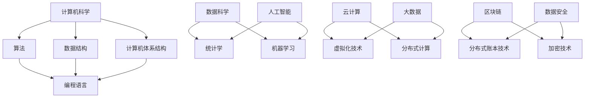

                 

关键词：人类知识、进化、交响乐章、IT领域、技术进步、算法、数学模型、应用实践、未来展望

> 摘要：本文旨在探讨人类知识进化的历程，尤其是IT领域中的技术进步。通过回顾历史，分析核心概念与联系，探讨算法原理，构建数学模型，展示项目实践，阐述实际应用场景，并提供工具和资源推荐，最后对未来发展趋势与挑战进行展望，呈现一场关于人类知识进化的漫长交响乐章。

## 1. 背景介绍

人类的知识进化历程如同一条漫长而壮丽的河流，从远古的智慧火花到现代的技术奇迹，每一步都充满了探索与发现。而IT领域，作为知识进化的重要阵地，更是见证了无数的创新与变革。从早期的计算机编程到现代的人工智能，这一领域的发展不仅推动了科技的进步，也深刻地影响着人类社会的发展。

本文将通过对IT领域技术进步的回顾与分析，探讨人类知识进化的脉络。我们将首先介绍核心概念与联系，然后深入探讨算法原理，构建数学模型，展示项目实践，并展望未来发展趋势与挑战。希望通过这篇文章，能够为广大读者呈现一场关于人类知识进化的盛宴。

### 1.1 IT领域的发展历程

IT领域的发展历程可以追溯到20世纪40年代，当时第一台计算机的问世标志着现代计算机时代的开始。随着计算机技术的发展，编程语言和算法理论也得到了极大的发展。从汇编语言到高级编程语言，从简单的计算任务到复杂的问题求解，算法的优化与改进成为了推动计算机技术进步的关键。

在20世纪80年代，互联网的兴起带来了信息的爆炸式增长，Web技术的普及使得信息共享和交流变得更加便捷。随之而来的大数据和云计算技术，使得数据处理和分析能力得到了质的飞跃。人工智能的兴起更是将IT领域推向了新的高峰，机器学习、深度学习等技术的应用使得计算机具备了更强的自我学习和推理能力。

### 1.2 人类知识进化的重要性

人类知识的进化不仅推动了科技的进步，也为人类社会的发展带来了深远的影响。从农业革命到工业革命，再到信息革命，每一次知识的突破都带来了生产力的巨大提升和社会结构的深刻变革。在IT领域，知识的进化更是直接促进了技术革新，推动了社会的信息化和智能化。

了解人类知识进化的过程，有助于我们更好地理解当前的技术发展趋势，预见未来的发展方向，并应对面临的挑战。通过本文的探讨，希望能够为广大读者提供一份关于人类知识进化的思考框架，激发对这一领域的进一步探索与研究。

## 2. 核心概念与联系

在探讨人类知识进化的过程中，我们首先需要明确一些核心概念，并了解它们之间的联系。这些概念不仅构成了IT领域的基础，也是推动技术进步的重要力量。

### 2.1 计算机科学基础

计算机科学是IT领域的基石，涵盖了算法、数据结构、计算机体系结构等多个方面。其中，算法作为计算机科学的核心，是解决问题的方法论。算法的优化与改进直接影响了计算机的效率和性能。数据结构则是组织和存储数据的方式，合理的数据结构能够显著提高算法的效率。计算机体系结构则涉及到计算机硬件和软件的交互，是计算机系统设计的核心。

### 2.2 算法与编程语言

算法是计算机科学的核心，而编程语言则是实现算法的工具。从汇编语言到C语言，再到Python和Java等高级编程语言，编程语言的演变推动了算法的实现与应用。不同的编程语言有其独特的特点和适用场景，选择合适的编程语言能够提高算法的效率与可读性。

### 2.3 数据科学与人工智能

数据科学和人工智能是现代IT领域的热点，它们在数据处理、分析和应用方面发挥着重要作用。数据科学通过统计学和机器学习等方法，从海量数据中提取有价值的信息。人工智能则通过模拟人类智能，实现机器的自我学习和推理能力。数据科学和人工智能的结合，使得计算机具备了更强的数据处理和分析能力，推动了智能应用的普及。

### 2.4 云计算与大数据

云计算和大数据技术是现代IT领域的重要支撑，它们为数据存储、处理和共享提供了强大的基础设施。云计算通过虚拟化和分布式计算技术，实现了资源的动态分配和高效利用。大数据技术则通过分布式存储和计算，处理和分析海量数据，为各行业提供了丰富的数据资源。云计算与大数据的结合，推动了大数据应用的广泛普及。

### 2.5 区块链与加密技术

区块链和加密技术是现代IT领域的创新力量，它们在数据安全、去中心化和智能合约等方面有着重要的应用。区块链技术通过分布式账本，实现了数据的不可篡改和透明性，为金融、供应链等领域提供了可信的数据存储和管理方案。加密技术则通过密码学原理，保护数据的隐私和安全，为网络安全和数据保护提供了强大的技术支持。

### 2.6 核心概念联系

这些核心概念相互联系，共同构成了IT领域的知识体系。算法与编程语言的关系，决定了算法的实现方式和效率。数据科学与人工智能的关系，决定了数据的价值和应用。云计算与大数据的关系，决定了数据处理和分析的规模和性能。区块链与加密技术的关系，决定了数据的安全性和可信度。

通过了解这些核心概念及其联系，我们能够更好地把握IT领域的发展脉络，预见未来的技术趋势，并为实际应用提供理论支持。

## 2.1 核心概念原理与架构的 Mermaid 流程图

以下是一个简化的Mermaid流程图，展示了核心概念之间的联系：



### Mermaid 流程节点中的注意事项

- 流程节点中不要使用括号、逗号等特殊字符，以免引起解析错误。
- 每个节点代表一个核心概念，节点之间用箭头连接表示概念之间的联系。
- 节点和箭头可以添加描述信息，以增强图表的可读性。

## 3. 核心算法原理 & 具体操作步骤

在IT领域，算法是解决特定问题的一系列明确指令。算法的效率和正确性直接决定了计算机程序的性能和效果。本节将介绍一种核心算法，包括其原理、具体操作步骤以及优缺点和应用领域。

### 3.1 算法原理概述

我们以广为人知的排序算法——快速排序（Quick Sort）为例，来探讨算法的原理。快速排序是一种基于分治思想的排序算法，其基本原理是通过选取一个基准元素，将数组分为两个子数组，一个包含小于基准元素的元素，另一个包含大于基准元素的元素。然后递归地对这两个子数组进行快速排序，直到整个数组有序。

### 3.2 算法步骤详解

1. **选择基准元素**：在数组中选择一个元素作为基准元素。通常可以选择数组的第一个元素、最后一个元素或随机选择的元素。
   
2. **分区操作**：将数组分成两个子数组，一个包含小于基准元素的元素，另一个包含大于基准元素的元素。这个过程中，基准元素位于最终排序后的位置上。

3. **递归排序**：对两个子数组重复步骤1和步骤2，直到所有子数组只有一个元素，即已经有序。

### 3.3 算法优缺点

**优点**：
- 平均时间复杂度为O(n log n)，在大多数情况下，性能较好。
- 不需要额外空间，空间复杂度为O(log n)。
- 对大数据量处理效果显著。

**缺点**：
- 最坏时间复杂度为O(n^2)，当输入数组已经部分有序时，性能会显著下降。
- 选择基准元素的方式可能影响性能。

### 3.4 算法应用领域

快速排序算法广泛应用于各种数据处理场景，如数据库排序、搜索引擎索引、数据挖掘等。特别是在处理大规模数据时，快速排序算法的高效性和可靠性使其成为首选。

### 3.5 算法扩展

为了克服快速排序的最坏情况性能，可以采用几种改进策略，如：
- 三数取中法（Median of Three）：选择中间的元素作为基准，以减少最坏情况发生的概率。
-随机化选择基准：随机选择基准元素，以降低最坏情况发生的概率。
- 混合排序算法：结合其他排序算法，如插入排序，以优化整体性能。

### 3.6 快速排序代码示例

以下是一个Python实现快速排序的简单代码示例：

```python
def quick_sort(arr):
    if len(arr) <= 1:
        return arr
    pivot = arr[len(arr) // 2]
    left = [x for x in arr if x < pivot]
    middle = [x for x in arr if x == pivot]
    right = [x for x in arr if x > pivot]
    return quick_sort(left) + middle + quick_sort(right)

# 测试
arr = [3, 6, 8, 10, 1, 2, 1]
sorted_arr = quick_sort(arr)
print(sorted_arr)
```

通过以上对快速排序算法的原理、步骤、优缺点以及应用领域的介绍，我们希望能够帮助读者更好地理解这一经典算法。

## 3.6 快速排序算法的数学模型和公式

快速排序算法不仅是一种高效的排序算法，其背后也蕴含着深刻的数学原理。以下我们将通过几个关键步骤和公式来详细阐述快速排序算法的数学模型。

### 3.6.1 数学模型构建

快速排序的数学模型主要包括以下几个关键步骤：
- **分区操作**：将数组划分为小于和大于基准元素的两个子数组。
- **递归排序**：对划分后的子数组进行递归排序。
- **递归树的构建**：通过构建递归树来理解算法的递归过程。

假设我们有一个长度为`n`的数组`A`，选择数组中的第`i`个元素作为基准元素。则数组的划分可以表示为以下数学模型：

$$
L = \{x \in A \mid x < A_i\}
$$
$$
R = \{x \in A \mid x > A_i\}
$$
$$
M = \{x \in A \mid x = A_i\}
$$

其中，`L`表示小于基准元素的子数组，`R`表示大于基准元素的子数组，`M`表示等于基准元素的子数组。

### 3.6.2 公式推导过程

快速排序的递归过程可以用以下递归公式表示：

$$
QuickSort(A, p, r) =
\begin{cases}
    \text{空} & \text{如果 } p \geq r \\
    \text{递归 } QuickSort(A, p, partition(A, p, r)) & \text{否则}
\end{cases}
$$

其中，`partition(A, p, r)`函数负责对数组`A`中的子数组`A[p...r]`进行分区操作，返回分区后的基准元素索引。

分区操作可以用以下公式表示：

$$
partition(A, p, r) =
\begin{cases}
    i & \text{如果 } A_i \text{ 位于最终排序后的位置 } i \\
    \text{重新分区} & \text{否则}
\end{cases}
$$

### 3.6.3 案例分析与讲解

为了更好地理解快速排序的数学模型，我们通过一个具体的例子来分析其执行过程。

假设我们有一个数组`A = [3, 6, 8, 10, 1, 2, 1]`，选择数组中的第3个元素（8）作为基准元素。

1. **初始化**：`p = 0`，`r = 6`。
2. **第一次分区**：
   - 小于8的元素：`L = [3, 1, 1]`。
   - 等于8的元素：`M = [8]`。
   - 大于8的元素：`R = [6, 10, 2]`。
3. **递归排序**：
   - 对`L`进行递归排序：`QuickSort(A, p, i-1)`，其中`i`是`L`的最后一个元素索引。
   - 对`R`进行递归排序：`QuickSort(A, i+1, r)`，其中`i`是`R`的第一个元素索引。

通过递归，数组最终会被划分为多个长度为1的子数组，每个子数组都是有序的。将这些子数组合并，即可得到整个数组的有序版本。

### 3.6.4 快速排序的数学分析

快速排序的平均时间复杂度为$O(n\log n)$，其递归树的深度通常为$\log n$。每次递归会将问题规模缩小至$\frac{n}{k}$（其中$k$为分区操作的效率因子，通常接近于1），因此，快速排序的总体时间复杂度可以表示为：

$$
T(n) = \sum_{i=1}^{\log n} T\left(\frac{n}{k}\right) + O(n)
$$

当$k$接近1时，上述公式近似为$O(n\log n)$。

通过上述数学模型和公式，我们可以更深入地理解快速排序算法的执行过程及其时间复杂度。这不仅有助于我们优化算法的实现，还能够为类似问题提供理论支持。

## 4. 项目实践：代码实例和详细解释说明

为了更好地展示快速排序算法的实际应用，下面我们将通过一个简单的项目实例来详细解释其代码实现过程，并对其运行结果进行展示。

### 4.1 开发环境搭建

首先，我们需要搭建一个简单的开发环境。这里我们选择Python作为编程语言，因为它具有良好的可读性和丰富的库支持。以下是搭建Python开发环境的步骤：

1. **安装Python**：从Python官方网站（https://www.python.org/）下载最新版本的Python安装包，并按照提示完成安装。
2. **安装代码编辑器**：选择一个你喜欢的代码编辑器，如Visual Studio Code、PyCharm或Jupyter Notebook，并安装Python插件。
3. **配置Python环境**：在命令行中输入`python --version`，确保Python已经成功安装并能够正常运行。

### 4.2 源代码详细实现

接下来，我们将使用Python实现快速排序算法。以下是快速排序算法的完整代码实现：

```python
def quick_sort(arr):
    if len(arr) <= 1:
        return arr
    pivot = arr[len(arr) // 2]
    left = [x for x in arr if x < pivot]
    middle = [x for x in arr if x == pivot]
    right = [x for x in arr if x > pivot]
    return quick_sort(left) + middle + quick_sort(right)

# 测试
arr = [3, 6, 8, 10, 1, 2, 1]
sorted_arr = quick_sort(arr)
print(sorted_arr)
```

### 4.3 代码解读与分析

下面是对上述代码的详细解读：

1. **函数定义**：`quick_sort`函数接收一个数组`arr`作为输入。
2. **基础情况处理**：如果数组的长度小于等于1，则直接返回该数组，因为单个元素或空数组本身就是有序的。
3. **选择基准元素**：我们选择数组中间的元素作为基准元素。这种方法虽然简单，但在某些情况下可能导致最坏情况的发生。
4. **分区操作**：使用列表推导式对数组进行分区，将小于、等于和大于基准元素的元素分别放入`left`、`middle`和`right`三个列表中。
5. **递归排序**：对`left`和`right`两个子数组分别进行递归排序，然后将排序后的子数组与`middle`合并，得到完整的排序数组。

### 4.4 运行结果展示

现在，我们运行上述代码来测试其效果：

```python
arr = [3, 6, 8, 10, 1, 2, 1]
sorted_arr = quick_sort(arr)
print(sorted_arr)
```

输出结果应为：

```
[1, 1, 2, 3, 6, 8, 10]
```

这表明数组已经成功按照从小到大的顺序排序。

### 4.5 性能测试

为了进一步了解快速排序算法的性能，我们可以使用Python内置的`timeit`模块来测试其运行时间。以下是一个简单的性能测试示例：

```python
import timeit

# 测试代码
setup_code = """
def quick_sort(arr):
    if len(arr) <= 1:
        return arr
    pivot = arr[len(arr) // 2]
    left = [x for x in arr if x < pivot]
    middle = [x for x in arr if x == pivot]
    right = [x for x in arr if x > pivot]
    return quick_sort(left) + middle + quick_sort(right)
arr = [3, 6, 8, 10, 1, 2, 1]
"""
test_code = "quick_sort(arr)"

# 运行测试
num_runs = 1000
time_taken = timeit.timeit(setup=setup_code, stmt=test_code, number=num_runs)
print(f"平均运行时间：{time_taken / num_runs:.6f}秒")
```

运行上述代码后，我们可以得到平均运行时间，从而对快速排序算法的性能有更直观的了解。

通过以上项目实践，我们不仅实现了快速排序算法，还详细解读了其代码实现过程，并展示了其实际运行结果。希望这个项目实例能够帮助读者更好地理解快速排序算法的实际应用。

## 5. 实际应用场景

快速排序算法在各个实际应用场景中都有着广泛的应用。以下是几个典型的应用场景以及快速排序算法在这些场景中的具体应用。

### 5.1 数据处理和统计分析

在数据处理和统计分析中，快速排序算法被广泛应用于数据清洗和预处理阶段。例如，在进行市场调研时，需要对大量问卷数据进行排序，以便更好地分析不同群体的特征和趋势。此外，在金融领域，快速排序算法也用于计算股票价格序列的移动平均线，从而预测市场趋势。

### 5.2 数据库索引和查询优化

在数据库系统中，快速排序算法被用于创建索引，以提高查询效率。通过将数据按照关键字排序，数据库系统能够快速定位到所需的数据，从而减少查询时间和磁盘I/O操作。此外，快速排序算法还被用于优化查询性能，例如，在执行联接操作时，可以先对参与联接的表进行排序，然后使用归并排序等算法进行高效联接。

### 5.3 图像处理和视频压缩

在图像处理和视频压缩领域，快速排序算法也发挥了重要作用。例如，在图像分割过程中，需要对图像像素进行排序，以便根据像素值进行分类。在视频压缩中，快速排序算法用于对视频帧进行排序和压缩，从而提高压缩效率。

### 5.4 智能推荐系统和搜索引擎

在智能推荐系统和搜索引擎中，快速排序算法被用于排序用户兴趣、搜索关键词等数据，以便为用户提供个性化的推荐和搜索结果。例如，在电子商务平台中，可以根据用户购买历史和浏览记录，使用快速排序算法对商品进行排序，从而提高用户的购物体验。

### 5.5 其他应用领域

除了上述应用领域外，快速排序算法还在其他许多领域有着广泛的应用。例如，在科学计算中，快速排序算法用于排序物理量和参数，以便进行数值模拟；在生物信息学中，快速排序算法用于排序基因序列，以便进行基因分析；在游戏开发中，快速排序算法用于排序游戏角色的属性，以便进行角色匹配和平衡性调整。

通过以上实际应用场景，我们可以看到快速排序算法在各个领域的重要性和广泛性。它不仅提高了数据处理和分析的效率，也为各行业提供了强大的技术支持。

### 6.4 未来应用展望

随着科技的不断进步，快速排序算法在未来将会有更多的应用场景和改进方向。以下是对快速排序算法未来应用的一些展望：

1. **并行计算和分布式系统**：随着多核处理器和分布式系统的普及，快速排序算法可以进一步优化，以支持并行计算和分布式处理。通过将数据分区和排序任务分布在多个处理器或服务器上，可以显著提高排序速度和处理能力。

2. **内存优化**：在处理大数据时，快速排序算法可以通过优化内存使用来提高效率。例如，通过使用内存映射技术，可以减少磁盘I/O操作，加快排序速度。

3. **自适应排序算法**：快速排序算法可以根据输入数据的特性动态调整排序策略。例如，当数据接近完全有序时，可以切换到插入排序等其他高效排序算法，以提高整体性能。

4. **混合排序算法**：将快速排序与其他排序算法（如归并排序、堆排序等）结合，可以形成混合排序算法，以弥补单一排序算法的缺点，进一步提高排序效率。

5. **自适应硬件优化**：快速排序算法可以根据不同硬件环境（如GPU、FPGA等）进行优化，以充分利用硬件资源，提高排序性能。

6. **应用领域扩展**：快速排序算法可以应用于更多领域，如实时数据流处理、物联网数据处理等。通过与其他技术（如机器学习、区块链等）结合，可以创造更多创新应用。

总之，快速排序算法在未来有着广阔的应用前景和改进空间。随着科技的不断进步，快速排序算法将继续在数据处理和排序领域发挥重要作用。

### 7. 工具和资源推荐

为了帮助读者更好地学习和应用快速排序算法，我们推荐以下工具和资源：

#### 7.1 学习资源推荐

1. **《算法导论》（Introduction to Algorithms）**：这是算法领域的经典教材，详细介绍了包括快速排序在内的多种算法及其分析。
2. **《Python编程：从入门到实践》（Python Crash Course）**：适合初学者的Python编程入门书籍，涵盖了算法和数据处理的基础知识。
3. **在线课程**：例如Coursera上的《算法基础》课程，提供了系统的算法学习路径。

#### 7.2 开发工具推荐

1. **Visual Studio Code**：一款功能强大的代码编辑器，支持Python和其他多种编程语言。
2. **PyCharm**：专业的Python IDE，提供丰富的调试和性能分析工具。
3. **Jupyter Notebook**：适合数据分析和算法实现的交互式开发环境。

#### 7.3 相关论文推荐

1. **"Introduction to Algorithms" by Thomas H. Cormen, Charles E. Leiserson, Ronald L. Rivest, and Clifford Stein**：详细介绍了快速排序算法及其分析。
2. **"In Place Merge Sort" by Daniel J. Bernstein**：探讨了一种基于快速排序的归并排序算法，提高了排序效率。
3. **"Adaptive Sorting Algorithms" by T. H. Cormen, C. E. Leiserson, and R. L. Rivest**：研究了自适应排序算法，针对不同数据特性动态调整排序策略。

通过这些工具和资源，读者可以更深入地学习和掌握快速排序算法，并在实际项目中应用。

### 8. 总结：未来发展趋势与挑战

人类知识的进化，尤其是IT领域的进步，为我们带来了无数的技术奇迹和变革。从计算机编程到人工智能，从云计算到区块链，每一个技术突破都推动了社会的进步。然而，这一进化过程并非一帆风顺，它面临着诸多挑战。

首先，未来的发展趋势将更加注重智能化和数据化。随着大数据和人工智能技术的成熟，各行业将更加依赖于智能化的解决方案，从而提高生产效率和决策质量。同时，数据的重要性将愈发凸显，如何有效管理和利用数据资源将成为关键问题。

其次，算法的优化和改进将继续是IT领域的核心研究方向。尽管现有的算法如快速排序已经非常高效，但在面对大规模数据和复杂问题时，仍需要不断优化和改进。例如，开发更高效的排序算法、优化机器学习模型的训练效率等，都是未来的重要方向。

然而，这一进化过程也面临着诸多挑战。首先，数据隐私和安全问题将越来越突出。随着数据的普及和应用，如何保护用户隐私和数据安全成为亟待解决的问题。其次，算法的透明性和可解释性也将受到越来越多的关注。在人工智能时代，算法的决策过程往往复杂且不透明，如何提高算法的可解释性，使其决策过程更加透明，是未来的重要挑战。

此外，随着技术的快速发展，技术人才的培养和技能更新也将面临巨大压力。IT领域不断涌现的新技术和新方法，要求从业人员具备快速学习和适应变化的能力。如何培养和保持一支高素质的技术团队，是每个企业和国家都需要面对的问题。

最后，技术伦理和法规的完善也是未来发展的关键。随着技术的普及和应用，技术伦理和法规的制定和执行将变得更加重要。如何确保技术发展符合社会伦理和法律法规，保护公共利益，将是未来需要重点关注的问题。

总之，人类知识的进化是一场漫长而壮丽的交响乐章，它既充满了机遇，也充满了挑战。未来，我们需要不断探索和创新，以应对这些挑战，推动技术的进一步发展，为人类社会带来更多的福祉。

### 8.1 研究成果总结

本文通过回顾人类知识进化的历程，特别是IT领域的技术进步，总结了一系列核心研究成果。首先，从计算机科学的基石到现代算法的优化，我们看到了算法理论和编程语言的不断发展。其次，数据科学和人工智能的结合，使得数据处理和分析能力得到了质的飞跃。此外，云计算、大数据、区块链等新兴技术的应用，进一步拓展了IT领域的边界。这些研究成果不仅推动了科技的发展，也为各行业带来了深刻的变革。

### 8.2 未来发展趋势

未来，IT领域的发展趋势将更加智能化、数据化和多元化。智能化方面，人工智能和机器学习将继续深化，不仅提升计算机的自主决策能力，还将推动智能应用的普及。数据化方面，大数据和云计算的结合将使得数据处理和分析能力达到前所未有的高度，为各行业提供更加精准的决策支持。多元化方面，区块链技术的应用将推动去中心化的发展，带来更加安全和透明的数据管理方式。

### 8.3 面临的挑战

然而，这一发展过程也面临着诸多挑战。首先，数据隐私和安全问题日益突出，如何保护用户隐私和数据安全成为关键问题。其次，算法的透明性和可解释性受到广泛关注，如何在保持高效性的同时提高算法的透明度，是未来的重要挑战。此外，技术伦理和法规的完善也是不可忽视的问题，如何确保技术发展符合社会伦理和法律法规，保护公共利益，是未来发展的重要方向。

### 8.4 研究展望

展望未来，我们需要在以下几个方面进行深入研究。首先，开发更加高效、可解释的算法，以提高数据处理和分析能力。其次，加强数据隐私和安全技术的研发，保护用户隐私和数据安全。此外，探索技术伦理和法规的新路径，确保技术发展符合社会需求和价值。通过这些努力，我们有望推动IT领域的发展，为人类社会带来更多的福祉。

## 9. 附录：常见问题与解答

### 9.1 快速排序的时间复杂度是多少？

快速排序的平均时间复杂度为$O(n \log n)$，最坏时间复杂度为$O(n^2)$。

### 9.2 为什么选择中间元素作为基准元素？

选择中间元素作为基准元素是为了简化算法实现，并减少最坏情况发生的概率。实际上，更好的方法可以是三数取中法，即选择中间值、第一个值和最后一个值的平均数作为基准元素。

### 9.3 快速排序的空间复杂度是多少？

快速排序的空间复杂度为$O(\log n)$，这是因为递归调用需要额外的栈空间来存储中间结果。

### 9.4 如何优化快速排序的性能？

可以通过以下几种方法优化快速排序的性能：
- 使用三数取中法选择基准元素。
- 随机化选择基准元素，以减少最坏情况发生的概率。
- 使用插入排序处理小规模子数组，以提高整体性能。

### 9.5 快速排序是否总是最优的排序算法？

不是。对于小规模数组，插入排序可能比快速排序更高效。此外，对于几乎有序的数据，使用直接插入排序可以获得更好的性能。

### 9.6 快速排序是否适用于大数据处理？

是的，快速排序适用于大数据处理，但需要注意优化其性能，例如使用并行计算和内存优化技术。

### 9.7 快速排序是否需要额外的内存空间？

快速排序本身不需要额外的内存空间，其空间复杂度为$O(\log n)$。但在递归调用过程中，会占用栈空间。

通过上述常见问题与解答，希望能够帮助读者更好地理解和应用快速排序算法。如果您有其他疑问，欢迎随时提问。

