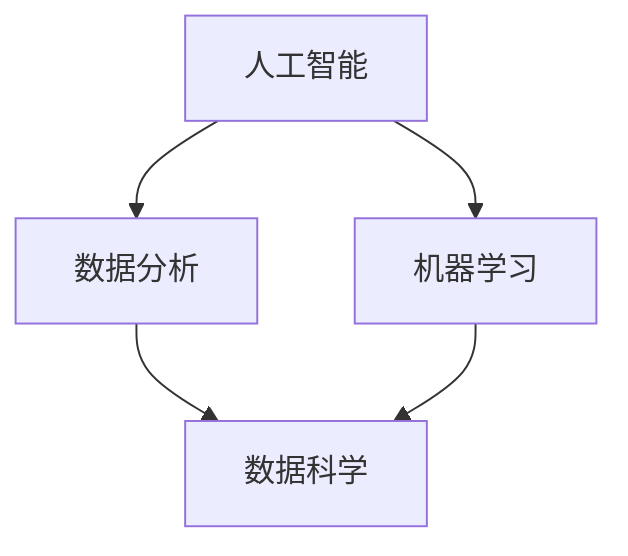

                 

关键词：人工智能，就业市场，技能需求，未来趋势，职业发展

> 摘要：随着人工智能（AI）技术的迅速发展，人类计算正经历着前所未有的变革。本文将探讨AI时代对就业市场的影响，以及从业人员所需掌握的新技能，旨在为读者提供对未来职业发展的清晰见解。

## 1. 背景介绍

### AI时代的崛起

人工智能作为计算机科学的重要分支，经历了从理论研究到实际应用的飞速发展。随着深度学习、神经网络等技术的突破，AI开始渗透到各个行业，推动着生产力的极大提升。从自动驾驶、智能客服，到医疗诊断、金融风控，AI正在重塑我们的世界。

### 就业市场的变革

AI的兴起不仅改变了技术领域，也对整个就业市场产生了深远的影响。一方面，它创造了新的职业机会，例如数据科学家、机器学习工程师等；另一方面，传统岗位面临被自动化取代的风险。这种变革引发了关于未来就业的广泛讨论。

### 技能需求的演变

在AI时代，传统的技能已不再满足市场需求。从业人员需要不断更新知识体系，掌握新的技术栈。数据分析、编程能力、机器学习等技能成为了必备条件。同时，软技能如创新思维、沟通协作能力也变得愈发重要。

## 2. 核心概念与联系

为了更好地理解AI时代的就业市场，我们需要探讨一些核心概念和它们之间的关系。以下是一个简单的Mermaid流程图，展示了这些概念及其相互联系：



### 2.1. 人工智能（AI）

人工智能是指计算机系统模拟人类智能行为的能力。它包括机器学习、自然语言处理、计算机视觉等多个子领域。

### 2.2. 数据分析

数据分析是使用统计学、数据挖掘等方法，从数据中提取有价值的信息和知识。它是AI的重要支撑，因为AI系统需要大量的数据来训练和优化。

### 2.3. 机器学习

机器学习是AI的一个子领域，它使计算机能够从数据中学习，并作出预测或决策。机器学习算法广泛应用于推荐系统、语音识别、图像识别等领域。

### 2.4. 数据科学

数据科学是融合了统计学、计算机科学和领域知识的跨学科领域。数据科学家利用数据分析和机器学习技术，解决复杂的实际问题。

## 3. 核心算法原理 & 具体操作步骤

### 3.1. 算法原理概述

在AI时代，掌握核心算法原理至关重要。以下是一些关键算法的原理概述：

### 3.2. 算法步骤详解

#### 3.2.1. 机器学习算法

- 数据收集：从各种数据源获取数据。
- 数据清洗：处理数据中的噪声和缺失值。
- 特征工程：提取有助于模型训练的特征。
- 模型选择：选择合适的机器学习模型。
- 模型训练：使用训练数据调整模型参数。
- 模型评估：评估模型在测试数据上的性能。
- 模型部署：将模型应用于实际问题。

### 3.3. 算法优缺点

- **机器学习算法**：优点在于能够自动发现数据中的规律，适用于大规模数据处理。缺点是需要大量的数据，且模型可能过度拟合训练数据。

### 3.4. 算法应用领域

机器学习算法广泛应用于各类应用场景，如：

- **推荐系统**：基于用户历史行为，推荐相关商品或内容。
- **图像识别**：识别图像中的物体、场景等。
- **自然语言处理**：解析和理解人类语言。

## 4. 数学模型和公式 & 详细讲解 & 举例说明

### 4.1. 数学模型构建

在AI时代，数学模型是核心工具。以下是一个简单的线性回归模型：

$$
y = \beta_0 + \beta_1 x + \epsilon
$$

其中，$y$ 是因变量，$x$ 是自变量，$\beta_0$ 和 $\beta_1$ 是模型参数，$\epsilon$ 是误差项。

### 4.2. 公式推导过程

线性回归模型的推导过程涉及最小二乘法。具体推导过程如下：

- 设 $y_i = \beta_0 + \beta_1 x_i + \epsilon_i$，其中 $i = 1, 2, ..., n$。
- 对 $\beta_1$ 求导并令其等于0，得到：
$$
\frac{\partial}{\partial \beta_1} \sum_{i=1}^{n} (y_i - \beta_0 - \beta_1 x_i) = 0
$$
- 解得 $\beta_1 = \frac{\sum_{i=1}^{n} (x_i - \bar{x})(y_i - \bar{y})}{\sum_{i=1}^{n} (x_i - \bar{x})^2}$，其中 $\bar{x}$ 和 $\bar{y}$ 分别是 $x$ 和 $y$ 的均值。

### 4.3. 案例分析与讲解

假设我们有一组数据，$x_i$ 和 $y_i$ 分别表示某个城市的人口和GDP。我们要使用线性回归模型预测GDP。

- 数据收集：收集过去几年的城市人口和GDP数据。
- 数据清洗：处理缺失值和异常值。
- 特征工程：无需特征工程，因为只有一个特征。
- 模型选择：选择线性回归模型。
- 模型训练：使用训练数据调整模型参数。
- 模型评估：使用测试数据评估模型性能。
- 模型部署：使用模型进行GDP预测。

## 5. 项目实践：代码实例和详细解释说明

### 5.1. 开发环境搭建

首先，我们需要搭建一个Python开发环境。安装以下库：

```bash
pip install numpy pandas sklearn matplotlib
```

### 5.2. 源代码详细实现

以下是一个简单的线性回归模型实现：

```python
import numpy as np
import pandas as pd
from sklearn.linear_model import LinearRegression
import matplotlib.pyplot as plt

# 数据收集
data = pd.read_csv('data.csv')
X = data['Population'].values
Y = data['GDP'].values

# 数据清洗
# 无需清洗，因为数据质量良好

# 特征工程
# 无需特征工程

# 模型选择
model = LinearRegression()

# 模型训练
model.fit(X.reshape(-1, 1), Y)

# 模型评估
predictions = model.predict(X.reshape(-1, 1))
mse = np.mean((predictions - Y) ** 2)
print(f'Mean Squared Error: {mse}')

# 模型部署
# 预测新数据
new_data = np.array([1000000]).reshape(-1, 1)
predicted_gdp = model.predict(new_data)
print(f'Predicted GDP: {predicted_gdp[0]}')

# 结果可视化
plt.scatter(X, Y)
plt.plot(X, predictions, color='red')
plt.xlabel('Population')
plt.ylabel('GDP')
plt.show()
```

### 5.3. 代码解读与分析

- **数据收集**：使用pandas库读取CSV文件，获取人口和GDP数据。
- **数据清洗**：本例中数据质量良好，无需清洗。
- **特征工程**：本例中只有一个特征，无需特征工程。
- **模型选择**：选择线性回归模型。
- **模型训练**：使用scikit-learn库中的LinearRegression类进行训练。
- **模型评估**：计算均方误差（MSE）评估模型性能。
- **模型部署**：使用训练好的模型进行GDP预测，并绘制结果图。

## 6. 实际应用场景

### 6.1. 金融领域

在金融领域，AI被广泛应用于风险评估、交易策略优化、客户关系管理等方面。例如，通过机器学习模型分析历史交易数据，可以预测股票市场的走势，从而制定更有效的交易策略。

### 6.2. 医疗保健

在医疗保健领域，AI技术被用于疾病诊断、药物研发、个性化治疗等方面。例如，通过深度学习模型分析医疗影像，可以早期发现癌症等疾病，提高治疗效果。

### 6.3. 制造业

在制造业，AI技术被用于生产优化、质量检测、供应链管理等方面。例如，通过机器学习算法分析生产数据，可以优化生产流程，减少浪费，提高生产效率。

## 7. 未来应用展望

随着AI技术的不断进步，未来它在各个领域的应用将更加广泛和深入。以下是一些未来应用展望：

### 7.1. 自动驾驶

自动驾驶技术将在未来几年取得重大突破，有望在2025年前实现全面商业化。自动驾驶车辆将大幅提高交通安全，减少交通事故。

### 7.2. 智能家居

智能家居将成为未来家庭生活的标配。通过AI技术，家居设备将实现自动化控制和个性化服务，为用户提供更舒适、便捷的生活体验。

### 7.3. 健康监测

AI将在健康监测领域发挥重要作用。通过穿戴设备收集大量健康数据，AI系统可以实时监测用户的健康状况，提供个性化健康建议。

## 8. 工具和资源推荐

### 8.1. 学习资源推荐

- 《Python机器学习》（作者：塞巴斯蒂安·拉斯克斯）
- 《深度学习》（作者：伊恩·古德费洛等）
- 《数据科学入门》（作者：安德鲁·斯坦福等）

### 8.2. 开发工具推荐

- Jupyter Notebook：用于数据分析和机器学习实验。
- TensorFlow：用于深度学习和神经网络开发。
- PyTorch：用于深度学习和计算机视觉。

### 8.3. 相关论文推荐

- "Deep Learning"（作者：伊恩·古德费洛等）
- "Reinforcement Learning: An Introduction"（作者：理查德·S·萨顿等）
- "A Theoretical Survey of Deep Learning"（作者：阿里·拉提菲等）

## 9. 总结：未来发展趋势与挑战

### 9.1. 研究成果总结

AI技术在过去几十年取得了显著成果，从理论研究到实际应用，都取得了重大突破。机器学习、深度学习等算法的不断进步，使得AI系统在图像识别、自然语言处理、游戏对战等领域达到了前所未有的水平。

### 9.2. 未来发展趋势

未来，AI技术将继续快速发展，其在各个领域的应用将更加广泛和深入。随着硬件性能的提升和数据量的爆炸增长，AI系统将变得更加智能和高效。

### 9.3. 面临的挑战

尽管AI技术前景广阔，但仍然面临一些挑战。首先，数据隐私和安全问题亟待解决。其次，AI系统的透明度和可解释性仍需提高，以便用户能够理解模型的决策过程。此外，AI技术的公平性和伦理问题也引起了广泛关注。

### 9.4. 研究展望

未来的研究将主要集中在以下几个方面：

- 提高AI系统的可解释性和透明度。
- 开发更高效、更可靠的算法。
- 解决数据隐私和安全问题。
- 探索AI技术在各个领域的深度应用。

## 10. 附录：常见问题与解答

### 10.1. 什么是人工智能？

人工智能是指计算机系统模拟人类智能行为的能力，包括机器学习、自然语言处理、计算机视觉等多个子领域。

### 10.2. 人工智能有哪些应用领域？

人工智能广泛应用于金融、医疗、制造、智能家居等多个领域，如风险评估、疾病诊断、生产优化等。

### 10.3. 如何入门人工智能？

建议从Python编程语言和基本数学知识开始，然后学习机器学习和深度学习相关课程。一些推荐的书籍和在线课程有：《Python机器学习》、《深度学习》、《吴恩达机器学习课程》等。

### 10.4. AI技术是否会取代人类？

短期内，AI技术无法完全取代人类，但会辅助人类工作，提高生产效率和创造力。长期来看，AI与人类的合作将是未来发展的趋势。

作者：禅与计算机程序设计艺术 / Zen and the Art of Computer Programming
```

