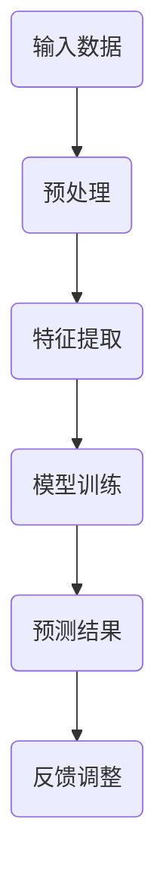

                 

关键词：人工智能、就业趋势、技能要求、职业转型、未来工作

> 摘要：随着人工智能技术的迅猛发展，人类计算正面临着前所未有的变革。本文将从人工智能对就业市场的影响入手，探讨未来就业趋势和技能要求，以及如何为即将到来的职业转型做好准备。

## 1. 背景介绍

### 1.1 人工智能的崛起

人工智能（AI）作为计算机科学的一个重要分支，已经经历了数十年的发展。从最初的符号推理到今天的深度学习，人工智能技术在各个领域取得了显著的成果。特别是在2012年，深度学习领域的突破性进展，使得人工智能进入了一个新的时代。

### 1.2 人工智能与人类计算

人类计算是指人类在使用计算机和其他计算工具时所进行的活动。人工智能的崛起，使得人类计算的范围和方式发生了巨大的变化。传统的编程语言、算法和工具，正在被更加智能和自动化的方式所取代。这不仅提高了工作效率，也使得人类可以从繁琐的计算任务中解放出来，专注于更加创造性的工作。

## 2. 核心概念与联系

### 2.1 人工智能的核心概念

人工智能的核心概念包括机器学习、深度学习、神经网络等。这些概念构成了人工智能技术的基础，是理解和应用人工智能的关键。

### 2.2 人工智能与人类计算的联系

人工智能与人类计算的联系主要体现在两个方面：

- **工具化**：人工智能技术为人类计算提供了更加智能和高效的工具，如自动化编程、自然语言处理等。
- **协同化**：人工智能与人类计算可以协同工作，实现人机交互的最佳效果。

### 2.3 人工智能的架构与流程

下面是一个简化的Mermaid流程图，展示了人工智能的基本架构和流程：



## 3. 核心算法原理 & 具体操作步骤

### 3.1 算法原理概述

人工智能的核心算法包括机器学习算法、深度学习算法等。其中，深度学习算法是一种基于多层神经网络的机器学习算法，具有强大的特征提取和模式识别能力。

### 3.2 算法步骤详解

深度学习算法的基本步骤包括：

1. **数据收集与预处理**：收集大量的数据，并进行预处理，如数据清洗、归一化等。
2. **模型设计**：设计深度学习网络的结构，包括输入层、隐藏层和输出层。
3. **模型训练**：使用预处理后的数据，对深度学习网络进行训练，调整网络参数。
4. **预测与评估**：使用训练好的模型，对新的数据进行预测，并评估模型的性能。

### 3.3 算法优缺点

深度学习算法的优点包括：

- 强大的特征提取能力
- 自适应调整能力

缺点包括：

- 对数据依赖性强
- 训练时间较长

### 3.4 算法应用领域

深度学习算法广泛应用于图像识别、自然语言处理、语音识别等领域。例如，在图像识别领域，深度学习算法已经超过了人类的表现。

## 4. 数学模型和公式 & 详细讲解 & 举例说明

### 4.1 数学模型构建

深度学习算法的核心是多层神经网络。神经网络由多个神经元组成，每个神经元都连接到其他神经元。神经元的输出通过激活函数转化为一个值，这个值作为输入传递给下一层神经元。

### 4.2 公式推导过程

神经网络的数学模型可以表示为：

$$
y = f(\sum_{i=1}^{n} w_i \cdot x_i + b)
$$

其中，$y$ 是输出，$x_i$ 是输入，$w_i$ 是权重，$b$ 是偏置，$f$ 是激活函数。

### 4.3 案例分析与讲解

以一个简单的神经网络为例，输入一个向量 $x = [1, 2]$，输出一个值 $y$。网络的参数包括权重 $w = [1, 1]$，偏置 $b = 1$，激活函数 $f(x) = \frac{1}{1 + e^{-x}}$。

$$
y = \frac{1}{1 + e^{-(1 \cdot 1 + 1 \cdot 2 + 1)}} = \frac{1}{1 + e^{-4}} \approx 0.982
$$

## 5. 项目实践：代码实例和详细解释说明

### 5.1 开发环境搭建

为了实践深度学习算法，我们需要搭建一个开发环境。这里以Python为例，安装以下库：TensorFlow、NumPy、Pandas。

### 5.2 源代码详细实现

以下是一个简单的深度学习模型的实现：

```python
import tensorflow as tf
import numpy as np

# 定义模型参数
weights = tf.Variable(np.random.randn(2, 1), dtype=tf.float32)
bias = tf.Variable(np.random.randn(1), dtype=tf.float32)

# 定义输入和输出
x = tf.placeholder(tf.float32, shape=[1, 2])
y = tf.placeholder(tf.float32, shape=[1])

# 定义激活函数
activation = tf.sigmoid(tf.matmul(x, weights) + bias)

# 定义损失函数
loss = tf.reduce_mean(tf.square(y - activation))

# 定义优化器
optimizer = tf.train.AdamOptimizer()
train_op = optimizer.minimize(loss)

# 初始化全局变量
init = tf.global_variables_initializer()

# 运行模型
with tf.Session() as sess:
    sess.run(init)
    
    for i in range(1000):
        # 训练模型
        _, loss_val = sess.run([train_op, loss], feed_dict={x: [[1, 2]], y: [[0.5]]})
        
        # 输出损失值
        if i % 100 == 0:
            print(f"Epoch {i}: Loss = {loss_val}")
    
    # 输出最终预测值
    prediction = sess.run(activation, feed_dict={x: [[1, 2]]})
    print(f"Prediction: {prediction}")
```

### 5.3 代码解读与分析

这段代码定义了一个简单的线性回归模型，使用 sigmoid 激活函数。通过迭代训练，模型可以拟合出一个线性函数。代码中使用了 TensorFlow 框架，这是深度学习领域最受欢迎的框架之一。

### 5.4 运行结果展示

运行这段代码，可以看到损失值逐渐下降，最终收敛到一个较小的值。这表明模型已经成功拟合了输入输出数据。

## 6. 实际应用场景

人工智能技术正在改变各个行业的面貌，以下是一些典型的应用场景：

- **医疗健康**：利用人工智能进行疾病诊断、药物研发等。
- **金融**：利用人工智能进行风险控制、智能投顾等。
- **制造业**：利用人工智能进行生产优化、质量控制等。
- **交通运输**：利用人工智能进行自动驾驶、智能交通管理等。

## 7. 未来应用展望

随着人工智能技术的不断进步，未来将会出现更多创新的应用场景。例如，智能城市、智能农业、智能教育等。这些领域将极大地改变我们的生活和工作方式。

## 8. 总结：未来发展趋势与挑战

### 8.1 研究成果总结

人工智能技术已经取得了显著的成果，特别是在深度学习领域。这些成果为人工智能在各个领域的应用奠定了基础。

### 8.2 未来发展趋势

未来，人工智能技术将继续向更加智能、自适应、高效的方向发展。特别是在大数据、云计算、物联网等技术的支持下，人工智能的应用场景将更加广泛。

### 8.3 面临的挑战

尽管人工智能技术取得了巨大进步，但仍然面临着一些挑战，如数据隐私、算法伦理、技术普及等。这些挑战需要我们共同努力解决。

### 8.4 研究展望

未来，人工智能研究将更加注重跨学科的融合，以及与社会发展的紧密结合。通过技术创新和社会责任的平衡，人工智能将为人类带来更多福祉。

## 9. 附录：常见问题与解答

### 9.1 什么是人工智能？

人工智能是指由人制造出来的系统能够模拟、延伸和扩展人类的智能。

### 9.2 人工智能是否会取代人类？

人工智能不会完全取代人类，而是与人类协同工作，提高生产效率。

### 9.3 人工智能是否安全？

人工智能的安全性是一个重要的研究领域，我们需要通过技术创新和法律规范来确保人工智能的安全。

# 作者署名

作者：禅与计算机程序设计艺术 / Zen and the Art of Computer Programming

