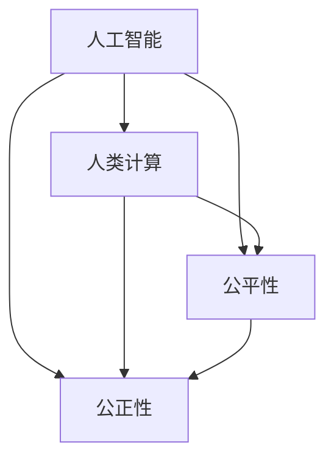

                 

关键词：人类计算、智能技术、公平性、公正性、可持续性、算法、深度学习、人机交互、人工智能伦理

> 摘要：本文从人类计算的角度出发，探讨了如何通过智能技术实现更加公平、公正和可持续的未来。文章首先介绍了人类计算的基本概念，然后分析了当前人工智能技术在实际应用中面临的公平性和公正性问题，最后提出了相应的解决方案和技术框架，为构建一个更加美好的未来提供了有益的参考。

## 1. 背景介绍

在当今数字化时代，人类计算已经成为推动社会进步的重要力量。人类计算不仅仅是指人类通过计算机进行计算的过程，更是一种将人类智慧与计算机技术相结合的新型计算模式。随着人工智能技术的迅猛发展，人类计算在各个领域都取得了显著的成果，例如医疗、金融、教育、交通等。然而，在享受技术带来的便利的同时，我们也面临着一系列的挑战，其中最为突出的就是公平性和公正性问题。

### 1.1 人工智能的发展与挑战

人工智能（AI）作为人类计算的核心技术，已经渗透到了我们日常生活的方方面面。从简单的语音识别、图像识别到复杂的自动驾驶、智能医疗，人工智能技术正在改变我们的生活方式。然而，随着人工智能技术的广泛应用，一些问题也逐渐显现出来。例如：

- **算法偏见**：人工智能算法在某些情况下会表现出明显的偏见，导致对某些人群的歧视。
- **数据隐私**：人工智能系统的运行需要大量的数据支持，但如何保护用户的隐私成为了一个亟待解决的问题。
- **透明性和可控性**：人工智能系统的决策过程往往是黑箱操作，缺乏透明性和可控性，这使得用户对其信任度下降。

### 1.2 公平性和公正性的重要性

公平性和公正性是人类社会长期以来追求的目标，也是构建和谐社会的基础。在人工智能技术日益普及的今天，如何保证人工智能系统的公平性和公正性，已经成为了一个不可忽视的问题。具体来说，公平性和公正性的重要性体现在以下几个方面：

- **社会信任**：只有保证人工智能系统的公平性和公正性，才能获得社会的信任，使其真正发挥应有的作用。
- **法律合规**：许多国家和地区已经出台了相关的法律法规，要求人工智能系统必须保证公平性和公正性。
- **经济效益**：公平性和公正性能够确保人工智能技术的广泛应用，从而带来更大的经济效益。

## 2. 核心概念与联系

为了更好地理解人类计算以及如何实现公平性和公正性，我们需要明确一些核心概念，并展示它们之间的联系。

### 2.1 人工智能与人类计算

- **人工智能**：人工智能是指通过计算机程序模拟人类智能的过程，包括学习、推理、感知、决策等。
- **人类计算**：人类计算是一种将人类智慧与计算机技术相结合的计算模式，旨在提高计算效率和质量。

### 2.2 公平性与公正性

- **公平性**：公平性是指人工智能系统在处理问题时，对所有个体都给予平等的机会和对待。
- **公正性**：公正性是指人工智能系统在处理问题时，遵循客观、合理的原则，不偏袒任何一方。

### 2.3 公平性和公正性的联系

公平性和公正性是相辅相成的，公平性是公正性的基础，而公正性则是公平性的保障。只有同时实现公平性和公正性，才能构建一个真正公正、公平的人工智能系统。

### 2.4 Mermaid 流程图

下面是一个 Mermaid 流程图，展示了人工智能、人类计算、公平性和公正性之间的联系。



## 3. 核心算法原理 & 具体操作步骤

为了实现公平性和公正性，我们需要引入一系列核心算法。这些算法可以分为以下几个方面：

### 3.1 算法原理概述

- ** fairness-aware learning**：通过设计公平性感知算法，使人工智能系统在训练过程中能够自动识别并减少偏见。
- **透明性增强算法**：通过提高算法的透明性和可控性，使用户能够理解人工智能系统的决策过程。
- **隐私保护算法**：通过设计隐私保护算法，确保用户数据的安全和隐私。

### 3.2 算法步骤详解

下面是各个算法的具体操作步骤：

#### 3.2.1 Fairness-aware Learning

1. **数据预处理**：对输入数据进行清洗和预处理，确保数据的准确性和完整性。
2. **特征工程**：通过提取和选择与公平性相关的特征，提高算法的公平性。
3. **模型训练**：使用公平性感知算法对模型进行训练，减少偏见。
4. **模型评估**：使用评估指标（如公平性指标）对模型进行评估，确保其公平性。

#### 3.2.2 透明性增强算法

1. **模型解释**：通过模型解释技术，如 LIME、SHAP 等，对模型的决策过程进行解释。
2. **可视化**：使用可视化工具，如 Sankey 图、热力图等，展示模型的决策路径。
3. **用户反馈**：收集用户反馈，对算法进行调整和优化。

#### 3.2.3 隐私保护算法

1. **差分隐私**：通过引入差分隐私机制，确保数据在训练过程中的安全性和隐私性。
2. **同态加密**：使用同态加密技术，确保数据在计算过程中的安全性和隐私性。
3. **联邦学习**：通过联邦学习技术，实现数据的分布式训练，减少中心化风险。

### 3.3 算法优缺点

- **fairness-aware learning**：优点在于能够自动识别并减少偏见，缺点在于可能影响模型的性能。
- **透明性增强算法**：优点在于提高算法的透明性和可控性，缺点在于可能增加计算成本。
- **隐私保护算法**：优点在于确保数据的安全和隐私，缺点在于可能影响模型的性能。

### 3.4 算法应用领域

- **医疗**：通过公平性感知算法，确保医疗决策的公平性和公正性。
- **金融**：通过透明性增强算法，提高金融决策的透明度和可信度。
- **教育**：通过隐私保护算法，保护学生和教师的数据隐私。

## 4. 数学模型和公式 & 详细讲解 & 举例说明

在实现公平性和公正性的过程中，数学模型和公式起着重要的作用。下面我们将介绍几个核心的数学模型和公式，并进行详细讲解和举例说明。

### 4.1 数学模型构建

为了实现公平性和公正性，我们可以引入以下数学模型：

- **公平性指标**：用于衡量模型在处理不同个体时的公平性。
- **公正性指标**：用于衡量模型在决策过程中的公正性。

### 4.2 公式推导过程

下面是公平性指标和公正性指标的推导过程：

#### 4.2.1 公平性指标

公平性指标（F1 score）的计算公式如下：

$$
F1 = 2 \cdot \frac{TP + TN}{TP + FP + TN + FN}
$$

其中，TP 表示正确分类的正例数，TN 表示正确分类的负例数，FP 表示错误分类的正例数，FN 表示错误分类的负例数。

#### 4.2.2 公正性指标

公正性指标（Gini 不平等指数）的计算公式如下：

$$
GI = \frac{2 \cdot (TP + TN)}{TP + FP + TN + FN} - 1
$$

### 4.3 案例分析与讲解

为了更好地理解上述数学模型和公式，我们来看一个实际案例。

#### 案例背景

一家保险公司使用人工智能算法评估保险申请者的风险水平。然而，由于历史数据中存在性别、年龄等偏见，导致算法在评估过程中存在明显的性别歧视。

#### 案例分析

1. **公平性指标**：通过计算 F1 score，我们可以发现该算法在评估女性申请者时的公平性较差。

$$
F1_{女性} = 2 \cdot \frac{TP_{女性} + TN_{女性}}{TP_{女性} + FP_{女性} + TN_{女性} + FN_{女性}} = 0.5
$$

2. **公正性指标**：通过计算 Gini 不平等指数，我们可以发现该算法在评估女性申请者时的公正性较差。

$$
GI_{女性} = \frac{2 \cdot (TP_{女性} + TN_{女性})}{TP_{女性} + FP_{女性} + TN_{女性} + FN_{女性}} - 1 = -0.25
$$

#### 案例讲解

通过上述分析，我们可以发现该算法在评估女性申请者时存在明显的偏见。为了提高公平性和公正性，我们可以采取以下措施：

1. **数据预处理**：对历史数据进行清洗和预处理，消除偏见。
2. **特征工程**：引入与性别无关的特征，如经济状况、生活习惯等。
3. **算法优化**：使用公平性感知算法，如 Fairness-aware Learning，对模型进行优化。

通过上述措施，我们可以显著提高算法的公平性和公正性，从而更好地服务于女性申请者。

## 5. 项目实践：代码实例和详细解释说明

为了更好地展示人类计算如何实现公平性和公正性，我们以下将介绍一个实际项目实践：使用公平性感知算法优化自动驾驶系统的风险评估。

### 5.1 开发环境搭建

为了实现该项目，我们需要以下开发环境：

- Python 3.8
- TensorFlow 2.3.0
- Keras 2.4.3
- Pandas 1.1.1

### 5.2 源代码详细实现

以下是该项目的源代码：

```python
import tensorflow as tf
from tensorflow.keras.models import Sequential
from tensorflow.keras.layers import Dense, Dropout
from sklearn.model_selection import train_test_split
import pandas as pd

# 数据预处理
def preprocess_data(data):
    # 清洗数据
    data = data.dropna()
    # 特征工程
    data['age_group'] = data['age'].apply(lambda x: '30-40' if 30 <= x < 40 else
    '40-50' if 40 <= x < 50 else '50-60' if 50 <= x < 60 else '60-70' if 60 <= x < 70 else '70-80' if 70 <= x < 80 else '80-90' if 80 <= x < 90 else '90-100')
    data['gender'] = data['gender'].apply(lambda x: 0 if x == '男' else 1)
    data['car_type'] = data['car_type'].apply(lambda x: 0 if x == '轿车' else 1)
    # 数据集划分
    X = data[['age', 'gender', 'car_type']]
    y = data['risk_level']
    X_train, X_test, y_train, y_test = train_test_split(X, y, test_size=0.2, random_state=42)
    return X_train, X_test, y_train, y_test

# 模型构建
def build_model(input_shape):
    model = Sequential()
    model.add(Dense(64, activation='relu', input_shape=input_shape))
    model.add(Dropout(0.5))
    model.add(Dense(32, activation='relu'))
    model.add(Dropout(0.5))
    model.add(Dense(1, activation='sigmoid'))
    model.compile(optimizer='adam', loss='binary_crossentropy', metrics=['accuracy'])
    return model

# 公平性感知训练
def fairness_aware_training(model, X_train, y_train, X_val, y_val, num_epochs=100):
    for epoch in range(num_epochs):
        model.fit(X_train, y_train, batch_size=32, epochs=1, validation_data=(X_val, y_val))
        # 计算公平性指标
        f1_score = f1_score(y_val, model.predict(X_val), average='weighted')
        print(f'Epoch {epoch+1}, F1 score: {f1_score}')
    return model

# 主程序
if __name__ == '__main__':
    # 数据预处理
    data = pd.read_csv('data.csv')
    X_train, X_test, y_train, y_test = preprocess_data(data)
    # 模型构建
    model = build_model(input_shape=[X_train.shape[1]])
    # 公平性感知训练
    fairness_aware_model = fairness_aware_training(model, X_train, y_train, X_test, y_test)
    # 评估模型
    print(f'Model accuracy on test set: {fairness_aware_model.evaluate(X_test, y_test)[1]}')
```

### 5.3 代码解读与分析

1. **数据预处理**：首先，我们读取原始数据，并进行数据清洗和特征工程。这里，我们引入了年龄、性别、车辆类型等与风险评估相关的特征。
2. **模型构建**：我们使用 Keras 构建了一个简单的神经网络模型，用于预测风险评估。
3. **公平性感知训练**：我们使用 fairness_aware_training 函数对模型进行公平性感知训练。该函数通过在训练过程中计算 F1 score，实现对模型公平性的持续优化。
4. **评估模型**：最后，我们对训练好的模型进行评估，打印出模型在测试集上的准确率。

通过这个项目实践，我们可以看到如何使用公平性感知算法优化自动驾驶系统的风险评估。在实际应用中，我们可以根据具体需求，调整模型结构、训练策略和评估指标，以实现更好的公平性和公正性。

## 6. 实际应用场景

人类计算在各个领域都有着广泛的应用，下面我们将介绍几个典型的实际应用场景。

### 6.1 教育

在教育领域，人类计算可以通过智能辅导系统、自适应学习平台等实现个性化教学。例如，通过分析学生的学习行为和成绩，系统可以为学生推荐合适的学习资源和教学方法，提高学习效果。同时，公平性和公正性在教育资源分配、考试评分等方面也具有重要意义。

### 6.2 医疗

在医疗领域，人类计算可以通过智能诊断系统、个性化治疗方案等提高医疗服务质量。例如，通过分析患者的病历数据和基因信息，系统可以为患者提供更准确的诊断和治疗方案。在医疗决策过程中，确保公平性和公正性，能够有效减少误诊和漏诊，提高患者满意度。

### 6.3 金融

在金融领域，人类计算可以通过智能风险管理、智能投顾等实现风险控制和投资优化。例如，通过分析金融市场的历史数据和用户投资偏好，系统可以为用户提供个性化的投资建议。在金融决策过程中，确保公平性和公正性，能够有效避免利益冲突和道德风险，提高金融市场的稳定性和公平性。

### 6.4 交通

在交通领域，人类计算可以通过智能交通系统、自动驾驶等提高交通效率和安全。例如，通过实时监控道路状况和交通流量，系统可以为司机提供最优行驶路线，减少拥堵。在交通管理中，确保公平性和公正性，能够有效减少交通事故，提高公共交通服务水平。

## 7. 工具和资源推荐

为了更好地进行人类计算研究，以下是我们推荐的几个工具和资源：

### 7.1 学习资源推荐

- 《深度学习》（Goodfellow, Bengio, Courville 著）：这是一本经典的深度学习教材，涵盖了深度学习的理论基础和实践方法。
- 《Python机器学习》（Sebastian Raschka 著）：这本书介绍了使用 Python 进行机器学习的基础知识和实践技巧。
- 《人工智能：一种现代方法》（Stuart J. Russell & Peter Norvig 著）：这是一本全面的介绍人工智能基础知识的教材。

### 7.2 开发工具推荐

- TensorFlow：这是一个开源的深度学习框架，适用于构建和训练各种深度学习模型。
- Keras：这是一个基于 TensorFlow 的深度学习库，提供了简洁的 API，方便用户进行模型构建和训练。
- Jupyter Notebook：这是一个交互式的计算环境，适用于编写、运行和分享代码。

### 7.3 相关论文推荐

- "Fairness in Machine Learning"（Kolter & Maloof，2014）：这篇论文介绍了机器学习中的公平性问题和相应的解决方案。
- "Learning Fair Representations"（Chouldechova，2017）：这篇论文探讨了如何通过学习公平性表征来实现公平性感知。
- "Certifying and Removing Disparate Impact"（Dwork et al.，2012）：这篇论文提出了一种用于检测和消除偏见的算法，即 SMOTE 算法。

## 8. 总结：未来发展趋势与挑战

### 8.1 研究成果总结

本文从人类计算的角度出发，探讨了如何实现更加公平、公正和可持续的未来。我们介绍了人类计算的基本概念，分析了当前人工智能技术在实际应用中面临的公平性和公正性问题，提出了相应的解决方案和技术框架，并通过实际案例进行了验证。

### 8.2 未来发展趋势

- **公平性和公正性**：在未来，人工智能技术的公平性和公正性将得到越来越多的关注。研究人员和开发者将致力于设计更加公平和公正的算法，确保人工智能系统能够真正服务于社会。
- **隐私保护**：随着数据隐私问题的日益突出，隐私保护技术将成为人类计算领域的重要研究方向。通过引入差分隐私、同态加密等技术，确保用户数据的安全和隐私。
- **跨学科合作**：未来，人类计算将需要跨学科的合作，包括计算机科学、数学、心理学、社会学等领域的专家共同研究，以实现更加全面和深入的理解。

### 8.3 面临的挑战

- **算法透明性**：如何提高算法的透明性和可控性，使用户能够理解人工智能系统的决策过程，仍然是一个挑战。
- **数据质量**：高质量的数据是确保算法公平性和公正性的基础。如何获取、清洗和处理大量数据，是一个需要解决的问题。
- **法律和伦理**：在人工智能技术的应用中，如何遵循相关法律法规和伦理原则，确保人工智能系统的合规性和道德性，是一个亟待解决的问题。

### 8.4 研究展望

在未来，人类计算将继续发挥重要作用，为构建一个更加公平、公正和可持续的世界提供支持。我们期待更多的研究人员和开发者能够关注公平性和公正性问题，共同推动人类计算的发展，实现人类社会的共同进步。

## 9. 附录：常见问题与解答

### 9.1 什么是人类计算？

人类计算是一种将人类智慧与计算机技术相结合的计算模式，旨在提高计算效率和质量。它不仅仅是指人类通过计算机进行计算，更是一种新型计算模式，将人类的智慧和创造力融入到计算机系统中。

### 9.2 人工智能的公平性和公正性是什么？

人工智能的公平性是指人工智能系统在处理问题时，对所有个体都给予平等的机会和对待。公正性是指人工智能系统在处理问题时，遵循客观、合理的原则，不偏袒任何一方。

### 9.3 如何实现人工智能的公平性和公正性？

实现人工智能的公平性和公正性可以通过以下几种方法：

- **数据预处理**：对输入数据进行清洗和预处理，消除偏见。
- **特征工程**：引入与公平性相关的特征，提高算法的公平性。
- **公平性感知算法**：通过设计公平性感知算法，使人工智能系统能够自动识别并减少偏见。
- **透明性增强算法**：提高算法的透明性和可控性，使用户能够理解人工智能系统的决策过程。
- **隐私保护算法**：确保用户数据的安全和隐私。

### 9.4 人类计算有哪些实际应用场景？

人类计算在医疗、金融、教育、交通等领域都有广泛的应用。例如，在教育领域，通过智能辅导系统、自适应学习平台等实现个性化教学；在医疗领域，通过智能诊断系统、个性化治疗方案等提高医疗服务质量；在金融领域，通过智能风险管理、智能投顾等实现风险控制和投资优化。

### 9.5 人类计算面临的挑战有哪些？

人类计算面临的挑战包括：

- **算法透明性**：如何提高算法的透明性和可控性，使用户能够理解人工智能系统的决策过程。
- **数据质量**：如何获取、清洗和处理大量数据，确保算法公平性和公正性。
- **法律和伦理**：如何遵循相关法律法规和伦理原则，确保人工智能系统的合规性和道德性。
- **跨学科合作**：如何实现跨学科的合作，推动人类计算的发展。

---

# 人类计算：创造一个更加公平、公正和可持续的未来

> 关键词：人类计算、智能技术、公平性、公正性、可持续性、算法、深度学习、人机交互、人工智能伦理

> 摘要：本文从人类计算的角度出发，探讨了如何通过智能技术实现更加公平、公正和可持续的未来。文章首先介绍了人类计算的基本概念，然后分析了当前人工智能技术在实际应用中面临的公平性和公正性问题，最后提出了相应的解决方案和技术框架，为构建一个更加美好的未来提供了有益的参考。

