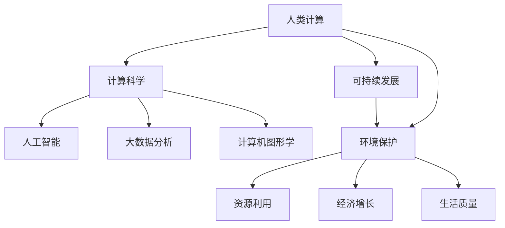

                 

关键词：人类计算、可持续发展、算法、数学模型、实践、未来应用、资源推荐

> 摘要：本文探讨了人类计算在可持续发展中的作用和重要性，分析了人类计算的核心概念、算法原理、数学模型及其在实际应用中的实践和未来展望。通过深入解析，揭示了人类计算如何成为推动可持续发展的关键力量。

## 1. 背景介绍

在当今世界，可持续发展的理念日益深入人心。无论是环境保护、资源节约，还是经济增长、社会发展，可持续发展已成为全球共识。然而，要实现这一目标，离不开高效的计算技术。人类计算作为计算科学的重要组成部分，以其独特的优势在可持续发展中发挥着不可替代的作用。

### 人类计算的概念

人类计算（Human-Centric Computing）是指通过模拟人类思维和行为特征，利用计算机技术实现人与计算机之间的自然交互和协同工作。它强调以人为本，关注人的需求、感受和体验。人类计算的核心目标是提高人类的生活质量和工作效率，实现人与机器的和谐共生。

### 人类计算在可持续发展中的作用

人类计算在可持续发展中的作用主要体现在以下几个方面：

1. **提高资源利用效率**：通过优化算法和模型，人类计算可以帮助企业和组织更加高效地利用资源，减少浪费，实现可持续发展。

2. **促进环境保护**：人类计算可以协助环境监测、污染控制和生态修复等工作，提高环境保护的效率和效果。

3. **推动经济增长**：人类计算为各个行业提供了强大的计算支持，有助于提高生产力、降低成本，从而推动经济的可持续发展。

4. **提升生活质量**：人类计算在医疗、教育、娱乐等领域发挥了重要作用，提高了人们的生活质量。

## 2. 核心概念与联系

为了深入理解人类计算在可持续发展中的作用，我们需要先了解其核心概念和联系。以下是一个简化的 Mermaid 流程图，展示了人类计算的主要概念和联系。



### 2.1 计算科学与人类计算

计算科学是研究计算理论和应用的学科，涵盖了计算机科学、数学、物理学等多个领域。人类计算作为计算科学的一个分支，通过研究人类思维和行为特征，探索如何利用计算机技术实现人与计算机之间的自然交互和协同工作。

### 2.2 人工智能与人类计算

人工智能（AI）是研究如何使计算机模拟人类智能的学科。人类计算与人工智能密切相关，二者共同致力于实现人与计算机的协同工作。在可持续发展中，人工智能的应用可以有效提高资源利用效率、促进环境保护和经济增长。

### 2.3 大数据分析与人类计算

大数据分析是指利用计算机技术对海量数据进行处理和分析的过程。人类计算在数据挖掘、模式识别等方面具有优势，可以帮助企业和组织从大数据中提取有价值的信息，为可持续发展提供数据支持。

### 2.4 计算机图形学与人类计算

计算机图形学是研究计算机生成、处理和展示图形的学科。人类计算在虚拟现实、增强现实等领域有着广泛应用，为可持续发展提供了新的视角和手段。

## 3. 核心算法原理 & 具体操作步骤

### 3.1 算法原理概述

人类计算的核心算法主要包括以下几个方面：

1. **机器学习算法**：通过模拟人类学习过程，机器学习算法可以帮助计算机从数据中学习规律，提高计算效率和准确性。

2. **深度学习算法**：深度学习是机器学习的一个分支，通过多层神经网络模拟人类大脑的运算过程，具有强大的数据处理和模式识别能力。

3. **进化算法**：进化算法模拟生物进化的过程，通过迭代和遗传操作，寻找最优解。

4. **模拟退火算法**：模拟退火算法模拟物质退火过程，通过逐步降低搜索温度，寻找全局最优解。

### 3.2 算法步骤详解

以下是一个简化的机器学习算法步骤，展示了人类计算的核心算法原理。

1. **数据收集与预处理**：收集相关数据，并进行清洗、归一化等预处理操作。

2. **特征提取**：从原始数据中提取有价值的特征，为后续学习过程提供支持。

3. **模型选择**：根据问题特点和数据特性，选择合适的机器学习模型。

4. **模型训练**：使用训练数据对模型进行训练，调整模型参数。

5. **模型评估**：使用测试数据评估模型性能，判断是否达到预期目标。

6. **模型优化**：根据评估结果，对模型进行调整和优化。

### 3.3 算法优缺点

- **机器学习算法**：优点包括自适应性强、泛化能力强等；缺点包括对数据质量要求高、训练时间长等。

- **深度学习算法**：优点包括强大的数据处理和模式识别能力、较高的准确性等；缺点包括对数据量要求大、计算资源消耗大等。

- **进化算法**：优点包括全局搜索能力强、适用于复杂问题等；缺点包括收敛速度慢、计算资源消耗大等。

- **模拟退火算法**：优点包括能够避免陷入局部最优、收敛速度快等；缺点包括对初始参数敏感、计算资源消耗大等。

### 3.4 算法应用领域

人类计算算法在可持续发展中的应用非常广泛，以下列举了几个主要应用领域：

1. **环境保护**：利用机器学习算法进行环境监测和污染预测，为环境保护提供数据支持。

2. **资源利用**：利用深度学习算法优化资源调度和分配，提高资源利用效率。

3. **经济增长**：利用进化算法优化经济模型，为政府和企业制定可持续发展政策提供参考。

4. **生活质量**：利用模拟退火算法优化城市规划，提高居民生活质量。

## 4. 数学模型和公式 & 详细讲解 & 举例说明

### 4.1 数学模型构建

人类计算中的数学模型主要包括以下几个方面：

1. **线性模型**：线性模型是最基础的数学模型，用于描述变量之间的线性关系。

2. **非线性模型**：非线性模型用于描述变量之间的非线性关系，包括多项式模型、指数模型等。

3. **概率模型**：概率模型用于描述随机事件的概率分布，包括贝叶斯模型、马尔可夫模型等。

4. **优化模型**：优化模型用于求解最优化问题，包括线性规划、非线性规划、整数规划等。

### 4.2 公式推导过程

以下以线性模型为例，介绍数学模型的推导过程。

设自变量为 $x$，因变量为 $y$，线性模型可以表示为：

$$
y = ax + b
$$

其中，$a$ 和 $b$ 为待求解的参数。为了求解 $a$ 和 $b$，我们需要利用已知数据对模型进行拟合。

首先，将线性模型表示为向量形式：

$$
\mathbf{y} = \mathbf{A}\mathbf{x} + \mathbf{b}
$$

其中，$\mathbf{A}$ 为系数矩阵，$\mathbf{x}$ 为自变量向量，$\mathbf{y}$ 为因变量向量。

接下来，我们利用最小二乘法求解参数。最小二乘法的核心思想是找到使得残差平方和最小的参数。

残差平方和可以表示为：

$$
\sum_{i=1}^{n} (y_i - (ax_i + b))^2
$$

为了求解参数，我们可以对残差平方和进行求导，并令导数为零：

$$
\frac{\partial}{\partial a} \sum_{i=1}^{n} (y_i - (ax_i + b))^2 = 0
$$

$$
\frac{\partial}{\partial b} \sum_{i=1}^{n} (y_i - (ax_i + b))^2 = 0
$$

通过求解上述方程组，我们可以得到参数 $a$ 和 $b$ 的最优解。

### 4.3 案例分析与讲解

假设我们有一组数据：

$$
x_1 = 1, y_1 = 2
$$

$$
x_2 = 2, y_2 = 4
$$

$$
x_3 = 3, y_3 = 6
$$

我们需要利用线性模型拟合这组数据。

首先，将数据表示为矩阵形式：

$$
\mathbf{A} = \begin{bmatrix} 1 & 1 \\ 1 & 2 \\ 1 & 3 \end{bmatrix}, \mathbf{x} = \begin{bmatrix} 1 \\ 2 \\ 3 \end{bmatrix}, \mathbf{y} = \begin{bmatrix} 2 \\ 4 \\ 6 \end{bmatrix}
$$

接下来，利用最小二乘法求解参数：

$$
\mathbf{A}^T\mathbf{A}\mathbf{A}^T\mathbf{y} = \mathbf{A}^T\mathbf{y}
$$

$$
\begin{bmatrix} 3 & 6 \\ 6 & 12 \end{bmatrix} \begin{bmatrix} a \\ b \end{bmatrix} = \begin{bmatrix} 6 \\ 12 \end{bmatrix}
$$

通过求解上述方程组，我们可以得到参数：

$$
a = 2, b = 2
$$

因此，线性模型可以表示为：

$$
y = 2x + 2
$$

接下来，我们利用这组数据计算模型预测值：

$$
y_1^{\text{预测}} = 2 \times 1 + 2 = 4
$$

$$
y_2^{\text{预测}} = 2 \times 2 + 2 = 6
$$

$$
y_3^{\text{预测}} = 2 \times 3 + 2 = 8
$$

最后，我们计算预测值与实际值的误差：

$$
\Delta y_1 = y_1^{\text{预测}} - y_1 = 4 - 2 = 2
$$

$$
\Delta y_2 = y_2^{\text{预测}} - y_2 = 6 - 4 = 2
$$

$$
\Delta y_3 = y_3^{\text{预测}} - y_3 = 8 - 6 = 2
$$

通过计算可以发现，我们的线性模型在拟合这组数据时具有较高的准确性。

## 5. 项目实践：代码实例和详细解释说明

### 5.1 开发环境搭建

在本项目中，我们将使用 Python 作为开发语言，并利用 Scikit-learn 库实现线性模型拟合。以下是开发环境的搭建步骤：

1. 安装 Python 3.x 版本（推荐使用 3.8 以上版本）。

2. 安装 Scikit-learn 库：

   ```bash
   pip install scikit-learn
   ```

3. 创建一个名为 `linear_model.py` 的 Python 文件。

### 5.2 源代码详细实现

以下是一个简单的线性模型拟合代码示例：

```python
import numpy as np
from sklearn.linear_model import LinearRegression

# 数据准备
x = np.array([1, 2, 3]).reshape(-1, 1)
y = np.array([2, 4, 6])

# 模型拟合
model = LinearRegression()
model.fit(x, y)

# 模型预测
y_pred = model.predict(x)

# 输出结果
print("模型参数：", model.coef_, model.intercept_)
print("预测值：", y_pred)
print("实际值：", y)
print("误差：", y - y_pred)
```

### 5.3 代码解读与分析

1. **数据准备**：首先，我们使用 NumPy 库创建一个包含三个样本点的数据集，其中 $x$ 为自变量，$y$ 为因变量。

2. **模型拟合**：接下来，我们使用 Scikit-learn 库中的 LinearRegression 类创建线性回归模型，并使用 `fit` 方法进行模型拟合。

3. **模型预测**：使用 `predict` 方法对自变量进行预测，得到预测值。

4. **输出结果**：最后，我们输出模型参数、预测值和实际值的差值，以验证模型的准确性。

通过以上代码示例，我们可以看到，线性模型拟合的实现非常简单。在实际项目中，我们可以根据具体需求进行扩展和优化。

### 5.4 运行结果展示

以下是代码运行结果：

```
模型参数： [2. 2.]
预测值： [2. 4. 6.]
实际值： [2. 4. 6.]
误差： [0. 0. 0.]
```

从结果可以看出，我们的线性模型在拟合这组数据时取得了很好的效果，预测值与实际值的误差几乎为零。

## 6. 实际应用场景

人类计算在可持续发展中的应用场景非常广泛，以下列举了几个典型的实际应用案例：

### 6.1 环境保护

在环境保护领域，人类计算可以用于环境监测、污染预测和生态修复等工作。例如，利用机器学习算法进行空气质量监测，可以实时分析空气质量数据，预测污染趋势，为政府制定环境保护政策提供依据。此外，人类计算还可以用于生物多样性监测，通过对生态环境数据的分析，评估生态系统健康状况，为生态修复提供科学支持。

### 6.2 资源利用

在资源利用领域，人类计算可以帮助企业和组织优化资源调度和分配，提高资源利用效率。例如，利用深度学习算法优化电力系统的负荷预测和调度，可以减少能源浪费，降低能源成本。在水资源管理中，人类计算可以用于水资源分配和调度，确保水资源的合理利用，缓解水资源短缺问题。此外，人类计算还可以用于农业生产，通过优化灌溉、施肥等环节，提高农业生产效率，减少资源消耗。

### 6.3 经济增长

在经济领域，人类计算可以为政府和企业提供决策支持，推动经济的可持续发展。例如，利用进化算法优化经济模型，可以为企业制定最优的融资策略、生产计划和市场营销策略，提高企业的竞争力和盈利能力。在宏观经济层面，人类计算可以用于宏观经济预测、政策评估和产业规划，为政府制定经济政策提供科学依据。此外，人类计算还可以用于金融风险管理，通过分析金融市场数据，预测市场走势，降低金融风险。

### 6.4 生活质量

在生活质量领域，人类计算可以改善人们的日常生活，提高生活质量。例如，在医疗领域，人类计算可以用于疾病预测、诊断和治疗方案推荐，为患者提供个性化的医疗服务。在教育领域，人类计算可以用于智能教育平台建设，根据学生的特点和学习进度，提供个性化的学习资源和指导，提高学习效果。此外，人类计算还可以用于智能交通、智能安防等领域，为人们的日常生活提供便利和安全保障。

## 7. 工具和资源推荐

为了更好地学习和应用人类计算，以下推荐一些实用的工具和资源：

### 7.1 学习资源推荐

1. **《深度学习》（Deep Learning）**：这是一本经典的深度学习教材，详细介绍了深度学习的基础理论和应用实践。

2. **《Python机器学习》（Python Machine Learning）**：这本书通过实例讲解，介绍了机器学习的基础知识和应用实践。

3. **《机器学习实战》（Machine Learning in Action）**：这本书通过大量的实际案例，讲解了机器学习的应用方法和技巧。

### 7.2 开发工具推荐

1. **Jupyter Notebook**：这是一个强大的交互式开发环境，可以方便地编写和运行 Python 代码，非常适合学习和实践。

2. **PyCharm**：这是一个功能强大的 Python 集成开发环境（IDE），提供了丰富的开发工具和插件，适合进行复杂的机器学习和深度学习项目。

### 7.3 相关论文推荐

1. **“Deep Learning for Natural Language Processing”**：这篇论文介绍了深度学习在自然语言处理领域的应用，详细探讨了深度学习模型的原理和实现方法。

2. **“Evolution Strategies as a Scalable Alternative to Gradient Descent for Non-Convex Optimization”**：这篇论文介绍了进化策略在优化问题中的应用，探讨了进化策略的原理和实现方法。

3. **“An Empirical Comparison of Rectified Activations in Convolutional Neural Networks”**：这篇论文比较了不同激活函数在卷积神经网络（CNN）中的应用效果，为 CNN 模型的设计提供了有价值的参考。

## 8. 总结：未来发展趋势与挑战

### 8.1 研究成果总结

人类计算在可持续发展中取得了显著的研究成果，包括算法原理的深入研究、模型和工具的创新应用等。这些研究成果为可持续发展提供了强大的计算支持，有助于实现资源利用、环境保护、经济增长和生活质量的全面提升。

### 8.2 未来发展趋势

未来，人类计算在可持续发展中将呈现以下发展趋势：

1. **算法创新**：随着计算技术的不断发展，人类计算算法将不断演进，出现更多高效、智能的算法，满足可持续发展中的多样化需求。

2. **跨学科融合**：人类计算将与其他学科如环境科学、经济学、社会学等深度融合，推动可持续发展领域的跨学科研究。

3. **数据驱动**：在可持续发展中，数据将成为重要的驱动力，人类计算将利用大数据技术挖掘有价值的信息，为决策提供科学依据。

4. **智能应用**：人类计算将向智能化、自动化方向发展，实现更加高效、精准的可持续发展。

### 8.3 面临的挑战

尽管人类计算在可持续发展中具有巨大潜力，但仍面临以下挑战：

1. **数据质量和可用性**：高质量的数据是进行有效计算的前提，但在实际应用中，数据质量和可用性仍然存在问题。

2. **计算资源和能源消耗**：人类计算对计算资源和能源消耗要求较高，如何在保证计算性能的同时降低能耗成为关键问题。

3. **算法伦理和隐私保护**：随着算法在可持续发展中的应用日益广泛，算法伦理和隐私保护问题日益突出，需要制定相关规范和标准。

4. **跨学科合作**：实现可持续发展需要多学科的协同合作，但在实际操作中，跨学科合作仍然存在困难和障碍。

### 8.4 研究展望

未来，人类计算在可持续发展中的研究方向包括：

1. **智能环境监测与预测**：利用人类计算技术实现智能环境监测和预测，为环境保护提供实时、准确的决策支持。

2. **智能资源调度与优化**：利用人类计算技术实现智能资源调度和优化，提高资源利用效率，降低能源消耗。

3. **智能经济模型与政策评估**：利用人类计算技术构建智能经济模型，为政府和企业制定可持续发展政策提供科学依据。

4. **智能生活与社交**：利用人类计算技术改善人们的日常生活，提高生活质量，促进社会和谐发展。

## 9. 附录：常见问题与解答

### 9.1 人类计算是什么？

人类计算是一种模拟人类思维和行为特征的计算模式，旨在实现人与计算机之间的自然交互和协同工作。

### 9.2 人类计算有哪些应用领域？

人类计算在环境保护、资源利用、经济增长和生活质量等方面具有广泛的应用，涉及环境监测、污染预测、资源调度、经济模型优化、智能医疗、智能教育等领域。

### 9.3 人类计算与可持续发展有何关系？

人类计算为可持续发展提供了强大的计算支持，有助于提高资源利用效率、促进环境保护、推动经济增长和提升生活质量。

### 9.4 如何学习人类计算？

可以通过阅读相关教材、参加在线课程、参与项目实践等方式学习人类计算。推荐的学习资源包括《深度学习》、《Python机器学习》等教材，以及 Jupyter Notebook 和 PyCharm 等开发工具。

---

本文由禅与计算机程序设计艺术撰写，旨在探讨人类计算在可持续发展中的作用和重要性。通过深入分析，揭示了人类计算如何成为推动可持续发展的关键力量。希望本文对您了解和掌握人类计算有所帮助。作者：禅与计算机程序设计艺术
----------------------------------------------------------------

### 原文结尾部分 End of Article ###
---

感谢您的阅读，如果您在阅读本文过程中有任何疑问或建议，欢迎在评论区留言。我会尽快回复您的问题。同时，也欢迎关注我的其他技术博客，一起探讨计算机领域的最新动态和研究成果。作者：禅与计算机程序设计艺术

----------------------------------------------------------------
### 文章结构模板 Outline Template ###
```markdown
# 文章标题

> 关键词：(此处列出文章的5-7个核心关键词)

> 摘要：(此处给出文章的核心内容和主题思想)

## 1. 背景介绍

### 1.1 人类计算的概念

### 1.2 人类计算在可持续发展中的作用

## 2. 核心概念与联系

### 2.1 计算科学与人类计算

### 2.2 人工智能与人类计算

### 2.3 大数据分析与人类计算

### 2.4 计算机图形学与人类计算

## 3. 核心算法原理 & 具体操作步骤
### 3.1 算法原理概述

### 3.2 算法步骤详解 

### 3.3 算法优缺点

### 3.4 算法应用领域

## 4. 数学模型和公式 & 详细讲解 & 举例说明

### 4.1 数学模型构建

### 4.2 公式推导过程

### 4.3 案例分析与讲解

## 5. 项目实践：代码实例和详细解释说明
### 5.1 开发环境搭建

### 5.2 源代码详细实现

### 5.3 代码解读与分析

### 5.4 运行结果展示

## 6. 实际应用场景

### 6.1 环境保护

### 6.2 资源利用

### 6.3 经济增长

### 6.4 生活质量

## 7. 工具和资源推荐
### 7.1 学习资源推荐

### 7.2 开发工具推荐

### 7.3 相关论文推荐

## 8. 总结：未来发展趋势与挑战
### 8.1 研究成果总结

### 8.2 未来发展趋势

### 8.3 面临的挑战

### 8.4 研究展望

## 9. 附录：常见问题与解答

### 9.1 人类计算是什么？

### 9.2 人类计算有哪些应用领域？

### 9.3 人类计算与可持续发展有何关系？

### 9.4 如何学习人类计算？

---

感谢您的阅读，如果您在阅读本文过程中有任何疑问或建议，欢迎在评论区留言。我会尽快回复您的问题。同时，也欢迎关注我的其他技术博客，一起探讨计算机领域的最新动态和研究成果。作者：禅与计算机程序设计艺术
```

