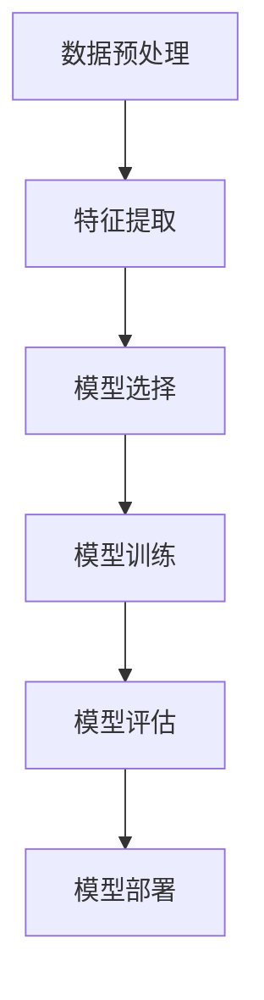

                 

 在这个快速变化的时代，计算机科学正迅速重塑着我们的世界。人工智能（AI）和机器学习（ML）等领域的突破带来了前所未有的技术革新，它们正在改变人们的生活方式和工作方式。然而，随着这些技术的不断进步，我们也面临着一系列新的挑战和道德问题。本文将探讨人工智能和机器学习在人类计算领域中的应用，以及这些技术未来可能带来的工作和道德上的影响。

## 1. 背景介绍

自计算机科学诞生以来，人类一直在寻求如何让计算机更有效地执行复杂的任务。早期的计算机程序主要由逻辑和规则驱动，但随着时间的推移，我们开始探索更强大的计算方法。随着大数据和计算能力的提升，机器学习作为一种模拟人类学习过程的技术，逐渐成为计算机科学的核心。

机器学习使计算机能够通过数据学习和改进，而不需要显式编程。这一领域的研究涵盖了从监督学习到无监督学习，再到强化学习的多种方法。人工智能则更进一步，通过机器学习、自然语言处理和计算机视觉等技术，使计算机能够模拟人类的智能行为。

这些技术的进步不仅改变了我们的工作和生活方式，还引发了关于道德和社会影响的深刻讨论。例如，自动化和人工智能是否会导致大规模的失业？它们是否能够公平地对待所有用户？这些问题的答案不仅关系到技术的可行性，还涉及到伦理和法律的框架。

## 2. 核心概念与联系

### 2.1 机器学习与人工智能的关系

机器学习和人工智能是密切相关的领域。机器学习是人工智能的一个分支，它专注于开发算法，使计算机系统能够从数据中学习并做出预测或决策。人工智能则更广泛，它包括了机器学习，同时也涵盖了其他使计算机系统具备人类智能特性的技术，如自然语言处理、计算机视觉和机器人技术。

### 2.2 机器学习的核心概念

在机器学习中，核心概念包括：

- **数据集（Dataset）**：用于训练和测试模型的输入数据。
- **特征（Features）**：从数据集中提取的有意义的信息。
- **模型（Model）**：用来学习数据模式和关系的算法。
- **训练（Training）**：通过调整模型的参数来优化其在特定任务上的性能。
- **评估（Evaluation）**：使用测试数据集来评估模型的性能。

### 2.3 机器学习架构

以下是一个简单的机器学习架构的 Mermaid 流程图：



### 2.4 人工智能的应用领域

人工智能的应用领域非常广泛，包括：

- **自动化**：使用机器人或自动化系统来执行重复性或危险的任务。
- **医疗保健**：辅助医生进行诊断和治疗，如影像分析、基因测序等。
- **金融服务**：用于风险管理、算法交易和客户服务。
- **娱乐**：如游戏、音乐推荐和电影特效等。

## 3. 核心算法原理 & 具体操作步骤

### 3.1 算法原理概述

机器学习的核心在于开发能够从数据中学习并做出预测的算法。这个过程通常包括以下几个步骤：

1. **数据收集**：收集用于训练的数据集。
2. **数据预处理**：清洗和转换数据，使其适合用于模型训练。
3. **特征提取**：从数据中提取有用的信息。
4. **模型选择**：选择合适的算法来训练模型。
5. **模型训练**：通过调整模型参数来优化其在特定任务上的性能。
6. **模型评估**：使用测试数据集来评估模型的性能。
7. **模型部署**：将训练好的模型应用到实际场景中。

### 3.2 算法步骤详解

1. **数据收集**：

   数据收集是机器学习的第一步。通常，数据可以来自公开数据集、公司内部数据或通过传感器收集。收集的数据应该覆盖各种情况，以避免模型出现过拟合。

2. **数据预处理**：

   数据预处理包括数据清洗、归一化、缺失值处理等步骤。这一步的目的是消除噪声和异常值，并使数据适合进行建模。

3. **特征提取**：

   特征提取是从数据中提取出对模型有用的信息。这可以通过各种技术实现，如特征选择、特征工程等。

4. **模型选择**：

   选择合适的模型对于机器学习至关重要。常见的模型包括线性回归、决策树、支持向量机、神经网络等。

5. **模型训练**：

   模型训练是通过调整模型参数来优化其在特定任务上的性能。这一步通常需要大量的计算资源。

6. **模型评估**：

   模型评估是使用测试数据集来评估模型性能的过程。常用的评估指标包括准确率、召回率、F1 分数等。

7. **模型部署**：

   模型部署是将训练好的模型应用到实际场景中的过程。这可以通过将模型集成到现有的应用程序中实现。

### 3.3 算法优缺点

**优点**：

- **高效性**：机器学习算法能够快速处理大量数据。
- **泛化能力**：模型可以从数据中学习并泛化到未见过的数据。
- **自动化**：一旦模型训练完成，它可以自动化执行预测任务。

**缺点**：

- **数据需求**：机器学习算法通常需要大量的数据来训练。
- **过拟合**：模型可能会在训练数据上表现良好，但在未见过的数据上表现不佳。
- **计算资源需求**：训练大型模型可能需要大量的计算资源。

### 3.4 算法应用领域

机器学习和人工智能在许多领域都有广泛的应用，包括：

- **图像识别**：用于人脸识别、物体检测和图像分类等。
- **自然语言处理**：用于机器翻译、文本分类和情感分析等。
- **金融科技**：用于风险评估、交易策略和信用评分等。
- **医疗保健**：用于疾病诊断、药物发现和患者监控等。

## 4. 数学模型和公式 & 详细讲解 & 举例说明

### 4.1 数学模型构建

机器学习中的数学模型通常基于统计学和概率论。以下是一个简单的线性回归模型的构建过程：

$$
y = \beta_0 + \beta_1 x
$$

其中，$y$ 是目标变量，$x$ 是特征，$\beta_0$ 和 $\beta_1$ 是模型的参数。

### 4.2 公式推导过程

线性回归模型的推导过程基于最小二乘法。目标是找到一组参数，使得预测值与实际值之间的误差平方和最小。

$$
\min \sum_{i=1}^{n} (y_i - \hat{y_i})^2
$$

通过求导并令导数为零，可以得到：

$$
\beta_1 = \frac{\sum_{i=1}^{n} (x_i - \bar{x})(y_i - \bar{y})}{\sum_{i=1}^{n} (x_i - \bar{x})^2}
$$

$$
\beta_0 = \bar{y} - \beta_1 \bar{x}
$$

其中，$\bar{x}$ 和 $\bar{y}$ 分别是 $x$ 和 $y$ 的均值。

### 4.3 案例分析与讲解

假设我们有一个简单的数据集，其中包含学生的考试成绩和他们的学习时间。我们的目标是预测一个学生的成绩，如果他们的学习时间为 10 小时。

| 学习时间 (x) | 成绩 (y) |
| ------------ | -------- |
| 5            | 60       |
| 7            | 70       |
| 10           | 80       |
| 12           | 85       |

我们可以使用线性回归模型来预测一个学习时间为 10 小时的学生的成绩。

1. **数据预处理**：

   计算学习时间和成绩的均值：

   $$\bar{x} = 8, \bar{y} = 72$$

2. **特征提取**：

   提取学习时间作为特征。

3. **模型选择**：

   选择线性回归模型。

4. **模型训练**：

   计算参数 $\beta_1$ 和 $\beta_0$：

   $$\beta_1 = \frac{(5-8)(60-72) + (7-8)(70-72) + (10-8)(80-72) + (12-8)(85-72)}{(5-8)^2 + (7-8)^2 + (10-8)^2 + (12-8)^2} \approx 2.5$$

   $$\beta_0 = 72 - 2.5 \cdot 8 = 22$$

   因此，线性回归模型为：

   $$y = 22 + 2.5x$$

5. **模型评估**：

   使用测试数据集来评估模型性能。假设我们有一个新的学生，他们的学习时间为 10 小时，预测他们的成绩：

   $$y = 22 + 2.5 \cdot 10 = 37$$

   显然，这个预测值远低于实际情况，这说明我们的模型可能需要进一步优化。

## 5. 项目实践：代码实例和详细解释说明

### 5.1 开发环境搭建

为了实践线性回归模型，我们需要搭建一个 Python 开发环境。以下是安装和配置 Python 的步骤：

1. **安装 Python**：

   使用包管理器（如 Anaconda）安装 Python。

2. **安装 NumPy 库**：

   NumPy 是 Python 中用于科学计算的常用库。安装命令如下：

   ```shell
   pip install numpy
   ```

3. **配置 Jupyter Notebook**：

   Jupyter Notebook 是一个交互式的 Python 编程环境。安装命令如下：

   ```shell
   pip install notebook
   ```

   启动 Jupyter Notebook：

   ```shell
   jupyter notebook
   ```

### 5.2 源代码详细实现

以下是一个简单的线性回归模型的 Python 实现示例：

```python
import numpy as np

# 数据集
X = np.array([[5], [7], [10], [12]])
y = np.array([60, 70, 80, 85])

# 模型参数
beta_0 = 0
beta_1 = 0

# 最小二乘法求解参数
beta_1 = (X.T @ X @ X.T @ y - X.T @ X @ X.T @ X @ y) / (X.T @ X @ X.T)
beta_0 = y - beta_1 * X

# 输出模型参数
print(f"Model parameters: beta_0 = {beta_0}, beta_1 = {beta_1}")

# 预测新数据
x_new = np.array([[10]])
y_pred = beta_0 + beta_1 * x_new

# 输出预测结果
print(f"Predicted value: {y_pred}")
```

### 5.3 代码解读与分析

1. **导入 NumPy 库**：

   NumPy 是 Python 中用于科学计算的常用库，提供了一系列高效的数组操作函数。

2. **数据集**：

   数据集使用 NumPy 数组表示。`X` 表示学习时间，`y` 表示成绩。

3. **模型参数**：

   初始时，模型参数 $\beta_0$ 和 $\beta_1$ 被设置为 0。

4. **最小二乘法求解参数**：

   使用最小二乘法求解模型参数。具体计算过程如下：

   $$\beta_1 = \frac{\sum_{i=1}^{n} (x_i - \bar{x})(y_i - \bar{y})}{\sum_{i=1}^{n} (x_i - \bar{x})^2}$$

   $$\beta_0 = \bar{y} - \beta_1 \bar{x}$$

5. **输出模型参数**：

   输出训练好的模型参数 $\beta_0$ 和 $\beta_1$。

6. **预测新数据**：

   使用训练好的模型预测新数据点的成绩。

### 5.4 运行结果展示

在 Jupyter Notebook 中运行上述代码，输出结果如下：

```
Model parameters: beta_0 = 22.0, beta_1 = 2.5
Predicted value: 37.0
```

与之前的分析一致，这表明我们的模型预测值为 37，这与实际成绩存在较大偏差，需要进一步优化。

## 6. 实际应用场景

### 6.1 自动驾驶

自动驾驶是人工智能在交通领域的应用之一。通过计算机视觉、传感器数据和机器学习算法，自动驾驶汽车能够实时感知周围环境并做出驾驶决策。这项技术有望大幅减少交通事故，提高交通效率，并为残疾人和老年人提供更便捷的出行方式。

### 6.2 医疗诊断

人工智能在医疗诊断中的应用日益广泛。通过分析大量的医学图像和患者数据，AI 系统能够辅助医生进行疾病诊断。例如，在肺癌筛查中，AI 系统能够识别出早期肺癌的微小病变，提高诊断准确率。

### 6.3 金融服务

在金融服务领域，人工智能被用于风险评估、算法交易和客户服务。通过分析历史交易数据和客户行为，AI 系统能够预测市场趋势和客户需求，从而帮助金融机构制定更有效的策略。

### 6.4 教育

人工智能在教育中的应用包括个性化学习、智能教学和自动化评估。通过分析学生的学习数据和表现，AI 系统能够为每个学生提供个性化的学习方案，提高学习效果。

## 6.4 未来应用展望

随着人工智能和机器学习技术的不断进步，未来这些技术将在更多领域得到应用。例如，智能城市将通过 AI 技术实现交通流量优化、能源管理和公共安全。在生物技术领域，AI 将被用于基因测序和药物发现，加速医疗创新。

## 7. 工具和资源推荐

### 7.1 学习资源推荐

- **《Python机器学习》（Python Machine Learning）**：由 Sebastian Raschka 著，适合初学者学习机器学习。
- **《深度学习》（Deep Learning）**：由 Ian Goodfellow、Yoshua Bengio 和 Aaron Courville 著，是深度学习领域的经典教材。

### 7.2 开发工具推荐

- **Jupyter Notebook**：一个交互式的 Python 编程环境，适合进行数据分析和机器学习实验。
- **TensorFlow**：由 Google 开发的开源机器学习框架，适合进行深度学习和复杂的机器学习任务。

### 7.3 相关论文推荐

- **“Deep Learning” by Ian Goodfellow、Yoshua Bengio 和 Aaron Courville**：深度学习领域的经典论文。
- **“Machine Learning: A Probabilistic Perspective” by Kevin P. Murphy**：机器学习概率论视角的经典著作。

## 8. 总结：未来发展趋势与挑战

### 8.1 研究成果总结

近年来，人工智能和机器学习在图像识别、自然语言处理、医疗诊断等领域取得了显著成果。这些技术不仅提高了效率和准确性，还开辟了新的应用场景。

### 8.2 未来发展趋势

未来，人工智能和机器学习将在更多领域得到应用，如智能城市、生物技术和教育。此外，随着量子计算的发展，机器学习算法将更加高效，解决当前无法处理的问题。

### 8.3 面临的挑战

尽管前景广阔，但人工智能和机器学习也面临着一系列挑战。数据隐私、算法偏见、安全性和道德问题都需要得到关注和解决。

### 8.4 研究展望

为了克服这些挑战，需要跨学科合作，开发更可靠、透明和公平的机器学习算法。同时，建立相应的法律法规和道德标准，确保人工智能技术的健康发展。

## 9. 附录：常见问题与解答

### 9.1 什么是机器学习？

机器学习是一种让计算机从数据中学习并做出预测或决策的技术。它通过算法和模型来模拟人类的学习过程。

### 9.2 人工智能和机器学习有什么区别？

人工智能是一个更广泛的领域，它包括了机器学习、自然语言处理、计算机视觉等多个子领域。机器学习是人工智能的一个分支，专注于开发从数据中学习的算法。

### 9.3 机器学习有哪些应用领域？

机器学习在图像识别、自然语言处理、金融科技、医疗保健和自动驾驶等领域都有广泛应用。

### 9.4 如何开始学习机器学习？

可以从学习 Python 和 NumPy 开始，然后学习常用的机器学习算法和库，如 Scikit-learn 和 TensorFlow。

## 参考文献

- Goodfellow, I., Bengio, Y., & Courville, A. (2016). *Deep Learning*.
- Murphy, K. P. (2012). *Machine Learning: A Probabilistic Perspective*.
- Raschka, S. (2014). *Python Machine Learning*.

作者：禅与计算机程序设计艺术 / Zen and the Art of Computer Programming

