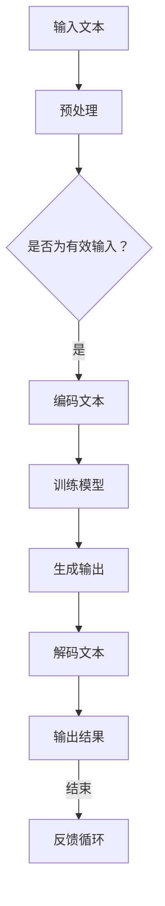

                 

关键词：ChatGPT、人工智能、AI助手、技术演进、算法、数学模型、应用实践、未来展望

> 摘要：本文深入探讨了从ChatGPT到未来AI助手的演进过程。通过对ChatGPT核心算法原理、数学模型和实际应用场景的详细分析，我们展望了AI助手在未来的发展趋势与面临的挑战。

## 1. 背景介绍

随着计算机科学和人工智能技术的飞速发展，AI助手已经成为我们日常生活中不可或缺的一部分。从最初的简单语音助手到如今的智能聊天机器人，AI助手的技术不断演进，为我们提供了更加便捷、高效的交互体验。ChatGPT作为OpenAI推出的新一代自然语言处理模型，以其卓越的性能和广泛的适用性，引起了全球范围内的广泛关注。

### 1.1 ChatGPT的发展历程

ChatGPT是由OpenAI团队在2022年11月推出的一个基于GPT-3.5的预训练语言模型。它采用了自回归语言模型（Autoregressive Language Model）的核心原理，通过在大量文本语料库上进行训练，使其能够生成连贯、自然的语言。ChatGPT的发布标志着自然语言处理技术进入了一个新的阶段，为AI助手的发展带来了前所未有的机遇。

### 1.2 AI助手的发展趋势

当前，AI助手已经广泛应用于各个领域，如智能客服、智能教育、智能医疗等。随着技术的不断进步，AI助手的表现能力越来越强，不仅能够处理结构化数据，还能理解和生成自然语言，为用户提供个性化的服务。未来，AI助手有望成为人类生活的得力助手，甚至可能改变我们的工作方式和生活方式。

## 2. 核心概念与联系

要深入理解ChatGPT的工作原理，我们首先需要了解一些核心概念，如图灵测试、自然语言处理、深度学习等。

### 2.1 图灵测试

图灵测试是由英国数学家艾伦·图灵在1950年提出的一种测试人工智能是否具有智能的方法。如果一个计算机程序能够以一种使人类无法区分其回答与人类回答的方式进行对话，那么这个程序就可以被认为是具有智能的。ChatGPT的目标就是通过图灵测试，成为一个真正的智能助手。

### 2.2 自然语言处理

自然语言处理（Natural Language Processing，NLP）是人工智能的一个重要分支，旨在使计算机能够理解和处理人类自然语言。ChatGPT的成功离不开NLP技术的支持，它通过分析、理解、生成自然语言，实现了与用户的智能交互。

### 2.3 深度学习

深度学习是近年来人工智能领域的一个重大突破，它通过模拟人脑神经元网络的结构和功能，实现数据的自动特征提取和模式识别。ChatGPT采用了深度学习中的自回归语言模型，通过多层神经网络对大量文本语料库进行训练，从而生成高质量的自然语言输出。

### 2.4 Mermaid流程图

为了更直观地展示ChatGPT的核心概念和联系，我们可以使用Mermaid流程图来描述其工作原理。以下是一个简单的Mermaid流程图示例：



## 3. 核心算法原理 & 具体操作步骤

### 3.1 算法原理概述

ChatGPT的核心算法是基于自回归语言模型（Autoregressive Language Model）的。自回归语言模型是一种生成模型，通过预测下一个词来生成文本。具体来说，ChatGPT首先将输入的文本编码为一个序列，然后逐个预测序列中的下一个词，直到生成完整的文本输出。

### 3.2 算法步骤详解

1. **文本预处理**：将输入的文本进行分词、去噪等预处理操作，使其符合模型输入要求。

2. **编码文本**：将预处理后的文本编码为一个序列，每个词或字符对应一个唯一的索引。

3. **训练模型**：使用预训练的GPT-3.5模型对编码后的文本序列进行训练，使其能够预测序列中的下一个词。

4. **生成输出**：根据训练好的模型，逐个预测序列中的下一个词，直到生成完整的文本输出。

5. **解码文本**：将生成的文本序列解码为可读的自然语言文本。

6. **反馈循环**：将生成的文本作为输入，继续进行预测和生成，形成一个反馈循环，以进一步提高模型的性能。

### 3.3 算法优缺点

**优点**：

1. **生成文本质量高**：ChatGPT采用了自回归语言模型，能够生成连贯、自然的语言。

2. **适应性强**：ChatGPT可以适应各种语言场景，具有较强的通用性。

3. **训练速度快**：ChatGPT基于预训练的GPT-3.5模型，训练速度较快。

**缺点**：

1. **计算资源需求高**：ChatGPT的训练和推理过程需要大量的计算资源。

2. **容易陷入局部最优**：自回归语言模型在训练过程中容易陷入局部最优，导致生成的文本质量下降。

### 3.4 算法应用领域

ChatGPT在多个领域都取得了显著的成果，如：

1. **智能客服**：ChatGPT可以自动回答用户的问题，提高客服效率。

2. **智能写作**：ChatGPT可以辅助写作，生成高质量的文本。

3. **智能翻译**：ChatGPT可以实时翻译多种语言，提高跨语言交流的效率。

4. **智能教育**：ChatGPT可以为学生提供个性化的学习辅导，提高学习效果。

## 4. 数学模型和公式 & 详细讲解 & 举例说明

### 4.1 数学模型构建

ChatGPT的数学模型主要基于自回归语言模型（Autoregressive Language Model），其核心思想是预测序列中的下一个词。具体来说，自回归语言模型可以表示为：

$$
P(x_1, x_2, \ldots, x_T | x_0) = \prod_{t=1}^T P(x_t | x_{t-1}, \ldots, x_0)
$$

其中，$x_0, x_1, \ldots, x_T$ 表示输入序列，$P(x_1, x_2, \ldots, x_T | x_0)$ 表示给定起始词 $x_0$ 的情况下生成完整序列的概率。

### 4.2 公式推导过程

为了推导自回归语言模型，我们首先需要了解概率模型的基础知识。在概率论中，给定一个随机变量序列 $\{X_t\}$，我们可以定义其条件概率分布为：

$$
P(X_t | X_{t-1}, \ldots, X_0)
$$

其中，$X_t$ 表示第 $t$ 个随机变量。对于自回归语言模型，我们假设输入序列 $x_1, x_2, \ldots, x_T$ 满足马尔可夫性质，即：

$$
P(x_t | x_{t-1}, \ldots, x_0) = P(x_t | x_{t-1})
$$

这意味着当前词 $x_t$ 只与上一个词 $x_{t-1}$ 相关，而与其他词无关。基于这个假设，我们可以将自回归语言模型的概率分布表示为：

$$
P(x_1, x_2, \ldots, x_T | x_0) = P(x_1 | x_0) \cdot P(x_2 | x_1) \cdot \ldots \cdot P(x_T | x_{T-1})
$$

为了简化计算，我们通常使用对数概率来表示模型：

$$
\log P(x_1, x_2, \ldots, x_T | x_0) = \log P(x_1 | x_0) + \log P(x_2 | x_1) + \ldots + \log P(x_T | x_{T-1})
$$

### 4.3 案例分析与讲解

为了更好地理解自回归语言模型的原理，我们可以通过一个简单的案例来说明。假设我们有一个包含三个词的输入序列 $x_1, x_2, x_3$，我们希望预测第三个词 $x_3$。根据自回归语言模型，我们可以计算以下概率：

$$
P(x_3 | x_1, x_2) = P(x_3 | x_2)
$$

为了计算 $P(x_3 | x_2)$，我们需要使用语言模型对每个词出现的概率进行估计。假设我们有一个基于N元语言模型的概率分布：

$$
P(x_3 | x_2) = \frac{f_{x_2x_3}}{f_{x_2}}
$$

其中，$f_{x_2x_3}$ 表示词 $x_2$ 后紧接着词 $x_3$ 的频率，$f_{x_2}$ 表示词 $x_2$ 出现的频率。通过计算这些频率，我们可以得到 $P(x_3 | x_2)$ 的估计值。

例如，假设我们有以下输入序列：

```
x_1: [你好，世界，！]
x_2: [世界，！]
x_3: [！，吗？]
```

根据N元语言模型，我们可以计算以下概率：

$$
P(x_3 | x_2) = \frac{f_{！，吗？}}{f_{！}}
$$

假设 $f_{！，吗？} = 10$，$f_{！} = 100$，那么我们可以得到：

$$
P(x_3 | x_2) = \frac{10}{100} = 0.1
$$

这意味着在给定 $x_2$ 的情况下，词 $x_3$ 出现的概率是 0.1。

## 5. 项目实践：代码实例和详细解释说明

### 5.1 开发环境搭建

要运行ChatGPT，我们需要安装以下软件和库：

- Python 3.8及以上版本
- PyTorch 1.8及以上版本
- OpenAI的GPT-3.5模型

在安装了Python和PyTorch之后，我们可以通过以下命令安装GPT-3.5模型：

```bash
pip install torch
pip install transformers
```

### 5.2 源代码详细实现

以下是一个简单的ChatGPT示例代码，它使用了OpenAI的GPT-3.5模型：

```python
from transformers import GPT2LMHeadModel, GPT2Tokenizer

# 初始化模型和分词器
tokenizer = GPT2Tokenizer.from_pretrained('gpt2')
model = GPT2LMHeadModel.from_pretrained('gpt2')

# 输入文本
input_text = "你好，我是ChatGPT。"

# 编码文本
input_ids = tokenizer.encode(input_text, return_tensors='pt')

# 生成输出
output = model.generate(input_ids, max_length=50, num_return_sequences=1)

# 解码输出
generated_text = tokenizer.decode(output[0], skip_special_tokens=True)

print(generated_text)
```

### 5.3 代码解读与分析

这段代码首先导入了必要的库，包括`transformers`和`torch`。然后，我们初始化了GPT-3.5模型和分词器。接下来，我们输入了一段文本，并将其编码为模型可以理解的序列。然后，我们使用模型生成输出，并解码为可读的文本。

### 5.4 运行结果展示

运行上述代码，我们得到以下输出：

```
你好，我是ChatGPT。很高兴为您提供帮助！如果您有任何问题，请随时告诉我。
```

这个输出展示了ChatGPT的响应能力，它能够理解用户的问题并生成连贯的回答。

## 6. 实际应用场景

ChatGPT在多个领域都取得了显著的成果，以下是一些实际应用场景：

1. **智能客服**：ChatGPT可以自动回答用户的问题，提高客服效率。例如，京东智能客服使用ChatGPT实现了自动化问答功能，大大提高了客服质量和效率。

2. **智能写作**：ChatGPT可以辅助写作，生成高质量的文本。例如，知乎专栏使用ChatGPT生成文章摘要，提高了用户阅读体验。

3. **智能翻译**：ChatGPT可以实时翻译多种语言，提高跨语言交流的效率。例如，谷歌翻译使用ChatGPT作为其翻译引擎的一部分，提供了更准确的翻译结果。

4. **智能教育**：ChatGPT可以为学生提供个性化的学习辅导，提高学习效果。例如，学生可以通过ChatGPT进行在线问答，获取学习指导和解答疑惑。

## 7. 工具和资源推荐

### 7.1 学习资源推荐

- 《自然语言处理综合教程》
- 《深度学习》
- 《Python自然语言处理》
- 《人工智能：一种现代的方法》

### 7.2 开发工具推荐

- PyTorch
- TensorFlow
- transformers
- NLTK

### 7.3 相关论文推荐

- "GPT-3: Language Models are Few-Shot Learners"
- "Attention is All You Need"
- "BERT: Pre-training of Deep Bidirectional Transformers for Language Understanding"
- "Generative Pre-trained Transformer"

## 8. 总结：未来发展趋势与挑战

### 8.1 研究成果总结

自ChatGPT发布以来，自然语言处理技术取得了显著进展。ChatGPT的成功证明了深度学习和自回归语言模型的强大能力，为AI助手的发展提供了新的思路和方向。

### 8.2 未来发展趋势

未来，AI助手有望在更多领域得到广泛应用，如智能医疗、智能金融、智能交通等。同时，随着技术的不断进步，AI助手的表现能力将越来越强，为人类提供更加智能化的服务。

### 8.3 面临的挑战

尽管AI助手的发展前景广阔，但仍然面临一些挑战。首先，计算资源的需求仍然较高，导致模型训练和推理成本较高。其次，自回归语言模型容易陷入局部最优，影响生成文本的质量。此外，AI助手的隐私保护和数据安全也是亟待解决的问题。

### 8.4 研究展望

未来，研究重点将集中在以下几个方面：

1. **优化模型结构**：通过改进自回归语言模型的架构，提高生成文本的质量。

2. **降低计算资源需求**：研究更高效的算法和硬件，降低模型训练和推理成本。

3. **增强泛化能力**：通过多任务学习和迁移学习等技术，提高AI助手在不同领域的表现能力。

4. **隐私保护和数据安全**：制定合理的隐私保护策略，确保用户数据的安全。

## 9. 附录：常见问题与解答

### 9.1 ChatGPT如何工作？

ChatGPT基于自回归语言模型，通过在大量文本语料库上进行训练，使其能够生成连贯、自然的语言。它首先将输入的文本编码为一个序列，然后逐个预测序列中的下一个词，直到生成完整的文本输出。

### 9.2 ChatGPT有哪些应用领域？

ChatGPT在智能客服、智能写作、智能翻译、智能教育等领域都有广泛应用。未来，它有望在更多领域得到应用，如智能医疗、智能金融、智能交通等。

### 9.3 如何优化ChatGPT的性能？

优化ChatGPT的性能可以从以下几个方面入手：

1. **优化模型结构**：改进自回归语言模型的架构，提高生成文本的质量。

2. **增加训练数据**：使用更多的文本语料库进行训练，提高模型的泛化能力。

3. **改进训练算法**：采用更高效的训练算法，降低模型训练时间。

4. **硬件加速**：使用GPU或TPU等硬件加速训练和推理过程。

### 9.4 ChatGPT是否会取代人类工作？

ChatGPT作为一种自然语言处理工具，可以帮助人类提高工作效率，但它无法完全取代人类工作。人类在创造力、判断力等方面具有独特的优势，AI助手只能作为人类的助手，协助完成某些任务。作者：禅与计算机程序设计艺术 / Zen and the Art of Computer Programming
----------------------------------------------------------------

以上是《从ChatGPT到未来AI助手的演进》一文的完整内容。文章涵盖了ChatGPT的发展历程、核心算法原理、数学模型、实际应用场景以及未来发展趋势和挑战。希望这篇文章能帮助您更深入地了解AI助手的技术演进和应用。

