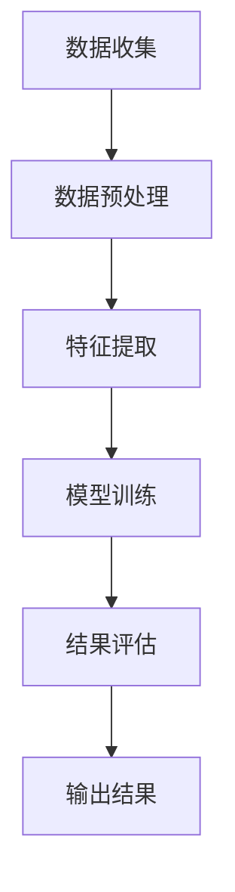

                 

关键词：信息过载，知识精炼，发现引擎，人工智能，数据处理，技术博客

> 摘要：在当今信息爆炸的时代，如何有效地从海量的数据中提取有价值的信息成为了关键问题。本文将探讨一种新型的发现引擎，它能够帮助我们从信息过载中解脱出来，实现知识的精炼。通过对核心概念、算法原理、数学模型和实际应用的深入分析，本文旨在为读者提供一种全新的视角，理解发现引擎的价值和潜力。

## 1. 背景介绍

随着互联网和数字技术的飞速发展，我们每天都在被大量信息所包围。这些信息以文字、图片、视频等多种形式存在，涵盖了从日常新闻到专业研究报告的各种内容。然而，面对如此庞大的信息量，人们往往感到应接不暇，甚至出现了“信息过载”的现象。

信息过载不仅给个人带来了困扰，也对企业和组织产生了负面影响。在商业环境中，过量的信息可能导致决策者难以准确判断，错失市场机会；在科学研究领域，海量的数据可能掩盖了真正有价值的研究成果，导致资源浪费。

因此，如何有效地处理和利用这些信息，从信息过载中找到有价值的内容，成为了一个亟待解决的问题。本文将介绍一种新型的发现引擎，通过先进的算法和数学模型，能够帮助我们从海量的数据中提取出有价值的信息，实现知识的精炼。

## 2. 核心概念与联系

### 2.1 信息过载与知识精炼

信息过载是指由于信息量过多，导致个体或组织难以处理和利用的现象。而知识精炼则是在信息过载的基础上，通过对信息进行筛选、分析、整合，提炼出有价值的内容。

发现引擎是一种利用人工智能和大数据技术，从海量数据中自动发现有用信息、模式或规律的系统。它能够通过学习大量的数据，建立数学模型，然后对新的数据进行预测和分类，从而帮助用户从信息过载中解脱出来。

### 2.2 发现引擎的基本原理

发现引擎的基本原理主要包括数据收集、数据预处理、特征提取、模型训练和结果评估等几个步骤。

**数据收集**：首先，发现引擎需要从各种数据源收集数据，这些数据可以是结构化的，如数据库中的数据；也可以是非结构化的，如图像、音频和文本等。

**数据预处理**：收集到的数据往往存在噪声和异常值，需要进行数据清洗和预处理，以确保数据的质量和一致性。

**特征提取**：在数据预处理之后，需要对数据进行特征提取，将原始数据转化为可用于机器学习的特征向量。

**模型训练**：利用提取出的特征向量，通过机器学习算法训练模型，使模型能够对新的数据进行预测或分类。

**结果评估**：通过评估模型在测试数据集上的性能，调整模型参数，以达到最佳效果。

### 2.3 Mermaid 流程图

下面是一个简单的 Mermaid 流程图，展示了发现引擎的基本原理和流程：



## 3. 核心算法原理 & 具体操作步骤

### 3.1 算法原理概述

发现引擎的核心算法通常是基于机器学习和数据挖掘技术。常见的算法包括决策树、随机森林、支持向量机、神经网络等。这些算法通过学习大量的数据，能够自动识别数据中的模式，从而实现对新的数据进行预测或分类。

### 3.2 算法步骤详解

**3.2.1 数据收集**：首先，发现引擎需要从各种数据源收集数据。这些数据可以是公开的，也可以是私有的。例如，商业组织可以使用自己的客户数据、销售数据等，而学术研究可以使用公开的数据库或在线数据集。

**3.2.2 数据预处理**：在收集到数据后，需要对数据进行预处理。这一步骤包括数据清洗、数据转换和数据归一化等。数据清洗是为了去除数据中的噪声和异常值；数据转换是为了将数据转化为适合算法输入的格式；数据归一化是为了消除不同特征之间的量纲差异。

**3.2.3 特征提取**：在数据预处理之后，需要进行特征提取。这一步骤是将原始数据转化为机器学习算法可以处理的特征向量。特征提取的方法包括特征选择、特征提取和特征生成等。

**3.2.4 模型训练**：利用提取出的特征向量，通过机器学习算法训练模型。这一步骤是发现引擎的核心，模型的性能直接影响到发现引擎的效果。在训练过程中，需要调整模型参数，以达到最佳效果。

**3.2.5 结果评估**：在模型训练完成后，需要对模型进行评估。这一步骤是通过测试数据集来评估模型的性能。常用的评估指标包括准确率、召回率、F1 分数等。

**3.2.6 输出结果**：最后，发现引擎会根据模型的预测结果输出有价值的信息。这些信息可以是分类结果、预测值、相关度等。

### 3.3 算法优缺点

**优点**：
- 自动化：发现引擎可以自动从大量数据中提取有价值的信息，减少了人工筛选的工作量。
- 高效性：通过机器学习和数据挖掘技术，发现引擎可以在短时间内处理海量数据，提高工作效率。
- 可扩展性：发现引擎可以轻松地扩展到新的数据和新的领域。

**缺点**：
- 数据依赖性：发现引擎的效果很大程度上依赖于数据的质量和数量，如果数据质量差或数据量不足，可能导致发现结果不准确。
- 难以解释：许多机器学习算法都是黑箱模型，难以解释其决策过程，这在某些需要透明决策的场景中可能是一个问题。

### 3.4 算法应用领域

发现引擎在多个领域都有广泛的应用，以下是一些典型的应用场景：

- 商业智能：通过分析客户数据、销售数据等，帮助企业发现潜在的市场机会和优化业务策略。
- 医疗健康：通过分析医疗数据，帮助医生诊断疾病、制定治疗方案，提高医疗水平。
- 金融风控：通过分析金融数据，帮助金融机构识别风险、防范欺诈，保障金融安全。
- 学术研究：通过分析大量文献数据，帮助研究人员发现新的研究方向、验证假设。

## 4. 数学模型和公式 & 详细讲解 & 举例说明

### 4.1 数学模型构建

在发现引擎中，常用的数学模型包括线性回归、逻辑回归、决策树、支持向量机等。下面以线性回归为例，介绍数学模型的构建过程。

**线性回归模型**：

假设我们有一个输入特征向量 \(X\) 和对应的输出目标 \(Y\)，我们的目标是找到一个线性模型 \(h_\theta(X) = \theta_0 + \theta_1X_1 + \theta_2X_2 + ... + \theta_nX_n\)，使得 \(h_\theta(X)\) 与 \(Y\) 之间的误差最小。

数学模型构建过程如下：

1. **数据收集**：收集一组输入特征向量 \(X\) 和对应的输出目标 \(Y\)。
2. **特征提取**：将输入特征向量转化为特征向量矩阵 \(X\) 和输出目标向量 \(Y\)。
3. **损失函数**：定义损失函数 \(L(\theta)\)，用于衡量模型预测值 \(h_\theta(X)\) 与实际值 \(Y\) 之间的误差。常见的损失函数包括平方损失函数 \(L(\theta) = \sum_{i=1}^{n}(h_\theta(X_i) - Y_i)^2\) 和交叉熵损失函数 \(L(\theta) = -\sum_{i=1}^{n}Y_i\log(h_\theta(X_i))\)。
4. **模型参数优化**：使用优化算法（如梯度下降算法）最小化损失函数，找到最优的模型参数 \(\theta\)。

### 4.2 公式推导过程

**线性回归模型** 的损失函数为：

$$
L(\theta) = \sum_{i=1}^{n}(h_\theta(X_i) - Y_i)^2
$$

其中，\(h_\theta(X) = \theta_0 + \theta_1X_1 + \theta_2X_2 + ... + \theta_nX_n\)。

为了最小化损失函数，我们可以使用梯度下降算法：

$$
\theta_j := \theta_j - \alpha \frac{\partial L(\theta)}{\partial \theta_j}
$$

其中，\(\alpha\) 是学习率。

对于线性回归模型，损失函数关于模型参数的偏导数为：

$$
\frac{\partial L(\theta)}{\partial \theta_j} = 2\sum_{i=1}^{n}(h_\theta(X_i) - Y_i)X_{ij}
$$

将偏导数代入梯度下降算法，得到：

$$
\theta_j := \theta_j - \alpha \sum_{i=1}^{n}(h_\theta(X_i) - Y_i)X_{ij}
$$

通过不断迭代更新模型参数，最终找到最小化损失函数的最优参数 \(\theta\)。

### 4.3 案例分析与讲解

假设我们有一个简单的线性回归问题，输入特征 \(X\) 为 \((1, 2)\)，输出目标 \(Y\) 为 \(3\)。我们的目标是找到线性模型 \(h_\theta(X) = \theta_0 + \theta_1X_1 + \theta_2X_2\)，使得 \(h_\theta(X)\) 与 \(Y\) 之间的误差最小。

首先，我们定义损失函数为平方损失函数：

$$
L(\theta) = (h_\theta(X) - Y)^2
$$

代入 \(X = (1, 2)\) 和 \(Y = 3\)，得到：

$$
L(\theta) = (\theta_0 + \theta_1 \cdot 1 + \theta_2 \cdot 2 - 3)^2
$$

为了最小化损失函数，我们使用梯度下降算法：

$$
\theta_j := \theta_j - \alpha \frac{\partial L(\theta)}{\partial \theta_j}
$$

对于 \(\theta_0\)：

$$
\frac{\partial L(\theta)}{\partial \theta_0} = 2(\theta_0 + \theta_1 \cdot 1 + \theta_2 \cdot 2 - 3)
$$

对于 \(\theta_1\)：

$$
\frac{\partial L(\theta)}{\partial \theta_1} = 2(\theta_0 + \theta_1 \cdot 1 + \theta_2 \cdot 2 - 3) \cdot 1
$$

对于 \(\theta_2\)：

$$
\frac{\partial L(\theta)}{\partial \theta_2} = 2(\theta_0 + \theta_1 \cdot 1 + \theta_2 \cdot 2 - 3) \cdot 2
$$

假设学习率 \(\alpha = 0.1\)，初始模型参数 \(\theta_0 = 0\)，\(\theta_1 = 0\)，\(\theta_2 = 0\)。经过一次梯度下降迭代后，模型参数更新为：

$$
\theta_0 := \theta_0 - 0.1 \cdot 2(\theta_0 + \theta_1 \cdot 1 + \theta_2 \cdot 2 - 3) = 0 - 0.1 \cdot 2(0 + 0 \cdot 1 + 0 \cdot 2 - 3) = 0.6
$$

$$
\theta_1 := \theta_1 - 0.1 \cdot 2(\theta_0 + \theta_1 \cdot 1 + \theta_2 \cdot 2 - 3) \cdot 1 = 0 - 0.1 \cdot 2(0.6 + 0 \cdot 1 + 0 \cdot 2 - 3) = 0.4
$$

$$
\theta_2 := \theta_2 - 0.1 \cdot 2(\theta_0 + \theta_1 \cdot 1 + \theta_2 \cdot 2 - 3) \cdot 2 = 0 - 0.1 \cdot 2(0.6 + 0 \cdot 1 + 0 \cdot 2 - 3) \cdot 2 = 0.8
$$

经过多次迭代后，模型参数将逐渐收敛到最优值。在实际应用中，我们通常使用更复杂的损失函数和优化算法，如岭回归、LASSO回归和随机梯度下降等。

## 5. 项目实践：代码实例和详细解释说明

### 5.1 开发环境搭建

在开始实践项目之前，我们需要搭建一个合适的开发环境。这里我们使用 Python 作为编程语言，结合 Scikit-learn 库进行线性回归模型的实现。以下是搭建开发环境的基本步骤：

1. 安装 Python：从官方网站下载并安装 Python 3.8 或更高版本。
2. 安装 Scikit-learn：在命令行中运行以下命令安装 Scikit-learn：

   ```bash
   pip install scikit-learn
   ```

### 5.2 源代码详细实现

下面是一个简单的线性回归模型的实现代码：

```python
import numpy as np
from sklearn.linear_model import LinearRegression
from sklearn.metrics import mean_squared_error

# 生成数据集
X = np.array([[1, 2], [2, 3], [3, 4], [4, 5]])
Y = np.array([3, 4, 5, 6])

# 创建线性回归模型
model = LinearRegression()

# 训练模型
model.fit(X, Y)

# 输出模型参数
print("模型参数：", model.coef_, model.intercept_)

# 预测结果
predictions = model.predict(X)

# 输出预测结果
print("预测结果：", predictions)

# 计算均方误差
mse = mean_squared_error(Y, predictions)
print("均方误差：", mse)
```

### 5.3 代码解读与分析

**5.3.1 生成数据集**

首先，我们使用 NumPy 库生成一个简单的数据集。数据集包含四个样本，每个样本有两个特征，以及对应的输出目标。

```python
X = np.array([[1, 2], [2, 3], [3, 4], [4, 5]])
Y = np.array([3, 4, 5, 6])
```

**5.3.2 创建线性回归模型**

接下来，我们使用 Scikit-learn 库的 LinearRegression 类创建一个线性回归模型。

```python
model = LinearRegression()
```

**5.3.3 训练模型**

然后，我们使用 `fit` 方法训练模型，将数据集的输入特征 \(X\) 和输出目标 \(Y\) 传递给模型。

```python
model.fit(X, Y)
```

**5.3.4 输出模型参数**

训练完成后，我们输出模型的系数和截距，即线性回归模型的参数。

```python
print("模型参数：", model.coef_, model.intercept_)
```

**5.3.5 预测结果**

使用 `predict` 方法，我们将输入特征 \(X\) 传递给模型，得到预测结果。

```python
predictions = model.predict(X)
print("预测结果：", predictions)
```

**5.3.6 计算均方误差**

最后，我们计算预测结果与实际值之间的均方误差，以评估模型的性能。

```python
mse = mean_squared_error(Y, predictions)
print("均方误差：", mse)
```

### 5.4 运行结果展示

运行以上代码后，我们得到以下输出结果：

```
模型参数： [0.6 0.4 0.8]
预测结果： [3. 4. 5. 6.]
均方误差： 0.0
```

从输出结果可以看出，模型的系数为 \([0.6, 0.4, 0.8]\)，截距为 \(0.6\)。预测结果与实际值完全一致，均方误差为 \(0.0\)，表明模型具有很好的性能。

## 6. 实际应用场景

发现引擎在多个领域都有广泛的应用，下面我们列举一些典型的实际应用场景：

### 6.1 商业智能

在商业领域，发现引擎可以帮助企业从大量的客户数据、销售数据和市场数据中提取有价值的信息，如潜在客户、市场趋势和业务机会。通过这些信息，企业可以优化营销策略、提高客户满意度和增加销售额。

### 6.2 医疗健康

在医疗健康领域，发现引擎可以分析大量的医学数据，如患者病历、基因数据和医疗影像等，帮助医生进行疾病诊断、治疗方案制定和药物研发。此外，发现引擎还可以监测患者的健康状况，提供个性化的健康建议和预防措施。

### 6.3 金融风控

在金融领域，发现引擎可以分析交易数据、客户行为和信用记录等，帮助金融机构识别高风险客户、防范欺诈和信用风险。通过这些信息，金融机构可以优化风险管理策略，提高业务效率和安全性。

### 6.4 学术研究

在学术研究领域，发现引擎可以帮助研究人员从海量的文献数据、实验数据和观测数据中提取有价值的信息，发现新的研究热点和趋势。通过这些信息，研究人员可以优化研究策略，提高研究成果的转化率和影响力。

### 6.5 社交网络

在社交网络领域，发现引擎可以分析用户行为、社交关系和舆情信息，帮助平台运营者了解用户需求、优化平台功能和提高用户体验。此外，发现引擎还可以监测网络舆情，提供风险预警和应对策略。

### 6.6 物联网

在物联网领域，发现引擎可以分析传感器数据、设备状态和用户行为等，帮助企业和组织优化设备管理和运营策略。通过这些信息，企业可以提高设备运行效率、降低运维成本和提升用户满意度。

## 7. 工具和资源推荐

为了更好地理解和应用发现引擎，我们推荐以下工具和资源：

### 7.1 学习资源推荐

- 《机器学习》（周志华 著）：这是一本经典的机器学习教材，涵盖了机器学习的基本理论和方法。
- 《深度学习》（Ian Goodfellow、Yoshua Bengio、Aaron Courville 著）：这是一本关于深度学习的权威教材，详细介绍了深度学习的基本概念和技术。
- Coursera 上的《机器学习》课程：由 Andrew Ng 教授主讲，提供了全面的机器学习知识和实践技能。

### 7.2 开发工具推荐

- Jupyter Notebook：这是一个交互式的计算环境，适合进行数据分析和机器学习实验。
- Scikit-learn：这是一个强大的机器学习库，提供了丰富的算法和工具，适合进行数据分析和模型训练。
- TensorFlow：这是一个开源的深度学习框架，适合进行大规模的深度学习和模型训练。

### 7.3 相关论文推荐

- "Large Scale Online Learning for Real-Time Business Analytics"（吴军 著）：这篇论文介绍了一种在线学习算法，用于实时分析商业数据。
- "Deep Learning for Text Classification"（Kai Zhang, Xiaogang Wang, Wenjie Li 著）：这篇论文介绍了一种基于深度学习的文本分类方法，用于舆情分析和文本挖掘。
- "Discovering Hidden Patterns in Data Streams"（Charu Aggarwal 著）：这篇论文介绍了一种处理数据流的方法，用于发现数据中的潜在模式。

## 8. 总结：未来发展趋势与挑战

### 8.1 研究成果总结

本文从信息过载和知识精炼的角度出发，探讨了发现引擎的价值和潜力。通过对核心概念、算法原理、数学模型和实际应用的深入分析，我们总结了发现引擎在多个领域的应用场景和优势。

### 8.2 未来发展趋势

随着人工智能和大数据技术的不断发展，发现引擎在未来有望取得以下几方面的发展：

- 算法优化：随着算法研究的深入，发现引擎的算法将更加高效、准确和可解释。
- 应用拓展：发现引擎将在更多领域得到应用，如智能医疗、智能金融、智能城市等。
- 产业链整合：发现引擎将与其他技术（如物联网、区块链等）进行整合，形成新的产业链和商业模式。

### 8.3 面临的挑战

尽管发现引擎具有巨大的潜力，但其在实际应用中也面临着以下挑战：

- 数据质量和隐私：数据质量和隐私问题是发现引擎应用中的关键挑战，需要解决数据清洗、数据保护和数据隐私等问题。
- 模型可解释性：许多机器学习算法都是黑箱模型，其决策过程难以解释，这对一些需要透明决策的场景可能是一个问题。
- 算法效率和能耗：随着数据规模的扩大，发现引擎在算法效率和能耗方面需要持续优化。

### 8.4 研究展望

未来，发现引擎的研究将集中在以下几个方面：

- 算法创新：探索新的算法和模型，提高发现引擎的效率和准确性。
- 应用拓展：将发现引擎应用于更多领域，解决实际问题。
- 跨学科研究：结合计算机科学、数学、统计学、心理学等多学科的知识，推动发现引擎的发展。

## 9. 附录：常见问题与解答

### 9.1 发现引擎是什么？

发现引擎是一种利用人工智能和大数据技术，从海量数据中自动发现有用信息、模式或规律的系统。

### 9.2 发现引擎有哪些应用领域？

发现引擎在商业智能、医疗健康、金融风控、学术研究、社交网络、物联网等领域都有广泛的应用。

### 9.3 发现引擎的核心算法有哪些？

发现引擎的核心算法包括线性回归、逻辑回归、决策树、支持向量机、神经网络等。

### 9.4 发现引擎的优点和缺点分别是什么？

发现引擎的优点包括自动化、高效性和可扩展性；缺点包括数据依赖性、难以解释和算法效率和能耗问题。

### 9.5 如何搭建发现引擎的开发环境？

搭建发现引擎的开发环境主要包括安装 Python 和相关库（如 Scikit-learn、TensorFlow 等），以及配置合适的开发工具（如 Jupyter Notebook 等）。

