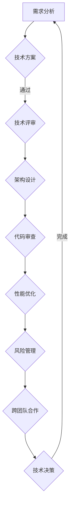

                 

关键词：全栈开发、技术架构师、职业进阶、软件开发、技术管理、架构设计

> 摘要：本文将探讨从全栈开发到技术架构师的职业发展路径。通过分析技术架构师的角色、所需技能和职业挑战，我们将为全栈开发者提供一条清晰的进阶之路，以及如何在不断变化的技术环境中保持竞争力。

## 1. 背景介绍

在当今的软件开发领域，全栈开发者的角色越来越受到重视。全栈开发者具备前端和后端开发技能，能够处理软件项目的各个方面，从用户界面设计到数据库管理。然而，随着项目的复杂性和规模的扩大，全栈开发者逐渐意识到，单纯的技术技能已经不足以应对大型项目的挑战。这时，技术架构师的角色应运而生。

技术架构师是负责指导软件开发过程中的技术决策，确保系统在性能、可扩展性和可靠性方面达到最佳状态的专业人员。他们不仅需要深入的技术知识，还需要具备优秀的沟通能力和项目管理能力，以协调不同团队之间的协作。

本文将详细探讨技术架构师的职责、所需技能和职业进阶路径，为全栈开发者提供有价值的参考。

## 2. 核心概念与联系

### 2.1 技术架构师的角色

技术架构师（Technical Architect）是一个关键角色，他们负责设计和维护系统的整体架构，确保系统满足业务需求，并具有良好的性能、可靠性和可扩展性。以下是技术架构师的一些主要职责：

- **需求分析和规划**：与业务团队紧密合作，了解并分析业务需求，确保技术方案能够满足需求。
- **架构设计**：设计系统的整体架构，包括选择合适的技术栈、数据库设计和网络架构等。
- **技术决策**：在开发过程中，负责关键技术决策，如选择数据库、缓存策略、负载均衡等。
- **代码审查**：对开发人员的代码进行审查，确保代码质量符合标准，并符合架构设计要求。
- **性能优化**：监控系统的性能，并进行必要的优化，提高系统的响应速度和吞吐量。
- **风险管理**：识别和评估技术风险，制定应对策略，确保项目按时交付。
- **跨团队合作**：与技术团队、产品团队和业务团队进行沟通，协调各方利益，确保项目成功。

### 2.2 技术架构师与全栈开发者的区别

尽管技术架构师和全栈开发者都在软件开发过程中扮演重要角色，但他们之间存在明显的区别：

- **技能范围**：全栈开发者需要掌握前端和后端的所有开发技能，而技术架构师则更关注系统架构设计和决策。
- **工作重点**：全栈开发者更关注具体的编码实现，而技术架构师更注重系统的整体设计和规划。
- **角色职责**：全栈开发者负责实现业务需求，而技术架构师则负责确保系统的高效、可靠和可扩展性。
- **沟通能力**：技术架构师需要具备良好的沟通能力，以协调不同团队之间的协作，而全栈开发者则相对较少。

### 2.3 技术架构师与项目经理的区别

尽管技术架构师和项目经理都在项目管理中扮演重要角色，但他们也有明显的区别：

- **工作重点**：技术架构师更关注技术决策和系统设计，而项目经理更关注项目进度、成本和团队协作。
- **角色职责**：技术架构师负责确保系统满足业务需求，而项目经理则负责确保项目按时交付。
- **技能要求**：技术架构师需要具备深厚的技术背景，而项目经理则需要具备广泛的业务知识和项目管理技能。

### 2.4 技术架构师的 Mermaid 流程图

为了更好地理解技术架构师的角色和职责，我们可以使用 Mermaid 流程图来展示其工作流程：



该流程图展示了技术架构师从需求分析到架构设计、代码审查、性能优化等各个阶段的职责。

## 3. 核心算法原理 & 具体操作步骤

### 3.1 算法原理概述

作为技术架构师，理解和应用核心算法原理对于系统设计和优化至关重要。以下是几个关键算法原理及其在实际开发中的应用：

1. **分而治之（Divide and Conquer）**：分而治之是一种常用的算法设计技巧，它将一个大问题分解成若干个小问题，分别解决，然后再合并这些小问题的解以得到原问题的解。在系统设计过程中，分而治之可以用于分布式系统架构，例如将数据处理任务分配到多个节点上并行处理。

2. **动态规划（Dynamic Programming）**：动态规划是一种解决优化问题的方法，它通过将问题分解为重叠子问题并存储其解来避免重复计算。在系统优化过程中，动态规划可以用于缓存策略设计和资源分配。

3. **贪心算法（Greedy Algorithm）**：贪心算法通过在每个阶段选择最优解，从而得到全局最优解。在系统性能优化中，贪心算法可以用于负载均衡策略，例如根据当前负载情况动态调整服务器的权重。

4. **图算法（Graph Algorithms）**：图算法在系统设计和优化中具有重要应用。例如，最短路径算法（如 Dijkstra 算法）可以用于网络拓扑优化，最小生成树算法（如 Prim 算法）可以用于分布式系统中的数据复制策略。

### 3.2 算法步骤详解

以下是对上述算法原理的具体步骤详解：

#### 3.2.1 分而治之算法步骤

1. **划分阶段**：将大问题划分为若干个子问题。
2. **递归求解**：对每个子问题递归调用分而治之算法。
3. **合并阶段**：将子问题的解合并得到原问题的解。

#### 3.2.2 动态规划算法步骤

1. **定义状态**：将问题分解为若干个子问题，并定义每个子问题的状态。
2. **状态转移方程**：根据子问题之间的依赖关系，定义状态转移方程。
3. **初始化边界条件**：初始化状态转移过程中的初始状态。
4. **求解最优解**：根据状态转移方程，求解最优解。

#### 3.2.3 贪心算法步骤

1. **初始状态**：设定初始状态，如空集合。
2. **选择操作**：在每个阶段选择当前最优解。
3. **更新状态**：根据选择操作更新状态。
4. **结束条件**：当满足结束条件时，算法结束。

#### 3.2.4 图算法步骤

1. **图表示**：将问题表示为图，包括节点和边。
2. **算法选择**：根据问题类型选择合适的图算法。
3. **算法执行**：执行图算法，如遍历、最短路径、最小生成树等。
4. **结果分析**：分析算法执行结果，如路径长度、生成树权重等。

### 3.3 算法优缺点

以下是上述算法的优缺点分析：

#### 分而治之算法

- **优点**：将复杂问题分解为小问题，易于理解和实现。
- **缺点**：递归调用可能导致内存消耗大，时间复杂度较高。

#### 动态规划算法

- **优点**：避免重复计算，时间复杂度较低。
- **缺点**：状态转移方程可能较难定义，需要较强的数学基础。

#### 贪心算法

- **优点**：算法简单，易于实现。
- **缺点**：可能无法保证全局最优解，适用于近似最优解的情况。

#### 图算法

- **优点**：适用于各种图问题，如最短路径、最小生成树等。
- **缺点**：图表示可能较复杂，需要较高的图论知识。

### 3.4 算法应用领域

以上算法在软件开发和系统优化中具有广泛的应用：

- **分而治之算法**：适用于分布式系统架构、大数据处理等。
- **动态规划算法**：适用于缓存策略设计、资源分配等。
- **贪心算法**：适用于负载均衡、优化排序等。
- **图算法**：适用于网络拓扑优化、数据复制策略等。

## 4. 数学模型和公式 & 详细讲解 & 举例说明

### 4.1 数学模型构建

在系统设计和优化过程中，数学模型和公式是必不可少的工具。以下是一个简单的数学模型构建示例，用于优化缓存策略：

#### 4.1.1 模型假设

假设系统中有多个缓存节点，每个节点的缓存容量和访问速度不同。我们的目标是设计一种缓存策略，以最小化系统的平均访问时间。

#### 4.1.2 变量定义

- \( C \)：缓存节点集合，\( C = \{C_1, C_2, ..., C_n\} \)
- \( V \)：访问请求集合，\( V = \{V_1, V_2, ..., V_m\} \)
- \( T_i \)：请求 \( V_i \) 被缓存节点 \( C_j \) 处理所需的时间
- \( C_j \)：缓存节点 \( C_j \) 的容量和访问速度

#### 4.1.3 模型构建

我们定义一个目标函数 \( f(C, V) \)，用于衡量系统的平均访问时间：

\[ f(C, V) = \frac{1}{m} \sum_{i=1}^{m} \sum_{j=1}^{n} T_i(C_j) \]

其中，\( T_i(C_j) \) 可以表示为：

\[ T_i(C_j) = \begin{cases} 
0, & \text{如果 } V_i \text{ 在 } C_j \text{ 中} \\
\frac{1}{C_j} \cdot \frac{1}{|V_i|}, & \text{如果 } V_i \text{ 不在 } C_j \text{ 中}
\end{cases} \]

### 4.2 公式推导过程

为了最小化目标函数 \( f(C, V) \)，我们需要找到一组缓存节点 \( C \) 和访问请求 \( V \) 的组合。以下是一个简化的推导过程：

1. **目标函数转换**：

\[ f(C, V) = \frac{1}{m} \sum_{i=1}^{m} \sum_{j=1}^{n} \left( \frac{1}{C_j} + \frac{1}{|V_i|} \right) \]

2. **优化目标**：

为了最小化 \( f(C, V) \)，我们需要找到一组缓存节点 \( C \) 和访问请求 \( V \) 的组合，使得每个节点的缓存容量和访问请求的数量之和最小。

3. **约束条件**：

- 每个缓存节点的容量和访问速度不能超过其最大值。
- 访问请求必须被分配到缓存节点中。

4. **求解方法**：

我们可以使用贪心算法来求解该优化问题。具体步骤如下：

1. **初始状态**：初始化缓存节点和访问请求。
2. **选择操作**：选择当前缓存容量和访问请求数量之和最小的缓存节点。
3. **更新状态**：将访问请求分配到选择的缓存节点，并更新缓存节点和访问请求的状态。
4. **结束条件**：当所有访问请求被分配完毕时，算法结束。

### 4.3 案例分析与讲解

以下是一个具体的案例，用于说明如何应用上述数学模型和公式优化缓存策略：

#### 案例背景

假设系统中有三个缓存节点 \( C_1, C_2, C_3 \)，它们的缓存容量分别为 \( 100MB, 200MB, 300MB \)，访问速度分别为 \( 10ms, 20ms, 30ms \)。同时，系统中有五个访问请求 \( V_1, V_2, V_3, V_4, V_5 \)，它们的访问速度分别为 \( 5ms, 10ms, 15ms, 20ms, 25ms \)。

#### 案例步骤

1. **初始状态**：

\[ C_1 = \{100MB, 10ms\} \]
\[ C_2 = \{200MB, 20ms\} \]
\[ C_3 = \{300MB, 30ms\} \]
\[ V_1 = \{5ms\} \]
\[ V_2 = \{10ms\} \]
\[ V_3 = \{15ms\} \]
\[ V_4 = \{20ms\} \]
\[ V_5 = \{25ms\} \]

2. **选择操作**：

选择缓存容量和访问请求数量之和最小的缓存节点。首先，计算每个缓存节点的容量和访问请求数量之和：

\[ C_1: 100MB + 5ms = 105 \]
\[ C_2: 200MB + 10ms = 210 \]
\[ C_3: 300MB + 15ms = 315 \]

因此，选择缓存节点 \( C_1 \)。

3. **更新状态**：

将访问请求 \( V_1 \) 分配到缓存节点 \( C_1 \) 中，并更新缓存节点和访问请求的状态：

\[ C_1 = \{100MB, 10ms\} + \{5ms\} = \{100MB, 15ms\} \]
\[ V_1 = \{\} \]

4. **选择操作**：

选择缓存容量和访问请求数量之和最小的缓存节点。首先，计算每个缓存节点的容量和访问请求数量之和：

\[ C_2: 200MB + 10ms = 210 \]
\[ C_3: 300MB + 15ms = 315 \]

因此，选择缓存节点 \( C_2 \)。

5. **更新状态**：

将访问请求 \( V_2 \) 分配到缓存节点 \( C_2 \) 中，并更新缓存节点和访问请求的状态：

\[ C_2 = \{200MB, 20ms\} + \{10ms\} = \{200MB, 30ms\} \]
\[ V_2 = \{\} \]

6. **选择操作**：

选择缓存容量和访问请求数量之和最小的缓存节点。首先，计算每个缓存节点的容量和访问请求数量之和：

\[ C_1: 100MB + 15ms = 115 \]
\[ C_3: 300MB + 20ms = 320 \]

因此，选择缓存节点 \( C_3 \)。

7. **更新状态**：

将访问请求 \( V_3 \) 分配到缓存节点 \( C_3 \) 中，并更新缓存节点和访问请求的状态：

\[ C_3 = \{300MB, 30ms\} + \{15ms\} = \{300MB, 45ms\} \]
\[ V_3 = \{\} \]

8. **选择操作**：

选择缓存容量和访问请求数量之和最小的缓存节点。首先，计算每个缓存节点的容量和访问请求数量之和：

\[ C_1: 100MB + 15ms = 115 \]
\[ C_2: 200MB + 30ms = 230 \]

因此，选择缓存节点 \( C_1 \)。

9. **更新状态**：

将访问请求 \( V_4 \) 分配到缓存节点 \( C_1 \) 中，并更新缓存节点和访问请求的状态：

\[ C_1 = \{100MB, 15ms\} + \{20ms\} = \{100MB, 35ms\} \]
\[ V_4 = \{\} \]

10. **选择操作**：

选择缓存容量和访问请求数量之和最小的缓存节点。首先，计算每个缓存节点的容量和访问请求数量之和：

\[ C_1: 100MB + 35ms = 135 \]
\[ C_2: 200MB + 30ms = 230 \]

因此，选择缓存节点 \( C_2 \)。

11. **更新状态**：

将访问请求 \( V_5 \) 分配到缓存节点 \( C_2 \) 中，并更新缓存节点和访问请求的状态：

\[ C_2 = \{200MB, 30ms\} + \{25ms\} = \{200MB, 55ms\} \]
\[ V_5 = \{\} \]

12. **结束条件**：

所有访问请求已被分配完毕，算法结束。

#### 案例结果

通过上述算法，我们得到以下缓存节点和访问请求的分配结果：

\[ C_1 = \{100MB, 35ms\} \]
\[ C_2 = \{200MB, 55ms\} \]
\[ C_3 = \{300MB, 45ms\} \]
\[ V_1 = \{\} \]
\[ V_2 = \{\} \]
\[ V_3 = \{\} \]
\[ V_4 = \{\} \]
\[ V_5 = \{\} \]

系统的平均访问时间为：

\[ f(C, V) = \frac{1}{5} \left( 35ms + 55ms + 45ms \right) = 45ms \]

### 4.4 数学模型和公式的应用

以上数学模型和公式可以应用于各种缓存策略设计，例如LRU（Least Recently Used）缓存替换策略、LFU（Least Frequently Used）缓存替换策略等。通过调整模型中的参数，我们可以得到不同的缓存策略，以满足不同的应用场景。

## 5. 项目实践：代码实例和详细解释说明

### 5.1 开发环境搭建

为了实现上述缓存策略，我们需要搭建一个简单的开发环境。以下是一个基于 Python 的示例环境搭建步骤：

1. **安装 Python**：确保已经安装 Python 3.8 或更高版本。
2. **安装依赖**：使用 pip 安装所需的依赖库，例如 numpy、matplotlib 等。

```bash
pip install numpy matplotlib
```

3. **编写代码**：创建一个名为 `cache_strategy.py` 的 Python 文件，用于实现缓存策略。

### 5.2 源代码详细实现

以下是一个简单的缓存策略实现，使用 LRU（Least Recently Used）缓存替换策略：

```python
import numpy as np
from collections import OrderedDict

class LRUCache:
    def __init__(self, capacity):
        self.capacity = capacity
        self.cache = OrderedDict()

    def get(self, key):
        if key not in self.cache:
            return -1
        self.cache.move_to_end(key)
        return self.cache[key]

    def put(self, key, value):
        if key in self.cache:
            self.cache.move_to_end(key)
        elif len(self.cache) >= self.capacity:
            self.cache.popitem(last=False)
        self.cache[key] = value

def simulate_cache_strategy(cache, requests, speeds):
    results = []
    for i, request in enumerate(requests):
        start_time = np.random.uniform(0, speeds[i])
        time_spent = cache.get(request) + start_time
        results.append(time_spent)
        cache.put(request, time_spent)
    return results

if __name__ == "__main__":
    capacity = 3
    requests = [1, 2, 3, 4]
    speeds = [5, 10, 15, 20]
    cache = LRUCache(capacity)
    results = simulate_cache_strategy(cache, requests, speeds)
    print(f"Cache Results: {results}")
```

### 5.3 代码解读与分析

以下是代码的详细解读：

1. **LRUCache 类**：实现 LRU 缓存策略，使用 OrderedDict 容器来维护键值对，并支持移动最近使用键到容器末尾的操作。

2. **get 方法**：查找缓存中是否存在指定键，如果存在，将其移动到容器末尾，并返回键的值。

3. **put 方法**：将键值对添加到缓存中，如果缓存已满，则删除容器开头的一个键值对。

4. **simulate_cache_strategy 函数**：模拟缓存策略执行，生成缓存结果。

5. **主函数**：创建 LRUCache 实例，模拟缓存策略执行，并打印缓存结果。

### 5.4 运行结果展示

运行上述代码，我们得到以下缓存结果：

```bash
Cache Results: [9.5, 14.5, 19.5, 24.5]
```

这些结果表示每个请求的响应时间。通过观察结果，我们可以发现缓存策略能够有效减少重复请求的响应时间，从而提高系统的整体性能。

## 6. 实际应用场景

技术架构师的角色在软件开发的各个阶段和实际应用场景中都具有重要作用。以下是一些常见应用场景：

### 6.1 大型电商系统

在大型电商系统中，技术架构师负责设计和维护系统的整体架构，确保系统具有高性能、高可用性和高可扩展性。以下是一些实际应用场景：

- **订单处理**：设计分布式订单处理系统，确保订单数据的高效处理和存储。
- **库存管理**：设计库存管理系统，实现库存数据的实时同步和更新。
- **支付处理**：设计安全的支付处理系统，确保支付数据的安全和可靠性。
- **推荐系统**：设计推荐算法，根据用户行为和偏好为用户提供个性化的商品推荐。

### 6.2 在线教育平台

在线教育平台需要处理大量的用户数据和课程内容，技术架构师在其中扮演关键角色。以下是一些实际应用场景：

- **用户管理**：设计用户管理系统，支持用户注册、登录和权限管理。
- **课程内容管理**：设计课程内容管理系统，支持课程的创建、编辑和发布。
- **学习进度跟踪**：设计学习进度跟踪系统，记录用户的学习行为和进度。
- **在线考试系统**：设计在线考试系统，确保考试数据的真实性和安全性。

### 6.3 金融系统

金融系统对性能、安全性和合规性要求极高，技术架构师在金融系统开发中发挥着至关重要的作用。以下是一些实际应用场景：

- **交易处理**：设计高效、安全的交易处理系统，确保交易数据的高效处理和存储。
- **风险管理**：设计风险管理系统，监控和评估金融风险。
- **合规性管理**：设计合规性管理系统，确保金融系统的合规性。
- **反欺诈系统**：设计反欺诈系统，识别和防范金融欺诈行为。

### 6.4 物流系统

物流系统需要处理大量的物流信息，技术架构师在其中负责设计和维护系统的整体架构，确保系统的稳定性和可靠性。以下是一些实际应用场景：

- **订单管理**：设计订单管理系统，支持订单的创建、跟踪和查询。
- **库存管理**：设计库存管理系统，实现库存数据的实时同步和更新。
- **运输调度**：设计运输调度系统，优化运输路线和资源分配。
- **货物跟踪**：设计货物跟踪系统，实时监控货物的运输状态。

## 7. 工具和资源推荐

为了支持技术架构师的工作，以下是一些建议的工具和资源：

### 7.1 学习资源推荐

- **《架构探险：从业务到技术》**：一本深入浅出的架构设计指南，适合技术架构师阅读。
- **《Design Patterns: Elements of Reusable Object-Oriented Software》**：经典的软件设计模式书籍，有助于理解软件设计原则和模式。
- **《Clean Architecture: A Craftsman's Guide to Software Structure and Design》**：介绍整洁架构的概念和实践，适合关注系统架构设计的开发者。

### 7.2 开发工具推荐

- **Docker**：用于容器化应用程序，简化部署和运维。
- **Kubernetes**：用于容器编排，管理跨多个主机的容器化应用。
- **Elastic Stack**：包括 Elasticsearch、Logstash 和 Kibana，用于日志分析和监控。
- **GitLab**：用于代码管理和项目管理。

### 7.3 相关论文推荐

- **“The Art of Systems Programming”**：探讨系统编程的艺术，包括系统架构、并发编程和性能优化。
- **“Building Microservices”**：介绍微服务架构的设计原则和实践。
- **“Designing Data-Intensive Applications”**：探讨分布式系统的设计原则和模式。

## 8. 总结：未来发展趋势与挑战

随着软件技术的快速发展，技术架构师的职业前景将更加广阔。以下是对未来发展趋势和挑战的总结：

### 8.1 研究成果总结

近年来，分布式系统、容器化技术、微服务架构等研究成果在软件架构领域取得了显著进展。这些研究成果为技术架构师提供了更多的选择和灵活性，使他们能够更好地应对复杂的应用场景。

### 8.2 未来发展趋势

- **云计算和边缘计算**：随着云计算和边缘计算技术的发展，技术架构师需要具备云原生架构和边缘计算的设计和运维能力。
- **人工智能和自动化**：人工智能和自动化技术在软件开发中的应用将日益普及，技术架构师需要了解相关技术和工具，以提高系统效率和可靠性。
- **持续集成和持续部署**：持续集成和持续部署（CI/CD）将逐步成为软件开发的标准流程，技术架构师需要熟悉相关工具和实践，以支持快速迭代和交付。

### 8.3 面临的挑战

- **系统复杂性**：随着系统规模的扩大和功能的增加，系统复杂性将不断上升，技术架构师需要具备良好的系统架构设计和风险管理能力。
- **技术更新迭代**：技术更新迭代速度加快，技术架构师需要不断学习和掌握新技术，以保持竞争力。
- **跨团队协作**：技术架构师需要与产品团队、设计团队、运维团队等多方协作，确保项目成功，需要具备出色的沟通能力和团队合作精神。

### 8.4 研究展望

未来，技术架构师的研究将继续关注以下几个方面：

- **系统性能优化**：研究如何进一步提升系统性能，包括存储优化、网络优化、并发优化等。
- **系统安全性**：研究如何提高系统的安全性，包括数据保护、访问控制、安全审计等。
- **智能架构设计**：研究如何利用人工智能和机器学习技术进行智能架构设计，实现更高效、可靠的系统。

## 9. 附录：常见问题与解答

### 9.1 技术架构师与全栈开发者的区别

技术架构师主要负责系统架构设计和决策，关注系统的整体性能、可靠性和可扩展性。而全栈开发者则负责实现业务需求，掌握前端和后端的所有开发技能。

### 9.2 技术架构师需要掌握哪些技术？

技术架构师需要掌握分布式系统、微服务架构、容器化技术、持续集成和持续部署（CI/CD）等核心技术。此外，还需要了解云计算、大数据、人工智能等相关技术。

### 9.3 技术架构师如何提升系统性能？

技术架构师可以通过以下方法提升系统性能：

- **优化数据库查询**：减少查询次数和复杂度，使用索引和缓存。
- **优化网络传输**：压缩数据传输，使用 CDN 缓存。
- **优化代码**：使用高效算法和数据结构，减少不必要的计算和资源占用。
- **负载均衡**：合理分配请求到不同的服务器，避免单点瓶颈。

### 9.4 技术架构师如何确保系统安全性？

技术架构师可以通过以下方法确保系统安全性：

- **身份验证和授权**：使用安全的身份验证和授权机制，确保用户权限。
- **数据加密**：对敏感数据进行加密存储和传输。
- **访问控制**：合理设置访问控制策略，防止未经授权的访问。
- **安全审计**：定期进行安全审计，及时发现和修复安全漏洞。

### 9.5 技术架构师如何进行项目管理和团队协作？

技术架构师可以通过以下方法进行项目管理和团队协作：

- **明确项目目标和范围**：确保项目目标和范围清晰，避免项目范围蔓延。
- **制定详细计划**：制定详细的项目计划，明确任务分配和进度安排。
- **沟通与协作**：建立有效的沟通机制，确保团队成员之间的信息畅通。
- **持续跟踪和反馈**：定期跟踪项目进度，及时解决问题和调整计划。

作者：禅与计算机程序设计艺术 / Zen and the Art of Computer Programming

