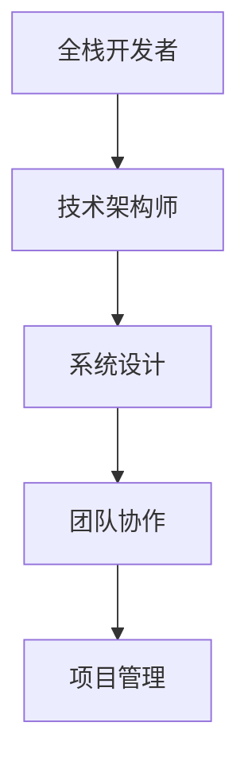

                 

关键词：全栈开发、技术架构师、职业进阶、技术能力、系统设计、团队协作、项目管理、云计算、微服务架构、DevOps

摘要：本文旨在探讨全栈开发者如何通过不断提升技术能力和实践经验，进阶成为一名技术架构师。我们将从背景介绍、核心概念与联系、核心算法原理与操作步骤、数学模型和公式、项目实践、实际应用场景、工具和资源推荐以及未来发展趋势与挑战等方面，详细阐述这一职业发展的路径和关键要素。

## 1. 背景介绍

在当今快速发展的信息技术时代，全栈开发者和技术架构师是软件开发领域内两个不可或缺的角色。全栈开发者通常具备前端、后端、数据库、服务器、运维等多个方面的技能，能够独立完成一个项目的开发。而技术架构师则更加专注于系统的设计、架构的优化以及整体的技术战略规划。

随着企业对技术复杂性要求的提高，技术架构师的角色变得越来越重要。他们不仅需要具备丰富的技术知识和实践经验，还需要具备出色的系统设计能力、团队协作能力和项目管理能力。因此，从全栈开发者向技术架构师的转变，不仅仅是技能的提升，更是思维方式和工作模式的转变。

## 2. 核心概念与联系

为了更好地理解技术架构师的角色，我们需要首先明确几个核心概念：

- **全栈开发者**：具备多种编程语言和开发框架的使用能力，能够处理前端到后端的所有技术问题。
- **技术架构师**：负责系统架构的设计、性能优化、扩展性规划以及技术选型的决策者。
- **系统设计**：包括模块划分、数据库设计、接口设计等，旨在构建稳定、高效、可扩展的系统。
- **团队协作**：技术架构师需要与开发团队、产品经理、运维人员等多个角色紧密合作，确保项目顺利进行。
- **项目管理**：涉及项目计划、进度跟踪、资源分配、风险管理等方面，保证项目按时按质完成。

下面是一个简化的 Mermaid 流程图，展示了这些核心概念之间的联系：



## 3. 核心算法原理 & 具体操作步骤

### 3.1 算法原理概述

作为技术架构师，掌握核心算法原理是基础中的基础。以下是一些常用的算法原理：

- **排序算法**：如快速排序、归并排序、堆排序等，用于数据的排序处理。
- **查找算法**：如二分查找、哈希表查找等，用于高效的数据查询。
- **图算法**：如最短路径算法、最小生成树算法等，用于网络拓扑的分析和优化。

### 3.2 算法步骤详解

以快速排序算法为例，其基本步骤如下：

1. **选择基准元素**：从数组中选择一个元素作为基准。
2. **分区操作**：将数组分为两部分，左边所有元素都小于基准，右边所有元素都大于基准。
3. **递归排序**：对左右分区递归执行上述步骤，直到整个数组有序。

### 3.3 算法优缺点

快速排序的优点是平均时间复杂度为 \(O(n\log n)\)，但在最坏情况下会退化到 \(O(n^2)\)。其缺点是对数组长度较大的数据集可能造成性能下降。

### 3.4 算法应用领域

快速排序广泛应用于各种需要排序的场景，如数据库索引构建、数据分析等。

## 4. 数学模型和公式 & 详细讲解 & 举例说明

在技术架构设计中，数学模型和公式是必不可少的工具。以下是一个简单的例子：

### 4.1 数学模型构建

考虑一个简单的队列模型，其中 \(Q\) 表示队列长度，\(L\) 表示等待时间，\(W\) 表示服务时间。我们可以构建以下数学模型：

$$
L = \frac{1}{\mu - \lambda} + \frac{\lambda}{2(\mu - \lambda)^2}
$$

其中，\(\mu\) 表示服务率，\(\lambda\) 表示到达率。

### 4.2 公式推导过程

推导过程如下：

$$
L = \frac{1}{\mu - \lambda} + \frac{\lambda}{2(\mu - \lambda)^2} = \frac{1}{\mu - \lambda} \left[1 + \frac{\lambda}{2(\mu - \lambda)}\right]
$$

### 4.3 案例分析与讲解

假设一个餐厅的服务率为 \(\mu = 5\) 客人/小时，平均到达率为 \(\lambda = 3\) 客人/小时。我们可以计算等待时间 \(L\)：

$$
L = \frac{1}{5 - 3} + \frac{3}{2(5 - 3)^2} = \frac{1}{2} + \frac{3}{2 \cdot 4} = 0.5 + 0.375 = 0.875 \text{小时}
$$

这意味着平均每个客人需要等待 \(0.875\) 小时才能得到服务。

## 5. 项目实践：代码实例和详细解释说明

### 5.1 开发环境搭建

以一个简单的微服务架构项目为例，首先需要在本地环境搭建开发环境：

- 安装 Node.js
- 安装 Docker
- 安装 Postman 用于API测试

### 5.2 源代码详细实现

以下是一个简单的用户注册服务的代码实现：

```javascript
// user-register-service.js

const express = require('express');
const app = express();
const port = 3000;

app.use(express.json());

app.post('/register', (req, res) => {
    const { username, password } = req.body;

    if (!username || !password) {
        return res.status(400).json({ error: 'Username and password are required' });
    }

    // 实现用户注册逻辑
    // ...

    res.status(201).json({ message: 'User registered successfully' });
});

app.listen(port, () => {
    console.log(`User registration service listening at http://localhost:${port}`);
});
```

### 5.3 代码解读与分析

这段代码使用了 Express 框架，定义了一个 POST 请求处理器，用于处理用户注册请求。首先检查请求体中是否包含用户名和密码，然后执行用户注册逻辑，并返回相应的响应。

### 5.4 运行结果展示

在 Postman 中发送一个 POST 请求到 `http://localhost:3000/register`，携带用户名和密码，应该会收到一个成功注册的消息。

## 6. 实际应用场景

技术架构师的工作不仅仅是编写代码，更重要的是要解决实际业务场景中的问题。以下是一些常见的应用场景：

- **电子商务平台**：设计高性能、高可用、易扩展的系统架构。
- **大数据处理**：构建适合大规模数据处理需求的架构，如数据仓库、数据湖等。
- **移动应用**：设计后端服务，确保移动应用的高性能和响应速度。
- **物联网（IoT）**：构建支持大规模设备连接和数据处理能力的系统。

## 7. 工具和资源推荐

为了更好地进行技术架构设计，以下是一些推荐的工具和资源：

### 7.1 学习资源推荐

- 《设计数据密集型应用》
- 《微服务设计》
- 《大规模分布式系统设计》

### 7.2 开发工具推荐

- Docker：容器化工具，用于部署和运行应用程序。
- Kubernetes：容器编排工具，用于自动化容器部署和管理。
- Postman：API 测试工具，用于测试和调试 API 接口。

### 7.3 相关论文推荐

- 《大规模分布式存储系统设计》
- 《云计算与分布式系统：概念与架构》
- 《微服务架构与设计模式》

## 8. 总结：未来发展趋势与挑战

随着技术的不断发展，技术架构师的角色也在不断演变。以下是未来发展趋势和面临的挑战：

### 8.1 研究成果总结

- **云计算和容器化**：越来越多的企业采用云计算和容器化技术，这为技术架构师带来了新的机遇和挑战。
- **微服务和DevOps**：微服务架构和DevOps文化的普及，使得技术架构师需要更多地关注系统的持续集成和持续部署。
- **数据安全和隐私保护**：随着数据量的爆炸性增长，数据安全和隐私保护成为技术架构师的重要职责。

### 8.2 未来发展趋势

- **边缘计算**：随着物联网和5G技术的发展，边缘计算将成为技术架构师关注的新领域。
- **人工智能和机器学习**：技术架构师需要掌握人工智能和机器学习的基础知识，以便更好地设计智能系统。

### 8.3 面临的挑战

- **技术复杂性**：随着技术的发展，系统的复杂性不断增加，这对技术架构师的能力提出了更高的要求。
- **团队协作**：技术架构师需要与多个团队协作，确保项目顺利进行，这需要出色的沟通和协调能力。

### 8.4 研究展望

技术架构师的职业发展前景广阔，但同时也面临着许多挑战。未来的技术架构师需要不断学习新知识、掌握新技术，以应对不断变化的业务需求和技术的挑战。

## 9. 附录：常见问题与解答

### 9.1 技术架构师和全栈开发者的区别是什么？

技术架构师通常负责系统的整体设计和技术选型，而全栈开发者则更多地关注具体的开发工作。

### 9.2 如何成为一名合格的技术架构师？

首先需要具备扎实的技术基础，然后通过实际项目经验不断提升系统设计能力、团队协作能力和项目管理能力。

### 9.3 技术架构师需要掌握哪些技能？

技术架构师需要掌握编程语言、数据库、网络、云计算、容器化、微服务架构、DevOps等方面的知识，同时还需要具备出色的沟通和协调能力。

---

作者：禅与计算机程序设计艺术 / Zen and the Art of Computer Programming

以上，就是从全栈开发者到技术架构师的进阶之路。希望这篇文章能够帮助到正在这个职业道路上探索的朋友们。不断的自我提升和积累，将使您在技术的道路上走得更远。祝您一路顺风！
----------------------------------------------------------------

现在我们已经完成了文章的撰写，接下来可以开始进行文章的格式调整和校对工作了。请检查文章中的格式是否正确，是否包含了所有的要求内容，以及是否有语法错误或逻辑不通的地方。如果一切无误，就可以将文章提交给相应的平台或读者了。如果有需要修改的地方，请及时进行修改，确保文章的质量和完整性。祝您写作顺利！

