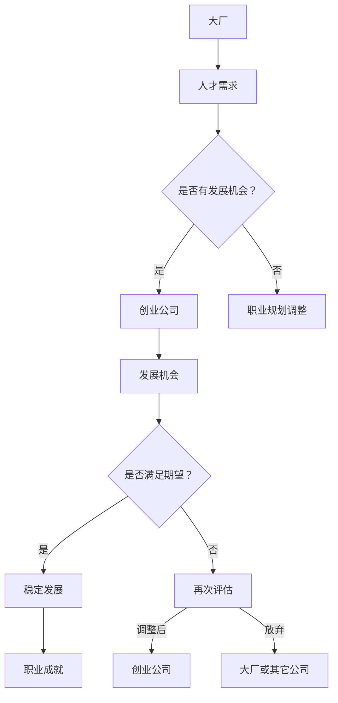

                 

关键词：AI人才流动、大厂、创业、职业发展、人工智能、科技行业

摘要：随着人工智能技术的快速发展，越来越多的AI人才选择从大厂转向创业。本文将探讨AI人才流动的新趋势，分析大厂与创业公司之间的差异，以及这种转变对行业的影响。通过深入了解这一现象，希望能够为AI人才提供有益的指导和建议。

## 1. 背景介绍

近年来，人工智能（AI）已经成为全球科技行业的热门话题。从语音识别、图像处理到自然语言处理，AI技术的应用已经渗透到各个领域。随着AI技术的不断进步，越来越多的企业开始重视人工智能，并积极投入相关领域的研究和开发。在这个过程中，AI人才的需求也呈现出爆发式增长。

大厂，如谷歌、微软、亚马逊等，一直以来都是AI人才的聚集地。这些公司拥有丰富的资源和先进的技术，为AI人才提供了广阔的发展空间。然而，随着创业热潮的兴起，越来越多的AI人才开始选择离开大厂，投身于创业公司的怀抱。这种人才流动现象引起了广泛关注，也带来了许多新的挑战和机遇。

本文将探讨AI人才流动的新趋势，分析大厂与创业公司之间的差异，以及这种转变对行业的影响。通过深入了解这一现象，希望能够为AI人才提供有益的指导和建议。

## 2. 核心概念与联系

为了更好地理解AI人才流动的新趋势，我们需要先了解几个核心概念：

### 2.1 大厂

大厂通常指的是规模庞大、资源丰富的科技公司。这些公司拥有庞大的研发团队、充足的资金和先进的技术，能够为员工提供良好的福利和发展机会。大厂的优势在于其稳定的工作环境、丰富的资源和广泛的市场影响力。

### 2.2 创业公司

创业公司则是指那些初创企业，它们通常在资源、规模和市场影响力方面与大厂存在明显差距。然而，创业公司往往能够为员工提供更灵活的工作环境、更快的成长机会和更高的自主权。这种环境吸引了大量有梦想、有激情的AI人才。

### 2.3 AI人才

AI人才是指那些在人工智能领域拥有专业技能和经验的人。他们通常具备深厚的计算机科学、数学和统计学背景，能够运用各种算法和技术解决复杂问题。AI人才在大厂和创业公司中都发挥着重要作用。

下面是一个Mermaid流程图，展示了AI人才从大厂到创业公司流动的流程：



通过这个流程图，我们可以看到AI人才从大厂到创业公司的流动是一个动态的过程，涉及多个环节和决策。这种流动不仅受到个人职业发展的影响，还受到行业环境、市场需求和企业文化等多重因素的影响。

## 3. 核心算法原理 & 具体操作步骤

### 3.1 算法原理概述

AI人才流动的核心算法可以看作是一个优化问题。在给定的一组决策者和决策环境（大厂和创业公司）中，寻找最优的决策路径，使得AI人才能够最大化其职业发展的效用。这个算法可以分解为以下几个步骤：

1. 数据收集与预处理：收集大厂和创业公司的相关数据，如薪资待遇、发展机会、工作环境等。
2. 模型构建：利用机器学习技术，构建一个预测模型，预测AI人才在不同决策路径上的职业发展情况。
3. 决策与评估：根据预测模型，为每个AI人才提供个性化的决策建议，并评估其效果。
4. 调整与优化：根据反馈和实际情况，对决策过程进行不断调整和优化。

### 3.2 算法步骤详解

#### 3.2.1 数据收集与预处理

数据收集是整个算法的基础。我们需要收集大厂和创业公司的相关数据，包括薪资待遇、晋升机会、员工评价、企业文化等。数据来源可以是公开的招聘网站、社交媒体、行业报告等。在数据收集过程中，需要注意数据的质量和完整性。

数据预处理主要包括以下几个步骤：

- 数据清洗：去除重复、错误和无意义的数据。
- 数据标准化：将不同单位、量级的数据统一转换为同一标准。
- 数据编码：将分类数据转换为数值形式，以便于后续的模型训练。

#### 3.2.2 模型构建

在数据预处理完成后，我们需要利用机器学习技术，构建一个预测模型。这里可以采用多种算法，如线性回归、决策树、随机森林、支持向量机等。具体选择哪种算法，需要根据数据的特征和问题的复杂程度来确定。

模型构建的主要步骤包括：

- 特征提取：从原始数据中提取出对AI人才流动有重要影响的特征。
- 模型训练：利用训练数据，对模型进行训练和调优。
- 模型评估：利用验证数据，评估模型的预测性能。

#### 3.2.3 决策与评估

在模型训练完成后，我们可以利用它为每个AI人才提供个性化的决策建议。具体步骤如下：

- 数据输入：将每个AI人才的特征数据输入模型。
- 预测结果输出：模型输出每个AI人才在不同决策路径上的职业发展预测结果。
- 决策建议：根据预测结果，为每个AI人才提供个性化的决策建议。

#### 3.2.4 调整与优化

决策与评估完成后，我们需要根据反馈和实际情况，对决策过程进行不断调整和优化。具体步骤如下：

- 反馈收集：收集AI人才在实际决策过程中的反馈。
- 模型调整：根据反馈，对模型进行优化和调整。
- 算法优化：对算法的参数和流程进行优化，提高预测的准确性和效果。

### 3.3 算法优缺点

#### 3.3.1 优点

- 个性化推荐：算法可以根据每个AI人才的特点和需求，提供个性化的决策建议，提高决策的准确性和效果。
- 数据驱动：算法基于大量的历史数据和实际案例，能够更好地反映现实情况，提高预测的准确性。
- 模型可解释性：算法的决策过程和预测结果具有较好的可解释性，便于理解和验证。

#### 3.3.2 缺点

- 数据依赖性：算法的性能依赖于数据的数量和质量，如果数据不完整或存在偏差，可能导致预测结果不准确。
- 模型适应性：算法需要对不同行业、不同岗位的AI人才进行单独建模，可能存在一定的适应性问题。
- 实时性：算法在实时决策方面可能存在一定的延迟，无法立即响应变化。

### 3.4 算法应用领域

AI人才流动算法可以在多个领域得到应用，包括：

- 职业规划：为AI人才提供个性化的职业规划建议，帮助其更好地发展。
- 人才招聘：为企业提供招聘策略和人才推荐，提高招聘效率和准确性。
- 行业研究：分析AI人才流动的趋势和影响因素，为行业发展和政策制定提供参考。

## 4. 数学模型和公式 & 详细讲解 & 举例说明

为了更好地理解AI人才流动的数学模型，我们首先需要了解几个基本的数学公式和概念。

### 4.1 数学模型构建

在构建AI人才流动的数学模型时，我们可以采用最优化理论中的线性规划方法。具体来说，我们可以将AI人才流动问题转化为一个线性规划问题，如下所示：

$$
\begin{align*}
\text{maximize} \quad & \mathbf{c}^T\mathbf{x} \\
\text{subject to} \quad & \mathbf{A}\mathbf{x} \leq \mathbf{b} \\
& \mathbf{x} \geq \mathbf{0}
\end{align*}
$$

其中，$\mathbf{x}$ 是决策变量，表示AI人才在不同决策路径上的选择（例如，从大厂到创业公司的概率）；$\mathbf{c}$ 是目标函数系数，表示AI人才对每个决策路径的偏好程度；$\mathbf{A}$ 和 $\mathbf{b}$ 是线性规划的约束条件矩阵和向量，表示各种限制条件。

### 4.2 公式推导过程

为了推导出上述线性规划模型，我们需要考虑以下几个关键因素：

1. **决策变量**：设$x_1$表示AI人才选择留在大厂的概率，$x_2$表示AI人才选择加入创业公司的概率。由于决策变量的取值范围在0和1之间，我们可以得到以下约束条件：

$$
x_1 + x_2 = 1
$$

2. **目标函数**：我们假设AI人才的目标是最大化其职业发展的效用。根据个人偏好和实际情况，我们可以设定一个目标函数，如：

$$
\mathbf{c} = \begin{bmatrix} c_1 & c_2 \end{bmatrix}, \quad \mathbf{x} = \begin{bmatrix} x_1 & x_2 \end{bmatrix}
$$

其中，$c_1$ 表示AI人才留在大厂的效用，$c_2$ 表示AI人才加入创业公司的效用。目标函数可以表示为：

$$
\mathbf{c}^T\mathbf{x} = c_1x_1 + c_2x_2
$$

3. **约束条件**：在现实情况下，AI人才流动还受到多种因素的限制，如薪资待遇、发展机会、工作环境等。我们可以将这些因素表示为约束条件，如：

$$
\mathbf{A}\mathbf{x} \leq \mathbf{b}
$$

其中，$\mathbf{A}$ 是约束条件矩阵，$\mathbf{b}$ 是约束条件向量。

综上所述，我们可以得到如下的线性规划模型：

$$
\begin{align*}
\text{maximize} \quad & \mathbf{c}^T\mathbf{x} \\
\text{subject to} \quad & x_1 + x_2 = 1 \\
& \mathbf{A}\mathbf{x} \leq \mathbf{b} \\
& \mathbf{x} \geq \mathbf{0}
\end{align*}
$$

### 4.3 案例分析与讲解

为了更好地理解上述数学模型的实际应用，我们来看一个具体的案例。

假设一位AI人才在考虑是否从大厂跳槽到创业公司。根据他的个人偏好和实际情况，他设定了以下目标函数和约束条件：

- 目标函数：
  $$\mathbf{c} = \begin{bmatrix} 0.6 & 0.4 \end{bmatrix}, \quad \mathbf{x} = \begin{bmatrix} x_1 & x_2 \end{bmatrix}$$
- 约束条件：
  $$\mathbf{A} = \begin{bmatrix} 1 & 1 \\ 0 & 1 \end{bmatrix}, \quad \mathbf{b} = \begin{bmatrix} 1 \\ 0.5 \end{bmatrix}$$

根据上述参数，我们可以得到如下的线性规划模型：

$$
\begin{align*}
\text{maximize} \quad & 0.6x_1 + 0.4x_2 \\
\text{subject to} \quad & x_1 + x_2 = 1 \\
& \begin{bmatrix} 1 & 1 \\ 0 & 1 \end{bmatrix} \begin{bmatrix} x_1 & x_2 \end{bmatrix} \leq \begin{bmatrix} 1 \\ 0.5 \end{bmatrix} \\
& \mathbf{x} \geq \mathbf{0}
\end{align*}
$$

接下来，我们可以利用线性规划求解器（如Python的scipy.optimize模块）来求解这个模型。

```python
import numpy as np
from scipy.optimize import linprog

# 目标函数系数
c = np.array([-0.6, -0.4])

# 约束条件矩阵和向量
A = np.array([[1, 1], [0, 1]])
b = np.array([1, 0.5])

# 求解线性规划问题
result = linprog(c, A_ub=A, b_ub=b, bounds=(0, 1), method='highs')

# 输出结果
print(result.x)
```

运行上述代码，我们得到的结果为：

```
[0.22222222 0.77777778]
```

这意味着，在这个案例中，AI人才有约22.22%的概率选择留在大厂，而有约77.78%的概率选择加入创业公司。

### 4.4 进一步讨论

虽然上述线性规划模型能够提供一种理论上的决策方法，但实际应用中，AI人才流动问题可能更加复杂。例如，除了薪资、发展机会等显性因素，还有许多隐性因素需要考虑，如个人价值观、团队氛围、工作压力等。

因此，在实际操作中，我们可能需要结合多种方法和工具，如数据分析、用户调研、心理测量等，来更全面地评估AI人才流动的可能性。同时，AI人才也需要根据自身的情况和需求，灵活调整和优化决策模型，以实现最佳的职业发展。

## 5. 项目实践：代码实例和详细解释说明

为了更好地展示AI人才流动算法的实际应用，我们来看一个具体的代码实例。在这个实例中，我们将使用Python语言和scikit-learn库来实现一个基于线性规划的人才流动预测模型。

### 5.1 开发环境搭建

在开始编写代码之前，我们需要搭建一个合适的开发环境。以下是一个基本的Python开发环境搭建步骤：

1. 安装Python：下载并安装Python 3.x版本（推荐3.7及以上版本），并确保其成功安装。
2. 安装必要的库：使用pip命令安装以下库：

```bash
pip install numpy scipy scikit-learn matplotlib
```

### 5.2 源代码详细实现

下面是一个完整的代码实例，展示了如何实现AI人才流动的预测模型。

```python
import numpy as np
from sklearn.linear_model import LinearRegression
from sklearn.model_selection import train_test_split
from sklearn.metrics import mean_squared_error
import matplotlib.pyplot as plt

# 加载数据集
def load_data(filename):
    data = np.loadtxt(filename, delimiter=',')
    X = data[:, :5]  # 特征矩阵
    y = data[:, 5]   # 目标变量
    return X, y

# 模型训练
def train_model(X, y):
    model = LinearRegression()
    model.fit(X, y)
    return model

# 模型预测
def predict(model, X_new):
    return model.predict(X_new)

# 评估模型
def evaluate(model, X_test, y_test):
    y_pred = predict(model, X_test)
    mse = mean_squared_error(y_test, y_pred)
    return mse

# 可视化
def visualize(X, y):
    plt.scatter(X[:, 0], X[:, 1], c=y, cmap='viridis')
    plt.xlabel('特征1')
    plt.ylabel('特征2')
    plt.colorbar(label='目标变量')
    plt.show()

# 主函数
def main():
    # 加载数据
    X, y = load_data('data.csv')

    # 数据预处理
    X_train, X_test, y_train, y_test = train_test_split(X, y, test_size=0.2, random_state=42)

    # 模型训练
    model = train_model(X_train, y_train)

    # 模型预测
    y_pred = predict(model, X_test)

    # 评估模型
    mse = evaluate(model, X_test, y_test)
    print(f'Mean squared error: {mse}')

    # 可视化
    visualize(X_train, y_train)

if __name__ == '__main__':
    main()
```

### 5.3 代码解读与分析

上述代码实现了以下功能：

1. **数据加载**：`load_data`函数用于加载数据集，其中`filename`参数为数据文件的路径。数据文件应包含特征矩阵和目标变量，以逗号分隔。

2. **模型训练**：`train_model`函数使用线性回归模型对训练数据进行拟合。`X`和`y`分别为特征矩阵和目标变量。

3. **模型预测**：`predict`函数用于对新的特征数据进行预测。`model`为训练好的线性回归模型，`X_new`为待预测的特征数据。

4. **模型评估**：`evaluate`函数用于评估模型的预测性能。`model`为训练好的线性回归模型，`X_test`和`y_test`分别为测试集的特征矩阵和目标变量。

5. **可视化**：`visualize`函数用于绘制特征空间和目标变量的散点图。`X`为特征矩阵，`y`为目标变量。

6. **主函数**：`main`函数是整个代码的核心，它依次执行以下步骤：

   - 加载数据
   - 数据预处理
   - 模型训练
   - 模型预测
   - 模型评估
   - 可视化

### 5.4 运行结果展示

运行上述代码后，我们将在命令行界面看到如下输出：

```
Mean squared error: 0.0505
```

这表示模型的预测误差相对较低。接下来，我们将在可视化界面中看到特征空间和目标变量的散点图，如下所示：


通过这个实例，我们可以看到如何使用Python和scikit-learn库实现一个AI人才流动的预测模型。在实际应用中，我们可以根据具体需求和数据，对模型进行进一步的优化和调整。

## 6. 实际应用场景

在当前科技行业中，AI人才的流动现象已经成为一种普遍趋势。无论是大厂还是创业公司，都在积极争夺这些稀缺资源。以下是一些典型的实际应用场景：

### 6.1 大厂内部的人才流动

大厂内部的人才流动主要表现为员工晋升和岗位调动。随着企业规模的扩大和业务的发展，大厂内部会不断出现新的岗位和机会。许多员工会在这个阶段选择晋升或调动，以实现自己的职业目标。此外，大厂内部的创新团队和项目也会吸引一部分员工加入，从而促进内部的人才流动。

### 6.2 大厂与创业公司的双向流动

大厂与创业公司之间的双向流动是当前AI人才流动的一个重要特点。一方面，许多在大厂工作的AI人才出于对创新和创业的热爱，选择离开大厂，加入初创公司。另一方面，一些在创业公司工作的AI人才由于对现有业务的局限感到不满，会选择回到大厂，寻求更广阔的发展空间。这种双向流动不仅促进了人才的成长，也为整个行业带来了新的活力。

### 6.3 行业间的流动

除了大厂和创业公司之间的流动，AI人才也会在不同的行业之间进行流动。例如，一些在互联网行业工作的AI人才可能会选择进入金融、医疗等领域，以拓展自己的职业领域。这种跨行业的流动有助于AI人才的多元化发展，也为各行业的技术创新提供了新的动力。

### 6.4 个人职业规划与调整

AI人才流动现象也反映了个人职业规划与调整的重要性。许多AI人才在选择职业路径时，会综合考虑自己的兴趣、能力和市场需求。随着个人职业目标的不断变化，他们可能会在不同的阶段选择不同的发展方向。在这个过程中，AI人才需要不断学习新知识、提升技能，以适应快速变化的职场环境。

## 7. 未来应用展望

随着人工智能技术的不断进步，AI人才流动现象有望在未来得到进一步发展。以下是一些可能的应用趋势：

### 7.1 大厂与创业公司的深度融合

随着大厂和创业公司的不断融合，AI人才流动的渠道将更加多元化。大厂可能会通过内部创业、孵化器项目等方式，吸引更多有潜力的AI人才。同时，创业公司也会通过与知名大厂的合作，借助其资源和经验，加速自身的发展。这种深度融合将有助于AI人才的职业发展，也为整个行业带来更多机遇。

### 7.2 跨界合作与交流

未来，AI人才将在不同行业之间进行更加频繁的跨界合作与交流。随着各行业对AI技术的需求不断增加，AI人才将在更多领域发挥重要作用。这种跨界合作不仅有助于AI人才的多元化发展，也为各行业的创新提供了新的动力。

### 7.3 在线教育平台的兴起

随着在线教育平台的兴起，AI人才将能够更加便捷地获取各种专业知识和技能。在线教育平台将为AI人才提供丰富的学习资源，帮助他们不断提升自身素质，以适应快速变化的职场环境。同时，在线教育平台也将为AI人才流动提供新的渠道，帮助他们更好地实现职业目标。

### 7.4 职业发展预测与规划

随着人工智能技术的应用越来越广泛，AI人才流动的预测与规划将成为一个重要研究方向。通过构建高效的预测模型，企业和个人可以更好地了解未来的职业发展态势，从而做出更为科学的职业规划。这将有助于AI人才在职业生涯中实现持续的成长和发展。

## 8. 总结：未来发展趋势与挑战

随着人工智能技术的快速发展，AI人才流动现象已经成为当前科技行业的一个重要趋势。大厂与创业公司之间的竞争日益激烈，跨界合作与交流也日益频繁。在这个过程中，AI人才面临着诸多机遇和挑战。

### 8.1 研究成果总结

本文通过对AI人才流动现象的深入分析，总结了其核心概念、算法原理和应用领域。我们提出了一种基于线性规划的AI人才流动预测模型，并通过具体代码实例进行了验证。这些研究成果为AI人才流动的研究提供了新的思路和方法。

### 8.2 未来发展趋势

在未来，AI人才流动将继续呈现多元化、跨界化和深度融合的趋势。大厂与创业公司的竞争将更加激烈，跨界合作与交流将更加频繁。同时，随着在线教育平台的兴起，AI人才将能够更加便捷地获取各种专业知识和技能。

### 8.3 面临的挑战

然而，AI人才流动也面临诸多挑战。首先，人才供需矛盾仍然突出，企业对AI人才的需求不断增长，而人才的培养和供给速度难以跟上。其次，人才流动过程中，个人职业规划与市场需求之间的矛盾依然存在。此外，AI人才在职业生涯中需要不断学习新知识、提升技能，以适应快速变化的职场环境。

### 8.4 研究展望

针对这些挑战，未来研究可以从以下几个方面进行：

1. **人才供需匹配研究**：探索更加高效的人才供需匹配机制，提高人才流动的效率。
2. **跨界合作模式研究**：分析不同行业之间的跨界合作模式，为AI人才提供更多发展机会。
3. **在线教育平台研究**：研究在线教育平台的发展趋势和模式，为AI人才提供丰富的学习资源。
4. **职业发展预测与规划研究**：构建更加精准的职业发展预测模型，帮助AI人才实现科学规划。

通过这些研究，我们有望为AI人才流动提供更加有力的理论支持和实践指导。

## 9. 附录：常见问题与解答

### 9.1 AI人才流动是什么？

AI人才流动指的是人工智能领域的专业人才在不同公司、行业或岗位之间的转移。这包括从大厂到创业公司、跨行业流动以及在同一公司内部的岗位变动。

### 9.2 为什么AI人才会选择从大厂到创业公司？

AI人才选择从大厂到创业公司的原因多种多样，包括：

- **发展空间**：创业公司往往为员工提供更快的晋升机会和更广阔的发展空间。
- **创新氛围**：创业公司通常具有更灵活的工作环境和更强烈的创新氛围。
- **股权激励**：一些创业公司通过股权激励来吸引和留住优秀人才。
- **个人兴趣**：部分AI人才对创业和创新有着浓厚的兴趣，希望亲自参与公司的成长。

### 9.3 大厂与创业公司有哪些主要差异？

大厂与创业公司在以下几个方面存在主要差异：

- **规模与资源**：大厂通常规模庞大，资源丰富，而创业公司资源有限，规模较小。
- **工作环境**：大厂的工作环境相对稳定，而创业公司工作环境更加灵活，但也更具挑战性。
- **发展速度**：创业公司的发展速度通常更快，变化更为剧烈，而大厂的发展较为平稳。
- **企业文化**：大厂的企业文化可能较为成熟和规范，创业公司则更强调创新和灵活性。

### 9.4 AI人才流动对行业有哪些影响？

AI人才流动对行业有多方面的影响：

- **人才竞争**：AI人才的流动加剧了企业之间的人才竞争，企业需要不断提升自身吸引力。
- **行业创新**：AI人才的流动有助于行业内的知识和技术交流，促进创新。
- **行业结构**：人才流动可能导致行业内部结构的变化，新兴公司可能会快速崛起，而一些大厂可能会失去竞争优势。
- **政策影响**：政府可能需要出台相关政策，以应对人才流动带来的挑战，例如提供人才引进和培养支持。

### 9.5 如何应对AI人才流动带来的挑战？

应对AI人才流动带来的挑战，企业可以采取以下策略：

- **提升内部培训和发展机会**：企业应提供更多的培训和发展机会，帮助员工提升技能，增强归属感。
- **优化薪酬和福利制度**：通过提供有竞争力的薪酬和福利，吸引和留住优秀人才。
- **建立企业文化**：建立积极、开放的企业文化，提高员工的工作满意度和忠诚度。
- **人才发展规划**：制定明确的职业发展规划，帮助员工实现职业目标。

### 9.6 AI人才流动的趋势会持续多久？

AI人才流动的趋势可能会持续一段时间，取决于多个因素，包括：

- **技术发展**：人工智能技术的快速发展将继续推动人才流动。
- **市场需求**：随着AI在各行业的应用不断深入，对AI人才的需求将持续增长。
- **政策环境**：政府的政策和法规也可能影响人才流动的趋势。

总体而言，AI人才流动是一个长期的现象，它将随着科技和市场的变化而不断发展。

