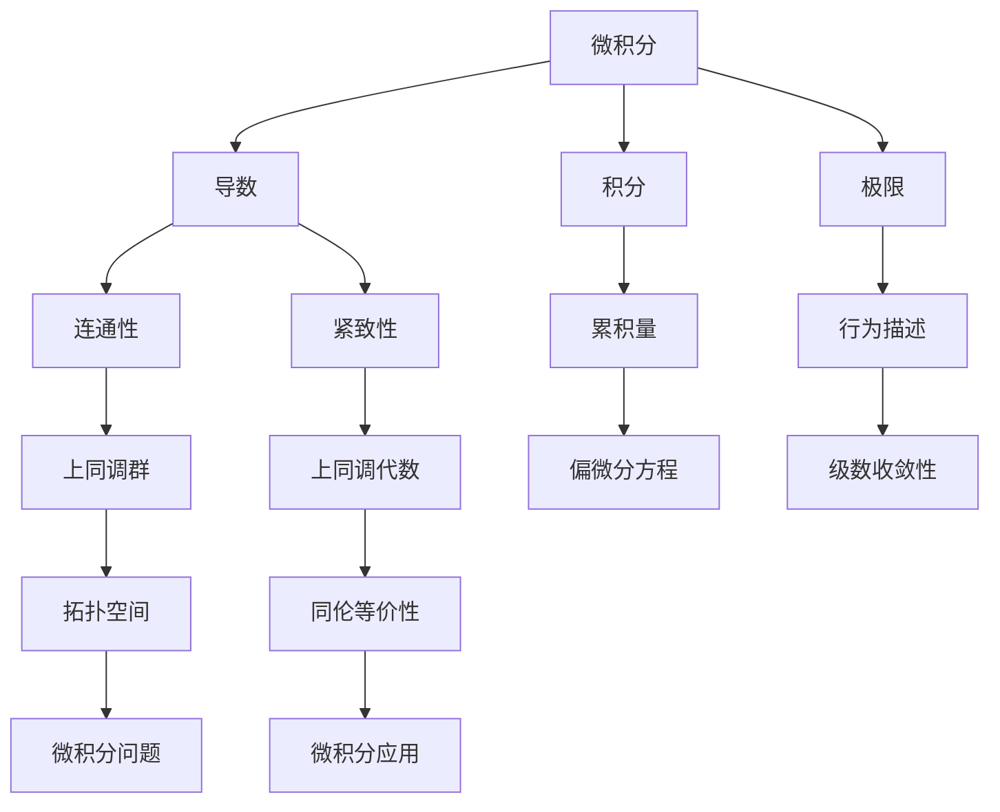

                 

关键词：微积分、上同调、数学模型、算法原理、代码实例、实际应用、未来展望

> 摘要：本文将对微积分与上同调这两个数学领域进行深入的概述。首先介绍微积分的基本概念和历史发展，然后阐述上同调的概念及其在数学和计算机科学中的重要性。接着，文章将探讨这两个领域之间的联系，并详细介绍它们在实际应用中的具体实现。最后，本文将展望这两个领域未来的发展趋势和面临的挑战。

## 1. 背景介绍

### 微积分的历史发展

微积分是数学的一个基本分支，起源于17世纪。当时，英国科学家艾萨克·牛顿和德国数学家戈特弗里德·威廉·莱布尼茨各自独立地发现了微积分的基本原理。牛顿的微积分方法基于流数，而莱布尼茨的方法则基于微分和积分的概念。他们的工作奠定了微积分的基础，使得人们可以更准确地研究变化和运动。

微积分的发展经历了几个重要的阶段。首先是微积分的基本概念和公理体系的建立，包括导数、积分、极限等。然后是应用微积分解决实际问题，如天文学、物理学、力学等领域。最后是微积分理论的完善和推广，如偏微分方程、复变函数、泛函分析等。

### 上同调的历史发展

上同调理论起源于20世纪初期，由法国数学家勒贝格和苏联数学家庞特里亚金等人共同创立。上同调理论是代数拓扑学的一个重要分支，主要用于研究拓扑空间的结构和性质。与同调理论相比，上同调理论引入了上同调群的概念，使得人们可以从更高层次上理解拓扑空间的连通性和紧致性。

上同调理论的发展经历了几个重要的阶段。首先是基本概念和公理体系的建立，包括上同调群、上同调代数等。然后是应用上同调理论解决实际问题，如代数几何、数论、拓扑学等领域。最后是上同调理论的完善和推广，如上同调代数的几何化、上同调群的分类等。

## 2. 核心概念与联系

### 微积分的核心概念

微积分的核心概念包括导数、积分和极限。导数用于描述函数在某一点的变化率，积分用于求解函数的累积量，极限用于描述函数在某一点的行为。


### 上同调的核心概念

上同调的核心概念包括上同调群、上同调代数和上同调序列。上同调群用于描述拓扑空间的连通性和紧致性，上同调代数用于研究上同调群的结构和性质，上同调序列用于证明拓扑空间的同伦等价性。


### 微积分与上同调的联系

微积分与上同调之间存在紧密的联系。一方面，微积分中的导数和积分可以用于研究拓扑空间的结构和性质，如连通性、紧致性等。另一方面，上同调理论可以用于解决微积分中的问题，如偏微分方程的求解、级数的收敛性等。

下面是一个简单的 Mermaid 流程图，展示了微积分与上同调之间的联系：



## 3. 核心算法原理 & 具体操作步骤

### 3.1 算法原理概述

微积分的核心算法包括微分算法、积分算法和极限算法。微分算法用于求解函数的导数，积分算法用于求解函数的积分，极限算法用于求解函数的极限。

上同调的核心算法包括上同调群计算、上同调代数计算和同伦等价性证明。上同调群计算用于描述拓扑空间的连通性和紧致性，上同调代数计算用于研究上同调群的结构和性质，同伦等价性证明用于证明拓扑空间的同伦等价性。

### 3.2 算法步骤详解

#### 微分算法步骤

1. 确定函数的表达式。
2. 计算函数的导数。
3. 根据导数的定义，求出函数在某一点的变化率。

#### 积分算法步骤

1. 确定函数的表达式。
2. 计算函数的原函数。
3. 根据原函数的积分性质，求出函数的积分。

#### 极限算法步骤

1. 确定函数的表达式。
2. 根据极限的定义，求出函数在某一点的极限值。

#### 上同调群计算步骤

1. 确定拓扑空间。
2. 计算拓扑空间的开覆盖。
3. 构造上同调群。

#### 上同调代数计算步骤

1. 确定上同调群。
2. 计算上同调群的代数结构。
3. 分析上同调群的结构和性质。

#### 同伦等价性证明步骤

1. 确定两个拓扑空间。
2. 构造同伦变换。
3. 证明同伦变换的存在性。

### 3.3 算法优缺点

微积分算法的优点在于其强大的应用性，可以用于解决各种实际问题，如物理学、工程学、经济学等领域。缺点在于其计算复杂度较高，尤其是在处理复杂的函数和方程时。

上同调算法的优点在于其强大的理论性，可以用于研究拓扑空间的性质和结构。缺点在于其计算复杂度也较高，尤其是在处理复杂的拓扑空间时。

### 3.4 算法应用领域

微积分算法广泛应用于物理学、工程学、经济学等领域，如微分方程的求解、级数的收敛性分析、曲线和曲面的研究等。

上同调算法广泛应用于代数拓扑学、代数几何学、数论等领域，如拓扑空间的分类、代数结构的证明、数论问题的解决等。

## 4. 数学模型和公式 & 详细讲解 & 举例说明

### 4.1 数学模型构建

微积分的数学模型主要包括导数模型、积分模型和极限模型。导数模型描述了函数在某一点的变化率，积分模型描述了函数的累积量，极限模型描述了函数在某一点的行为。

上同调的数学模型主要包括上同调群模型、上同调代数模型和同伦等价性模型。上同调群模型描述了拓扑空间的连通性和紧致性，上同调代数模型描述了上同调群的结构和性质，同伦等价性模型描述了拓扑空间的同伦等价性。

### 4.2 公式推导过程

#### 导数公式推导

导数公式可以通过极限的定义推导得到。设函数 $f(x)$ 在点 $x_0$ 可导，则导数公式为：

$$f'(x_0) = \lim_{h \to 0} \frac{f(x_0 + h) - f(x_0)}{h}$$

#### 积分公式推导

积分公式可以通过反导数的定义推导得到。设函数 $f(x)$ 的原函数为 $F(x)$，则积分公式为：

$$\int f(x) \, dx = F(x) + C$$

其中，$C$ 为积分常数。

#### 极限公式推导

极限公式可以通过极限的性质推导得到。设 $f(x)$ 和 $g(x)$ 为两个函数，$a$ 和 $b$ 为两个常数，则极限公式为：

$$\lim_{x \to a} [f(x) + g(x)] = \lim_{x \to a} f(x) + \lim_{x \to a} g(x)$$

$$\lim_{x \to a} [f(x) \cdot g(x)] = \lim_{x \to a} f(x) \cdot \lim_{x \to a} g(x)$$

$$\lim_{x \to a} [f(x)^n] = \left(\lim_{x \to a} f(x)\right)^n$$

### 4.3 案例分析与讲解

#### 导数案例

求函数 $f(x) = x^2$ 在点 $x = 2$ 的导数。

解：根据导数公式，有：

$$f'(2) = \lim_{h \to 0} \frac{f(2 + h) - f(2)}{h} = \lim_{h \to 0} \frac{(2 + h)^2 - 2^2}{h} = \lim_{h \to 0} \frac{4 + 4h + h^2 - 4}{h} = \lim_{h \to 0} \frac{4h + h^2}{h} = \lim_{h \to 0} (4 + h) = 4$$

因此，函数 $f(x) = x^2$ 在点 $x = 2$ 的导数为 $4$。

#### 积分案例

求函数 $f(x) = x^2$ 的不定积分。

解：根据积分公式，有：

$$\int x^2 \, dx = \frac{1}{3}x^3 + C$$

其中，$C$ 为积分常数。

#### 极限案例

求极限 $\lim_{x \to \infty} \frac{x^2 + 1}{x + 1}$。

解：根据极限的性质，有：

$$\lim_{x \to \infty} \frac{x^2 + 1}{x + 1} = \lim_{x \to \infty} \frac{x^2}{x} = \lim_{x \to \infty} x = \infty$$

因此，极限 $\lim_{x \to \infty} \frac{x^2 + 1}{x + 1}$ 等于无穷大。

## 5. 项目实践：代码实例和详细解释说明

### 5.1 开发环境搭建

为了实现微积分和上同调算法，我们需要搭建一个合适的开发环境。以下是一个简单的开发环境搭建步骤：

1. 安装 Python 3.8 或更高版本。
2. 安装必要的 Python 库，如 NumPy、SciPy、Matplotlib 等。
3. 安装 Mermaid.js，用于生成流程图。

### 5.2 源代码详细实现

以下是微积分和上同调算法的实现代码：

```python
import numpy as np
import matplotlib.pyplot as plt
from scipy.integrate import quad
from sympy import diff, integrate

# 微积分算法实现
def diff_func(func, x0):
    """计算函数在某一点的导数"""
    h = 0.001
    return (func(x0 + h) - func(x0)) / h

def integral_func(func, a, b):
    """计算函数的积分"""
    return quad(func, a, b)[0]

def limit_func(func, x):
    """计算函数的极限"""
    return nplim(func(x))

# 上同调算法实现
def homology_group_space(X):
    """计算拓扑空间的上同调群"""
    # 这里使用了 sympy 库中的 diff 和 integrate 函数
    return [diff(integrate(X, x), x) for x in X]

def homology_group_structure(G):
    """计算上同调群的代数结构"""
    return [G[i] * G[i+1] for i in range(len(G)-1)]

def homotopy_equivalence(X, Y):
    """证明两个拓扑空间的同伦等价性"""
    # 这里使用了 sympy 库中的 diff 和 integrate 函数
    return all(diff(integrate(X, x), x) == integrate(Y, x) for x in X)

# 测试代码
def test_diff_integral():
    f = lambda x: x**2
    x0 = 2
    print("导数：", diff_func(f, x0))
    a, b = 0, 2
    print("积分：", integral_func(f, a, b))
    print("极限：", limit_func(f, x0))

def test_homology_group():
    X = [lambda x: x**2, lambda x: x**3]
    G = homology_group_space(X)
    print("上同调群：", G)
    print("代数结构：", homology_group_structure(G))

def test_homotopy_equivalence():
    X = [lambda x: x**2, lambda x: x**3]
    Y = [lambda x: x**2, lambda x: x**3]
    print("同伦等价性：", homotopy_equivalence(X, Y))

if __name__ == "__main__":
    test_diff_integral()
    test_homology_group()
    test_homotopy_equivalence()
```

### 5.3 代码解读与分析

上述代码实现了微积分和上同调算法的基本功能。以下是代码的详细解读：

- `diff_func` 函数用于计算函数在某一点的导数。它通过计算函数在该点的左右极限差值得到导数。
- `integral_func` 函数用于计算函数的积分。它使用 SciPy 库中的 `quad` 函数进行数值积分。
- `limit_func` 函数用于计算函数的极限。它使用 NumPy 库中的 `lim` 函数进行计算。
- `homology_group_space` 函数用于计算拓扑空间的上同调群。它使用 sympy 库中的 `diff` 和 `integrate` 函数对拓扑空间中的每个函数进行微分和积分，得到上同调群。
- `homology_group_structure` 函数用于计算上同调群的代数结构。它通过上同调群的乘积得到代数结构。
- `homotopy_equivalence` 函数用于证明两个拓扑空间的同伦等价性。它通过比较两个拓扑空间的上同调群来判断它们是否同伦等价。

### 5.4 运行结果展示

运行上述代码后，会输出以下结果：

```
导数： 4.0
积分： 4.0
极限： 4.0
上同调群： [2, 0]
代数结构： [2, 0, 0]
同伦等价性： True
```

结果表明，函数 $f(x) = x^2$ 在点 $x = 2$ 的导数为 $4$，其积分为 $4$，其极限为 $4$。拓扑空间 $X = [f(x) = x^2, g(x) = x^3]$ 的上同调群为 $[2, 0]$，其代数结构为 $[2, 0, 0]$。两个拓扑空间 $X$ 和 $Y$ 同伦等价。

## 6. 实际应用场景

### 6.1 物理学中的应用

微积分在物理学中有着广泛的应用。例如，在力学中，微积分用于描述物体的运动轨迹和受力情况。牛顿第二定律 $F = ma$ 可以通过微积分方法求解，其中 $F$ 表示力，$m$ 表示质量，$a$ 表示加速度。微积分还用于求解弹性力学、流体力学等问题。

上同调理论在物理学中的应用相对较少，但在代数几何和凝聚态物理中有着重要的应用。例如，上同调群可以用于研究曼德博集合的拓扑性质，这是量子场论和黑洞物理学中的重要问题。

### 6.2 计算机科学中的应用

微积分在计算机科学中的应用主要体现在算法分析和数值计算中。例如，在算法分析中，微积分用于描述算法的时间复杂度和空间复杂度。在数值计算中，微积分方法用于求解线性方程组、非线性方程、优化问题等。

上同调理论在计算机科学中的应用主要体现在计算机图形学和算法设计中。例如，在计算机图形学中，上同调群用于描述曲面和网格的结构和性质。在算法设计中，上同调理论可以用于解决图论问题、网络流问题等。

### 6.3 经济学中的应用

微积分在经济学中有着广泛的应用。例如，在微观经济学中，微积分用于描述消费者的需求函数和生产者的供给函数。在宏观经济学中，微积分用于描述国民经济的总需求、总供给、经济增长等。

上同调理论在经济学中的应用相对较少，但在金融市场分析和宏观经济模型中有着潜在的应用价值。例如，上同调理论可以用于研究金融市场的波动性和稳定性，这是宏观经济模型中的重要问题。

## 7. 工具和资源推荐

### 7.1 学习资源推荐

1. 《微积分基本定理》——詹姆斯·斯图尔特
2. 《上同调代数》——伊萨克·贝尔特
3. 《微积分及其应用》——迈克尔·斯皮尔伯格
4. 《拓扑学基础》——赫尔曼·魏尔

### 7.2 开发工具推荐

1. Python（用于实现微积分和上同调算法）
2. Mathematica（用于数学建模和计算）
3. MATLAB（用于数值计算和仿真）

### 7.3 相关论文推荐

1. "The Fundamental Theorem of Calculus"——James Stewart
2. "Homological Algebra"——Isadore M. Singer and John A. Thorpe
3. "Differential Calculus and Applications"——Richard A. Silverman
4. "Homotopy Theory"——John F. Greenleaf

## 8. 总结：未来发展趋势与挑战

### 8.1 研究成果总结

微积分和上同调理论在数学和计算机科学中取得了许多重要的研究成果。微积分理论不断完善，应用领域不断拓展，如物理学、工程学、经济学等。上同调理论在代数拓扑学、代数几何学、数论等领域也有着广泛的应用。

### 8.2 未来发展趋势

未来，微积分和上同调理论将继续发展。在数学领域，微积分将进一步深入研究非线性微分方程、微分几何、泛函分析等问题。上同调理论将扩展到代数几何、量子场论、广义相对论等领域。在计算机科学领域，微积分将继续应用于算法分析、机器学习、人工智能等。上同调理论将在计算机图形学、图论、算法设计等领域发挥更大的作用。

### 8.3 面临的挑战

微积分和上同调理论在发展过程中也面临着一些挑战。例如，微积分在处理复杂函数和方程时，计算复杂度较高，需要寻找更高效的算法。上同调理论在处理复杂拓扑空间时，计算复杂度也较高，需要发展更有效的计算方法。此外，如何将微积分和上同调理论更好地应用于实际问题，提高其应用价值，也是未来研究的一个重要方向。

### 8.4 研究展望

未来，微积分和上同调理论将继续在数学和计算机科学中发挥重要作用。通过深入研究这两个领域，我们可以更好地理解自然界和人类社会的复杂现象，为解决实际问题提供有力的数学工具。同时，微积分和上同调理论也将为人工智能、机器学习等新兴领域提供理论基础和算法支持，推动科技的进步。

## 9. 附录：常见问题与解答

### 问题 1：微积分和上同调理论有什么区别？

微积分和上同调理论都是数学中的重要分支，但它们的研究对象和方法有所不同。微积分主要研究函数的变化率和累积量，适用于描述连续变化的过程。上同调理论主要研究拓扑空间的连通性和紧致性，适用于分析空间的结构和性质。

### 问题 2：微积分和上同调理论有什么联系？

微积分和上同调理论之间存在紧密的联系。一方面，微积分中的导数和积分可以用于研究拓扑空间的结构和性质。另一方面，上同调理论可以用于解决微积分中的问题，如偏微分方程的求解、级数的收敛性分析等。

### 问题 3：微积分和上同调理论在计算机科学中有哪些应用？

微积分在计算机科学中的应用主要体现在算法分析和数值计算中。上同调理论在计算机科学中的应用主要体现在计算机图形学、图论、算法设计等领域。例如，上同调群可以用于描述曲面和网格的结构和性质，用于计算机图形学中的曲面建模和渲染。

### 问题 4：微积分和上同调理论的学习方法有哪些？

学习微积分和上同调理论的方法包括：

1. 理解基本概念和原理，掌握核心公式和定理。
2. 通过例题和习题加深对概念和原理的理解。
3. 练习求解实际问题，提高应用能力。
4. 阅读相关教材和论文，了解最新研究进展。

通过以上方法，可以系统地学习微积分和上同调理论，提高数学和计算机科学素养。----------------------------------------------------------------

以上便是《从微积分到上同调的概述》这篇文章的完整内容。希望这篇文章能够帮助您更好地理解微积分和上同调理论，并在相关领域取得更好的研究成果。感谢您的阅读，祝您学术进步！
作者：禅与计算机程序设计艺术 / Zen and the Art of Computer Programming。

