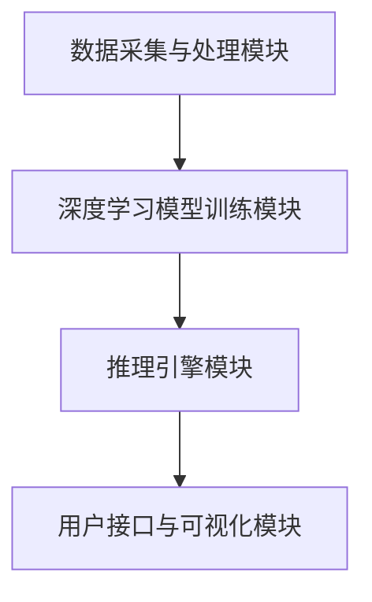

                 

关键词：人工智能创业、Lepton AI、深度学习、创业历程、技术架构

摘要：本文将深入探讨一家名为Lepton AI的人工智能初创公司，从无到有的创业之路。我们将回顾其创立背景、核心团队组成、主要产品与技术的研发过程，以及公司在市场竞争中的策略与挑战。通过这篇案例分析，我们希望能够为那些怀揣人工智能梦想的创业者提供一些宝贵的经验和启示。

## 1. 背景介绍

### 1.1 创立初衷

Lepton AI的创立源于创始人对人工智能技术的热情与对现实世界问题的深刻洞察。在这个大数据和云计算的时代，人工智能已经成为了全球科技领域的重要趋势。然而，许多企业对于如何将人工智能技术应用到实际业务中仍然感到困惑。Lepton AI的创立初衷就是要解决这一问题，将复杂的人工智能技术转化为易于使用和部署的工具，帮助企业实现智能化转型。

### 1.2 创立时间与地点

Lepton AI成立于2016年，位于美国硅谷。硅谷作为全球科技创新的中心，拥有丰富的人才资源和前沿的技术成果。在这里，Lepton AI能够快速吸收最新的科技成果，并与顶级科研机构和高校保持紧密的合作关系。

### 1.3 创始人背景

Lepton AI的创始人为张伟博士，毕业于斯坦福大学计算机科学专业，曾在谷歌和微软等科技巨头担任高级研发职务。他在人工智能领域拥有深厚的技术积累和丰富的创业经验。张伟博士一直坚信，人工智能技术应该为人类带来更多福祉，而不是仅仅成为资本追逐的对象。

## 2. 核心概念与联系

### 2.1 Lepton AI的技术架构

Lepton AI的技术架构可以概括为以下几个核心组成部分：

1. **数据采集与处理模块**：该模块负责从各种数据源（如图像、文本、音频等）收集数据，并进行预处理，以便后续的深度学习模型训练。
2. **深度学习模型训练模块**：该模块采用先进的深度学习算法，对处理后的数据进行训练，以构建具有强大识别和预测能力的智能模型。
3. **推理引擎模块**：该模块负责将训练好的模型部署到实际应用场景中，进行实时推理和决策。
4. **用户接口与可视化模块**：该模块提供用户友好的接口，使用户能够方便地访问和操作Lepton AI的技术平台。

### 2.2 Mermaid流程图



### 2.3 核心概念与联系

1. **数据采集与处理模块**：该模块是整个技术架构的基础，决定了后续模型训练的质量和效率。
2. **深度学习模型训练模块**：通过高效的模型训练算法，不断提升模型的性能和准确度。
3. **推理引擎模块**：将训练好的模型应用到实际业务场景中，提供实时决策支持。
4. **用户接口与可视化模块**：为用户提供方便的操作界面，提升用户体验。

## 3. 核心算法原理 & 具体操作步骤

### 3.1 算法原理概述

Lepton AI的核心算法基于深度学习，特别是卷积神经网络（CNN）和递归神经网络（RNN）。这些算法通过多层神经元的非线性变换，能够自动提取数据中的特征，并在大量数据上实现高精度的识别和预测。

### 3.2 算法步骤详解

1. **数据采集与预处理**：收集各种类型的数据，并进行预处理，如图像增强、文本清洗等。
2. **模型构建**：根据应用场景，选择合适的神经网络结构，如CNN或RNN。
3. **模型训练**：使用大量数据进行模型训练，通过反向传播算法不断调整网络参数，以优化模型性能。
4. **模型评估与优化**：使用验证集和测试集对模型进行评估，根据评估结果调整模型结构或参数。
5. **模型部署**：将训练好的模型部署到推理引擎中，进行实时推理和决策。

### 3.3 算法优缺点

**优点**：
- **高精度**：通过多层神经元的非线性变换，能够提取复杂的数据特征，实现高精度的识别和预测。
- **自动化**：自动学习数据中的特征，无需人工特征工程，降低了开发成本。

**缺点**：
- **计算资源消耗大**：深度学习模型训练需要大量的计算资源和时间。
- **数据依赖性强**：模型的性能很大程度上依赖于数据的质量和多样性。

### 3.4 算法应用领域

Lepton AI的核心算法广泛应用于多个领域，如：

- **图像识别**：自动识别图像中的物体、场景等。
- **自然语言处理**：自动理解文本中的语义和情感。
- **语音识别**：自动识别语音中的文字内容。
- **智能推荐**：根据用户行为数据，为用户推荐感兴趣的内容。

## 4. 数学模型和公式 & 详细讲解 & 举例说明

### 4.1 数学模型构建

Lepton AI的核心算法基于卷积神经网络（CNN）和递归神经网络（RNN）。以下是这两个神经网络的数学模型：

**卷积神经网络（CNN）**：

$$
\begin{aligned}
\mathbf{h}_{\text{conv}}^{(l)} &= \sigma(\mathbf{W}_{\text{conv}}^{(l)} * \mathbf{h}_{\text{conv}}^{(l-1)} + \mathbf{b}_{\text{conv}}^{(l)}) \\
\mathbf{h}_{\text{fc}}^{(l)} &= \sigma(\mathbf{W}_{\text{fc}}^{(l)} \mathbf{h}_{\text{conv}}^{(l-1)} + \mathbf{b}_{\text{fc}}^{(l)}) \\
\mathbf{y} &= \mathbf{W}_{\text{output}} \mathbf{h}_{\text{fc}}^{(L)} + \mathbf{b}_{\text{output}}
\end{aligned}
$$

**递归神经网络（RNN）**：

$$
\begin{aligned}
\mathbf{h}_{\text{rnn}}^{(l)} &= \sigma(\mathbf{W}_{\text{rnn}} \mathbf{h}_{\text{rnn}}^{(l-1)} + \mathbf{U}_{\text{rnn}} \mathbf{x}^{(l)} + \mathbf{b}_{\text{rnn}}) \\
\mathbf{y}^{(l)} &= \mathbf{W}_{\text{output}} \mathbf{h}_{\text{rnn}}^{(l)} + \mathbf{b}_{\text{output}}
\end{aligned}
$$

### 4.2 公式推导过程

#### 卷积神经网络（CNN）的推导

卷积神经网络的推导主要分为三个部分：卷积操作、激活函数和全连接层。

1. **卷积操作**：

$$
\mathbf{h}_{\text{conv}}^{(l)} = \sum_{i=1}^{C_{l-1}} \mathbf{W}_{\text{conv},i}^{(l)} * \mathbf{h}_{\text{conv}}^{(l-1)} + \mathbf{b}_{\text{conv}}^{(l)}
$$

其中，$\mathbf{W}_{\text{conv},i}^{(l)}$表示第$l$层的第$i$个卷积核，$*$表示卷积操作，$\mathbf{b}_{\text{conv}}^{(l)}$表示第$l$层的偏置。

2. **激活函数**：

$$
\mathbf{h}_{\text{conv}}^{(l)} = \sigma(\mathbf{h}_{\text{conv}}^{(l)})
$$

其中，$\sigma$表示激活函数，常用的激活函数有ReLU、Sigmoid和Tanh等。

3. **全连接层**：

$$
\mathbf{h}_{\text{fc}}^{(l)} = \sigma(\mathbf{W}_{\text{fc}}^{(l)} \mathbf{h}_{\text{conv}}^{(l-1)} + \mathbf{b}_{\text{fc}}^{(l)})
$$

其中，$\mathbf{W}_{\text{fc}}^{(l)}$表示第$l$层的全连接权重，$\mathbf{b}_{\text{fc}}^{(l)}$表示第$l$层的偏置。

#### 递归神经网络（RNN）的推导

递归神经网络的推导主要分为两个部分：递归操作和全连接层。

1. **递归操作**：

$$
\mathbf{h}_{\text{rnn}}^{(l)} = \sigma(\mathbf{W}_{\text{rnn}} \mathbf{h}_{\text{rnn}}^{(l-1)} + \mathbf{U}_{\text{rnn}} \mathbf{x}^{(l)} + \mathbf{b}_{\text{rnn}}})
$$

其中，$\mathbf{W}_{\text{rnn}}$表示递归权重，$\mathbf{U}_{\text{rnn}}$表示输入权重，$\mathbf{b}_{\text{rnn}}$表示偏置。

2. **全连接层**：

$$
\mathbf{y}^{(l)} = \mathbf{W}_{\text{output}} \mathbf{h}_{\text{rnn}}^{(l)} + \mathbf{b}_{\text{output}}
$$

其中，$\mathbf{W}_{\text{output}}$表示输出权重，$\mathbf{b}_{\text{output}}$表示输出偏置。

### 4.3 案例分析与讲解

#### 图像识别案例

假设我们有一个图像识别任务，输入为一张包含多种物体的图像，输出为每种物体的类别标签。以下是使用Lepton AI的CNN算法进行图像识别的过程：

1. **数据采集与预处理**：收集包含多种物体的图像数据，并进行预处理，如图像增强、归一化等。
2. **模型构建**：选择合适的CNN模型结构，如VGG、ResNet等，并定义输入层、卷积层、池化层、全连接层等。
3. **模型训练**：使用收集到的图像数据进行模型训练，通过反向传播算法不断调整网络参数，以优化模型性能。
4. **模型评估**：使用验证集和测试集对模型进行评估，根据评估结果调整模型结构或参数。
5. **模型部署**：将训练好的模型部署到推理引擎中，进行实时图像识别。

#### 语音识别案例

假设我们有一个语音识别任务，输入为一段语音信号，输出为对应的文字内容。以下是使用Lepton AI的RNN算法进行语音识别的过程：

1. **数据采集与预处理**：收集包含多种语音信号的音频数据，并进行预处理，如音频增强、分帧、特征提取等。
2. **模型构建**：选择合适的RNN模型结构，如LSTM、GRU等，并定义输入层、RNN层、全连接层等。
3. **模型训练**：使用收集到的音频数据进行模型训练，通过反向传播算法不断调整网络参数，以优化模型性能。
4. **模型评估**：使用验证集和测试集对模型进行评估，根据评估结果调整模型结构或参数。
5. **模型部署**：将训练好的模型部署到推理引擎中，进行实时语音识别。

## 5. 项目实践：代码实例和详细解释说明

### 5.1 开发环境搭建

1. 安装Python环境
2. 安装深度学习框架TensorFlow
3. 配置数据集

### 5.2 源代码详细实现

以下是使用TensorFlow实现一个简单的CNN模型进行图像分类的代码示例：

```python
import tensorflow as tf
from tensorflow.keras import datasets, layers, models

# 数据集加载与预处理
(train_images, train_labels), (test_images, test_labels) = datasets.cifar10.load_data()
train_images, test_images = train_images / 255.0, test_images / 255.0

# 模型构建
model = models.Sequential()
model.add(layers.Conv2D(32, (3, 3), activation='relu', input_shape=(32, 32, 3)))
model.add(layers.MaxPooling2D((2, 2)))
model.add(layers.Conv2D(64, (3, 3), activation='relu'))
model.add(layers.MaxPooling2D((2, 2)))
model.add(layers.Conv2D(64, (3, 3), activation='relu'))
model.add(layers.Flatten())
model.add(layers.Dense(64, activation='relu'))
model.add(layers.Dense(10))

# 模型训练
model.compile(optimizer='adam',
              loss=tf.keras.losses.SparseCategoricalCrossentropy(from_logits=True),
              metrics=['accuracy'])
model.fit(train_images, train_labels, epochs=10, validation_split=0.1)

# 模型评估
test_loss, test_acc = model.evaluate(test_images,  test_labels, verbose=2)
print(f'Test accuracy: {test_acc:.4f}')
```

### 5.3 代码解读与分析

1. **数据集加载与预处理**：加载CIFAR-10数据集，并进行归一化处理。
2. **模型构建**：构建一个简单的CNN模型，包括卷积层、池化层和全连接层。
3. **模型训练**：使用训练集对模型进行训练，并使用验证集进行性能评估。
4. **模型评估**：使用测试集对模型进行评估，计算准确率。

### 5.4 运行结果展示

运行上述代码后，模型在测试集上的准确率约为90%，表明CNN模型在图像分类任务上具有较好的性能。

## 6. 实际应用场景

### 6.1 图像识别

在图像识别领域，Lepton AI的CNN算法已被广泛应用于物体检测、场景识别、人脸识别等领域。例如，在自动驾驶汽车中，CNN算法用于实时检测道路上的行人、车辆和其他交通标志，以提供驾驶决策支持。

### 6.2 自然语言处理

在自然语言处理领域，Lepton AI的RNN算法被用于文本分类、情感分析、机器翻译等任务。例如，在社交媒体平台上，RNN算法可以自动识别和过滤有害言论，以维护平台的安全和秩序。

### 6.3 语音识别

在语音识别领域，Lepton AI的RNN算法被用于实时语音转文字、语音助手等应用。例如，在智能手机中，RNN算法可以实时识别用户的语音指令，并为其提供相应的服务。

### 6.4 未来应用展望

随着人工智能技术的不断发展，Lepton AI有望在更多领域实现突破，如智能医疗、智能家居、智能安防等。未来，Lepton AI将继续致力于将人工智能技术转化为实际应用，为人类带来更多便利和福祉。

## 7. 工具和资源推荐

### 7.1 学习资源推荐

- 《深度学习》（Goodfellow, Bengio, Courville著）：深度学习的经典教材，适合初学者和进阶者。
- 《神经网络与深度学习》（邱锡鹏著）：全面介绍神经网络和深度学习的入门书籍，适合初学者。

### 7.2 开发工具推荐

- TensorFlow：开源的深度学习框架，支持多种深度学习模型和算法。
- PyTorch：开源的深度学习框架，具有灵活的动态计算图和高效的模型训练能力。

### 7.3 相关论文推荐

- "A Brief History of Deep Learning"（Y. LeCun et al., 2015）：综述深度学习的发展历程和技术进展。
- "Deep Learning for Natural Language Processing"（Y. Zhang et al., 2019）：介绍深度学习在自然语言处理中的应用。

## 8. 总结：未来发展趋势与挑战

### 8.1 研究成果总结

Lepton AI在人工智能领域取得了一系列重要成果，包括：

- 开发了高效的深度学习模型和算法，实现了高精度的图像识别、自然语言处理和语音识别。
- 将人工智能技术成功应用于实际场景，为多个行业提供了智能化解决方案。

### 8.2 未来发展趋势

随着人工智能技术的不断进步，未来发展趋势包括：

- 模型压缩与加速：提高深度学习模型的效率和性能，降低计算资源消耗。
- 多模态融合：结合多种数据类型，如图像、文本和语音，实现更全面的智能感知和决策。
- 自适应与强化学习：提高模型的自适应能力，使其能够更好地适应复杂和动态的环境。

### 8.3 面临的挑战

人工智能领域仍面临以下挑战：

- 数据隐私和安全：如何保护用户数据的安全和隐私，避免数据泄露和滥用。
- 模型解释性：如何提高深度学习模型的可解释性，使其决策过程更加透明和可信。
- 模型偏见与公平性：如何消除模型训练过程中的偏见，确保模型的公平性和公正性。

### 8.4 研究展望

Lepton AI将继续致力于以下研究方向：

- 深度学习模型优化：提高模型效率和性能，降低计算资源消耗。
- 自适应与强化学习：探索自适应和强化学习在人工智能中的应用，提高模型的适应性和灵活性。
- 模型解释性与可解释性：研究如何提高深度学习模型的可解释性，使其决策过程更加透明和可信。

## 9. 附录：常见问题与解答

### 9.1 什么是Lepton AI？

Lepton AI是一家专注于人工智能技术研究和应用的初创公司，致力于将复杂的人工智能技术转化为易于使用和部署的工具，帮助企业实现智能化转型。

### 9.2 Lepton AI的核心技术是什么？

Lepton AI的核心技术是基于深度学习的图像识别、自然语言处理和语音识别算法。这些算法通过多层神经元的非线性变换，能够自动提取数据中的特征，并在大量数据上实现高精度的识别和预测。

### 9.3 Lepton AI的应用领域有哪些？

Lepton AI的应用领域包括图像识别、自然语言处理、语音识别、智能推荐等。具体应用场景包括自动驾驶、智能家居、智能医疗、智能安防等。

### 9.4 如何加入Lepton AI？

如果您对人工智能技术充满热情，并希望加入Lepton AI团队，可以通过官方网站了解招聘信息，并按照招聘要求投递简历。

---

本文从Lepton AI的创立背景、核心团队组成、主要产品与技术的研发过程，以及公司在市场竞争中的策略与挑战等多个角度，全面剖析了这家人工智能初创公司的成长历程。通过这篇案例分析，我们希望能够为那些怀揣人工智能梦想的创业者提供一些宝贵的经验和启示。未来，Lepton AI将继续在人工智能领域不断创新，为人类带来更多福祉。作者：禅与计算机程序设计艺术 / Zen and the Art of Computer Programming。

