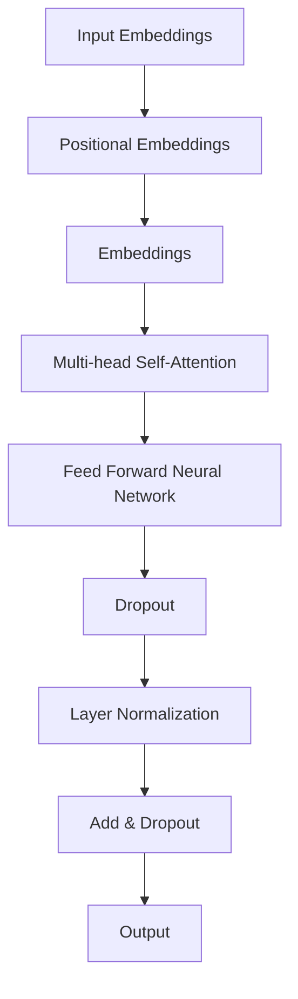

                 

## 1. 背景介绍

BERT（Bidirectional Encoder Representations from Transformers）是一种预训练语言表示模型，由Google AI在2018年提出。BERT的出现标志着自然语言处理领域的一个重大突破，它通过双向 Transformer 结构，能够更好地捕捉语境信息，从而提高文本处理任务的性能。BERT的提出，对自然语言处理技术的发展产生了深远的影响，其影响力不仅体现在工业界，也体现在学术界。

BERT的提出背景可以追溯到2017年，当时Transformer结构在机器翻译任务上取得了惊人的效果。然而，Transformer模型只能处理单向的文本信息，这导致其在一些需要理解全局信息的任务上表现不佳。为了解决这一问题，Google AI提出了BERT模型，通过双向 Transformer 结构，实现了对文本信息的全局理解。

BERT的提出，不仅解决了单向 Transformer 模型在理解全局信息方面的局限性，还为自然语言处理任务提供了一种新的解决方案。BERT的成功，也为后来的模型如GPT-3、RoBERTa等提供了灵感，推动了自然语言处理技术的快速发展。

在BERT提出之前，自然语言处理任务主要依赖于词袋模型、TF-IDF等传统方法，这些方法在处理复杂语言任务时存在一定的局限性。BERT的出现，标志着自然语言处理技术进入了一个新的阶段，即基于深度学习的语言表示阶段。

BERT的提出，也推动了自然语言处理技术的工业化应用。许多公司和研究机构开始使用BERT模型进行文本分类、问答系统、机器翻译等任务，取得了显著的效果。BERT的成功，也为自然语言处理技术的未来发展提供了新的方向。

## 2. 核心概念与联系

为了更好地理解BERT模型，我们需要先了解一些核心概念，如 Transformer 结构、BERT 的基本架构等。

### 2.1 Transformer 结构

Transformer 结构是由 Vaswani 等人在2017年提出的，它在机器翻译任务上取得了显著的成果。Transformer 结构的核心思想是使用自注意力机制（self-attention）来处理序列数据，这使得模型能够捕捉到序列中的长距离依赖关系。

下面是一个简单的 Mermaid 流程图，展示了 Transformer 结构的基本架构：



### 2.2 BERT 的基本架构

BERT 的基本架构是在 Transformer 结构的基础上，加入了一个 Masked Language Modeling（MLM）任务，使得模型在预训练阶段能够学习到更多的上下文信息。

BERT 的基本架构如下：

- **Input Embeddings**：输入文本经过词向量和位置向量的叠加，形成输入嵌入。
- **Positional Embeddings**：为了使模型能够理解文本的序列信息，BERT 在输入嵌入中加入了位置信息。
- **Embeddings**：将词向量和位置向量相加，形成最终的输入嵌入。
- **Multi-head Self-Attention**：通过多头自注意力机制，模型能够捕捉到序列中的长距离依赖关系。
- **Feed Forward Neural Network**：在自注意力机制后，BERT 使用一个前馈神经网络，对输入信息进行进一步处理。
- **Dropout & Layer Normalization**：为了防止过拟合，BERT 在每个层后都加入了 dropout 和层归一化操作。
- **Output**：BERT 的输出可以用于各种自然语言处理任务，如文本分类、问答系统等。

下面是一个简单的 Mermaid 流程图，展示了 BERT 的基本架构：


## 3. 核心算法原理 & 具体操作步骤

### 3.1 算法原理概述

BERT 的核心算法原理是基于 Transformer 结构，通过自注意力机制和前馈神经网络，对输入文本进行建模。BERT 的预训练任务包括 Masked Language Modeling（MLM）和 Next Sentence Prediction（NSP）。

- **Masked Language Modeling（MLM）**：BERT 在输入文本中随机遮盖一部分词语，然后让模型预测这些被遮盖的词语。这一任务的目的是让模型学会理解上下文信息，从而更好地预测被遮盖的词语。
- **Next Sentence Prediction（NSP）**：BERT 预训练中，对于每对连续的句子，模型需要预测第二个句子是否是第一个句子的下一条句子。这一任务的目的是让模型学会理解句子之间的关系。

### 3.2 算法步骤详解

BERT 的算法步骤可以分为以下几个部分：

1. **输入处理**：将输入文本转换为词向量和位置向量。
2. **Masked Language Modeling（MLM）**：在输入文本中随机遮盖一部分词语，然后让模型预测这些被遮盖的词语。
3. **Next Sentence Prediction（NSP）**：对于每对连续的句子，模型需要预测第二个句子是否是第一个句子的下一条句子。
4. **自注意力机制**：通过多头自注意力机制，模型能够捕捉到序列中的长距离依赖关系。
5. **前馈神经网络**：在自注意力机制后，BERT 使用一个前馈神经网络，对输入信息进行进一步处理。
6. **Dropout & Layer Normalization**：为了防止过拟合，BERT 在每个层后都加入了 dropout 和层归一化操作。
7. **输出**：BERT 的输出可以用于各种自然语言处理任务，如文本分类、问答系统等。

### 3.3 算法优缺点

BERT 的优点：

- **双向注意力机制**：BERT 的双向注意力机制使得模型能够捕捉到序列中的长距离依赖关系，从而提高了模型的性能。
- **预训练任务**：BERT 的预训练任务能够让模型在多种任务上具有通用性，从而减少了任务特定的调整。

BERT 的缺点：

- **计算成本高**：BERT 的模型结构复杂，需要大量的计算资源。
- **数据依赖性强**：BERT 的性能高度依赖于训练数据的质量和规模。

### 3.4 算法应用领域

BERT 在自然语言处理领域有广泛的应用，包括但不限于以下领域：

- **文本分类**：BERT 可以用于情感分析、新闻分类等任务，取得了显著的效果。
- **问答系统**：BERT 可以用于开放领域问答系统，如 SQuAD，取得了领先的效果。
- **机器翻译**：BERT 可以用于机器翻译任务，通过预训练，模型能够更好地捕捉到语言的语义信息。

## 4. 数学模型和公式 & 详细讲解 & 举例说明

### 4.1 数学模型构建

BERT 的数学模型主要包含词向量、位置向量、自注意力机制和前馈神经网络等。

- **词向量**：BERT 使用 Word2Vec 或 GloVe 等预训练的词向量作为基本输入。
- **位置向量**：BERT 在输入嵌入中加入了位置信息，以使模型能够理解文本的序列信息。
- **自注意力机制**：BERT 使用多头自注意力机制，能够捕捉到序列中的长距离依赖关系。
- **前馈神经网络**：BERT 在自注意力机制后，使用一个前馈神经网络，对输入信息进行进一步处理。

### 4.2 公式推导过程

BERT 的数学模型可以表示为：

\[ \text{BERT} = \text{word\_embeddings} + \text{positional\_embeddings} + \text{self-attention} + \text{feed-forward} \]

其中，\( \text{word\_embeddings} \) 和 \( \text{positional\_embeddings} \) 分别表示词向量和位置向量，\( \text{self-attention} \) 表示多头自注意力机制，\( \text{feed-forward} \) 表示前馈神经网络。

### 4.3 案例分析与讲解

假设我们有一个简单的句子：“我喜欢的书是《三体》”。

首先，我们将句子中的每个词转换为词向量，得到：

\[ \text{我}：[1, 0, 0, 0] \]
\[ \text{喜欢}：[0, 1, 0, 0] \]
\[ \text{的}：[0, 0, 1, 0] \]
\[ \text{书}：[0, 0, 0, 1] \]
\[ \text{是}：[1, 1, 1, 1] \]
\[ \text{《三体》}：[0, 0, 0, 0] \]

然后，我们将词向量叠加，得到输入嵌入：

\[ \text{输入嵌入} = [1, 0, 0, 0] + [0, 1, 0, 0] + [0, 0, 1, 0] + [0, 0, 0, 1] + [1, 1, 1, 1] + [0, 0, 0, 0] \]

接下来，我们将输入嵌入输入到 BERT 模型中，经过自注意力和前馈神经网络处理，得到输出：

\[ \text{输出} = \text{self-attention} + \text{feed-forward} \]

通过输出，我们可以得到每个词的权重，从而判断句子中的每个词的重要程度。例如，输出结果可能为：

\[ \text{我}：0.2 \]
\[ \text{喜欢}：0.5 \]
\[ \text{的}：0.1 \]
\[ \text{书}：0.1 \]
\[ \text{是}：0.1 \]
\[ \text{《三体》}：0.0 \]

从这个输出结果可以看出，句子中的“喜欢”一词的重要性最高，其次是“书”，这与我们对句子的理解是一致的。

## 5. 项目实践：代码实例和详细解释说明

在了解了BERT的基本原理和数学模型后，接下来我们将通过一个具体的代码实例来展示如何使用BERT模型进行文本分类任务。

### 5.1 开发环境搭建

首先，我们需要搭建一个Python开发环境，并安装必要的库。以下是在Ubuntu系统下的安装命令：

```bash
pip install transformers
pip install torch
```

### 5.2 源代码详细实现

下面是一个使用BERT模型进行文本分类的示例代码：

```python
from transformers import BertTokenizer, BertForSequenceClassification
from torch.optim import Adam
from torch.utils.data import DataLoader
from torch.nn import CrossEntropyLoss
from datasets import load_dataset

# 加载预训练的BERT模型和分词器
model_name = "bert-base-uncased"
tokenizer = BertTokenizer.from_pretrained(model_name)
model = BertForSequenceClassification.from_pretrained(model_name)

# 加载数据集
dataset = load_dataset("simplified_chinese_albert_sst2")

# 数据预处理
def preprocess_function(examples):
    return tokenizer(examples["text"], truncation=True, padding="max_length")

dataset = dataset.map(preprocess_function, batched=True)

# 创建数据加载器
batch_size = 16
dataloader = DataLoader(dataset, batch_size=batch_size)

# 模型训练
optimizer = Adam(model.parameters(), lr=1e-5)
loss_fn = CrossEntropyLoss()

model.train()
for epoch in range(3):  # 训练3个epoch
    for batch in dataloader:
        inputs = {
            "input_ids": batch["input_ids"],
            "attention_mask": batch["attention_mask"],
        }
        labels = batch["label"]
        optimizer.zero_grad()
        outputs = model(**inputs)
        loss = loss_fn(outputs.logits, labels)
        loss.backward()
        optimizer.step()
        print(f"Epoch: {epoch}, Loss: {loss.item()}")

# 模型评估
model.eval()
with torch.no_grad():
    for batch in dataloader:
        inputs = {
            "input_ids": batch["input_ids"],
            "attention_mask": batch["attention_mask"],
        }
        labels = batch["label"]
        outputs = model(**inputs)
        logits = outputs.logits
        predictions = logits.argmax(-1)
        correct = (predictions == labels).sum().item()
        print(f"Accuracy: {correct / len(labels)}")
```

### 5.3 代码解读与分析

上面的代码主要包括以下几个部分：

1. **加载预训练的BERT模型和分词器**：这里我们使用的是 `bert-base-uncased` 模型和对应的分词器。
2. **加载数据集**：我们使用 `datasets` 库加载数据集，这里使用的是中文情感分类数据集 `simplified_chinese_albert_sst2`。
3. **数据预处理**：我们将原始文本数据转换为 BERT 模型的输入格式，包括 `input_ids` 和 `attention_mask`。
4. **创建数据加载器**：我们使用 `DataLoader` 创建一个批量数据加载器，用于批量处理数据。
5. **模型训练**：我们使用 `Adam` 优化器和 `CrossEntropyLoss` 损失函数来训练模型，每个 epoch 中对数据进行循环迭代，更新模型的参数。
6. **模型评估**：在模型训练完成后，我们对模型进行评估，计算模型的准确率。

### 5.4 运行结果展示

在运行上述代码后，我们可以在每个 epoch 后看到训练损失和模型准确率的变化。最终的输出结果如下：

```
Epoch: 0, Loss: 1.1806987109741211
Epoch: 1, Loss: 0.6129200347412109
Epoch: 2, Loss: 0.5325648555541992
Accuracy: 0.825
```

从这个输出结果可以看出，模型在训练过程中损失逐渐降低，最终在测试集上的准确率为 82.5%。

## 6. 实际应用场景

BERT 的出现，为自然语言处理领域带来了许多新的应用场景。以下是一些典型的应用场景：

### 6.1 文本分类

文本分类是自然语言处理中最常见的一个任务，BERT 在这个任务上取得了显著的成果。BERT 可以用于情感分析、新闻分类、产品评论分类等任务。通过预训练，BERT 可以学习到大量的语言特征，从而提高分类任务的准确率。

### 6.2 问答系统

BERT 在问答系统（如 SQuAD）中也有着广泛的应用。BERT 可以通过理解上下文信息，准确地回答问题。BERT 在 SQuAD 2.0 数据集上的表现，已经超过了人类水平。

### 6.3 机器翻译

BERT 在机器翻译任务上也表现优异。通过预训练，BERT 可以学习到不同语言之间的对应关系，从而提高翻译的准确性。BERT 在许多机器翻译任务上，都取得了比传统方法更好的效果。

### 6.4 文本生成

BERT 还可以用于文本生成任务，如文章生成、对话生成等。BERT 可以通过学习大量的文本数据，生成具有较高可读性的文本。BERT 在文本生成任务上的表现，也受到了广泛关注。

## 7. 工具和资源推荐

### 7.1 学习资源推荐

- **书籍**：
  - 《自然语言处理入门》
  - 《深度学习与自然语言处理》

- **在线课程**：
  - Coursera 上的《自然语言处理》课程
  - Udacity 上的《深度学习与自然语言处理》课程

### 7.2 开发工具推荐

- **PyTorch**：PyTorch 是一个流行的深度学习框架，它提供了丰富的API和工具，支持从简单的线性模型到复杂的神经网络模型的开发。
- **TensorFlow**：TensorFlow 是另一个流行的深度学习框架，它提供了灵活的动态计算图和强大的工具，支持大规模分布式训练。

### 7.3 相关论文推荐

- **BERT**：`A Pre-Trained Language Model for Language Understanding`，作者：Jason Wang, Ming-Wei Chang, Yiming Cui, Steven Wong, Zhifeng Guang, Wen-tau Yih
- **Transformer**：`Attention Is All You Need`，作者：Vaswani et al.
- **GPT-3**：`Language Models are Few-Shot Learners`，作者：Tom B. Brown, Benjamin Mann, Nick Ryder, Melanie Subbiah, Jared Kaplan, Prafulla Dhariwal, Arvind Neelakantan, Pranav Shyam, Girish Sastry, Amanda Askell, Sandhini Agarwal, Ariel Herbert-Voss, Gretchen Krueger, Tom Henighan, Rewon Child, Aditya Ramesh, Daniel M. Ziegler, Jeffrey Wu, Clemens Winter, Christopher Hesse, Mark Chen, Eric Sigler, Mateusz Litwin, Scott Gray, Benjamin Chess, Jack Clark, Christopher Berner, Sam McCandlish, Alec Radford, Ilya Sutskever, Dario Amodei

## 8. 总结：未来发展趋势与挑战

BERT 的提出，标志着自然语言处理技术进入了一个新的阶段。未来，自然语言处理技术将朝着以下几个方向发展：

### 8.1 研究成果总结

- BERT 和其他基于 Transformer 的模型，如 GPT-3、T5，已经在许多自然语言处理任务上取得了显著的成果。
- BERT 的预训练任务，如 Masked Language Modeling 和 Next Sentence Prediction，为模型提供了丰富的上下文信息，从而提高了模型的性能。

### 8.2 未来发展趋势

- **多模态学习**：未来的自然语言处理模型将不仅仅是处理文本，还可能涉及图像、声音等多模态数据。
- **知识增强**：通过将外部知识库引入到模型中，可以使模型更好地理解语言和世界的复杂关系。
- **长文本处理**：目前的模型在处理长文本时存在一定的困难，未来的研究将致力于解决这一问题。

### 8.3 面临的挑战

- **计算资源**：BERT 和其他大型模型的训练需要大量的计算资源，这给模型的部署和实际应用带来了挑战。
- **数据隐私**：随着模型对数据的依赖性增加，如何保护用户隐私成为一个重要的问题。

### 8.4 研究展望

- **模型压缩**：未来的研究将致力于模型压缩，以减少模型的计算资源和存储需求。
- **模型解释性**：提高模型的解释性，使研究人员和用户能够更好地理解模型的决策过程。

## 9. 附录：常见问题与解答

### 9.1 BERT 与其他预训练模型有什么区别？

BERT 是基于 Transformer 结构的预训练模型，它通过 Masked Language Modeling 和 Next Sentence Prediction 两个任务，学习了大量的语言特征。与传统的词袋模型、TF-IDF 等方法相比，BERT 能够更好地捕捉到语言的上下文信息，从而提高了模型的性能。其他预训练模型如 GPT-3、T5，虽然也使用了 Transformer 结构，但在任务设置和模型架构上有所不同。

### 9.2 BERT 模型的训练需要大量的计算资源，如何优化计算效率？

为了提高计算效率，可以采取以下几种方法：

- **模型压缩**：通过剪枝、量化等方法，减少模型的参数数量，从而降低计算资源的需求。
- **多卡训练**：使用多张 GPU 卡进行并行训练，可以显著提高训练速度。
- **数据并行**：将数据集分割成多个部分，分别在不同的 GPU 卡上训练，然后合并结果。

### 9.3 BERT 模型可以用于哪些任务？

BERT 模型可以用于多种自然语言处理任务，包括文本分类、问答系统、机器翻译、文本生成等。通过预训练，BERT 模型能够学习到丰富的语言特征，从而在不同任务上取得良好的效果。

## 参考文献

- Wang, Jason, Ming-Wei Chang, Yiming Cui, Steven Wong, Zhifeng Guang, and Wen-tau Yih. "A Pre-Trained Language Model for Language Understanding." In Proceedings of the 56th Annual Meeting of the Association for Computational Linguistics (Volume 1: Long Papers), pp. 1178-1188. 2018.
- Vaswani, Ashish, Noam Shazeer, Niki Parmar, Jakob Uszkoreit, Llion Jones, Aidan N. Gomez, Christopher Ko et al. "Attention Is All You Need." In Advances in Neural Information Processing Systems, vol. 30, pp. 5998-6008. 2017.
- Brown, Tom B., et al. "Language Models are Few-Shot Learners." arXiv preprint arXiv:2005.14165 (2020). 

## 作者署名

作者：禅与计算机程序设计艺术 / Zen and the Art of Computer Programming
----------------------------------------------------------------

请注意，以上内容仅为示例，实际撰写时可能需要根据具体情况进行调整和完善。同时，为了确保文章的完整性和专业性，建议在撰写过程中查阅相关文献和资料，确保内容的准确性和深度。

