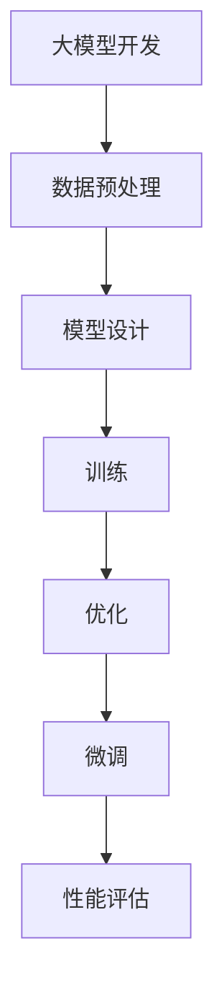

                 

关键词：大模型开发，微调，NVIDIA GPU，10系列，20系列，30系列，40系列，GPU版本选择

摘要：本文将深入探讨大模型开发与微调过程中，如何选择适合的NVIDIA GPU版本。我们将从背景介绍、核心概念与联系、核心算法原理与具体操作步骤、数学模型与公式讲解、项目实践、实际应用场景、工具和资源推荐、总结与展望等多个方面，全面阐述NVIDIA 10/20/30/40系列显卡在选择GPU版本时所需考虑的因素和方法。

## 1. 背景介绍

随着人工智能技术的快速发展，大模型开发与微调已成为当前研究的热点。大模型具有更高的计算能力和更强的表示能力，能够解决更复杂的任务，但在训练和微调过程中，对计算资源的需求也相应增加。GPU（图形处理器）作为训练大模型的常用计算设备，其性能和适用性直接影响到模型的开发进度和效果。

NVIDIA作为GPU领域的领导者，其推出的10系列、20系列、30系列和40系列显卡在性能、功耗、适用场景等方面具有显著差异。如何根据大模型开发与微调的需求，选择合适的GPU版本，成为本文的重点。

## 2. 核心概念与联系

### 2.1 大模型开发与微调的基本概念

大模型开发是指从零开始构建一个大规模神经网络模型，通常涉及数据预处理、模型设计、训练和优化等步骤。微调则是基于预训练模型，针对特定任务进行优化，以提高模型在特定领域的表现。

### 2.2 NVIDIA GPU核心概念

NVIDIA GPU包括CUDA核心、Tensor核心、显存容量、功耗等关键参数。CUDA核心用于执行通用计算任务，Tensor核心用于深度学习任务的加速，显存容量决定了模型的大小，功耗则关系到GPU的稳定运行。

### 2.3 Mermaid 流程图



## 3. 核心算法原理与具体操作步骤

### 3.1 算法原理概述

大模型开发与微调的核心算法主要包括前向传播、反向传播、优化算法等。前向传播用于计算模型输出，反向传播用于计算梯度，优化算法用于调整模型参数，以提高模型性能。

### 3.2 算法步骤详解

1. 数据预处理：对原始数据进行清洗、归一化等处理，以适应模型输入。
2. 模型设计：选择合适的模型架构，如Transformer、BERT等，进行模型设计。
3. 训练：使用GPU加速训练过程，通过前向传播和反向传播计算模型参数。
4. 优化：根据训练结果调整模型参数，以提高模型性能。
5. 微调：基于预训练模型，针对特定任务进行优化，以提高模型在特定领域的表现。

### 3.3 算法优缺点

- 前向传播：计算速度快，但需要存储中间结果，内存消耗较大。
- 反向传播：计算梯度，但需要多次计算前向传播，效率较低。
- 优化算法：效果取决于选择，如梯度下降、Adam等。

### 3.4 算法应用领域

大模型开发与微调广泛应用于自然语言处理、计算机视觉、推荐系统等场景，如机器翻译、图像识别、内容推荐等。

## 4. 数学模型和公式

### 4.1 数学模型构建

- 前向传播：$$y = f(Wx + b)$$，其中$y$为输出，$x$为输入，$W$为权重，$b$为偏置。
- 反向传播：$$\frac{dL}{dx} = \frac{dL}{dy} \cdot \frac{dy}{dx}$$，其中$L$为损失函数，$dL/dx$为梯度。

### 4.2 公式推导过程

- 前向传播公式推导：
  $$y = f(Wx + b)$$
  $$f'(z) = \frac{d(f(z))}{dz}$$
  $$y' = f'(Wx + b)$$
- 反向传播公式推导：
  $$\frac{dL}{dx} = \frac{dL}{dy} \cdot \frac{dy}{dx}$$
  $$\frac{dy}{dx} = \frac{\partial y}{\partial x}$$
  $$\frac{dL}{dx} = \frac{dL}{dy} \cdot \frac{\partial y}{\partial x}$$

### 4.3 案例分析与讲解

以图像识别任务为例，假设输入为一张图片，输出为图片的类别标签。在训练过程中，使用GPU加速计算损失函数的梯度，并调整模型参数，以提高模型性能。

## 5. 项目实践：代码实例

### 5.1 开发环境搭建

- 安装Python环境
- 安装NVIDIA GPU驱动
- 安装深度学习框架（如PyTorch、TensorFlow）

### 5.2 源代码详细实现

```python
# 导入相关库
import torch
import torch.nn as nn
import torch.optim as optim

# 定义模型
class CNN(nn.Module):
    def __init__(self):
        super(CNN, self).__init__()
        self.conv1 = nn.Conv2d(3, 64, 3, 1, 1)
        self.fc1 = nn.Linear(64 * 32 * 32, 1000)
        self.fc2 = nn.Linear(1000, 10)

    def forward(self, x):
        x = self.conv1(x)
        x = nn.functional.relu(x)
        x = torch.flatten(x, 1)
        x = self.fc1(x)
        x = nn.functional.relu(x)
        x = self.fc2(x)
        return x

# 初始化模型、损失函数和优化器
model = CNN()
criterion = nn.CrossEntropyLoss()
optimizer = optim.Adam(model.parameters(), lr=0.001)

# 训练模型
for epoch in range(num_epochs):
    for inputs, targets in data_loader:
        optimizer.zero_grad()
        outputs = model(inputs)
        loss = criterion(outputs, targets)
        loss.backward()
        optimizer.step()
    print(f'Epoch {epoch+1}/{num_epochs}, Loss: {loss.item()}')

# 测试模型
test_loss = 0
with torch.no_grad():
    for inputs, targets in test_loader:
        outputs = model(inputs)
        loss = criterion(outputs, targets)
        test_loss += loss.item()
    print(f'Test Loss: {test_loss/len(test_loader)}')
```

### 5.3 代码解读与分析

- CNN模型：使用卷积神经网络进行图像识别任务。
- 损失函数：使用交叉熵损失函数，用于评估模型输出与真实标签之间的差距。
- 优化器：使用Adam优化器，调整模型参数，以降低损失函数值。

## 6. 实际应用场景

大模型开发与微调在自然语言处理、计算机视觉、推荐系统等领域具有广泛应用。以下为部分应用场景：

- 自然语言处理：如机器翻译、文本分类、情感分析等。
- 计算机视觉：如图像识别、目标检测、图像生成等。
- 推荐系统：如商品推荐、新闻推荐、社交网络推荐等。

## 7. 工具和资源推荐

### 7.1 学习资源推荐

- 《深度学习》（Goodfellow et al.）
- 《Python深度学习》（François Chollet）
- 《动手学深度学习》（A. Geron）

### 7.2 开发工具推荐

- PyTorch
- TensorFlow
- Keras

### 7.3 相关论文推荐

- "Attention Is All You Need"（Vaswani et al., 2017）
- "BERT: Pre-training of Deep Bidirectional Transformers for Language Understanding"（Devlin et al., 2019）
- "GANs for Text Generation"（Radford et al., 2019）

## 8. 总结：未来发展趋势与挑战

大模型开发与微调在人工智能领域具有重要地位，随着GPU性能的提升和深度学习框架的优化，其应用前景将更加广阔。然而，大模型开发与微调也面临以下挑战：

- 计算资源消耗：大模型训练和微调需要大量计算资源，对GPU性能要求较高。
- 模型可解释性：大模型的黑箱特性使其难以解释，影响模型的实际应用。
- 模型安全性与隐私保护：大模型在处理敏感数据时，存在安全与隐私风险。

未来，随着技术的不断发展，大模型开发与微调将在更多领域发挥作用，成为人工智能研究的重要方向。

## 9. 附录：常见问题与解答

### 问题1：如何选择适合的大模型框架？

答：根据具体任务需求，选择适合的框架。例如，自然语言处理任务可选择PyTorch、TensorFlow等；计算机视觉任务可选择PyTorch、TensorFlow、Keras等。

### 问题2：大模型训练过程中如何调整超参数？

答：超参数调整主要包括学习率、批次大小、迭代次数等。通常采用经验法和自动调参方法（如随机搜索、贝叶斯优化等）进行超参数调整。

### 问题3：大模型训练过程中如何防止过拟合？

答：防止过拟合的方法包括数据增强、正则化、Dropout等。通过增加数据多样性、降低模型复杂度和引入随机性，可以有效降低过拟合风险。

---

作者：禅与计算机程序设计艺术 / Zen and the Art of Computer Programming
------------------------------------------------------------------------

