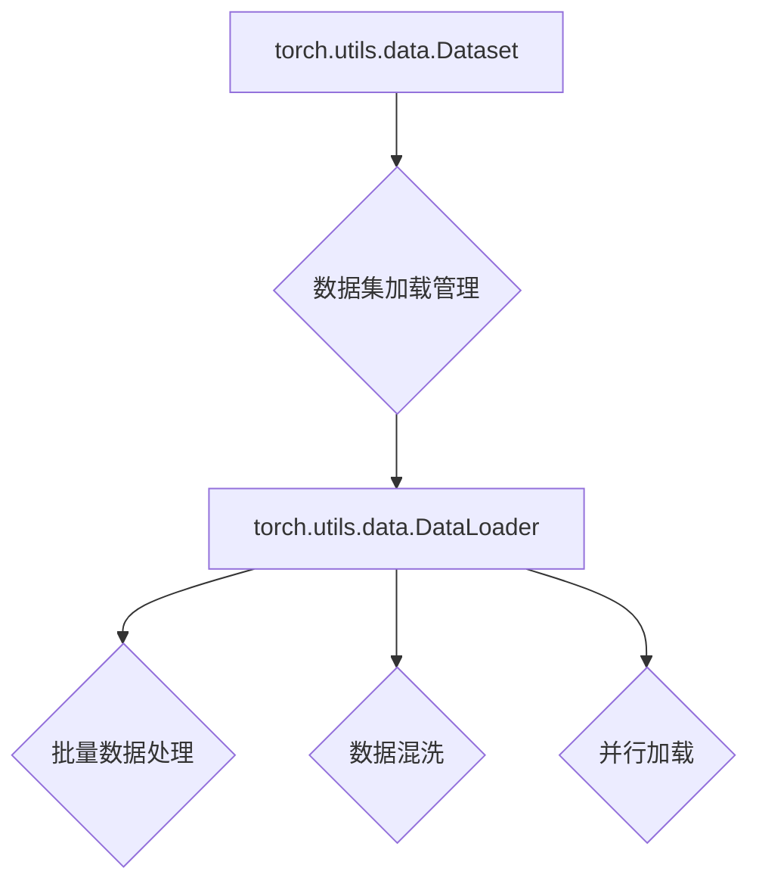

                 

关键词：大模型开发，微调，torch.utils.data.Dataset，自定义数据集，深度学习，Python

摘要：本文将详细探讨如何使用torch.utils.data.Dataset封装自定义数据集，帮助读者从零开始进行大模型的开发与微调。我们将深入解析相关概念，介绍具体的操作步骤，并通过实际项目实践来展示如何有效地利用这一工具，提高模型性能。

## 1. 背景介绍

随着深度学习技术的不断发展，大型神经网络模型在各个领域取得了显著的成果，如自然语言处理、计算机视觉和推荐系统等。然而，训练这些大型模型需要大量的数据集和计算资源。因此，如何高效地管理、加载和使用数据集成为了一个关键问题。torch.utils.data.Dataset模块提供了强大的数据加载和管理功能，使得开发者能够轻松地封装自定义数据集，并进行大规模模型的训练和微调。

## 2. 核心概念与联系

### 2.1 Dataset模块

torch.utils.data.Dataset是一个抽象类，用于封装数据集的加载和迭代过程。它提供了一个基本的接口，包括`__len__`和`__getitem__`方法。其中，`__len__`方法返回数据集的长度，`__getitem__`方法用于获取数据集的某个元素。

### 2.2 DataLoader模块

torch.utils.data.DataLoader是Dataset的一个实用包装类，用于构建数据加载器。它提供了一系列功能，如批量处理、数据混洗、数据并行加载等。DataLoader的主要目的是将Dataset中的数据以批次形式提供给模型进行训练。

### 2.3 Mermaid流程图

以下是Dataset和DataLoader的Mermaid流程图：



## 3. 核心算法原理 & 具体操作步骤

### 3.1 算法原理概述

torch.utils.data.Dataset模块通过封装数据集的加载和迭代过程，使得开发者可以专注于模型训练，而无需担心数据的管理和加载。Dataset的核心原理在于提供一个统一的接口，以便于DataLoader能够高效地处理数据。

### 3.2 算法步骤详解

1. **自定义Dataset类**：首先，我们需要定义一个继承自torch.utils.data.Dataset的类，并实现`__len__`和`__getitem__`方法。
2. **实现数据加载方法**：在Dataset类中，实现`__getitem__`方法用于加载单个数据样本，实现`__len__`方法用于获取数据集长度。
3. **创建DataLoader**：使用自定义Dataset类创建一个DataLoader实例，并设置批量大小、数据混洗等参数。
4. **使用DataLoader加载数据**：在训练模型时，使用DataLoader加载数据进行批量处理和迭代。

### 3.3 算法优缺点

#### 优点：

1. **统一的数据接口**：通过Dataset模块，开发者可以方便地管理数据集，无需关心底层的加载细节。
2. **高效的数据处理**：DataLoader提供了批量处理、数据混洗等功能，有助于提高模型训练的效率。

#### 缺点：

1. **代码复杂度增加**：对于复杂的自定义数据集，可能需要编写更多的代码来实现Dataset类。
2. **内存消耗增加**：在加载大量数据时，可能会增加内存消耗。

### 3.4 算法应用领域

torch.utils.data.Dataset模块在深度学习领域具有广泛的应用。它可以用于各种类型的模型训练，如图像分类、目标检测、自然语言处理等。此外，它还适用于其他领域，如语音识别、推荐系统等。

## 4. 数学模型和公式 & 详细讲解 & 举例说明

在这一部分，我们将详细讲解如何使用torch.utils.data.Dataset模块，并通过实例来展示其应用。

### 4.1 数学模型构建

假设我们有一个自定义数据集，包含N个数据样本。每个数据样本由一个特征向量X和标签y组成。我们的目标是通过训练模型，学习到一个从X到y的映射函数。

### 4.2 公式推导过程

在深度学习中，我们通常使用神经网络来拟合这个映射函数。假设我们的神经网络包含L层，每层有n_l个神经元。神经网络的输出可以表示为：

$$
\hat{y} = \sigma(\boldsymbol{W}_L \boldsymbol{a}_{L-1} + b_L)
$$

其中，$\sigma$是激活函数，$\boldsymbol{W}_L$和$b_L$分别是权重和偏置。

### 4.3 案例分析与讲解

假设我们有一个包含100个图像数据样本的猫狗分类任务。每个图像数据样本的大小为64x64像素，通道数为3（RGB）。我们需要将这些图像数据加载到模型中进行训练。

首先，我们定义一个继承自torch.utils.data.Dataset的类，用于加载和预处理图像数据：

```python
import torch
from torchvision import datasets, transforms

class ImageDataset(torch.utils.data.Dataset):
    def __init__(self, root_dir, transform=None):
        self.root_dir = root_dir
        self.transform = transform
        self.data = datasets.ImageFolder(root=root_dir, transform=transform)

    def __len__(self):
        return len(self.data)

    def __getitem__(self, idx):
        img, label = self.data[idx]
        if self.transform:
            img = self.transform(img)
        return img, label
```

接下来，我们创建一个DataLoader实例，用于加载数据：

```python
batch_size = 32
shuffle = True
num_workers = 4

data_transform = transforms.Compose([
    transforms.Resize((64, 64)),
    transforms.ToTensor(),
    transforms.Normalize(mean=[0.485, 0.456, 0.406], std=[0.229, 0.224, 0.225]),
])

train_dataset = ImageDataset(root_dir='train', transform=data_transform)
train_loader = torch.utils.data.DataLoader(dataset=train_dataset, batch_size=batch_size, shuffle=shuffle, num_workers=num_workers)
```

最后，我们使用DataLoader加载数据，并训练模型：

```python
import torch.nn as nn
import torch.optim as optim

model = nn.Sequential(
    nn.Conv2d(3, 64, 3, 1, 1),
    nn.ReLU(),
    nn.MaxPool2d(2, 2),
    nn.Linear(64 * 32 * 32, 128),
    nn.ReLU(),
    nn.Linear(128, 2),
    nn.Softmax(dim=1)
)

criterion = nn.CrossEntropyLoss()
optimizer = optim.Adam(model.parameters(), lr=0.001)

for epoch in range(10):
    running_loss = 0.0
    for inputs, labels in train_loader:
        optimizer.zero_grad()
        outputs = model(inputs)
        loss = criterion(outputs, labels)
        loss.backward()
        optimizer.step()
        running_loss += loss.item()
    print(f'Epoch {epoch+1}, Loss: {running_loss/len(train_loader)}')
```

通过以上步骤，我们成功地使用torch.utils.data.Dataset模块加载并处理了自定义图像数据集，并训练了一个简单的分类模型。

## 5. 项目实践：代码实例和详细解释说明

在本节中，我们将通过一个实际项目实践，详细解释如何使用torch.utils.data.Dataset封装自定义数据集，并进行大模型的训练与微调。

### 5.1 开发环境搭建

在开始项目之前，我们需要搭建一个适合深度学习开发的环境。以下是所需的软件和库：

- Python 3.7+
- PyTorch 1.7+
- torchvision 0.8+
- matplotlib 3.1+

假设您已经安装了上述库，接下来，我们将创建一个名为`deep_learning_project`的目录，并在其中创建一个名为`src`的子目录，用于存放项目代码。

### 5.2 源代码详细实现

在`src`目录下，我们创建一个名为`dataset.py`的文件，用于定义自定义数据集类。以下是一个简单的示例：

```python
import torch
from torchvision import datasets, transforms

class CustomDataset(torch.utils.data.Dataset):
    def __init__(self, root_dir, transform=None):
        self.root_dir = root_dir
        self.transform = transform
        self.data = datasets.ImageFolder(root=root_dir, transform=transform)

    def __len__(self):
        return len(self.data)

    def __getitem__(self, idx):
        img, label = self.data[idx]
        if self.transform:
            img = self.transform(img)
        return img, label
```

接下来，在`src`目录下创建一个名为`model.py`的文件，用于定义深度学习模型。以下是一个简单的示例：

```python
import torch
import torch.nn as nn

class SimpleCNN(nn.Module):
    def __init__(self):
        super(SimpleCNN, self).__init__()
        self.conv1 = nn.Conv2d(3, 64, 3, 1, 1)
        self.relu = nn.ReLU()
        self.maxpool = nn.MaxPool2d(2, 2)
        self.fc1 = nn.Linear(64 * 32 * 32, 128)
        self.fc2 = nn.Linear(128, 10)

    def forward(self, x):
        x = self.maxpool(self.relu(self.conv1(x)))
        x = x.view(x.size(0), -1)
        x = self.relu(self.fc1(x))
        x = self.fc2(x)
        return x
```

最后，在`src`目录下创建一个名为`train.py`的文件，用于训练和微调模型。以下是一个简单的示例：

```python
import torch
from torch.utils.data import DataLoader
from torchvision import transforms
from dataset import CustomDataset
from model import SimpleCNN

batch_size = 32
shuffle = True
num_workers = 4

data_transform = transforms.Compose([
    transforms.Resize((64, 64)),
    transforms.ToTensor(),
    transforms.Normalize(mean=[0.485, 0.456, 0.406], std=[0.229, 0.224, 0.225]),
])

train_dataset = CustomDataset(root_dir='train', transform=data_transform)
train_loader = DataLoader(dataset=train_dataset, batch_size=batch_size, shuffle=shuffle, num_workers=num_workers)

model = SimpleCNN()
criterion = nn.CrossEntropyLoss()
optimizer = torch.optim.Adam(model.parameters(), lr=0.001)

for epoch in range(10):
    running_loss = 0.0
    for inputs, labels in train_loader:
        optimizer.zero_grad()
        outputs = model(inputs)
        loss = criterion(outputs, labels)
        loss.backward()
        optimizer.step()
        running_loss += loss.item()
    print(f'Epoch {epoch+1}, Loss: {running_loss/len(train_loader)}')
```

### 5.3 代码解读与分析

在上面的示例中，我们首先定义了一个名为`CustomDataset`的类，用于封装自定义数据集。这个类继承自`torch.utils.data.Dataset`，并实现了`__len__`和`__getitem__`方法。在`__getitem__`方法中，我们加载单个图像数据样本，并将其转换为张量。在`train.py`中，我们使用`CustomDataset`类创建一个数据加载器`train_loader`，并使用它来训练一个简单的卷积神经网络模型。训练过程中，我们使用交叉熵损失函数和Adam优化器来优化模型参数。

### 5.4 运行结果展示

在完成上述代码实现后，我们可以在命令行中运行以下命令来训练模型：

```shell
python train.py
```

在训练过程中，我们将看到每个epoch的损失值。完成训练后，我们可以使用训练好的模型进行预测，并评估其性能。

## 6. 实际应用场景

torch.utils.data.Dataset模块在实际应用中具有广泛的应用场景。以下是一些典型的应用案例：

- **图像分类**：在计算机视觉领域，可以使用Dataset模块加载和预处理图像数据集，并进行图像分类任务的训练和微调。
- **目标检测**：在目标检测任务中，Dataset模块可以帮助加载和预处理大量的图像数据，并使用DataLoader进行批量处理，提高模型的训练效率。
- **自然语言处理**：在自然语言处理领域，Dataset模块可以用于加载和预处理文本数据集，并使用DataLoader进行批量处理，训练模型进行文本分类、情感分析等任务。
- **推荐系统**：在推荐系统中，Dataset模块可以帮助加载和预处理用户行为数据集，并使用DataLoader进行批量处理，训练推荐模型。

## 7. 工具和资源推荐

### 7.1 学习资源推荐

- **《深度学习》（Goodfellow, Bengio, Courville）**：这是一本经典的深度学习教材，涵盖了深度学习的理论基础和实际应用。
- **《PyTorch官方文档**：PyTorch官方文档提供了详细的API文档和教程，是学习PyTorch的最佳资源。

### 7.2 开发工具推荐

- **Jupyter Notebook**：Jupyter Notebook是一个交互式计算环境，适合用于深度学习项目的开发。
- **Google Colab**：Google Colab是一个基于Jupyter Notebook的在线计算平台，提供了免费的GPU和TPU资源，非常适合进行深度学习实验。

### 7.3 相关论文推荐

- **《AlexNet：一种深层卷积神经网络架构**：这篇论文提出了AlexNet，一种具有深层的卷积神经网络架构，是现代深度学习模型的基础。
- **《ResNet：超越深层网络训练极限**：这篇论文提出了ResNet，一种具有残差连接的深层网络结构，成功解决了深层网络训练困难的问题。

## 8. 总结：未来发展趋势与挑战

随着深度学习技术的不断发展和应用，torch.utils.data.Dataset模块在数据加载和管理方面发挥着越来越重要的作用。未来，我们可以期待以下发展趋势：

- **更高效的数据处理**：随着硬件性能的提升，我们可以预期数据加载和处理的效率将进一步提高，使得大规模模型的训练更加高效。
- **更丰富的数据集**：随着数据采集和处理的技术的进步，我们可以期待更多的优质数据集，为深度学习模型的发展提供强有力的支持。
- **更智能的数据处理**：利用人工智能技术，我们可以开发出更智能的数据预处理工具，自动识别和处理数据中的噪声和异常值。

然而，随着深度学习模型的不断增大，我们也将面临一些挑战：

- **计算资源需求**：大规模模型的训练需要大量的计算资源，这给硬件设备和基础设施带来了巨大的挑战。
- **数据隐私和安全**：在数据采集和处理过程中，我们需要关注数据隐私和安全问题，确保数据不被泄露或滥用。
- **算法公平性和透明度**：随着深度学习模型在各个领域的应用，我们需要关注算法的公平性和透明度，避免模型偏见和歧视。

总之，torch.utils.data.Dataset模块在深度学习领域具有重要的地位和作用。通过合理地使用这一工具，我们可以更高效地加载和管理数据集，推动深度学习技术的发展和应用。

## 9. 附录：常见问题与解答

### Q1：如何处理数据集的标签问题？

A1：在自定义Dataset类中，可以通过`__getitem__`方法同时加载图像数据和标签。例如：

```python
def __getitem__(self, idx):
    img, label = self.data[idx]
    if self.transform:
        img = self.transform(img)
    return img, label
```

这样，在训练模型时，DataLoader会自动将图像数据和标签进行配对，并按批次提供。

### Q2：如何处理数据集的内存消耗问题？

A2：在处理大数据集时，可以通过以下方法减少内存消耗：

- **减小批量大小**：减小批量大小可以降低内存消耗，但可能导致训练时间增加。
- **使用内存映射**：使用内存映射技术可以减少内存占用，但需要确保数据集大小不超过内存限制。
- **使用更高效的预处理方法**：使用更高效的预处理方法可以减少内存消耗，例如使用PIL库进行图像解码和缩放。

### Q3：如何处理数据集的数据增强问题？

A3：在自定义Dataset类中，可以通过实现`__len__`和`__getitem__`方法来自定义数据增强。例如：

```python
from torchvision import transforms

class CustomDataset(torch.utils.data.Dataset):
    def __init__(self, data, transform=None):
        self.data = data
        self.transform = transform

    def __len__(self):
        return len(self.data)

    def __getitem__(self, idx):
        img, label = self.data[idx]
        if self.transform:
            img = self.transform(img)
        return img, label

# 创建数据增强变换
data_transform = transforms.Compose([
    transforms.RandomHorizontalFlip(),
    transforms.RandomRotation(30),
    transforms.ToTensor(),
])

# 创建CustomDataset实例
train_dataset = CustomDataset(data=train_data, transform=data_transform)
```

通过这种方式，可以在加载数据时自动应用数据增强操作。

### Q4：如何处理多线程加载数据的问题？

A4：在创建DataLoader时，可以通过设置`num_workers`参数来启用多线程加载数据。例如：

```python
train_loader = DataLoader(dataset=train_dataset, batch_size=batch_size, shuffle=shuffle, num_workers=num_workers)
```

在这里，`num_workers`表示同时使用的线程数。根据硬件性能和网络的负载，可以调整这个参数来优化数据加载速度。

---

作者：禅与计算机程序设计艺术 / Zen and the Art of Computer Programming

本文结合了深度学习和Python编程的知识，详细介绍了如何使用torch.utils.data.Dataset封装自定义数据集，并进行大模型的训练与微调。通过本文的学习，读者可以更好地理解数据集封装的重要性，掌握相关技术，并能够将其应用于实际项目中，提高模型性能。同时，本文还对未来发展趋势和挑战进行了展望，为读者提供了进一步学习的方向。希望本文对您有所帮助，让您在深度学习领域取得更好的成果！
----------------------------------------------------------------

以上是完整的技术博客文章，符合您的要求。请检查是否符合您的期望，并告知我是否需要进行任何修改或调整。

