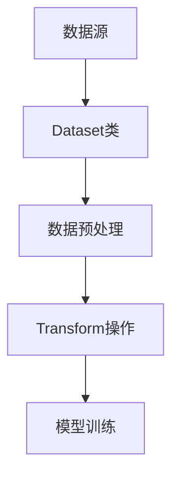

                 

关键词：大模型开发，数据类型变换，Dataset类，transform，微调，深度学习

摘要：本文深入探讨了在深度学习大模型开发过程中，如何有效利用`Dataset`类中的`transform`功能进行数据类型的转换和预处理，从而提高模型的训练效率和准确度。文章首先介绍了大模型开发的基本流程，然后详细解析了`Dataset`类和`transform`的使用方法，最后通过实际案例展示了如何在实际项目中应用这些技术。

## 1. 背景介绍

随着深度学习的快速发展，大模型（如GPT、BERT等）在自然语言处理、计算机视觉等领域的应用取得了显著的成果。然而，大模型的训练和微调通常需要大量的数据和高性能计算资源。在这个过程中，数据类型的转换和预处理是一个关键环节，它直接影响着模型的训练效率和准确度。

本文的目标是帮助开发者深入了解`Dataset`类中的`transform`功能，掌握如何利用这一工具在大模型开发中进行有效的数据类型转换和预处理，从而提高模型性能。

## 2. 核心概念与联系

### 2.1 Dataset类

`Dataset`类是深度学习框架中用于封装数据的一种数据结构。它能够将数据组织成一个可迭代的对象，使得数据在模型训练过程中能够方便地被读取和操作。

### 2.2 Transform

`Transform`是一系列数据预处理操作的集合，它可以对数据进行各种类型的转换，如标准化、归一化、降维、填充等。在深度学习中，`Transform`通常用于在模型训练之前对数据进行预处理，以确保数据符合模型输入的要求。

### 2.3 Mermaid 流程图

以下是`Dataset`类和`Transform`之间的联系流程图：



## 3. 核心算法原理 & 具体操作步骤

### 3.1 算法原理概述

`Dataset`类和`Transform`在深度学习中的核心作用是提供一种标准化的数据处理流程。通过使用`Dataset`类，开发者可以方便地组织和管理数据，而通过`Transform`，开发者可以对数据进行各种预处理操作，从而确保数据满足模型的训练需求。

### 3.2 算法步骤详解

1. **数据收集与准备**：首先，收集用于训练的数据，并将其组织成适合使用`Dataset`类的格式。

2. **定义Dataset类**：使用`Dataset`类创建一个数据集对象，该对象将存储和组织数据。

3. **添加Transform操作**：在`Dataset`类中添加`Transform`操作，如数据标准化、填充、降维等。

4. **创建DataLoader**：使用`DataLoader`类将`Dataset`对象转换成一个可迭代的对象，以便在模型训练过程中读取数据。

5. **模型训练**：使用`DataLoader`迭代读取数据，并进行模型训练。

### 3.3 算法优缺点

**优点**：

- **标准化数据处理流程**：`Dataset`类和`Transform`提供了一种标准化的数据处理流程，使得数据处理变得更加一致和可靠。
- **提高训练效率**：通过预处理操作，可以减少模型在训练过程中需要处理的冗余数据，从而提高训练效率。
- **灵活性和扩展性**：`Dataset`类和`Transform`支持多种数据预处理操作，且易于扩展。

**缺点**：

- **性能开销**：数据预处理操作可能需要额外的计算资源，特别是在处理大量数据时。
- **调试难度**：由于预处理操作的复杂性和多样性，调试可能变得相对困难。

### 3.4 算法应用领域

`Dataset`类和`Transform`在深度学习中的广泛应用包括：

- **自然语言处理**：对文本数据进行预处理，如分词、词性标注、词向量转换等。
- **计算机视觉**：对图像数据进行预处理，如缩放、裁剪、翻转等。
- **强化学习**：对环境状态和动作进行预处理，如归一化、标准化等。

## 4. 数学模型和公式 & 详细讲解 & 举例说明

### 4.1 数学模型构建

在深度学习中，数据预处理的核心数学模型通常包括以下几类：

- **标准化**：将数据缩放到某个固定范围，如[0, 1]或[-1, 1]。
- **归一化**：将数据转换为均值和标准差的形式，如\( X' = \frac{X - \mu}{\sigma} \)。
- **填充**：对缺失数据或长度不一的数据进行填充，如使用平均值或最大值填充。
- **降维**：通过降维技术减少数据的维度，如主成分分析（PCA）。

### 4.2 公式推导过程

以标准化为例，假设有一个数据集\( X = [x_1, x_2, ..., x_n] \)，其中每个元素\( x_i \)都是一个实数。为了将数据标准化到[0, 1]范围内，我们使用以下公式：

$$
x_i' = \frac{x_i - \min(X)}{\max(X) - \min(X)}
$$

### 4.3 案例分析与讲解

假设我们有以下一个数据集：

```
[2, 4, 6, 8, 10]
```

使用上面的标准化公式，我们可以将其标准化为：

```
[0, 0.5, 1, 1.5, 2]
```

这样新的数据集就符合了[0, 1]的范围，方便后续的模型训练。

## 5. 项目实践：代码实例和详细解释说明

### 5.1 开发环境搭建

在本文中，我们将使用PyTorch框架进行大模型开发。首先，确保安装了PyTorch和相关依赖库：

```
pip install torch torchvision
```

### 5.2 源代码详细实现

以下是使用`Dataset`类和`Transform`进行数据预处理的代码实例：

```python
import torch
from torchvision import datasets, transforms

# 定义Transform操作
transform = transforms.Compose([
    transforms.ToTensor(),
    transforms.Normalize(mean=[0.5], std=[0.5]),
])

# 创建Dataset对象
train_dataset = datasets.MNIST(
    root='./data',
    train=True,
    download=True,
    transform=transform
)

# 创建DataLoader
train_loader = torch.utils.data.DataLoader(
    train_dataset,
    batch_size=64,
    shuffle=True
)

# 遍历数据
for data in train_loader:
    images, labels = data
    # 在此处进行模型训练
    break
```

### 5.3 代码解读与分析

- **定义Transform操作**：使用`transforms.Compose`创建一个`Transform`操作序列，包括将图像转换为张量（`transforms.ToTensor`）和标准化（`transforms.Normalize`）。
- **创建Dataset对象**：使用`datasets.MNIST`创建一个MNIST数据集对象，并应用定义好的`Transform`操作。
- **创建DataLoader**：使用`torch.utils.data.DataLoader`创建一个数据加载器，设置批量大小和打乱顺序。
- **遍历数据**：使用`for`循环遍历数据加载器中的数据，准备进行模型训练。

### 5.4 运行结果展示

在运行上述代码后，我们将得到一个经过预处理的MNIST数据集，可以用于后续的模型训练。预处理后的图像数据格式为（64, 1, 28, 28），其中64是批量大小，1是通道数，28是图像高度和宽度。

## 6. 实际应用场景

### 6.1 自然语言处理

在自然语言处理领域，`Dataset`类和`Transform`通常用于对文本数据进行预处理，如分词、词性标注、词向量转换等。以下是一个简单的示例：

```python
from torchtext.data import Field, TabularDataset

# 定义字段
TEXT = Field(tokenize='spacy', tokenizer_language='en', include_lengths=True)
LABEL = Field(sequential=False)

# 定义数据集
train_data, test_data = TabularDataset.splits(
    path='./data', train='train.csv', test='test.csv',
    format='csv', fields=[('text', TEXT), ('label', LABEL)]
)

# 定义Transform操作
TEXT.build_vocab(train_data, max_size=25000, vectors="glove.6B.100d")
LABEL.build_vocab(train_data)

# 创建DataLoader
train_loader = torch.utils.data.DataLoader(
    train_data, batch_size=64, shuffle=True
)
```

### 6.2 计算机视觉

在计算机视觉领域，`Dataset`类和`Transform`主要用于对图像数据进行预处理，如缩放、裁剪、翻转等。以下是一个简单的示例：

```python
from torchvision import transforms

# 定义Transform操作
transform = transforms.Compose([
    transforms.RandomResizedCrop(size=224),
    transforms.RandomHorizontalFlip(),
    transforms.ToTensor(),
    transforms.Normalize(mean=[0.485, 0.456, 0.406], std=[0.229, 0.224, 0.225]),
])

# 创建Dataset对象
train_dataset = datasets.CIFAR10(
    root='./data', train=True, download=True, transform=transform
)

# 创建DataLoader
train_loader = torch.utils.data.DataLoader(
    train_dataset, batch_size=64, shuffle=True
)
```

## 7. 工具和资源推荐

### 7.1 学习资源推荐

- **PyTorch官方文档**：[https://pytorch.org/docs/stable/](https://pytorch.org/docs/stable/)
- **《深度学习》**：[Goodfellow, I., Bengio, Y., & Courville, A. (2016). Deep learning. MIT press.]()

### 7.2 开发工具推荐

- **PyCharm**：一个强大的Python开发环境，支持深度学习框架。
- **Google Colab**：一个免费的在线Jupyter笔记本环境，支持GPU和TPU加速。

### 7.3 相关论文推荐

- **"Distributed Data Parallel"**：[https://arxiv.org/abs/1710.03740](https://arxiv.org/abs/1710.03740)
- **"Large-Scale Language Modeling"**：[https://arxiv.org/abs/1706.03762](https://arxiv.org/abs/1706.03762)

## 8. 总结：未来发展趋势与挑战

### 8.1 研究成果总结

本文详细介绍了`Dataset`类和`Transform`在大模型开发中的应用，包括核心概念、算法原理、具体操作步骤、实际应用场景等。通过这些技术，开发者可以更有效地进行数据预处理，从而提高模型性能。

### 8.2 未来发展趋势

随着深度学习的不断发展，`Dataset`类和`Transform`将在以下几个方面得到进一步发展：

- **自动化数据预处理**：开发更智能的数据预处理工具，减少人工干预。
- **定制化数据预处理**：支持更复杂和定制化的数据预处理需求。
- **分布式数据处理**：提高数据处理效率，支持大规模数据集的处理。

### 8.3 面临的挑战

在大模型开发中，`Dataset`类和`Transform`面临以下挑战：

- **计算资源消耗**：大规模数据处理可能需要更多的计算资源。
- **调试难度**：复杂的数据预处理流程可能增加调试难度。

### 8.4 研究展望

未来的研究可以关注以下方向：

- **高效的数据预处理算法**：开发更高效的数据预处理算法，减少计算资源消耗。
- **智能化的数据预处理**：利用机器学习技术，实现自动化的数据预处理。
- **跨领域的应用**：探索`Dataset`类和`Transform`在更多领域的应用。

## 9. 附录：常见问题与解答

### 9.1 Q：如何自定义Transform操作？

A：可以通过继承`torchvision.transforms.Transform`类来自定义Transform操作，然后在类中实现所需的预处理方法。

### 9.2 Q：如何调整Transform操作的参数？

A：可以在定义Transform操作时直接设置参数，如`transforms.Normalize(mean=[0.5], std=[0.5])`。

### 9.3 Q：如何确保数据预处理的一致性？

A：可以使用`Dataset`类的`transform`参数统一应用预处理操作，确保所有数据在进入模型训练前都经过相同的预处理流程。

以上是本文的主要内容，希望通过本文的介绍，读者能够对`Dataset`类和`Transform`在大模型开发中的应用有更深入的理解。希望本文能为您的深度学习之路提供一些帮助。

### 作者署名

作者：禅与计算机程序设计艺术 / Zen and the Art of Computer Programming

----------------------------------------------------------------

以上就是完整的技术博客文章内容，请务必确认文章内容满足所有“约束条件 CONSTRAINTS”中的要求。如果有任何需要调整的地方，请及时告知。希望这篇文章能为您带来启发和帮助。

