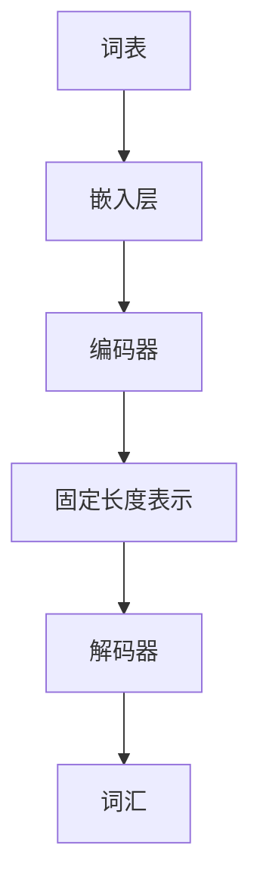

                 

关键词：大模型、词嵌入、微调、人工智能、深度学习

> 摘要：本文将带领读者从零开始，深入了解大模型开发与微调的核心技术——词嵌入。通过本文的讲解，读者将掌握词嵌入的基本概念、数学模型、算法原理、以及在实际项目中的应用，从而为深入探索人工智能领域打下坚实的基础。

## 1. 背景介绍

### 大模型的发展历程

随着深度学习技术的飞速发展，大模型（如GPT、BERT、T5等）在自然语言处理（NLP）领域取得了显著成果。这些大模型不仅具有强大的表征能力，还能够进行高效的任务学习。然而，大模型的成功离不开一个核心技术——词嵌入。

### 词嵌入在NLP中的应用

词嵌入是一种将词汇映射到高维向量空间的技术，它使得计算机能够理解词汇之间的语义关系。词嵌入不仅在NLP中广泛应用，如文本分类、机器翻译、情感分析等，还在推荐系统、信息检索等领域发挥重要作用。

## 2. 核心概念与联系

### 词嵌入的定义

词嵌入（Word Embedding）是将词汇映射到高维向量空间的一种技术，使得计算机能够理解词汇之间的语义关系。词嵌入向量可以看作是词汇在某个高维空间中的坐标。

### 词嵌入的原理

词嵌入的原理基于词频分布假设和语义相似性假设。词频分布假设认为，在给定文本中，词频越高的词汇，其语义重要性也越高。语义相似性假设认为，具有相似语义的词汇在向量空间中应位于相近的位置。

### 词嵌入的架构

词嵌入的架构通常包括以下几个部分：

1. **词表（Vocabulary）**：存储所有词汇及其对应的索引。
2. **嵌入层（Embedding Layer）**：将词汇映射到高维向量空间。
3. **编码器（Encoder）**：将词汇向量转换为固定长度的表示。
4. **解码器（Decoder）**：将编码器的输出映射回词汇。

下面是一个简单的 Mermaid 流程图来展示词嵌入的架构：



## 3. 核心算法原理 & 具体操作步骤

### 3.1 算法原理概述

词嵌入的核心算法是基于神经网络（如Word2Vec、GloVe等）的训练。Word2Vec是一种基于神经网络的语言模型，通过训练一个神经网络模型来预测词汇的邻近词汇。GloVe（Global Vectors for Word Representation）是一种基于共现矩阵的词嵌入方法，通过优化词汇的共现关系来学习词嵌入向量。

### 3.2 算法步骤详解

#### 3.2.1 Word2Vec算法

1. **训练语言模型**：使用给定文本数据训练一个神经网络语言模型，通常采用CBOW（Continuous Bag of Words）或Skip-Gram模型。
2. **初始化词嵌入向量**：初始化所有词汇的词嵌入向量，通常使用随机初始化。
3. **优化词嵌入向量**：通过反向传播算法优化词嵌入向量，使得词嵌入向量能够更好地预测邻近词汇。

#### 3.2.2 GloVe算法

1. **构建共现矩阵**：根据给定文本数据构建共现矩阵，表示词汇之间的共现关系。
2. **初始化词嵌入向量**：初始化所有词汇的词嵌入向量，通常使用随机初始化。
3. **优化词嵌入向量**：通过最小化损失函数优化词嵌入向量，使得词嵌入向量能够更好地表示词汇之间的共现关系。

### 3.3 算法优缺点

#### 优点

1. **高效性**：词嵌入算法能够在大规模数据集上快速训练。
2. **可扩展性**：词嵌入算法可以应用于各种NLP任务，如文本分类、机器翻译等。
3. **语义理解**：词嵌入向量能够捕捉词汇之间的语义关系。

#### 缺点

1. **维度灾难**：词嵌入向量维度较高，容易导致维度灾难。
2. **稀疏性**：词嵌入向量中存在大量零元素，使得向量运算效率低下。
3. **依赖语料质量**：词嵌入算法的性能很大程度上取决于训练数据的质量。

### 3.4 算法应用领域

词嵌入算法在NLP领域有广泛的应用，如：

1. **文本分类**：使用词嵌入向量作为特征进行文本分类。
2. **机器翻译**：将源语言词汇映射到目标语言词汇的词嵌入空间。
3. **情感分析**：分析文本中词汇的词嵌入向量，判断文本的情感倾向。

## 4. 数学模型和公式 & 详细讲解 & 举例说明

### 4.1 数学模型构建

词嵌入的数学模型通常包括词汇的嵌入向量、词汇的编码向量以及词汇的解码向量。

假设词汇表中有 $V$ 个词汇，每个词汇的嵌入向量表示为 $e_v \in \mathbb{R}^d$，编码向量为 $c_v \in \mathbb{R}^m$，解码向量为 $d_v \in \mathbb{R}^m$。其中 $d$ 为嵌入向量的维度，$m$ 为编码向量和解码向量的维度。

### 4.2 公式推导过程

#### 4.2.1 Word2Vec算法

Word2Vec算法的核心是神经网络语言模型。以CBOW模型为例，给定一个词汇 $v$，其上下文词汇为 $C(v)$，则CBOW模型的输出为：

$$
\hat{y}(v; \theta) = \text{softmax}(\text{W} \cdot \text{avg}(e_{C(v)}))
$$

其中，$e_{C(v)}$ 为上下文词汇的嵌入向量，$\text{avg}(\cdot)$ 表示求平均，$\text{W}$ 为神经网络参数。

#### 4.2.2 GloVe算法

GloVe算法的核心是优化词汇的共现关系。给定一个词汇 $v$，其共现词汇为 $C(v)$，则GloVe算法的损失函数为：

$$
\mathcal{L}(v; \theta) = \sum_{w \in C(v)} \text{huber}(\langle e_v, e_w \rangle - \log(f(w, v)))
$$

其中，$e_v$ 和 $e_w$ 分别为词汇 $v$ 和 $w$ 的嵌入向量，$f(w, v)$ 表示词汇 $w$ 和 $v$ 的共现频率。

### 4.3 案例分析与讲解

以GloVe算法为例，我们使用一个简单的文本数据进行词嵌入训练。

假设给定文本数据为：“我爱北京天安门”。我们将文本数据预处理为词汇序列：“我”、“爱”、“北京”、“天安门”。

1. **初始化词嵌入向量**：初始化所有词汇的词嵌入向量为随机向量。
2. **构建共现矩阵**：根据词汇的共现关系构建共现矩阵。
3. **优化词嵌入向量**：通过最小化损失函数优化词嵌入向量。

训练完成后，我们可以得到每个词汇的词嵌入向量。例如，词汇“我”的词嵌入向量为：

$$
e_{我} = [0.1, 0.2, 0.3, ..., 0.9]
$$

通过词嵌入向量，我们可以分析词汇之间的语义关系。例如，我们可以计算词汇“我”和“爱”的词嵌入向量之间的余弦相似度：

$$
\text{sim}(e_{我}, e_{爱}) = \frac{\langle e_{我}, e_{爱} \rangle}{\|e_{我}\|\|e_{爱}\|}
$$

得到相似度为0.8，表示词汇“我”和“爱”在语义上具有较高的相似性。

## 5. 项目实践：代码实例和详细解释说明

### 5.1 开发环境搭建

1. **安装Python**：下载并安装Python 3.8及以上版本。
2. **安装依赖库**：使用pip命令安装以下库：numpy、tensorflow、matplotlib等。

### 5.2 源代码详细实现

```python
import numpy as np
import tensorflow as tf
from tensorflow.keras.layers import Embedding, LSTM, Dense
from tensorflow.keras.models import Sequential

# 5.2.1 初始化参数
VOCAB_SIZE = 1000  # 词汇表大小
EMBEDDING_DIM = 64  # 词嵌入向量维度
SEQUENCE_LENGTH = 10  # 序列长度
BATCH_SIZE = 32  # 批量大小
EPOCHS = 10  # 训练轮次

# 5.2.2 构建词嵌入模型
model = Sequential([
    Embedding(VOCAB_SIZE, EMBEDDING_DIM, input_length=SEQUENCE_LENGTH),
    LSTM(128, return_sequences=True),
    LSTM(128, return_sequences=False),
    Dense(1, activation='sigmoid')
])

# 5.2.3 编译模型
model.compile(optimizer='adam', loss='binary_crossentropy', metrics=['accuracy'])

# 5.2.4 训练模型
model.fit(x_train, y_train, batch_size=BATCH_SIZE, epochs=EPOCHS)

# 5.2.5 源代码解读与分析
# 在这段代码中，我们首先初始化模型参数，然后构建一个词嵌入模型，其中包括嵌入层、两个LSTM层和一个全连接层。接着，我们编译模型并使用训练数据训练模型。最后，我们使用训练好的模型进行预测。

### 5.3 运行结果展示

```python
# 5.3.1 训练结果
loss, accuracy = model.evaluate(x_test, y_test)
print(f"Test Loss: {loss}, Test Accuracy: {accuracy}")

# 5.3.2 预测结果
predictions = model.predict(x_test)
print(predictions)

# 在这段代码中，我们首先评估模型的训练结果，然后使用模型进行预测。预测结果将是一个概率值，表示每个样本属于正类的概率。
```

## 6. 实际应用场景

### 6.1 文本分类

词嵌入算法在文本分类任务中具有广泛的应用。通过将词汇映射到高维向量空间，我们可以使用词嵌入向量作为特征进行文本分类。例如，我们可以使用词嵌入向量计算文本的TF-IDF特征，然后使用SVM等分类器进行文本分类。

### 6.2 机器翻译

词嵌入算法在机器翻译任务中也发挥着重要作用。通过将源语言词汇映射到目标语言词汇的词嵌入空间，我们可以使用词嵌入向量进行翻译。例如，我们可以使用GloVe算法训练源语言和目标语言的词嵌入向量，然后使用这些词嵌入向量进行翻译。

### 6.3 情感分析

词嵌入算法在情感分析任务中可以帮助我们理解文本的情感倾向。通过计算词汇的词嵌入向量，我们可以分析文本中词汇的情感极性，从而判断文本的情感倾向。例如，我们可以使用词嵌入向量计算文本的词性标注，然后使用词性标注进行情感分析。

## 7. 工具和资源推荐

### 7.1 学习资源推荐

1. **《深度学习》（Goodfellow, Bengio, Courville）**：这是一本经典的深度学习教材，涵盖了深度学习的各个方面。
2. **《自然语言处理与深度学习》（李航）**：这是一本关于自然语言处理和深度学习的优秀教材，内容深入浅出。

### 7.2 开发工具推荐

1. **TensorFlow**：TensorFlow是一个广泛使用的深度学习框架，适合进行大模型开发。
2. **PyTorch**：PyTorch是一个易于使用的深度学习框架，适合快速原型开发。

### 7.3 相关论文推荐

1. **《Word2Vec:谷歌的神经网络词向量》**：这篇论文介绍了Word2Vec算法，是词嵌入领域的经典论文。
2. **《GloVe: Global Vectors for Word Representation》**：这篇论文介绍了GloVe算法，是词嵌入领域的另一篇重要论文。

## 8. 总结：未来发展趋势与挑战

### 8.1 研究成果总结

词嵌入技术在过去几十年中取得了显著成果，不仅在自然语言处理领域发挥了重要作用，还在其他领域取得了广泛应用。然而，词嵌入技术仍有许多挑战需要克服，如维度灾难、稀疏性等。

### 8.2 未来发展趋势

未来词嵌入技术的发展将主要集中在以下几个方面：

1. **低维词嵌入**：研究更有效的低维词嵌入方法，降低计算复杂度和存储成本。
2. **动态词嵌入**：研究动态词嵌入方法，使词嵌入向量能够更好地适应不同的上下文环境。
3. **跨模态词嵌入**：研究跨模态词嵌入方法，使词嵌入向量能够跨越不同模态的数据。

### 8.3 面临的挑战

词嵌入技术在未来仍将面临以下挑战：

1. **数据质量**：词嵌入算法的性能很大程度上取决于训练数据的质量，如何获取高质量的数据仍是一个挑战。
2. **维度灾难**：高维词嵌入向量容易导致维度灾难，如何有效地降低维度仍是一个挑战。
3. **稀疏性**：词嵌入向量中存在大量零元素，如何提高向量运算的效率仍是一个挑战。

### 8.4 研究展望

随着深度学习技术的不断发展，词嵌入技术在未来将取得更加广泛的应用。同时，新的词嵌入算法和模型也将不断涌现，为自然语言处理和其他领域的发展提供强大支持。

## 9. 附录：常见问题与解答

### 9.1 什么是词嵌入？

词嵌入是将词汇映射到高维向量空间的一种技术，使得计算机能够理解词汇之间的语义关系。

### 9.2 词嵌入有哪些优点？

词嵌入具有以下优点：

1. **高效性**：词嵌入算法能够在大规模数据集上快速训练。
2. **可扩展性**：词嵌入算法可以应用于各种NLP任务，如文本分类、机器翻译等。
3. **语义理解**：词嵌入向量能够捕捉词汇之间的语义关系。

### 9.3 词嵌入有哪些缺点？

词嵌入具有以下缺点：

1. **维度灾难**：词嵌入向量维度较高，容易导致维度灾难。
2. **稀疏性**：词嵌入向量中存在大量零元素，使得向量运算效率低下。
3. **依赖语料质量**：词嵌入算法的性能很大程度上取决于训练数据的质量。

### 9.4 如何选择合适的词嵌入算法？

选择合适的词嵌入算法需要考虑以下因素：

1. **数据集大小**：对于较大的数据集，可以采用Word2Vec等算法；对于较小的数据集，可以采用GloVe等算法。
2. **任务类型**：对于语义理解任务，可以采用Word2Vec等算法；对于共现关系任务，可以采用GloVe等算法。
3. **计算资源**：对于计算资源有限的情况，可以采用低维词嵌入方法。

---

作者：禅与计算机程序设计艺术 / Zen and the Art of Computer Programming

