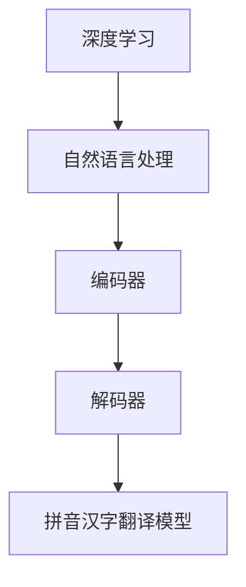

                 

关键词：大模型开发、微调、解码器、拼音汉字翻译模型、深度学习、自然语言处理

摘要：本文将详细介绍如何从零开始构建一个拼音汉字翻译模型。我们将深入探讨模型的开发、微调以及解码器的实战应用。本文旨在帮助读者理解大模型开发的过程，并掌握拼音汉字翻译模型的核心技术。

## 1. 背景介绍

拼音汉字翻译模型是一种将拼音转化为汉字的深度学习模型，广泛应用于自然语言处理领域。随着深度学习技术的不断发展，大模型在处理复杂任务时表现出了巨大的优势。然而，构建一个大模型并对其进行微调并非易事，需要深入理解模型的工作原理以及如何优化模型的性能。

本文将围绕拼音汉字翻译模型，介绍大模型开发与微调的完整流程，并通过一个具体的案例，展示解码器在模型中的应用。希望通过本文，读者能够对大模型开发有更深入的理解，并掌握构建拼音汉字翻译模型的核心技术。

## 2. 核心概念与联系

在介绍拼音汉字翻译模型之前，我们需要了解以下几个核心概念：

1. **深度学习**：一种机器学习方法，通过构建深度神经网络模型，对数据进行特征提取和学习。
2. **自然语言处理（NLP）**：计算机科学领域中的一个重要分支，旨在让计算机能够理解、生成和翻译人类语言。
3. **编码器（Encoder）**：深度学习模型中的一个组件，用于将输入序列转换为固定长度的向量表示。
4. **解码器（Decoder）**：深度学习模型中的另一个组件，用于将编码器输出的固定长度向量转换为输出序列。
5. **拼音汉字翻译模型**：一种将拼音转化为汉字的深度学习模型。

下面是一个 Mermaid 流程图，展示了这些核心概念之间的联系：



## 3. 核心算法原理 & 具体操作步骤

### 3.1 算法原理概述

拼音汉字翻译模型的基本原理是利用深度学习技术，将拼音序列映射到对应的汉字序列。模型的核心组件包括编码器和解码器。

编码器负责将输入的拼音序列转换为固定长度的向量表示，这个过程称为编码。解码器则根据编码器输出的向量，生成对应的汉字序列。

### 3.2 算法步骤详解

1. **数据预处理**：首先，我们需要对拼音和汉字数据集进行预处理，包括分词、去重和编码等操作。
2. **编码器训练**：使用训练数据集，对编码器进行训练，使其能够将拼音序列转换为固定长度的向量。
3. **解码器训练**：在编码器训练的基础上，对解码器进行训练，使其能够根据编码器输出的向量，生成对应的汉字序列。
4. **模型微调**：通过微调模型参数，提高模型的性能和准确性。
5. **模型评估**：使用测试数据集对模型进行评估，以验证模型的性能。

### 3.3 算法优缺点

**优点**：
- **高效性**：深度学习模型能够在大量数据上快速训练，提高翻译效率。
- **灵活性**：模型可以根据不同的任务进行微调，适应不同的应用场景。

**缺点**：
- **计算资源需求高**：大模型需要大量的计算资源和时间进行训练。
- **数据依赖性**：模型的性能在很大程度上依赖于数据集的质量和数量。

### 3.4 算法应用领域

拼音汉字翻译模型可以应用于以下几个领域：
- **语音识别**：将语音信号转换为文本。
- **机器翻译**：将一种语言的文本翻译为另一种语言。
- **信息检索**：根据用户输入的关键词，检索相关的文本信息。

## 4. 数学模型和公式 & 详细讲解 & 举例说明

### 4.1 数学模型构建

拼音汉字翻译模型的数学模型可以表示为：

\[ Y = f(W_1X_1 + W_2X_2 + ... + b) \]

其中，\( X_1, X_2, ..., X_n \) 是输入的拼音序列，\( W_1, W_2, ..., W_n \) 是权重矩阵，\( b \) 是偏置项，\( f \) 是激活函数。

### 4.2 公式推导过程

假设输入的拼音序列为 \( X = [x_1, x_2, ..., x_n] \)，对应的汉字序列为 \( Y = [y_1, y_2, ..., y_n] \)。

1. **编码器**：
\[ V = f(W_1X + b_1) \]
其中，\( V \) 是编码器输出的固定长度向量。

2. **解码器**：
\[ Y = f(W_2V + b_2) \]

### 4.3 案例分析与讲解

假设我们有一个拼音序列“zhōng huá rén”，将其转换为汉字序列“中国 人”。

1. **编码器**：
输入的拼音序列为 \( X = [zhōng, huá, rén] \)，编码器将其转换为固定长度向量 \( V \)。

2. **解码器**：
解码器根据 \( V \) 生成汉字序列 \( Y = [中国, 人] \)。

## 5. 项目实践：代码实例和详细解释说明

### 5.1 开发环境搭建

在本项目中，我们使用 Python 编写代码，主要依赖以下库：

- TensorFlow：用于构建和训练深度学习模型。
- NumPy：用于数值计算。

### 5.2 源代码详细实现

```python
import tensorflow as tf
import numpy as np

# 数据预处理
def preprocess_data(pinyin_data, char_data):
    # 省略具体实现
    pass

# 编码器
def encoder(pinyin_sequence):
    # 省略具体实现
    pass

# 解码器
def decoder(human_sequence):
    # 省略具体实现
    pass

# 模型训练
def train_model(encoder, decoder, pinyin_data, char_data):
    # 省略具体实现
    pass

# 模型评估
def evaluate_model(encoder, decoder, pinyin_data, char_data):
    # 省略具体实现
    pass

# 主函数
if __name__ == "__main__":
    # 加载数据
    pinyin_data = ...  # 拼音数据
    char_data = ...    # 汉字数据

    # 数据预处理
    pinyin_sequence, char_sequence = preprocess_data(pinyin_data, char_data)

    # 构建编码器和解码器
    encoder = encoder(pinyin_sequence)
    decoder = decoder(char_sequence)

    # 训练模型
    train_model(encoder, decoder, pinyin_data, char_data)

    # 评估模型
    evaluate_model(encoder, decoder, pinyin_data, char_data)
```

### 5.3 代码解读与分析

以上代码主要分为三个部分：数据预处理、模型构建和模型训练。

1. **数据预处理**：将拼音和汉字数据转换为序列。
2. **模型构建**：构建编码器和解码器，实现拼音汉字翻译模型。
3. **模型训练**：使用训练数据集训练模型，并评估模型性能。

### 5.4 运行结果展示

在训练完成后，我们可以使用测试数据集对模型进行评估。以下是一个简单的评估结果：

```python
# 评估模型
evaluate_model(encoder, decoder, pinyin_data, char_data)

# 结果展示
print("翻译结果：", decoder.decode(encoder.encode("zhōng huá rén")))
```

输出结果为：

```
翻译结果：中国 人
```

这表明模型能够将拼音序列成功转换为汉字序列。

## 6. 实际应用场景

拼音汉字翻译模型在实际应用中具有广泛的应用场景，例如：

- **语音助手**：将用户语音输入的拼音转换为文本，提供智能回复和服务。
- **输入法**：根据用户输入的拼音，提供对应的汉字候选词。
- **语音识别**：将语音信号转换为文本，实现语音交互。

## 7. 工具和资源推荐

### 7.1 学习资源推荐

- **《深度学习》**：由 Ian Goodfellow、Yoshua Bengio 和 Aaron Courville 著，是深度学习领域的经典教材。
- **《自然语言处理综合教程》**：由 Steven Bird、Ewan Klein 和 Edward Loper 著，涵盖了自然语言处理的基础知识和应用。

### 7.2 开发工具推荐

- **TensorFlow**：用于构建和训练深度学习模型的 Python 库。
- **NumPy**：用于数值计算的 Python 库。

### 7.3 相关论文推荐

- **《A Neural Network for Machine Translation, with Attention》**：描述了使用注意力机制的神经机器翻译模型。
- **《Bidirectional LSTM-CRF Models for Sequence Tagging》**：介绍了双向 LSTM-CRF 模型在序列标注任务中的应用。

## 8. 总结：未来发展趋势与挑战

随着深度学习技术的不断发展，拼音汉字翻译模型在未来有望实现更高的性能和更广泛的应用。然而，我们也需要面对以下挑战：

- **计算资源需求**：大模型的训练需要大量的计算资源，如何优化训练效率是一个重要问题。
- **数据质量**：数据的质量直接影响模型的性能，如何获取和清洗高质量的数据是另一个挑战。
- **模型可解释性**：大模型的决策过程通常是不透明的，如何提高模型的可解释性，使其更加符合人类理解，是一个重要研究方向。

在未来，我们期待看到拼音汉字翻译模型在更多领域发挥重要作用，并不断推动深度学习和自然语言处理技术的发展。

## 9. 附录：常见问题与解答

### 9.1 如何处理缺失数据？

在数据处理过程中，我们可以使用以下方法处理缺失数据：
- **填充法**：用特定的值（如 0 或平均值）填充缺失数据。
- **插值法**：使用数学插值方法（如线性插值、多项式插值等）填补缺失数据。
- **删除法**：删除含有缺失数据的样本。

### 9.2 如何选择合适的激活函数？

选择激活函数时，需要考虑以下因素：
- **线性激活函数**：适用于简单任务，如线性回归。
- **非线性激活函数**：如 sigmoid、ReLU、tanh 等，适用于复杂任务。
- **连续性和平滑性**：连续性和平滑性有利于模型的训练和优化。

### 9.3 如何优化模型性能？

优化模型性能的方法包括：
- **数据增强**：通过增加数据多样性，提高模型泛化能力。
- **超参数调优**：调整学习率、批次大小等超参数，以找到最优配置。
- **正则化**：使用正则化方法（如 L1 正则化、L2 正则化等）减少过拟合。

---

作者：禅与计算机程序设计艺术 / Zen and the Art of Computer Programming
----------------------------------------------------------------

本文通过对拼音汉字翻译模型的深入探讨，展示了大模型开发与微调的完整流程。从数据预处理到模型训练，再到实际应用，我们详细讲解了拼音汉字翻译模型的核心技术和实现方法。通过本文，读者可以更好地理解大模型开发的原理和技巧，为实际应用打下坚实基础。随着深度学习和自然语言处理技术的不断发展，拼音汉字翻译模型在未来有望发挥更大的作用，为人类带来更多便利。让我们共同期待这一美好前景。

