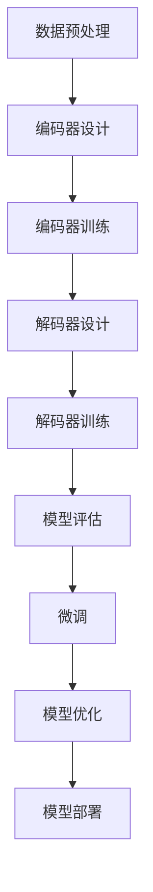

                 

关键词：大模型开发，微调，解码器，深度学习，人工智能

摘要：本文从零开始，系统介绍了大模型开发与微调的方法，以及解码器在其中的实现。通过深入解析核心概念、算法原理、数学模型，并结合实际项目案例，帮助读者全面了解大模型开发与微调的技术细节。

## 1. 背景介绍

随着人工智能技术的快速发展，深度学习在大规模数据处理和智能决策领域取得了显著成果。然而，如何有效地开发和微调整大模型，使其在特定任务上达到最佳性能，仍然是当前研究的热点问题。解码器作为深度学习中的一个重要组件，负责将编码器输出的隐含表示转换为具体的输出结果，其性能直接影响到大模型的最终效果。

本文将围绕大模型开发与微调这一主题，详细介绍解码器的实现方法。首先，我们将介绍大模型开发与微调的基本概念和原理，然后深入探讨解码器的核心算法和具体实现步骤。通过本文的阅读，读者将能够掌握大模型开发与微调的核心技术，为后续的实践应用打下坚实基础。

## 2. 核心概念与联系

### 2.1 大模型开发与微调的概念

大模型开发是指利用深度学习技术，设计并训练出一个具有较高性能的模型。微调则是在大模型训练完成后，针对特定任务进行调整和优化，使其在特定任务上达到最佳性能。

### 2.2 解码器的概念

解码器是深度学习中的一个重要组件，负责将编码器输出的隐含表示转换为具体的输出结果。在序列建模任务中，解码器通常用于生成文本、图像等序列数据。

### 2.3 大模型开发与微调的关系

解码器在大模型开发与微调过程中起着至关重要的作用。通过优化解码器，可以提高大模型的性能，使其在特定任务上达到最佳效果。

### 2.4 Mermaid 流程图

以下是一个描述大模型开发与微调过程的 Mermaid 流程图：

## 3. 核心算法原理 & 具体操作步骤

### 3.1 算法原理概述

解码器在大模型开发与微调过程中主要涉及以下几个步骤：

1. 数据预处理：对输入数据进行处理，使其符合解码器的输入要求。
2. 编码器设计：设计一个能够将输入数据映射为隐含表示的编码器。
3. 编码器训练：使用训练数据对编码器进行训练，使其能够生成高质量的隐含表示。
4. 解码器设计：设计一个能够将隐含表示映射为输出结果的解码器。
5. 解码器训练：使用编码器生成的隐含表示和真实输出结果对解码器进行训练。
6. 模型评估：对训练完成的模型进行评估，确定其性能是否达到预期。
7. 微调：根据评估结果对模型进行调整和优化。
8. 模型优化：对模型进行进一步优化，提高其性能。
9. 模型部署：将训练完成的模型部署到实际应用场景中。

### 3.2 算法步骤详解

1. **数据预处理**

   数据预处理是解码器实现的第一步，其主要目的是对输入数据进行处理，使其符合解码器的输入要求。具体操作包括：

   - 数据清洗：去除数据中的噪声和异常值。
   - 数据归一化：将数据缩放到一个固定的范围，如[0, 1]。
   - 数据转换：将数据转换为解码器可以处理的格式，如将文本转换为词向量。

2. **编码器设计**

   编码器的设计是解码器实现的核心环节，其主要目标是能够将输入数据映射为高质量的隐含表示。具体操作包括：

   - 确定编码器的结构：选择合适的神经网络结构，如卷积神经网络（CNN）、循环神经网络（RNN）等。
   - 设置编码器的参数：确定编码器的权重、偏置等参数。
   - 编码器训练：使用训练数据对编码器进行训练，使其能够生成高质量的隐含表示。

3. **编码器训练**

   编码器训练的主要目标是使编码器能够生成高质量的隐含表示。具体操作包括：

   - 选择合适的损失函数：如交叉熵损失函数、均方误差损失函数等。
   - 设置训练参数：如学习率、迭代次数等。
   - 训练编码器：使用训练数据对编码器进行训练，并不断调整编码器的参数，使其生成高质量的隐含表示。

4. **解码器设计**

   解码器的设计与编码器类似，其主要目标是能够将隐含表示映射为输出结果。具体操作包括：

   - 确定解码器的结构：选择合适的神经网络结构，如卷积神经网络（CNN）、循环神经网络（RNN）等。
   - 设置解码器的参数：确定解码器的权重、偏置等参数。
   - 解码器训练：使用编码器生成的隐含表示和真实输出结果对解码器进行训练。

5. **解码器训练**

   解码器训练的主要目标是使解码器能够生成高质量的输出结果。具体操作包括：

   - 选择合适的损失函数：如交叉熵损失函数、均方误差损失函数等。
   - 设置训练参数：如学习率、迭代次数等。
   - 训练解码器：使用编码器生成的隐含表示和真实输出结果对解码器进行训练，并不断调整解码器的参数，使其生成高质量的输出结果。

6. **模型评估**

   模型评估是对训练完成的模型进行评估，确定其性能是否达到预期。具体操作包括：

   - 选择合适的评估指标：如准确率、召回率、F1值等。
   - 对模型进行评估：使用评估指标对模型进行评估，确定其性能是否达到预期。

7. **微调**

   微调是对模型进行调整和优化，以提高其在特定任务上的性能。具体操作包括：

   - 分析评估结果：根据评估结果分析模型存在的问题。
   - 调整模型结构：根据分析结果调整模型的结构，如增加或删除神经元、调整层间连接等。
   - 调整训练参数：根据分析结果调整训练参数，如学习率、迭代次数等。
   - 重新训练模型：使用调整后的模型结构和对

