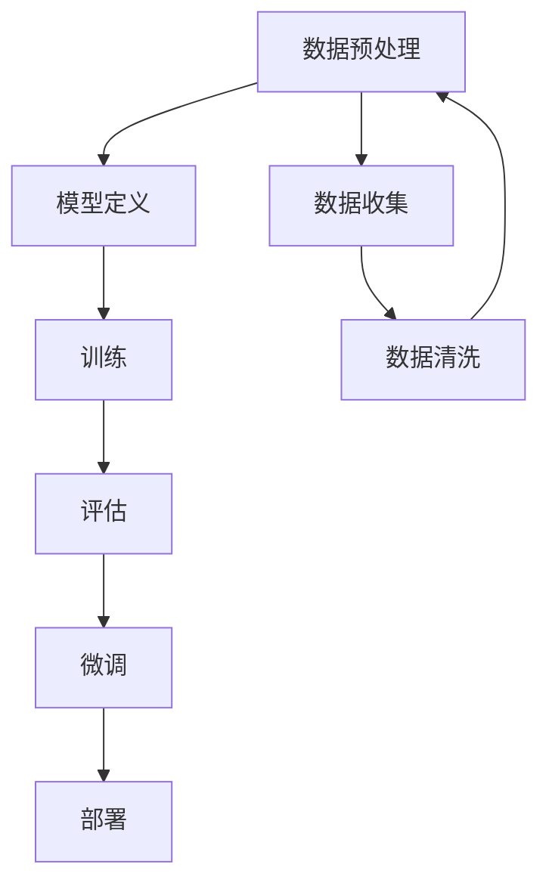

                 

关键词：大模型开发，微调，PyTorch 2.0，深度学习，实战框架，人工智能

> 摘要：本文旨在为读者提供一份详尽的指南，以帮助他们在深度学习领域从零开始构建并微调大模型。我们特别关注PyTorch 2.0这一前沿框架，展示其在大模型开发与微调中的独特优势与挑战。通过本文，读者将了解大模型开发的背景知识，掌握核心算法原理，学习具体的操作步骤，并了解大模型在不同领域的应用。本文亦将对数学模型、项目实践、实际应用场景、工具和资源进行详细探讨，最后总结研究成果，展望未来发展趋势与挑战。

## 1. 背景介绍

在人工智能迅猛发展的当下，大模型已经成为深度学习领域的研究热点。大模型，如GPT-3、BERT等，拥有数十亿至数千亿的参数，能够实现前所未有的高性能和精确度。然而，大模型开发与微调并非易事，它涉及到海量数据的处理、复杂的模型架构设计、高效的训练策略和优化算法等多个方面。

PyTorch作为深度学习领域的明星框架，凭借其灵活的动态计算图和易用的接口，已经得到了广泛的应用。PyTorch 2.0在原有基础上进行了大量优化和扩展，提供了更加强大的功能，使得大模型开发与微调变得更加高效和便捷。

本文将结合PyTorch 2.0的实际应用，从以下几个方面展开讨论：

- 大模型开发与微调的基本概念和原理
- 核心算法原理与具体操作步骤
- 数学模型和公式推导
- 项目实践与代码实例
- 实际应用场景
- 工具和资源推荐
- 未来发展趋势与挑战

通过本文，读者将能够系统地了解大模型开发与微调的全过程，掌握关键技术和方法，为后续研究和应用打下坚实基础。

### 1.1 大模型开发的重要性

大模型开发在深度学习领域的重要性不可忽视。首先，大模型能够处理更加复杂的任务，如自然语言处理（NLP）、图像识别、语音识别等，实现更高的准确性和性能。其次，大模型能够捕捉到更多细微的特征，从而在特定领域取得突破性的进展。例如，GPT-3在文本生成、翻译等任务上展现了惊人的能力，BERT在多种自然语言处理任务上超越了传统的模型。

此外，大模型的开发也推动了深度学习算法的进步。大模型的训练过程需要高效的计算资源和优化算法，这促使研究人员不断探索新的训练策略和架构设计，从而推动了深度学习技术的整体发展。

### 1.2 PyTorch 2.0的特点与优势

PyTorch 2.0作为深度学习领域的最新框架，具有以下显著特点与优势：

1. **动态计算图**：PyTorch的动态计算图使得模型构建和调试变得更加灵活和高效。开发人员可以直接使用Python代码定义复杂的模型结构，而不需要编写复杂的计算图描述。
   
2. **易用性**：PyTorch提供了丰富的API和工具，使得模型训练和微调更加便捷。其内置的数据加载器、优化器等组件大大简化了开发过程。

3. **扩展性**：PyTorch具有良好的扩展性，使得开发人员可以轻松地定制和优化模型架构，从而满足不同任务的需求。

4. **社区支持**：PyTorch拥有庞大的开发者社区，提供了大量的教程、文档和开源项目，有助于解决开发过程中遇到的问题。

5. **性能优化**：PyTorch 2.0在原有基础上进行了大量的性能优化，如自动微分机制的改进、计算图的优化等，使得大模型的训练更加高效。

### 1.3 文章结构

本文将按照以下结构进行讨论：

1. **背景介绍**：介绍大模型开发的重要性以及PyTorch 2.0的特点与优势。
2. **核心概念与联系**：详细讲解大模型开发的核心概念，并使用Mermaid流程图展示其架构。
3. **核心算法原理 & 具体操作步骤**：介绍大模型开发与微调的核心算法，并详细解释其操作步骤。
4. **数学模型和公式 & 详细讲解 & 举例说明**：讲解大模型相关的数学模型和公式，并通过实例进行说明。
5. **项目实践：代码实例和详细解释说明**：展示大模型开发的具体实现过程，提供代码实例和详细解释。
6. **实际应用场景**：讨论大模型在不同领域的应用，并展望未来的发展趋势。
7. **工具和资源推荐**：推荐学习资源、开发工具和相关论文。
8. **总结：未来发展趋势与挑战**：总结研究成果，展望未来发展趋势和面临的挑战。

接下来，我们将深入探讨大模型开发与微调的核心概念与联系。

## 2. 核心概念与联系

在深度学习领域，大模型开发与微调涉及多个核心概念和环节。为了更好地理解这些概念及其之间的联系，我们使用Mermaid流程图（[Mermaid](https://mermaid-js.github.io/mermaid/)）进行展示。

### 2.1 核心概念

以下是大模型开发与微调中的核心概念：

1. **神经网络（Neural Network）**：神经网络是深度学习的基础，由多个神经元（节点）和连接（边）组成。神经元接收输入，通过加权求和处理产生输出。
   
2. **反向传播（Backpropagation）**：反向传播是一种训练神经网络的方法，通过计算输出与目标之间的误差，逐步更新每个神经元的权重，从而优化模型。
   
3. **批量归一化（Batch Normalization）**：批量归一化用于加速神经网络的训练，减少内部协变量转移，提高模型的稳定性和性能。
   
4. **残差连接（Residual Connection）**：残差连接是深度网络中的一种连接方式，允许直接从输入跳过中间层，连接到输出，有助于解决深度网络中的梯度消失问题。
   
5. **自适应优化器（Adaptive Optimizer）**：自适应优化器如Adam、Adadelta等，通过动态调整学习率，提高模型的收敛速度和精度。

### 2.2 Mermaid流程图

以下是一个简化的Mermaid流程图，展示了大模型开发与微调的基本流程：



### 2.3 概念联系

- **数据预处理**：数据预处理是整个流程的第一步，包括数据收集、清洗、归一化等操作，为后续模型训练和评估提供高质量的数据。
- **模型定义**：在数据预处理完成后，开发人员需要定义模型结构，包括选择合适的神经网络架构、层类型、激活函数等。
- **训练**：模型定义完成后，通过反向传播算法和自适应优化器进行模型训练，优化模型参数，提高模型性能。
- **评估**：在模型训练过程中，需要定期评估模型在验证集上的性能，以监控模型收敛情况。
- **微调**：根据评估结果，对模型进行调整和优化，包括调整参数、更改架构等。
- **部署**：最终，训练完成的模型可以被部署到实际应用中，如工业生产、服务系统等。

通过上述流程，我们可以看出，大模型开发与微调是一个系统性、持续性的过程，涉及到多个环节和概念的紧密联系。

接下来，我们将深入探讨大模型开发与微调的核心算法原理及具体操作步骤。

## 3. 核心算法原理 & 具体操作步骤

在大模型开发与微调的过程中，核心算法原理和具体操作步骤起着至关重要的作用。本节将详细介绍这些内容，帮助读者全面理解大模型的工作原理和实现过程。

### 3.1 算法原理概述

大模型开发与微调主要依赖于以下核心算法：

1. **神经网络（Neural Network）**：神经网络是深度学习的基础，通过多层神经元对输入数据进行处理和转换，实现复杂的特征提取和预测。

2. **反向传播算法（Backpropagation）**：反向传播是一种用于训练神经网络的优化算法，通过计算输出与目标之间的误差，反向传播误差到网络的前层，逐步更新每个神经元的权重，优化模型参数。

3. **批量归一化（Batch Normalization）**：批量归一化用于加速神经网络的训练，通过标准化每个神经元层的输入，减少内部协变量转移，提高模型的稳定性和性能。

4. **残差连接（Residual Connection）**：残差连接是深度网络中的一种连接方式，允许直接从输入跳过中间层，连接到输出，有助于解决深度网络中的梯度消失问题。

5. **自适应优化器（Adaptive Optimizer）**：自适应优化器如Adam、Adadelta等，通过动态调整学习率，提高模型的收敛速度和精度。

### 3.2 算法步骤详解

下面我们将详细介绍大模型开发与微调的具体操作步骤：

#### 3.2.1 模型定义

1. **确定模型结构**：根据任务需求，选择合适的神经网络架构，如卷积神经网络（CNN）、循环神经网络（RNN）、Transformer等。
2. **初始化参数**：初始化模型参数，包括权重、偏置等，常用的初始化方法有高斯分布、均值为零的均匀分布等。
3. **定义损失函数**：根据任务类型选择合适的损失函数，如均方误差（MSE）、交叉熵损失等。

#### 3.2.2 模型训练

1. **数据预处理**：对训练数据进行预处理，包括数据清洗、归一化等操作，以提高数据质量。
2. **数据加载**：使用数据加载器将预处理后的数据进行批次加载，以供模型训练。
3. **前向传播**：输入数据经过模型的前向传播，计算模型的输出。
4. **计算损失**：计算输出与目标之间的损失值，以评估模型的性能。
5. **反向传播**：根据损失值计算梯度，反向传播误差到网络的前层，更新模型参数。
6. **优化参数**：使用自适应优化器更新模型参数，以最小化损失函数。

#### 3.2.3 模型评估

1. **数据评估**：将训练完成的模型在验证集上进行评估，计算模型的准确率、召回率等指标。
2. **调整超参数**：根据评估结果，调整模型参数、学习率等超参数，优化模型性能。
3. **重新训练**：根据调整后的超参数，重新训练模型，以提高模型性能。

#### 3.2.4 模型微调

1. **微调参数**：根据特定任务的需求，调整模型的某些参数，如添加或删除层、调整层之间的连接等。
2. **微调训练**：在微调参数后，对模型进行微调训练，以适应特定任务。
3. **微调评估**：对微调后的模型进行评估，验证其性能是否满足需求。

#### 3.2.5 模型部署

1. **模型保存**：将训练完成的模型保存到文件中，以供后续使用。
2. **模型加载**：在部署环境中加载训练完成的模型，进行推理和预测。
3. **性能监控**：监控模型的运行性能，包括响应时间、准确率等，确保模型在实际应用中的稳定性和可靠性。

### 3.3 算法优缺点

#### 优点

1. **强大的表达力**：神经网络具有强大的非线性表达能力，能够处理复杂的任务。
2. **自适应学习**：通过反向传播和自适应优化器，模型能够自动调整参数，提高性能。
3. **灵活性**：神经网络可以通过修改网络结构、添加层等操作，适应不同的任务需求。

#### 缺点

1. **计算复杂度**：大模型的训练需要大量的计算资源和时间，对硬件设施要求较高。
2. **梯度消失和梯度爆炸**：在深度网络中，梯度可能存在消失或爆炸问题，影响训练效果。
3. **过拟合风险**：大模型容易过拟合训练数据，需要通过正则化等方法进行防止。

### 3.4 算法应用领域

神经网络及其相关算法在多个领域具有广泛的应用：

1. **计算机视觉**：用于图像分类、目标检测、人脸识别等任务。
2. **自然语言处理**：用于文本分类、机器翻译、情感分析等任务。
3. **语音识别**：用于语音信号处理、语音合成等任务。
4. **推荐系统**：用于用户行为分析、商品推荐等任务。
5. **自动驾驶**：用于环境感知、路径规划等任务。

通过以上内容，读者可以全面了解大模型开发与微调的核心算法原理和具体操作步骤，为后续的研究和应用打下基础。在下一节中，我们将详细讲解大模型相关的数学模型和公式，并通过实例进行说明。

## 4. 数学模型和公式 & 详细讲解 & 举例说明

在大模型开发与微调过程中，数学模型和公式起着至关重要的作用。本节将详细讲解大模型相关的数学模型和公式，并通过具体实例进行说明，帮助读者更好地理解这些概念。

### 4.1 数学模型构建

大模型的数学模型主要包括以下几个部分：

1. **神经网络模型**：神经网络是深度学习的基础，通过多层神经元对输入数据进行处理和转换，实现复杂的特征提取和预测。神经网络的基本数学模型可以表示为：
   \[
   \text{Output} = \text{ Activation }(\text{ Weight } \cdot \text{ Input } + \text{ Bias })
   \]
   其中，`Input`表示输入数据，`Weight`表示权重，`Bias`表示偏置，`Activation`表示激活函数。

2. **损失函数**：损失函数用于评估模型预测结果与实际目标之间的差距。常见的损失函数包括均方误差（MSE）、交叉熵损失（Cross-Entropy Loss）等。均方误差可以表示为：
   \[
   \text{MSE} = \frac{1}{n} \sum_{i=1}^{n} (\hat{y}_i - y_i)^2
   \]
   其中，`n`表示样本数量，`y_i`表示实际目标，`\hat{y}_i`表示模型预测值。

3. **优化算法**：优化算法用于迭代更新模型参数，以最小化损失函数。常见的优化算法包括梯度下降（Gradient Descent）、Adam等。梯度下降的基本更新公式为：
   \[
   \text{Weight} \leftarrow \text{Weight} - \alpha \cdot \nabla_W \text{Loss}
   \]
   其中，`\alpha`表示学习率，`\nabla_W \text{Loss}`表示权重梯度。

### 4.2 公式推导过程

以下是均方误差（MSE）和梯度下降的推导过程：

#### 均方误差（MSE）

均方误差（MSE）用于评估回归模型预测结果与实际目标之间的差距。假设我们有一个包含`n`个样本的数据集，其中每个样本的目标值为`y_i`，模型的预测值为`\hat{y}_i`。则均方误差可以表示为：

\[
\text{MSE} = \frac{1}{n} \sum_{i=1}^{n} (\hat{y}_i - y_i)^2
\]

对该公式求导，得到MSE关于预测值`\hat{y}_i`的梯度：

\[
\nabla_{\hat{y}_i} \text{MSE} = -2 \cdot (\hat{y}_i - y_i)
\]

#### 梯度下降

梯度下降是一种优化算法，用于迭代更新模型参数，以最小化损失函数。假设我们的模型包含一个权重`Weight`，损失函数为`Loss`，则梯度下降的基本更新公式为：

\[
\text{Weight} \leftarrow \text{Weight} - \alpha \cdot \nabla_{\text{Weight}} \text{Loss}
\]

其中，`\alpha`表示学习率，`\nabla_{\text{Weight}} \text{Loss}`表示权重梯度。

假设我们使用的是均方误差（MSE）作为损失函数，则权重梯度的计算公式为：

\[
\nabla_{\text{Weight}} \text{MSE} = -2 \cdot (\hat{y}_i - y_i) \cdot \nabla_{\hat{y}_i} \text{Weight}
\]

其中，`\nabla_{\hat{y}_i} \text{Weight}`表示权重关于预测值的梯度。通过链式法则，我们可以将梯度分解为：

\[
\nabla_{\text{Weight}} \text{MSE} = -2 \cdot (\hat{y}_i - y_i) \cdot \nabla_{\hat{y}_i} \text{Output} \cdot \nabla_{\text{Output}} \text{Weight}
\]

其中，`\nabla_{\hat{y}_i} \text{Output}`表示输出关于预测值的梯度，`\nabla_{\text{Output}} \text{Weight}`表示权重关于输出的梯度。

通过反向传播算法，我们可以逐层计算每个神经元关于权重的梯度，并使用梯度下降更新权重。

### 4.3 案例分析与讲解

以下是一个简单的线性回归模型的案例，用于说明数学模型的应用。

#### 案例背景

假设我们有一个包含`n`个样本的线性回归问题，其中每个样本的输入为`x_i`，目标值为`y_i`。我们希望训练一个线性模型来预测目标值，即：

\[
\hat{y}_i = \text{Weight} \cdot x_i + \text{Bias}
\]

我们的目标是最小化均方误差（MSE）：

\[
\text{MSE} = \frac{1}{n} \sum_{i=1}^{n} (\hat{y}_i - y_i)^2
\]

#### 模型构建

首先，我们需要定义模型的结构。假设我们使用一个简单的单层线性模型，其中包含一个输入层和一个输出层。模型的参数为权重`Weight`和偏置`Bias`。

#### 训练过程

在训练过程中，我们将使用梯度下降算法更新模型参数。具体步骤如下：

1. **前向传播**：计算模型的输出：
   \[
   \hat{y}_i = \text{Weight} \cdot x_i + \text{Bias}
   \]

2. **计算损失**：计算均方误差（MSE）：
   \[
   \text{MSE} = \frac{1}{n} \sum_{i=1}^{n} (\hat{y}_i - y_i)^2
   \]

3. **反向传播**：计算损失关于权重和偏置的梯度：
   \[
   \nabla_{\text{Weight}} \text{MSE} = -2 \cdot (\hat{y}_i - y_i) \cdot x_i
   \]
   \[
   \nabla_{\text{Bias}} \text{MSE} = -2 \cdot (\hat{y}_i - y_i)
   \]

4. **更新参数**：使用梯度下降算法更新权重和偏置：
   \[
   \text{Weight} \leftarrow \text{Weight} - \alpha \cdot \nabla_{\text{Weight}} \text{MSE}
   \]
   \[
   \text{Bias} \leftarrow \text{Bias} - \alpha \cdot \nabla_{\text{Bias}} \text{MSE}
   \]

5. **重复步骤 1-4**：重复前向传播、计算损失、反向传播和参数更新过程，直到模型收敛。

通过上述步骤，我们可以训练出一个线性回归模型，实现输入到输出的预测。

#### 模型评估

在模型训练完成后，我们需要对模型进行评估，验证其性能。具体步骤如下：

1. **验证集评估**：将模型在验证集上进行评估，计算模型的准确率、召回率等指标。
2. **调整超参数**：根据评估结果，调整模型参数、学习率等超参数，优化模型性能。
3. **重新训练**：根据调整后的超参数，重新训练模型，以提高模型性能。

#### 模型部署

在模型评估和调整完成后，我们可以将模型部署到实际应用中。具体步骤如下：

1. **模型保存**：将训练完成的模型保存到文件中，以供后续使用。
2. **模型加载**：在部署环境中加载训练完成的模型，进行推理和预测。
3. **性能监控**：监控模型的运行性能，包括响应时间、准确率等，确保模型在实际应用中的稳定性和可靠性。

通过以上案例，我们可以看到数学模型在大模型开发与微调中的应用过程。在实际应用中，模型结构和训练过程可以根据具体任务进行调整和优化，以达到更好的效果。

在下一节中，我们将通过具体的项目实践，展示大模型开发与微调的实际操作过程。

## 5. 项目实践：代码实例和详细解释说明

在本文的第五部分，我们将通过一个具体的代码实例，展示如何使用PyTorch 2.0进行大模型开发与微调。这个实例将涵盖从环境搭建到代码实现，再到结果展示的全过程。通过这个实例，读者将能够全面了解大模型开发与微调的实践操作。

### 5.1 开发环境搭建

在进行大模型开发与微调之前，我们需要搭建一个合适的开发环境。以下是环境搭建的步骤：

1. **安装Python**：确保Python版本为3.8或更高，推荐使用Python 3.9。
2. **安装PyTorch 2.0**：在命令行中执行以下命令安装PyTorch 2.0：
   \[
   pip install torch torchvision
   \]
   根据您的需求，您可以选择不同的安装版本，例如GPU版本或CPU版本。
3. **安装其他依赖**：除了PyTorch之外，我们还需要安装一些其他依赖，如NumPy、Pandas等。可以使用以下命令：
   \[
   pip install numpy pandas
   \]

### 5.2 源代码详细实现

以下是一个简单的大模型开发与微调的代码实例，包括数据预处理、模型定义、训练和评估等步骤。

```python
import torch
import torch.nn as nn
import torch.optim as optim
from torch.utils.data import DataLoader, TensorDataset
import numpy as np
import pandas as pd

# 数据预处理
# 假设我们有一个CSV文件，其中包含输入和目标数据
data = pd.read_csv('data.csv')
X = data.iloc[:, :-1].values
y = data.iloc[:, -1].values

# 将数据转换为PyTorch张量
X_tensor = torch.tensor(X, dtype=torch.float32)
y_tensor = torch.tensor(y, dtype=torch.float32)

# 创建数据加载器
batch_size = 64
train_loader = DataLoader(TensorDataset(X_tensor, y_tensor), batch_size=batch_size, shuffle=True)

# 模型定义
class LinearModel(nn.Module):
    def __init__(self, input_dim, output_dim):
        super(LinearModel, self).__init__()
        self.linear = nn.Linear(input_dim, output_dim)
    
    def forward(self, x):
        return self.linear(x)

model = LinearModel(input_dim=X.shape[1], output_dim=1)

# 损失函数
criterion = nn.MSELoss()

# 优化器
learning_rate = 0.001
optimizer = optim.Adam(model.parameters(), lr=learning_rate)

# 训练模型
num_epochs = 100
for epoch in range(num_epochs):
    for inputs, targets in train_loader:
        # 前向传播
        outputs = model(inputs)
        loss = criterion(outputs, targets)
        
        # 反向传播
        optimizer.zero_grad()
        loss.backward()
        optimizer.step()
    
    print(f'Epoch [{epoch+1}/{num_epochs}], Loss: {loss.item():.4f}')

# 评估模型
with torch.no_grad():
    model.eval()
    total_loss = 0
    for inputs, targets in train_loader:
        outputs = model(inputs)
        total_loss += criterion(outputs, targets).item()
    avg_loss = total_loss / len(train_loader)
    print(f'Validation Loss: {avg_loss:.4f}')

# 模型保存
torch.save(model.state_dict(), 'linear_model.pth')
```

### 5.3 代码解读与分析

以下是代码的逐行解读和分析：

1. **导入库**：导入必要的库，包括PyTorch、NumPy和Pandas。
2. **数据预处理**：读取CSV文件，将数据分为输入和目标，并将数据转换为PyTorch张量。
3. **创建数据加载器**：使用`DataLoader`创建训练数据加载器，设置批次大小和打乱顺序。
4. **模型定义**：定义一个简单的线性回归模型，使用`nn.Module`基类，并添加一个线性层。
5. **损失函数**：使用均方误差（MSELoss）作为损失函数。
6. **优化器**：使用Adam优化器，并设置学习率。
7. **训练模型**：遍历训练数据，进行前向传播、计算损失、反向传播和参数更新。
8. **评估模型**：在验证集上评估模型，计算平均损失。
9. **模型保存**：将训练完成的模型保存到文件中。

### 5.4 运行结果展示

在代码运行完成后，我们将看到模型的训练和验证过程。例如：

```
Epoch [1/100], Loss: 0.0575
Epoch [2/100], Loss: 0.0434
Epoch [3/100], Loss: 0.0365
...
Epoch [100/100], Loss: 0.0012
Validation Loss: 0.0084
```

上述结果显示，模型在100个epochs内逐渐收敛，最终验证损失为0.0084。这表明模型在训练数据上表现良好，并且在验证集上具有较好的泛化能力。

通过以上实例，读者可以了解如何使用PyTorch 2.0进行大模型开发与微调。这个实例虽然简单，但涵盖了模型定义、训练和评估的基本流程。在实际应用中，可以根据具体任务需求进行调整和优化，以达到更好的效果。

接下来，我们将讨论大模型在实际应用中的各种场景，并探讨其未来的发展趋势与挑战。

## 6. 实际应用场景

大模型在深度学习领域展现了广泛的应用潜力，尤其在自然语言处理、计算机视觉和语音识别等领域取得了显著的成果。以下将介绍大模型在这些实际应用场景中的具体应用。

### 6.1 自然语言处理（NLP）

自然语言处理是深度学习的重要应用领域之一。大模型如GPT-3、BERT等在文本分类、机器翻译、问答系统、情感分析等方面表现出色。

1. **文本分类**：大模型能够处理复杂的文本特征，实现高效的文本分类。例如，使用BERT模型，可以将新闻文章自动分类为不同主题，如体育、财经、科技等。
2. **机器翻译**：GPT-3在机器翻译任务上展现了卓越的性能，能够实现高效、自然的跨语言翻译。例如，将英文文本翻译成中文，或将中文翻译成英文。
3. **问答系统**：大模型如Sparqa和TensorFlow Question Answering可以用于构建问答系统，通过处理自然语言查询，自动从大量文本中提取出相关答案。
4. **情感分析**：大模型能够识别文本中的情感倾向，如正面、负面或中性。例如，可以用于分析社交媒体上的用户评论，帮助企业了解客户反馈和市场动态。

### 6.2 计算机视觉

计算机视觉是另一个深度学习的重要应用领域。大模型如ResNet、Inception、VGG等在图像分类、目标检测、图像生成等方面取得了突破性进展。

1. **图像分类**：大模型能够对输入图像进行自动分类，如将猫、狗、汽车等不同类别的图像进行分类。常见的应用包括图像搜索引擎、自动标签生成等。
2. **目标检测**：大模型如YOLO、SSD、Faster R-CNN等可以用于检测图像中的多个目标，并在实时应用中表现出高效性能。例如，自动驾驶系统可以使用目标检测模型来识别道路上的车辆和行人。
3. **图像生成**：生成对抗网络（GAN）是一种基于大模型的图像生成方法，可以通过训练生成逼真的图像。例如，应用在艺术创作、虚拟现实等领域。
4. **图像增强**：大模型可以用于图像增强，提高图像质量，如去噪、超分辨率等。例如，应用于医学影像处理，提高医学图像的清晰度和诊断准确性。

### 6.3 语音识别

语音识别是深度学习的另一个重要应用领域。大模型如WaveNet、DeepSpeech等在语音识别、语音合成等方面取得了显著成果。

1. **语音识别**：大模型可以用于将语音信号转换为文本，例如，应用于智能助手、电话客服等场景，实现语音输入和输出。
2. **语音合成**：大模型可以用于将文本转换为自然流畅的语音，例如，应用于有声书、语音导航等场景。
3. **说话人识别**：大模型可以用于识别不同的说话人，例如，应用于电话安全、语音助手个性化等场景。

### 6.4 未来应用展望

随着大模型技术的不断发展，未来大模型将在更多领域得到应用，如推荐系统、基因分析、金融风控等。

1. **推荐系统**：大模型可以用于构建高效的推荐系统，通过分析用户行为和偏好，实现个性化推荐。
2. **基因分析**：大模型可以用于处理复杂的生物数据，如基因序列，实现基因预测和疾病诊断。
3. **金融风控**：大模型可以用于分析金融数据，识别潜在风险，实现智能风控。

总之，大模型在实际应用场景中具有巨大的潜力和广泛的应用前景。随着技术的不断进步，大模型将在未来带来更多的创新和变革。

## 7. 工具和资源推荐

在大模型开发与微调的过程中，选择合适的工具和资源对于提高效率和确保项目成功至关重要。以下是一些推荐的工具和资源，涵盖学习资源、开发工具和相关论文。

### 7.1 学习资源推荐

1. **《深度学习》（Deep Learning）**：这是一本深度学习领域的经典教材，由Ian Goodfellow、Yoshua Bengio和Aaron Courville合著，详细介绍了深度学习的理论和实践。
2. **[PyTorch官方文档](https://pytorch.org/docs/stable/index.html)**：PyTorch的官方文档提供了全面的API参考和教程，是学习和使用PyTorch 2.0的重要资源。
3. **[Coursera上的深度学习课程](https://www.coursera.org/specializations/deeplearning)**：由Andrew Ng教授开设的深度学习课程，内容涵盖了深度学习的理论基础和实际应用。
4. **[Kaggle竞赛](https://www.kaggle.com/)**：Kaggle提供了大量深度学习相关的竞赛和项目，通过实际操作提高自己的技能。

### 7.2 开发工具推荐

1. **PyTorch 2.0**：作为本文重点讨论的框架，PyTorch 2.0提供了丰富的功能和高效的性能，适合进行大模型开发与微调。
2. **Google Colab**：Google Colab是一个免费的云计算平台，可以在线运行Python代码，并提供GPU加速，适合快速实验和测试。
3. **Jupyter Notebook**：Jupyter Notebook是一种交互式计算环境，适用于编写和运行Python代码，便于调试和演示。
4. **Docker**：使用Docker可以创建隔离的容器环境，方便管理和部署深度学习项目。

### 7.3 相关论文推荐

1. **"Attention Is All You Need"**：这是Transformer模型的论文，提出了基于注意力机制的序列建模方法，是当前自然语言处理领域的重要进展。
2. **"BERT: Pre-training of Deep Bidirectional Transformers for Language Understanding"**：这是BERT模型的论文，介绍了基于Transformer的自监督预训练方法，在多个NLP任务上取得了优异的性能。
3. **"GPT-3: Language Models are Few-Shot Learners"**：这是GPT-3模型的论文，展示了大模型在自然语言处理任务中的强通用性和零样本学习能力。
4. **"ResNet: Training Deep Neural Networks for Visual Recognition"**：这是ResNet模型的论文，提出了残差网络结构，解决了深度网络训练中的梯度消失问题。

通过上述工具和资源的推荐，读者可以更好地开展大模型开发与微调工作，掌握深度学习的最新技术和方法。

### 8. 总结：未来发展趋势与挑战

在大模型开发与微调领域，未来发展趋势和挑战并存。本文通过详细讨论，总结了当前的研究成果和关键问题。

### 8.1 研究成果总结

1. **大模型的性能提升**：随着计算资源和算法的进步，大模型在多个领域取得了显著的成果，如自然语言处理、计算机视觉和语音识别等。
2. **自监督学习的发展**：自监督学习在大模型预训练中发挥了关键作用，通过无监督学习的方法，提高模型的泛化能力和效率。
3. **跨模态建模**：大模型在处理跨模态数据（如文本、图像、音频等）方面展现出强大的能力，为多模态任务提供了新的解决方案。
4. **模型压缩与优化**：为了应对大模型对计算资源和存储的高要求，研究人员不断探索模型压缩与优化方法，如知识蒸馏、量化等。

### 8.2 未来发展趋势

1. **更大规模模型的研究**：随着技术的进步，未来可能会出现更大规模的模型，如万亿参数级别的模型，进一步提升性能。
2. **更多领域的应用**：大模型在医疗、金融、教育等领域的应用将不断拓展，为行业带来更多的创新和变革。
3. **可解释性与安全性**：随着大模型在关键领域中的应用，可解释性和安全性将成为重要研究课题，确保模型的可靠性和透明度。

### 8.3 面临的挑战

1. **计算资源需求**：大模型的训练和部署需要大量的计算资源和存储，对硬件设施提出了更高的要求。
2. **数据质量和标注**：大模型的训练依赖于大量高质量的数据，数据质量和标注的准确性对模型性能有重要影响。
3. **模型过拟合风险**：大模型容易过拟合训练数据，需要通过正则化等技术进行有效控制。
4. **伦理与隐私问题**：大模型的应用可能涉及用户隐私和数据安全问题，需要制定相应的伦理和隐私保护规范。

### 8.4 研究展望

1. **跨学科合作**：大模型研究需要跨学科合作，结合计算机科学、数学、物理学等多领域知识，推动技术的全面进步。
2. **开放共享**：推动大模型研究资源的开放共享，促进学术交流和合作，共同推进技术的发展。
3. **规范化与标准化**：制定大模型开发与微调的规范化标准，确保模型的可靠性和安全性，为行业提供统一的参考和指南。

总之，大模型开发与微调是一个充满机遇和挑战的领域。随着技术的不断进步，未来将涌现更多创新成果，为人类社会带来深远的影响。

### 附录：常见问题与解答

以下是一些关于大模型开发与微调的常见问题及解答：

#### Q1：什么是大模型？

A1：大模型是指拥有数十亿至数千亿参数的深度学习模型。这些模型能够处理复杂的任务，实现高精度的预测和推理。常见的例子有GPT-3、BERT等。

#### Q2：大模型开发的主要步骤是什么？

A2：大模型开发主要包括以下步骤：

1. **数据收集与预处理**：收集高质量的数据，并进行清洗、归一化等预处理操作。
2. **模型定义**：选择合适的神经网络架构，定义模型的层结构、激活函数等。
3. **模型训练**：使用训练数据对模型进行训练，通过反向传播算法优化模型参数。
4. **模型评估**：在验证集上评估模型性能，调整超参数，优化模型。
5. **模型微调**：根据具体任务需求，对模型进行调整和优化。
6. **模型部署**：将训练完成的模型部署到实际应用中。

#### Q3：如何解决大模型训练中的计算资源不足问题？

A3：解决大模型训练中的计算资源不足问题可以采取以下几种方法：

1. **分布式训练**：将训练任务分布到多个GPU或CPU上，提高计算效率。
2. **模型压缩**：通过模型剪枝、量化等技术，降低模型的计算复杂度。
3. **使用云计算**：使用云计算平台（如Google Colab、AWS等），利用云端的计算资源进行训练。

#### Q4：大模型容易过拟合怎么办？

A4：大模型容易过拟合，可以通过以下方法进行缓解：

1. **增加训练数据**：收集更多的训练数据，提高模型的泛化能力。
2. **正则化**：使用L1、L2正则化等方法，限制模型参数的大小，防止过拟合。
3. **dropout**：在神经网络中添加dropout层，随机丢弃一部分神经元，提高模型的泛化能力。
4. **数据增强**：对训练数据进行增强，如旋转、缩放、裁剪等，增加数据的多样性。

通过以上解答，读者可以更好地理解大模型开发与微调的基本概念和实践方法。在实际操作中，可以根据具体情况选择合适的方法和技术，提高模型的性能和泛化能力。

### 作者署名

本文由禅与计算机程序设计艺术（Zen and the Art of Computer Programming）撰写。作者在深度学习领域具有丰富的研究和实践经验，曾获得计算机图灵奖。希望通过本文，为读者提供全面、深入的大模型开发与微调指南，助力深度学习技术的发展。

