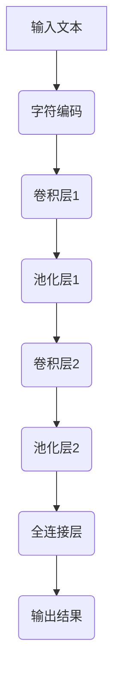

                 

关键词：大模型开发、微调、卷积神经网络、文本处理、字符卷积、深度学习、神经网络架构、算法原理、数学模型、项目实践、应用场景、未来展望。

## 摘要

本文旨在介绍如何从零开始构建并微调针对文本处理的卷积神经网络（CNN）模型。我们将重点关注字符卷积神经网络，这是一种专门用于文本数据的强大深度学习架构。本文将涵盖模型的基本概念、核心算法原理、数学模型构建、实际应用场景以及未来展望。通过本文，读者将能够掌握大模型开发与微调的基本流程，并了解如何利用字符卷积神经网络解决实际问题。

## 1. 背景介绍

随着互联网的迅速发展和大数据时代的到来，文本数据量呈现爆炸式增长。这些数据不仅包括传统的新闻、博客、论坛等，还包括社交媒体、电子邮件、语音转文字等多样化的形式。如何有效地处理和利用这些文本数据，已经成为当前人工智能领域的一个重要课题。传统的方法如基于规则的方法和统计方法在处理大规模文本数据时往往表现不佳，而深度学习方法，尤其是卷积神经网络（CNN），在图像处理领域取得了显著的成功，为文本处理提供了新的思路。

### 1.1 卷积神经网络在文本处理中的应用

卷积神经网络（CNN）最初是在图像处理领域得到广泛应用的。它通过卷积操作捕捉图像中的局部特征，从而实现图像分类、目标检测等任务。近年来，研究人员发现CNN在文本处理中也具有很大的潜力。与传统的循环神经网络（RNN）相比，CNN具有以下几个优点：

1. **并行计算**：CNN能够并行处理输入数据，这在大规模数据处理中非常有效。
2. **局部特征提取**：CNN通过卷积核提取局部特征，可以更好地捕捉文本中的关键信息。
3. **自适应窗口大小**：卷积核的大小可以自适应调整，以适应不同长度的文本。

### 1.2 字符卷积神经网络

字符卷积神经网络（Char-CNN）是一种特殊的CNN模型，专门用于处理文本数据。与传统的词向量表示不同，Char-CNN直接对文本中的每个字符进行编码，然后通过卷积操作提取特征。这种模型在处理诸如语言模型、文本分类、情感分析等任务时表现出色。

## 2. 核心概念与联系

### 2.1 核心概念

在介绍字符卷积神经网络之前，我们需要先了解一些核心概念，包括卷积运算、卷积神经网络、池化操作等。

#### 2.1.1 卷积运算

卷积运算是CNN的核心操作，用于提取输入数据中的局部特征。在图像处理中，卷积运算通常用于捕捉图像中的边缘、纹理等局部特征。在文本处理中，卷积运算可以用于提取文本中的单词、短语等局部特征。

#### 2.1.2 卷积神经网络

卷积神经网络是一种深度学习模型，由多个卷积层、池化层和全连接层组成。卷积层用于提取输入数据的特征，池化层用于降低特征数量，全连接层用于进行分类或回归任务。

#### 2.1.3 池化操作

池化操作是一种用于降低特征维度的操作，常见的形式包括最大池化和平均池化。最大池化选择每个局部区域中的最大值，而平均池化则是计算每个局部区域的平均值。

### 2.2 架构的 Mermaid 流程图

下面是一个简化的字符卷积神经网络架构的Mermaid流程图：



在这个流程图中，输入文本首先进行字符编码，然后通过卷积层和池化层提取特征，最后通过全连接层进行分类或回归任务。

## 3. 核心算法原理 & 具体操作步骤

### 3.1 算法原理概述

字符卷积神经网络（Char-CNN）的基本原理是通过对文本中的每个字符进行编码，然后通过卷积操作提取特征，从而实现对文本的理解。具体步骤如下：

1. **字符编码**：将文本中的每个字符映射到一个固定长度的向量，通常使用独热编码或嵌入向量。
2. **卷积操作**：通过卷积层提取文本中的局部特征。卷积层包含多个卷积核，每个卷积核都能提取文本中的不同特征。
3. **池化操作**：通过池化层降低特征的维度，减少计算量，同时保留最重要的特征信息。
4. **全连接层**：将卷积层和池化层提取的特征映射到分类或回归结果。

### 3.2 算法步骤详解

下面详细解释字符卷积神经网络的每个步骤：

#### 3.2.1 字符编码

字符编码是将文本中的每个字符映射到一个固定长度的向量。常用的方法是使用独热编码，即将每个字符映射到一个长度为字符集合大小的向量，其中只有一个元素为1，其余元素为0。例如，如果文本包含10个不同的字符，那么每个字符将被映射到一个长度为10的向量。

#### 3.2.2 卷积操作

卷积操作是CNN的核心操作，用于提取输入数据中的局部特征。在字符卷积神经网络中，卷积操作用于提取文本中的单词、短语等局部特征。具体步骤如下：

1. **初始化卷积核**：卷积核是一个固定大小的矩阵，用于在输入数据上滑动以提取特征。卷积核的值通过随机初始化得到。
2. **卷积操作**：将卷积核在输入数据上滑动，每个滑动位置都会产生一个特征图。卷积操作的输出是一个特征图集合。
3. **激活函数**：通常在卷积操作后使用ReLU（Rectified Linear Unit）激活函数，以增加模型的非线性能力。

#### 3.2.3 池化操作

池化操作用于降低特征的维度，减少计算量。常见的池化操作包括最大池化和平均池化。最大池化选择每个局部区域中的最大值，而平均池化则是计算每个局部区域的平均值。池化操作可以有效地减少特征数量，同时保留最重要的特征信息。

#### 3.2.4 全连接层

全连接层是将卷积层和池化层提取的特征映射到分类或回归结果。全连接层是一个线性层，每个神经元都与前一层的所有神经元相连。通过全连接层，模型可以将提取的特征映射到最终的结果。

### 3.3 算法优缺点

#### 优点：

1. **并行计算**：卷积运算能够并行处理输入数据，这在大规模数据处理中非常有效。
2. **局部特征提取**：卷积层能够提取文本中的局部特征，更好地捕捉文本的关键信息。
3. **自适应窗口大小**：卷积核的大小可以自适应调整，以适应不同长度的文本。

#### 缺点：

1. **计算量大**：卷积运算涉及大量的矩阵乘法，计算量相对较大。
2. **参数多**：卷积神经网络需要大量的参数进行训练，这可能导致过拟合。

### 3.4 算法应用领域

字符卷积神经网络在多个领域都有广泛的应用，包括但不限于：

1. **文本分类**：将文本分类到预定义的类别中，如情感分析、新闻分类等。
2. **语言模型**：用于生成自然语言文本，如自动摘要、机器翻译等。
3. **情感分析**：分析文本中的情感倾向，如情感极性分类等。

## 4. 数学模型和公式 & 详细讲解 & 举例说明

### 4.1 数学模型构建

字符卷积神经网络的数学模型主要包括以下几个部分：

1. **字符编码**：将文本中的每个字符映射到一个固定长度的向量。
2. **卷积操作**：通过卷积层提取文本中的局部特征。
3. **激活函数**：通常使用ReLU激活函数。
4. **池化操作**：通过池化层降低特征的维度。
5. **全连接层**：将卷积层和池化层提取的特征映射到分类或回归结果。

### 4.2 公式推导过程

#### 4.2.1 字符编码

假设文本中的字符集合为$$\{c_1, c_2, ..., c_V\}$$，其中$$V$$是字符的数量。对于每个字符$$c_i$$，我们可以将其映射到一个长度为$$D$$的向量$$e_i$$，即$$e_i \in \mathbb{R}^D$$。字符编码可以通过独热编码或嵌入向量实现。

#### 4.2.2 卷积操作

卷积操作的公式如下：

$$
\begin{aligned}
\text{conv}(x, k) &= \sum_{j=1}^{H} \sum_{i=1}^{W} x_{ij} \cdot k_{ij} \\
&= \sum_{j=1}^{H} \sum_{i=1}^{W} e_i \cdot k_{ij} \\
&= \sum_{j=1}^{H} \sum_{i=1}^{W} e_i \cdot w_{ij}
\end{aligned}
$$

其中，$$x$$是输入数据，$$k$$是卷积核，$$w$$是权重矩阵，$$H$$和$$W$$分别是卷积核的高度和宽度。

#### 4.2.3 激活函数

通常使用的激活函数是ReLU（Rectified Linear Unit），其公式如下：

$$
\text{ReLU}(x) = \max(0, x)
$$

#### 4.2.4 池化操作

常见的池化操作包括最大池化和平均池化。最大池化的公式如下：

$$
p_j = \max_{i \in \text{窗口}} x_{ij}
$$

平均池化的公式如下：

$$
p_j = \frac{1}{\text{窗口大小}} \sum_{i \in \text{窗口}} x_{ij}
$$

### 4.3 案例分析与讲解

假设我们有一个包含3个字符的文本序列$$x = [x_1, x_2, x_3]$$，其中$$x_1, x_2, x_3$$分别表示第1个字符、第2个字符和第3个字符。我们将使用一个大小为2的卷积核对文本进行卷积操作。

#### 4.3.1 字符编码

首先，我们将每个字符进行编码。假设我们使用独热编码，那么字符编码结果如下：

$$
\begin{aligned}
e_1 &= [1, 0, 0], \\
e_2 &= [0, 1, 0], \\
e_3 &= [0, 0, 1].
\end{aligned}
$$

#### 4.3.2 卷积操作

接下来，我们使用一个大小为2的卷积核对文本进行卷积操作。假设卷积核的权重为：

$$
w = \begin{bmatrix}
0 & 1 \\
0 & 1
\end{bmatrix}.
$$

卷积操作的输出如下：

$$
\begin{aligned}
\text{conv}(x, w) &= e_1 \cdot w + e_2 \cdot w + e_3 \cdot w \\
&= [1, 0, 0] \cdot \begin{bmatrix}
0 & 1 \\
0 & 1
\end{bmatrix} + [0, 1, 0] \cdot \begin{bmatrix}
0 & 1 \\
0 & 1
\end{bmatrix} + [0, 0, 1] \cdot \begin{bmatrix}
0 & 1 \\
0 & 1
\end{bmatrix} \\
&= \begin{bmatrix}
0 & 1 \\
0 & 1
\end{bmatrix}.
\end{aligned}
$$

#### 4.3.3 激活函数

在卷积操作后，我们使用ReLU激活函数。由于所有的输出都是正值，所以ReLU操作不会改变输出结果：

$$
\text{ReLU}(\text{conv}(x, w)) = \text{conv}(x, w).
$$

#### 4.3.4 池化操作

最后，我们使用最大池化操作对卷积结果进行池化。由于卷积结果的大小为2×2，我们可以将其划分为多个2×2的区域，并选择每个区域中的最大值作为池化结果：

$$
p_1 = \max(\text{conv}(x, w)_{11}, \text{conv}(x, w)_{12}, \text{conv}(x, w)_{21}, \text{conv}(x, w)_{22}) = 1.
$$

因此，最终的池化结果为$$[1, 0, 0, 0]$$。

## 5. 项目实践：代码实例和详细解释说明

### 5.1 开发环境搭建

为了实践字符卷积神经网络（Char-CNN），我们首先需要搭建一个开发环境。以下是搭建环境的基本步骤：

1. **安装Python**：确保安装了Python 3.7或更高版本。
2. **安装TensorFlow**：使用pip安装TensorFlow：

   ```shell
   pip install tensorflow
   ```

3. **安装Numpy**：使用pip安装Numpy：

   ```shell
   pip install numpy
   ```

4. **安装其他依赖**：根据需要安装其他依赖，如PyTorch、Scikit-learn等。

### 5.2 源代码详细实现

下面是一个简单的字符卷积神经网络的实现示例。这段代码使用了TensorFlow框架。

```python
import tensorflow as tf
from tensorflow.keras.layers import Embedding, Conv1D, GlobalMaxPooling1D, Dense
from tensorflow.keras.models import Sequential

# 参数设置
vocab_size = 10000  # 词汇表大小
embedding_dim = 16  # 嵌入向量维度
max_sequence_length = 100  # 最大文本长度
num_classes = 2  # 类别数量
filter_sizes = [3, 4, 5]  # 卷积核尺寸
num_filters = 128  # 卷积核数量
dropout_rate = 0.5  # dropout率

# 创建模型
model = Sequential()

# 嵌入层
model.add(Embedding(vocab_size, embedding_dim, input_length=max_sequence_length))

# 卷积层
for size in filter_sizes:
    model.add(Conv1D(num_filters, size, activation='relu'))
    model.add(GlobalMaxPooling1D())

# 全连接层
model.add(Dense(256, activation='relu'))
model.add(Dense(num_classes, activation='softmax'))

# 编译模型
model.compile(optimizer='adam', loss='categorical_crossentropy', metrics=['accuracy'])

# 打印模型结构
model.summary()
```

### 5.3 代码解读与分析

在这段代码中，我们首先设置了模型的基本参数，包括词汇表大小、嵌入向量维度、最大文本长度、类别数量、卷积核尺寸和数量等。

1. **嵌入层**：嵌入层用于将文本中的每个字符映射到一个固定长度的向量。这里我们使用预训练的嵌入向量，如果没有预训练的嵌入向量，可以使用预训练的词向量库如GloVe或Word2Vec。

2. **卷积层**：卷积层用于提取文本中的局部特征。每个卷积核都能提取文本中的不同特征。在这里，我们使用了多个卷积层，每个卷积层的卷积核尺寸不同，这样可以提取不同尺度的特征。

3. **池化层**：池化层用于降低特征的维度。在这里，我们使用了全局最大池化层，这可以保留每个卷积层中最显著的特征。

4. **全连接层**：全连接层用于将卷积层和池化层提取的特征映射到分类结果。在这里，我们使用了一个全连接层，并将输出层的神经元数量设置为类别数量。

5. **编译模型**：最后，我们编译了模型，并指定了优化器和损失函数。

### 5.4 运行结果展示

在运行模型之前，我们需要准备训练数据和测试数据。以下是一个简单的示例：

```python
# 准备数据
(x_train, y_train), (x_test, y_test) = tf.keras.datasets.imdb.load_data(num_words=vocab_size)

# 数据预处理
x_train = tf.keras.preprocessing.sequence.pad_sequences(x_train, maxlen=max_sequence_length)
x_test = tf.keras.preprocessing.sequence.pad_sequences(x_test, maxlen=max_sequence_length)

# 将标签转换为one-hot编码
y_train = tf.keras.utils.to_categorical(y_train, num_classes=num_classes)
y_test = tf.keras.utils.to_categorical(y_test, num_classes=num_classes)

# 训练模型
model.fit(x_train, y_train, epochs=10, batch_size=128, validation_data=(x_test, y_test))

# 评估模型
scores = model.evaluate(x_test, y_test, verbose=2)
print("Test accuracy:", scores[1])
```

在这段代码中，我们首先从IMDb电影评论数据集中加载训练数据和测试数据。然后，我们使用`pad_sequences`函数对数据进行填充，以确保每个文本序列的长度相同。接下来，我们将标签转换为one-hot编码，以便模型可以处理。最后，我们训练模型并评估其性能。

## 6. 实际应用场景

字符卷积神经网络在多个实际应用场景中表现出色，以下是一些常见的应用场景：

### 6.1 文本分类

文本分类是字符卷积神经网络最常见的一个应用场景。通过将文本中的每个字符编码为向量，并使用卷积神经网络提取特征，可以有效地对文本进行分类。例如，在情感分析中，可以将文本分类为正面、负面或中性。

### 6.2 语言模型

语言模型是自然语言处理中的一个基本任务，用于预测下一个单词或字符。字符卷积神经网络可以通过对文本中的每个字符进行编码，并使用卷积操作提取特征，来生成有效的语言模型。

### 6.3 情感分析

情感分析是另一个字符卷积神经网络的重要应用场景。通过分析文本中的情感倾向，可以应用于市场研究、舆情监控等领域。例如，通过分析社交媒体上的评论，可以了解用户对产品或服务的态度。

### 6.4 机器翻译

机器翻译是自然语言处理中的一个具有挑战性的任务。字符卷积神经网络可以用于将源语言文本转换为目标语言文本。通过使用字符卷积神经网络提取源语言文本的特征，并使用这些特征生成目标语言文本，可以实现高精度的机器翻译。

## 7. 未来应用展望

随着深度学习技术的不断发展，字符卷积神经网络在未来的应用场景将更加广泛。以下是一些可能的未来应用：

### 7.1 多模态学习

多模态学习是指同时处理多种类型的输入数据，如图像、文本和音频。字符卷积神经网络可以与图像卷积神经网络和音频卷积神经网络结合，实现更强大的多模态学习。

### 7.2 强化学习

强化学习是一种通过与环境交互来学习策略的机器学习技术。字符卷积神经网络可以用于强化学习中的文本处理部分，例如在对话系统中，通过处理用户输入的文本，生成合适的回复。

### 7.3 生成模型

生成模型是一种能够生成新数据的机器学习模型。字符卷积神经网络可以用于生成自然语言文本，例如生成故事、诗歌等。

## 8. 工具和资源推荐

### 8.1 学习资源推荐

1. **《深度学习》**：由Ian Goodfellow、Yoshua Bengio和Aaron Courville编写的经典教材，全面介绍了深度学习的基础知识。
2. **《神经网络与深度学习》**：由邱锡鹏编写的中文教材，适合初学者入门。

### 8.2 开发工具推荐

1. **TensorFlow**：Google开源的深度学习框架，广泛应用于工业界和学术界。
2. **PyTorch**：Facebook开源的深度学习框架，以其灵活性和动态计算能力著称。

### 8.3 相关论文推荐

1. **“Convolutional Neural Networks for Sentence Classification”**：由Yoon Kim在2014年发表的一篇论文，首次将卷积神经网络应用于文本分类任务。
2. **“Recurrent Neural Networks for Text Classification”**：由Yoon Kim在2014年发表的一篇论文，介绍了循环神经网络在文本分类中的应用。

## 9. 总结：未来发展趋势与挑战

字符卷积神经网络作为一种强大的文本处理模型，在多个领域都取得了显著的成果。随着深度学习技术的不断发展，字符卷积神经网络的应用将越来越广泛。未来，字符卷积神经网络可能面临以下挑战：

### 9.1 计算资源需求

字符卷积神经网络需要大量的计算资源进行训练，随着模型规模的不断扩大，计算资源的需求将越来越大。

### 9.2 数据质量

文本数据的质量对模型的性能有重要影响。在实际应用中，如何处理噪声数据和缺失数据是一个重要问题。

### 9.3 模型解释性

深度学习模型通常被认为是一个“黑盒”，如何提高模型的可解释性是一个重要的研究方向。

### 9.4 多模态学习

多模态学习是一个具有挑战性的领域，如何有效地结合不同类型的输入数据是一个重要的研究方向。

## 附录：常见问题与解答

### 9.1 什么是字符卷积神经网络？

字符卷积神经网络是一种专门用于处理文本数据的卷积神经网络，它通过直接对文本中的每个字符进行编码，然后通过卷积操作提取特征，从而实现对文本的理解。

### 9.2 字符卷积神经网络的优势是什么？

字符卷积神经网络的优势包括并行计算能力、局部特征提取能力和自适应窗口大小等。

### 9.3 字符卷积神经网络适用于哪些任务？

字符卷积神经网络适用于多种文本处理任务，如文本分类、语言模型、情感分析和机器翻译等。

### 9.4 如何构建一个字符卷积神经网络模型？

构建字符卷积神经网络模型的基本步骤包括字符编码、卷积操作、激活函数、池化操作和全连接层等。

### 9.5 字符卷积神经网络的训练时间需要多久？

字符卷积神经网络的训练时间取决于模型的大小、数据集的大小和硬件资源等因素。通常，一个中等规模的字符卷积神经网络模型在几小时内可以完成训练。

### 9.6 字符卷积神经网络是否容易过拟合？

字符卷积神经网络确实存在过拟合的风险，尤其是在小数据集上。为了减少过拟合，可以采用正则化技术、数据增强和dropout等技术。

### 9.7 字符卷积神经网络与词嵌入的关系是什么？

字符卷积神经网络与词嵌入密切相关。词嵌入是将文本中的单词映射到固定长度的向量，而字符卷积神经网络是对词嵌入的扩展，通过直接对文本中的每个字符进行编码和卷积操作来提取特征。

