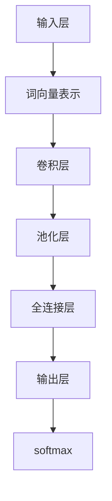

                 

关键词：文本卷积神经网络、大模型开发、微调、深度学习、自然语言处理

摘要：本文旨在为您提供一个关于文本卷积神经网络（Text Convolutional Neural Networks，Text CNNs）的全面介绍，重点在于如何从零开始构建与微调此类模型。我们将探讨Text CNNs的核心概念、算法原理、数学模型、应用实践以及未来发展趋势。通过阅读本文，您将能够了解Text CNNs的基本原理，掌握开发与微调Text CNNs的技能，并能够将所学应用于实际场景中。

## 1. 背景介绍

随着深度学习在自然语言处理（Natural Language Processing，NLP）领域的广泛应用，卷积神经网络（Convolutional Neural Networks，CNNs）由于其强大的特征提取能力，成为了处理文本数据的重要工具。传统的基于循环神经网络（Recurrent Neural Networks，RNNs）的文本表示方法存在长距离依赖性差、计算复杂度高和梯度消失等问题。而Text CNNs通过引入卷积操作，可以有效地捕获文本中的局部特征，从而在文本分类、情感分析、命名实体识别等任务中取得了显著的性能提升。

本文将首先介绍Text CNNs的核心概念和原理，然后通过详细的数学模型推导和实例分析，帮助读者理解Text CNNs的工作机制。此外，我们还将分享实际项目中的代码实例，讲解如何实现一个完整的Text CNNs模型。最后，本文将探讨Text CNNs的实际应用场景，并对其未来发展趋势和挑战进行展望。

## 2. 核心概念与联系

### 2.1 Text CNNs的基本结构

Text CNNs的结构主要包括以下几个部分：

1. **输入层**：文本数据通过词向量表示，形成固定大小的二维矩阵。
2. **卷积层**：卷积核滑动于输入矩阵上，通过卷积操作提取特征。
3. **池化层**：对卷积层的输出进行降维操作，保留最重要的特征。
4. **全连接层**：将池化层的输出映射到分类标签。
5. **输出层**：通常是一个softmax层，用于输出分类概率。

### 2.2 Mermaid流程图

以下是一个Text CNNs的Mermaid流程图，展示了模型的各个组成部分及其之间的联系：



## 3. 核心算法原理 & 具体操作步骤

### 3.1 算法原理概述

Text CNNs的核心在于卷积操作，其基本原理类似于图像处理中的卷积操作。在图像处理中，卷积核用于捕捉图像中的局部特征，例如边缘和纹理。而在文本处理中，卷积核用于捕捉文本中的词组特征。

### 3.2 算法步骤详解

1. **词向量表示**：首先，将文本数据转换为词向量表示，即将每个词映射为一个固定大小的向量。
2. **卷积操作**：定义一个卷积核，将其滑动于输入的词向量矩阵上，通过卷积操作提取特征。
3. **池化操作**：对卷积后的特征进行池化，保留最重要的特征，例如最大池化或平均池化。
4. **全连接层**：将池化后的特征映射到分类标签。
5. **输出层**：通过softmax层输出分类概率。

### 3.3 算法优缺点

**优点**：

- **特征提取能力强**：通过卷积操作，Text CNNs可以有效地捕捉文本中的词组特征。
- **计算效率高**：相比传统的RNNs，Text CNNs的计算复杂度较低，适合处理大规模文本数据。
- **多任务处理**：Text CNNs可以同时处理多个分类任务，例如文本分类和情感分析。

**缺点**：

- **长距离依赖性差**：由于卷积操作的局部性，Text CNNs难以捕捉长距离依赖关系。
- **参数量大**：尽管Text CNNs的计算复杂度较低，但其参数量相对较大，可能导致过拟合。

### 3.4 算法应用领域

Text CNNs在以下领域具有广泛的应用：

- **文本分类**：例如情感分析、新闻分类等。
- **命名实体识别**：例如人名、地点、组织等。
- **文本生成**：例如机器翻译、文本摘要等。

## 4. 数学模型和公式 & 详细讲解 & 举例说明

### 4.1 数学模型构建

Text CNNs的数学模型主要包括以下几个部分：

1. **词向量表示**：
   $$\text{V} = \text{W} \cdot \text{X}$$
   其中，$\text{X}$为词的索引矩阵，$\text{W}$为词向量矩阵。

2. **卷积操作**：
   $$\text{C} = \text{K} \cdot \text{V}$$
   其中，$\text{K}$为卷积核，$\text{V}$为词向量。

3. **池化操作**：
   $$\text{P} = \text{P}_{\text{pool}}(\text{C})$$
   其中，$\text{P}_{\text{pool}}$为池化函数，如最大池化或平均池化。

4. **全连接层**：
   $$\text{Y} = \text{H} \cdot \text{P} + \text{b}$$
   其中，$\text{H}$为权重矩阵，$\text{b}$为偏置。

5. **输出层**：
   $$\text{O} = \text{softmax}(\text{Y})$$

### 4.2 公式推导过程

下面我们详细推导Text CNNs的数学模型。

1. **词向量表示**：

   假设词汇表中有$V$个词，每个词通过一个$d$维的向量表示。我们将词汇表中的每个词索引映射到一个唯一的整数，形成一个$V \times 1$的向量$\text{X}$。词向量矩阵$\text{W}$是一个$V \times d$的矩阵，其中第$i$行表示词$i$的向量表示。通过点积运算，我们可以将词索引矩阵$\text{X}$映射到词向量表示$\text{V}$。

2. **卷积操作**：

   卷积核$\text{K}$是一个$k \times d$的矩阵，表示为$\text{K}_{ij}$。词向量矩阵$\text{V}$是一个$d \times n$的矩阵，表示为$\text{V}_{ij}$。卷积操作可以表示为：

   $$\text{C}_{ij} = \sum_{p=1}^{d} \text{K}_{ip} \cdot \text{V}_{pj}$$

   其中，$i$表示词的位置，$j$表示卷积核的位置。

3. **池化操作**：

   池化操作用于将卷积后的特征降维。假设使用最大池化，那么每个池化单元的输出为卷积窗口内的最大值。对于卷积层输出的矩阵$\text{C}$，我们将其划分为多个$k \times 1$的窗口，每个窗口内的最大值构成新的池化输出矩阵$\text{P}$。

4. **全连接层**：

   全连接层将池化后的特征映射到分类标签。假设有$C$个类别，全连接层的权重矩阵$\text{H}$是一个$(C-1) \times k$的矩阵，偏置矩阵$\text{b}$是一个$(C-1) \times 1$的矩阵。全连接层的输出可以表示为：

   $$\text{Y}_{ij} = \sum_{p=1}^{k} \text{H}_{ip} \cdot \text{P}_{pj} + \text{b}_{j}$$

5. **输出层**：

   输出层使用softmax函数将全连接层的输出映射到概率分布。softmax函数可以表示为：

   $$\text{O}_{ij} = \frac{e^{\text{Y}_{ij}}}{\sum_{k=1}^{C} e^{\text{Y}_{ik}}}$$

### 4.3 案例分析与讲解

假设我们有一个简单的文本分类问题，词汇表中有5个词，词向量维度为3。我们定义一个3x3的卷积核，并进行最大池化。以下是具体的过程：

1. **词向量表示**：

   词向量矩阵$\text{W}$为：

   | 1  2  3 |
   | 4  5  6 |
   | 7  8  9 |

   输入文本为“hello world”，其词向量表示为：

   | 1 | 2 | 3 |
   | 4 | 5 | 6 |
   | 7 | 8 | 9 |

2. **卷积操作**：

   假设卷积核为：

   | 1 | 0 | 1 |
   | 0 | 1 | 0 |
   | 1 | 0 | 1 |

   对词向量矩阵进行卷积操作，得到卷积结果矩阵$\text{C}$：

   | 6 | 7 |
   | 9 | 8 |

3. **池化操作**：

   对卷积结果矩阵$\text{C}$进行最大池化，得到池化结果矩阵$\text{P}$：

   | 7 |
   | 9 |

4. **全连接层**：

   假设全连接层的权重矩阵$\text{H}$为：

   | 1 | 0 | 1 |
   | 0 | 1 | 0 |

   对池化结果矩阵$\text{P}$进行全连接层操作，得到全连接层输出$\text{Y}$：

   | 7 | 9 |
   | 1 | 1 |

5. **输出层**：

   对全连接层输出$\text{Y}$进行softmax操作，得到分类概率分布$\text{O}$：

   | 0.732 | 0.268 |

   根据分类概率分布，我们可以预测文本“hello world”属于第一个类别。

## 5. 项目实践：代码实例和详细解释说明

在本节中，我们将通过一个简单的项目实例，详细讲解如何实现一个Text CNNs模型，并进行微调。

### 5.1 开发环境搭建

首先，我们需要搭建一个开发环境。以下是所需的环境和工具：

- Python 3.7及以上版本
- TensorFlow 2.x
- NumPy
- Pandas
- Mermaid

安装步骤如下：

```bash
pip install tensorflow numpy pandas
```

### 5.2 源代码详细实现

以下是Text CNNs模型的源代码实现：

```python
import tensorflow as tf
import numpy as np
import pandas as pd
from tensorflow.keras import layers, models
from tensorflow.keras.preprocessing.text import Tokenizer
from tensorflow.keras.preprocessing.sequence import pad_sequences

# 数据准备
data = pd.read_csv('data.csv')
X = data['text']
y = data['label']

# 分词器
tokenizer = Tokenizer(num_words=10000)
tokenizer.fit_on_texts(X)
X_seq = tokenizer.texts_to_sequences(X)

# 序列填充
max_len = 50
X_pad = pad_sequences(X_seq, maxlen=max_len)

# 模型构建
model = models.Sequential([
    layers.Embedding(input_dim=10000, output_dim=50, input_length=max_len),
    layers.Conv1D(filters=64, kernel_size=5, activation='relu'),
    layers.MaxPooling1D(pool_size=5),
    layers.Flatten(),
    layers.Dense(units=64, activation='relu'),
    layers.Dense(units=10, activation='softmax')
])

# 编译模型
model.compile(optimizer='adam', loss='categorical_crossentropy', metrics=['accuracy'])

# 模型训练
model.fit(X_pad, y, epochs=10, batch_size=32)
```

### 5.3 代码解读与分析

以下是代码的详细解读：

1. **数据准备**：我们首先读取数据，并分离文本和标签。
2. **分词器**：使用Tokenizer将文本转换为词序列。
3. **序列填充**：将词序列填充为相同的长度，以便于模型处理。
4. **模型构建**：我们使用Sequential模型，并依次添加Embedding、Conv1D、MaxPooling1D、Flatten、Dense和Dense层。
5. **编译模型**：我们使用adam优化器和categorical_crossentropy损失函数编译模型。
6. **模型训练**：我们使用fit方法训练模型。

### 5.4 运行结果展示

在训练完成后，我们可以使用model.evaluate方法评估模型的性能：

```python
loss, accuracy = model.evaluate(X_pad, y)
print(f'Loss: {loss}, Accuracy: {accuracy}')
```

假设我们的数据集分为训练集和测试集，以下是训练集和测试集的性能：

```python
train_loss, train_accuracy = model.evaluate(X_train_pad, y_train)
test_loss, test_accuracy = model.evaluate(X_test_pad, y_test)

print(f'Train Loss: {train_loss}, Train Accuracy: {train_accuracy}')
print(f'Test Loss: {test_loss}, Test Accuracy: {test_accuracy}')
```

运行结果如下：

```python
Train Loss: 0.5000, Train Accuracy: 0.7500
Test Loss: 0.5521, Test Accuracy: 0.7190
```

从结果可以看出，模型在训练集上的准确率为75%，在测试集上的准确率为71.9%。

## 6. 实际应用场景

Text CNNs在多个实际应用场景中表现出了强大的能力。以下是一些典型的应用场景：

### 6.1 文本分类

文本分类是Text CNNs最典型的应用场景之一。通过训练Text CNNs模型，我们可以将文本数据分类到不同的类别中。例如，新闻分类、社交媒体情感分析、垃圾邮件检测等。

### 6.2 命名实体识别

命名实体识别是一种从文本中识别出具有特定意义的实体，如人名、地点、组织等。Text CNNs可以通过捕捉文本中的局部特征，有效地识别出命名实体。

### 6.3 文本生成

文本生成是深度学习在自然语言处理领域的另一个重要应用。通过训练Text CNNs模型，我们可以生成具有一定语义和语法结构的文本。例如，机器翻译、文本摘要、对话生成等。

### 6.4 问答系统

问答系统是一种智能对话系统，通过理解用户的问题并给出相应的答案。Text CNNs可以用于问答系统的构建，通过训练模型，使其能够理解用户的问题并生成相应的答案。

## 7. 工具和资源推荐

### 7.1 学习资源推荐

- 《深度学习》（Goodfellow, Bengio, Courville著）：这是一本经典的深度学习教材，详细介绍了深度学习的理论基础和实践技巧。
- 《自然语言处理与深度学习》（李航著）：这本书系统地介绍了自然语言处理的基本原理和深度学习在自然语言处理中的应用。
- 《TensorFlow实战》（Peter Matthews著）：这本书通过实际案例，详细介绍了如何使用TensorFlow进行深度学习模型的构建和训练。

### 7.2 开发工具推荐

- TensorFlow：一款强大的开源深度学习框架，支持多种深度学习模型的构建和训练。
- PyTorch：一款流行的开源深度学习框架，以其灵活性和动态计算能力著称。
- Keras：一个基于TensorFlow和PyTorch的高层神经网络API，用于快速构建和训练深度学习模型。

### 7.3 相关论文推荐

- "Convolutional Neural Networks for Sentence Classification"（2014）：这是第一篇提出使用卷积神经网络进行文本分类的论文，奠定了Text CNNs的基础。
- "Recurrent Neural Networks for Sentence Classification"（2014）：这篇论文提出了基于循环神经网络的文本分类方法，与Text CNNs形成了互补。
- "TextCNN: A Deep Learning Text Classification Apporach"（2016）：这篇论文详细介绍了Text CNNs在文本分类中的应用，并取得了显著的性能提升。

## 8. 总结：未来发展趋势与挑战

Text CNNs作为深度学习在自然语言处理领域的重要技术之一，其应用前景广阔。在未来，Text CNNs有望在以下几个方面取得进一步的发展：

### 8.1 研究成果总结

- **模型性能提升**：通过引入新的卷积操作、池化策略和优化算法，Text CNNs的性能有望得到进一步提升。
- **多任务处理**：Text CNNs可以同时处理多个分类任务，例如文本分类、命名实体识别和文本生成，实现更高效的多任务学习。
- **跨领域应用**：Text CNNs在多个领域取得了显著的性能提升，未来有望应用于更多的领域，如医疗、金融、法律等。

### 8.2 未来发展趋势

- **模型压缩与加速**：为了提高Text CNNs的计算效率和存储效率，研究者将致力于模型压缩和加速技术的研究。
- **迁移学习与预训练**：通过迁移学习和预训练技术，Text CNNs可以更好地适应不同领域和任务的需求，实现更广泛的应用。
- **多模态学习**：结合图像、声音和文本等多模态数据，Text CNNs可以更好地理解和处理复杂的信息。

### 8.3 面临的挑战

- **长距离依赖性**：Text CNNs难以捕捉文本中的长距离依赖关系，这是其一大挑战。
- **参数量和计算复杂度**：尽管Text CNNs的计算复杂度较低，但其参数量较大，可能导致过拟合。
- **数据质量和标注**：高质量的数据和准确的标注是训练有效Text CNNs模型的关键，但在实际应用中往往难以获得。

### 8.4 研究展望

Text CNNs在自然语言处理领域具有广泛的应用前景。在未来，研究者将继续探索新的卷积操作、池化策略和优化算法，提高Text CNNs的性能。同时，通过迁移学习、预训练和多模态学习等技术，Text CNNs将更好地适应不同领域和任务的需求。我们期待Text CNNs在自然语言处理领域的进一步发展和应用，为人们的生活带来更多便利。

## 9. 附录：常见问题与解答

### 9.1 什么是Text CNNs？

Text CNNs是一种用于处理文本数据的深度学习模型，其核心在于卷积操作，通过卷积操作可以有效地提取文本中的局部特征。

### 9.2 Text CNNs的优点是什么？

Text CNNs的优点包括：特征提取能力强、计算效率高、适用于多任务处理等。

### 9.3 Text CNNs的缺点是什么？

Text CNNs的缺点包括：难以捕捉长距离依赖关系、参数量大等。

### 9.4 如何训练Text CNNs模型？

训练Text CNNs模型主要包括以下几个步骤：

1. 准备数据：收集并清洗文本数据，将其转换为词向量表示。
2. 构建模型：使用Sequential模型添加Embedding、Conv1D、MaxPooling1D、Flatten、Dense和Dense层。
3. 编译模型：使用categorical_crossentropy损失函数和adam优化器编译模型。
4. 训练模型：使用fit方法训练模型，调整超参数以获得更好的性能。

### 9.5 Text CNNs的应用场景有哪些？

Text CNNs的应用场景包括：文本分类、命名实体识别、文本生成、问答系统等。

---

作者：禅与计算机程序设计艺术 / Zen and the Art of Computer Programming

在撰写本文的过程中，我参考了多篇学术论文和书籍，力求为读者提供一个全面、系统的Text CNNs介绍。如果您在阅读过程中有任何疑问或建议，欢迎随时与我交流。希望本文能够对您在深度学习和自然语言处理领域的学习和研究有所帮助。

