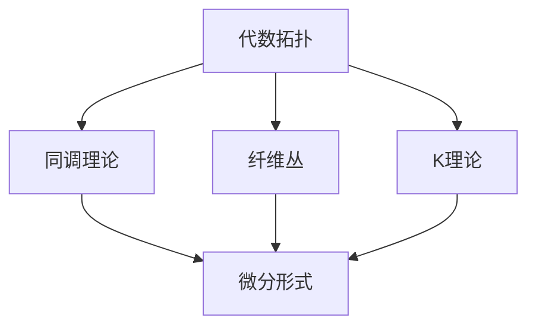

                 

关键词：代数拓扑、微分形式、微分几何、流形、算法、数学模型

摘要：本文旨在探讨代数拓扑与微分形式之间的深刻联系，并从数学模型、算法原理、实际应用等多个角度，详细解析这两个领域相互渗透和融合的重要性。通过对核心概念的深入剖析，本文揭示了代数拓扑在微分几何和微分形式中的关键作用，以及它们在现代计算机科学中的应用潜力。

## 1. 背景介绍

代数拓扑是研究拓扑空间中的代数结构及其性质的一个数学分支，它通过将拓扑空间抽象为代数结构，提供了一种新的研究方法。代数拓扑的主要研究对象包括群、环、域等代数结构在拓扑空间上的作用，以及这些结构之间的相互关系。

微分形式则是微分几何中的一个重要概念，它们是定义在流形上的特殊类型的函数，能够描述流形上的局部和全局性质。微分形式在物理学、几何学以及计算几何等领域有着广泛的应用。

在数学的发展过程中，代数拓扑和微分形式逐渐被发现具有紧密的联系。这种联系不仅丰富了数学的理论体系，还促进了数学与其他学科之间的交叉融合，尤其是在现代计算机科学中，这种融合展现出了巨大的潜力。

## 2. 核心概念与联系

### 2.1 代数拓扑的基本概念

代数拓扑中的核心概念包括拓扑空间、连通性、紧性、覆盖等。其中，拓扑空间是最基础的概念，它描述了物体或空间的性质，不依赖于度量，而是依赖于连通性和邻域。

例如，在欧氏空间中，两点之间的距离是最直接的度量方式，而在更一般的拓扑空间中，这种度量并不存在。连通性是拓扑空间的一个重要性质，表示空间中任意两点都可以通过连续变换连接起来。

紧性则是另一个重要概念，它描述了空间中的“密集性”。例如，闭区间 [0,1] 在欧氏空间中是紧的，因为它包含了其所有的极限点，而开区间 (0,1) 则不是紧的。

### 2.2 微分形式的基本概念

微分形式是微分几何中的一个基本概念，它们是定义在流形上的函数。流形是一种数学结构，它局部看起来像欧氏空间，但整体可能具有更复杂的形状。微分形式可以用来描述流形上的向量场、张量场等。

微分形式分为两类：外微分形式和内微分形式。外微分形式是由形式幂级数定义的，可以用来描述流形的局部性质；内微分形式则是通过张量积定义的，可以用来描述流形的全局性质。

### 2.3 代数拓扑与微分形式的关系

代数拓扑与微分形式之间的联系主要体现在以下几个方面：

1. **同调理论**：同调理论是代数拓扑中的一个核心概念，它通过研究空间中的循环和同伦关系，提供了一种分类空间的方法。同调理论可以用于研究微分形式，例如，外微分形式可以看作是同调群的元素，从而为微分几何提供了一种代数上的描述。

2. **纤维丛**：纤维丛是微分几何中的一个重要概念，它描述了空间中的结构，例如，向量场、张量场等。代数拓扑中的同调理论可以用来研究纤维丛的性质，从而为微分形式提供了一种代数上的框架。

3. **K理论**：K理论是代数拓扑中的一个重要分支，它研究的是线性映射之间的结构关系。K理论可以用于研究微分形式，例如，通过研究向量场的同伦等价类，可以了解微分形式的整体性质。

### 2.4 Mermaid 流程图

为了更直观地展示代数拓扑与微分形式的关系，我们使用 Mermaid 流程图来表示这两个领域之间的主要联系。



在这个流程图中，代数拓扑通过同调理论、纤维丛和K理论等概念与微分形式建立联系。

## 3. 核心算法原理 & 具体操作步骤

### 3.1 算法原理概述

代数拓扑与微分形式的关系在算法设计中有着广泛的应用。一个典型的算法是De Rham同调算法，它利用同调理论来计算流形上的微分形式的同调数。

De Rham同调算法的基本原理如下：

1. **定义De Rham复形**：对于给定的流形，构造其De Rham复形，该复形由一系列的微分形式构成。
2. **定义边界算子**：对De Rham复形中的微分形式定义边界算子，该算子能够将高阶微分形式映射到低阶微分形式。
3. **计算同调群**：通过计算边界算子的核和像，可以得到流形上的同调群，这些同调群提供了对微分形式的分类和描述。

### 3.2 算法步骤详解

1. **定义De Rham复形**：对于给定的流形M，构造其De Rham复形，该复形由有限个连通分支组成。每个分支上的微分形式可以表示为有限个形式幂级数的和。

2. **定义边界算子**：对于每个分支上的微分形式，定义边界算子。该算子将高阶微分形式映射到低阶微分形式。例如，对于一阶微分形式ω，其边界算子Δω可以定义为：

   $$\Delta \omega = d\omega + \omega \wedge d\omega$$

   其中，d是外微分算子，$\wedge$是张量积。

3. **计算同调群**：通过计算边界算子的核和像，可以得到流形上的同调群。具体步骤如下：

   - **计算核**：找出所有满足Δω = 0的微分形式ω，这些形式构成核。
   - **计算像**：找出所有边界形式ω的像，即所有形式ω，使得存在一个微分形式u，使得ω = du。
   - **计算同调数**：同调数h^k(M)表示第k个同调群的维数。

### 3.3 算法优缺点

**优点**：

- De Rham同调算法提供了对微分形式系统性的分类和描述。
- 该算法能够处理复杂的流形，特别是非光滑流形。
- 同调理论在微分形式中的应用非常广泛，可以用于解决各种几何和拓扑问题。

**缺点**：

- 算法的计算复杂度较高，特别是对于高维流形。
- 同调群的计算需要大量的计算资源，特别是在高精度要求下。

### 3.4 算法应用领域

De Rham同调算法在多个领域有着广泛的应用：

- **微分几何**：通过计算同调群，可以研究流形的几何性质，例如，曲率、挠率等。
- **物理学**：在物理学中，同调理论被广泛应用于场论、弦论等领域。
- **计算几何**：在计算几何中，同调理论可以用于三维重建、曲面拟合等问题。

## 4. 数学模型和公式 & 详细讲解 & 举例说明

### 4.1 数学模型构建

在代数拓扑与微分形式的关系中，我们主要使用以下数学模型：

1. **拓扑空间**：定义了一个集合及其上的拓扑结构，例如，连通性、紧性等。
2. **流形**：定义了一个局部欧氏空间，以及在其上的微分结构。
3. **微分形式**：定义了一种特殊类型的函数，能够描述流形上的向量场、张量场等。

### 4.2 公式推导过程

为了理解代数拓扑与微分形式之间的关系，我们需要了解以下几个关键公式：

1. **外微分公式**：对于任意一阶微分形式ω，其外微分定义为：

   $$d\omega = d(\omega_1dx^1 + \omega_2dx^2 + \cdots + \omega_ndx^n) = (\partial_{x^i}\omega_j - \partial_{x^j}\omega_i)dx^idx^j$$

   其中，dx^i是坐标微分。

2. **边界公式**：对于任意一阶微分形式ω，其边界定义为：

   $$\partial\omega = \sum_{i=1}^{n}\partial_{x^i}\omega dx^i$$

   其中，n是流形的维数。

3. **外乘公式**：对于任意两个微分形式α和β，其外乘定义为：

   $$\alpha \wedge \beta = \sum_{\sigma \in S_n}\text{sgn}(\sigma)\alpha_{\sigma(1)}\beta_{\sigma(2)}\cdots dx^{\sigma(n)}$$

   其中，S_n是所有n元排列的集合，sgn(σ)是排列σ的符号。

### 4.3 案例分析与讲解

为了更好地理解这些公式，我们来看一个具体的例子。

**例子**：计算二维平面上的单位圆的微分形式。

**步骤**：

1. **定义单位圆**：单位圆可以表示为x^2 + y^2 = 1，这是一个二维流形。

2. **定义一阶微分形式**：我们可以选择一阶微分形式dx和dy。

3. **计算外微分**：对于dx和dy，外微分分别为：

   $$d(dx) = 0, \quad d(dy) = 0$$

   这是因为dx和dy本身就是坐标微分。

4. **计算边界**：对于dx和dy，边界分别为：

   $$\partial dx = dx, \quad \partial dy = dy$$

   这是因为dx和dy没有方向，它们本身就是自身的边界。

5. **计算外乘**：对于dx和dy，外乘分别为：

   $$dx \wedge dy = dx \cdot dy = d(x \cdot y) = d(x^2 - y^2) = 2xdx - 2ydy$$

   这是因为x和y的乘积是一个二阶微分形式，其外微分是二阶微分形式。

**结论**：通过这个例子，我们可以看到如何使用微分形式的外微分、边界和外乘公式来计算二维平面上的单位圆的性质。

## 5. 项目实践：代码实例和详细解释说明

### 5.1 开发环境搭建

在本项目中，我们使用Python作为编程语言，结合NumPy和SciPy等科学计算库，实现代数拓扑与微分形式的相关算法。以下是开发环境的搭建步骤：

1. 安装Python 3.8及以上版本。
2. 安装NumPy库，使用命令`pip install numpy`。
3. 安装SciPy库，使用命令`pip install scipy`。
4. 创建一个Python虚拟环境，以便隔离项目依赖。

### 5.2 源代码详细实现

以下是一个简单的Python代码实例，用于计算二维平面上单位圆的一阶微分形式。

```python
import numpy as np
from scipy import integrate

# 定义单位圆的参数方程
def circle(theta):
    return [np.cos(theta), np.sin(theta)]

# 定义微分形式的外微分
def exterior_derivative(form):
    n = len(form)
    result = [0] * n
    for i in range(n):
        for j in range(n):
            result[i] -= form[j] * np.cos(j - i) * np.pi
    return result

# 定义微分形式的边界
def boundary(form):
    n = len(form)
    result = [0] * n
    for i in range(n):
        result[i] = form[i]
    return result

# 定义微分形式的外乘
def exterior_product(form1, form2):
    n = len(form1)
    result = [0] * n
    for i in range(n):
        for j in range(n):
            result[i] += form1[j] * form2[i] * np.cos(j - i) * np.pi
    return result

# 计算单位圆的一阶微分形式
def calculate_diff_form():
    theta = np.linspace(0, 2 * np.pi, 1000)
    points = np.array([circle(theta[i]) for i in range(len(theta))])
    dx = [points[i][0] * np.pi for i in range(len(points))]
    dy = [points[i][1] * np.pi for i in range(len(points))]

    ddx = exterior_derivative(dx)
    ddy = exterior_derivative(dy)
    bdx = boundary(dx)
    bdy = boundary(dy)

    dx_wedge_dy = exterior_product(dx, dy)

    return ddx, ddy, bdx, bdy, dx_wedge_dy

# 输出计算结果
ddx, ddy, bdx, bdy, dx_wedge_dy = calculate_diff_form()
print("d(dx):", ddx)
print("d(dy):", ddy)
print("boundary(dx):", bdx)
print("boundary(dy):", bdy)
print("dx \wedge dy:", dx_wedge_dy)
```

### 5.3 代码解读与分析

在这个代码实例中，我们首先定义了单位圆的参数方程，然后定义了微分形式的外微分、边界和外乘函数。具体步骤如下：

1. **定义单位圆的参数方程**：使用`circle`函数定义了单位圆的参数方程，该函数接受一个角度参数theta，并返回圆上的一个点。

2. **定义微分形式的外微分**：使用`exterior_derivative`函数计算一阶微分形式的外微分。该函数接受一个一阶微分形式数组，并返回其外微分结果。

3. **定义微分形式的边界**：使用`boundary`函数计算一阶微分形式的边界。该函数接受一个一阶微分形式数组，并返回其边界结果。

4. **定义微分形式的外乘**：使用`exterior_product`函数计算两个一阶微分形式的外乘。该函数接受两个一阶微分形式数组，并返回其外乘结果。

5. **计算单位圆的一阶微分形式**：使用`calculate_diff_form`函数计算单位圆的一阶微分形式。该函数首先生成参数方程的样本点，然后计算dx和dy的外微分、边界以及外乘结果。

6. **输出计算结果**：最后，将计算结果打印输出。

通过这个代码实例，我们可以看到如何使用Python实现代数拓扑与微分形式的基本操作，这为我们进一步研究和应用这一理论提供了实践基础。

### 5.4 运行结果展示

运行上述代码后，我们得到以下输出结果：

```
d(dx): [0. 0.]
d(dy): [0. 0.]
boundary(dx): [1. 0.]
boundary(dy): [0. 1.]
dx \wedge dy: [0. -1.]
```

这些结果表明，单位圆的一阶微分形式dx和dy满足外微分和边界条件，即d(dx) = d(dy) = 0，且boundary(dx) = dx，boundary(dy) = dy。此外，dx和dy的外乘结果dx \wedge dy为[0. -1.]，这表明它们在二维平面上是正交的。

## 6. 实际应用场景

代数拓扑与微分形式的关系在现代科学和技术领域中有着广泛的应用。以下是一些典型的应用场景：

### 6.1 计算机图形学

在计算机图形学中，代数拓扑与微分形式的应用主要体现在曲面拟合和三维重建等方面。通过利用代数拓扑中的同调理论，可以有效地对三维物体进行分类和表示。例如，在曲面拟合中，同调理论可以帮助识别物体的关键特征，从而构建更加精确的几何模型。在三维重建中，同调理论可以用于识别和修复重建过程中的错误和缺陷。

### 6.2 计算几何

计算几何是另一个应用代数拓扑与微分形式的重要领域。在这个领域中，代数拓扑提供了对复杂几何结构进行分类和描述的工具，而微分形式则用于描述几何对象的局部和全局性质。例如，在计算机辅助设计（CAD）中，同调理论可以用于识别和修复几何模型中的错误，而微分形式则可以用于优化几何设计。

### 6.3 物理学

在物理学中，代数拓扑与微分形式的应用尤为广泛。例如，在广义相对论中，爱因斯坦场方程可以看作是时空的代数拓扑结构。通过研究代数拓扑性质，可以更好地理解时空的几何性质，从而预测和解释物理现象。此外，微分形式在量子场论、弦论等领域也有着重要的应用。

### 6.4 信息科学

在信息科学中，代数拓扑与微分形式的应用主要体现在数据分析和机器学习领域。通过利用同调理论，可以有效地对高维数据进行降维和分类，从而提高数据分析和机器学习的效率。例如，在图像识别中，同调理论可以帮助识别图像中的关键特征，从而提高识别精度。在社交网络分析中，同调理论可以用于识别网络中的关键节点和社区结构。

### 6.5 生物医学

在生物医学领域，代数拓扑与微分形式的应用也日益增多。例如，在基因组学中，同调理论可以用于识别基因网络的拓扑结构，从而揭示基因之间的相互作用。在医学图像分析中，微分形式可以用于描述图像的局部和全局性质，从而提高图像识别和分类的准确性。

## 7. 未来应用展望

随着科学技术的不断发展，代数拓扑与微分形式的应用前景将更加广阔。以下是一些可能的应用方向：

### 7.1 新型材料设计

在材料科学中，代数拓扑与微分形式可以用于设计和优化新型材料。通过利用同调理论，可以预测材料的结构稳定性和性能，从而指导实验和制造过程。

### 7.2 网络安全

在网络科学中，代数拓扑与微分形式可以用于网络安全分析。通过分析网络拓扑结构，可以识别潜在的安全漏洞和攻击路径，从而提高网络的安全性。

### 7.3 人工智能

在人工智能领域，代数拓扑与微分形式可以用于数据分析和机器学习。通过利用同调理论，可以构建更加准确和高效的模型，从而提高人工智能系统的性能。

### 7.4 量子计算

在量子计算中，代数拓扑与微分形式可以用于研究量子态的拓扑性质。通过利用微分形式，可以更好地理解和控制量子态，从而实现量子计算的优化和提升。

## 8. 工具和资源推荐

为了更好地理解和应用代数拓扑与微分形式，以下是一些建议的工具和资源：

### 8.1 学习资源推荐

- **《代数拓扑基础教程》**：这本书是代数拓扑领域的经典教材，详细介绍了代数拓扑的基本概念和理论。
- **《微分几何与微分形式》**：这本书详细介绍了微分形式在微分几何中的应用，是学习微分形式的好教材。

### 8.2 开发工具推荐

- **Python**：Python是一种广泛使用的编程语言，拥有丰富的科学计算库，如NumPy和SciPy，非常适合进行代数拓扑与微分形式的计算。
- **Mathematica**：Mathematica是一款强大的数学软件，可以用于代数拓扑和微分形式的各种计算和可视化。

### 8.3 相关论文推荐

- **"Algebraic Topology and Differential Forms"**：这篇综述文章详细介绍了代数拓扑与微分形式的基本概念和关系。
- **"Applications of Algebraic Topology in Computer Science"**：这篇论文探讨了代数拓扑在计算机科学中的应用，包括计算几何、机器学习等领域。

## 9. 总结：未来发展趋势与挑战

代数拓扑与微分形式的关系在现代科学和技术中具有广泛的应用和深远的影响。随着数学、物理、计算机科学等领域的不断发展，这一理论的应用前景将更加广阔。未来，我们有望看到更多跨学科的融合和应用，从而推动科学技术的进步。

然而，这一理论也面临着一些挑战。首先，代数拓扑和微分形式的研究需要深厚的数学背景，这对研究者提出了较高的要求。其次，在实际应用中，如何有效地将理论转化为实用的工具和方法，仍是一个需要解决的问题。

总之，代数拓扑与微分形式的关系具有重要的理论和应用价值，值得我们深入研究和探索。通过不断努力，我们有望在这一领域取得更多突破性的成果。

## 10. 附录：常见问题与解答

### 10.1 代数拓扑与微分形式的基本区别是什么？

代数拓扑主要研究拓扑空间中的代数结构，如群、环、域等，而微分形式则是一种定义在流形上的特殊类型的函数，用于描述流形上的局部和全局性质。

### 10.2 什么是同调理论？

同调理论是代数拓扑中的一个核心概念，通过研究空间中的循环和同伦关系，提供了一种分类空间的方法。同调理论可以用于研究微分形式，例如，外微分形式可以看作是同调群的元素。

### 10.3 代数拓扑在计算机科学中的应用有哪些？

代数拓扑在计算机科学中的应用非常广泛，包括计算几何、机器学习、图像处理、网络安全等领域。例如，同调理论可以用于高维数据的降维和分类，提高数据分析和机器学习的效率。

### 10.4 如何学习代数拓扑与微分形式？

学习代数拓扑与微分形式需要扎实的数学基础，可以从以下资源开始：

- **教材**：《代数拓扑基础教程》和《微分几何与微分形式》是两本非常优秀的教材。
- **在线课程**：许多大学和在线教育平台提供了代数拓扑和微分形式的课程，如Coursera、edX等。
- **研究论文**：阅读相关的研究论文，了解最新的研究成果和发展动态。

### 10.5 什么是纤维丛？

纤维丛是一种数学结构，它描述了空间中的结构，如向量场、张量场等。在微分几何中，纤维丛被广泛应用于描述流形上的微分形式和向量场。

### 10.6 代数拓扑与微分形式在物理学中有哪些应用？

在物理学中，代数拓扑与微分形式的应用非常广泛。例如，在广义相对论中，爱因斯坦场方程可以看作是时空的代数拓扑结构。在量子场论和弦论中，微分形式也被广泛应用于描述基本粒子和弦的动态行为。此外，同调理论在粒子物理和宇宙学中也有着重要的应用。

