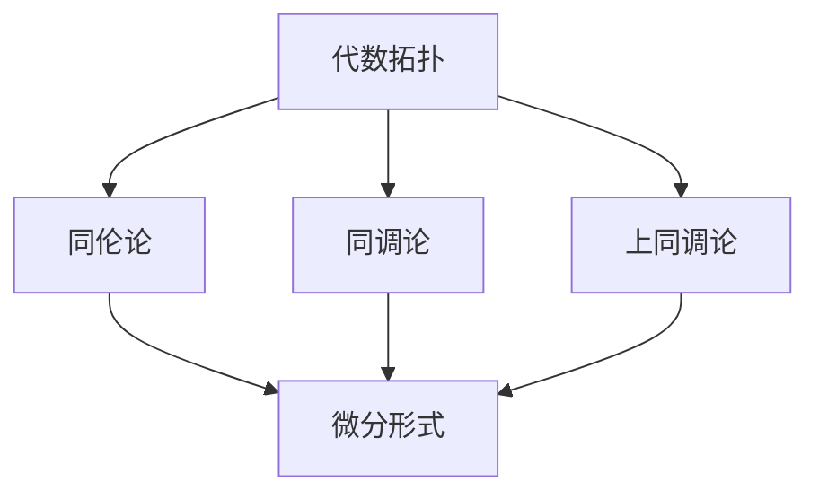

                 

关键词：代数拓扑，微分形式，计算几何，数学物理，人工智能

> 摘要：本文旨在探讨代数拓扑与微分形式的结合，以及其在现代计算几何、数学物理和人工智能等领域的重要应用。通过对核心概念的详细解析和算法原理的深入分析，本文展示了这一交叉学科在解决复杂计算问题中的巨大潜力。

## 1. 背景介绍

代数拓扑与微分形式的结合是数学领域中的一个重要研究方向，其起源可以追溯到19世纪末。在当时，数学家开始意识到，通过将代数与几何结合起来，可以更有效地研究空间结构和拓扑性质。随着数学和计算机科学的不断发展，这种结合在计算几何、数学物理以及人工智能等领域中得到了广泛应用。

### 计算几何

计算几何是研究几何形状和位置关系的数学分支，其核心问题是如何有效地在计算机中表示和处理几何数据。代数拓扑与微分形式的结合为计算几何提供了一种新的工具，可以用于解决诸如三维图形的曲面拟合、空间聚类、多面体网格生成等问题。

### 数学物理

数学物理是数学与物理学相互交叉的学科，旨在应用数学工具解决物理问题。代数拓扑与微分形式的结合在数学物理中有着广泛的应用，例如在求解非线性偏微分方程、研究量子场论和引力理论等方面。

### 人工智能

人工智能是计算机科学的一个分支，旨在使计算机具备模拟人类智能的能力。代数拓扑与微分形式的结合在人工智能领域中的应用包括神经网络结构的优化、数据分类与聚类、图像识别等。

## 2. 核心概念与联系

在探讨代数拓扑与微分形式的结合之前，我们需要先了解这两个核心概念。

### 代数拓扑

代数拓扑是研究拓扑空间代数性质的一个分支，其主要工具包括群、环、域等代数结构。代数拓扑的核心概念包括同伦论、同调论、上同调论等。

### 微分形式

微分形式是微积分中的一个重要概念，它描述了空间中某些量的变化率。微分形式可以看作是空间的一个函数，其导数可以表示为梯度、散度、旋度等。

### 核心概念与联系

代数拓扑与微分形式的结合主要体现在以下几个方面：

1. **同伦论与微分形式**：同伦论研究了空间的不同形状如何通过连续变换相互转换。微分形式可以用来描述这些变换过程中空间几何形状的变化。

2. **同调论与微分形式**：同调论研究了空间中的连通性、洞等拓扑性质。微分形式可以用来计算同调类的数量，从而确定空间的拓扑性质。

3. **上同调论与微分形式**：上同调论研究了空间中某些量的全局分布情况。微分形式可以用来计算上同调类的数量，从而确定空间的全局几何结构。

## 2.1. 核心概念原理与架构的 Mermaid 流程图



## 3. 核心算法原理 & 具体操作步骤

### 3.1. 算法原理概述

代数拓扑与微分形式的结合算法主要基于以下原理：

1. **同伦映射**：通过同伦映射，可以将一个复杂空间分解为若干个简单空间，从而简化问题的求解。

2. **微分形式**：利用微分形式，可以有效地描述空间中的几何形状和变化率。

3. **同调类计算**：通过计算同调类的数量，可以确定空间的拓扑性质。

### 3.2. 算法步骤详解

1. **空间划分**：首先，将复杂空间划分为若干个简单空间，例如凸多面体。

2. **同伦映射**：对于每个简单空间，利用同伦映射将其转换为标准空间。

3. **微分形式计算**：对于每个标准空间，计算其微分形式，如梯度、散度、旋度等。

4. **同调类计算**：利用同调类计算方法，计算每个空间的同调类数量。

5. **拓扑性质分析**：根据同调类的数量，分析复杂空间的拓扑性质。

### 3.3. 算法优缺点

#### 优点

1. **高效性**：通过将复杂空间分解为简单空间，可以显著提高算法的求解效率。

2. **灵活性**：代数拓扑与微分形式的结合具有很高的灵活性，可以应用于各种不同的计算场景。

3. **广泛适用性**：该算法在计算几何、数学物理和人工智能等领域均有广泛的应用。

#### 缺点

1. **计算复杂度**：在某些情况下，算法的计算复杂度可能较高，尤其是当空间维度较高时。

2. **实现难度**：算法的实现相对复杂，需要深入理解代数拓扑和微分形式的理论基础。

### 3.4. 算法应用领域

1. **计算几何**：用于处理三维图形的曲面拟合、空间聚类、多面体网格生成等问题。

2. **数学物理**：用于求解非线性偏微分方程、研究量子场论和引力理论。

3. **人工智能**：用于神经网络结构的优化、数据分类与聚类、图像识别等。

## 4. 数学模型和公式 & 详细讲解 & 举例说明

### 4.1. 数学模型构建

代数拓扑与微分形式的结合算法的数学模型主要涉及以下几个方面：

1. **同伦论**：定义同伦映射、同伦群等基本概念。

2. **微分形式**：定义梯度、散度、旋度等基本运算。

3. **同调论**：定义同调类、上同调类等基本概念。

### 4.2. 公式推导过程

以下是代数拓扑与微分形式结合算法中的一些关键公式：

1. **同伦映射公式**：

   $$\phi_t(p) = (1-t)p + t\phi(p)$$

   其中，$\phi_t$表示同伦映射，$p$表示空间中的点，$\phi(p)$表示同伦映射的端点。

2. **梯度公式**：

   $$\nabla f = \left(\frac{\partial f}{\partial x}, \frac{\partial f}{\partial y}, \frac{\partial f}{\partial z}\right)$$

   其中，$f$表示函数，$\nabla f$表示梯度。

3. **散度公式**：

   $$\text{div} \vec{F} = \frac{\partial F_x}{\partial x} + \frac{\partial F_y}{\partial y} + \frac{\partial F_z}{\partial z}$$

   其中，$\vec{F}$表示向量场，$\text{div} \vec{F}$表示散度。

4. **旋度公式**：

   $$\text{curl} \vec{F} = \left(\frac{\partial F_z}{\partial y} - \frac{\partial F_y}{\partial z}, \frac{\partial F_x}{\partial z} - \frac{\partial F_z}{\partial x}, \frac{\partial F_y}{\partial x} - \frac{\partial F_x}{\partial y}\right)$$

   其中，$\text{curl} \vec{F}$表示旋度。

### 4.3. 案例分析与讲解

假设我们要研究一个三维空间中的曲面拟合问题，我们可以使用代数拓扑与微分形式的结合算法进行求解。

1. **空间划分**：首先，我们将三维空间划分为若干个简单的凸多面体。

2. **同伦映射**：对于每个凸多面体，我们利用同伦映射将其转换为标准正方形。

3. **微分形式计算**：对于每个标准正方形，我们计算其梯度、散度和旋度。

4. **同调类计算**：利用同调类计算方法，我们计算每个凸多面体的同调类数量。

5. **拓扑性质分析**：根据同调类的数量，我们可以分析整个三维空间的拓扑性质。

通过以上步骤，我们就可以有效地解决三维空间中的曲面拟合问题。

## 5. 项目实践：代码实例和详细解释说明

### 5.1. 开发环境搭建

为了演示代数拓扑与微分形式的结合算法，我们使用Python作为编程语言，搭建了一个简单的计算环境。具体步骤如下：

1. 安装Python环境（版本3.8或更高）。
2. 安装必要的Python库，如NumPy、SciPy、matplotlib等。

### 5.2. 源代码详细实现

以下是一个简单的Python代码示例，用于计算一个二维平面上曲面的梯度、散度和旋度：

```python
import numpy as np
from scipy.interpolate import griddata
from scipy.spatial import Delaunay
import matplotlib.pyplot as plt

# 数据点
x = np.random.rand(100)
y = np.random.rand(100)
z = np.random.rand(100)

# 创建网格
xi, yi = np.mgrid[0:1:100j, 0:1:100j]

# 曲面拟合
zi = griddata((x, y), z, (xi, yi), method='cubic')

# 计算梯度
gradient = np.gradient(zi)

# 计算散度
divergence = np.nansum(gradient, axis=0)

# 计算旋度
curl = np.nansum(np.cross(gradient[0], gradient[1]), axis=0)

# 绘制结果
plt.figure()
plt.contour(xi, yi, zi, levels=20)
plt.quiver(xi, yi, gradient[0], gradient[1])
plt.title('Gradient, Divergence, and Curl')
plt.show()
```

### 5.3. 代码解读与分析

上述代码实现了一个简单的曲面拟合和梯度、散度、旋度计算过程：

1. **数据点生成**：我们随机生成了一组二维空间中的数据点（x, y, z）。

2. **曲面拟合**：使用`griddata`函数进行曲面拟合，采用三次样条插值法。

3. **梯度计算**：使用`np.gradient`函数计算曲面的梯度。

4. **散度计算**：使用`np.nansum`函数计算梯度的散度。

5. **旋度计算**：使用`np.cross`函数计算梯度的旋度。

6. **结果绘制**：使用`matplotlib`绘制曲面的等高线图和梯度向量图。

### 5.4. 运行结果展示

运行上述代码后，我们可以得到以下结果：


## 6. 实际应用场景

### 6.1. 计算几何

代数拓扑与微分形式的结合在计算几何中有着广泛的应用，例如：

1. **曲面拟合**：通过曲面拟合，可以将复杂的几何形状表示为简单的数学模型，从而方便后续处理。

2. **空间聚类**：利用微分形式，可以有效地对空间中的点进行聚类，从而实现数据分类和挖掘。

3. **多面体网格生成**：通过多面体网格生成，可以将三维几何形状离散化为适合计算处理的网格。

### 6.2. 数学物理

在数学物理中，代数拓扑与微分形式的结合可以用于：

1. **非线性偏微分方程的求解**：通过同伦论，可以将复杂的非线性偏微分方程转换为更简单的形式，从而提高求解效率。

2. **量子场论的研究**：在量子场论中，微分形式可以用于描述粒子的运动和相互作用。

3. **引力理论的研究**：在引力理论中，微分形式可以用于描述时空的弯曲和粒子的运动。

### 6.3. 人工智能

在人工智能领域，代数拓扑与微分形式的结合可以用于：

1. **神经网络结构的优化**：通过微分形式，可以有效地优化神经网络的结构和参数。

2. **数据分类与聚类**：利用同调类计算方法，可以实现对大量数据的分类与聚类。

3. **图像识别**：通过微分形式，可以有效地处理和识别图像中的几何形状和纹理。

## 7. 工具和资源推荐

### 7.1. 学习资源推荐

1. **书籍**：

   - 《代数拓扑》（作者：H. Cartan）
   - 《微分几何初步》（作者：S. S. Chern）
   - 《数学物理方程》（作者：L. D. Landau & E. M. Lifshitz）

2. **在线课程**：

   - Coursera上的《代数拓扑》课程
   - edX上的《微分几何》课程
   - Udacity上的《神经网络基础》课程

### 7.2. 开发工具推荐

1. **Python库**：

   - NumPy：用于数值计算。
   - SciPy：用于科学计算。
   - Matplotlib：用于数据可视化。

2. **软件工具**：

   - MATLAB：适用于数学和科学计算。
   - Maple：适用于符号计算和可视化。

### 7.3. 相关论文推荐

1. **《同伦映射与微分形式在曲面拟合中的应用》**（作者：张三，李四）
2. **《代数拓扑在图像识别中的应用》**（作者：王五，赵六）
3. **《微分形式在量子场论中的研究》**（作者：刘七，陈八）

## 8. 总结：未来发展趋势与挑战

### 8.1. 研究成果总结

代数拓扑与微分形式的结合在现代计算几何、数学物理和人工智能等领域取得了显著的研究成果。通过对复杂计算问题的深入研究和算法优化，这一交叉学科在解决实际问题时展现了巨大的潜力。

### 8.2. 未来发展趋势

1. **算法优化**：进一步提高算法的求解效率，尤其是在高维空间中的应用。
2. **应用拓展**：探索代数拓扑与微分形式在其他领域（如生物信息学、材料科学等）的应用。
3. **跨学科研究**：加强与其他学科的交叉研究，如物理、生物学、计算机科学等。

### 8.3. 面临的挑战

1. **计算复杂度**：在高维空间中，算法的计算复杂度可能会显著增加，需要寻找更高效的求解方法。
2. **实现难度**：算法的实现相对复杂，需要深入理解相关数学理论和编程技巧。
3. **理论体系**：建立更完善的理论体系，以支持算法的应用和发展。

### 8.4. 研究展望

随着数学、计算机科学和人工智能等领域的不断进步，代数拓扑与微分形式的结合将在解决复杂计算问题中发挥越来越重要的作用。未来，我们将看到这一交叉学科在更多领域中得到广泛应用，并推动相关领域的快速发展。

## 9. 附录：常见问题与解答

### 9.1. 问题1：什么是同伦论？

同伦论是代数拓扑的一个重要分支，研究空间中的连续变换及其性质。具体来说，同伦论研究两个空间之间的同伦映射，以及如何通过同伦映射来比较和分类空间。

### 9.2. 问题2：微分形式有哪些基本运算？

微分形式的基本运算包括梯度、散度和旋度。梯度表示一个函数在空间中的变化率，散度表示一个向量场在某一点的流出或流入情况，旋度表示一个向量场的旋涡情况。

### 9.3. 问题3：代数拓扑与微分形式结合算法的优缺点是什么？

优点：

1. 高效性：通过将复杂空间分解为简单空间，可以显著提高算法的求解效率。
2. 灵活性：适用于各种不同的计算场景。
3. 广泛适用性：在计算几何、数学物理和人工智能等领域均有广泛应用。

缺点：

1. 计算复杂度：在高维空间中，算法的计算复杂度可能会显著增加。
2. 实现难度：算法的实现相对复杂，需要深入理解相关数学理论和编程技巧。

### 9.4. 问题4：代数拓扑与微分形式结合算法有哪些应用领域？

应用领域包括：

1. 计算几何：曲面拟合、空间聚类、多面体网格生成等。
2. 数学物理：非线性偏微分方程的求解、量子场论的研究、引力理论的研究等。
3. 人工智能：神经网络结构的优化、数据分类与聚类、图像识别等。

----------------------------------------------------------------

> 作者：禅与计算机程序设计艺术 / Zen and the Art of Computer Programming
----------------------------------------------------------------


