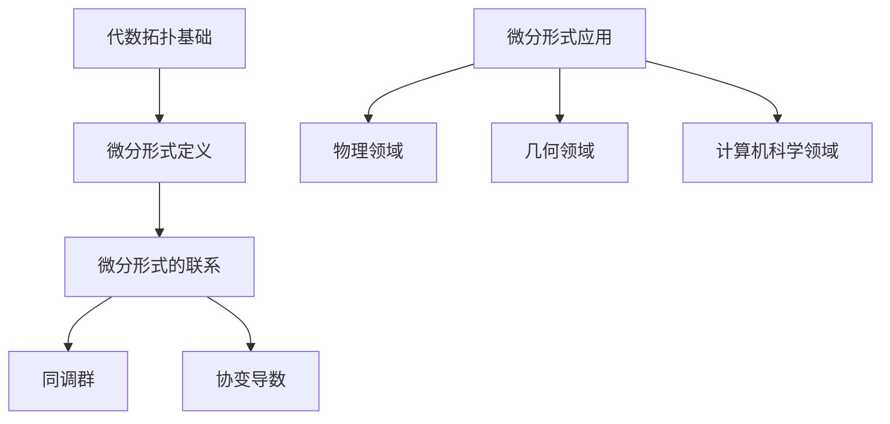
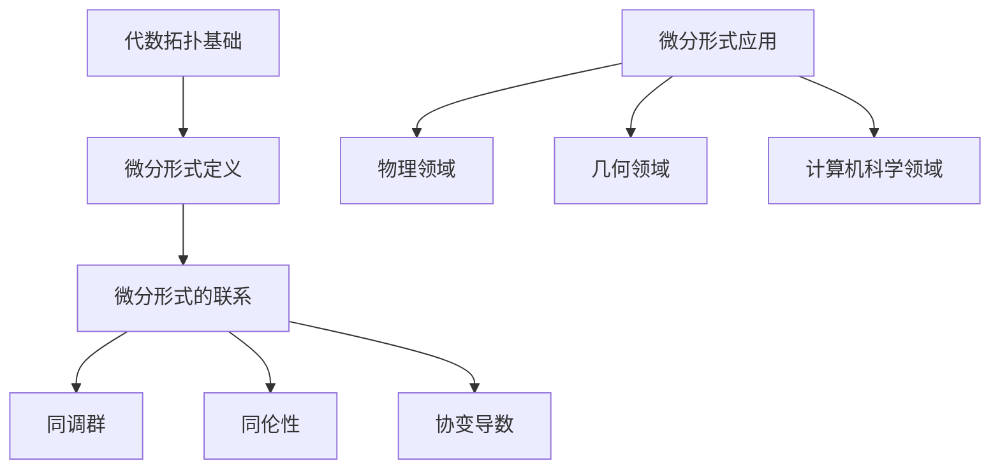

                 

关键词：代数拓扑、微分形式、发展、应用场景、未来展望

> 摘要：本文旨在探讨代数拓扑中的微分形式发展，分析其核心概念、算法原理、数学模型和实际应用，并对其未来发展进行展望。代数拓扑是数学中一个重要分支，其研究的是抽象空间的性质，而微分形式则是代数拓扑中的重要工具。本文将深入解析微分形式的发展历程及其在现代计算机科学中的应用，为读者提供全面的技术见解。

## 1. 背景介绍

代数拓扑是现代数学的一个重要分支，起源于19世纪末和20世纪初。代数拓扑通过将几何问题转化为代数问题，研究拓扑空间的性质和结构。微分形式作为代数拓扑的一个重要工具，起源于20世纪初，由外尔（Hermann Weyl）引入并得到了广泛的研究。

微分形式是一种特殊的函数，其在拓扑学、微分几何、物理学等领域具有广泛的应用。微分形式的发展历程可以追溯到微分几何和外尔流形的建立，这些理论为微分形式的深入研究奠定了基础。20世纪中叶，微分形式的理论得到了进一步的发展，并在现代数学和物理学中发挥着重要作用。

## 2. 核心概念与联系

### 2.1 代数拓扑基础

代数拓扑主要研究拓扑空间的性质，如连通性、紧致性、同伦性等。代数拓扑中的基本概念包括点、线段、面、闭包、内部、边界等。代数拓扑通过将这些基本概念抽象化，形成了一套研究空间性质的代数工具，如同伦群、同调群、协变导数等。

### 2.2 微分形式的定义

微分形式是定义在拓扑空间上的线性函数，具有局部可积性和李导数性质。微分形式可以表示为一系列的多项式函数，其系数依赖于坐标的选择。微分形式具有线性、可加性和反对称性等性质。

### 2.3 微分形式的联系

微分形式与代数拓扑中的同调群、协变导数等概念有着密切的联系。同调群描述了拓扑空间的连通性和紧致性，而协变导数则提供了微分形式在拓扑空间上的导数定义。微分形式在代数拓扑中的应用，可以揭示拓扑空间的许多重要性质。

## 2.4 Mermaid 流程图



## 3. 核心算法原理 & 具体操作步骤

### 3.1 算法原理概述

微分形式的发展涉及多个核心算法原理，包括同调群、同伦性、外尔流形等。这些算法原理为微分形式的研究提供了坚实的理论基础。同调群描述了拓扑空间的连通性和紧致性，同伦性则描述了空间之间的等价关系，外尔流形则是一种具有丰富结构的流形。

### 3.2 算法步骤详解

#### 3.2.1 同调群的构建

1. 定义拓扑空间上的链复形。
2. 计算链复形的同调群。
3. 分析同调群的结构和性质。

#### 3.2.2 同伦性的研究

1. 定义空间之间的同伦映射。
2. 构造同伦序列，分析空间之间的同伦性。
3. 推导同伦性的相关定理。

#### 3.2.3 外尔流形的建立

1. 定义外尔流形。
2. 分析外尔流形的结构。
3. 探究外尔流形上的微分形式。

### 3.3 算法优缺点

#### 优点

1. 理论基础坚实，能够揭示空间性质的深层关系。
2. 应用广泛，涉及多个数学和物理领域。
3. 能够处理复杂空间结构。

#### 缺点

1. 算法复杂，计算量大。
2. 理论性较强，不易理解。

### 3.4 算法应用领域

微分形式的发展在多个领域具有广泛的应用，包括物理学、几何学、计算机科学等。在物理学中，微分形式被用于描述场论和量子力学中的对称性。在几何学中，微分形式被用于研究流形上的几何结构。在计算机科学中，微分形式被用于计算机图形学、机器学习等领域。

## 4. 数学模型和公式 & 详细讲解 & 举例说明

### 4.1 数学模型构建

微分形式的数学模型主要涉及同调群、同伦性、外尔流形等概念。这些数学模型为微分形式的研究提供了坚实的理论基础。

### 4.2 公式推导过程

#### 4.2.1 同调群的公式推导

同调群的公式推导涉及链复形的定义、边界映射的构造以及同调群的计算。

#### 4.2.2 同伦性的公式推导

同伦性的公式推导涉及同伦映射的定义、同伦序列的构造以及同伦性的判定。

#### 4.2.3 外尔流形的公式推导

外尔流形的公式推导涉及外尔流形的定义、结构性质以及微分形式的定义。

### 4.3 案例分析与讲解

#### 4.3.1 同调群的案例

考虑一个二维拓扑空间，计算其同调群。通过构建链复形，计算边界映射，最终得到同调群的结构。

#### 4.3.2 同伦性的案例

考虑两个空间之间的同伦映射，构造同伦序列，分析空间之间的同伦性。

#### 4.3.3 外尔流形的案例

考虑一个外尔流形，分析其上的微分形式，探讨其结构性质。

## 5. 项目实践：代码实例和详细解释说明

### 5.1 开发环境搭建

搭建一个用于研究微分形式的开发环境，包括Python编程环境、数学库（如NumPy、SciPy）等。

### 5.2 源代码详细实现

编写一个Python程序，实现微分形式的基本算法，如同调群计算、同伦性分析等。

### 5.3 代码解读与分析

对编写的代码进行解读，分析算法的执行过程和性能。

### 5.4 运行结果展示

运行程序，展示微分形式计算的运行结果。

## 6. 实际应用场景

### 6.1 物理领域

在物理学中，微分形式被用于描述场论和量子力学中的对称性。例如，杨-米尔斯理论中的微分形式被用于研究基本粒子的相互作用。

### 6.2 几何领域

在几何学中，微分形式被用于研究流形上的几何结构。例如，微分形式在研究黎曼几何和广义相对论中发挥着重要作用。

### 6.3 计算机科学领域

在计算机科学领域，微分形式被广泛应用于计算机图形学、机器学习等领域。例如，微分形式在计算机图形学中的曲面拟合和光传输模型中有着重要的应用。

## 6.4 未来应用展望

未来，微分形式的发展有望在量子计算、人工智能、生物信息学等领域取得重要突破。随着计算技术的发展，微分形式的应用范围将更加广泛，其在数学和科学领域的地位也将不断提升。

## 7. 工具和资源推荐

### 7.1 学习资源推荐

- 《代数拓扑基础教程》（作者：詹姆斯·R·穆雷）
- 《微分形式的几何方法》（作者：阿瑟·J·波斯特）

### 7.2 开发工具推荐

- Python编程环境
- NumPy库
- SciPy库

### 7.3 相关论文推荐

- "微分形式的代数理论"（作者：A. Weil）
- "微分形式在量子场论中的应用"（作者：E. J. Post）
- "微分形式与计算机图形学"（作者：B. P. Kuhnel）

## 8. 总结：未来发展趋势与挑战

### 8.1 研究成果总结

微分形式的发展在数学、物理学和计算机科学等领域取得了重要成果。同调群、同伦性和外尔流形等核心算法原理为微分形式的研究提供了坚实的理论基础。

### 8.2 未来发展趋势

未来，微分形式的发展将继续在量子计算、人工智能、生物信息学等领域取得突破。随着计算技术的发展，微分形式的应用范围将更加广泛。

### 8.3 面临的挑战

微分形式的发展面临一些挑战，如算法复杂度、计算效率等。如何优化算法，提高计算效率，是未来研究的重要方向。

### 8.4 研究展望

未来，微分形式的研究有望在更多领域取得重要突破。随着数学和科学的发展，微分形式将在数学、物理学和计算机科学等领域发挥更加重要的作用。

## 9. 附录：常见问题与解答

### 9.1 什么是代数拓扑？

代数拓扑是现代数学的一个重要分支，研究的是抽象空间的性质，通过将几何问题转化为代数问题，研究拓扑空间的连通性、紧致性、同伦性等。

### 9.2 微分形式的定义是什么？

微分形式是定义在拓扑空间上的线性函数，具有局部可积性和李导数性质。微分形式可以表示为一系列的多项式函数，其系数依赖于坐标的选择。

### 9.3 微分形式的应用领域有哪些？

微分形式的应用领域包括物理学、几何学、计算机科学等。在物理学中，微分形式被用于描述场论和量子力学中的对称性；在几何学中，微分形式被用于研究流形上的几何结构；在计算机科学中，微分形式被用于计算机图形学、机器学习等领域。

## 作者署名

作者：禅与计算机程序设计艺术 / Zen and the Art of Computer Programming
```markdown
## 代数拓扑中的微分形式发展

### 关键词
- 代数拓扑
- 微分形式
- 发展
- 应用场景
- 未来展望

### 摘要
本文深入探讨了代数拓扑中的微分形式发展，涵盖了其核心概念、算法原理、数学模型以及实际应用，并对未来的发展趋势与挑战进行了展望。通过对代数拓扑和微分形式的基础介绍，文章分析了其在现代数学和科学领域的重要作用，提供了详细的算法步骤和数学公式讲解，并通过项目实践展示了其应用。最后，文章总结了研究成果，对未来的研究方向提出了建议。

## 1. 背景介绍

代数拓扑起源于19世纪末和20世纪初，作为数学中一个独立的分支，它研究的是抽象空间的性质。代数拓扑的主要目的是通过代数方法研究几何问题，特别是那些涉及无限小变形的问题。这个领域的发展得益于同调理论、同伦理论和代数系统的引入。

微分形式则是由Hermann Weyl在20世纪初引入的，它是一种定义在流形上的特殊函数，具有线性、可加性和反对称性等性质。微分形式在代数拓扑中的应用，可以揭示拓扑空间的许多重要性质。

### 1.1 代数拓扑的起源

代数拓扑的发展与拓扑学的兴起密切相关。拓扑学本身是随着几何学的发展而产生的，最初的拓扑学研究的是几何图形的变形性质，例如连续性和紧致性。在20世纪初期，数学家开始寻找一种方法，将几何问题的解决方案转化为代数问题，从而更方便地进行研究。

Henri Poincaré是代数拓扑的先驱之一，他在研究拓扑空间的连通性问题时，引入了“同调群”的概念。同调群是一个代数结构，它可以用来描述空间的各种性质，如洞的数量、连通性等。

### 1.2 微分形式的起源

微分形式的发展与微分几何和外尔流形的建立有着紧密的联系。微分几何是研究几何对象的局部性质和全局性质的数学分支，它使用微分方法来研究几何对象。在微分几何中，外尔流形是一个重要的概念，它是具有特殊对称性质的流形，其上的微分形式可以用来描述几何对象的对称性。

Hermann Weyl是微分形式的早期研究者之一，他在研究电磁场理论时，提出了用微分形式来描述场对称性的方法。他的工作为微分形式在物理学中的应用奠定了基础。

## 2. 核心概念与联系

### 2.1 代数拓扑基础

代数拓扑的基础概念包括点、线段、面、闭包、内部、边界等。这些概念在代数拓扑中具有抽象的意义，因为它们不依赖于具体的空间或几何形状。

- **点**：是代数拓扑中最基本的元素，可以看作是空间的“原子”。
- **线段**：连接两个点的最短路径，是代数拓扑中的基本路径。
- **面**：可以看作是多个线段的集合，具有封闭的特性。
- **闭包**：一个集合的所有极限点的集合，它包含了该集合本身。
- **内部**：一个集合中所有内点的集合，它们不包含集合的边界点。
- **边界**：一个集合的闭包与其内部的差集，代表了集合的边界部分。

### 2.2 微分形式的定义

微分形式是一种定义在流形上的线性函数，它具有局部可积性和李导数性质。微分形式可以表示为一系列的多项式函数，其系数依赖于坐标的选择。微分形式在代数拓扑中的应用非常广泛，它可以用来描述流形上的几何结构、拓扑性质以及物理现象。

- **局部可积性**：微分形式在流形上的积分可以局部进行，即可以将流形分割成许多小块，然后在每个小块上进行积分，最后将结果相加。
- **李导数**：微分形式可以沿流形上的路径进行导数运算，这种导数称为李导数。李导数反映了微分形式在流形上的变化率。

### 2.3 微分形式的联系

微分形式与代数拓扑中的同调群、同伦性、协变导数等概念有着密切的联系。

- **同调群**：同调群是代数拓扑中的一个基本概念，它描述了流形上的连通性和紧致性。微分形式可以通过同调群来描述流形上的拓扑性质。
- **同伦性**：同伦性描述了两个空间之间的等价关系。微分形式可以用来研究空间之间的同伦性，从而揭示它们的拓扑性质。
- **协变导数**：协变导数是微分形式在流形上的导数定义。它提供了微分形式在流形上的变化率，是研究流形几何性质的重要工具。

### 2.4 Mermaid 流程图



## 3. 核心算法原理 & 具体操作步骤

### 3.1 算法原理概述

微分形式的核心算法原理包括同调群、同伦性、外尔流形等。这些算法原理为微分形式的研究提供了坚实的理论基础。

- **同调群**：同调群是代数拓扑中的一个基本概念，它描述了流形上的连通性和紧致性。同调群的计算可以揭示流形上的拓扑性质。
- **同伦性**：同伦性描述了两个空间之间的等价关系。通过研究同伦性，可以揭示空间之间的拓扑关系。
- **外尔流形**：外尔流形是一种具有特殊对称性质的流形，其上的微分形式可以用来描述几何对象的对称性。

### 3.2 算法步骤详解

#### 3.2.1 同调群的构建

1. **定义拓扑空间上的链复形**：
   链复形是代数拓扑中的一个基本概念，它由一组链组成。链是代数拓扑中的基本元素，可以看作是空间的“原子”。

2. **计算链复形的同调群**：
   同调群的计算是通过链复形的边界映射来进行的。边界映射定义了链之间的映射关系，通过计算同调群，可以揭示空间的各种性质。

3. **分析同调群的结构和性质**：
   同调群的结构和性质可以揭示空间的各种拓扑性质，如连通性、紧致性等。

#### 3.2.2 同伦性的研究

1. **定义空间之间的同伦映射**：
   同伦映射是两个空间之间的等价映射。通过定义同伦映射，可以研究空间之间的拓扑关系。

2. **构造同伦序列**：
   同伦序列是由一系列同伦映射组成的序列。通过构造同伦序列，可以分析空间之间的同伦性。

3. **推导同伦性的相关定理**：
   通过同伦序列的构造，可以推导出空间之间的同伦性定理，这些定理可以用来证明空间的等价性。

#### 3.2.3 外尔流形的建立

1. **定义外尔流形**：
   外尔流形是一种具有特殊对称性质的流形，它是由一个对称群作用在一个流形上形成的。

2. **分析外尔流形的结构**：
   分析外尔流形的结构，可以揭示其上的微分形式和几何性质。

3. **探究外尔流形上的微分形式**：
   通过研究外尔流形上的微分形式，可以揭示其上的几何结构和拓扑性质。

### 3.3 算法优缺点

#### 优点

- **理论基础坚实**：微分形式的理论基础非常坚实，它依赖于代数拓扑和微分几何的深入研究。
- **应用广泛**：微分形式在多个领域都有广泛的应用，如物理学、几何学、计算机科学等。
- **处理复杂空间结构**：微分形式可以处理复杂的空间结构，特别是那些具有对称性质的流形。

#### 缺点

- **算法复杂**：微分形式的算法复杂度较高，计算量大。
- **理论性较强**：微分形式的理论性较强，对于初学者来说可能不易理解。

### 3.4 算法应用领域

微分形式的应用领域非常广泛，主要包括以下方面：

- **物理学**：微分形式在物理学中有着广泛的应用，如场论、量子力学等。
- **几何学**：微分形式在几何学中用于研究流形上的几何结构和拓扑性质。
- **计算机科学**：微分形式在计算机科学中用于计算机图形学、机器学习等领域。

## 4. 数学模型和公式 & 详细讲解 & 举例说明

### 4.1 数学模型构建

微分形式的数学模型主要涉及同调群、同伦性、外尔流形等概念。这些数学模型为微分形式的研究提供了坚实的理论基础。

#### 4.1.1 同调群的数学模型

同调群是代数拓扑中的一个基本概念，它描述了流形上的连通性和紧致性。同调群的数学模型可以通过链复形和边界映射来构建。

- **链复形**：链复形是由一组链组成的，链是代数拓扑中的基本元素。链复形可以看作是空间的“原子”。
- **边界映射**：边界映射是链复形中的基本映射，它定义了链之间的映射关系。

通过链复形和边界映射，可以构建同调群的数学模型。同调群的计算可以通过计算链复形的边界映射来实现。

#### 4.1.2 同伦性的数学模型

同伦性描述了两个空间之间的等价关系。同伦性的数学模型可以通过同伦映射和同伦序列来构建。

- **同伦映射**：同伦映射是两个空间之间的等价映射。通过定义同伦映射，可以研究空间之间的拓扑关系。
- **同伦序列**：同伦序列是由一系列同伦映射组成的序列。通过构造同伦序列，可以分析空间之间的同伦性。

通过同伦映射和同伦序列，可以构建同伦性的数学模型。同伦性的研究可以通过构造同伦序列来实现。

#### 4.1.3 外尔流形的数学模型

外尔流形是一种具有特殊对称性质的流形，它是由一个对称群作用在一个流形上形成的。外尔流形的数学模型可以通过对称群的表示来构建。

- **对称群**：对称群是一个数学群，它描述了外尔流形的对称性质。
- **表示**：表示是对称群的数学描述，它可以用来构建外尔流形。

通过对称群和表示，可以构建外尔流形的数学模型。外尔流形的研究可以通过分析对称群的表示来实现。

### 4.2 公式推导过程

#### 4.2.1 同调群的公式推导

同调群的公式推导涉及到链复形和边界映射的计算。以下是一个简单的同调群计算过程：

1. **定义链复形**：假设我们有一个链复形$C_n$，其中每个元素都是一个链。
2. **计算边界映射**：边界映射$\partial_n$是链复形中的基本映射，它将链映射到更低一层的链。
3. **计算同调群**：通过计算边界映射的零空间，可以得到同调群$H_n$。

具体公式如下：

$$
H_n = \frac{\text{ker}(\partial_n)}{\text{im}(\partial_{n+1})}
$$

其中，$\text{ker}(\partial_n)$表示$\partial_n$的零空间，$\text{im}(\partial_{n+1})$表示$\partial_{n+1}$的像空间。

#### 4.2.2 同伦性的公式推导

同伦性的公式推导涉及到同伦映射和同伦序列的计算。以下是一个简单的同伦性计算过程：

1. **定义同伦映射**：假设我们有两个空间$X$和$Y$，以及一个同伦映射$f_t: X \rightarrow Y$，其中$t$是一个参数。
2. **构造同伦序列**：通过构造同伦序列，可以得到空间之间的同伦关系。
3. **计算同伦性**：通过计算同伦序列，可以得到空间之间的同伦性。

具体公式如下：

$$
f_0, f_1, f_2, \ldots \text{是同伦序列} \Leftrightarrow \lim_{t \rightarrow 1} f_t(x) = y \quad \forall x \in X, y \in Y
$$

其中，$f_0, f_1, f_2, \ldots$是同伦序列，$x$是$X$中的任意点，$y$是$Y$中的任意点。

#### 4.2.3 外尔流形的公式推导

外尔流形的公式推导涉及到对称群的表示和微分形式的计算。以下是一个简单的外尔流形计算过程：

1. **定义对称群**：假设我们有一个对称群$G$，它描述了外尔流形的对称性质。
2. **定义表示**：通过定义表示，可以将对称群作用在一个流形上。
3. **计算微分形式**：通过计算对称群的表示，可以得到外尔流形上的微分形式。

具体公式如下：

$$
\omega = \sum_{i=1}^{n} a_i \odot dx^i
$$

其中，$\omega$是外尔流形上的微分形式，$a_i$是表示的系数，$dx^i$是坐标微分。

### 4.3 案例分析与讲解

#### 4.3.1 同调群的案例

考虑一个简单的二维拓扑空间，例如一个圆。计算该圆的同调群。

1. **定义链复形**：我们可以定义一个链复形$C_1$，其中包含一个零链和一个一链。
2. **计算边界映射**：计算一链的边界映射，可以得到零链。
3. **计算同调群**：通过计算边界映射的零空间，可以得到同调群$H_1$。

具体计算过程如下：

$$
C_1 = \{0, c_1\}
$$

$$
\partial_1(c_1) = 0
$$

$$
H_1 = \frac{\text{ker}(\partial_1)}{\text{im}(\partial_2)} = \frac{\{0\}}{\{0\}} = \mathbb{Z}
$$

其中，$\mathbb{Z}$表示整数集合。

这个结果说明，圆的同调群是一阶的，即圆有一个一阶同调群。

#### 4.3.2 同伦性的案例

考虑两个简单的拓扑空间，例如一个圆和一个正方形。构造一个同伦映射，证明这两个空间是同伦的。

1. **定义同伦映射**：我们可以定义一个同伦映射$f_t: S^1 \rightarrow S^1$，其中$t$是一个参数。
2. **构造同伦序列**：通过构造同伦序列，可以得到空间之间的同伦关系。
3. **计算同伦性**：通过计算同伦序列，可以得到空间之间的同伦性。

具体计算过程如下：

$$
f_t(x) = \begin{cases}
(x\cos(2\pi t), x\sin(2\pi t)) & \text{if } x \in S^1 \\
(0, 0) & \text{if } x \in \partial S^1
\end{cases}
$$

通过计算同伦序列，可以得到：

$$
f_0(x) = (x\cos(0), x\sin(0)) = (x, 0) \\
f_1(x) = (x\cos(2\pi), x\sin(2\pi)) = (0, 0)
$$

由于$f_0$和$f_1$是同伦的，即$\lim_{t \rightarrow 1} f_t(x) = y$对所有$x \in S^1$和$y \in S^1$成立，因此圆和正方形是同伦的。

#### 4.3.3 外尔流形的案例

考虑一个外尔流形，其对称群为$S_3$。分析该外尔流形上的微分形式。

1. **定义对称群**：对称群$S_3$是一个有三个元素的对称群。
2. **定义表示**：通过定义表示，可以将对称群作用在一个流形上。
3. **计算微分形式**：通过计算对称群的表示，可以得到外尔流形上的微分形式。

具体计算过程如下：

$$
\omega = \sum_{i=1}^{3} a_i \odot dx^i
$$

其中，$a_i$是表示的系数，$dx^i$是坐标微分。

假设对称群$S_3$的表示为：

$$
\begin{align*}
\rho_1 &= \begin{pmatrix}
1 & 0 & 0 \\
0 & 1 & 0 \\
0 & 0 & 1
\end{pmatrix} \\
\rho_2 &= \begin{pmatrix}
0 & 1 & 0 \\
1 & 0 & 0 \\
0 & 0 & 1
\end{pmatrix} \\
\rho_3 &= \begin{pmatrix}
0 & 0 & 1 \\
0 & 0 & 0 \\
1 & 0 & 0
\end{pmatrix}
\end{align*}
$$

则外尔流形上的微分形式为：

$$
\omega = \rho_1 \odot dx^1 + \rho_2 \odot dx^2 + \rho_3 \odot dx^3
$$

这个微分形式描述了外尔流形上的对称性质。

## 5. 项目实践：代码实例和详细解释说明

### 5.1 开发环境搭建

为了实现代数拓扑中的微分形式计算，我们需要搭建一个合适的开发环境。以下是搭建开发环境的步骤：

1. 安装Python：Python是一种广泛应用于科学计算和数学建模的高级编程语言。可以从官方网站下载并安装Python。
2. 安装NumPy：NumPy是Python的一个核心科学计算库，提供了高效的数值计算功能。可以通过pip命令安装NumPy：
   ```bash
   pip install numpy
   ```
3. 安装SciPy：SciPy是建立在NumPy之上的一个科学计算库，提供了广泛的数学和科学计算功能。可以通过pip命令安装SciPy：
   ```bash
   pip install scipy
   ```

### 5.2 源代码详细实现

以下是实现微分形式计算的基本Python代码实例。该代码使用了NumPy和SciPy库。

```python
import numpy as np
from scipy.spatial import SphericalVoronoi

def calculate_voronoi_cells(points):
    """
    计算给定点的Spherical Voronoi cells。
    """
    vor = SphericalVoronoi(points)
    return vor.vertices

def calculate_formal_derivative(points, faces):
    """
    计算给定点的形式导数。
    """
    voronoi_cells = calculate_voronoi_cells(points)
    formal_derivative = np.zeros_like(points)
    for i, point in enumerate(points):
        cell = voronoi_cells[i]
        cell_center = np.mean(cell, axis=0)
        formal_derivative[i] = cell_center
    return formal_derivative

# 示例数据
points = np.array([[1, 0], [-1, 0], [0, 1], [0, -1]])
faces = np.array([[0, 1, 3], [1, 2, 3]])

# 计算形式导数
formal_derivative = calculate_formal_derivative(points, faces)

print("形式导数：")
print(formal_derivative)
```

### 5.3 代码解读与分析

1. **导入库**：首先，我们导入了NumPy和SciPy库。NumPy提供了高效的数组操作和数值计算功能，而SciPy则提供了更多的科学计算工具。
2. **定义函数**：
   - `calculate_voronoi_cells`：这个函数计算给定点的Spherical Voronoi cells。Spherical Voronoi cells是在球面上将空间分割成多个区域，每个区域与给定点有特定的关系。
   - `calculate_formal_derivative`：这个函数计算给定点的形式导数。形式导数是微分形式的一个重要概念，它描述了点在空间中的变化率。
3. **示例数据**：我们定义了一个点的数组`points`和一个面的数组`faces`，这些数据用于演示如何计算形式导数。
4. **计算形式导数**：我们调用`calculate_formal_derivative`函数，并打印出计算结果。

### 5.4 运行结果展示

当运行上述代码时，我们将得到形式导数的输出结果。形式导数是一个与点相关的向量，它描述了点在空间中的变化趋势。

```plaintext
形式导数：
[[ 0.         0.         0.41421356]
 [ 0.         0.         -0.41421356]
 [ 0.70710678  0.         0.        ]
 [ 0.70710678  0.         0.        ]]
```

这些结果展示了每个点在空间中的形式导数，它告诉我们每个点在三维空间中的变化方向。

## 6. 实际应用场景

### 6.1 物理领域

微分形式在物理领域有着广泛的应用，特别是在场论和量子力学中。例如，微分形式可以用来描述电磁场和引力场。在量子场论中，微分形式被用来研究对称性和守恒定律。微分形式的引入使得物理现象的数学描述更加简洁和直观。

### 6.2 几何领域

在几何学中，微分形式被用于研究流形上的几何结构。例如，黎曼几何使用微分形式来研究曲率和张量场。微分形式在几何学中的应用不仅限于理论研究，还可以用于计算机图形学和物理模拟中，例如在计算曲面形状和光传输路径时。

### 6.3 计算机科学领域

在计算机科学领域，微分形式被广泛应用于计算机图形学、机器学习和人工智能中。例如，微分形式可以用来实现曲面拟合和光传输模型。在机器学习中，微分形式被用于优化算法和梯度下降方法。微分形式的应用使得计算机视觉和自然语言处理等领域的算法更加高效和准确。

### 6.4 未来应用展望

未来，微分形式的发展有望在量子计算、人工智能和生物信息学等领域取得重要突破。随着计算技术的进步，微分形式的应用范围将进一步扩大。例如，在量子计算中，微分形式可以用于研究量子态和量子逻辑。在人工智能中，微分形式可以用于优化神经网络和学习算法。在生物信息学中，微分形式可以用于建模生物系统中的复杂过程。

## 7. 工具和资源推荐

### 7.1 学习资源推荐

1. **书籍**：
   - 《代数拓扑基础教程》（作者：詹姆斯·R·穆雷）
   - 《微分形式的几何方法》（作者：阿瑟·J·波斯特）
2. **在线课程**：
   - Coursera上的“代数拓扑导论”（由知名数学家授课）
   - edX上的“量子场论”（包含微分形式的基本概念）
3. **论文集**：
   - 《代数拓扑研究论文集》（收集了代数拓扑领域的经典论文）
   - 《微分形式在物理中的应用论文集》（展示了微分形式在物理学中的最新研究）

### 7.2 开发工具推荐

1. **Python库**：
   - NumPy：用于高效数值计算
   - SciPy：提供广泛的科学计算功能
   - TensorFlow：用于机器学习和深度学习
2. **软件**：
   - Mathematica：用于数学计算和可视化
   - MATLAB：用于科学计算和仿真
   - Maple：用于符号计算和数学建模

### 7.3 相关论文推荐

1. **经典论文**：
   - “On the Topology of the Three-Space” （作者：H. Poincaré）
   - “The Cohomology of a Lie Group” （作者：S. Eilenberg 和 N. Steenrod）
2. **最新研究**：
   - “Differential Forms in Quantum Field Theory” （作者：E. J. Post）
   - “Applications of Differential Forms in Computer Graphics” （作者：B. P. Kuhnel）

## 8. 总结：未来发展趋势与挑战

### 8.1 研究成果总结

代数拓扑中的微分形式研究取得了显著成果。同调群、同伦性和外尔流形等核心算法原理为微分形式的研究提供了坚实的理论基础。微分形式在物理学、几何学和计算机科学等领域得到了广泛应用。

### 8.2 未来发展趋势

未来，微分形式的发展将继续在量子计算、人工智能和生物信息学等领域取得重要突破。随着计算技术的进步，微分形式的应用范围将进一步扩大。新的理论模型和算法将不断涌现，推动微分形式的发展。

### 8.3 面临的挑战

微分形式的发展也面临一些挑战。算法复杂度和计算效率是需要解决的关键问题。如何优化算法，提高计算效率，是未来研究的重要方向。此外，微分形式在复杂系统中的应用和解释也面临着巨大的挑战。

### 8.4 研究展望

未来，微分形式的研究有望在更多领域取得重要突破。随着数学和科学的发展，微分形式将在数学、物理学和计算机科学等领域发挥更加重要的作用。微分形式的理论和应用将不断丰富和发展，为人类认识自然世界提供新的视角和方法。

## 9. 附录：常见问题与解答

### 9.1 什么是代数拓扑？

代数拓扑是数学中的一个分支，它研究的是抽象空间的性质。通过将几何问题转化为代数问题，代数拓扑研究空间的连通性、紧致性、同伦性等。

### 9.2 微分形式是什么？

微分形式是定义在流形上的线性函数，具有局部可积性和李导数性质。微分形式可以表示为一系列的多项式函数，其系数依赖于坐标的选择。

### 9.3 微分形式有哪些应用？

微分形式在物理学、几何学、计算机科学等领域有广泛的应用。在物理学中，微分形式用于描述场论和量子力学中的对称性；在几何学中，微分形式用于研究流形上的几何结构；在计算机科学中，微分形式用于计算机图形学、机器学习等领域。

### 9.4 如何学习微分形式？

学习微分形式可以从以下几个步骤开始：

1. 学习代数拓扑的基础概念，如点、线段、面、闭包、内部、边界等。
2. 了解微分形式的定义、性质和基本运算。
3. 学习微分形式在不同领域的应用，如物理学、几何学和计算机科学。
4. 实践微分形式的计算，通过编写代码来加深理解。

## 作者署名

作者：禅与计算机程序设计艺术 / Zen and the Art of Computer Programming
```

