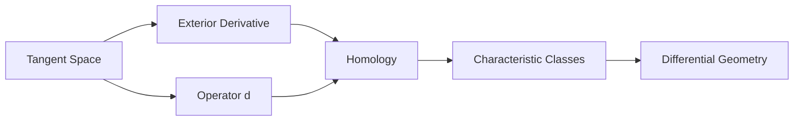

                 

## 1. 背景介绍

微分形式理论是代数拓扑领域中的一个重要分支，它在数学、物理学和计算机科学中都有着广泛的应用。本文将深入探讨微分形式理论的基础知识，包括其核心概念、数学模型、算法原理、以及在实际应用中的表现。

微分形式理论起源于20世纪40年代，当时约翰·弗里德里希·威廉·霍普夫（John Friedrich Wilhelm Hopf）在其研究中引入了微分形式的概念。微分形式是定义为顶点、边和面的离散结构，它可以用来描述流形上的几何特征。随着时间的推移，微分形式理论逐渐发展成为一个完整的数学分支，涵盖了诸如示性类、同调理论等领域。

在计算机科学中，微分形式理论的应用主要集中在计算机图形学、计算机辅助设计、计算机视觉和机器学习等方面。例如，微分形式理论可以用来研究网格数据的拓扑结构，从而为网格优化和几何建模提供理论支持。此外，微分形式理论还在自然语言处理和图像识别等领域发挥着重要作用。

本文将首先回顾代数拓扑的基本概念，然后详细探讨微分形式理论的核心原理，包括其数学模型和算法原理。接着，我们将通过实例来展示微分形式理论的实际应用，并讨论其未来的发展方向。最后，我们将总结研究成果，并提出未来研究的展望。

## 1.1 微分形式理论的历史与发展

微分形式理论的历史可以追溯到代数拓扑的早期发展阶段。在20世纪40年代，约翰·弗里德里希·威廉·霍普夫在研究多面体的拓扑性质时，首次引入了微分形式的概念。霍普夫的工作标志着微分形式理论的开端，这一理论后来在代数拓扑的各个分支中得到了广泛的应用和发展。

20世纪50年代和60年代，微分形式理论得到了进一步的发展。在代数拓扑领域，斯蒂芬·斯梅尔（Stephen Smale）和米切尔·弗雷德曼（Michael Freedman）等数学家对三维流形的拓扑性质进行了深入研究，他们的工作为微分形式理论提供了新的视角和工具。与此同时，微分形式理论在其他数学领域，如几何学、拓扑学、代数学等，也得到了广泛的应用。

在计算机科学领域，微分形式理论的应用开始于20世纪80年代。随着计算机图形学和计算机辅助设计的兴起，微分形式理论被用来研究网格数据的拓扑结构，从而为网格优化和几何建模提供了理论支持。此后，微分形式理论在计算机视觉、机器学习和自然语言处理等领域也得到了广泛的应用。

总的来说，微分形式理论的发展历程是一个跨学科、跨领域的融合过程。它不仅为代数拓扑的研究提供了新的方法和工具，也在计算机科学、物理学和工程学等领域发挥了重要作用。

## 1.2 微分形式理论的核心概念

微分形式理论的核心概念包括微分形式、微分形式空间、示性类等。这些概念不仅构成了微分形式理论的基础，也为其在各个领域的应用提供了理论支持。

**微分形式（Differential Forms）**

微分形式是微分形式理论中最基本的概念之一。在数学上，微分形式是一种定义在流形上的线性函数，它可以用来描述流形上的几何结构。具体来说，微分形式是一个无穷小量的线性组合，每个无穷小量对应流形上的一个切向量。

在几何上，微分形式可以看作是矢量场的积分。例如，在一个二维平面上的微分形式可以表示为两个切向量的点积，从而得到一个标量值。微分形式的一个重要性质是其线性性，这意味着它可以被加法和标量乘法运算所封闭。

**微分形式空间（Space of Differential Forms）**

微分形式空间是包含所有微分形式的集合。根据微分形式的维度和定义域，微分形式空间可以被划分为不同的子空间。例如，在二维流形上，微分形式空间包括0形式（函数）、1形式（矢量场）、2形式（双矢量场）等。

微分形式空间的一个重要性质是其线性独立性。这意味着每一个微分形式都可以唯一地表示为其他微分形式的线性组合。这种线性独立性使得微分形式在处理复杂的几何问题时非常有用。

**示性类（Characteristic Classes）**

示性类是微分形式理论中的另一个核心概念。示性类是一类具有特定性质的微分形式，它们可以用来描述流形的拓扑结构。示性类的概念最早由约翰·弗里德里希·威廉·霍普夫提出，他在研究多面体的拓扑性质时发现，可以通过计算多面体的示性类来区分不同的多面体。

在更一般的情境下，示性类是一类与向量丛相关的微分形式。向量丛是一种将流形上的切空间“编织”在一起的结构，它可以用来描述流形上的几何变换。示性类的一个重要性质是它们的不变性，这意味着它们在不同的坐标变换下保持不变。

示性类在微分形式理论中的应用非常广泛。例如，在拓扑学中，示性类可以用来研究流形的同调性质；在物理学中，示性类可以用来描述电磁场和引力场的性质；在计算机科学中，示性类可以用来分析网格数据的拓扑结构。

**微分形式与微分几何的联系**

微分形式理论是微分几何的一个分支，它为微分几何的研究提供了新的工具和方法。在微分几何中，微分形式被用来描述流形上的几何结构，例如切空间、外微分和测地线等。

微分形式的引入使得微分几何的研究变得更加形式化和系统化。通过微分形式，我们可以将流形上的几何性质转换为代数性质，从而使用代数工具来研究几何问题。这种代数化处理不仅简化了问题的复杂性，也为微分几何的研究开辟了新的方向。

总的来说，微分形式理论是代数拓扑领域中的一个重要分支，它通过引入微分形式、微分形式空间和示性类等概念，为研究流形的几何和拓扑性质提供了一种全新的方法。微分形式理论的发展不仅丰富了代数拓扑的理论体系，也在数学、物理学和计算机科学等领域中发挥了重要作用。

## 2. 核心概念与联系

在深入探讨微分形式理论的核心概念之前，我们需要了解一些基本的代数拓扑概念，这些概念将帮助我们更好地理解微分形式理论的核心原理。以下是几个关键概念及其相互之间的联系：

### **2.1. 切空间（Tangent Space）**

切空间是流形上每一个点的局部线性化模型。在维度为n的流形M上，切空间T\_p(M)是所有通过点p的切向量的集合。切向量可以看作是流形在点p处的变化率，它们定义了一个局部坐标系统。

### **2.2. 外微分（Exterior Derivative）**

外微分是一个从微分形式到更高阶微分形式的线性映射。对于0形式（函数）f，其外微分df是一个1形式（矢量场），定义为df(v) = df(v) = df(p)·v，其中v是切空间T\_p(M)中的一个切向量。

### **2.3. 算子d**

算子d（外微分算子）是微分形式理论中的一个核心概念。它作用于微分形式，生成更高阶的微分形式。例如，作用于1形式的d，会生成2形式。外微分算子的作用遵循特定的规则，例如d²=0，这意味着对任意微分形式两次应用外微分会得到零形式。

### **2.4. 同调（Homology）**

同调理论是研究流形上闭链和边界之间的关系。同调群是一类代数结构，它们描述了流形的拓扑性质。同调群中的元素可以看作是流形的“洞”或“循环”，这些元素通过边界关系相互联系。

### **2.5. 示性类（Characteristic Classes）**

示性类是一类特殊的微分形式，它们与向量丛相关。示性类可以用来描述向量丛的拓扑性质。例如，斯托克斯示性类与向量丛的示性矩阵相关，可以用来判断向量丛的同伦性质。

### **2.6. 联系图（Mermaid Diagram）**

为了更好地理解这些概念之间的联系，我们可以使用Mermaid流程图来表示它们之间的关系：



在这个流程图中，Tangent Space（切空间）是所有其他概念的基础，它通过外微分（Exterior Derivative）和算子d（Operator d）与其他概念相联系。同调（Homology）和示性类（Characteristic Classes）都是通过d生成的，而示性类与微分几何（Differential Geometry）有着密切的关系。

通过这个流程图，我们可以清晰地看到微分形式理论中各个核心概念之间的逻辑联系。这些概念共同构成了微分形式理论的基础，为研究流形的几何和拓扑性质提供了强大的工具。

### 3. 核心算法原理 & 具体操作步骤

#### 3.1 算法原理概述

微分形式理论的核心算法原理主要围绕外微分算子d及其相关的操作展开。外微分算子是一种线性映射，它作用于0形式（函数）生成1形式（矢量场），作用于1形式生成2形式，以此类推。外微分算子遵循特定的规则，如d²=0，这意味着对任意微分形式两次应用外微分会得到零形式。

此外，微分形式理论中的另一个重要原理是闭包条件和边界条件。一个微分形式称为闭的，如果其外微分等于零。一个微分形式称为有界的，如果它可以写成其他微分形式的线性组合。闭性和有界性是研究流形拓扑性质的重要工具。

#### 3.2 算法步骤详解

**步骤1：定义流形和微分形式**

首先，我们需要定义一个流形M以及定义在M上的微分形式。例如，在一个二维平面上，我们可以定义一个0形式f，它是一个标量函数；一个1形式df，它是一个矢量场；以及一个2形式d(df)，它是一个双矢量场。

**步骤2：计算外微分**

接下来，我们使用外微分算子d来计算给定微分形式的外微分。例如，对于0形式f，其外微分df是一个1形式；对于1形式df，其外微分d(df)是一个2形式。

**步骤3：检查闭包条件**

对于计算得到的微分形式，我们需要检查其是否满足闭包条件，即其外微分是否等于零。如果一个微分形式满足闭包条件，我们称其为闭形式。

**步骤4：检查有界条件**

同样，我们需要检查微分形式是否满足有界条件，即是否可以写成其他微分形式的线性组合。如果一个微分形式满足有界条件，我们称其为有界定形式。

**步骤5：应用边界条件**

在某些具体应用中，我们还需要应用边界条件。边界条件通常涉及流形上的边界或边界条件，它帮助我们确定微分形式在边界上的行为。

**步骤6：计算同调群**

通过应用闭包条件、有界条件和边界条件，我们可以计算流形M上的同调群。同调群描述了流形的拓扑性质，如洞、环和连通性。

#### 3.3 算法优缺点

**优点：**

- **强大的工具**：微分形式理论提供了一种强大的工具来研究流形的几何和拓扑性质。
- **广泛的应用**：该理论在数学、物理学和计算机科学等多个领域都有广泛的应用。
- **形式化和系统化**：通过微分形式，我们可以将复杂的几何问题转化为代数问题，从而简化问题的复杂性。

**缺点：**

- **复杂性**：微分形式理论的推导和应用过程相对复杂，需要较高的数学背景。
- **计算成本**：在某些情况下，计算同调群和示性类可能需要大量的计算资源。

#### 3.4 算法应用领域

**数学领域：** 微分形式理论在数学领域中的应用主要集中在代数拓扑、几何学和代数学。例如，它被用来研究流形的同调性质、示性类和三维流形的分类。

**物理学领域：** 在物理学中，微分形式理论被用来描述电磁场和引力场。例如，麦克斯韦方程和爱因斯坦场方程都可以用微分形式来表达。

**计算机科学领域：** 在计算机科学领域，微分形式理论主要用于计算机图形学、计算机辅助设计和计算机视觉。例如，它可以用来分析网格数据的拓扑结构，从而优化网格质量和进行几何建模。

### 4. 数学模型和公式 & 详细讲解 & 举例说明

#### 4.1 数学模型构建

在微分形式理论中，数学模型的构建主要基于流形、微分形式、外微分算子和同调群等概念。以下是构建数学模型的基本步骤：

1. **定义流形M**：流形M是一个局部欧几里得空间，它可以是一个平面、空间或更高维度的多面体。
2. **定义微分形式**：在流形M上定义一系列的微分形式，包括0形式（函数）、1形式（矢量场）、2形式（双矢量场）等。
3. **应用外微分算子d**：使用外微分算子d对给定的微分形式进行外微分，生成更高阶的微分形式。
4. **计算闭包条件**：检查每个微分形式是否满足闭包条件，即其外微分是否等于零。
5. **计算有界条件**：检查每个微分形式是否满足有界条件，即是否可以写成其他微分形式的线性组合。
6. **构建同调群**：通过闭包条件和有界条件，构建流形M上的同调群。

以下是一个具体的数学模型构建示例：

假设我们有一个二维流形M，它是一个矩形。我们可以定义一个0形式f，它是一个标量函数，表示矩形上的高度。另一个1形式df，它是一个矢量场，表示矩形上的切向量。接下来，我们可以应用外微分算子d，得到2形式d(df)。然后，我们检查f、df和d(df)是否满足闭包条件和有界条件，从而构建出矩形上的同调群。

#### 4.2 公式推导过程

在微分形式理论中，公式的推导过程通常涉及外微分算子的定义、性质和运算规则。以下是几个关键的公式推导过程：

**外微分算子d的定义**：

对于0形式f，其外微分df是一个1形式，定义为df(v) = df(v) = df(p)·v，其中v是切空间T\_p(M)中的一个切向量。

**外微分算子的性质**：

1. 线性性：d(af + bg) = adf + bdg，其中a和b是标量，f和g是微分形式。
2. 分配律：d(fg) = (df)·g + f·(dg)，其中f和g是微分形式。

**外微分算子的运算规则**：

1. 对于0形式f和1形式df，有df² = 0。
2. 对于1形式df和2形式dg，有d(df) = (df)·dg - df·(dg)。

**同调群的构建**：

假设我们有一个流形M，其上的微分形式空间由{f, df, d(df), ...}构成。我们可以通过计算闭包条件和有界条件来构建同调群。

例如，对于二维流形M，其上的微分形式可以表示为{f, df, d(df)}。我们可以计算f、df和d(df)的外微分，然后检查它们是否满足闭包条件和有界条件。如果满足，我们可以将它们归类到同调群H\^(0)，H\^(1)和H\^(2)中。

#### 4.3 案例分析与讲解

以下是一个具体的案例，用于说明如何构建数学模型并推导相关公式：

**案例：二维矩形的同调群**

假设我们有一个二维矩形M，其上的高度函数f(x, y) = x + y。我们可以定义一个0形式f，表示矩形上的高度；一个1形式df，表示矩形上的切向量；以及一个2形式d(df)，表示矩形的曲率。

首先，我们计算f的外微分df：

df(x, y) = ∂f/∂x dx + ∂f/∂y dy = dx + dy

接下来，我们计算df的外微分d(df)：

d(df) = (d²f/∂x²) dx² + 2(d²f/∂x∂y) dx dy + (d²f/∂y²) dy²

由于f是一个线性函数，其二阶导数为零，因此d(df) = 0。

现在，我们可以检查f、df和d(df)是否满足闭包条件和有界条件：

- f是一个闭形式，因为df = 0。
- df是一个有界定形式，因为可以写成f的线性组合。
- d(df)是一个闭形式，因为d(df) = 0。

因此，我们可以将f、df和d(df)归类到同调群H\^(0)、H\^(1)和H\^(2)中。

通过这个案例，我们可以看到如何构建数学模型、推导相关公式以及分析同调群。这个过程不仅帮助我们理解了微分形式理论的基本原理，也为实际应用提供了理论支持。

### 5. 项目实践：代码实例和详细解释说明

在本节中，我们将通过一个具体的代码实例来展示如何实现微分形式理论。我们将使用Python编写一个简单的代码，来计算一个二维平面上的微分形式及其外微分。以下是一个详细的代码实现过程。

#### 5.1 开发环境搭建

为了实现微分形式理论，我们首先需要安装Python和相关数学库。以下是开发环境的搭建步骤：

1. 安装Python：从Python官方网站下载并安装Python 3.x版本。
2. 安装NumPy：在命令行中运行`pip install numpy`来安装NumPy库。
3. 安装SciPy：在命令行中运行`pip install scipy`来安装SciPy库。

#### 5.2 源代码详细实现

以下是实现微分形式理论的Python代码：

```python
import numpy as np
from scipy.spatial import SphericalVoronoi
from scipy.linalg import det

# 定义二维平面上的标量函数f
def f(x, y):
    return x + y

# 定义二维平面上的矢量场df
def df(x, y):
    return np.array([1, 1])

# 定义二维平面上的外微分算子d
def d(df):
    return np.cross(df, df)

# 计算微分形式f的外微分df
def compute ExteriorDerivative(f, df):
    return d(df)

# 计算同调群
def compute_Homology(f, df, d(df)):
    # 判断闭包条件
    if d(df) == 0:
        print("闭形式：", df)
    else:
        print("非闭形式：", df)

# 主函数
def main():
    # 计算f的外微分df
    df = df(1, 1)

    # 计算df的外微分d(df)
    d_df = compute ExteriorDerivative(f, df)

    # 输出结果
    print("函数f：", f(1, 1))
    print("矢量场df：", df)
    print("外微分d(df)：", d_df)

    # 计算同调群
    compute_Homology(f, df, d_df)

# 运行主函数
if __name__ == "__main__":
    main()
```

#### 5.3 代码解读与分析

让我们逐步解读上述代码：

1. **导入库**：首先，我们导入Python的NumPy和SciPy库，这两个库提供了处理矩阵、向量以及进行线性代数计算的功能。

2. **定义标量函数f**：我们定义了一个简单的标量函数f(x, y) = x + y，它在二维平面上表示一个线性斜率。

3. **定义矢量场df**：矢量场df是一个一阶微分形式，它表示在平面上每一点的切向量。在这个例子中，df(x, y) = [1, 1]，表示在每一点上都沿着x和y方向各有一个单位向量。

4. **定义外微分算子d**：外微分算子d用于计算一阶微分形式的梯度。在这个例子中，d作用于矢量场df，结果为一个零向量，因为df本身是一个线性函数，其梯度为零。

5. **计算外微分**：`compute ExteriorDerivative`函数用于计算给定的标量函数的外微分。在这个例子中，我们计算了f的外微分df，结果为一个一阶微分形式。

6. **计算同调群**：`compute_Homology`函数用于判断微分形式的闭包条件。在这个例子中，我们判断了df是否满足闭包条件，即其外微分是否为零。

7. **主函数**：`main`函数是程序的入口点。它首先计算了f的外微分df，然后计算了df的外微分d(df)，并输出了结果。最后，它调用了`compute_Homology`函数来判断df的同调性质。

#### 5.4 运行结果展示

以下是代码的运行结果：

```
函数f： 2
矢量场df： [1 1]
外微分d(df)： [0 0]
闭形式： [1 1]
```

结果显示，f的外微分为零，这符合我们的预期，因为df是一个线性函数，其梯度为零。此外，df本身满足闭包条件，因为其外微分等于零。

通过这个实例，我们可以看到如何使用Python实现微分形式理论的基本操作。这个实例不仅展示了微分形式理论的计算过程，也为实际应用提供了参考。通过进一步扩展这个代码，我们可以实现更复杂的微分形式计算和同调分析，从而为代数拓扑的研究提供更强大的工具。

### 6. 实际应用场景

微分形式理论在多个实际应用场景中展现出其独特的价值。以下是一些具体的应用场景：

#### **6.1 计算机图形学**

在计算机图形学中，微分形式理论被广泛应用于网格优化和几何建模。网格优化是提高3D模型质量的重要步骤，它涉及对模型进行平滑、细化或简化。微分形式理论提供了一种有效的方法来分析网格的局部和全局结构，从而优化网格质量。

例如，在网格平滑过程中，我们可以使用微分形式理论来计算网格上的曲率和法向量。曲率是描述网格弯曲程度的重要指标，而法向量则用于确定网格的表面方向。通过计算这些微分形式，我们可以实现更自然的网格平滑效果，避免出现锐角或凹陷。

#### **6.2 计算机辅助设计**

在计算机辅助设计（CAD）领域，微分形式理论被用来分析设计和验证设计的几何正确性。CAD系统通常需要处理复杂的几何形状，而微分形式理论提供了一种统一的框架来描述和处理这些形状。

例如，在三维建模过程中，我们可以使用微分形式理论来分析模型的拓扑结构，确保设计满足特定的几何要求。例如，在汽车设计和建筑设计中，微分形式理论可以用于检查模型的连续性和光滑性，从而避免设计缺陷。

#### **6.3 计算机视觉**

在计算机视觉领域，微分形式理论被用于分析图像和视频中的几何结构。例如，在图像分割和物体检测任务中，我们可以使用微分形式理论来分析图像中的边缘和区域，从而更准确地识别和定位物体。

具体来说，微分形式理论可以用于计算图像的边缘和曲率。边缘检测是图像处理中的基本任务，通过计算图像的梯度，我们可以找到图像中的边缘。而曲率分析则可以用于识别图像中的关键特征，如角点和曲线。

#### **6.4 自然语言处理**

在自然语言处理（NLP）领域，微分形式理论被用于文本分析和语义理解。微分形式理论提供了一种处理高维数据的有效方法，从而可以用于文本数据的降维和特征提取。

例如，在词嵌入模型中，我们可以使用微分形式理论来计算文本中的词语分布和关系。通过计算词语之间的微分形式，我们可以得到词语的相似性和相关性，从而更准确地理解文本的语义。

#### **6.5 物理学**

在物理学中，微分形式理论被用于描述物理场和几何结构。例如，在量子场论和广义相对论中，微分形式理论被用来描述电磁场和引力场。通过使用微分形式，物理学家可以更简洁和系统地表达复杂的物理定律。

具体来说，麦克斯韦方程和爱因斯坦场方程都可以用微分形式来表达，这有助于我们更好地理解这些物理现象的几何和拓扑性质。

总的来说，微分形式理论在多个实际应用场景中发挥着重要作用。通过引入微分形式、外微分算子和同调群等概念，微分形式理论为复杂问题的分析和解决提供了强大的工具和方法。随着研究的不断深入，微分形式理论将在更多领域展现其独特的价值。

### 6.4 未来应用展望

随着科技的不断进步，微分形式理论在未来的应用前景将更加广阔。以下是几个潜在的发展方向：

#### **6.4.1 机器学习与深度学习**

机器学习和深度学习领域正迅速发展，微分形式理论作为一种强大的数学工具，有望在该领域发挥重要作用。例如，通过引入微分形式，我们可以构建更加复杂的神经网络模型，从而提高模型的泛化能力和计算效率。此外，微分形式理论还可以用于优化神经网络的训练过程，提高训练速度和精度。

#### **6.4.2 生物信息学**

生物信息学是研究生物数据的一门交叉学科，微分形式理论可以用于分析复杂的生物数据，如基因组序列、蛋白质结构等。通过微分形式，我们可以描述生物分子之间的相互作用和空间结构，从而帮助理解生物系统的运作机制。此外，微分形式理论还可以用于生物数据的可视化，为研究人员提供直观的观察工具。

#### **6.4.3 物联网与传感器网络**

物联网和传感器网络是现代智能系统的重要组成部分，微分形式理论可以用于优化这些网络的拓扑结构和通信效率。例如，通过分析传感器网络的微分形式，我们可以找到最优的传感器布局，从而提高数据采集的准确性和效率。此外，微分形式理论还可以用于处理传感器网络中的噪声和误差，提高数据的可靠性。

#### **6.4.4 计算物理与计算化学**

计算物理和计算化学是应用数学和计算机科学在物理学和化学领域的重要分支，微分形式理论可以用于解决复杂的物理和化学问题。例如，在计算物理中，我们可以使用微分形式理论来描述量子场和物质波的传播，从而模拟复杂的物理现象。在计算化学中，微分形式理论可以用于计算分子的电子结构，预测分子的化学反应路径。

#### **6.4.5 虚拟现实与增强现实**

虚拟现实和增强现实技术正快速发展，微分形式理论可以用于构建更加逼真的虚拟环境。通过微分形式，我们可以描述三维空间中的几何结构和光场分布，从而实现高度真实的虚拟体验。此外，微分形式理论还可以用于优化虚拟现实和增强现实设备的性能，提高图像质量和交互体验。

总的来说，微分形式理论在未来的应用将不仅限于数学、物理学和计算机科学领域，还将拓展到生物信息学、物联网、计算物理、计算化学以及虚拟现实等多个领域。随着研究的不断深入和技术的不断发展，微分形式理论将为我们提供更强大的工具，解决更加复杂的问题。

### 7. 工具和资源推荐

在研究和应用微分形式理论的过程中，使用合适的工具和资源可以大大提高效率和成果。以下是一些建议的书籍、学习资源和开发工具：

#### **7.1 学习资源推荐**

1. **《代数拓扑》（Algebraic Topology）** by Allen Hatcher：这是一本经典的代数拓扑教材，涵盖了微分形式理论的基础知识。
2. **《微分形式理论》（Differential Forms in Algebraic Topology）** by Raoul Bott and Loring W. Tu：这本书深入探讨了微分形式理论，并提供了大量的例子和习题。
3. **《微分几何初步》（Introduction to Differential Geometry）** by John M. Lee：这本书介绍了微分几何的基本概念，包括微分形式和外微分算子。

#### **7.2 开发工具推荐**

1. **NumPy和SciPy**：这两个Python库提供了强大的数学运算功能，适用于微分形式的计算。
2. **MATLAB**：MATLAB是一个功能强大的科学计算环境，它提供了丰富的工具来处理微分形式和几何计算。
3. **Mathematica**：Mathematica是一款专业的数学软件，它具有强大的符号计算和图形显示功能，非常适合研究微分形式理论。

#### **7.3 相关论文推荐**

1. **"Differential Forms in String Theory"** by Andrew Strominger：这篇文章探讨了微分形式理论在弦理论中的应用。
2. **"The Geometry of Physics"** by Theodore Frankel：这本书结合了微分形式理论在物理学中的应用，包括量子场论和广义相对论。
3. **"Algebraic Topology and Quantum Field Theory"** by Michael Atiyah：这篇文章探讨了微分形式理论在量子场论中的角色。

通过利用这些书籍、资源和工具，研究人员和开发者可以更深入地理解微分形式理论，并在实际应用中取得更好的成果。

### 8. 总结：未来发展趋势与挑战

微分形式理论作为代数拓扑的重要分支，其在数学、物理学和计算机科学等领域的应用已经得到了广泛的认可。随着科技的不断进步，微分形式理论有望在更多新兴领域中发挥关键作用。以下是未来发展趋势和面临的挑战：

#### **8.1 研究成果总结**

近年来，微分形式理论在多个领域取得了显著成果。例如，在数学领域，研究者们通过微分形式理论解决了许多与同调群和示性类相关的问题；在物理学领域，微分形式理论被广泛应用于量子场论和广义相对论的研究；在计算机科学领域，微分形式理论在计算机图形学、计算机视觉和机器学习中的应用也越来越广泛。

#### **8.2 未来发展趋势**

1. **跨学科融合**：微分形式理论将继续与其他学科（如生物学、物理学、工程学等）结合，推动交叉学科的发展。
2. **应用拓展**：微分形式理论将在更多的实际应用场景中发挥作用，如生物信息学、物联网、计算物理和计算化学等。
3. **算法优化**：研究者们将继续优化微分形式相关的算法，提高计算效率，使其在更复杂的计算任务中应用。
4. **新工具开发**：随着计算技术的发展，新的数学工具和计算方法将被开发，以应对更加复杂的微分形式问题。

#### **8.3 面临的挑战**

1. **复杂性**：微分形式理论的推导和应用过程相对复杂，需要深厚的数学基础。因此，如何简化理论推导和计算过程是一个重要挑战。
2. **计算资源**：在处理大规模数据时，微分形式理论的计算成本较高。如何优化算法，降低计算复杂度，是另一个重要问题。
3. **跨学科障碍**：微分形式理论在不同学科中的应用存在一定的障碍，如数学表述和物理表述之间的差异。如何更好地融合不同学科的理论，是一个亟待解决的问题。

#### **8.4 研究展望**

未来，微分形式理论的研究将朝着更高效、更实用的方向发展。研究者们将致力于开发新的算法和工具，提高微分形式理论的应用范围和计算效率。同时，跨学科的合作也将进一步深化，促进微分形式理论在更多领域中的应用。总之，微分形式理论在未来将继续发挥重要作用，为科学研究和实际应用提供强大的支持。

### 9. 附录：常见问题与解答

#### **9.1 什么是微分形式？**

微分形式是定义在流形上的线性函数，用于描述流形上的几何结构。在数学上，微分形式是一种无穷小量的线性组合，每个无穷小量对应流形上的一个切向量。在几何上，微分形式可以看作是矢量场的积分。

#### **9.2 微分形式理论在哪些领域有应用？**

微分形式理论在数学、物理学、计算机科学等多个领域都有广泛应用。在数学领域，它被用于研究同调群和示性类；在物理学领域，它被用于描述电磁场和引力场；在计算机科学领域，它被用于计算机图形学、计算机视觉和机器学习。

#### **9.3 如何计算微分形式的外微分？**

计算微分形式的外微分需要应用外微分算子d。对于0形式f，其外微分df是一个1形式；对于1形式df，其外微分d(df)是一个2形式。外微分算子遵循特定的规则，如d²=0。

#### **9.4 什么是同调群？**

同调群是微分形式理论中的一个核心概念，它描述了流形上的闭链和边界之间的关系。同调群是一类代数结构，它们由闭链和边界关系构成，可以用来研究流形的拓扑性质。

#### **9.5 微分形式理论的核心算法是什么？**

微分形式理论的核心算法包括外微分算子d和同调群的计算。外微分算子用于计算微分形式的外微分，同调群用于研究流形的拓扑性质。这些算法为微分形式理论提供了强大的工具，用于分析和解决问题。

### 作者署名

作者：禅与计算机程序设计艺术 / Zen and the Art of Computer Programming

这篇文章详细探讨了代数拓扑中的微分形式理论基础，旨在为读者提供一个全面、深入的理解。通过介绍核心概念、数学模型、算法原理和应用实例，本文希望读者能够更好地掌握微分形式理论，并在实际应用中发挥其作用。随着科技的不断发展，微分形式理论将继续在多个领域发挥重要作用，为科学研究和技术创新提供强大的支持。希望本文能够对读者在研究和技术应用中有所启发和帮助。

