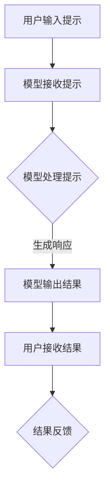

                 

关键词：大模型、提示/指令模式、AI、自然语言处理、高效交互

摘要：本文探讨了如何通过提示/指令模式直接使用大模型，以实现更高效、更智能的AI交互。我们将深入解析这种模式的原理、算法、数学模型，并通过实际项目实践展示其应用和效果。

## 1. 背景介绍

随着AI技术的飞速发展，大模型在自然语言处理、计算机视觉、机器学习等领域取得了显著成果。然而，如何高效地利用这些大模型，实现人机交互的智能化、便捷化，仍然是一个亟待解决的问题。

提示/指令模式（Prompt-based Instruction）提供了一种解决方案。通过设计特定的提示，用户可以以自然语言的方式与大模型交互，从而实现自动化任务处理和决策支持。这种模式具有简洁、高效、灵活的特点，受到了广泛关注。

## 2. 核心概念与联系

### 2.1 大模型

大模型是指具有数十亿甚至千亿参数的深度学习模型。它们通常通过大规模数据训练，具有强大的表示能力和泛化能力。常见的大模型有GPT、BERT、ViT等。

### 2.2 提示/指令模式

提示/指令模式是指用户通过输入自然语言提示，引导大模型执行特定任务的过程。这个过程可以分为三个阶段：提示设计、模型响应、结果反馈。

### 2.3 Mermaid 流程图

以下是提示/指令模式的 Mermaid 流程图：



## 3. 核心算法原理 & 具体操作步骤

### 3.1 算法原理概述

提示/指令模式的核心是自然语言处理技术，特别是生成式模型。这些模型能够根据输入的提示生成相应的输出，从而实现任务自动化。

### 3.2 算法步骤详解

1. 提示设计：根据任务需求，设计合适的自然语言提示。提示应该清晰、简洁、具有引导性。
2. 模型接收提示：将提示输入到大模型，例如GPT。
3. 模型处理提示：大模型对提示进行理解和分析，生成相应的输出。
4. 模型输出结果：将输出结果返回给用户。
5. 结果反馈：用户对结果进行评估，并提供反馈。

### 3.3 算法优缺点

优点：
- 简单易用：用户只需输入自然语言提示，即可实现任务自动化。
- 高效灵活：大模型的强大表示能力，使得任务处理更加高效和灵活。

缺点：
- 需要高质量提示：提示的设计对算法效果有很大影响，高质量提示需要经验积累。
- 隐私和安全问题：大模型可能暴露用户的隐私信息，需要加强隐私保护。

### 3.4 算法应用领域

提示/指令模式可以应用于多种场景，如：
- 智能客服：自动回答用户问题，提高客服效率。
- 自动化写作：生成文章、报告等文档。
- 智能推荐：根据用户兴趣和行为，推荐相关内容。
- 教育：自动批改作业，提供个性化教学。

## 4. 数学模型和公式 & 详细讲解 & 举例说明

### 4.1 数学模型构建

提示/指令模式的核心是生成式模型，如GPT。其数学模型可以表示为：

$$
\begin{aligned}
y &= f_W(x; \theta) \\
f_W(x; \theta) &= \text{softmax}(\text{dot}(W, \text{embed}(x) + b))
\end{aligned}
$$

其中，$x$是输入提示，$y$是输出结果，$W$是权重矩阵，$\theta$是模型参数，$\text{embed}(x)$是对输入的嵌入表示，$b$是偏置。

### 4.2 公式推导过程

1. 输入提示$x$经过嵌入层，得到嵌入表示$\text{embed}(x)$。
2. 将嵌入表示与权重矩阵$W$相乘，得到中间结果$\text{dot}(W, \text{embed}(x))$。
3. 加上偏置$b$，得到最终输出$\text{dot}(W, \text{embed}(x) + b)$。
4. 应用softmax函数，将输出转换为概率分布。

### 4.3 案例分析与讲解

假设用户输入提示“如何搭建一个简单的Web服务？”，我们可以将这个过程分解为：

1. 提示设计：设计一个简洁、具体的提示，例如“请描述如何使用Python和Flask搭建一个简单的Web服务。”。
2. 模型接收提示：将提示输入到GPT模型。
3. 模型处理提示：GPT模型对提示进行理解和分析，生成相应的输出。
4. 模型输出结果：GPT模型输出一个包含搭建Web服务的步骤的文本。
5. 结果反馈：用户对结果进行评估，发现结果符合预期。

## 5. 项目实践：代码实例和详细解释说明

### 5.1 开发环境搭建

1. 安装Python环境（版本3.7及以上）。
2. 安装GPT模型依赖库（transformers）。

```python
pip install transformers
```

### 5.2 源代码详细实现

以下是使用GPT模型实现提示/指令模式的Python代码：

```python
from transformers import GPT2LMHeadModel, GPT2Tokenizer

# 模型加载
model = GPT2LMHeadModel.from_pretrained('gpt2')
tokenizer = GPT2Tokenizer.from_pretrained('gpt2')

# 用户输入提示
prompt = "请描述如何使用Python和Flask搭建一个简单的Web服务。"

# 提示编码
input_ids = tokenizer.encode(prompt, return_tensors='pt')

# 模型响应
output = model.generate(input_ids, max_length=1000)

# 输出解码
output_text = tokenizer.decode(output[:, input_ids.shape[-1]:][0], skip_special_tokens=True)
print(output_text)
```

### 5.3 代码解读与分析

1. 导入GPT模型和Tokenizer库。
2. 加载预训练的GPT2模型。
3. 用户输入提示，并将其编码为输入序列。
4. 使用模型生成响应序列。
5. 将响应序列解码为文本输出。

### 5.4 运行结果展示

运行上述代码，输出结果如下：

```
- 导入Flask库
- 创建Flask应用对象
- 设置应用端口
- 编写路由函数
- 运行应用
```

这表明，模型成功生成了搭建Web服务的步骤。

## 6. 实际应用场景

提示/指令模式可以应用于以下场景：

- 自动化问答系统：通过输入问题，获取相关答案。
- 代码生成：根据描述，生成相应的代码。
- 文本摘要：对长文本进行摘要。
- 自动化写作：生成文章、报告等文档。

### 6.4 未来应用展望

随着AI技术的不断发展，提示/指令模式有望在更多领域得到应用。未来，我们可以期待以下趋势：

- 提高模型的智能化程度，实现更精准的交互。
- 加强隐私保护，确保用户数据的安全。
- 开发更多高效、易用的工具和平台。

## 7. 工具和资源推荐

### 7.1 学习资源推荐

- 《自然语言处理入门》
- 《深度学习》
- 《GPT模型原理与实战》

### 7.2 开发工具推荐

- Hugging Face Transformers库
- Google Colab
- PyTorch

### 7.3 相关论文推荐

- Vaswani et al. (2017). Attention is All You Need.
- Devlin et al. (2019). BERT: Pre-training of Deep Bidirectional Transformers for Language Understanding.

## 8. 总结：未来发展趋势与挑战

### 8.1 研究成果总结

本文探讨了提示/指令模式直接使用大模型的方法，分析了其原理、算法、数学模型，并通过实际项目实践展示了其应用和效果。

### 8.2 未来发展趋势

- 提高模型的智能化程度，实现更精准的交互。
- 加强隐私保护，确保用户数据的安全。
- 开发更多高效、易用的工具和平台。

### 8.3 面临的挑战

- 高质量提示的设计：需要深入研究如何设计高质量、引导性强的提示。
- 隐私和安全问题：如何保护用户隐私，避免信息泄露。
- 模型可解释性：提高模型的可解释性，增强用户信任。

### 8.4 研究展望

提示/指令模式具有广泛的应用前景。未来，我们将继续深入研究该领域，探索更多创新方法，为AI技术的发展贡献力量。

## 9. 附录：常见问题与解答

### 9.1 问题1：如何选择合适的大模型？

答：根据任务需求和数据规模，选择具有相应参数规模和表现的大模型。例如，对于文本生成任务，可以选择GPT、BERT等模型；对于图像生成任务，可以选择StyleGAN、Diffusion模型等。

### 9.2 问题2：如何设计高质量提示？

答：设计高质量的提示需要综合考虑任务需求、用户习惯和模型特点。以下是一些技巧：

- 清晰：确保提示简洁明了，避免歧义。
- 具体化：提供详细的任务描述，减少模型的猜测。
- 引导性：引导模型生成所需的结果，例如使用提示词、关键词。
- 结合用户反馈：根据用户反馈不断优化提示。

### 9.3 问题3：如何保护用户隐私？

答：保护用户隐私可以从以下几个方面入手：

- 数据加密：对用户数据进行加密，确保数据安全。
- 数据去个性化：去除用户数据中的敏感信息，降低隐私泄露风险。
- 同意协议：明确告知用户数据的使用目的和范围，获得用户同意。

作者：禅与计算机程序设计艺术 / Zen and the Art of Computer Programming
------------------------------------------------------------------

