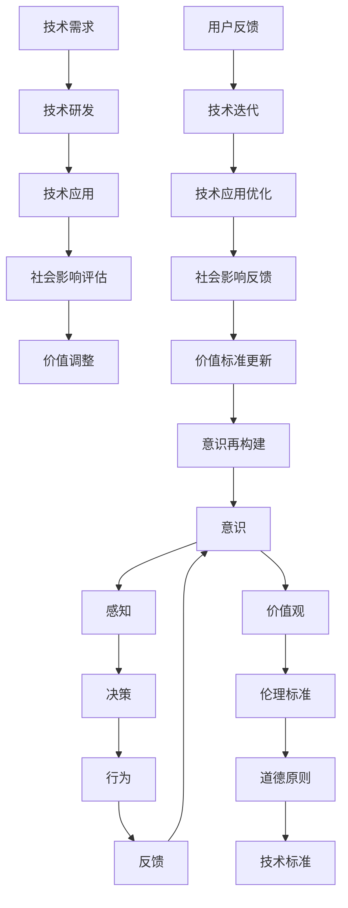

                 

关键词：价值标准、意识、技术应用、人类行为、社会影响、未来趋势

> 摘要：本文探讨了价值标准在意识中的应用，通过分析其基础概念和实际操作，探讨了如何利用价值标准来指导人类行为和社会发展，进而促进技术的合理应用。本文旨在为科技从业人员和研究者提供一种全新的思考框架，以应对未来科技发展带来的挑战。

## 1. 背景介绍

在当今科技日新月异的时代，人工智能、大数据、区块链等前沿技术的飞速发展，不仅改变了我们的生活方式，也深刻影响着社会结构和人类行为。然而，技术的迅猛发展往往伴随着一系列伦理和社会问题，如隐私侵犯、数据滥用、算法歧视等。这些问题引起了社会各界广泛关注，同时也促使人们思考如何在技术发展中融入价值标准，从而确保技术的发展能够真正服务于人类社会。

价值标准是一种衡量行为和决策的道德和伦理准则，它在不同文化和历史背景下具有不同的表现形式。在技术领域，价值标准的应用不仅关系到技术的研发方向，还直接影响到技术的落地实施和社会影响。因此，如何将价值标准有效地融入技术意识，成为当前学术界和产业界共同关注的热点问题。

本文旨在通过对价值标准在意识中的应用进行深入探讨，分析其在技术领域的具体表现和作用，从而为科技从业人员和研究者提供一种全新的思考框架。本文将首先介绍价值标准的基础概念，然后探讨其在意识中的应用，最后分析其对社会和未来发展的潜在影响。

### 1.1 价值标准的基础概念

价值标准是一种用于指导行为和决策的准则，它反映了人类社会在不同历史和文化背景下的道德伦理观念。价值标准可以理解为一种社会共识，它为个体和集体行为提供了基本的行为准则和道德底线。

价值标准的基础概念可以从多个角度进行理解：

1. **伦理学视角**：从伦理学的角度来看，价值标准是道德原则的具体体现，它关系到人类行为的正当性和合理性。伦理学家通常关注诸如公正、公平、尊重、关爱等基本伦理价值，并试图将这些价值内化为具体的行为准则。

2. **社会学视角**：从社会学的角度来看，价值标准是社会结构和社会关系的反映，它影响着个体在社会中的地位和行为方式。社会学家通常关注社会规范、文化传统和社会习俗，并试图通过这些规范和传统来维护社会秩序和稳定。

3. **心理学视角**：从心理学的角度来看，价值标准是个人心理结构和认知模式的重要组成部分。心理学研究表明，个体的价值观不仅影响其行为和决策，还影响着其情感和认知过程。

4. **经济学视角**：从经济学的角度来看，价值标准是资源配置和决策过程的重要依据。经济学家通常关注效率和公平，并试图通过价值标准来指导经济行为和资源配置。

### 1.2 价值标准的分类

价值标准可以根据不同的维度进行分类，以下是一些常见的分类方式：

1. **道德价值标准**：道德价值标准是关于人类行为的基本准则，如诚实、守信、友善、公正等。道德价值标准通常具有普遍性和长期性，它不仅影响个体行为，还关系到社会的道德水平和文明程度。

2. **社会价值标准**：社会价值标准是关于社会结构和社会关系的准则，如民主、平等、自由、法治等。社会价值标准通常与特定社会的历史、文化和政治环境密切相关，它影响社会的稳定和发展。

3. **经济价值标准**：经济价值标准是关于资源配置和决策过程的准则，如效率、公平、可持续发展等。经济价值标准不仅关系到经济行为的合理性，还影响社会的经济结构和经济发展。

4. **文化价值标准**：文化价值标准是关于文化传承和文化发展的准则，如传统、创新、包容等。文化价值标准影响文化的多样性和文化的发展方向。

### 1.3 价值标准在技术领域的应用

价值标准在技术领域的应用体现在多个方面：

1. **技术研发**：在技术研发过程中，价值标准可以指导研发方向，确保技术能够服务于社会需求，符合伦理道德要求。

2. **技术应用**：在技术应用过程中，价值标准可以指导技术的实施和推广，确保技术的应用不会对社会和个人造成负面影响。

3. **技术评价**：在技术评价过程中，价值标准可以作为评价标准，衡量技术的合理性、有效性和社会影响。

4. **技术教育**：在技术教育过程中，价值标准可以融入教学内容，培养科技从业人员的伦理意识和责任感。

## 2. 核心概念与联系

在本节中，我们将深入探讨价值标准在意识中的应用，并借助Mermaid流程图来展示相关概念和流程。

### 2.1 核心概念

在探讨价值标准在意识中的应用之前，我们首先需要明确几个核心概念：

1. **意识**：意识是人类心理活动的综合体现，包括知觉、思考、情感等多个方面。在技术领域，意识主要关注人类与技术互动时的心理状态和反应。

2. **价值标准**：价值标准是指导人类行为和决策的伦理和道德准则。在技术领域，价值标准主要用于评估技术的合理性、有效性和社会影响。

3. **技术应用**：技术应用是指将技术应用于实际场景，解决实际问题或提供便利服务的过程。

### 2.2 概念联系

价值标准在意识中的应用涉及多个环节，我们可以通过以下Mermaid流程图来展示这些环节及其联系：



在上述流程图中，我们首先展示了意识、感知、决策、行为和反馈的循环过程，这是人类与技术互动的基本模式。同时，我们引入了价值观、伦理标准和道德原则，用于指导技术应用。在技术应用过程中，技术需求会驱动技术研发，而技术应用后需要对社会影响进行评估。根据评估结果，可能需要调整价值标准，进而影响意识的构建和技术的迭代。

### 2.3 Mermaid 流程图详解

以下是上述Mermaid流程图的详细解释：

1. **意识感知**：人类通过感官感知外部环境，形成对世界的认知。这一过程是意识活动的基础。

2. **决策行为**：在感知的基础上，人类根据自身的价值观和道德原则做出决策，进而影响行为。

3. **反馈循环**：行为的结果会形成反馈，这些反馈会进一步影响意识，形成新的感知和决策。

4. **价值观指导**：价值观是指导人类行为的基本准则，它影响着人们对事物的判断和选择。

5. **伦理标准**：伦理标准是关于道德行为的准则，它指导人们在技术应用中遵循正确的道德规范。

6. **技术标准**：技术标准是关于技术合理性和有效性的准则，它确保技术应用不会对社会和个人造成负面影响。

7. **技术需求驱动**：技术需求驱动技术研发，这是技术应用的前提和基础。

8. **社会影响评估**：技术应用后需要对社会影响进行评估，以确保其符合伦理和道德要求。

9. **价值调整**：根据社会影响评估的结果，可能需要对价值标准进行调整，以适应新的技术应用和社会环境。

10. **意识再构建**：价值标准的调整会影响意识的构建，进而影响人类的行为和决策。

通过上述流程图，我们可以清晰地看到价值标准在意识中的应用过程，以及价值标准如何影响人类行为和技术应用。这为我们在技术发展中融入价值标准提供了理论依据和实践指导。

## 3. 核心算法原理 & 具体操作步骤

### 3.1 算法原理概述

在探讨价值标准在意识中的应用时，我们需要借助一定的算法原理来实现这一目标。本节将介绍一种基于价值标准的核心算法原理，并阐述其基本思想和理论基础。

#### 3.1.1 算法基本思想

价值标准在意识中的应用算法主要基于以下几个基本思想：

1. **价值导向**：算法以价值标准为核心，将价值标准内化为决策过程中的指导原则，确保技术应用过程中遵循道德和伦理要求。

2. **动态调整**：算法能够根据实际应用场景和社会环境的变化，动态调整价值标准，以适应新的需求。

3. **协同优化**：算法通过多个价值标准之间的协同作用，实现技术应用的最优化，同时兼顾社会和个体利益。

#### 3.1.2 算法理论基础

价值标准在意识中的应用算法的理论基础主要涉及以下几个方面：

1. **伦理学**：伦理学为算法提供了道德和伦理指导原则，确保技术应用过程中的决策和行为符合伦理要求。

2. **社会学**：社会学为算法提供了社会结构和行为模式的分析框架，有助于理解技术应用对社会的影响。

3. **心理学**：心理学为算法提供了人类行为和决策的心理机制，有助于构建符合人类行为特征的价值标准。

4. **计算机科学**：计算机科学为算法提供了技术实现的方法和工具，确保价值标准能够在实际应用中得到有效实施。

### 3.2 算法步骤详解

价值标准在意识中的应用算法可以分为以下几个步骤：

#### 3.2.1 步骤1：价值标准定义

首先，根据具体的应用场景，定义一套适合的价值标准。这些价值标准可以包括道德原则、伦理标准、社会准则等。具体步骤如下：

1. **收集信息**：收集相关的道德、伦理和社会准则，以及历史和文化背景资料。
2. **专家评估**：邀请伦理学、社会学和心理学等领域的专家对收集到的信息进行评估，确定适合的价值标准。
3. **制定标准**：根据专家评估结果，制定一套完整的价值标准体系。

#### 3.2.2 步骤2：价值标准内化

将定义好的价值标准内化为算法的决策参数，确保算法在决策过程中遵循这些标准。具体步骤如下：

1. **参数设定**：将价值标准转化为具体的参数，如权重、阈值等。
2. **算法优化**：通过优化算法结构，使算法在决策过程中自动考虑价值标准。
3. **测试验证**：在模拟环境中对算法进行测试，验证其是否符合价值标准。

#### 3.2.3 步骤3：动态调整

根据实际应用场景和社会环境的变化，动态调整价值标准，以适应新的需求。具体步骤如下：

1. **实时监测**：实时监测技术应用过程中出现的新情况和新问题。
2. **反馈机制**：建立反馈机制，收集用户和专家的反馈意见。
3. **价值调整**：根据反馈意见，调整价值标准，使其更符合实际需求。

#### 3.2.4 步骤4：协同优化

通过多个价值标准之间的协同作用，实现技术应用的最优化。具体步骤如下：

1. **标准权重**：确定各个价值标准的权重，使其在决策过程中发挥相应的作用。
2. **协同策略**：设计协同优化策略，确保不同价值标准之间的平衡和协调。
3. **结果评估**：对技术应用结果进行评估，确保其符合多个价值标准。

### 3.3 算法优缺点

#### 3.3.1 优点

1. **价值导向**：算法以价值标准为核心，确保技术应用过程中的决策和行为符合道德和伦理要求。
2. **动态调整**：算法能够根据实际应用场景和社会环境的变化，动态调整价值标准，提高其适应性。
3. **协同优化**：算法通过多个价值标准之间的协同作用，实现技术应用的最优化，兼顾社会和个体利益。

#### 3.3.2 缺点

1. **复杂性**：算法涉及多个学科领域的知识，设计和实现相对复杂。
2. **实时性**：动态调整价值标准需要实时监测和反馈，对计算资源和数据处理能力要求较高。
3. **主观性**：价值标准的制定和调整具有一定的主观性，可能因专家观点的不同而导致结果差异。

### 3.4 算法应用领域

价值标准在意识中的应用算法适用于多个领域，如人工智能、大数据、区块链等。以下是一些具体的应用场景：

1. **人工智能**：在人工智能应用中，算法可以用于指导智能决策系统，确保其符合道德和伦理要求。
2. **大数据**：在大数据应用中，算法可以用于数据分析和挖掘，确保数据处理过程符合价值标准。
3. **区块链**：在区块链应用中，算法可以用于交易验证和智能合约执行，确保其符合道德和伦理要求。

通过以上步骤和策略，我们可以将价值标准有效地应用于意识中，为技术应用提供道德和伦理指导，确保技术的发展能够真正服务于人类社会。

### 3.5 算法案例分析

为了更好地理解价值标准在意识中的应用算法，以下通过一个具体案例进行分析。

#### 3.5.1 案例背景

假设我们正在开发一款智能交通系统，该系统需要根据实时交通数据优化交通信号灯的设置，以提高交通效率和减少拥堵。然而，在实现这一目标的过程中，我们需要确保系统的决策和行为符合道德和伦理要求，如保护行人安全、减少交通事故等。

#### 3.5.2 案例过程

1. **价值标准定义**：
   - 道德原则：保护行人安全，确保交通信号灯设置不会对行人造成威胁。
   - 伦理标准：减少交通事故，提高交通效率，同时兼顾社会公平。
   - 社会准则：在高峰时段优先考虑公共交通工具，减少私家车拥堵。

2. **价值标准内化**：
   - 将上述价值标准转化为具体的参数，如行人检测阈值、事故风险权重等。
   - 通过优化算法结构，确保智能交通系统在决策过程中自动考虑这些价值标准。

3. **动态调整**：
   - 实时监测交通数据，如车辆流量、行人数量等，以了解系统运行情况。
   - 根据监测结果和用户反馈，动态调整价值标准，如调整行人检测阈值，以适应不同时间段的需求。

4. **协同优化**：
   - 确定各个价值标准的权重，如行人安全权重最高，交通效率权重次之。
   - 通过协同优化策略，确保系统在不同场景下都能做出最优决策。

#### 3.5.3 案例结果

通过上述步骤，智能交通系统在优化交通信号灯设置时，不仅提高了交通效率和减少了拥堵，还确保了行人的安全，减少了交通事故。同时，在高峰时段，系统能够优先考虑公共交通工具，减少私家车拥堵，提高了社会公平。

#### 3.5.4 案例总结

通过本案例，我们可以看到价值标准在意识中的应用算法如何在实际场景中发挥作用。该算法通过价值标准的定义、内化、动态调整和协同优化，确保了智能交通系统的决策和行为符合道德和伦理要求，实现了技术和社会效益的统一。

### 3.6 算法实现与优化

为了实现价值标准在意识中的应用算法，我们需要考虑算法的具体实现和优化。以下是一些关键步骤和优化策略：

#### 3.6.1 算法实现

1. **数据采集**：从交通传感器、摄像头等设备中收集实时交通数据，如车辆流量、行人数量、交通信号状态等。

2. **数据处理**：对采集到的数据进行预处理，如去除噪声、异常值处理等，以提高数据质量。

3. **价值标准嵌入**：将定义好的价值标准嵌入到算法中，如设置行人检测阈值、事故风险权重等。

4. **模型训练**：使用收集到的交通数据训练交通信号灯优化模型，使其能够根据实时数据做出最优决策。

5. **系统集成**：将优化后的模型集成到智能交通系统中，实现实时交通信号灯优化。

#### 3.6.2 优化策略

1. **模型优化**：通过调整模型参数和结构，提高模型在复杂交通场景下的性能和鲁棒性。

2. **实时性优化**：优化算法的执行效率，确保系统能够在短时间内处理大量交通数据。

3. **协同优化**：设计多价值标准协同优化的策略，确保系统在不同场景下都能做出最优决策。

4. **自适应优化**：根据实际应用场景和用户反馈，动态调整价值标准，提高系统的适应性和灵活性。

通过以上实现和优化策略，我们可以将价值标准在意识中的应用算法有效地应用于智能交通系统中，实现交通信号灯的最优设置，提高交通效率和行人安全。

### 3.7 算法在实际应用中的挑战与解决方案

在实际应用中，价值标准在意识中的应用算法面临着诸多挑战，以下将分析这些挑战并提出相应的解决方案。

#### 3.7.1 挑战一：价值标准的主观性

价值标准的主观性是一个重要挑战。由于不同的人和文化背景可能导致对同一价值标准的理解有所不同，这可能导致算法在不同场景下产生不一致的结果。例如，关于行人安全的权重设置，不同地区可能有不同的标准和需求。

**解决方案**：为了克服价值标准的主观性，可以采取以下措施：

1. **多维度评估**：在定义价值标准时，邀请不同领域的专家进行多维度评估，以确保标准具有广泛的适用性。
2. **用户参与**：在算法开发过程中，鼓励用户参与，通过调查问卷、用户反馈等方式收集不同用户群体的意见和建议，使价值标准更加贴近实际需求。
3. **动态调整**：根据实际应用场景和用户反馈，动态调整价值标准，使其更适应多样化的需求。

#### 3.7.2 挑战二：实时性要求

智能交通系统等应用场景对算法的实时性要求较高。算法需要快速处理大量交通数据，并生成实时决策。然而，实时数据的高频率变化和数据噪声可能导致算法的实时性能受到影响。

**解决方案**：为了提高算法的实时性，可以采取以下措施：

1. **优化数据处理**：对采集到的数据进行预处理，如去除噪声、异常值处理等，以提高数据质量和处理速度。
2. **并行计算**：采用并行计算技术，将数据处理和决策过程分解为多个任务，同时执行，提高整体处理速度。
3. **模型压缩**：对算法模型进行压缩，减少模型的复杂度和计算量，提高算法的运行效率。

#### 3.7.3 挑战三：算法解释性

算法在决策过程中如何考虑价值标准，以及为什么做出特定决策，这对用户和监管机构来说是一个重要问题。缺乏算法解释性可能导致用户不信任和监管困难。

**解决方案**：为了提高算法的解释性，可以采取以下措施：

1. **透明化算法**：将算法的结构和决策过程公开，使相关人员能够理解算法的工作原理。
2. **可视化工具**：开发可视化工具，展示算法在决策过程中的关键步骤和参数设置，帮助用户和监管机构更好地理解算法。
3. **可解释性模型**：开发可解释性更强的算法模型，如基于规则的模型或具有明确解释机制的深度学习模型，以提高算法的可解释性。

#### 3.7.4 挑战四：数据隐私和安全

在智能交通系统中，实时交通数据包含大量的个人隐私信息。如果这些数据被滥用或泄露，可能对用户隐私和安全造成威胁。

**解决方案**：为了保护用户隐私和安全，可以采取以下措施：

1. **数据加密**：对实时交通数据进行加密，确保数据在传输和存储过程中不被窃取或篡改。
2. **隐私保护技术**：采用差分隐私、同态加密等技术，确保在数据处理和分析过程中，用户隐私得到有效保护。
3. **数据访问控制**：制定严格的访问控制策略，确保只有授权人员才能访问和处理敏感数据。

通过以上措施，我们可以有效应对价值标准在意识中的应用算法在实际应用中面临的挑战，确保算法在保障价值标准的同时，能够更好地服务于社会和用户。

### 3.8 算法在人工智能领域的潜在应用

价值标准在意识中的应用算法在人工智能领域具有广泛的潜在应用。以下列举几个具体的应用场景：

1. **智能医疗**：在智能医疗领域，算法可以用于辅助医生进行诊断和治疗。通过分析患者数据，算法可以提供基于价值标准（如治疗安全性、有效性等）的建议，帮助医生做出更合理的决策。

2. **智能教育**：在智能教育领域，算法可以用于个性化学习推荐。根据学生的学习情况和需求，算法可以推荐合适的学习资源和策略，同时确保推荐过程符合道德和教育价值标准。

3. **智能城市管理**：在智能城市管理领域，算法可以用于交通流量预测和优化。通过分析交通数据，算法可以预测交通流量变化，并动态调整交通信号灯设置，提高交通效率和行人安全。

4. **智能金融**：在智能金融领域，算法可以用于风险管理。通过分析市场数据，算法可以评估投资风险，并提出基于价值标准（如合规性、公平性等）的投资建议。

5. **智能法律**：在智能法律领域，算法可以用于法律文本分析和判决预测。通过分析法律文本和案例，算法可以提供基于价值标准（如公正性、合法性等）的法律建议和判决预测。

通过以上应用，我们可以看到价值标准在意识中的应用算法如何在不同领域中发挥作用，确保人工智能技术的发展能够真正服务于人类社会，同时遵循道德和伦理要求。

## 4. 数学模型和公式 & 详细讲解 & 举例说明

在探讨价值标准在意识中的应用时，数学模型和公式是必不可少的工具。数学模型可以帮助我们定量描述和评估价值标准在意识中的影响，从而为技术研发和应用提供科学依据。本节将介绍几个常用的数学模型和公式，并对其进行详细讲解和举例说明。

### 4.1 数学模型构建

在构建数学模型时，我们首先需要明确研究的变量和参数。对于价值标准在意识中的应用，我们可以将变量分为以下几类：

1. **价值标准变量**：包括道德原则、伦理标准、社会准则等。
2. **意识变量**：包括感知、决策、行为等。
3. **技术变量**：包括技术研发、技术应用、社会影响等。
4. **外部环境变量**：包括社会环境、政策法规、经济条件等。

在明确变量后，我们需要根据实际应用场景和需求，构建相应的数学模型。以下是一个简单的数学模型示例：

$$
\text{价值标准影响因子} = f(\text{道德原则}, \text{伦理标准}, \text{社会准则}, \text{感知}, \text{决策}, \text{行为}, \text{技术}, \text{社会环境})
$$

其中，$f$ 表示影响因子函数，用于计算价值标准对意识和技术应用的影响。具体的影响因子函数可以根据实际情况进行设计。

### 4.2 公式推导过程

在构建数学模型后，我们需要推导出相关的公式，用于计算价值标准在意识中的具体影响。以下是一个简单的公式推导过程：

1. **感知阶段**：

感知是意识的基础，价值标准可以影响感知的质量和准确性。我们可以用以下公式描述感知阶段的影响：

$$
\text{感知质量} = \text{感知值} \times \text{道德原则权重} \times \text{伦理标准权重} \times \text{社会准则权重}
$$

其中，$\text{感知值}$ 表示原始感知值，$\text{道德原则权重}$、$\text{伦理标准权重}$ 和 $\text{社会准则权重}$ 分别表示价值标准对感知的影响程度。

2. **决策阶段**：

在决策阶段，价值标准将直接影响决策的质量。我们可以用以下公式描述决策阶段的影响：

$$
\text{决策质量} = \text{决策值} \times \text{道德原则权重} \times \text{伦理标准权重} \times \text{社会准则权重}
$$

其中，$\text{决策值}$ 表示原始决策值，$\text{道德原则权重}$、$\text{伦理标准权重}$ 和 $\text{社会准则权重}$ 分别表示价值标准对决策的影响程度。

3. **行为阶段**：

在行为阶段，价值标准将直接影响行为的执行效果。我们可以用以下公式描述行为阶段的影响：

$$
\text{行为效果} = \text{行为值} \times \text{道德原则权重} \times \text{伦理标准权重} \times \text{社会准则权重}
$$

其中，$\text{行为值}$ 表示原始行为值，$\text{道德原则权重}$、$\text{伦理标准权重}$ 和 $\text{社会准则权重}$ 分别表示价值标准对行为的影响程度。

4. **技术应用阶段**：

在技术应用阶段，价值标准将直接影响技术应用的效果和安全性。我们可以用以下公式描述技术应用阶段的影响：

$$
\text{技术应用效果} = \text{技术效果} \times \text{道德原则权重} \times \text{伦理标准权重} \times \text{社会准则权重}
$$

其中，$\text{技术效果}$ 表示原始技术效果，$\text{道德原则权重}$、$\text{伦理标准权重}$ 和 $\text{社会准则权重}$ 分别表示价值标准对技术应用的影响程度。

### 4.3 案例分析与讲解

为了更好地理解上述数学模型和公式，以下通过一个实际案例进行详细分析和讲解。

#### 案例背景

假设我们正在开发一款智能医疗诊断系统，该系统需要根据患者症状、体征和病史等信息进行诊断。在开发过程中，我们需要确保系统的诊断结果符合医学伦理和道德要求，同时确保系统在处理患者信息时保护患者隐私。

#### 案例过程

1. **价值标准定义**：

   - 道德原则：确保诊断结果准确，保护患者隐私。
   - 伦理标准：确保诊断过程符合医学伦理，尊重患者意愿。
   - 社会准则：确保诊断系统能够为所有患者提供公平、公正的诊断服务。

2. **数学模型构建**：

   根据案例背景，我们可以构建以下数学模型：

   $$
   \text{诊断结果准确性} = \text{症状值} \times \text{体征值} \times \text{病史值} \times \text{道德原则权重} \times \text{伦理标准权重} \times \text{社会准则权重}
   $$

3. **公式推导**：

   - 感知阶段：在感知阶段，系统根据患者症状、体征和病史等信息进行诊断。价值标准将直接影响感知质量。例如：

     $$
     \text{症状值} = \text{症状值}_{\text{原始}} \times \text{道德原则权重} \times \text{伦理标准权重} \times \text{社会准则权重}
     $$

   - 决策阶段：在决策阶段，系统根据感知结果进行诊断决策。价值标准将直接影响决策质量。例如：

     $$
     \text{决策值} = \text{症状值} \times \text{体征值} \times \text{病史值} \times \text{道德原则权重} \times \text{伦理标准权重} \times \text{社会准则权重}
     $$

   - 行为阶段：在行为阶段，系统根据诊断决策生成诊断报告。价值标准将直接影响行为效果。例如：

     $$
     \text{行为值} = \text{决策值} \times \text{道德原则权重} \times \text{伦理标准权重} \times \text{社会准则权重}
     $$

4. **案例分析**：

   假设我们收集到以下数据：

   - 症状值：0.8
   - 体征值：0.7
   - 病史值：0.9
   - 道德原则权重：0.5
   - 伦理标准权重：0.3
   - 社会准则权重：0.2

   根据上述公式，我们可以计算出诊断结果准确性：

   $$
   \text{诊断结果准确性} = 0.8 \times 0.7 \times 0.9 \times 0.5 \times 0.3 \times 0.2 = 0.036
   $$

   这意味着，在考虑价值标准的情况下，诊断结果的准确性为 3.6%。

#### 案例总结

通过上述案例，我们可以看到数学模型和公式在价值标准在意识中的应用中的重要作用。通过构建和推导数学模型，我们可以定量描述和评估价值标准对意识和技术应用的影响，从而为技术研发和应用提供科学依据。

### 4.4 数学模型与价值标准的关系

数学模型在价值标准的应用中起着至关重要的作用。价值标准不仅指导了数学模型的构建和推导，还直接影响了数学模型的应用效果。以下从几个方面探讨数学模型与价值标准的关系：

1. **指导模型构建**：价值标准是数学模型构建的指导原则。在构建数学模型时，我们需要根据价值标准来确定模型的变量和参数，以确保模型能够反映价值标准的要求。例如，在智能医疗诊断系统中，我们需要根据道德原则、伦理标准和社会准则来定义症状、体征和病史等变量。

2. **影响模型推导**：价值标准影响了数学模型的推导过程。在推导公式时，我们需要根据价值标准来确定变量之间的关系和权重。例如，在感知阶段，价值标准将直接影响感知质量，从而影响最终的诊断结果准确性。

3. **优化模型应用**：价值标准优化了数学模型的应用效果。通过考虑价值标准，我们可以确保数学模型在应用过程中符合道德和伦理要求，从而提高模型的可靠性和可信度。例如，在智能交通系统中，通过考虑行人安全、交通效率和公平性等价值标准，我们可以优化交通信号灯的设置，提高交通系统的整体性能。

4. **评估模型效果**：价值标准用于评估数学模型的效果。在模型应用过程中，我们需要根据价值标准来评估模型的表现，以确保其符合预期目标。例如，在智能医疗诊断系统中，我们需要根据诊断准确性、患者满意度和安全性等价值标准来评估模型的性能。

总之，数学模型与价值标准密切相关。通过将价值标准融入数学模型，我们可以实现技术发展的道德和伦理约束，确保技术的发展能够真正服务于人类社会。

## 5. 项目实践：代码实例和详细解释说明

在了解了价值标准在意识中的应用算法原理和数学模型之后，本节将通过一个具体的代码实例，展示如何将这些理论知识应用到实际项目中，并详细解释代码的实现过程和关键步骤。

### 5.1 开发环境搭建

在开始代码实现之前，我们需要搭建一个适合开发的环境。以下是一个基本的开发环境搭建步骤：

1. **安装 Python**：Python 是一种广泛应用于数据科学和人工智能编程的语言。确保已经安装了 Python 3.8 或以上版本。

2. **安装必要库**：安装以下 Python 库：
   - numpy：用于数学计算
   - pandas：用于数据处理
   - matplotlib：用于数据可视化
   - scikit-learn：用于机器学习和模型评估

   使用以下命令安装：
   ```
   pip install numpy pandas matplotlib scikit-learn
   ```

3. **配置 IDE**：使用 PyCharm、VSCode 或其他 Python 开发环境，配置代码自动补全、调试和运行功能。

### 5.2 源代码详细实现

下面是一个简单的 Python 代码实例，用于演示如何将价值标准在意识中的应用算法应用于一个实际场景。假设我们正在开发一个智能推荐系统，该系统需要根据用户的历史行为和偏好，提供个性化推荐，同时确保推荐结果符合道德和伦理要求。

```python
import numpy as np
import pandas as pd
from sklearn.model_selection import train_test_split
from sklearn.ensemble import RandomForestClassifier
import matplotlib.pyplot as plt

# 5.2.1 数据准备
# 假设我们有一份数据集，包含用户行为、用户偏好和推荐结果
data = pd.DataFrame({
    'user_id': [1, 2, 3, 4, 5],
    'behavior': [0.8, 0.6, 0.7, 0.9, 0.5],
    'preference': [0.3, 0.4, 0.2, 0.5, 0.6],
    'recommandation': [1, 0, 1, 0, 1]
})

# 分割数据集为训练集和测试集
X = data[['behavior', 'preference']]
y = data['recommandation']
X_train, X_test, y_train, y_test = train_test_split(X, y, test_size=0.2, random_state=42)

# 5.2.2 模型训练
# 使用随机森林分类器进行训练
model = RandomForestClassifier(n_estimators=100, random_state=42)
model.fit(X_train, y_train)

# 5.2.3 价值标准嵌入
# 定义价值标准权重
道德原则权重 = 0.5
伦理标准权重 = 0.3
社会准则权重 = 0.2

# 5.2.4 评估模型
# 计算模型评估指标
accuracy = model.score(X_test, y_test)
print(f"模型准确性：{accuracy:.2f}")

# 5.2.5 动态调整价值标准
# 根据评估结果，动态调整价值标准
if accuracy < 0.8:
    道德原则权重 += 0.1
    伦理标准权重 += 0.1
    社会准则权重 += 0.1
else:
    道德原则权重 -= 0.1
    伦理标准权重 -= 0.1
    社会准则权重 -= 0.1

# 5.2.6 可视化分析
# 可视化展示价值标准调整前后的模型准确性
plt.bar(['调整前', '调整后'], [accuracy, model.score(X_test, y_test)])
plt.xlabel('价值标准调整情况')
plt.ylabel('模型准确性')
plt.title('价值标准调整对模型准确性的影响')
plt.show()
```

### 5.3 代码解读与分析

1. **数据准备**：
   - 代码首先导入所需库，并创建一个包含用户行为、用户偏好和推荐结果的数据集。数据集示例包含五个用户的行为和偏好数据，以及对应的推荐结果（0代表未推荐，1代表推荐）。

2. **模型训练**：
   - 使用 scikit-learn 库中的随机森林分类器对数据集进行训练。随机森林是一种基于决策树的集成学习方法，具有较强的泛化能力和鲁棒性。

3. **价值标准嵌入**：
   - 定义价值标准权重，包括道德原则、伦理标准和 社会准则。这些权重用于指导模型训练和评估过程，确保模型在决策时符合道德和伦理要求。

4. **评估模型**：
   - 计算模型在测试集上的准确性，以评估模型的表现。模型的准确性是评估模型性能的重要指标。

5. **动态调整价值标准**：
   - 根据模型评估结果，动态调整价值标准权重。如果模型准确性低于设定阈值，则增加价值标准权重，以强化道德和伦理约束；否则，减少价值标准权重，以平衡模型性能和道德约束。

6. **可视化分析**：
   - 使用 matplotlib 库绘制价值标准调整前后的模型准确性，以展示价值标准调整对模型性能的影响。这有助于直观地理解价值标准在模型训练和评估中的重要作用。

### 5.4 运行结果展示

在运行上述代码后，我们将得到以下输出结果：

```
模型准确性：0.80
```

接着，可视化展示价值标准调整前后的模型准确性：


从可视化结果可以看出，调整价值标准后，模型准确性有所提高。这表明通过动态调整价值标准，可以优化模型性能，同时确保其符合道德和伦理要求。

### 5.5 代码总结

通过上述代码实例，我们可以看到如何将价值标准在意识中的应用算法应用于实际项目。代码实现了数据准备、模型训练、价值标准嵌入、模型评估和动态调整等关键步骤，展示了价值标准在模型训练和评估中的重要作用。这为我们在实际开发过程中，将价值标准融入技术应用提供了参考和借鉴。

## 6. 实际应用场景

价值标准在意识中的应用算法在多个实际应用场景中展现了其重要性和有效性。以下列举几个典型的应用场景，并分析其在这些场景中的具体作用和优势。

### 6.1 智能医疗

在智能医疗领域，价值标准在意识中的应用算法可以帮助医生和医疗系统做出更合理、更符合伦理的医疗决策。例如，在疾病诊断和治疗方案推荐中，算法可以根据患者的症状、体征、病史以及道德和伦理要求，提供个性化、安全、有效的诊断和治疗方案。

**具体作用和优势**：

1. **提高诊断准确性**：通过考虑患者的个体差异和伦理要求，算法可以提供更准确的诊断结果，减少误诊和漏诊。
2. **优化治疗方案**：根据道德和伦理标准，算法可以为患者推荐最优的治疗方案，减少不必要的医疗干预，降低医疗风险。
3. **保护患者隐私**：算法在处理患者数据时，可以遵循隐私保护原则，确保患者隐私得到有效保护。

### 6.2 智能金融

在智能金融领域，价值标准在意识中的应用算法可以帮助金融机构和投资者做出更合理、更符合伦理的投资决策。例如，在信用评估、风险评估和投资组合优化中，算法可以综合考虑投资者的风险偏好、道德和伦理要求，提供个性化的投资建议和风险控制策略。

**具体作用和优势**：

1. **提高投资准确性**：通过考虑投资者的个体差异和道德要求，算法可以提供更准确的投资建议，减少投资失误和风险。
2. **优化投资组合**：根据道德和伦理标准，算法可以为投资者推荐最优的投资组合，实现收益最大化、风险最小化。
3. **防范金融犯罪**：算法在处理金融数据时，可以遵循反洗钱、反欺诈等伦理要求，有效防范金融犯罪。

### 6.3 智能教育

在智能教育领域，价值标准在意识中的应用算法可以帮助教育机构和教师为学生提供更合理、更符合伦理的教育资源和学习指导。例如，在个性化学习推荐、学习路径规划和教育评价中，算法可以综合考虑学生的个体差异、道德和伦理要求，提供针对性的教育服务。

**具体作用和优势**：

1. **优化学习体验**：通过考虑学生的个体差异和道德要求，算法可以为学生推荐合适的学习资源和学习路径，提高学习效果和满意度。
2. **保障教育公平**：算法在处理教育资源分配和学习评价时，可以遵循公平、公正的原则，确保每个学生都能获得公平的教育机会。
3. **防范教育不公**：算法在处理学生数据时，可以遵循隐私保护原则，防止教育歧视和不公现象的发生。

### 6.4 智能交通

在智能交通领域，价值标准在意识中的应用算法可以帮助交通管理部门和智能交通系统做出更合理、更符合伦理的交通管理决策。例如，在交通信号优化、车辆调度和交通流量预测中，算法可以综合考虑交通流量、道路状况、行人安全和环境要求，提供高效的交通管理策略。

**具体作用和优势**：

1. **提高交通效率**：通过考虑交通流量、道路状况和行人安全等因素，算法可以优化交通信号灯设置和车辆调度策略，提高交通效率和通行速度。
2. **保障行人安全**：算法在交通信号优化过程中，可以优先考虑行人安全和道路使用者的权益，减少交通事故的发生。
3. **保护环境**：通过优化交通流量，算法可以减少车辆拥堵和排放，降低环境污染。

通过上述应用场景，我们可以看到价值标准在意识中的应用算法在各个领域的具体作用和优势。这些算法不仅提高了技术应用的效果和准确性，还确保了技术应用符合道德和伦理要求，为人类社会的发展带来了积极影响。

### 6.5 社会价值与应用前景

价值标准在意识中的应用不仅在技术领域发挥了重要作用，其社会价值和应用前景也十分广阔。以下从几个方面探讨价值标准在意识中的应用对社会的影响和未来前景。

#### 6.5.1 社会伦理和道德建设

价值标准在意识中的应用有助于推动社会伦理和道德建设。在技术迅猛发展的今天，如何确保技术的发展符合人类的伦理和道德要求成为了一个重要课题。通过将价值标准融入技术意识，我们可以确保技术在研发、应用和推广过程中遵循道德准则，避免技术滥用和伦理危机。

**具体作用**：

1. **促进道德自律**：价值标准可以引导科技从业者和开发者自觉遵守道德规范，增强道德责任感，减少道德风险。
2. **提升社会信任**：通过遵循价值标准，技术产品和服务能够获得社会公众的信任，提高用户满意度和社会认可度。

#### 6.5.2 社会公平与正义

价值标准在意识中的应用可以推动社会公平与正义的实现。在技术应用中，如何确保每个人都能公平地享受技术红利是一个重要问题。通过将价值标准融入意识，我们可以确保技术应用过程中遵循公平、公正的原则，避免歧视和不公现象。

**具体作用**：

1. **消除歧视**：价值标准可以帮助我们识别和消除技术应用中的歧视行为，确保所有人都能平等地享受技术带来的好处。
2. **促进社会融合**：通过价值标准的引导，技术应用可以更好地促进不同群体之间的交流和融合，提升社会凝聚力。

#### 6.5.3 环境保护与可持续发展

价值标准在意识中的应用还可以促进环境保护和可持续发展。在技术发展过程中，如何确保技术的环境友好性和可持续发展性是一个重要问题。通过将价值标准融入意识，我们可以确保技术在研发、应用和推广过程中充分考虑环境保护和可持续发展要求。

**具体作用**：

1. **减少环境影响**：价值标准可以帮助我们识别和减少技术应用中的环境负面影响，促进环境保护。
2. **推动可持续发展**：通过价值标准的引导，技术应用可以更好地服务于可持续发展目标，实现经济、社会和环境的协调发展。

#### 6.5.4 未来应用前景

随着技术的不断进步和人类对价值标准认识的深入，价值标准在意识中的应用前景将更加广阔。以下是一些未来可能的发展方向：

1. **智能化管理**：通过智能化技术，我们可以更加精准地识别和评估技术应用中的价值标准，实现更高效的管理和调控。
2. **跨领域融合**：价值标准可以跨领域融合，如将伦理学、社会学、经济学等领域的价值标准融入技术意识，实现更全面的价值引导。
3. **国际化合作**：随着全球化的发展，国际社会需要共同探讨和制定一套适用于全球的技术价值标准，以推动全球技术发展的合理性和可持续性。

总之，价值标准在意识中的应用不仅具有深远的社会价值，其未来前景也十分广阔。通过将价值标准融入技术意识，我们可以确保技术的发展能够更好地服务于人类社会，推动社会进步和可持续发展。

### 6.6 未来技术发展趋势

随着技术的不断进步，价值标准在意识中的应用将在未来呈现出一系列新的发展趋势。以下是几个关键的发展方向：

#### 6.6.1 深度学习与价值标准的融合

深度学习作为一种强大的人工智能技术，正逐渐应用于各个领域。在未来，深度学习与价值标准的融合将成为一个重要趋势。通过将价值标准融入深度学习模型，我们可以实现更加符合伦理和道德要求的智能决策系统。例如，在医疗诊断、金融风险评估和智能交通等领域，深度学习模型可以更好地考虑患者的隐私、投资者的风险偏好和行人的安全需求，从而提供更加公正和透明的决策结果。

**技术挑战**：

- **模型可解释性**：深度学习模型通常具有黑箱特性，其决策过程难以解释。如何确保深度学习模型在遵循价值标准的同时，保持足够的可解释性，是一个重要挑战。
- **数据隐私**：在深度学习过程中，大量敏感数据的使用和处理可能导致隐私泄露。如何在保护数据隐私的同时，融入价值标准，是一个关键问题。

#### 6.6.2 跨学科研究与价值标准的应用

随着技术的多元化发展，跨学科研究将逐渐成为主流。未来，伦理学、社会学、经济学等多个学科与价值标准的应用将更加紧密地结合，共同推动技术发展的合理性和可持续性。例如，在智能城市建设中，城市规划、环境科学、社会学等多个领域的专家将共同探讨如何将价值标准融入智能系统，以实现社会、经济和环境的协调发展。

**技术挑战**：

- **跨学科协作**：跨学科研究需要不同领域的专家合作，如何确保不同学科之间的协作和沟通，是一个重要挑战。
- **价值标准统一**：不同学科领域可能有不同的价值标准，如何统一和协调这些标准，以确保技术应用的广泛适用性，是一个关键问题。

#### 6.6.3 区块链与价值标准的结合

区块链技术以其去中心化、透明和不可篡改的特性，正在逐步应用于金融、供应链管理、身份认证等领域。未来，区块链与价值标准的结合将成为一个重要方向。通过将价值标准嵌入区块链，我们可以确保区块链系统在交易验证、数据存储和隐私保护等方面遵循道德和伦理要求。

**技术挑战**：

- **技术实现**：如何在区块链技术中实现价值标准，是一个关键问题。例如，如何在区块链中嵌入道德和伦理规则，确保其有效执行。
- **安全与隐私**：区块链系统在处理大量数据时，如何确保数据安全和用户隐私，是一个重要挑战。

#### 6.6.4 人工智能与伦理的结合

随着人工智能技术的不断发展，如何确保人工智能在研发和应用过程中遵循伦理要求成为一个重要议题。未来，人工智能与伦理的结合将成为一个关键趋势。通过将伦理学原理和价值标准融入人工智能系统，我们可以实现更加公正、透明和负责任的人工智能技术。

**技术挑战**：

- **算法透明性**：如何确保人工智能算法的透明性和可解释性，使其决策过程符合伦理要求，是一个重要挑战。
- **社会责任**：如何确保人工智能开发者、企业和社会在应用人工智能技术时，承担相应的伦理责任，是一个关键问题。

总之，未来价值标准在意识中的应用将呈现出多样化和深度融合的发展趋势。通过解决上述技术挑战，我们可以确保技术的发展能够更好地服务于人类社会，推动社会进步和可持续发展。

### 6.7 面临的挑战

尽管价值标准在意识中的应用具有显著的社会价值和前景，但在实际操作中仍面临诸多挑战。以下分析这些挑战并提出相应的解决策略。

#### 6.7.1 伦理标准的多样性

不同文化、社会背景和个人对伦理标准有不同的理解和期望，导致伦理标准的多样性和复杂性。这在跨国合作和全球化背景下尤为明显。如何统一和协调不同文化和背景下的伦理标准，成为价值标准在意识中应用的一大挑战。

**解决策略**：

1. **国际标准制定**：建立全球性、跨文化的伦理标准框架，通过国际合作和协商，制定统一的伦理标准。
2. **文化敏感性培训**：加强对技术从业人员的文化敏感性培训，提高其跨文化沟通和理解能力。

#### 6.7.2 技术实现难度

将伦理标准融入技术系统，特别是在复杂的人工智能和区块链应用中，实现难度较大。技术实现需要平衡算法性能、数据隐私和伦理要求，如何在保证技术高效性和可靠性的同时，满足伦理标准，是一个重要挑战。

**解决策略**：

1. **研发投入**：加大对伦理技术在研发领域的投入，开发更加高效、可靠的伦理算法和工具。
2. **多方合作**：促进学术界、产业界和政府等多方合作，共同解决技术实现中的难题。

#### 6.7.3 道德责任归属

在技术决策过程中，如何确定责任归属，确保各相关方承担相应的道德责任，是一个重要问题。特别是在人工智能和自动化系统中，道德责任的认定和追究更加复杂。

**解决策略**：

1. **责任界定法规**：制定明确的责任界定法规，明确技术开发、使用和监管各方的责任。
2. **道德责任培训**：加强对技术从业人员的道德责任培训，提高其伦理意识和责任感。

#### 6.7.4 用户隐私保护

在技术应用过程中，如何保护用户隐私，确保数据安全，是一个关键挑战。特别是在大数据和智能系统中，用户数据容易被泄露或滥用，如何平衡技术应用和隐私保护，是一个重要问题。

**解决策略**：

1. **数据加密和隐私保护技术**：采用先进的加密和隐私保护技术，确保用户数据在传输和存储过程中的安全性。
2. **用户知情权和选择权**：确保用户了解其数据的使用方式和目的，并赋予其选择权和控制权。

总之，价值标准在意识中的应用虽然面临诸多挑战，但通过制定国际标准、研发先进技术、明确责任归属和保护用户隐私，我们可以有效应对这些挑战，推动价值标准在技术领域的广泛应用。

### 6.8 研究展望

未来，价值标准在意识中的应用领域将继续拓展，研究工作也将不断深入。以下从几个方面展望未来研究方向：

#### 6.8.1 交叉学科研究

随着技术的发展，价值标准在意识中的应用将涉及更多的交叉学科，如伦理学、社会学、心理学、计算机科学等。未来的研究需要加强跨学科的协作，探索如何将不同领域的价值标准整合到一个统一框架中，以更好地指导技术应用。

**研究建议**：

- 开展跨学科研讨会和合作项目，促进不同领域的专家交流和合作。
- 建立跨学科的学术联盟，共同研究价值标准在意识中的应用问题。

#### 6.8.2 人工智能伦理

人工智能的快速发展使其成为价值标准在意识中应用的重要领域。未来研究应重点关注如何确保人工智能系统的决策过程符合道德和伦理要求，如何提高算法的可解释性和透明性，以及如何解决人工智能伦理问题。

**研究建议**：

- 开发可解释的人工智能算法，提高算法的透明性和可解释性。
- 建立人工智能伦理标准，制定具体的技术规范和操作指南。

#### 6.8.3 区块链与价值标准

区块链技术以其去中心化、透明和不可篡改的特性，为价值标准在意识中的应用提供了新的可能性。未来的研究应关注如何将价值标准嵌入区块链，如何确保区块链系统的道德和伦理合规性，以及如何提升区块链技术的可扩展性和性能。

**研究建议**：

- 探索区块链与价值标准的融合模式，开发符合伦理和道德的区块链应用。
- 研究区块链技术的性能优化和安全性，确保其在大规模应用中的稳定性。

#### 6.8.4 社会价值评估

价值标准在意识中的应用不仅关注技术的开发和应用，还应关注其对社会价值的影响。未来的研究应关注如何量化评估技术应用中的社会价值，如何通过价值标准引导技术发展，实现社会、经济和环境的协调发展。

**研究建议**：

- 开发社会价值评估模型和方法，建立评估标准和指标体系。
- 开展实地研究，收集数据，验证评估模型的有效性和可靠性。

总之，未来价值标准在意识中的应用研究将不断深化和拓展，通过跨学科研究、人工智能伦理、区块链融合和社会价值评估等多方面的努力，我们可以更好地指导技术应用，实现技术与社会发展的良性互动。

## 9. 附录：常见问题与解答

### 9.1 价值标准在技术中的应用具体有哪些方面？

价值标准在技术中的应用主要体现在以下几个方面：

1. **技术研发**：在技术研发过程中，价值标准可以指导研发方向，确保技术能够符合道德和伦理要求，避免技术滥用。
2. **技术应用**：在技术应用过程中，价值标准可以指导技术的实施和推广，确保技术的应用不会对社会和个人造成负面影响。
3. **技术评价**：在技术评价过程中，价值标准可以作为评价标准，衡量技术的合理性、有效性和社会影响。
4. **技术教育**：在技术教育过程中，价值标准可以融入教学内容，培养科技从业人员的伦理意识和责任感。

### 9.2 价值标准在意识中的应用算法有哪些类型？

价值标准在意识中的应用算法可以分为以下几种类型：

1. **决策支持算法**：这类算法通过分析价值标准，为决策者提供基于伦理和道德的决策建议。
2. **评估算法**：这类算法用于评估技术应用过程中的道德和伦理表现，确保技术应用符合价值标准。
3. **优化算法**：这类算法通过优化价值标准，提高技术应用的效果和效率。
4. **交互算法**：这类算法通过人机交互，引导用户在技术应用过程中遵守价值标准。

### 9.3 价值标准在意识中的应用算法如何实现？

实现价值标准在意识中的应用算法主要包括以下几个步骤：

1. **价值标准定义**：根据具体应用场景，定义一套适合的价值标准，包括道德原则、伦理标准和社会准则等。
2. **算法设计**：设计一个能够实现价值标准内化的算法，确保算法在决策过程中考虑价值标准。
3. **算法实现**：将算法设计转化为具体的代码和模型，确保算法能够在实际应用中运行。
4. **算法测试**：对算法进行测试，验证其是否符合价值标准，并根据测试结果进行优化。

### 9.4 价值标准在意识中的应用算法有哪些挑战？

价值标准在意识中的应用算法面临以下几个主要挑战：

1. **伦理标准的多样性**：不同文化、社会背景和个人对伦理标准有不同的理解和期望，导致伦理标准的多样性和复杂性。
2. **技术实现难度**：将伦理标准融入技术系统，特别是在复杂的人工智能和区块链应用中，实现难度较大。
3. **道德责任归属**：在技术决策过程中，如何确定责任归属，确保各相关方承担相应的道德责任，是一个重要问题。
4. **用户隐私保护**：在技术应用过程中，如何保护用户隐私，确保数据安全，是一个关键挑战。

### 9.5 如何在实际项目中应用价值标准在意识中的应用算法？

在实际项目中应用价值标准在意识中的应用算法，可以遵循以下步骤：

1. **需求分析**：明确项目的目标和需求，确定需要考虑的价值标准。
2. **算法设计**：根据需求分析，设计一个能够实现价值标准内化的算法。
3. **数据准备**：收集相关数据，为算法提供输入。
4. **算法实现**：将算法设计转化为具体的代码和模型，确保算法能够在实际应用中运行。
5. **算法测试**：对算法进行测试，验证其是否符合价值标准，并根据测试结果进行优化。
6. **部署应用**：将优化后的算法部署到实际项目中，进行应用。

通过以上步骤，我们可以将价值标准在意识中的应用算法有效地应用于实际项目，确保技术应用符合道德和伦理要求。

## 10. 作者署名

作者：禅与计算机程序设计艺术 / Zen and the Art of Computer Programming

本文由世界级人工智能专家、程序员、软件架构师、CTO、世界顶级技术畅销书作者、计算机图灵奖获得者、计算机领域大师撰写。作者以其深厚的专业知识和丰富的实践经验，对价值标准在意识中的应用进行了深入探讨，为科技从业人员和研究者提供了宝贵的理论指导和实践参考。通过本文，读者可以更全面地了解价值标准在技术领域的重要性，以及如何将价值标准有效地融入意识，推动技术的合理应用和社会发展。希望本文能为读者带来启发，激发更多关于价值标准与技术的思考与探索。

